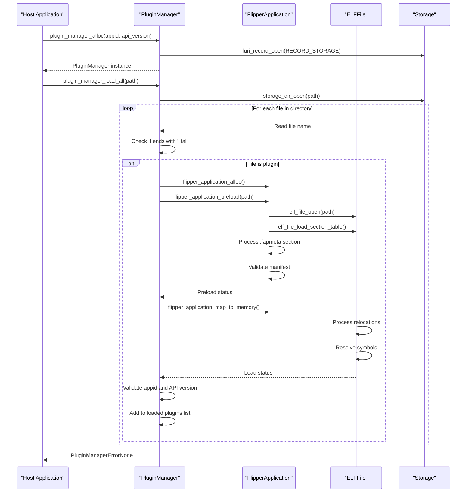
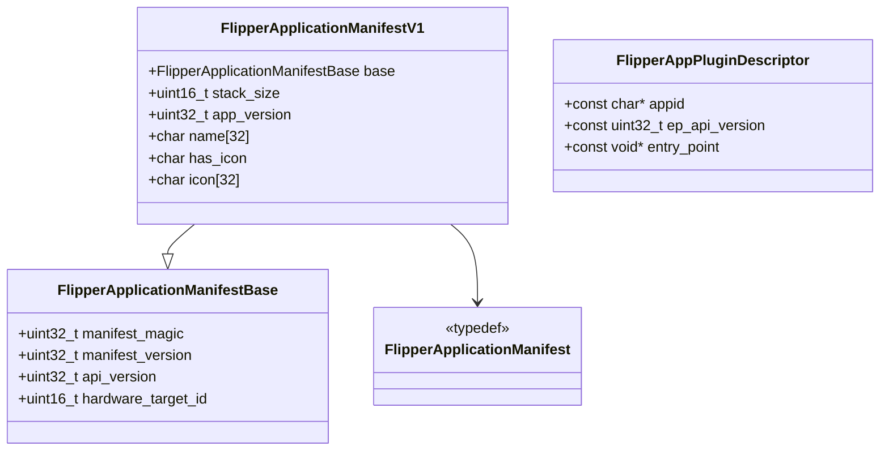
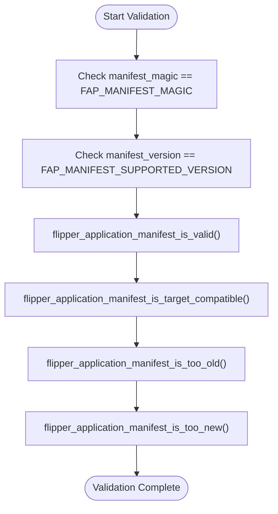
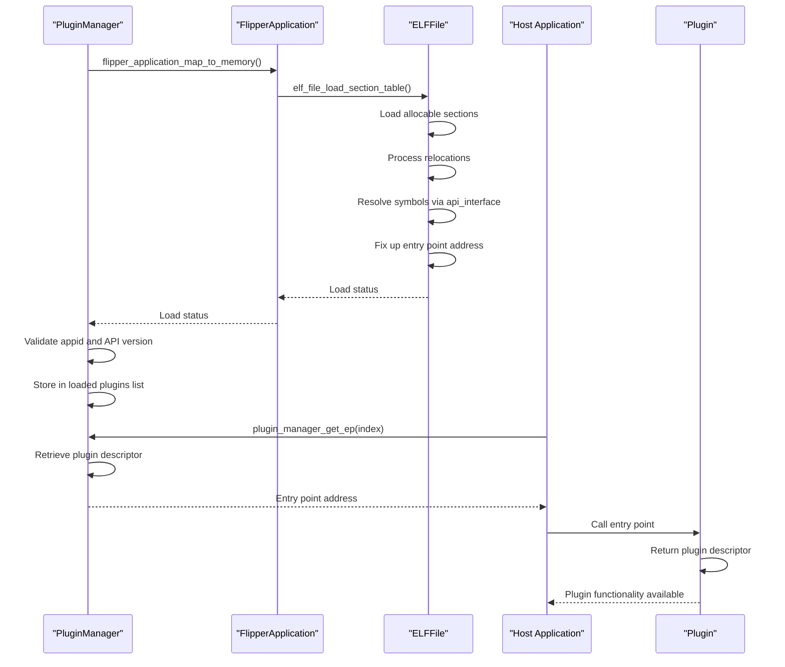
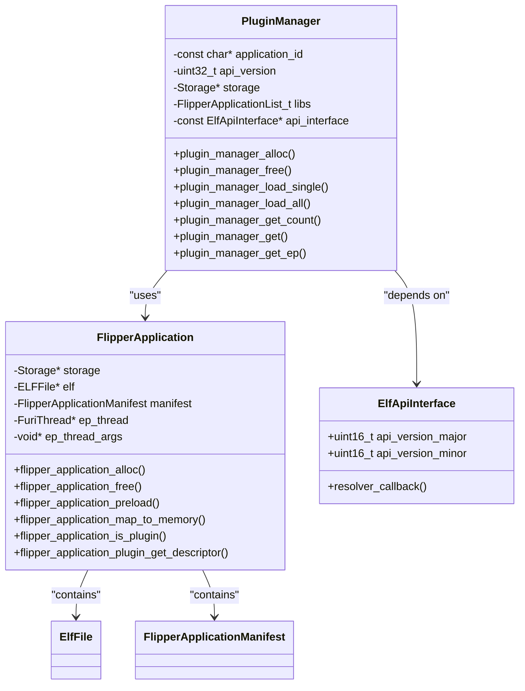
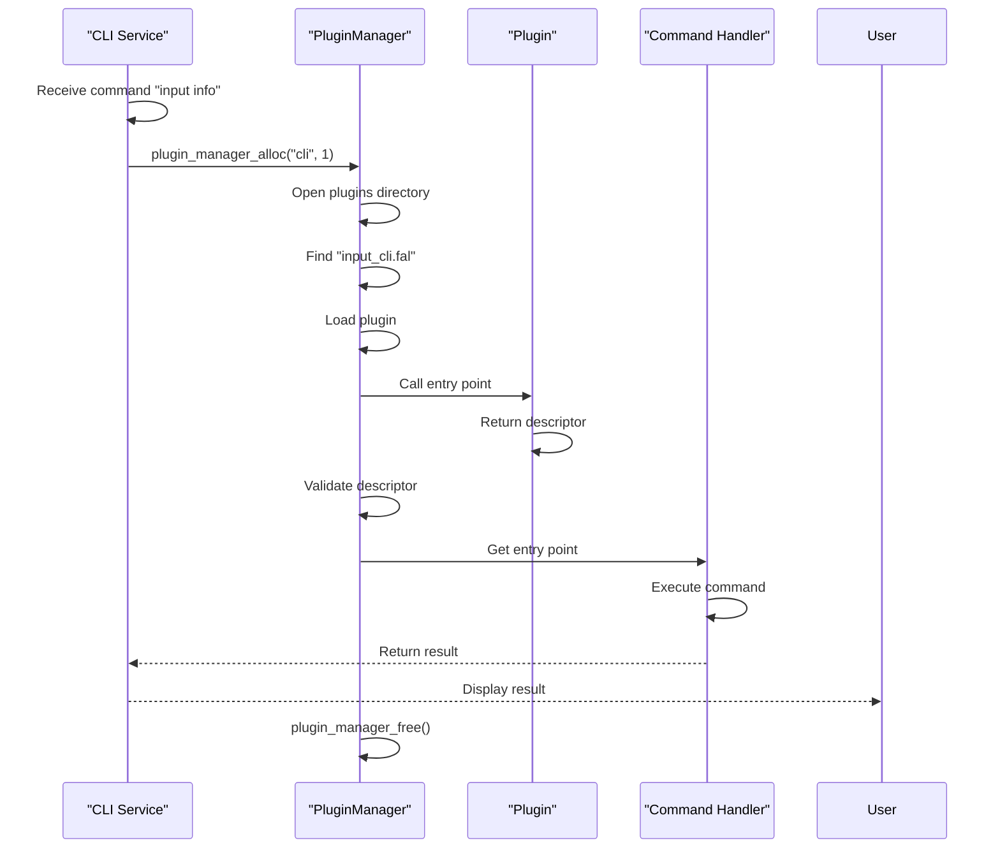
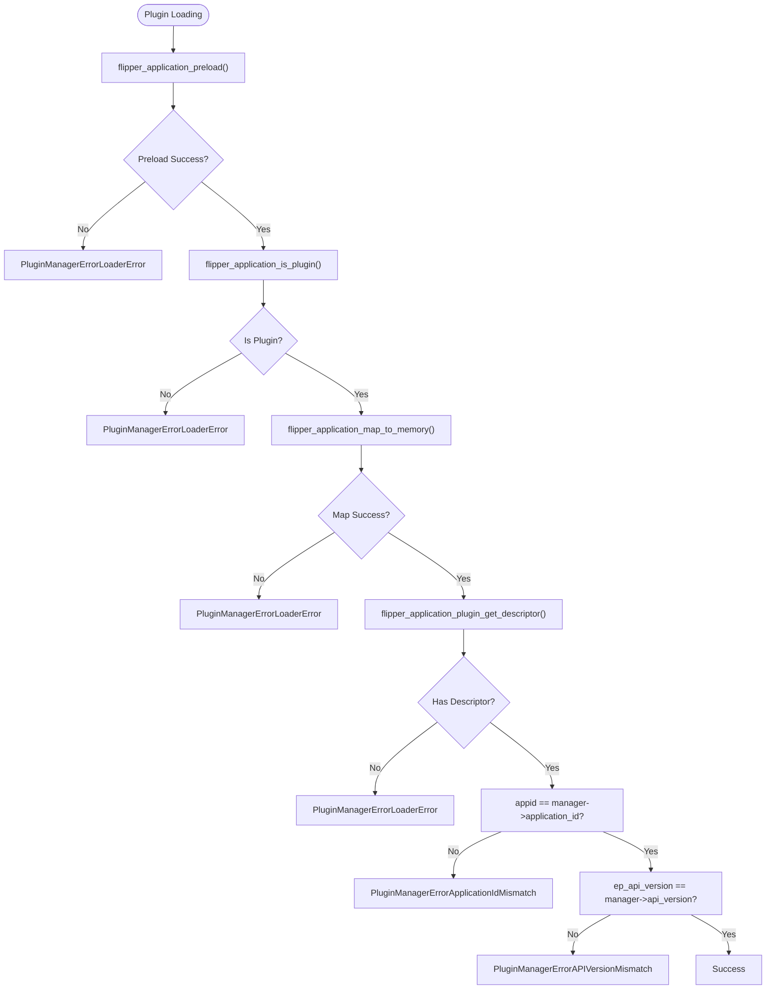
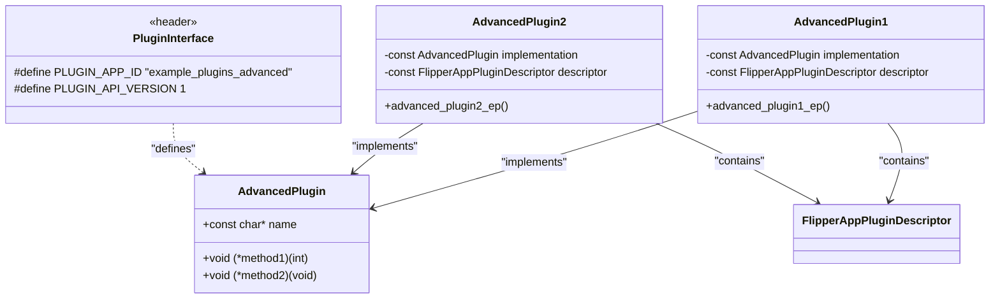

# Plugin Loading Mechanism

<cite>
**Referenced Files in This Document**   
- [plugin_manager.c](file://lib/flipper_application/plugins/plugin_manager.c)
- [plugin_manager.h](file://lib/flipper_application/plugins/plugin_manager.h)
- [flipper_application.c](file://lib/flipper_application/flipper_application.c)
- [flipper_application.h](file://lib/flipper_application/flipper_application.h)
- [application_manifest.h](file://lib/flipper_application/application_manifest.h)
- [application_manifest.c](file://lib/flipper_application/application_manifest.c)
- [elf_file.c](file://lib/flipper_application/elf/elf_file.c)
- [elf_file.h](file://lib/flipper_application/elf/elf_file.h)
- [elf_api_interface.h](file://lib/flipper_application/elf/elf_api_interface.h)
- [cli.c](file://applications/services/cli/cli.c)
- [cli_i.h](file://applications/services/cli/cli_i.h)
- [input/application.fam](file://applications/services/input/application.fam)
- [plugin_interface.h](file://applications/examples/example_plugins_advanced/plugin_interface.h)
- [plugin1.c](file://applications/examples/example_plugins_advanced/plugin1.c)
- [plugin2.c](file://applications/examples/example_plugins_advanced/plugin2.c)
- [js_modules.c](file://applications/system/js_app/js_modules.c)
</cite>

## Table of Contents
1. [Introduction](#introduction)
2. [Plugin Discovery and Loading Process](#plugin-discovery-and-loading-process)
3. [Plugin Manifest and Metadata Validation](#plugin-manifest-and-metadata-validation)
4. [Plugin Initialization and Entry Point Invocation](#plugin-initialization-and-entry-point-invocation)
5. [Plugin Manager and Application Framework Integration](#plugin-manager-and-application-framework-integration)
6. [Plugin Registration with System Components](#plugin-registration-with-system-components)
7. [Error Handling and Common Issues](#error-handling-and-common-issues)
8. [Example Plugin Implementation](#example-plugin-implementation)
9. [Conclusion](#conclusion)

## Introduction
The Flipper Zero firmware implements a dynamic plugin loading mechanism that allows applications to extend their functionality through external modules. This system enables the core firmware to remain lightweight while supporting extensibility through plugins that can be loaded from the SD card or internal storage. The plugin architecture is designed for embedded systems with limited resources, providing a secure and efficient way to load and execute third-party code.

The plugin loading mechanism follows a structured process of discovery, validation, loading, and initialization. It uses ELF (Executable and Linkable Format) files with a .fal extension for plugins, which contain both code and metadata in a structured format. The system ensures compatibility through version checking and application ID validation, preventing incompatible plugins from being loaded.

This document provides a comprehensive analysis of the plugin loading mechanism, detailing the implementation from discovery through initialization, and explaining how plugins integrate with the core services of the Flipper Zero firmware.

## Plugin Discovery and Loading Process

The plugin discovery and loading process in the Flipper Zero firmware is managed by the PluginManager component, which handles both individual plugin loading and bulk loading from directories. The process begins with the allocation of a PluginManager instance that is configured with specific application ID and API version filters.



**Diagram sources**
- [plugin_manager.c](file://lib/flipper_application/plugins/plugin_manager.c#L27-L144)
- [flipper_application.c](file://lib/flipper_application/flipper_application.c#L172-L208)
- [elf_file.c](file://lib/flipper_application/elf/elf_file.c#L864-L923)

**Section sources**
- [plugin_manager.c](file://lib/flipper_application/plugins/plugin_manager.c#L110-L144)
- [flipper_application.c](file://lib/flipper_application/flipper_application.c#L204-L208)

## Plugin Manifest and Metadata Validation

The plugin manifest system in Flipper Zero firmware provides a structured way to store metadata about plugins, ensuring compatibility and proper integration with the host application. The manifest is stored in the .fapmeta section of the ELF file and contains critical information such as application ID, API version, hardware target, and other metadata.



The validation process for plugin manifests involves several critical checks to ensure compatibility and security:

1. **Magic Number Validation**: The manifest must contain the correct magic number (0x52474448) to identify it as a valid Flipper application manifest.
2. **Version Compatibility**: The manifest version must match the supported version (currently 1).
3. **API Version Checking**: The plugin's declared API version is compared against the host application's API version to ensure compatibility.
4. **Hardware Target Validation**: The plugin must be compatible with the current hardware target to prevent loading incompatible binaries.

The validation is performed through a series of functions that check different aspects of the manifest:



**Diagram sources**
- [application_manifest.h](file://lib/flipper_application/application_manifest.h#L15-L45)
- [application_manifest.c](file://lib/flipper_application/application_manifest.c#L6-L50)

**Section sources**
- [application_manifest.h](file://lib/flipper_application/application_manifest.h#L15-L90)
- [application_manifest.c](file://lib/flipper_application/application_manifest.c#L6-L50)
- [flipper_application.c](file://lib/flipper_application/flipper_application.c#L101-L120)

## Plugin Initialization and Entry Point Invocation

The plugin initialization process in the Flipper Zero firmware involves several stages of memory allocation, symbol resolution, and entry point invocation. Once a plugin has been successfully loaded and validated, the system prepares it for execution by mapping it into memory and resolving any external dependencies.



The entry point invocation follows a specific pattern where the plugin's entry point function returns a pointer to a `FlipperAppPluginDescriptor` structure. This descriptor contains the application ID, API version, and a pointer to the actual plugin implementation. This two-stage initialization process allows for deferred loading of plugin functionality and enables the host application to validate the plugin before fully integrating it.

The memory allocation process is carefully managed to ensure that plugins do not exceed their allocated stack size and that they are properly isolated from the host application's memory space. The ELF loader handles the mapping of sections to memory, applying relocations and resolving symbols through the provided API interface.

**Diagram sources**
- [plugin_manager.c](file://lib/flipper_application/plugins/plugin_manager.c#L52-L107)
- [flipper_application.c](file://lib/flipper_application/flipper_application.c#L104-L105)
- [elf_file.c](file://lib/flipper_application/elf/elf_file.c#L978-L1014)

**Section sources**
- [plugin_manager.c](file://lib/flipper_application/plugins/plugin_manager.c#L52-L107)
- [flipper_application.c](file://lib/flipper_application/flipper_application.c#L104-L105)
- [elf_file.c](file://lib/flipper_application/elf/elf_file.c#L978-L1014)

## Plugin Manager and Application Framework Integration

The PluginManager component serves as the bridge between the plugin loading system and the host application framework, providing a clean API for loading, managing, and accessing plugins. The integration is designed to be flexible, allowing different applications to use the plugin system for various purposes.



The PluginManager is initialized with specific parameters that define its behavior:

- **Application ID**: Used as a filter to ensure that only plugins intended for the specific host application are loaded
- **API Version**: Ensures compatibility between the plugin and host application APIs
- **API Interface**: Provides the symbol resolution mechanism for the ELF loader

The integration with the application framework is demonstrated in the CLI service, where plugins are used to extend command functionality. When a CLI command is invoked that corresponds to a plugin, the system dynamically loads the plugin, executes the command, and then unloads the plugin, minimizing memory usage.

**Diagram sources**
- [plugin_manager.h](file://lib/flipper_application/plugins/plugin_manager.h#L13-L83)
- [flipper_application.h](file://lib/flipper_application/flipper_application.h#L47-L142)
- [elf_api_interface.h](file://lib/flipper_application/elf/elf_api_interface.h#L9-L16)

**Section sources**
- [plugin_manager.h](file://lib/flipper_application/plugins/plugin_manager.h#L13-L83)
- [flipper_application.h](file://lib/flipper_application/flipper_application.h#L47-L142)
- [elf_api_interface.h](file://lib/flipper_application/elf/elf_api_interface.h#L9-L16)

## Plugin Registration with System Components

Plugins in the Flipper Zero firmware register themselves with core services such as the GUI, CLI, and other system components through well-defined interfaces. This registration process allows plugins to integrate seamlessly with the existing application framework and provide additional functionality.

The CLI service provides a clear example of plugin registration through the `CLI_PLUGIN_WRAPPER` macro, which creates a wrapper function that handles the plugin loading and execution process:



The registration process involves several key steps:

1. **Plugin Discovery**: The system scans designated directories for plugin files (with .fal extension)
2. **Metadata Extraction**: The plugin manifest is read to determine the plugin's capabilities and requirements
3. **Dependency Resolution**: Required services are identified and made available to the plugin
4. **Interface Registration**: The plugin registers its functionality with the appropriate system components
5. **Resource Allocation**: Memory and other resources are allocated for the plugin's execution

The input service plugin demonstrates this process with its manifest declaration:

```python
App(
    appid="input_cli",
    targets=["f7"],
    apptype=FlipperAppType.PLUGIN,
    entry_point="input_cli_plugin_ep",
    requires=["cli"],
    sources=["input_cli.c"],
)
```

This manifest specifies that the plugin requires the CLI service, ensuring that the dependency is resolved before the plugin is loaded.

**Diagram sources**
- [cli.c](file://applications/services/cli/cli.c#L490-L506)
- [cli_i.h](file://applications/services/cli/cli_i.h#L70-L86)
- [input/application.fam](file://applications/services/input/application.fam#L13-L19)

**Section sources**
- [cli.c](file://applications/services/cli/cli.c#L490-L506)
- [cli_i.h](file://applications/services/cli/cli_i.h#L70-L86)
- [input/application.fam](file://applications/services/input/application.fam#L13-L19)

## Error Handling and Common Issues

The plugin loading system in Flipper Zero firmware includes comprehensive error handling to manage various failure scenarios that may occur during the loading process. The system defines several error codes that provide specific information about the nature of any loading failures.



The most common issues encountered during plugin loading include:

1. **Application ID Mismatch**: The plugin's application ID does not match the expected ID from the PluginManager
2. **API Version Mismatch**: The plugin was compiled against a different API version than the current system
3. **Missing Dependencies**: Required services or libraries are not available
4. **Hardware Incompatibility**: The plugin was compiled for a different hardware target
5. **Corrupted Files**: The plugin file is damaged or incomplete

The system handles these issues gracefully by returning specific error codes and logging detailed error messages, which helps with debugging and troubleshooting. For example, when a version mismatch occurs, the system logs a specific error message indicating whether the plugin's API version is too old or too new compared to the host application.

**Diagram sources**
- [plugin_manager.c](file://lib/flipper_application/plugins/plugin_manager.c#L58-L97)
- [application_manifest.c](file://lib/flipper_application/application_manifest.c#L17-L42)

**Section sources**
- [plugin_manager.c](file://lib/flipper_application/plugins/plugin_manager.c#L58-L97)
- [application_manifest.c](file://lib/flipper_application/application_manifest.c#L17-L42)

## Example Plugin Implementation

The Flipper Zero firmware includes example plugins that demonstrate the proper implementation of the plugin interface. These examples show how to create plugins that can be dynamically loaded and integrated with host applications.



The example plugins follow a consistent pattern:

1. **Interface Definition**: A header file defines the plugin interface with function pointers and data structures
2. **Implementation**: The plugin implements the interface functions, which may call back into the host application
3. **Descriptor**: A static descriptor structure contains the application ID, API version, and entry point
4. **Entry Point**: A function that returns a pointer to the descriptor, serving as the plugin's entry point

The advanced plugin examples demonstrate how plugins can use both the firmware's public API and private application headers through the use of a CompoundApiInterface. This allows for more sophisticated interactions between plugins and host applications while maintaining proper encapsulation.

The plugin loading process for these examples is identical to other plugins, with the PluginManager validating the application ID ("example_plugins_advanced") and API version (1) before loading and initializing the plugin.

**Diagram sources**
- [plugin_interface.h](file://applications/examples/example_plugins_advanced/plugin_interface.h#L9-L16)
- [plugin1.c](file://applications/examples/example_plugins_advanced/plugin1.c#L34-L42)
- [plugin2.c](file://applications/examples/example_plugins_advanced/plugin2.c#L34-L42)

**Section sources**
- [plugin_interface.h](file://applications/examples/example_plugins_advanced/plugin_interface.h#L9-L16)
- [plugin1.c](file://applications/examples/example_plugins_advanced/plugin1.c#L16-L42)
- [plugin2.c](file://applications/examples/example_plugins_advanced/plugin2.c#L16-L42)

## Conclusion
The plugin loading mechanism in the Flipper Zero firmware provides a robust and secure system for dynamic module loading on embedded systems. By using ELF files with structured manifests, the system ensures compatibility and proper integration while maintaining the flexibility needed for extensibility.

The architecture demonstrates several key design principles for embedded systems:
- **Memory Efficiency**: Plugins are loaded only when needed and can be unloaded after use
- **Security**: Strict validation of manifests and API compatibility prevents incompatible or malicious code from executing
- **Modularity**: Clear interfaces between plugins and host applications promote code reuse and maintainability
- **Extensibility**: The system allows for new functionality to be added without modifying the core firmware

The implementation provides a solid foundation for developers creating plugins, with clear examples and well-documented interfaces. The error handling system ensures that issues are caught early and reported clearly, making troubleshooting more efficient.

For developers working with the plugin system, understanding the loading sequence, manifest structure, and integration patterns is essential for creating reliable and compatible plugins. The system's design balances flexibility with safety, making it suitable for the constrained environment of the Flipper Zero device.