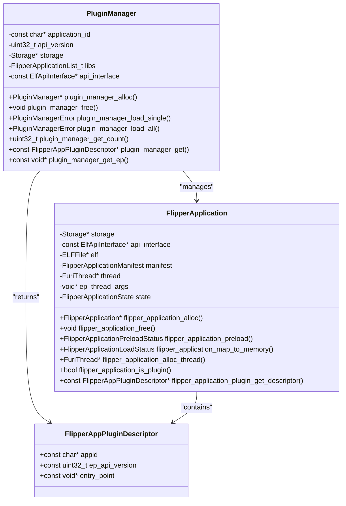
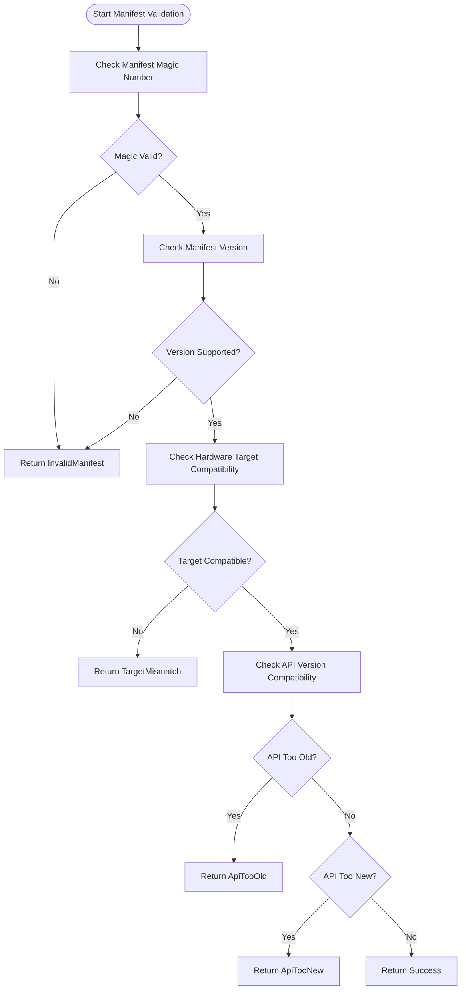
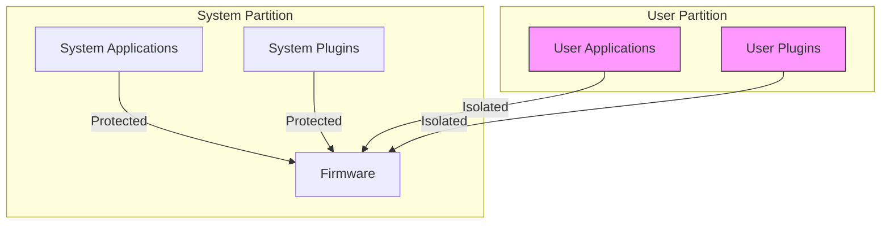
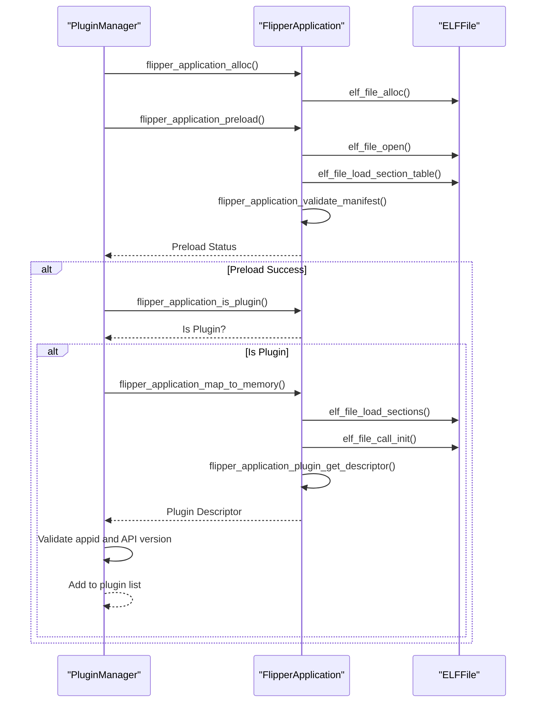
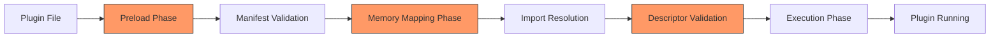
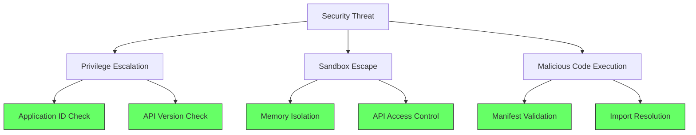
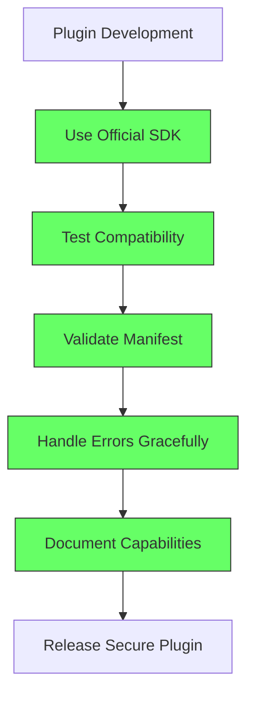

# Plugin Security Model

<cite>
**Referenced Files in This Document**   
- [plugin_manager.c](file://lib/flipper_application/plugins/plugin_manager.c)
- [plugin_manager.h](file://lib/flipper_application/plugins/plugin_manager.h)
- [flipper_application.c](file://lib/flipper_application/flipper_application.c)
- [application_manifest.c](file://lib/flipper_application/application_manifest.c)
- [application_manifest.h](file://lib/flipper_application/application_manifest.h)
- [flipper_application.h](file://lib/flipper_application/flipper_application.h)
- [elf_api_interface.h](file://lib/flipper_application/elf/elf_api_interface.h)
- [README.md](file://applications_user/README.md)
- [AppManifests.md](file://documentation/AppManifests.md)
</cite>

## Table of Contents
1. [Introduction](#introduction)
2. [Plugin Trust Levels and Domain Model](#plugin-trust-levels-and-domain-model)
3. [Plugin Manifest Validation](#plugin-manifest-validation)
4. [Secure Plugin Installation and Isolation](#secure-plugin-installation-and-isolation)
5. [Security Checks During Plugin Loading](#security-checks-during-plugin-loading)
6. [Relationship Between Security Model and Plugin Loading Process](#relationship-between-security-model-and-plugin-loading-process)
7. [Common Security Issues and Mitigation Strategies](#common-security-issues-and-mitigation-strategies)
8. [User Guidance for Safe Plugin Installation](#user-guidance-for-safe-plugin-installation)
9. [Developer Best Practices](#developer-best-practices)
10. [Conclusion](#conclusion)

## Introduction

The Flipper Zero firmware implements a comprehensive security model to protect the system from malicious or poorly written plugins. This document details the implementation of security measures designed to ensure the integrity and safety of the system when loading and executing third-party plugins. The security model encompasses manifest validation, API access control, and isolation mechanisms that prevent plugins from compromising system stability or security.

The plugin architecture is designed to allow extensibility while maintaining strict security controls. Plugins are dynamically loaded modules that extend the functionality of host applications, but they operate within a constrained environment that limits their access to system resources and APIs. This security model is critical for a device like Flipper Zero, which interacts with various wireless protocols and sensitive hardware components.

The analysis of the codebase reveals a multi-layered security approach that includes manifest validation, API version compatibility checks, hardware target verification, and strict access controls during the plugin loading process. These mechanisms work together to create a secure environment for plugin execution while allowing developers to extend the functionality of the device.

**Section sources**
- [plugin_manager.c](file://lib/flipper_application/plugins/plugin_manager.c#L1-L166)
- [flipper_application.c](file://lib/flipper_application/flipper_application.c#L100-L136)
- [application_manifest.c](file://lib/flipper_application/application_manifest.c#L1-L50)

## Plugin Trust Levels and Domain Model

The Flipper Zero firmware implements a trust model for plugins that is based on manifest validation and API access control rather than explicit trust levels. The security model relies on a combination of static analysis during plugin loading and runtime access controls to ensure that plugins operate within their designated boundaries.

The domain model for plugin security is centered around the `FlipperAppPluginDescriptor` structure, which defines the interface between a plugin and its host application. This descriptor contains critical security information including the application ID (`appid`), API version (`ep_api_version`), and entry point function pointer. The plugin manager uses these fields to enforce compatibility and access control policies.

**Diagram sources**
- [plugin_manager.h](file://lib/flipper_application/plugins/plugin_manager.h#L15-L20)
- [flipper_application.h](file://lib/flipper_application/flipper_application.h#L127-L131)
- [plugin_manager.c](file://lib/flipper_application/plugins/plugin_manager.c#L19-L25)

The plugin manager enforces a strict application ID filter, ensuring that only plugins designed for a specific host application can be loaded. This prevents plugins from one application from being loaded into another application, which could lead to security vulnerabilities. The API version check ensures compatibility between the plugin and the host application's API, preventing crashes or undefined behavior due to API mismatches.

Code signing or verification mechanisms are not explicitly implemented in the current security model. Instead, security relies on the integrity of the manifest validation process and the controlled loading environment. The system assumes that plugins are distributed through trusted channels and that users exercise caution when installing third-party plugins.

**Section sources**
- [plugin_manager.c](file://lib/flipper_application/plugins/plugin_manager.c#L88-L97)
- [flipper_application.h](file://lib/flipper_application/flipper_application.h#L127-L131)
- [plugin_manager.h](file://lib/flipper_application/plugins/plugin_manager.h#L24-L26)

## Plugin Manifest Validation

The plugin security model implements rigorous manifest validation to ensure that only properly formatted and compatible plugins can be loaded. The manifest validation process occurs during the plugin preloading phase and consists of multiple checks that verify the integrity and compatibility of the plugin.

The manifest structure is defined in `application_manifest.h` and contains critical security information including a magic number (`manifest_magic`), manifest version (`manifest_version`), API version, and hardware target ID. The validation process begins by checking the magic number and manifest version to ensure the manifest is valid and compatible with the current firmware version.

**Diagram sources**
- [application_manifest.c](file://lib/flipper_application/application_manifest.c#L6-L50)
- [flipper_application.c](file://lib/flipper_application/flipper_application.c#L100-L120)

The hardware target compatibility check ensures that plugins are only loaded on devices for which they were designed. This prevents plugins from attempting to access hardware features that don't exist on the current device, which could lead to crashes or undefined behavior. The API version checks ensure compatibility between the plugin and the firmware's API interface, preventing crashes due to API changes.

The manifest validation process is implemented in the `flipper_application_validate_manifest` function, which performs a series of checks in sequence. If any check fails, the plugin loading process is terminated with an appropriate error code. This layered approach to validation ensures that only plugins that pass all security checks can proceed to the loading phase.

The manifest also contains metadata such as the application name and icon, which are used for display purposes in the user interface. However, these fields are not used for security decisions, as they are purely cosmetic and do not affect the plugin's functionality or access rights.

**Section sources**
- [application_manifest.c](file://lib/flipper_application/application_manifest.c#L6-L50)
- [flipper_application.c](file://lib/flipper_application/flipper_application.c#L100-L120)
- [application_manifest.h](file://lib/flipper_application/application_manifest.h#L15-L34)

## Secure Plugin Installation and Isolation

The Flipper Zero firmware implements a secure plugin installation model that isolates user-installed plugins from system-critical components. The `applications_user` directory serves as the designated location for custom applications and plugins, providing a clear separation between system applications and user-installed content.

**Diagram sources**
- [README.md](file://applications_user/README.md#L1)
- [AppManifests.md](file://documentation/AppManifests.md#L29)

The `applications_user` directory is specifically designed for user-installed applications and plugins, as indicated by the README file which states: "Put your custom applications in this folder (or use applications/external)." This directory structure provides a clear separation between system applications and user-installed content, reducing the risk of malicious plugins compromising system stability.

Plugins are further isolated through the use of the `.fal` file extension, which identifies them as plugin libraries rather than standalone applications. The plugin manager only loads files with this extension, providing an additional layer of security by preventing the execution of unauthorized code. This file extension convention serves as a simple but effective access control mechanism.

The isolation model also extends to the build system, where external applications are built as `.fap` files that are installed on the SD card. This separation between firmware applications and external applications ensures that user-installed content cannot modify the core firmware or system applications. The build system enforces this separation through the `EXTERNAL` app type in the application manifest.

When plugins are loaded, they are mapped into memory as separate ELF files, which provides memory isolation from the host application and other plugins. This prevents plugins from directly accessing the memory space of other components, reducing the attack surface for potential exploits. The ELF loading mechanism ensures that plugins are loaded at safe memory addresses and that their code and data segments are properly isolated.

**Section sources**
- [README.md](file://applications_user/README.md#L1)
- [AppManifests.md](file://documentation/AppManifests.md#L29)
- [plugin_manager.c](file://lib/flipper_application/plugins/plugin_manager.c#L126-L127)

## Security Checks During Plugin Loading

The plugin loading process implements multiple security checks to ensure the integrity and compatibility of plugins before they are executed. These checks occur at various stages of the loading process and are designed to prevent the execution of malicious or incompatible code.

The loading process begins with the `plugin_manager_load_single` function, which performs a series of security checks before loading a plugin. The first check verifies that the file can be preloaded successfully, which includes parsing the ELF headers and validating the manifest. If this check fails, the plugin loading process is terminated immediately.

**Diagram sources**
- [plugin_manager.c](file://lib/flipper_application/plugins/plugin_manager.c#L52-L108)
- [flipper_application.c](file://lib/flipper_application/flipper_application.c#L204-L231)

The second check verifies that the loaded file is actually a plugin by calling `flipper_application_is_plugin()`. This function checks the application type in the manifest to ensure it is designated as a plugin rather than a standalone application. This prevents standalone applications from being loaded as plugins, which could lead to security vulnerabilities.

After the plugin is loaded into memory, the plugin manager retrieves the plugin descriptor by calling the plugin's entry point function. This descriptor contains the application ID and API version, which are validated against the expected values. The application ID check ensures that the plugin is designed for the specific host application, preventing cross-application plugin loading.

The API version check ensures compatibility between the plugin and the host application's API. If the API version in the plugin descriptor does not match the expected version, the plugin is rejected. This prevents plugins from using deprecated or incompatible API functions that could lead to crashes or security vulnerabilities.

Additional security checks include verifying that the plugin's entry point function returns a valid descriptor and that all required imports can be resolved. The ELF loader performs symbol resolution to ensure that the plugin can access the APIs it needs while preventing access to unauthorized functions.

**Section sources**
- [plugin_manager.c](file://lib/flipper_application/plugins/plugin_manager.c#L52-L108)
- [flipper_application.c](file://lib/flipper_application/flipper_application.c#L311-L336)
- [elf_api_interface.h](file://lib/flipper_application/elf/elf_api_interface.h#L9-L16)

## Relationship Between Security Model and Plugin Loading Process

The security model is tightly integrated with the plugin loading process, with security checks occurring at each stage of loading. This integration ensures that security is not an afterthought but a fundamental aspect of the plugin architecture.

The loading process is divided into distinct phases, each with its own security checks. The first phase is preloading, which involves opening the ELF file and validating the manifest. This phase ensures that the file is a valid plugin with a compatible manifest before any code is executed. The second phase is memory mapping, which loads the plugin's code and data segments into memory and resolves imports. This phase ensures that the plugin can access only the APIs it is authorized to use.

**Diagram sources**
- [flipper_application.c](file://lib/flipper_application/flipper_application.c#L204-L231)
- [plugin_manager.c](file://lib/flipper_application/plugins/plugin_manager.c#L52-L108)

The third phase is descriptor validation, which occurs after the plugin's entry point function is called. This phase verifies that the plugin is designed for the specific host application and that it uses a compatible API version. This multi-phase approach to security ensures that each layer of validation builds upon the previous one, creating a robust security model.

Untrusted plugins are restricted in their capabilities through the API access control mechanism. The `ElfApiInterface` structure defines the API functions that a plugin can access, and the resolver callback function controls which symbols can be resolved. This allows the host application to expose only a subset of its functionality to plugins, limiting their capabilities and reducing the attack surface.

The plugin manager maintains a list of loaded plugins and their descriptors, which can be used to enforce access control policies at runtime. For example, a host application could restrict certain functionality based on which plugins are loaded or prevent multiple instances of the same plugin from running simultaneously.

The integration of security checks throughout the loading process ensures that plugins cannot bypass security measures by exploiting timing vulnerabilities or race conditions. Each check is performed before proceeding to the next phase, creating a secure pipeline for plugin loading and execution.

**Section sources**
- [flipper_application.c](file://lib/flipper_application/flipper_application.c#L204-L231)
- [plugin_manager.c](file://lib/flipper_application/plugins/plugin_manager.c#L52-L108)
- [elf_api_interface.h](file://lib/flipper_application/elf/elf_api_interface.h#L9-L16)

## Common Security Issues and Mitigation Strategies

The Flipper Zero plugin security model addresses several common security issues that arise in plugin-based systems, including privilege escalation attempts and sandbox escape vulnerabilities. The model employs various mitigation strategies to prevent these issues and maintain system integrity.

Privilege escalation attempts are mitigated through the strict application ID and API version checks. By verifying that a plugin is designed for a specific host application and uses a compatible API version, the system prevents plugins from accessing functionality they are not authorized to use. This prevents a plugin designed for one application from being loaded into another application with higher privileges.

Sandbox escape vulnerabilities are addressed through memory isolation and API access control. Plugins are loaded as separate ELF files with their own memory space, preventing them from directly accessing the memory of other components. The API access control mechanism ensures that plugins can only call functions that are explicitly exposed through the `ElfApiInterface`, limiting their capabilities to those intended by the host application.

**Diagram sources**
- [plugin_manager.c](file://lib/flipper_application/plugins/plugin_manager.c#L88-L97)
- [flipper_application.c](file://lib/flipper_application/flipper_application.c#L72-L77)
- [application_manifest.c](file://lib/flipper_application/application_manifest.c#L6-L50)

Malicious code execution is prevented through manifest validation and import resolution. The manifest validation process ensures that only properly formatted plugins can be loaded, while the import resolution process verifies that all required symbols can be resolved before the plugin is executed. This prevents plugins from calling undefined or unauthorized functions.

The system also mitigates denial of service attacks by limiting the resources that plugins can consume. The stack size parameter in the application manifest allows the host application to control the amount of stack space allocated to a plugin, preventing stack overflow attacks. The memory mapping process ensures that plugins are loaded at safe memory addresses, preventing memory corruption vulnerabilities.

Additional mitigation strategies include logging security events and providing clear error messages for failed security checks. The system logs errors when plugins fail to load due to security violations, which can help developers identify and fix issues. Clear error messages help users understand why a plugin failed to load, reducing the risk of users attempting to bypass security measures.

**Section sources**
- [plugin_manager.c](file://lib/flipper_application/plugins/plugin_manager.c#L88-L97)
- [flipper_application.c](file://lib/flipper_application/flipper_application.c#L72-L77)
- [application_manifest.c](file://lib/flipper_application/application_manifest.c#L6-L50)

## User Guidance for Safe Plugin Installation

Users should follow specific guidelines to safely install third-party plugins on their Flipper Zero device. These guidelines help ensure that plugins are obtained from trusted sources and do not compromise the security or stability of the device.

When installing plugins, users should only download them from reputable sources such as the official Flipper Zero repository or well-known community developers. Plugins from unknown or untrusted sources may contain malicious code that could compromise the device or personal data. Users should verify the authenticity of plugins by checking digital signatures or hashes when available.

Plugins should be installed in the designated `applications_user` directory or the `applications/external` directory, as specified in the README file. This ensures that plugins are properly isolated from system-critical components and can be easily managed or removed if necessary. Users should avoid modifying system directories or replacing system applications with third-party versions.

Before installing a plugin, users should verify its compatibility with their device's firmware version. Plugins built for different firmware versions may not work correctly or could cause system instability. The manifest validation process will prevent incompatible plugins from loading, but users should still exercise caution when installing plugins.

Users should also be aware of the permissions and capabilities requested by plugins. While the Flipper Zero security model does not implement explicit permission prompts, users should research what a plugin does before installing it. Plugins that claim to access sensitive hardware features or system functions should be scrutinized carefully.

If a plugin fails to load, users should not attempt to modify the plugin or bypass security checks. Error messages from the system indicate why a plugin failed to load, and attempting to circumvent these checks could compromise device security. Instead, users should contact the plugin developer for support or seek alternative plugins.

Regularly updating plugins to their latest versions is also recommended, as updates may include security fixes or compatibility improvements. Users should remove unused plugins to reduce the attack surface and free up storage space.

**Section sources**
- [README.md](file://applications_user/README.md#L1)
- [AppManifests.md](file://documentation/AppManifests.md#L29)

## Developer Best Practices

Developers creating plugins for the Flipper Zero platform should follow specific security best practices to ensure their plugins are safe, compatible, and respect the security model of the system.

When developing plugins, developers should use the official SDK and follow the documented API guidelines. This ensures compatibility with the security model and prevents the use of undocumented or internal functions that could be removed or changed in future firmware versions. Developers should only use APIs that are explicitly documented as available for plugin use.

Plugins should be tested thoroughly against multiple firmware versions to ensure compatibility. The manifest should specify the correct API version and hardware target ID to prevent loading on incompatible devices. Developers should use the appropriate error codes and handle failures gracefully, providing clear error messages when security checks fail.

**Diagram sources**
- [AppManifests.md](file://documentation/AppManifests.md#L15-L30)
- [application_manifest.h](file://lib/flipper_application/application_manifest.h#L15-L34)

The plugin manifest should be carefully constructed with accurate information, including the correct application ID, API version, and hardware target. Developers should avoid setting excessive stack sizes or requesting unnecessary resources, as this can impact system performance and stability.

Plugins should be designed with security in mind, minimizing their attack surface and avoiding unsafe programming practices. This includes proper input validation, error handling, and memory management. Developers should avoid using deprecated functions or making assumptions about the system state that could change in future firmware versions.

When distributing plugins, developers should provide clear documentation about the plugin's functionality, requirements, and any potential risks. Plugins should be distributed through trusted channels and, if possible, include digital signatures or hashes to verify authenticity.

Developers should also consider the privacy implications of their plugins, especially those that handle sensitive data or interact with personal devices. Plugins should minimize data collection and storage, and clearly disclose any data handling practices to users.

Regular updates and maintenance are important for security, as they allow developers to address vulnerabilities and improve compatibility. Developers should monitor feedback from users and respond promptly to security concerns or bug reports.

**Section sources**
- [AppManifests.md](file://documentation/AppManifests.md#L15-L30)
- [application_manifest.h](file://lib/flipper_application/application_manifest.h#L15-L34)

## Conclusion

The Flipper Zero plugin security model provides a robust framework for safely extending the functionality of the device through third-party plugins. By implementing rigorous manifest validation, API access control, and memory isolation, the system protects against malicious or poorly written plugins while allowing for extensibility.

The security model is deeply integrated with the plugin loading process, with security checks occurring at each stage of loading. This ensures that only properly formatted and compatible plugins can be executed, reducing the risk of system instability or security breaches. The use of application ID and API version checks prevents privilege escalation and ensures compatibility between plugins and host applications.

The isolation of user-installed plugins in the `applications_user` directory provides a clear separation between system components and third-party content. This directory structure, combined with the `.fal` file extension convention, creates a secure environment for plugin installation and management.

While the current security model does not include code signing or explicit trust levels, it relies on a combination of technical controls and user education to maintain system integrity. Developers are encouraged to follow security best practices, and users are advised to install plugins only from trusted sources.

Future enhancements to the security model could include digital signature verification, more granular permission controls, and runtime monitoring of plugin behavior. These additions would further strengthen the security posture of the system while maintaining the flexibility that makes the Flipper Zero platform attractive to developers and users alike.

The comprehensive security measures implemented in the plugin architecture demonstrate a commitment to user safety and system stability, making the Flipper Zero a secure platform for experimentation and innovation.

[No sources needed since this section summarizes without analyzing specific files]