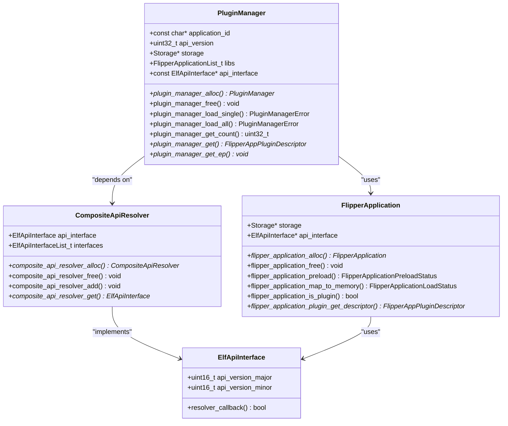
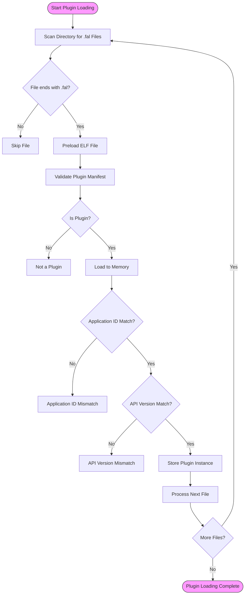
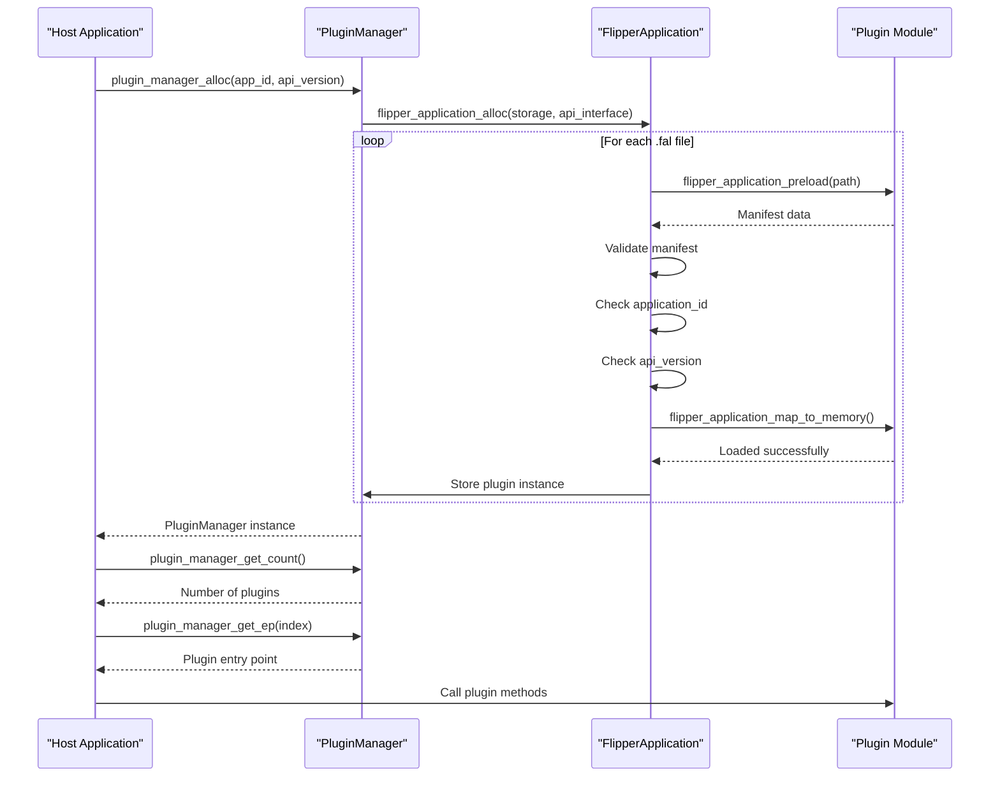
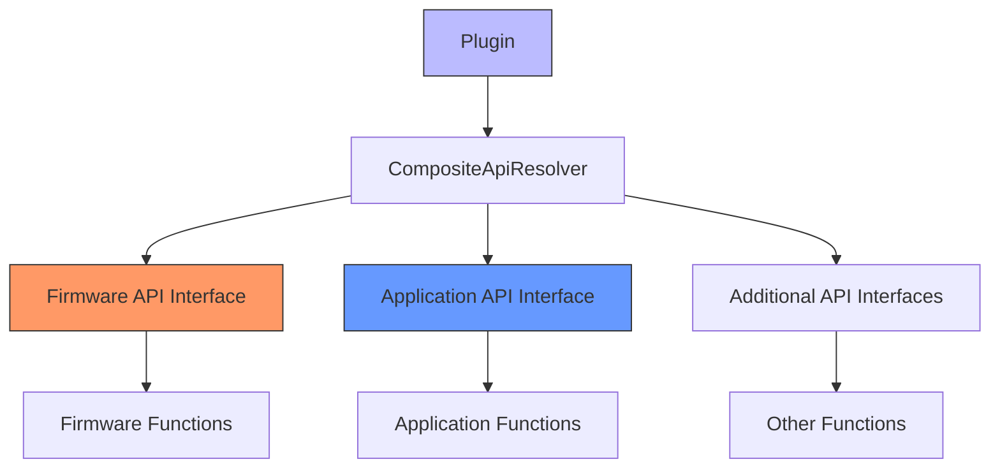
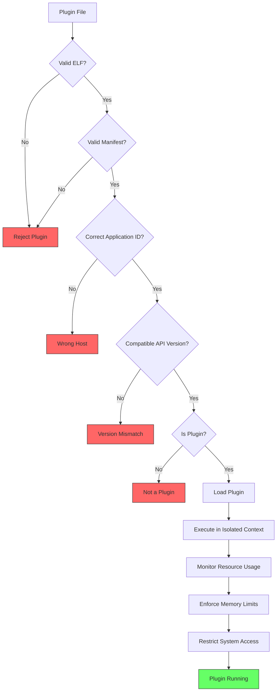
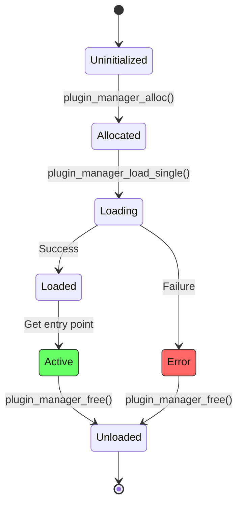
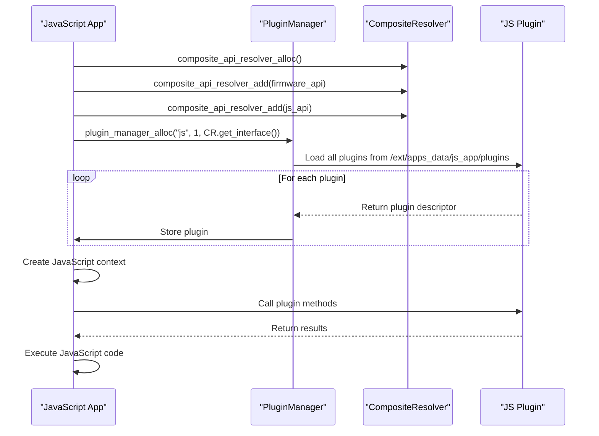

# Plugin System

<cite>
**Referenced Files in This Document**   
- [plugin_manager.h](file://lib/flipper_application/plugins/plugin_manager.h)
- [plugin_manager.c](file://lib/flipper_application/plugins/plugin_manager.c)
- [composite_resolver.h](file://lib/flipper_application/plugins/composite_resolver.h)
- [composite_resolver.c](file://lib/flipper_application/plugins/composite_resolver.c)
- [flipper_application.h](file://lib/flipper_application/flipper_application.h)
- [elf_api_interface.h](file://lib/flipper_application/elf/elf_api_interface.h)
- [application_manifest.h](file://lib/flipper_application/application_manifest.h)
- [example_advanced_plugins.c](file://applications/examples/example_plugins_advanced/example_advanced_plugins.c)
- [js_modules.c](file://applications/system/js_app/js_modules.c)
- [init_plugin.c](file://applications/external/mfkey/init_plugin.c)
</cite>

## Table of Contents
1. [Introduction](#introduction)
2. [Architecture Overview](#architecture-overview)
3. [Core Components](#core-components)
4. [Plugin Discovery and Loading](#plugin-discovery-and-loading)
5. [Interface Versioning and Compatibility](#interface-versioning-and-compatibility)
6. [Dependency Resolution](#dependency-resolution)
7. [Security Considerations](#security-considerations)
8. [Plugin Lifecycle Management](#plugin-lifecycle-management)
9. [Use Cases and Examples](#use-cases-and-examples)
10. [Conclusion](#conclusion)

## Introduction

The Flipper Zero firmware implements a robust plugin system that enables extensibility and third-party development. This system allows external developers to create plugins that extend the functionality of the device without modifying the core firmware. The plugin architecture is designed with security, compatibility, and ease of use in mind, providing a structured interface for plugin-host communication.

The plugin system is built on dynamic loading of ELF (Executable and Linkable Format) files with a .fal extension, which are validated and loaded at runtime. Plugins are isolated from the core system while maintaining the ability to interact with it through well-defined APIs. This design enables the Flipper Zero to support a wide range of third-party applications and tools while maintaining system stability and security.

The architecture supports multiple plugin hosts within the firmware, each with their own application-specific interfaces. This allows different subsystems of the Flipper Zero to expose their functionality to plugins in a controlled manner. The system also includes mechanisms for version compatibility, dependency resolution, and error handling to ensure reliable operation.

**Section sources**
- [plugin_manager.h](file://lib/flipper_application/plugins/plugin_manager.h)
- [flipper_application.h](file://lib/flipper_application/flipper_application.h)

## Architecture Overview

The Flipper Zero plugin system follows a modular architecture with clear separation between the plugin manager, composite resolver, and individual plugin modules. The system is designed to provide a secure and reliable mechanism for loading and executing third-party code while maintaining compatibility across firmware versions.

```mermaid
graph TD
A[Plugin Host Application] --> B[PluginManager]
B --> C[CompositeApiResolver]
C --> D[Firmware API Interface]
C --> E[Application API Interface]
B --> F[Storage System]
F --> G[Plugin Files (.fal)]
B --> H[FlipperApplication]
H --> I[ELF Loader]
I --> J[Symbol Resolution]
K[Plugin Module] --> L[Plugin Manifest]
K --> M[Plugin Descriptor]
K --> N[Entry Point]
B --> K
style A fill:#f9f,stroke:#333
style K fill:#bbf,stroke:#333
```

**Diagram sources**
- [plugin_manager.h](file://lib/flipper_application/plugins/plugin_manager.h)
- [composite_resolver.h](file://lib/flipper_application/plugins/composite_resolver.h)
- [flipper_application.h](file://lib/flipper_application/flipper_application.h)

The architecture consists of several key components that work together to manage plugins. The PluginManager acts as the central coordinator, responsible for discovering, loading, and managing plugin instances. It interfaces with the CompositeApiResolver to resolve dependencies between plugins and the host application. The FlipperApplication component handles the low-level details of loading ELF files and managing memory allocation.

Plugins are stored as .fal files on the device's storage system and are discovered by scanning designated directories. Each plugin contains a manifest that describes its metadata, including the application ID, API version, and entry point. The system validates this information before loading the plugin to ensure compatibility with the host application.

**Section sources**
- [plugin_manager.h](file://lib/flipper_application/plugins/plugin_manager.h)
- [composite_resolver.h](file://lib/flipper_application/plugins/composite_resolver.h)
- [flipper_application.h](file://lib/flipper_application/flipper_application.h)

## Core Components

The plugin system is built on several core components that provide the foundation for plugin management and execution. The PluginManager is the primary interface for host applications to interact with plugins. It provides methods for loading individual plugins or all plugins in a directory, retrieving plugin descriptors, and managing the plugin lifecycle.



**Diagram sources**
- [plugin_manager.h](file://lib/flipper_application/plugins/plugin_manager.h)
- [composite_resolver.h](file://lib/flipper_application/plugins/composite_resolver.h)
- [flipper_application.h](file://lib/flipper_application/flipper_application.h)

The CompositeApiResolver is a key component that enables plugins to access both firmware-level APIs and application-specific APIs. It acts as a composite of multiple API interfaces, allowing plugins to resolve symbols from different sources. This design enables a plugin to use both core system functions and host application functions through a single interface.

The FlipperApplication component is responsible for the low-level details of loading and executing ELF files. It handles tasks such as memory mapping, symbol resolution, and relocation processing. This component abstracts the complexity of ELF file handling, providing a simple interface for the PluginManager to use.

**Section sources**
- [plugin_manager.h](file://lib/flipper_application/plugins/plugin_manager.h)
- [composite_resolver.h](file://lib/flipper_application/plugins/composite_resolver.h)
- [flipper_application.h](file://lib/flipper_application/flipper_application.h)

## Plugin Discovery and Loading

The plugin discovery and loading process in the Flipper Zero firmware follows a systematic approach to ensure reliability and security. The process begins with the PluginManager scanning designated directories for files with the .fal extension. These directories can be either in the internal storage (APP_ASSETS_PATH) for built-in plugins or in external storage (APP_DATA_PATH) for user-installed plugins.



**Diagram sources**
- [plugin_manager.c](file://lib/flipper_application/plugins/plugin_manager.c)
- [flipper_application.c](file://lib/flipper_application/flipper_application.c)

The loading process involves several validation steps to ensure plugin compatibility and integrity. First, the ELF file is preloaded to validate its structure and read the manifest. The manifest contains critical information such as the application ID, API version, and entry point. The system verifies that the application ID matches the expected value for the host application, ensuring that plugins are only loaded by their intended hosts.

Next, the API version is checked to ensure compatibility between the plugin and host application. This versioning system allows for backward compatibility while preventing plugins from using APIs that don't exist in the current firmware version. If both checks pass, the plugin is loaded into memory and its entry point is resolved.

The system also supports loading plugins from both internal and external storage, providing flexibility for different deployment scenarios. Built-in plugins are typically stored in the internal assets directory, while user-installed plugins are stored on external storage such as an SD card.

**Section sources**
- [plugin_manager.c](file://lib/flipper_application/plugins/plugin_manager.c)
- [flipper_application.c](file://lib/flipper_application/flipper_application.c)

## Interface Versioning and Compatibility

The Flipper Zero plugin system implements a robust versioning mechanism to ensure compatibility between plugins and host applications. This system uses a combination of application IDs and API versions to manage compatibility across firmware updates and plugin releases.



**Diagram sources**
- [plugin_manager.c](file://lib/flipper_application/plugins/plugin_manager.c)
- [flipper_application.c](file://lib/flipper_application/flipper_application.c)

The versioning system is implemented through the PLUGIN_APP_ID and PLUGIN_API_VERSION macros defined in plugin interface headers. The application ID ensures that plugins are only loaded by their intended host applications, preventing incompatible plugins from being loaded. The API version provides a mechanism for managing changes to the plugin interface over time.

When a plugin is loaded, the PluginManager compares the API version specified in the plugin's manifest with the version expected by the host application. If the versions don't match, the plugin is rejected with a PluginManagerErrorAPIVersionMismatch error. This strict version checking prevents plugins from using APIs that don't exist or have changed in incompatible ways.

The system also supports backward compatibility through the ElfApiInterface structure, which includes major and minor version numbers. Host applications can implement multiple versions of their API interface to support older plugins while introducing new features for newer plugins. This allows for gradual evolution of the plugin ecosystem without breaking existing plugins.

**Section sources**
- [plugin_manager.c](file://lib/flipper_application/plugins/plugin_manager.c)
- [application_manifest.h](file://lib/flipper_application/application_manifest.h)

## Dependency Resolution

The dependency resolution system in the Flipper Zero plugin architecture is centered around the CompositeApiResolver component. This component enables plugins to access both firmware-level APIs and application-specific APIs through a unified interface. The resolver acts as a composite of multiple API interfaces, allowing plugins to resolve symbols from different sources.



**Diagram sources**
- [composite_resolver.c](file://lib/flipper_application/plugins/composite_resolver.c)
- [elf_api_interface.h](file://lib/flipper_application/elf/elf_api_interface.h)

The CompositeApiResolver is constructed by adding multiple ElfApiInterface instances to it. Each interface represents a set of functions that can be resolved by the resolver. When a plugin requests a symbol, the resolver iterates through its registered interfaces in order, attempting to resolve the symbol with each one. This allows for a hierarchical resolution process where more specific interfaces can override functions from more general interfaces.

The system supports both public firmware APIs and private application APIs. The firmware API interface provides access to core system functions such as storage, threading, and hardware access. Application-specific interfaces provide access to functionality specific to the host application. This separation ensures that plugins can only access functionality that has been explicitly exposed by the host application.

The resolver also handles symbol hashing and address resolution, converting symbolic names to memory addresses that can be used by the plugin. This process is transparent to the plugin, which can call functions by name as if they were linked at compile time.

**Section sources**
- [composite_resolver.c](file://lib/flipper_application/plugins/composite_resolver.c)
- [elf_api_interface.h](file://lib/flipper_application/elf/elf_api_interface.h)

## Security Considerations

The Flipper Zero plugin system incorporates several security measures to protect the device and its users from malicious or poorly written plugins. The primary security mechanism is the strict validation of plugin metadata, including application ID and API version checks. These checks ensure that only compatible and authorized plugins are loaded by each host application.



**Diagram sources**
- [plugin_manager.c](file://lib/flipper_application/plugins/plugin_manager.c)
- [flipper_application.c](file://lib/flipper_application/flipper_application.c)

Plugins are executed in a restricted context that limits their access to system resources. They can only call functions that are explicitly exposed through the API interfaces provided by the host application. This capability-based security model prevents plugins from accessing hardware or system functions that they shouldn't have access to.

The system also enforces memory limits and monitors resource usage to prevent plugins from consuming excessive system resources. This helps maintain system stability even if a plugin contains bugs or malicious code. Additionally, plugins are loaded into isolated memory spaces to prevent them from interfering with the host application or other plugins.

The use of ELF files with a custom .fal extension provides an additional layer of security by making it more difficult for unauthorized code to be executed on the device. The manifest-based approach also allows for future extensions such as code signing and integrity verification.

**Section sources**
- [plugin_manager.c](file://lib/flipper_application/plugins/plugin_manager.c)
- [flipper_application.c](file://lib/flipper_application/flipper_application.c)

## Plugin Lifecycle Management

The plugin lifecycle in the Flipper Zero firmware is managed through a well-defined sequence of operations that ensure proper initialization, execution, and cleanup. The PluginManager is responsible for coordinating the lifecycle of all loaded plugins, providing methods for loading, accessing, and freeing plugin instances.



**Diagram sources**
- [plugin_manager.c](file://lib/flipper_application/plugins/plugin_manager.c)
- [flipper_application.c](file://lib/flipper_application/flipper_application.c)

The lifecycle begins with the allocation of a PluginManager instance using the plugin_manager_alloc function. This initializes the manager with the host application's ID, API version, and API interface. The manager is then ready to load plugins that match these criteria.

Plugins are loaded using either the plugin_manager_load_single function for individual plugins or plugin_manager_load_all for loading all plugins in a directory. During loading, each plugin is validated, loaded into memory, and its entry point is resolved. Successfully loaded plugins are stored in the manager's internal list for later access.

When the host application is finished using the plugins, the plugin_manager_free function is called to clean up all resources. This function iterates through all loaded plugins, freeing their memory and closing any associated resources. This ensures that no memory leaks occur and that the system returns to a clean state.

The system also provides methods for querying the number of loaded plugins and accessing individual plugin instances by index. This allows host applications to iterate through all loaded plugins and call their methods as needed.

**Section sources**
- [plugin_manager.c](file://lib/flipper_application/plugins/plugin_manager.c)
- [flipper_application.c](file://lib/flipper_application/flipper_application.c)

## Use Cases and Examples

The Flipper Zero plugin system supports a variety of use cases, from simple functionality extensions to complex application frameworks. One example is the JavaScript application (js_app), which uses the plugin system to load JavaScript modules. This application creates a PluginManager instance with its own application ID and API version, allowing it to load JavaScript plugins that extend its functionality.



**Diagram sources**
- [js_modules.c](file://applications/system/js_app/js_modules.c)
- [example_advanced_plugins.c](file://applications/examples/example_plugins_advanced/example_advanced_plugins.c)

Another example is the MFKey plugin, which provides functionality for calculating cryptographic keys from RFID data. This plugin registers itself with the host application by implementing the plugin interface and providing a descriptor that includes its entry point. The host application can then load and use the plugin's functionality through the well-defined interface.

The system also supports plugins for various subsystems such as NFC card emulation, where different plugins can implement support for different types of cards. These plugins are loaded by the main NFC application and used to extend its functionality without modifying the core code.

The plugin system enables third-party developers to create specialized tools and applications that can be easily distributed and installed on the Flipper Zero. This ecosystem approach allows for rapid innovation and community-driven development while maintaining the stability and security of the core firmware.

**Section sources**
- [js_modules.c](file://applications/system/js_app/js_modules.c)
- [example_advanced_plugins.c](file://applications/examples/example_plugins_advanced/example_advanced_plugins.c)
- [init_plugin.c](file://applications/external/mfkey/init_plugin.c)

## Conclusion

The Flipper Zero plugin system provides a robust and secure framework for extending the functionality of the device through third-party development. The architecture is designed with extensibility, compatibility, and security in mind, enabling a rich ecosystem of plugins while maintaining system stability.

The system's use of application IDs and API versioning ensures that plugins are only loaded by their intended hosts and that they are compatible with the current firmware version. The CompositeApiResolver enables plugins to access both firmware-level APIs and application-specific APIs through a unified interface, providing flexibility while maintaining security.

The plugin discovery and loading process is systematic and thorough, with multiple validation steps to ensure plugin integrity and compatibility. The lifecycle management system ensures proper initialization, execution, and cleanup of plugins, preventing resource leaks and maintaining system stability.

Security is a key consideration in the design, with strict validation, capability-based access control, and resource monitoring to protect the device from malicious or poorly written plugins. The use of ELF files with a custom extension and manifest-based metadata provides a solid foundation for future security enhancements such as code signing and integrity verification.

Overall, the plugin system strikes a balance between openness and security, enabling community-driven innovation while protecting the device and its users. This architecture has proven effective in supporting a wide range of third-party applications and tools, contributing to the Flipper Zero's popularity and versatility.