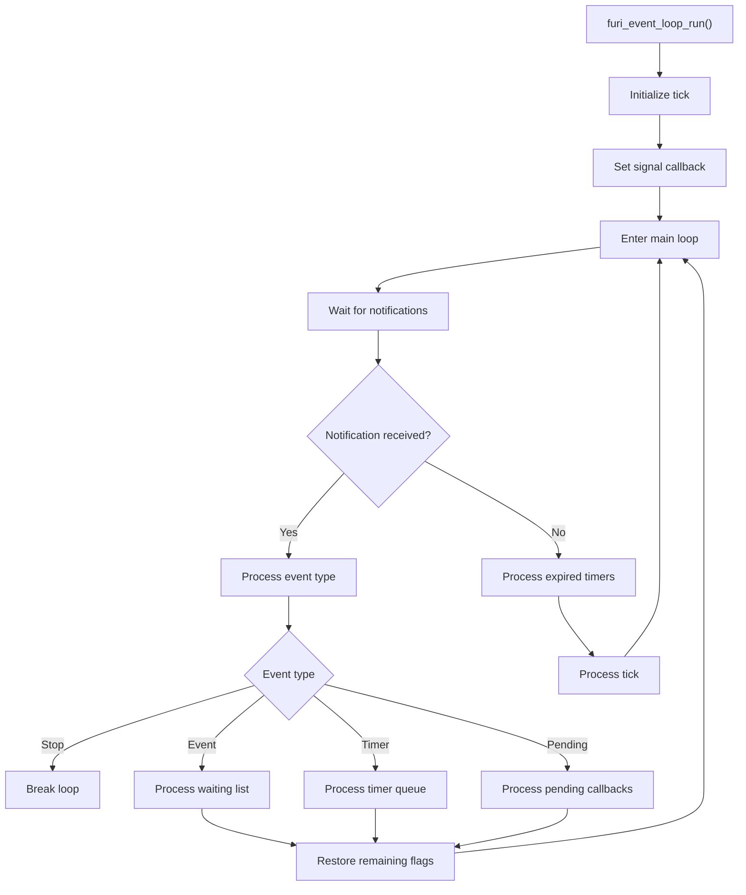
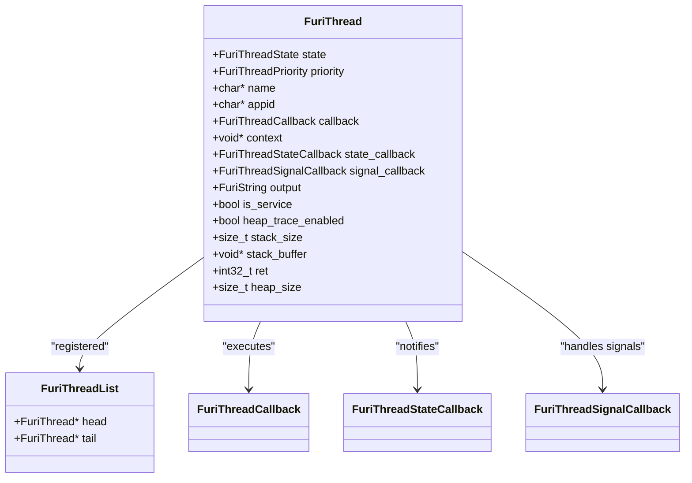
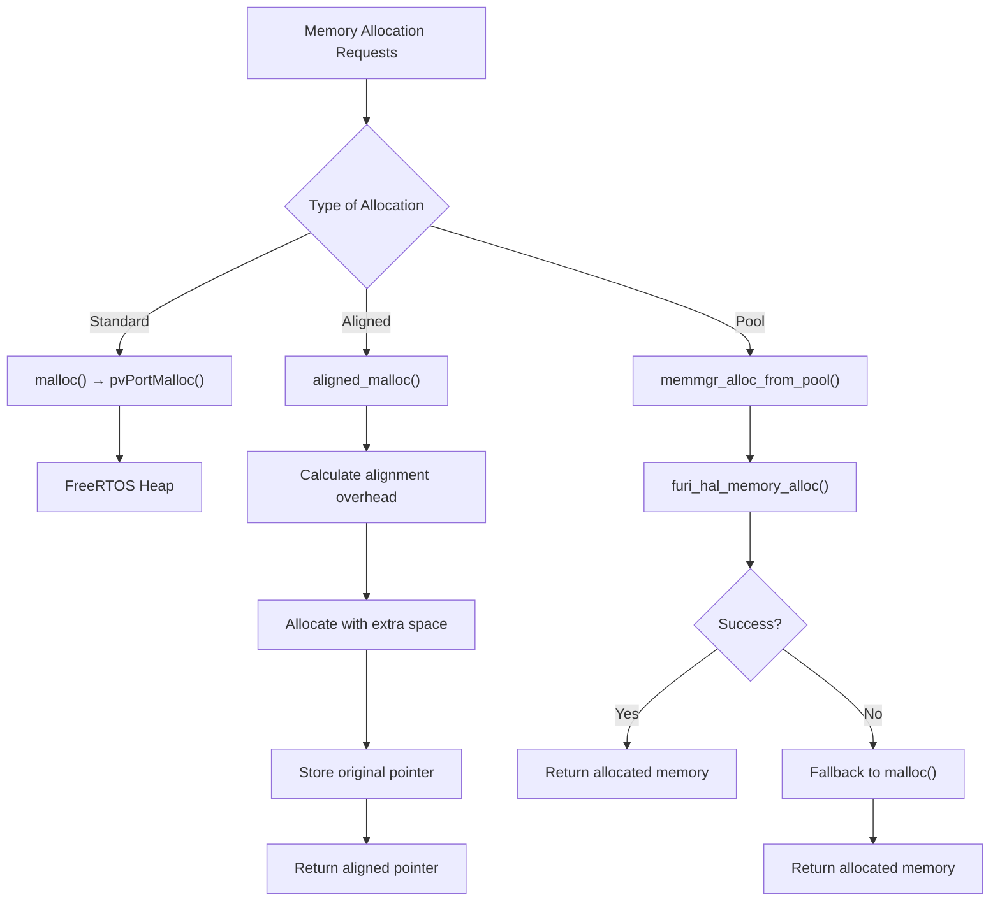
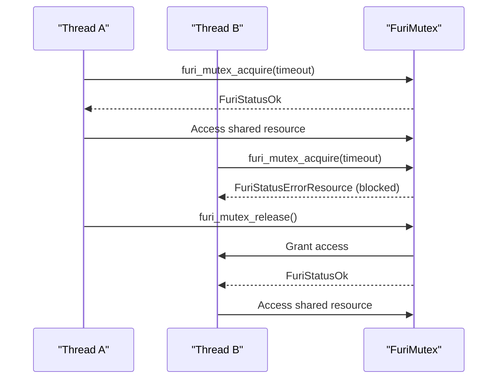
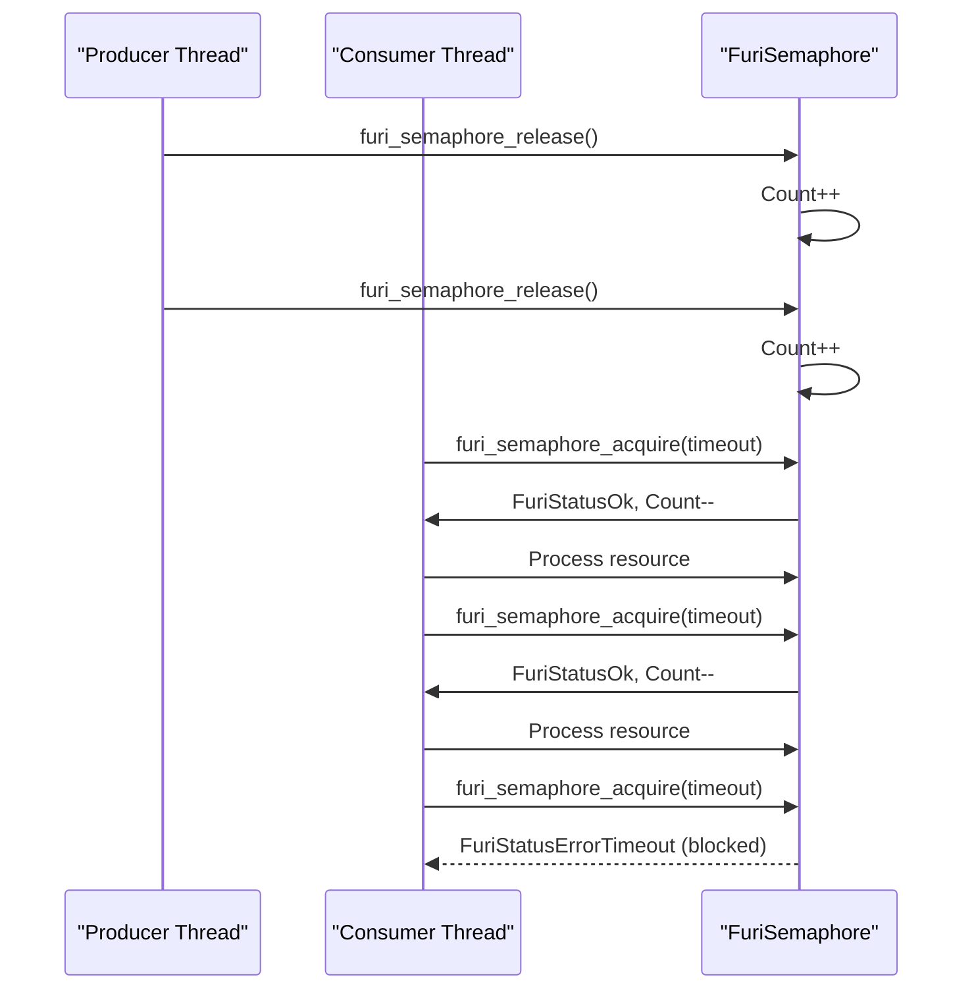
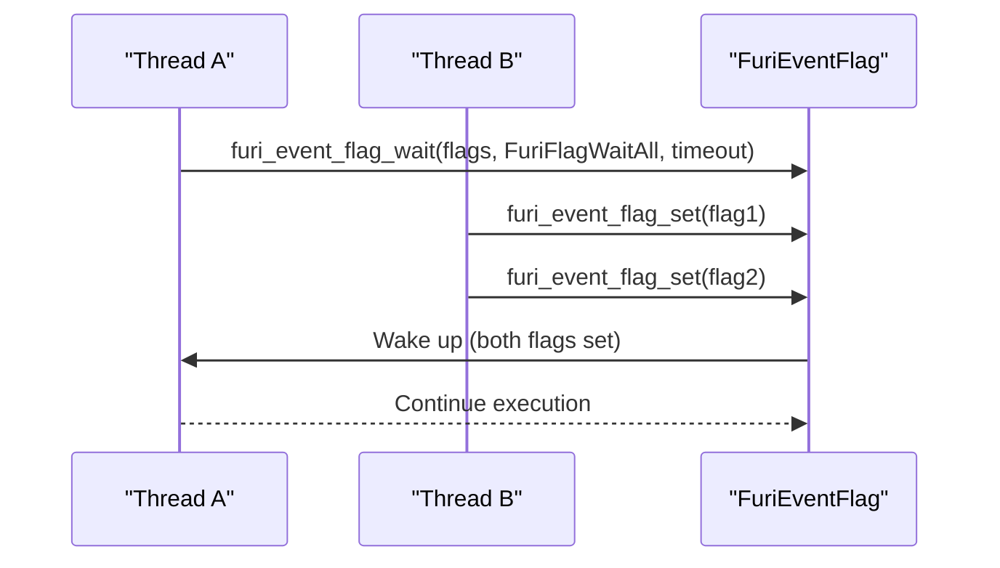
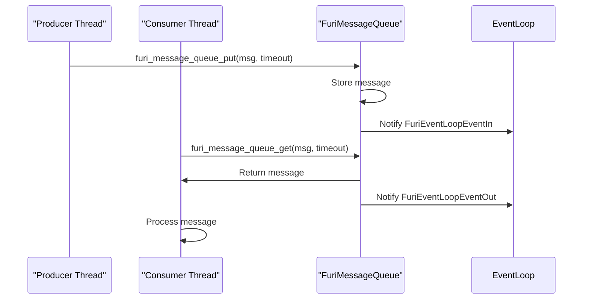
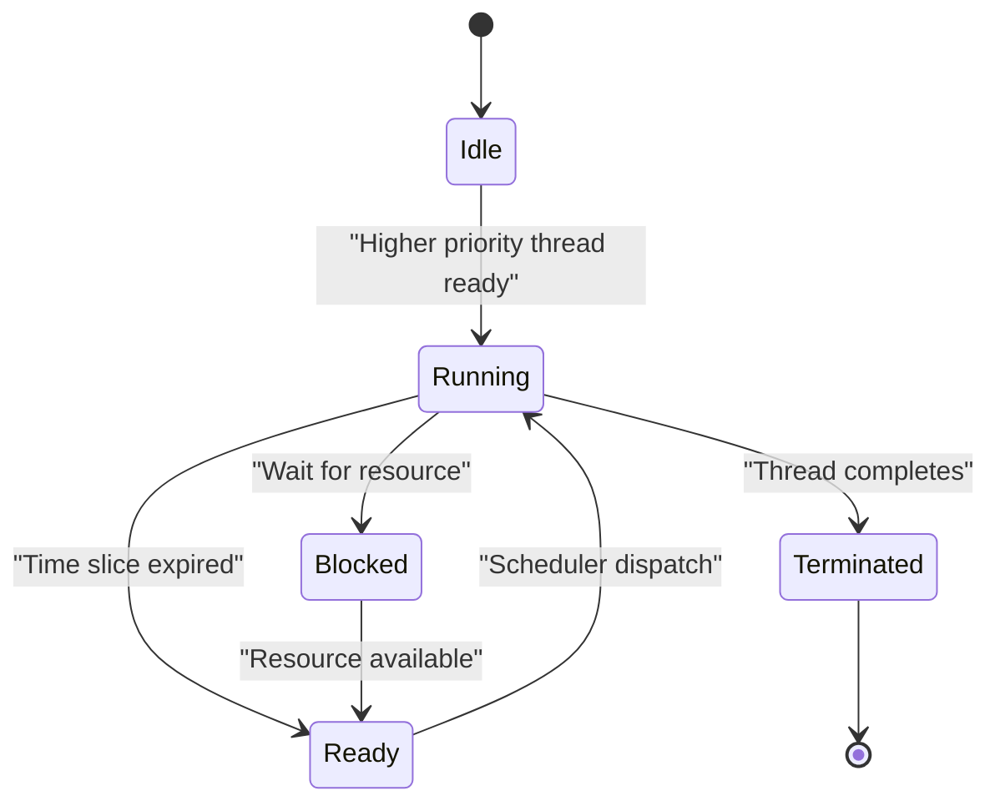

# Core Framework

<cite>
**Referenced Files in This Document**   
- [event_loop.h](file://furi/core/event_loop.h)
- [event_loop.c](file://furi/core/event_loop.c)
- [thread.h](file://furi/core/thread.h)
- [thread.c](file://furi/core/thread.c)
- [memmgr.h](file://furi/core/memmgr.h)
- [memmgr.c](file://furi/core/memmgr.c)
- [mutex.h](file://furi/core/mutex.h)
- [mutex.c](file://furi/core/mutex.c)
- [semaphore.h](file://furi/core/semaphore.h)
- [semaphore.c](file://furi/core/semaphore.c)
- [message_queue.h](file://furi/core/message_queue.h)
- [message_queue.c](file://furi/core/message_queue.c)
- [event_flag.h](file://furi/core/event_flag.h)
- [event_flag.c](file://furi/core/event_flag.c)
- [kernel.h](file://furi/core/kernel.h)
- [kernel.c](file://furi/core/kernel.c)
</cite>

## Table of Contents
1. [Introduction](#introduction)
2. [Event Loop Architecture](#event-loop-architecture)
3. [Threading Model](#threading-model)
4. [Memory Management System](#memory-management-system)
5. [Synchronization Primitives](#synchronization-primitives)
6. [Inter-Process Communication Mechanisms](#inter-process-communication-mechanisms)
7. [Real-Time Operating System Components](#real-time-operating-system-components)
8. [API Documentation](#api-documentation)
9. [Performance Considerations and Best Practices](#performance-considerations-and-best-practices)

## Introduction

The Furi OS core framework provides a comprehensive real-time operating system (RTOS) environment for the Flipper Zero device. Built on FreeRTOS, this framework offers a rich set of services for event-driven programming, thread management, memory allocation, and inter-thread communication. The architecture is designed to support the embedded nature of the device while providing developers with powerful tools for creating responsive applications. This document details the fundamental components of the Furi OS, including its event loop architecture, threading model, memory management system, synchronization primitives, and inter-process communication mechanisms.

**Section sources**
- [event_loop.h](file://furi/core/event_loop.h#L1-L162)
- [thread.h](file://furi/core/thread.h#L1-L199)

## Event Loop Architecture

The Furi OS event loop is a central component that manages asynchronous events in a reactive manner. Inspired by epoll/kqueue concepts at the low level and asyncio event loops at the high level, it provides an efficient mechanism for handling various types of events without blocking the main execution flow.

The event loop operates on a single thread and cannot be shared across threads. It continuously polls for events and processes them in a non-blocking fashion. The core of the event loop is implemented around FreeRTOS task notifications, which are used to signal different types of events such as message queue activity, timer expiration, and stop commands.

**Diagram sources**
- [event_loop.c](file://furi/core/event_loop.c#L150-L250)

**Section sources**
- [event_loop.h](file://furi/core/event_loop.h#L1-L162)
- [event_loop.c](file://furi/core/event_loop.c#L1-L381)

### Event Loop API

The event loop provides several key functions for managing asynchronous operations:

- **furi_event_loop_alloc()**: Creates a new event loop instance
- **furi_event_loop_free()**: Frees an event loop instance
- **furi_event_loop_run()**: Starts the event loop processing
- **furi_event_loop_stop()**: Stops the event loop
- **furi_event_loop_tick_set()**: Sets a periodic tick callback
- **furi_event_loop_pend_callback()**: Schedules a function to be called after all pending operations

The event loop supports subscription to message queue events through `furi_event_loop_message_queue_subscribe()` and `furi_event_loop_message_queue_unsubscribe()`, allowing applications to react to message arrivals or departures without actively polling.

## Threading Model

Furi OS implements a preemptive multitasking model based on FreeRTOS, providing developers with fine-grained control over thread creation, scheduling, and management. The threading system supports multiple priority levels and various thread types optimized for different use cases.

**Diagram sources**
- [thread.h](file://furi/core/thread.h#L1-L199)
- [thread.c](file://furi/core/thread.c#L1-L756)

**Section sources**
- [thread.h](file://furi/core/thread.h#L1-L199)
- [thread.c](file://furi/core/thread.c#L1-L756)

### Thread Creation and Management

Furi OS provides three methods for thread creation, each suited to different scenarios:

1. **furi_thread_alloc()**: Creates a standard thread that can be fully managed
2. **furi_thread_alloc_service()**: Creates a memory-efficient service thread with limitations
3. **furi_thread_alloc_ex()**: Creates an extended thread with additional parameters

Service threads are optimized for memory usage but have important limitations: they cannot return from their callback function, cannot be joined or freed, and their stack size cannot be altered after creation.

### Thread States and Priorities

Threads in Furi OS can exist in one of three states:
- **FuriThreadStateStopped**: Thread is not running
- **FuriThreadStateStarting**: Thread is in the process of starting
- **FuriThreadStateRunning**: Thread is actively executing

The system supports multiple priority levels:
- **FuriThreadPriorityIdle**: Lowest priority
- **FuriThreadPriorityLowest** to **FuriThreadPriorityHighest**: Graduated priority levels
- **FuriThreadPriorityIsr**: Highest priority for deferred ISR processing

Thread properties such as name, application ID, stack size, and callback function can only be modified when the thread is in the stopped state.

## Memory Management System

The Furi OS memory management system provides a comprehensive set of functions for dynamic memory allocation and tracking, built on top of FreeRTOS's heap management. The system is designed to be efficient and reliable in the constrained environment of an embedded device.

**Diagram sources**
- [memmgr.h](file://furi/core/memmgr.h#L1-L77)
- [memmgr.c](file://furi/core/memmgr.c#L1-L112)

**Section sources**
- [memmgr.h](file://furi/core/memmgr.h#L1-L77)
- [memmgr.c](file://furi/core/memmgr.c#L1-L112)

### Memory Management Functions

The memory management system provides the following key functions:

- **memmgr_get_free_heap()**: Returns the current free heap size in bytes
- **memmgr_get_total_heap()**: Returns the total heap size in bytes
- **memmgr_get_minimum_free_heap()**: Returns the minimum free heap size recorded
- **aligned_malloc()** and **aligned_free()**: Allocate and free memory with specific alignment requirements
- **memmgr_alloc_from_pool()**: Allocate memory from a separate memory pool that cannot be freed
- **memmgr_pool_get_free()**: Get the free size of the memory pool
- **memmgr_pool_get_max_block()**: Get the maximum free block size from the memory pool

The system also provides standard C library memory functions (malloc, free, realloc, calloc, strdup) that are wrapped around FreeRTOS's memory management functions, ensuring consistent behavior across the system.

## Synchronization Primitives

Furi OS provides several synchronization primitives to coordinate access to shared resources and manage thread interactions. These primitives are essential for developing reliable multithreaded applications and preventing race conditions.

### Mutexes

Mutexes in Furi OS are implemented as wrappers around FreeRTOS mutexes and provide mutual exclusion for critical sections. Two types of mutexes are supported:

- **FuriMutexTypeNormal**: Standard mutex that cannot be acquired recursively by the same thread
- **FuriMutexTypeRecursive**: Mutex that can be acquired multiple times by the same thread

**Diagram sources**
- [mutex.h](file://furi/core/mutex.h#L1-L62)
- [mutex.c](file://furi/core/mutex.c#L1-L124)

**Section sources**
- [mutex.h](file://furi/core/mutex.h#L1-L62)
- [mutex.c](file://furi/core/mutex.c#L1-L124)

The mutex API includes:
- **furi_mutex_alloc()**: Create a mutex of specified type
- **furi_mutex_free()**: Destroy and free a mutex
- **furi_mutex_acquire()**: Acquire the mutex with optional timeout
- **furi_mutex_release()**: Release the mutex
- **furi_mutex_get_owner()**: Get the thread ID of the mutex owner

### Semaphores

Semaphores provide a counting mechanism for resource management and thread coordination. They can be used to control access to a pool of resources or to signal between threads.

**Diagram sources**
- [semaphore.h](file://furi/core/semaphore.h#L1-L58)
- [semaphore.c](file://furi/core/semaphore.c#L1-L122)

**Section sources**
- [semaphore.h](file://furi/core/semaphore.h#L1-L58)
- [semaphore.c](file://furi/core/semaphore.c#L1-L122)

The semaphore API includes:
- **furi_semaphore_alloc()**: Create a semaphore with specified maximum and initial count
- **furi_semaphore_free()**: Destroy and free a semaphore
- **furi_semaphore_acquire()**: Acquire a semaphore unit with optional timeout
- **furi_semaphore_release()**: Release a semaphore unit
- **furi_semaphore_get_count()**: Get the current semaphore count

### Event Flags

Event flags provide a mechanism for threads to wait for specific combinations of events. They are implemented using FreeRTOS event groups and support up to 24 bits for event signaling.

**Diagram sources**
- [event_flag.h](file://furi/core/event_flag.h#L1-L70)
- [event_flag.c](file://furi/core/event_flag.c#L1-L149)

**Section sources**
- [event_flag.h](file://furi/core/event_flag.h#L1-L70)
- [event_flag.c](file://furi/core/event_flag.c#L1-L149)

The event flag API includes:
- **furi_event_flag_alloc()**: Create an event flag
- **furi_event_flag_free()**: Destroy and free an event flag
- **furi_event_flag_set()**: Set specified flags
- **furi_event_flag_clear()**: Clear specified flags
- **furi_event_flag_get()**: Get current flag values
- **furi_event_flag_wait()**: Wait for specified flags with various options

## Inter-Process Communication Mechanisms

Furi OS provides message queues as the primary mechanism for inter-thread communication. Message queues allow threads to exchange data in a thread-safe manner, with support for blocking and non-blocking operations.

**Diagram sources**
- [message_queue.h](file://furi/core/message_queue.h#L1-L93)
- [message_queue.c](file://furi/core/message_queue.c#L1-L234)

**Section sources**
- [message_queue.h](file://furi/core/message_queue.h#L1-L93)
- [message_queue.c](file://furi/core/message_queue.c#L1-L234)

### Message Queue API

The message queue system provides the following functions:

- **furi_message_queue_alloc()**: Create a message queue with specified capacity and message size
- **furi_message_queue_free()**: Destroy and free a message queue
- **furi_message_queue_put()**: Put a message into the queue with optional timeout
- **furi_message_queue_get()**: Get a message from the queue with optional timeout
- **furi_message_queue_get_capacity()**: Get the queue capacity in message count
- **furi_message_queue_get_message_size()**: Get the size of messages in the queue
- **furi_message_queue_get_count()**: Get the current number of messages in the queue
- **furi_message_queue_get_space()**: Get the available space in the queue
- **furi_message_queue_reset()**: Reset the queue, removing all messages

Message queues are integrated with the event loop system, automatically notifying the event loop when messages are added or removed. This allows applications to react to queue activity without actively polling.

## Real-Time Operating System Components

The Furi OS kernel provides essential real-time operating system services that form the foundation of the entire system. These components ensure predictable timing behavior and reliable operation in the embedded environment.

### Thread Scheduling

The thread scheduler in Furi OS is based on FreeRTOS's preemptive scheduler, which selects the highest priority ready thread for execution. The scheduler supports time slicing for threads of the same priority and provides mechanisms for thread suspension and resumption.

**Diagram sources**
- [kernel.h](file://furi/core/kernel.h#L1-L126)
- [kernel.c](file://furi/core/kernel.c#L1-L204)

**Section sources**
- [kernel.h](file://furi/core/kernel.h#L1-L126)
- [kernel.c](file://furi/core/kernel.c#L1-L204)

### Kernel Functions

The kernel provides several critical functions for system operation:

- **furi_kernel_lock()** and **furi_kernel_unlock()**: Temporarily suspend and resume the scheduler
- **furi_kernel_restore_lock()**: Restore the kernel lock state
- **furi_delay_tick()** and **furi_delay_ms()**: Delay execution for specified time periods
- **furi_delay_until_tick()**: Delay until a specific tick count
- **furi_get_tick()**: Get the current system tick count
- **furi_ms_to_ticks()**: Convert milliseconds to tick counts

These functions allow precise control over thread execution and timing, which is essential for real-time applications.

## API Documentation

This section provides detailed documentation for the core OS services, including parameter details and return value explanations.

### Event Loop API

**furi_event_loop_alloc()**
- **Parameters**: None
- **Returns**: Pointer to the allocated event loop instance, or NULL on failure
- **Description**: Allocates and initializes a new event loop instance. Only one event loop can exist per thread.

**furi_event_loop_free()**
- **Parameters**: 
  - instance: Pointer to the event loop instance to free
- **Returns**: None
- **Description**: Frees an event loop instance. The event loop must be stopped before calling this function.

**furi_event_loop_run()**
- **Parameters**: 
  - instance: Pointer to the event loop instance to run
- **Returns**: None
- **Description**: Starts the event loop processing. This function runs continuously until stopped by furi_event_loop_stop().

**furi_event_loop_stop()**
- **Parameters**: 
  - instance: Pointer to the event loop instance to stop
- **Returns**: None
- **Description**: Stops the event loop. This function can be called from any thread.

**furi_event_loop_tick_set()**
- **Parameters**: 
  - instance: Pointer to the event loop instance
  - interval: Tick interval for the callback
  - callback: Function to call periodically
  - context: Context pointer passed to the callback
- **Returns**: None
- **Description**: Sets a periodic tick callback that is called when the event loop is idle.

### Threading API

**furi_thread_alloc()**
- **Parameters**: None
- **Returns**: Pointer to the allocated thread instance
- **Description**: Creates a new thread instance that can be fully configured and managed.

**furi_thread_alloc_service()**
- **Parameters**: 
  - name: Human-readable thread name (can be NULL)
  - stack_size: Stack size in bytes
  - callback: Function to execute in the thread
  - context: Context pointer passed to the callback
- **Returns**: Pointer to the allocated service thread instance
- **Description**: Creates a memory-efficient service thread with specific limitations.

**furi_thread_free()**
- **Parameters**: 
  - thread: Pointer to the thread instance to free
- **Returns**: None
- **Description**: Frees a thread instance. The thread must be stopped before calling this function.

### Memory Management API

**memmgr_get_free_heap()**
- **Parameters**: None
- **Returns**: Free heap size in bytes
- **Description**: Returns the current amount of free heap memory.

**aligned_malloc()**
- **Parameters**: 
  - size: Size of memory to allocate
  - alignment: Required alignment in bytes
- **Returns**: Pointer to aligned memory, or NULL on failure
- **Description**: Allocates memory with the specified alignment. Must be freed with aligned_free().

**memmgr_alloc_from_pool()**
- **Parameters**: 
  - size: Size of memory to allocate
- **Returns**: Pointer to allocated memory
- **Description**: Allocates memory from a separate memory pool. This memory cannot be freed.

### Synchronization API

**furi_mutex_acquire()**
- **Parameters**: 
  - instance: Pointer to the mutex instance
  - timeout: Timeout in ticks (0 for non-blocking)
- **Returns**: FuriStatusOk on success, error code on failure
- **Description**: Attempts to acquire the mutex. Returns immediately if timeout is 0 and the mutex is not available.

**furi_semaphore_acquire()**
- **Parameters**: 
  - instance: Pointer to the semaphore instance
  - timeout: Timeout in ticks (0 for non-blocking)
- **Returns**: FuriStatusOk on success, error code on failure
- **Description**: Attempts to acquire a semaphore unit. Returns immediately if timeout is 0 and no units are available.

**furi_event_flag_wait()**
- **Parameters**: 
  - instance: Pointer to the event flag instance
  - flags: Flags to wait for
  - options: Wait options (FuriFlagWaitAll, FuriFlagNoClear)
  - timeout: Timeout in ticks
- **Returns**: Resulting flags on success, error code on failure
- **Description**: Waits for the specified flags to be set. Can wait for all or any of the specified flags.

## Performance Considerations and Best Practices

### Memory Management Best Practices

1. **Avoid frequent allocation/deallocation**: In embedded systems, frequent memory allocation can lead to fragmentation. Consider using object pools or allocating memory at startup when possible.

2. **Use appropriate allocation methods**: Use memmgr_alloc_from_pool() for memory that will persist for the application's lifetime, as this memory comes from a separate pool and doesn't affect the main heap.

3. **Monitor heap usage**: Regularly check memmgr_get_free_heap() and memmgr_get_minimum_free_heap() to ensure sufficient memory is available and to detect potential memory leaks.

4. **Set appropriate stack sizes**: Use furi_thread_get_stack_space() to monitor stack usage and adjust stack sizes accordingly. Keep a safety margin of at least 256 bytes.

### Threading Best Practices

1. **Minimize thread creation**: Thread creation has overhead. Reuse threads when possible rather than creating new ones for each task.

2. **Use appropriate priorities**: Assign priorities based on the criticality of the task. Avoid setting too many threads to high priority, as this can starve lower-priority threads.

3. **Avoid long-running operations in high-priority threads**: High-priority threads should perform short, critical operations and delegate longer tasks to lower-priority threads.

4. **Handle thread termination properly**: Always ensure threads are properly stopped and joined before freeing them to prevent resource leaks.

### Synchronization Best Practices

1. **Keep critical sections short**: Minimize the time spent in mutex-protected code to reduce contention and improve responsiveness.

2. **Avoid nested locks**: Nested locking can lead to deadlocks. If multiple locks are needed, always acquire them in a consistent order.

3. **Use appropriate timeouts**: Always use timeouts when acquiring synchronization primitives to prevent indefinite blocking.

4. **Prefer message queues over shared memory**: When possible, use message passing rather than shared memory to reduce the need for explicit synchronization.

### Event Loop Best Practices

1. **Avoid blocking operations**: Never perform blocking operations in event loop callbacks, as this will prevent the event loop from processing other events.

2. **Use deferred callbacks for initialization**: Use furi_event_loop_pend_callback() to schedule initialization tasks that should run after the event loop starts.

3. **Handle events efficiently**: Process events quickly in callbacks. For time-consuming operations, post a message to a worker thread.

4. **Monitor event loop performance**: Use the tick callback to monitor event loop idle time and identify performance bottlenecks.

### Debugging Concurrency Issues

1. **Enable heap tracing**: Set the heap track mode to FuriHalRtcHeapTrackModeAll to enable heap tracing for all threads, which can help identify memory leaks.

2. **Use stack watermarking**: The system automatically checks stack watermarks and logs warnings when stack space is low. Monitor these logs to prevent stack overflow.

3. **Enable thread state callbacks**: Register state callbacks to monitor thread lifecycle and identify unexpected state transitions.

4. **Use kernel lock for critical sections**: For very short critical sections, consider using furi_kernel_lock() and furi_kernel_unlock() instead of mutexes, as they have lower overhead.

5. **Monitor system ticks**: Use furi_get_tick() to measure execution time of critical sections and identify performance issues.

By following these best practices and understanding the core framework components, developers can create efficient, reliable, and responsive applications for the Flipper Zero platform.