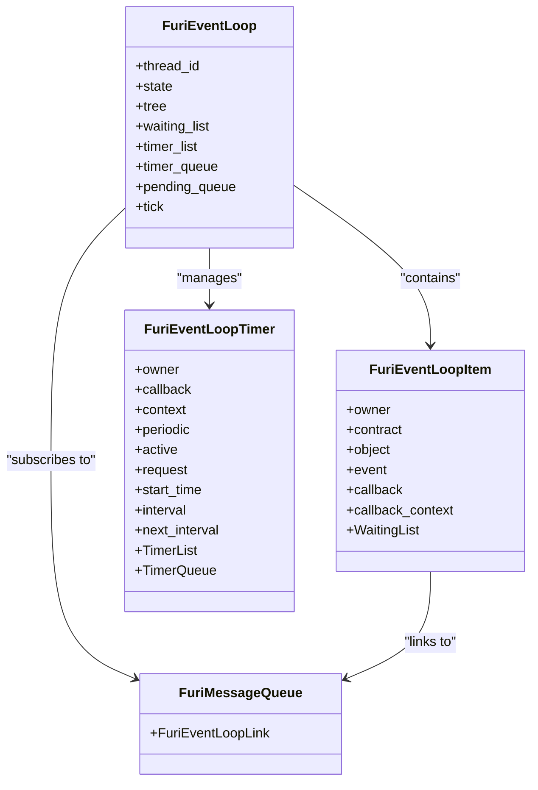
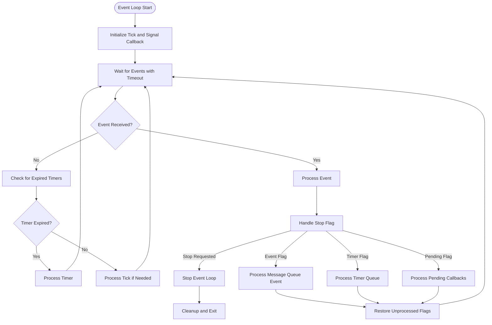
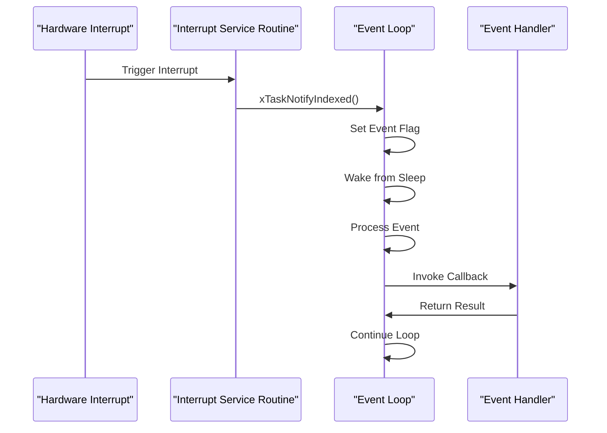
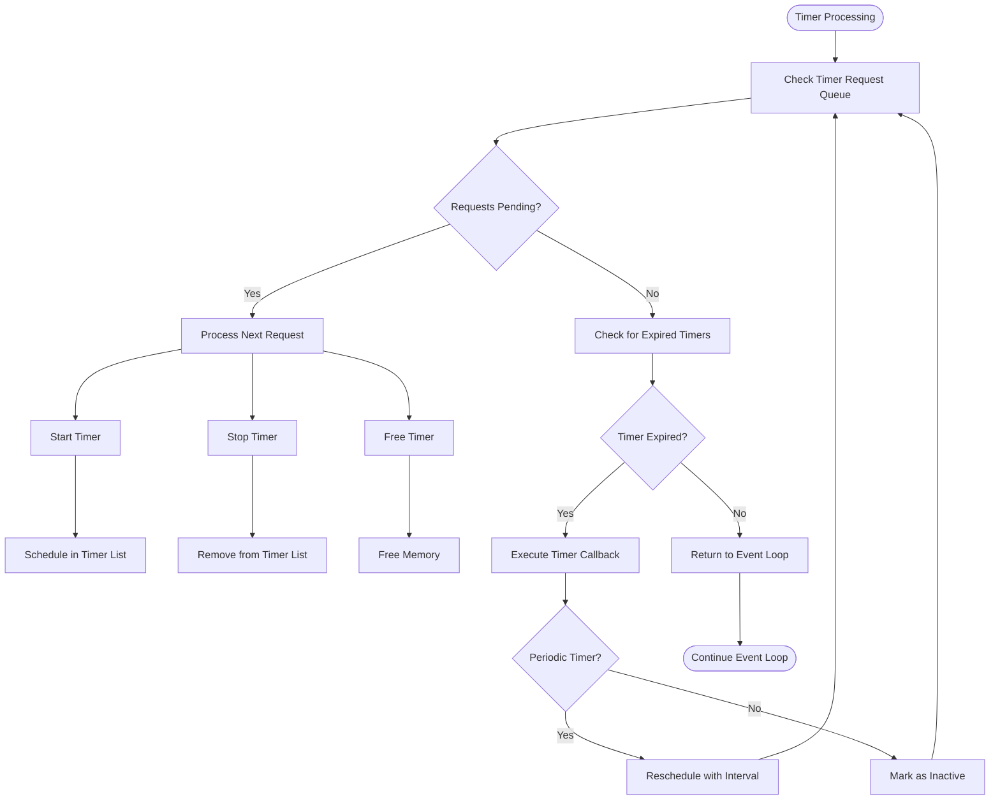
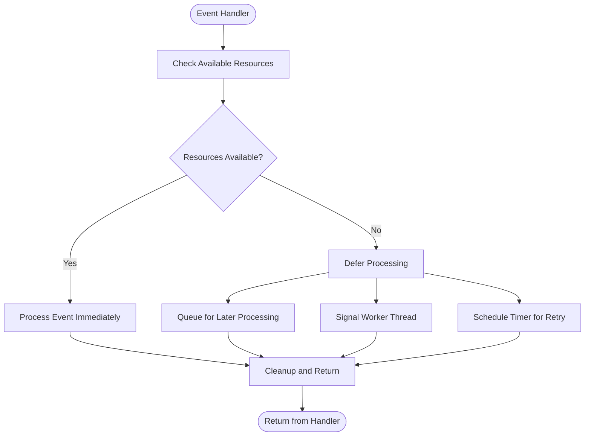

# Event Loop Architecture

<cite>
**Referenced Files in This Document**   
- [event_loop.h](file://furi/core/event_loop.h)
- [event_loop.c](file://furi/core/event_loop.c)
- [event_loop_timer.h](file://furi/core/event_loop_timer.h)
- [event_loop_timer.c](file://furi/core/event_loop_timer.c)
- [event_loop_tick.c](file://furi/core/event_loop_tick.c)
</cite>

## Table of Contents
1. [Introduction](#introduction)
2. [Core Components](#core-components)
3. [Event Loop Lifecycle](#event-loop-lifecycle)
4. [Event Sources and Dispatching](#event-sources-and-dispatching)
5. [Timer Management](#timer-management)
6. [Integration with Threading System](#integration-with-threading-system)
7. [Inter-Thread Communication](#inter-thread-communication)
8. [Performance Considerations](#performance-considerations)
9. [Best Practices](#best-practices)

## Introduction

The Event Loop Architecture in the Flipper Zero firmware provides a robust, asynchronous event handling system that enables efficient processing of various events in a single-threaded context. Inspired by epoll/kqueue concepts and asyncio event loops, this system is specifically designed to work within the constraints of embedded systems while providing a powerful reactive programming model.

The event loop serves as the central nervous system for application execution, managing hardware interrupts, timer events, message queues, and application-level events. It operates on a single thread, ensuring thread safety while allowing for responsive and efficient event processing. This architecture enables developers to write non-blocking code that can handle multiple concurrent operations without the complexity of traditional multithreading.

**Section sources**
- [event_loop.h](file://furi/core/event_loop.h#L1-L162)
- [event_loop.c](file://furi/core/event_loop.c#L0-L380)

## Core Components

The event loop system consists of several core components that work together to provide a comprehensive event handling framework:

- **Event Loop Instance**: The central structure that manages all event sources and dispatching
- **Message Queues**: Anonymous queues for inter-component communication
- **Timers**: Software timers for delayed or periodic execution
- **Tick Callbacks**: Low-priority periodic callbacks for background tasks
- **Pending Callbacks**: Deferred function calls executed after command processing

The event loop is implemented as a state machine with three primary states: Idle, Processing, and Stopped. When idle, the loop waits for events with a timeout determined by the nearest timer or tick interval. When processing, it handles incoming events, expired timers, and pending callbacks.



**Diagram sources**
- [event_loop.h](file://furi/core/event_loop.h#L1-L162)
- [event_loop.c](file://furi/core/event_loop.c#L0-L380)

**Section sources**
- [event_loop.h](file://furi/core/event_loop.h#L1-L162)
- [event_loop.c](file://furi/core/event_loop.c#L0-L380)

## Event Loop Lifecycle

The event loop lifecycle consists of three main phases: allocation, execution, and deallocation. Each event loop instance is bound to a specific thread and cannot be shared across threads.

### Allocation and Initialization

Event loop instances are created using `furi_event_loop_alloc()`, which initializes all internal data structures and associates the loop with the current thread:

```c
FuriEventLoop* furi_event_loop_alloc(void) {
    FuriEventLoop* instance = malloc(sizeof(FuriEventLoop));
    
    instance->thread_id = furi_thread_get_current_id();
    
    FuriEventLoopTree_init(instance->tree);
    WaitingList_init(instance->waiting_list);
    TimerList_init(instance->timer_list);
    TimerQueue_init(instance->timer_queue);
    PendingQueue_init(instance->pending_queue);
    
    // Clear notification state and value
    xTaskNotifyStateClearIndexed(instance->thread_id, FURI_EVENT_LOOP_FLAG_NOTIFY_INDEX);
    ulTaskNotifyValueClearIndexed(
        instance->thread_id, FURI_EVENT_LOOP_FLAG_NOTIFY_INDEX, 0xFFFFFFFF);
    
    return instance;
}
```

The allocation process ensures thread affinity by storing the current thread ID and initializing FreeRTOS notification mechanisms for inter-thread signaling.

### Execution and Processing

The event loop runs continuously using `furi_event_loop_run()`, which implements a state machine that processes events, timers, and pending callbacks:



**Diagram sources**
- [event_loop.c](file://furi/core/event_loop.c#L100-L200)

**Section sources**
- [event_loop.c](file://furi/core/event_loop.c#L100-L200)

### Termination and Cleanup

The event loop can be stopped using `furi_event_loop_stop()`, which sets a stop flag via FreeRTOS task notification:

```c
void furi_event_loop_stop(FuriEventLoop* instance) {
    furi_check(instance);
    
    xTaskNotifyIndexed(
        instance->thread_id, FURI_EVENT_LOOP_FLAG_NOTIFY_INDEX, FuriEventLoopFlagStop, eSetBits);
}
```

When the stop flag is detected during the next iteration, the loop breaks out of its main processing loop, removes the signal callback, and transitions to the Stopped state. The instance can then be safely freed using `furi_event_loop_free()`.

## Event Sources and Dispatching

The event loop system supports multiple event sources, each with specific handling mechanisms and dispatching patterns.

### Message Queue Events

Message queues are the primary mechanism for inter-component communication within the event loop system. Components can subscribe to message queue events using `furi_event_loop_message_queue_subscribe()`:

```c
void furi_event_loop_message_queue_subscribe(
    FuriEventLoop* instance,
    FuriMessageQueue* message_queue,
    FuriEventLoopEvent event,
    FuriEventLoopMessageQueueCallback callback,
    void* context);
```

The subscription process involves:
1. Allocating an event loop item to track the subscription
2. Setting up the callback and context
3. Registering the item in the event loop's tree structure
4. Linking the item to the message queue's event link
5. Notifying the event loop if the event condition is already met

When a message queue event occurs (either data arrival or departure), the associated callback is invoked through the event loop's dispatching mechanism.

### Hardware Interrupt Integration

Hardware interrupts are integrated with the event loop through FreeRTOS task notifications. When a hardware interrupt occurs, it can signal the event loop thread using `xTaskNotifyIndexed()`, which wakes up the event loop and triggers the appropriate event processing.

The event loop uses a critical section mechanism to ensure thread-safe access to its internal data structures when handling events from interrupt context. This prevents race conditions while maintaining responsiveness to hardware events.

### Application Event Processing

Application events are processed through the same dispatching mechanism as other events. When an application component needs to signal an event, it uses the appropriate event loop API to notify the loop, which then invokes the registered callback in the context of the event loop thread.

This design ensures that all event processing occurs in a single thread, eliminating the need for complex synchronization mechanisms while maintaining predictable execution order.



**Diagram sources**
- [event_loop.c](file://furi/core/event_loop.c#L200-L300)
- [event_loop.h](file://furi/core/event_loop.h#L1-L162)

**Section sources**
- [event_loop.c](file://furi/core/event_loop.c#L200-L300)
- [event_loop.h](file://furi/core/event_loop.h#L1-L162)

## Timer Management

The event loop provides a comprehensive timer management system that supports both one-shot and periodic timers with high precision.

### Timer Types and Configuration

Two timer types are supported:
- **One-shot timers** (FuriEventLoopTimerTypeOnce): Execute once after the specified interval
- **Periodic timers** (FuriEventLoopTimerTypePeriodic): Execute repeatedly at the specified interval

Timers are created using `furi_event_loop_timer_alloc()`:

```c
FuriEventLoopTimer* furi_event_loop_timer_alloc(
    FuriEventLoop* instance,
    FuriEventLoopTimerCallback callback,
    FuriEventLoopTimerType type,
    void* context);
```

### Timer Operations

The timer system supports the following operations:
- **Start/Restart**: Begin timer execution with a specified interval
- **Stop**: Halt timer execution without firing the callback
- **Free**: Delete the timer instance

All timer operations are performed asynchronously through a request queue to ensure thread safety:

```c
void furi_event_loop_timer_start(FuriEventLoopTimer* timer, uint32_t interval);
void furi_event_loop_timer_restart(FuriEventLoopTimer* timer);
void furi_event_loop_timer_stop(FuriEventLoopTimer* timer);
void furi_event_loop_timer_free(FuriEventLoopTimer* timer);
```

### Timer Processing Flow

The timer processing flow is integrated into the main event loop cycle:



**Diagram sources**
- [event_loop_timer.c](file://furi/core/event_loop_timer.c#L0-L200)
- [event_loop_timer.h](file://furi/core/event_loop_timer.h#L1-L118)

**Section sources**
- [event_loop_timer.c](file://furi/core/event_loop_timer.c#L0-L200)
- [event_loop_timer.h](file://furi/core/event_loop_timer.h#L1-L118)

## Integration with Threading System

The event loop is tightly integrated with the FreeRTOS-based threading system, providing a seamless interface between threads and event-driven programming.

### Thread Affinity

Each event loop instance is bound to a specific thread and cannot be shared across threads. This is enforced through thread ID checking in all event loop API functions:

```c
furi_check(instance->thread_id == furi_thread_get_current_id());
```

This ensures that event loop operations are always performed in the correct thread context, preventing race conditions and ensuring predictable behavior.

### Signal Callbacks

The event loop registers a signal callback with the thread system using `furi_thread_set_signal_callback()`:

```c
furi_thread_set_signal_callback(
    instance->thread_id, furi_event_loop_signal_callback, instance);
```

This allows the thread system to notify the event loop of standard signals such as FuriSignalExit, which triggers the event loop to stop gracefully.

### Task Notifications

The event loop uses FreeRTOS task notifications as its primary inter-thread communication mechanism. These notifications are used to:
- Signal event loop threads about pending events
- Implement the stop mechanism
- Coordinate timer and message queue events

Task notifications are more efficient than traditional semaphore or queue mechanisms, as they avoid the overhead of kernel object creation and management.

## Inter-Thread Communication

The event loop system provides several mechanisms for inter-thread communication, enabling safe and efficient data exchange between threads.

### Message Queues

Message queues are the primary mechanism for passing data between threads. A thread can send messages to a queue, and the event loop in another thread can subscribe to receive notifications when messages arrive:

```c
// Thread A: Send message
furi_message_queue_put(queue, &message, FuriWaitForever);

// Thread B: Event loop receives notification
furi_event_loop_message_queue_subscribe(
    event_loop, queue, FuriEventLoopEventIn, callback, context);
```

### Deferred Callbacks

The pending callback system allows functions to be executed in the context of the event loop thread:

```c
void furi_event_loop_pend_callback(
    FuriEventLoop* instance,
    FuriEventLoopPendingCallback callback,
    void* context);
```

This is useful for:
- Executing code in the event loop context after initialization
- Marshaling calls from worker threads to the main event loop
- Implementing asynchronous operations with completion callbacks

### Tick Callbacks

Tick callbacks provide a mechanism for periodic execution of low-priority tasks:

```c
void furi_event_loop_tick_set(
    FuriEventLoop* instance,
    uint32_t interval,
    FuriEventLoopTickCallback callback,
    void* context);
```

Tick callbacks are called when the event loop is idle, making them ideal for background tasks that should not interfere with higher-priority event processing.

## Performance Considerations

The event loop architecture is designed with performance and resource constraints in mind, providing several mechanisms to optimize event handling in embedded environments.

### Event Queue Overflow

Event queue overflow can occur when events are generated faster than they can be processed. To mitigate this:

1. **Monitor queue depths** and implement backpressure mechanisms
2. **Prioritize critical events** over less important ones
3. **Use appropriate timeouts** to prevent indefinite blocking
4. **Implement event coalescing** where appropriate

### Timing Precision

The timing precision of the event loop depends on several factors:

- **Timer resolution**: Determined by the FreeRTOS tick rate
- **Event processing latency**: Affected by the complexity of event handlers
- **System load**: Higher load can delay event processing

For high-precision timing requirements, consider using hardware timers directly rather than relying solely on the event loop timer system.

### Resource-Constrained Environments

In resource-constrained environments, follow these best practices:

1. **Minimize memory allocation** in event handlers
2. **Avoid blocking operations** in callbacks
3. **Keep event handlers short** and defer complex processing
4. **Use static allocation** where possible
5. **Monitor stack usage** to prevent overflow



**Diagram sources**
- [event_loop.c](file://furi/core/event_loop.c#L0-L380)
- [event_loop_timer.c](file://furi/core/event_loop_timer.c#L0-L200)

**Section sources**
- [event_loop.c](file://furi/core/event_loop.c#L0-L380)
- [event_loop_timer.c](file://furi/core/event_loop_timer.c#L0-L200)

## Best Practices

### Registering Event Handlers

When registering event handlers, follow these guidelines:

1. **Subscribe during initialization**: Register all event handlers before starting the event loop
2. **Validate subscriptions**: Ensure no duplicate subscriptions for the same event type
3. **Handle all event conditions**: Process both arrival and departure events as appropriate
4. **Return promptly**: Keep event handlers short and defer complex processing

Example:
```c
// Subscribe to message queue events
furi_event_loop_message_queue_subscribe(
    event_loop,
    message_queue,
    FuriEventLoopEventIn,
    message_queue_callback,
    app_context);
```

### Creating Timed Callbacks

When creating timed callbacks, consider:

1. **Choose the appropriate timer type**: One-shot for single execution, periodic for recurring tasks
2. **Set reasonable intervals**: Avoid excessively short intervals that could overwhelm the system
3. **Handle timer lifecycle**: Always free timers when no longer needed
4. **Be aware of timing constraints**: Timer callbacks execute in the event loop context

Example:
```c
// Create a periodic timer
FuriEventLoopTimer* timer = furi_event_loop_timer_alloc(
    event_loop,
    timer_callback,
    FuriEventLoopTimerTypePeriodic,
    app_context);

// Start the timer with 1-second interval
furi_event_loop_timer_start(timer, 1000);
```

### Managing Event Loop Lifecycle

Proper event loop lifecycle management is critical:

1. **Allocate in the correct thread**: Ensure the event loop is created in the thread where it will run
2. **Start the loop appropriately**: Call `furi_event_loop_run()` to begin event processing
3. **Stop gracefully**: Use `furi_event_loop_stop()` to terminate the loop
4. **Free resources**: Call `furi_event_loop_free()` after the loop has stopped

Example:
```c
// Allocate event loop
FuriEventLoop* event_loop = furi_event_loop_alloc();

// Configure event handlers and timers
configure_event_loop(event_loop);

// Run the event loop
furi_event_loop_run(event_loop);

// Free the event loop
furi_event_loop_free(event_loop);
```

These best practices ensure reliable and efficient event handling in the Flipper Zero firmware environment.

**Section sources**
- [event_loop.h](file://furi/core/event_loop.h#L1-L162)
- [event_loop.c](file://furi/core/event_loop.c#L0-L380)
- [event_loop_timer.h](file://furi/core/event_loop_timer.h#L1-L118)
- [event_loop_timer.c](file://furi/core/event_loop_timer.c#L0-L200)