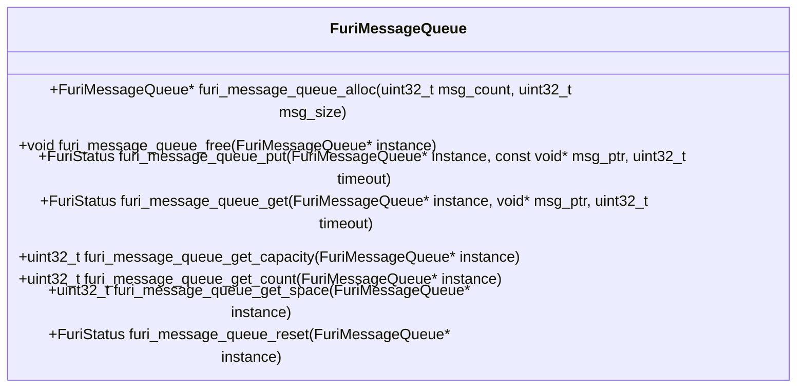
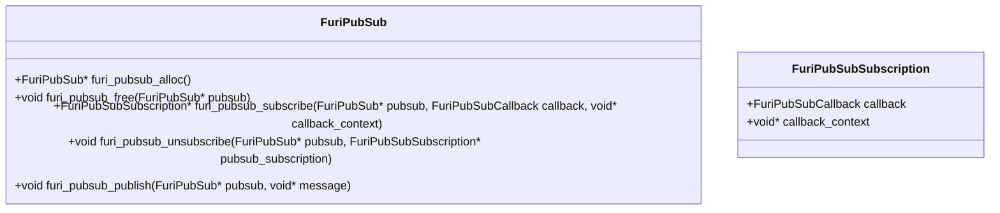
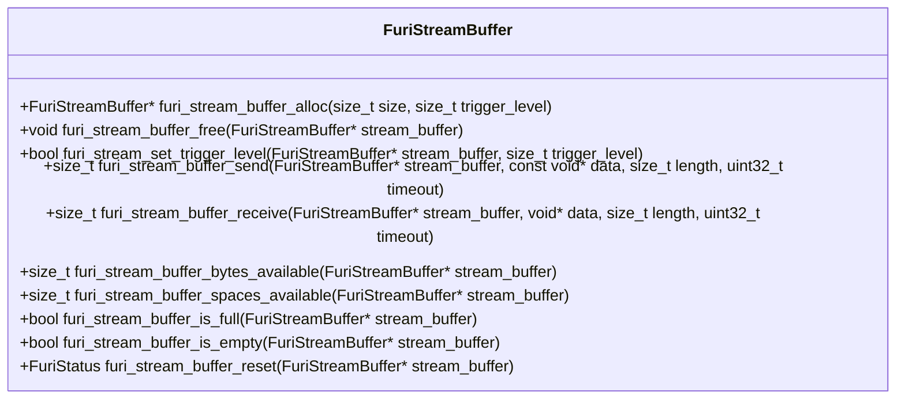
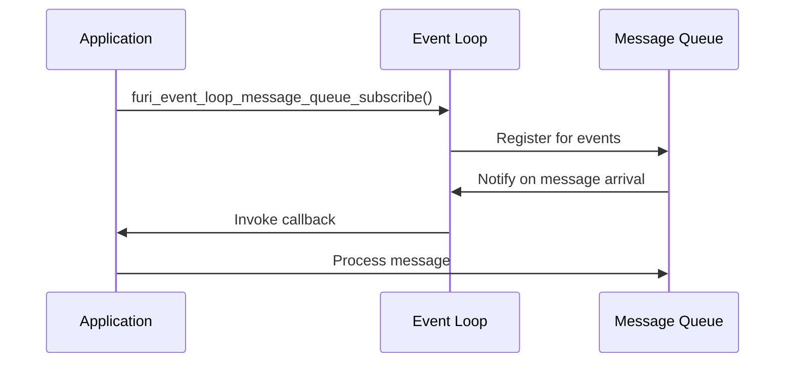

# Inter-Process Communication

<cite>
**Referenced Files in This Document**   
- [message_queue.h](file://furi/core/message_queue.h#L0-L93)
- [message_queue.c](file://furi/core/message_queue.c#L0-L234)
- [pubsub.h](file://furi/core/pubsub.h#L0-L68)
- [pubsub.c](file://furi/core/pubsub.c#L0-L98)
- [stream_buffer.h](file://furi/core/stream_buffer.h#L0-L152)
- [stream_buffer.c](file://furi/core/stream_buffer.c#L0-L121)
- [event_loop.h](file://furi/core/event_loop.h#L0-L162)
- [event_loop.c](file://furi/core/event_loop.c#L0-L381)
</cite>

## Table of Contents
1. [Introduction](#introduction)
2. [Message Queues](#message-queues)
3. [Publish-Subscribe System](#publish-subscribe-system)
4. [Stream Buffers](#stream-buffers)
5. [Event Loop Integration](#event-loop-integration)
6. [Best Practices and Common Issues](#best-practices-and-common-issues)

## Introduction
Inter-Process Communication (IPC) is a fundamental aspect of the Flipper Zero firmware architecture, enabling reliable and efficient communication between different components and threads. This document provides a comprehensive analysis of the three primary IPC mechanisms implemented in the system: message queues, publish-subscribe system, and stream buffers. Each mechanism serves distinct purposes and offers specific advantages for different communication patterns. The document also covers the integration of these IPC mechanisms with the event loop system, which enables asynchronous, reactive programming patterns. Understanding these IPC mechanisms is crucial for developing robust applications that can efficiently exchange data and events across different parts of the system.

## Message Queues

### Architecture and Data Structures
Message queues in the Flipper Zero firmware provide a thread-safe mechanism for passing fixed-size messages between tasks. The implementation is built on top of FreeRTOS queues, with additional abstractions to integrate with the system's event loop.

The core data structure is the `FuriMessageQueue`, which contains a FreeRTOS `StaticQueue_t` container and a buffer for storing messages:

```c
struct FuriMessageQueue {
    StaticQueue_t container;
    FuriEventLoopLink event_loop_link;
    uint8_t buffer[];
};
```

The `buffer` array is allocated at the end of the structure, allowing for variable-length message storage based on the queue configuration. The `event_loop_link` field enables integration with the event loop system, allowing automatic notification when messages are added or removed.

**Section sources**
- [message_queue.h](file://furi/core/message_queue.h#L0-L93)
- [message_queue.c](file://furi/core/message_queue.c#L0-L234)

### Message Passing Mechanism
The message queue API provides functions for creating, using, and destroying queues:



**Diagram sources**
- [message_queue.h](file://furi/core/message_queue.h#L0-L93)

The `furi_message_queue_alloc` function creates a new message queue with a specified number of messages and message size. It uses `xQueueCreateStatic` from FreeRTOS to create a statically allocated queue, which helps prevent memory fragmentation.

Message passing occurs through `furi_message_queue_put` and `furi_message_queue_get` functions, which handle both regular task contexts and interrupt service routines (ISRs). The implementation checks whether it's running in an ISR context and uses the appropriate FreeRTOS API (`xQueueSendToBackFromISR` or `xQueueSendToBack`).

When a message is successfully sent or received, the event loop link is notified:

```c
if(stat == FuriStatusOk) {
    furi_event_loop_link_notify(&instance->event_loop_link, FuriEventLoopEventIn);
}
```

This notification allows the event loop to process the event and invoke any registered callbacks.

**Section sources**
- [message_queue.c](file://furi/core/message_queue.c#L0-L234)

### Usage Example
To create and use a message queue:

```c
// Define message structure
typedef struct {
    uint32_t event_type;
    uint32_t data;
} MyMessage;

// Create queue for 10 messages of MyMessage size
FuriMessageQueue* queue = furi_message_queue_alloc(10, sizeof(MyMessage));

// Send a message
MyMessage msg = {.event_type = 1, .data = 42};
FuriStatus result = furi_message_queue_put(queue, &msg, FuriWaitForever);

// Receive a message
MyMessage received_msg;
result = furi_message_queue_get(queue, &received_msg, 100); // 100ms timeout
```

## Publish-Subscribe System

### Architecture and Data Structures
The publish-subscribe system provides a decoupled communication pattern where publishers send messages without knowledge of subscribers, and subscribers receive messages without knowledge of publishers. This promotes loose coupling between components.

The core data structures are `FuriPubSub` and `FuriPubSubSubscription`:

```c
struct FuriPubSubSubscription {
    FuriPubSubCallback callback;
    void* callback_context;
};

struct FuriPubSub {
    FuriPubSubSubscriptionList_t items;
    FuriMutex* mutex;
};
```

The `FuriPubSub` structure maintains a list of subscriptions and a mutex for thread safety. Each subscription contains a callback function and context data.

**Section sources**
- [pubsub.h](file://furi/core/pubsub.h#L0-L68)
- [pubsub.c](file://furi/core/pubsub.c#L0-L98)

### Message Distribution Mechanism
The publish-subscribe API provides functions for managing subscriptions and publishing messages:



**Diagram sources**
- [pubsub.h](file://furi/core/pubsub.h#L0-L68)

The `furi_pubsub_alloc` function creates a new publish-subscribe instance with an empty subscription list and a mutex for thread safety. The subscription list is implemented using the M*LIB library's LIST_DEF macro, which provides efficient list operations.

Subscribers register with the `furi_pubsub_subscribe` function, which acquires the mutex, adds the subscription to the list, and returns a subscription handle. The subscription handle is used to unsubscribe later.

When a message is published with `furi_pubsub_publish`, the system acquires the mutex, iterates through all subscribers, and invokes each callback with the message and context. This ensures that all subscribers receive the message, even if some take longer to process it.

```c
void furi_pubsub_publish(FuriPubSub* pubsub, void* message) {
    furi_check(furi_mutex_acquire(pubsub->mutex, FuriWaitForever) == FuriStatusOk);

    FuriPubSubSubscriptionList_it_t it;
    for(FuriPubSubSubscriptionList_it(it, pubsub->items); !FuriPubSubSubscriptionList_end_p(it);
        FuriPubSubSubscriptionList_next(it)) {
        const FuriPubSubSubscription* item = FuriPubSubSubscriptionList_cref(it);
        item->callback(message, item->callback_context);
    }

    furi_check(furi_mutex_release(pubsub->mutex) == FuriStatusOk);
}
```

**Section sources**
- [pubsub.c](file://furi/core/pubsub.c#L0-L98)

### Usage Example
To use the publish-subscribe system:

```c
// Define message structure
typedef struct {
    const char* event_name;
    uint32_t value;
} EventMessage;

// Subscriber callback
void my_event_handler(const void* message, void* context) {
    EventMessage* msg = (EventMessage*)message;
    // Handle the event
}

// Create publish-subscribe instance
FuriPubSub* event_bus = furi_pubsub_alloc();

// Subscribe to events
FuriPubSubSubscription* subscription = 
    furi_pubsub_subscribe(event_bus, my_event_handler, NULL);

// Publish an event
EventMessage event = {.event_name = "button_press", .value = 1};
furi_pubsub_publish(event_bus, &event);

// Unsubscribe when done
furi_pubsub_unsubscribe(event_bus, subscription);
```

## Stream Buffers

### Architecture and Data Structures
Stream buffers provide a mechanism for transferring a continuous stream of data between tasks or between interrupts and tasks. They are particularly suited for high-throughput scenarios like audio streaming or sensor data collection.

The core data structure is `FuriStreamBuffer`:

```c
struct FuriStreamBuffer {
    StaticStreamBuffer_t container;
    uint8_t buffer[];
};
```

Like message queues, stream buffers use a trailing buffer array for storing data. The implementation is built on FreeRTOS stream buffers, which are optimized for continuous data flow.

**Section sources**
- [stream_buffer.h](file://furi/core/stream_buffer.h#L0-L152)
- [stream_buffer.c](file://furi/core/stream_buffer.c#L0-L121)

### Data Transfer Mechanism
The stream buffer API provides functions for creating, using, and destroying stream buffers:



**Diagram sources**
- [stream_buffer.h](file://furi/core/stream_buffer.h#L0-L152)

The `furi_stream_buffer_alloc` function creates a new stream buffer with a specified size and trigger level. The trigger level determines how many bytes must be available before a blocked reader task is woken up.

Data transfer occurs through `furi_stream_buffer_send` and `furi_stream_buffer_receive` functions, which handle both regular task contexts and ISRs. The implementation uses the corresponding FreeRTOS stream buffer functions.

```c
size_t furi_stream_buffer_send(
    FuriStreamBuffer* stream_buffer,
    const void* data,
    size_t length,
    uint32_t timeout) {
    furi_check(stream_buffer);

    size_t ret;

    if(FURI_IS_IRQ_MODE()) {
        BaseType_t yield;
        ret = xStreamBufferSendFromISR((StreamBufferHandle_t)stream_buffer, data, length, &yield);
        portYIELD_FROM_ISR(yield);
    } else {
        ret = xStreamBufferSend((StreamBufferHandle_t)stream_buffer, data, length, timeout);
    }

    return ret;
}
```

**Section sources**
- [stream_buffer.c](file://furi/core/stream_buffer.c#L0-L121)

### Usage Example
To use a stream buffer for data transfer:

```c
// Create a stream buffer for 1024 bytes with a trigger level of 16
FuriStreamBuffer* stream_buffer = furi_stream_buffer_alloc(1024, 16);

// Send data to the buffer
uint8_t data[] = {1, 2, 3, 4, 5};
size_t bytes_sent = furi_stream_buffer_send(stream_buffer, data, 5, FuriWaitForever);

// Receive data from the buffer
uint8_t received_data[10];
size_t bytes_received = furi_stream_buffer_receive(stream_buffer, received_data, 10, 100);

// Check available data
size_t available = furi_stream_buffer_bytes_available(stream_buffer);
```

## Event Loop Integration

### Architecture and Data Structures
The event loop system provides a reactive programming model that integrates with IPC mechanisms to enable asynchronous event processing. It acts as a central dispatcher for events from various sources, including message queues.

The key data structures include `FuriEventLoop` and `FuriEventLoopItem`:

```c
typedef struct FuriEventLoop FuriEventLoop;

typedef struct FuriEventLoopItem {
    FuriEventLoop* owner;
    const FuriEventLoopContract* contract;
    void* object;
    FuriEventLoopEvent event;
    FuriEventLoopMessageQueueCallback callback;
    void* callback_context;
    FuriEventLoopTree_it_t tree_it;
    WaitingList_it_t waiting_list_it;
} FuriEventLoopItem;
```

The event loop maintains various data structures for managing events, timers, and pending callbacks.

**Section sources**
- [event_loop.h](file://furi/core/event_loop.h#L0-L162)
- [event_loop.c](file://furi/core/event_loop.c#L0-L381)

### Integration Mechanism
The event loop integrates with IPC mechanisms through subscription APIs that allow components to register for specific events:



**Diagram sources**
- [event_loop.h](file://furi/core/event_loop.h#L0-L162)
- [event_loop.c](file://furi/core/event_loop.c#L0-L381)

The `furi_event_loop_message_queue_subscribe` function allows an application to subscribe to events from a message queue:

```c
void furi_event_loop_message_queue_subscribe(
    FuriEventLoop* instance,
    FuriMessageQueue* message_queue,
    FuriEventLoopEvent event,
    FuriEventLoopMessageQueueCallback callback,
    void* context);
```

When a message is added to or removed from the queue, the event loop is notified through the `event_loop_link` mechanism in the message queue structure. The event loop then processes the event and invokes the registered callback.

The main event loop runs in a continuous loop, waiting for notifications from various sources:

```c
void furi_event_loop_run(FuriEventLoop* instance) {
    while(true) {
        const TickType_t ticks_to_sleep =
            MIN(furi_event_loop_get_timer_wait_time(instance),
                furi_event_loop_get_tick_wait_time(instance));

        uint32_t flags = 0;
        BaseType_t ret = xTaskNotifyWaitIndexed(
            FURI_EVENT_LOOP_FLAG_NOTIFY_INDEX, 0, FuriEventLoopFlagAll, &flags, ticks_to_sleep);

        if(ret == pdTRUE) {
            if(flags & FuriEventLoopFlagEvent) {
                // Process event
            } else if(flags & FuriEventLoopFlagTimer) {
                // Process timer
            } else if(flags & FuriEventLoopFlagPending) {
                // Process pending callbacks
            }
        } else {
            // Handle timeout
            furi_event_loop_process_tick(instance);
        }
    }
}
```

**Section sources**
- [event_loop.c](file://furi/core/event_loop.c#L0-L381)

### Usage Example
To integrate with the event loop:

```c
// Callback function for message queue events
bool message_queue_callback(FuriMessageQueue* queue, void* context) {
    MyMessage msg;
    if(furi_message_queue_get(queue, &msg, 0) == FuriStatusOk) {
        // Process the message
        return true; // Event processed
    }
    return false; // Need to delay processing
}

// Subscribe to message queue events
furi_event_loop_message_queue_subscribe(
    event_loop,
    my_message_queue,
    FuriEventLoopEventIn,
    message_queue_callback,
    NULL);
```

## Best Practices and Common Issues

### Message Queue Overflow
Message queue overflow occurs when a producer sends messages faster than a consumer can process them. This can lead to data loss and system instability.

**Solutions:**
- Monitor queue occupancy using `furi_message_queue_get_count` and `furi_message_queue_get_space`
- Implement backpressure mechanisms to slow down producers
- Use appropriate queue sizes based on expected message rates
- Consider using stream buffers for high-throughput scenarios

```c
uint32_t space = furi_message_queue_get_space(queue);
if(space < LOW_WATER_MARK) {
    // Slow down producer or drop non-critical messages
}
```

**Section sources**
- [message_queue.c](file://furi/core/message_queue.c#L0-L234)

### Data Corruption
Data corruption can occur when multiple threads access shared data without proper synchronization.

**Prevention:**
- Use message queues or publish-subscribe for thread-safe communication
- Avoid sharing complex data structures between threads
- Use atomic operations for simple shared variables
- Validate data integrity when receiving messages

### Performance Considerations
Different IPC mechanisms have different performance characteristics:

- **Message queues**: Best for discrete messages with fixed sizes
- **Publish-subscribe**: Best for event notification with multiple listeners
- **Stream buffers**: Best for continuous data streams

Choose the appropriate mechanism based on your use case to optimize performance and resource usage.

**Section sources**
- [message_queue.c](file://furi/core/message_queue.c#L0-L234)
- [pubsub.c](file://furi/core/pubsub.c#L0-L98)
- [stream_buffer.c](file://furi/core/stream_buffer.c#L0-L121)