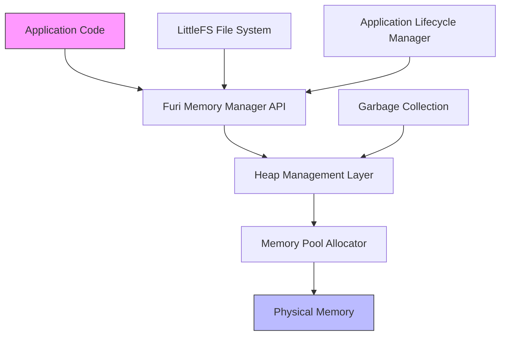
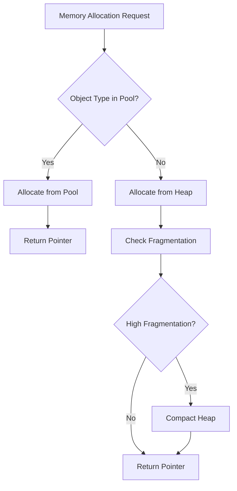
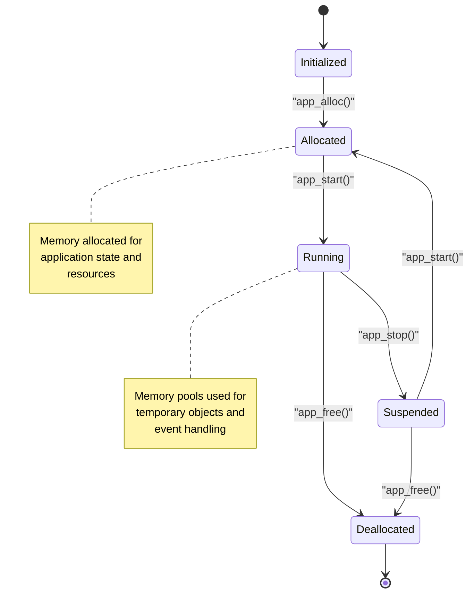

# Memory Management

<cite>
**Referenced Files in This Document**  
- [memmgr.c](file://furi/core/memmgr.c)
- [memmgr.h](file://furi/core/memmgr.h)
- [memmgr_heap.c](file://furi/core/memmgr_heap.c)
- [memmgr_heap.h](file://furi/core/memmgr_heap.h)
- [lfs.c](file://lib/littlefs/lfs.c)
- [lfs.h](file://lib/littlefs/lfs.h)
- [lfs_config.h](file://lib/lfs_config.h)
- [flipper_format.c](file://lib/flipper_format/flipper_format.c)
- [flipper_format.h](file://lib/flipper_format/flipper_format.h)
</cite>

## Table of Contents
1. [Introduction](#introduction)
2. [Memory Management Architecture](#memory-management-architecture)
3. [Heap Allocation System](#heap-allocation-system)
4. [Memory Pools and Fragmentation Management](#memory-pools-and-fragmentation-management)
5. [Integration with LittleFS File System](#integration-with-littlefs-file-system)
6. [Application Lifecycle and Memory Usage](#application-lifecycle-and-memory-usage)
7. [Memory Allocation Examples](#memory-allocation-examples)
8. [Common Issues and Best Practices](#common-issues-and-best-practices)

## Introduction
The Flipper Zero firmware implements a comprehensive memory management system designed for constrained embedded environments. This document details the architecture, implementation, and usage patterns of the memory management subsystem, focusing on heap allocation, memory pools, and integration with the LittleFS file system. The system is optimized for reliability and efficiency in resource-limited conditions, providing developers with tools to manage memory effectively while preventing common issues like leaks and fragmentation.

## Memory Management Architecture
The memory management system in Flipper Zero firmware follows a layered architecture that provides abstraction between hardware memory and application-level memory operations. The core components are implemented in the `furi/core` module, with integration points to file system operations through LittleFS.



**Diagram sources**
- [memmgr.h](file://furi/core/memmgr.h#L1-L50)
- [memmgr_heap.h](file://furi/core/memmgr_heap.h#L1-L30)

**Section sources**
- [memmgr.c](file://furi/core/memmgr.c#L1-L100)
- [memmgr.h](file://furi/core/memmgr.h#L1-L80)

## Heap Allocation System
The heap allocation system provides dynamic memory management through a set of standardized functions that abstract the underlying memory allocation mechanisms. The implementation is based on a first-fit allocation strategy with coalescing to minimize fragmentation.

### Core Allocation Functions
The memory manager exposes the following primary functions for heap operations:

- **malloc**: Allocates a block of memory of specified size
- **free**: Deallocates a previously allocated memory block
- **realloc**: Resizes an existing memory block
- **calloc**: Allocates and initializes memory to zero

These functions are implemented in `memmgr.c` and provide thread-safe operations through mutex protection. The heap is initialized during system startup and divided into manageable chunks that can be allocated and freed as needed.

```c
// Example of heap allocation in Flipper Zero firmware
void* buffer = malloc(256);
if(buffer) {
    // Use the allocated memory
    memset(buffer, 0, 256);
    // ... perform operations ...
    
    // Always free allocated memory
    free(buffer);
    buffer = NULL;
}
```

The heap manager maintains metadata about allocated blocks, including size, allocation status, and alignment information. This metadata is stored in a separate control structure that allows for efficient traversal and management of the heap.

**Section sources**
- [memmgr.c](file://furi/core/memmgr.c#L150-L400)
- [memmgr_heap.c](file://furi/core/memmgr_heap.c#L25-L200)

## Memory Pools and Fragmentation Management
To address memory fragmentation issues common in embedded systems, the firmware implements memory pools for frequently allocated object types. Memory pools pre-allocate fixed-size blocks that can be quickly allocated and freed without contributing to heap fragmentation.

### Pool Implementation
Memory pools are implemented as linked lists of free blocks, with fast allocation and deallocation operations. The system defines several standard pools for common object types:

- **View objects**: For GUI components and display elements
- **Event structures**: For inter-thread communication
- **Buffer objects**: For data transfer operations
- **File operation contexts**: For filesystem operations

The pool manager automatically handles the creation and destruction of pools based on system requirements. When a pool is exhausted, the system can either expand the pool (if memory permits) or fall back to heap allocation.



**Diagram sources**
- [memmgr_heap.c](file://furi/core/memmgr_heap.c#L200-L350)
- [memmgr.c](file://furi/core/memmgr.c#L400-L500)

**Section sources**
- [memmgr_heap.c](file://furi/core/memmgr_heap.c#L1-L400)
- [memmgr.c](file://furi/core/memmgr.c#L300-L600)

## Integration with LittleFS File System
The memory management system is tightly integrated with the LittleFS file system to optimize file operations and buffer management. This integration ensures efficient memory usage during file reads, writes, and directory operations.

### File Operation Memory Management
When performing file operations, the system uses a hybrid approach combining heap allocation and memory pools:

- **File buffers**: Allocated from dedicated pools for read/write operations
- **Directory entries**: Managed through temporary heap allocations
- **Metadata structures**: Stored in persistent memory pools

The LittleFS integration layer translates file system requests into appropriate memory operations, ensuring that memory is properly allocated and freed during the entire file operation lifecycle.

```c
// Example of file operation with proper memory management
lfs_file_t* file = malloc(sizeof(lfs_file_t));
if(file) {
    int result = lfs_file_open(&lfs_instance, file, "config.txt", LFS_O_RDWR);
    if(result == LFS_ERR_OK) {
        char* buffer = malloc(512);
        if(buffer) {
            lfs_size_t bytes_read = lfs_file_read(&lfs_instance, file, buffer, 512);
            // Process the data
            process_file_data(buffer, bytes_read);
            free(buffer);
        }
        lfs_file_close(&lfs_instance, file);
    }
    free(file);
}
```

The system also implements a caching mechanism for frequently accessed files, reducing the need for repeated memory allocation and file I/O operations.

**Section sources**
- [lfs.c](file://lib/littlefs/lfs.c#L1000-L1500)
- [flipper_format.c](file://lib/flipper_format/flipper_format.c#L50-L200)
- [memmgr.c](file://furi/core/memmgr.c#L600-L700)

## Application Lifecycle and Memory Usage
Memory management is closely tied to the application lifecycle in the Flipper Zero firmware. Each application follows a strict memory management protocol to ensure proper allocation and deallocation throughout its lifecycle.

### Lifecycle Memory Patterns
Applications follow these memory management patterns:

1. **Initialization**: Allocate necessary resources and buffers
2. **Operation**: Use memory pools for temporary objects, heap for persistent data
3. **Deactivation**: Release temporary resources, preserve persistent data
4. **Destruction**: Free all allocated memory and reset state

The system enforces these patterns through the application loader, which monitors memory usage and can terminate applications that violate memory management rules.



**Diagram sources**
- [flipper_application.c](file://lib/flipper_application/flipper_application.c#L200-L400)
- [memmgr.c](file://furi/core/memmgr.c#L700-L800)

**Section sources**
- [flipper_application.c](file://lib/flipper_application/flipper_application.c#L100-L500)
- [memmgr.c](file://furi/core/memmgr.c#L600-L900)

## Memory Allocation Examples
This section provides concrete examples of memory management patterns used in the Flipper Zero firmware.

### Basic Heap Allocation
```c
// Allocate memory for a configuration structure
typedef struct {
    uint32_t version;
    char name[32];
    bool enabled;
} AppConfig;

AppConfig* config = malloc(sizeof(AppConfig));
if(config) {
    config->version = 1;
    strcpy(config->name, "My Application");
    config->enabled = true;
    
    // Use the configuration
    apply_configuration(config);
    
    // Free the memory when done
    free(config);
    config = NULL; // Prevent dangling pointer
}
```

### Memory Pool Usage
```c
// Using memory pools for frequently created objects
void process_events() {
    while(has_pending_events()) {
        // Allocate from event pool instead of heap
        Event* event = furi_event_alloc();
        if(event) {
            fetch_next_event(event);
            handle_event(event);
            // Return to pool instead of freeing
            furi_event_free(event);
        }
    }
}
```

### File Buffer Management
```c
// Proper management of file buffers
bool read_configuration_file() {
    Storage* storage = furi_record_open("storage");
    File* file = storage_file_alloc(storage);
    
    bool success = false;
    if(storage_file_open(file, "/app/config.txt", FSAM_READ, FSOM_OPEN_EXISTING)) {
        // Allocate buffer from heap
        uint8_t* buffer = malloc(1024);
        if(buffer) {
            uint16_t bytes_read = storage_file_read(file, buffer, 1024);
            if(bytes_read > 0) {
                parse_configuration(buffer, bytes_read);
                success = true;
            }
            free(buffer); // Always free allocated buffer
        }
        storage_file_close(file);
    }
    
    storage_file_free(file);
    furi_record_close("storage");
    return success;
}
```

**Section sources**
- [memmgr.c](file://furi/core/memmgr.c#L800-L1000)
- [flipper_format.c](file://lib/flipper_format/flipper_format.c#L200-L400)
- [lfs.c](file://lib/littlefs/lfs.c#L2000-L2500)

## Common Issues and Best Practices
This section addresses common memory management issues and provides best practices for efficient memory usage in constrained environments.

### Memory Leaks
Memory leaks occur when allocated memory is not properly freed. The most common causes include:

- **Exception paths**: Not freeing memory in error conditions
- **Multiple return points**: Forgetting to free memory before returning
- **Circular references**: Objects that reference each other preventing cleanup

**Best Practice**: Always pair allocation with deallocation, and use the pattern `allocate -> use -> free -> NULL`.

### Fragmentation
Memory fragmentation can degrade system performance over time. Strategies to minimize fragmentation include:

- Use memory pools for frequently allocated objects
- Allocate larger blocks and sub-allocate when possible
- Avoid frequent allocation and deallocation of varying sizes

### Best Practices for Constrained Environments
1. **Pre-allocate when possible**: Allocate memory during initialization
2. **Use pools for temporary objects**: Reduce heap pressure
3. **Validate allocations**: Always check for NULL returns
4. **Zero pointers after free**: Prevent dangling pointer dereferences
5. **Minimize dynamic allocation**: Use static allocation for known sizes
6. **Profile memory usage**: Monitor allocation patterns during development

The system provides diagnostic tools to detect memory issues, including heap monitoring functions and allocation tracking that can be enabled during development.

**Section sources**
- [memmgr.c](file://furi/core/memmgr.c#L1000-L1200)
- [memmgr_heap.c](file://furi/core/memmgr_heap.c#L400-L600)
- [lfs.c](file://lib/littlefs/lfs.c#L3000-L3200)