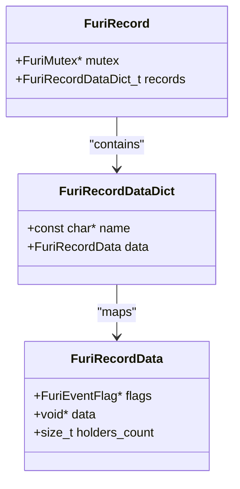
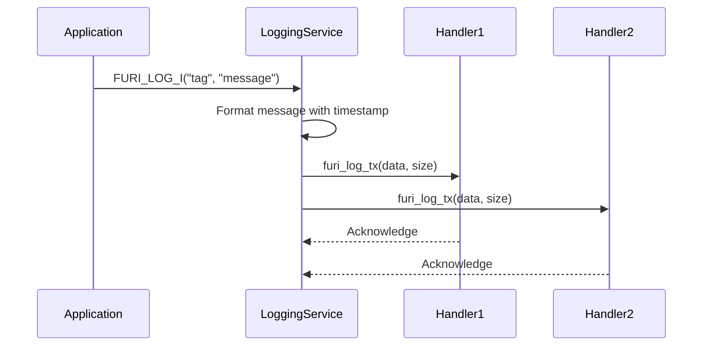
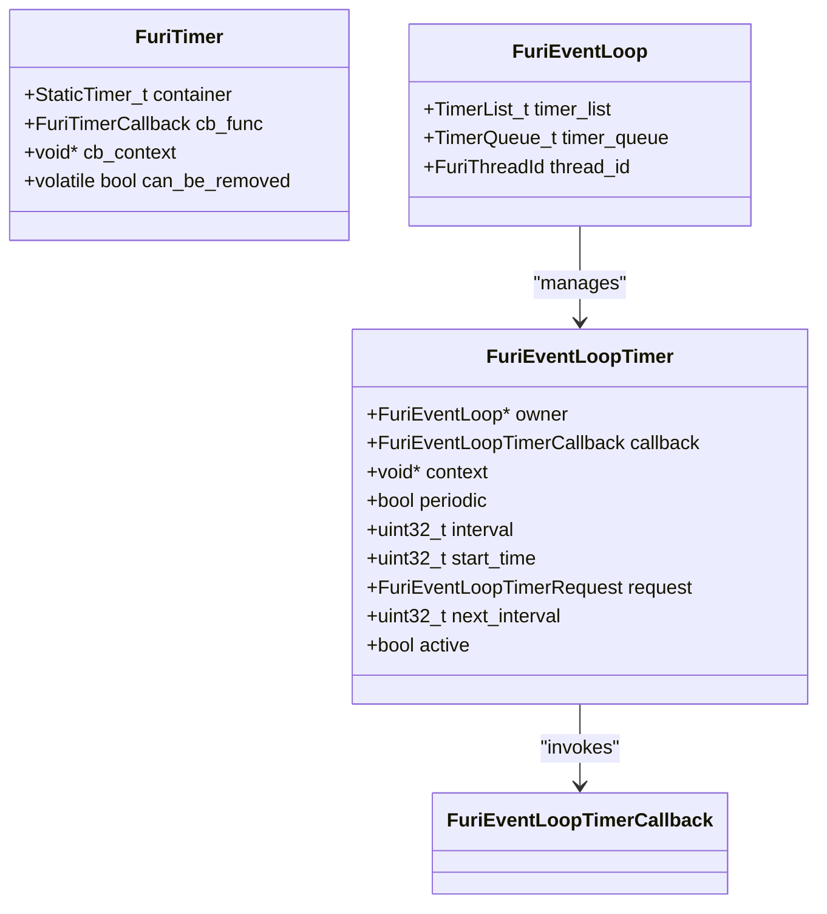

# OS Services API

<cite>
**Referenced Files in This Document**   
- [record.h](file://furi/core/record.h)
- [record.c](file://furi/core/record.c)
- [log.h](file://furi/core/log.h)
- [log.c](file://furi/core/log.c)
- [timer.h](file://furi/core/timer.h)
- [timer.c](file://furi/core/timer.c)
- [event_loop_timer.h](file://furi/core/event_loop_timer.h)
- [event_loop_timer.c](file://furi/core/event_loop_timer.c)
</cite>

## Table of Contents
1. [Introduction](#introduction)
2. [Service Registration and Discovery](#service-registration-and-discovery)
3. [Logging Service](#logging-service)
4. [Timer Management](#timer-management)
5. [Integration with Plugin System](#integration-with-plugin-system)
6. [Best Practices and Common Issues](#best-practices-and-common-issues)

## Introduction
The OS Services API in the Flipper Zero firmware provides a comprehensive framework for system-level services that enable application components to interact with core system functionality. This document details the implementation of key services including service registration, logging, and timer management. The architecture is designed to promote component decoupling through a service-oriented approach, where components can register themselves as services and other components can discover and use these services without direct dependencies. This design pattern facilitates modular development, particularly important in the context of plugin-based extensions.

## Service Registration and Discovery

The service registration and discovery mechanism is implemented through the Furi record system, which provides a thread-safe registry for system services. Services are registered with a unique name and associated data pointer, allowing other components to obtain references to these services by name.



**Diagram sources**
- [record.h](file://furi/core/record.h#L45-L65)
- [record.c](file://furi/core/record.c#L15-L35)

The service registry uses a dictionary data structure (implemented with M-Dict) to store service records, with each record containing the service data pointer, an event flag for synchronization, and a holder count to track references. The registry is protected by a mutex to ensure thread safety during concurrent access.

To register a service, components use the `furi_record_create()` function, which associates a service name with its data pointer. Other components can then obtain a reference to the service using `furi_record_open()`, which returns the data pointer and increments the holder count. When finished, components must call `furi_record_close()` to decrement the holder count. A service can only be destroyed when its holder count reaches zero.

**Section sources**
- [record.h](file://furi/core/record.h#L15-L65)
- [record.c](file://furi/core/record.c#L15-L149)

## Logging Service

The logging service provides a flexible and extensible system for generating diagnostic output with different severity levels. It supports multiple output destinations through registered handlers and includes color-coded output for enhanced readability.



**Diagram sources**
- [log.h](file://furi/core/log.h#L15-L165)
- [log.c](file://furi/core/log.c#L15-L212)

The logging system supports five severity levels: Error, Warn, Info, Debug, and Trace, with a default level of Info. Applications use macro wrappers like `FURI_LOG_I()` to generate log messages, which are then processed by the logging service. The service formats messages with timestamps, severity indicators, and color codes before transmitting them to all registered handlers.

Handlers are callback functions that receive the formatted log data and can direct it to various destinations such as serial output, file storage, or network transmission. Multiple handlers can be registered simultaneously, allowing log messages to be sent to multiple destinations. The system uses a recursive mutex to protect the handler list during concurrent access, ensuring thread safety.

**Section sources**
- [log.h](file://furi/core/log.h#L15-L165)
- [log.c](file://furi/core/log.c#L15-L212)

## Timer Management

The timer management system provides two complementary timer APIs: a general-purpose timer service and an event loop-specific timer service. Both are built on FreeRTOS timer functionality but serve different use cases within the system.



**Diagram sources**
- [timer.h](file://furi/core/timer.h#L15-L115)
- [timer.c](file://furi/core/timer.c#L15-L168)
- [event_loop_timer.h](file://furi/core/event_loop_timer.h#L15-L115)
- [event_loop_timer.c](file://furi/core/event_loop_timer.c#L15-L216)

The general-purpose `FuriTimer` API provides one-shot and periodic timers that execute callbacks in the context of the FreeRTOS timer daemon task. This API is suitable for background operations that don't need to interact directly with application event loops. Timers are allocated with `furi_timer_alloc()` and started with `furi_timer_start()`, specifying the callback function, timer type, context, and interval in ticks.

The event loop timer API (`FuriEventLoopTimer`) is designed for use within application event loops, where timers need to interact with the event processing system. These timers are processed within the event loop's thread context, making them suitable for UI updates and other operations that require access to the event loop. The event loop maintains a sorted list of active timers and processes expired timers during its main loop cycle.

**Section sources**
- [timer.h](file://furi/core/timer.h#L15-L115)
- [timer.c](file://furi/core/timer.c#L15-L168)
- [event_loop_timer.h](file://furi/core/event_loop_timer.h#L15-L115)
- [event_loop_timer.c](file://furi/core/event_loop_timer.c#L15-L216)

## Integration with Plugin System

The OS Services API plays a crucial role in the plugin system by enabling plugins to access core system functionality and register their own services. The service registry allows plugins to discover and use existing services while remaining decoupled from their implementations.

Plugins can register services using the same `furi_record_create()` mechanism as core components, making their functionality available to other plugins and applications. This service-oriented architecture promotes loose coupling and high cohesion, allowing plugins to extend system functionality without modifying core code.

The logging service is particularly important for plugins, as it provides a standardized way to generate diagnostic output that integrates with the system's logging infrastructure. Plugins can use the same logging macros as core components, ensuring consistent log formatting and output handling.

Timer services enable plugins to implement time-based functionality such as periodic updates, timeouts, and scheduled operations. The event loop timer API is especially valuable for plugins that need to integrate with application event processing, allowing them to schedule callbacks that execute in the appropriate thread context.

This integration model allows the system to maintain stability and security while supporting extensibility through plugins. The service registry acts as a controlled interface between plugins and core services, preventing direct dependencies while enabling rich functionality.

**Section sources**
- [record.h](file://furi/core/record.h#L15-L65)
- [log.h](file://furi/core/log.h#L15-L165)
- [event_loop_timer.h](file://furi/core/event_loop_timer.h#L15-L115)

## Best Practices and Common Issues

### Service Lookup Failures
Service lookup failures typically occur when attempting to access a service before it has been registered or after it has been destroyed. To prevent this issue:

1. Ensure services are registered during system initialization
2. Use `furi_record_exists()` to check for service availability before attempting to open it
3. Implement retry logic with appropriate delays for services that may not be immediately available

```c
// Example of safe service access
void* get_service_with_retry(const char* service_name, uint32_t max_retries) {
    for(uint32_t i = 0; i < max_retries; i++) {
        if(furi_record_exists(service_name)) {
            return furi_record_open(service_name);
        }
        furi_delay_ms(10);
    }
    return NULL;
}
```

### Logging Performance
Excessive logging, particularly at Debug and Trace levels, can impact system performance. Best practices include:

1. Use appropriate log levels (Info for normal operation, Debug for detailed diagnostics)
2. Avoid logging in time-critical code paths
3. Disable verbose logging in production builds
4. Use conditional compilation to exclude debug logs when not needed

```c
// Example of conditional logging
#ifdef DEBUG_LOGGING
    FURI_LOG_D("MyApp", "Debug information: %d", value);
#endif
```

### Timer Management
Common timer issues and solutions:

1. **Timer drift**: Use the event loop timer API for precise timing requirements
2. **Memory leaks**: Always free timers with `furi_timer_free()` or `furi_event_loop_timer_free()`
3. **Callback timing**: Be aware that timer callbacks execute in different thread contexts
4. **Resource contention**: Avoid long operations in timer callbacks

The OS Services API provides a robust foundation for building reliable and maintainable applications on the Flipper Zero platform. By following these best practices, developers can create efficient, well-integrated components that leverage the full capabilities of the system while maintaining stability and performance.

**Section sources**
- [record.c](file://furi/core/record.c#L15-L149)
- [log.c](file://furi/core/log.c#L15-L212)
- [timer.c](file://furi/core/timer.c#L15-L168)
- [event_loop_timer.c](file://furi/core/event_loop_timer.c#L15-L216)