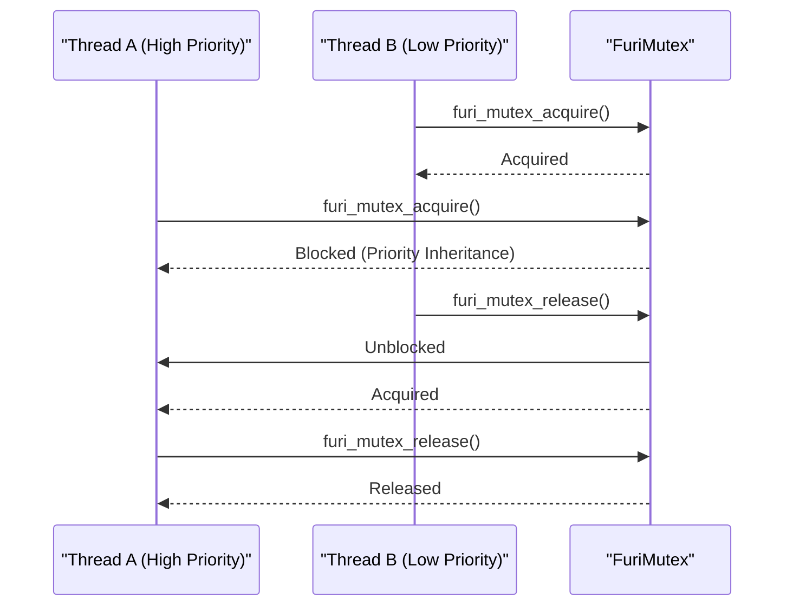
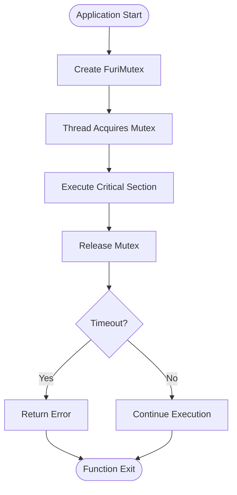

# Synchronization Primitives

<cite>
**Referenced Files in This Document**   
- [mutex.h](file://furi/core/mutex.h#L1-L62)
- [mutex.c](file://furi/core/mutex.c#L1-L124)
- [semaphore.h](file://furi/core/semaphore.h#L1-L58)
- [semaphore.c](file://furi/core/semaphore.c#L1-L122)
- [event_flag.h](file://furi/core/event_flag.h#L1-L70)
- [event_flag.c](file://furi/core/event_flag.c#L1-L149)
- [thread.h](file://furi/core/thread.h#L1-L199)
- [keypad_test.c](file://applications/debug/keypad_test/keypad_test.c#L1-L150)
- [lfrfid_cli.c](file://applications/main/lfrfid/lfrfid_cli.c#L41-L504)
- [cli.c](file://applications/services/cli/cli.c#L24)
</cite>

## Table of Contents
1. [Introduction](#introduction)
2. [Mutex Implementation](#mutex-implementation)
3. [Semaphore Implementation](#semaphore-implementation)
4. [Event Flag Implementation](#event-flag-implementation)
5. [Thread Integration](#thread-integration)
6. [Usage Examples](#usage-examples)
7. [Best Practices and Common Issues](#best-practices-and-common-issues)

## Introduction
This document provides a comprehensive analysis of the synchronization primitives implemented in the Flipper Zero firmware. The system utilizes three primary synchronization mechanisms: mutexes, semaphores, and event flags, all built on top of FreeRTOS primitives. These primitives are essential for ensuring thread safety, preventing race conditions, and enabling coordinated execution in a multi-threaded embedded environment. The Furi abstraction layer provides a consistent interface to these synchronization mechanisms while maintaining compatibility with FreeRTOS.

**Section sources**
- [mutex.h](file://furi/core/mutex.h#L1-L62)
- [semaphore.h](file://furi/core/semaphore.h#L1-L58)
- [event_flag.h](file://furi/core/event_flag.h#L1-L70)

## Mutex Implementation

### Data Structure and API
The mutex implementation provides a wrapper around FreeRTOS mutexes with additional type safety and error checking. The `FuriMutex` structure contains a `StaticSemaphore_t` container as its first member, allowing direct casting to FreeRTOS semaphore handles.

```c
typedef struct FuriMutex FuriMutex;

typedef enum {
    FuriMutexTypeNormal,
    FuriMutexTypeRecursive,
} FuriMutexType;
```

The API provides standard mutex operations:
- `furi_mutex_alloc()`: Creates a mutex of specified type
- `furi_mutex_free()`: Destroys and frees the mutex
- `furi_mutex_acquire()`: Acquires the mutex with timeout
- `furi_mutex_release()`: Releases the held mutex
- `furi_mutex_get_owner()`: Returns the current owner thread ID

### Internal Implementation
The implementation leverages FreeRTOS's static semaphore creation functions to avoid dynamic memory allocation at runtime. The critical constraint is that the `container` member must be the first element in the struct, verified by a static assertion:

```c
static_assert(offsetof(FuriMutex, container) == 0);
```

This allows safe casting between `FuriMutex*` and `SemaphoreHandle_t`. The implementation supports both normal and recursive mutex types, with appropriate FreeRTOS functions called based on the type:

```c
if(type == FuriMutexTypeNormal) {
    hMutex = xSemaphoreCreateMutexStatic(&instance->container);
} else if(type == FuriMutexTypeRecursive) {
    hMutex = xSemaphoreCreateRecursiveMutexStatic(&instance->container);
}
```

The acquisition and release operations include comprehensive error checking, including verification that operations are not performed from interrupt context and proper handling of timeout conditions.

```mermaid
classDiagram
class FuriMutex {
+FuriMutexType type
+StaticSemaphore_t container
+furi_mutex_alloc(type)
+furi_mutex_free(instance)
+furi_mutex_acquire(instance, timeout)
+furi_mutex_release(instance)
+furi_mutex_get_owner(instance)
}
FuriMutex --> "1" "1" StaticSemaphore_t : contains
FuriMutex --> "uses" SemaphoreHandle_t : casts to
```

**Diagram sources**
- [mutex.h](file://furi/core/mutex.h#L1-L62)
- [mutex.c](file://furi/core/mutex.c#L1-L124)

**Section sources**
- [mutex.h](file://furi/core/mutex.h#L1-L62)
- [mutex.c](file://furi/core/mutex.c#L1-L124)

## Semaphore Implementation

### Data Structure and API
The semaphore implementation provides counting semaphores with configurable maximum and initial counts. The `FuriSemaphore` structure follows the same pattern as mutexes, with a `StaticSemaphore_t` container as its first member.

```c
typedef struct FuriSemaphore FuriSemaphore;
```

Key API functions include:
- `furi_semaphore_alloc(max_count, initial_count)`: Creates a counting semaphore
- `furi_semaphore_free(instance)`: Destroys and frees the semaphore
- `furi_semaphore_acquire(instance, timeout)`: Acquires the semaphore
- `furi_semaphore_release(instance)`: Releases the semaphore
- `furi_semaphore_get_count(instance)`: Returns current semaphore count

### Internal Implementation
The implementation optimizes for binary semaphores when the maximum count is 1, using FreeRTOS's binary semaphore functions for better performance. For counting semaphores, it uses the counting semaphore functions:

```c
if(max_count == 1U) {
    hSemaphore = xSemaphoreCreateBinaryStatic(&instance->container);
} else {
    hSemaphore = xSemaphoreCreateCountingStatic(max_count, initial_count, &instance->container);
}
```

The implementation includes special handling for binary semaphores with non-zero initial count, ensuring the semaphore is properly initialized by giving it once if needed:

```c
if(max_count == 1U && initial_count != 0U) {
    furi_check(xSemaphoreGive(hSemaphore) == pdPASS);
}
```

Interrupt-safe versions of the operations are provided through the `FromISR` variants, with proper yield handling to ensure the scheduler can preempt when necessary.

```mermaid
classDiagram
class FuriSemaphore {
+StaticSemaphore_t container
+furi_semaphore_alloc(max_count, initial_count)
+furi_semaphore_free(instance)
+furi_semaphore_acquire(instance, timeout)
+furi_semaphore_release(instance)
+furi_semaphore_get_count(instance)
}
FuriSemaphore --> "1" "1" StaticSemaphore_t : contains
FuriSemaphore --> "uses" SemaphoreHandle_t : casts to
```

**Diagram sources**
- [semaphore.h](file://furi/core/semaphore.h#L1-L58)
- [semaphore.c](file://furi/core/semaphore.c#L1-L122)

**Section sources**
- [semaphore.h](file://furi/core/semaphore.h#L1-L58)
- [semaphore.c](file://furi/core/semaphore.c#L1-L122)

## Event Flag Implementation

### Data Structure and API
Event flags provide a mechanism for threads to wait for combinations of boolean conditions. The `FuriEventFlag` structure contains a `StaticEventGroup_t` container as its first member.

```c
typedef struct FuriEventFlag FuriEventFlag;
```

The API includes:
- `furi_event_flag_alloc()`: Creates an event flag group
- `furi_event_flag_free(instance)`: Destroys and frees the event flag
- `furi_event_flag_set(instance, flags)`: Sets specified flags
- `furi_event_flag_clear(instance, flags)`: Clears specified flags
- `furi_event_flag_get(instance)`: Gets current flag values
- `furi_event_flag_wait(instance, flags, options, timeout)`: Waits for flag conditions

### Internal Implementation
The implementation uses FreeRTOS event groups with a 24-bit limit on usable flag bits, defined by:

```c
#define FURI_EVENT_FLAG_MAX_BITS_EVENT_GROUPS 24U
#define FURI_EVENT_FLAG_INVALID_BITS          (~((1UL << FURI_EVENT_FLAG_MAX_BITS_EVENT_GROUPS) - 1U))
```

This limitation ensures compatibility with FreeRTOS's event group implementation. The wait operation supports two key options:
- `FuriFlagWaitAll`: Wait for all specified flags to be set
- `FuriFlagNoClear`: Do not clear flags after waiting

The implementation includes special handling for interrupt context operations, with proper yield management to ensure correct execution ordering, particularly for clear operations which are queued in the timer command queue.

```mermaid
classDiagram
class FuriEventFlag {
+StaticEventGroup_t container
+furi_event_flag_alloc()
+furi_event_flag_free(instance)
+furi_event_flag_set(instance, flags)
+furi_event_flag_clear(instance, flags)
+furi_event_flag_get(instance)
+furi_event_flag_wait(instance, flags, options, timeout)
}
FuriEventFlag --> "1" "1" StaticEventGroup_t : contains
FuriEventFlag --> "uses" EventGroupHandle_t : casts to
```

**Diagram sources**
- [event_flag.h](file://furi/core/event_flag.h#L1-L70)
- [event_flag.c](file://furi/core/event_flag.c#L1-L149)

**Section sources**
- [event_flag.h](file://furi/core/event_flag.h#L1-L70)
- [event_flag.c](file://furi/core/event_flag.c#L1-L149)

## Thread Integration

### Thread Context and Synchronization
The synchronization primitives are tightly integrated with the thread system, as evidenced by the thread header file which defines thread states, priorities, and callback mechanisms. The `FuriThreadId` type is used to identify thread owners, particularly for mutex ownership tracking.

```c
typedef void* FuriThreadId;
```

The implementation ensures that synchronization operations are not performed from interrupt context unless specifically designed for ISR use, with checks like:

```c
furi_check(!FURI_IS_IRQ_MODE());
```

Thread-local storage is used to maintain thread-specific data, including the current thread's FuriThread instance:

```c
vTaskSetThreadLocalStoragePointer(NULL, 0, thread);
```

### Priority and Scheduling Interaction
The synchronization primitives interact with FreeRTOS's priority-based preemptive scheduler. When a higher-priority thread acquires a mutex held by a lower-priority thread, the scheduler handles the priority inheritance mechanism internally through FreeRTOS. The thread priority enumeration defines the available priority levels:

```c
typedef enum {
    FuriThreadPriorityNone = 0,
    FuriThreadPriorityIdle = 1,
    FuriThreadPriorityLowest = 14,
    FuriThreadPriorityLow = 15,
    FuriThreadPriorityNormal = 16,
    FuriThreadPriorityHigh = 17,
    FuriThreadPriorityHighest = 18,
    FuriThreadPriorityIsr = (FURI_CONFIG_THREAD_MAX_PRIORITIES - 1),
} FuriThreadPriority;
```



**Diagram sources**
- [thread.h](file://furi/core/thread.h#L1-L199)
- [mutex.c](file://furi/core/mutex.c#L1-L124)

**Section sources**
- [thread.h](file://furi/core/thread.h#L1-L199)
- [thread.c](file://furi/core/thread.c#L1-L199)

## Usage Examples

### Mutex for Critical Sections
The keypad_test application demonstrates proper mutex usage for protecting shared state in a GUI application:

```c
typedef struct {
    bool press[5];
    uint16_t up;
    uint16_t down;
    uint16_t left;
    uint16_t right;
    uint16_t ok;
    FuriMutex* mutex;
} KeypadTestState;
```

The mutex is used to protect both the render callback and input processing:

```c
static void keypad_test_render_callback(Canvas* canvas, void* ctx) {
    KeypadTestState* state = ctx;
    furi_mutex_acquire(state->mutex, FuriWaitForever);
    // Update shared state
    canvas_draw_str(canvas, 0, 10, "Keypad test");
    // ... drawing operations
    furi_mutex_release(state->mutex);
}
```

This prevents race conditions when the GUI thread is rendering while the input thread is updating the state.

### Semaphore for Resource Counting
Semaphores are used for resource counting and thread synchronization, as seen in unit tests:

```c
FuriSemaphore* semaphore = furi_semaphore_alloc(1, 0);
// Signal completion from one thread
furi_semaphore_release(semaphore);
// Wait for completion in another thread  
furi_semaphore_acquire(semaphore, FuriWaitForever);
```

This pattern is commonly used for signaling between threads, where one thread waits for a condition to be met by another.

### Event Flags for Thread Signaling
Event flags are used for complex signaling scenarios, such as in the LF RFID CLI application:

```c
FuriEventFlag* event = furi_event_flag_alloc();
// Set completion flag
furi_event_flag_set(event, 1 << 0);
// Wait for multiple conditions
furi_event_flag_wait(event, (1 << 0) | (1 << 1), FuriFlagWaitAll, FuriWaitForever);
```

This allows threads to wait for combinations of events with flexible conditions.



**Diagram sources**
- [keypad_test.c](file://applications/debug/keypad_test/keypad_test.c#L1-L150)
- [mutex.c](file://furi/core/mutex.c#L1-L124)

**Section sources**
- [keypad_test.c](file://applications/debug/keypad_test/keypad_test.c#L1-L150)
- [lfrfid_cli.c](file://applications/main/lfrfid/lfrfid_cli.c#L41-L504)
- [cli.c](file://applications/services/cli/cli.c#L24)

## Best Practices and Common Issues

### Deadlock Prevention
Deadlocks can occur when multiple mutexes are acquired in different orders. The recommended practice is to always acquire mutexes in a consistent global order. The system provides mutex ownership tracking via `furi_mutex_get_owner()` to aid in debugging:

```c
FuriThreadId owner = furi_mutex_get_owner(mutex);
```

### Priority Inversion
Priority inversion can occur when a low-priority thread holds a mutex needed by a high-priority thread. FreeRTOS's priority inheritance mechanism helps mitigate this, but developers should minimize critical section duration to reduce the window of vulnerability.

### Interrupt Safety
Synchronization primitives have specific rules for interrupt context usage:
- Mutex operations cannot be performed from ISRs
- Semaphore and event flag operations have special FromISR variants
- Proper yield handling is required after FromISR operations

### Resource Management
Always ensure proper cleanup of synchronization primitives:

```c
// Always free allocated primitives
furi_mutex_free(mutex);
furi_semaphore_free(semaphore);
furi_event_flag_free(event_flag);
```

Failure to free resources can lead to memory leaks and system instability.

### Common Error Codes
The system returns standardized status codes:
- `FuriStatusOk`: Operation successful
- `FuriStatusErrorTimeout`: Operation timed out
- `FuriStatusErrorResource`: Resource unavailable
- `FuriStatusErrorISR`: Invalid operation from ISR context

Understanding these error codes is essential for robust error handling in concurrent applications.

**Section sources**
- [mutex.c](file://furi/core/mutex.c#L1-L124)
- [semaphore.c](file://furi/core/semaphore.c#L1-L122)
- [event_flag.c](file://furi/core/event_flag.c#L1-L149)