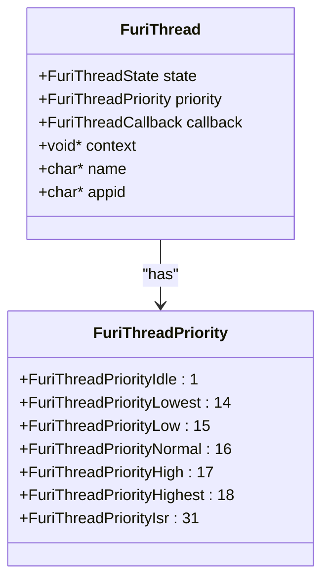
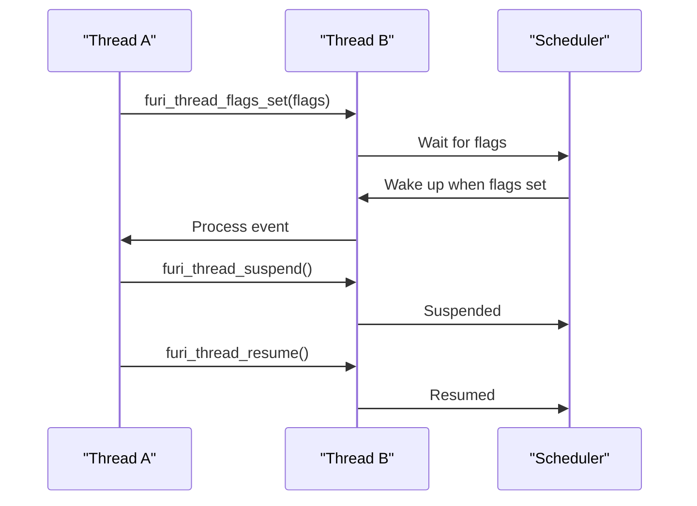
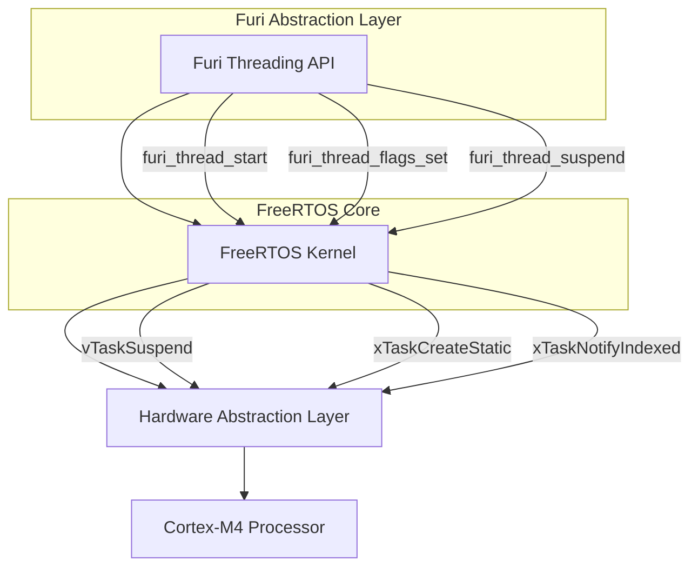

# Threading Model

<cite>
**Referenced Files in This Document**   
- [thread.h](file://furi/core/thread.h#L0-L507)
- [thread.c](file://furi/core/thread.c#L0-L756)
- [event_loop.h](file://furi/core/event_loop.h#L0-L163)
- [event_loop.c](file://furi/core/event_loop.c#L0-L381)
- [FreeRTOSConfig.h](file://targets/f7/inc/FreeRTOSConfig.h#L0-L163)
</cite>

## Table of Contents
1. [Threading Model](#threading-model)
2. [Thread Creation and Lifecycle Management](#thread-creation-and-lifecycle-management)
3. [Thread Priorities and Scheduling](#thread-priorities-and-scheduling)
4. [Thread Synchronization Mechanisms](#thread-synchronization-mechanisms)
5. [Event Loop Integration](#event-loop-integration)
6. [FreeRTOS Integration and Abstraction](#freertos-integration-and-abstraction)
7. [Thread Safety and Error Handling](#thread-safety-and-error-handling)
8. [Performance Monitoring and Diagnostics](#performance-monitoring-and-diagnostics)

## Thread Creation and Lifecycle Management

The Furi threading system provides a comprehensive API for creating, managing, and destroying threads in the embedded environment. The system offers multiple methods for thread allocation, each with different characteristics and use cases.

The primary thread creation functions are `furi_thread_alloc()`, `furi_thread_alloc_service()`, and `furi_thread_alloc_ex()`. The standard allocation function creates a fully configurable thread instance that can be modified and freed after use. Service threads, created with `furi_thread_alloc_service()`, are optimized for memory efficiency but come with limitations: they cannot return from their callback, cannot be joined or freed, and have a fixed stack size. This makes them suitable for long-running system services that require minimal overhead.

```c
// Example of creating a standard thread
FuriThread* my_thread = furi_thread_alloc_ex(
    "MyThread",
    1024,
    my_thread_callback,
    my_context);

// Example of creating a service thread
FuriThread* service_thread = furi_thread_alloc_service(
    "ServiceThread",
    512,
    service_callback,
    service_context);
```

Thread lifecycle management follows a strict state machine with three possible states: `FuriThreadStateStopped`, `FuriThreadStateStarting`, and `FuriThreadStateRunning`. Most configuration functions can only be called when a thread is in the `Stopped` state, ensuring thread safety and preventing race conditions during configuration.

The thread lifecycle begins with allocation, followed by configuration of properties such as name, stack size, callback function, and priority. Once configured, the thread is started using `furi_thread_start()`, which transitions it to the `Starting` state before it becomes `Running`. When a thread completes its execution, it automatically transitions back to the `Stopped` state and can be joined using `furi_thread_join()` to clean up resources.

**Section sources**
- [thread.h](file://furi/core/thread.h#L0-L507)
- [thread.c](file://furi/core/thread.c#L0-L756)

## Thread Priorities and Scheduling

The Furi threading system implements a priority-based preemptive scheduling model, with thread priorities defined in the `FuriThreadPriority` enumeration. The priority system is designed to provide fine-grained control over thread execution order while maintaining compatibility with the underlying FreeRTOS scheduler.

The priority levels are structured as follows:
- `FuriThreadPriorityIdle` (1): Lowest priority, for background tasks
- `FuriThreadPriorityLowest` (14) to `FuriThreadPriorityHighest` (18): Standard priority range
- `FuriThreadPriorityNormal` (16): Default priority for most application threads
- `FuriThreadPriorityIsr` (31): Highest possible priority for deferred ISR handling



**Diagram sources**
- [thread.h](file://furi/core/thread.h#L25-L45)
- [thread.c](file://furi/core/thread.c#L0-L756)

Thread priorities can be set using `furi_thread_set_priority()` before the thread is started, or dynamically adjusted for the current thread using `furi_thread_set_current_priority()`. The system ensures that priority changes are only allowed when threads are in the appropriate state, preventing race conditions and ensuring scheduler consistency.

The scheduling behavior follows standard real-time operating system principles: higher priority threads preempt lower priority ones, and threads of equal priority are scheduled round-robin. The system also provides `furi_thread_yield()` to allow a running thread to voluntarily relinquish the CPU, enabling cooperative multitasking when appropriate.

**Section sources**
- [thread.h](file://furi/core/thread.h#L25-L45)
- [thread.c](file://furi/core/thread.c#L0-L756)

## Thread Synchronization Mechanisms

The Furi threading system provides several mechanisms for thread synchronization and inter-thread communication, designed to be both efficient and easy to use in embedded contexts.

The primary synchronization mechanism is thread flags, implemented through the `furi_thread_flags_*` family of functions. These flags provide a lightweight way to signal between threads using a 31-bit bitmask (one bit is reserved by the system). Thread flags can be set on any thread using `furi_thread_flags_set()`, and threads can wait for specific flag patterns using `furi_thread_flags_wait()` with various options for conditional waiting.

```c
// Example of using thread flags for synchronization
uint32_t flags = furi_thread_flags_wait(
    MY_EVENT_FLAG, 
    FuriFlagWaitAny | FuriFlagNoClear, 
    FuriWaitForever);

if(flags & MY_EVENT_FLAG) {
    // Handle the event
    process_event();
}
```

The system also supports standard RTOS primitives such as mutexes, semaphores, and message queues, which are accessible through the Furi core library. These primitives provide additional synchronization options for more complex scenarios, such as protecting shared resources or implementing producer-consumer patterns.

Thread suspension and resumption are supported through `furi_thread_suspend()` and `furi_thread_resume()`, allowing one thread to temporarily halt the execution of another. This can be useful for implementing power management features or temporarily disabling background tasks during critical operations.



**Diagram sources**
- [thread.h](file://furi/core/thread.h#L307-L506)
- [thread.c](file://furi/core/thread.c#L399-L755)

**Section sources**
- [thread.h](file://furi/core/thread.h#L307-L506)
- [thread.c](file://furi/core/thread.c#L399-L755)

## Event Loop Integration

The Furi event loop system provides a reactive programming model that integrates seamlessly with the threading system, allowing for efficient event-driven programming in a single-threaded context. Each event loop is bound to a specific thread and can only be accessed from that thread, ensuring thread safety and preventing race conditions.

The event loop operates by continuously polling for events from various sources, including message queues, timers, and custom synchronization primitives. When an event occurs, the corresponding callback is executed in the context of the event loop thread. This model enables highly efficient resource utilization, as the thread only consumes CPU time when there are events to process.

```c
// Example of setting up an event loop
FuriEventLoop* event_loop = furi_event_loop_alloc();

// Subscribe to message queue events
furi_event_loop_message_queue_subscribe(
    event_loop,
    my_message_queue,
    FuriEventLoopEventIn,
    message_handler,
    my_context);

// Run the event loop
furi_event_loop_run(event_loop);

// Clean up
furi_event_loop_free(event_loop);
```

The event loop integrates with the threading system through several mechanisms:
1. **Tick callbacks**: Periodic callbacks that execute when the event loop is idle, acting as low-priority timers
2. **Deferred function calls**: Functions that are scheduled to run after all pending events have been processed
3. **Signal handling**: Integration with thread signals to handle system events like thread termination

The event loop uses FreeRTOS task notifications as its underlying synchronization mechanism, with dedicated notification indices for different event types (events, timers, pending callbacks). This allows for efficient wake-up signaling without the overhead of traditional semaphore or queue operations.

**Section sources**
- [event_loop.h](file://furi/core/event_loop.h#L0-L163)
- [event_loop.c](file://furi/core/event_loop.c#L0-L381)

## FreeRTOS Integration and Abstraction

The Furi threading API serves as a high-level abstraction layer over FreeRTOS, providing a simplified and consistent interface while leveraging the robust real-time capabilities of the underlying RTOS. This abstraction allows application developers to work with threads without needing to understand the intricacies of FreeRTOS, while still providing access to advanced features when needed.

The integration is configured through `FreeRTOSConfig.h`, which defines key parameters such as:
- `configUSE_PREEMPTION`: Enables preemptive scheduling
- `configMAX_PRIORITIES`: Sets the maximum number of priority levels (32)
- `configSUPPORT_STATIC_ALLOCATION`: Enables static task allocation
- `configTASK_NOTIFICATION_ARRAY_ENTRIES`: Configures three notification indices for different purposes



**Diagram sources**
- [FreeRTOSConfig.h](file://targets/f7/inc/FreeRTOSConfig.h#L0-L163)
- [thread.c](file://furi/core/thread.c#L0-L756)

The Furi system extends FreeRTOS with additional features such as:
- Thread-local storage for FuriThread instances
- Stack watermark monitoring to detect potential overflow
- Heap usage tracing for memory debugging
- Application ID tracking for process-like grouping of threads

The `furi_thread_body()` function serves as the entry point for all Furi threads, wrapping the user-provided callback and adding Furi-specific functionality such as stack watermark checking, heap tracing, and proper thread cleanup.

**Section sources**
- [FreeRTOSConfig.h](file://targets/f7/inc/FreeRTOSConfig.h#L0-L163)
- [thread.c](file://furi/core/thread.c#L0-L756)

## Thread Safety and Error Handling

The Furi threading system incorporates comprehensive error checking and safety mechanisms to prevent common threading issues in embedded systems. The system uses `furi_check()` macros extensively to validate preconditions and invariants, ensuring that threading operations are only performed in valid states.

Key safety features include:
- **State validation**: Most configuration functions require the thread to be in the `Stopped` state
- **Null pointer checking**: All thread pointers are validated before use
- **Priority bounds checking**: Priority values are validated against the allowed range
- **Stack size validation**: Stack sizes are checked for proper alignment and reasonable limits

The system also addresses common embedded threading issues:
- **Priority inversion**: Mitigated through the use of priority inheritance in mutexes (enabled by `configUSE_RECURSIVE_MUTEXES`)
- **Thread stack overflow**: Detected through stack watermark monitoring and configurable overflow checking
- **Resource leaks**: Prevented through strict lifecycle management and the requirement to join threads before freeing

When errors occur, the system provides clear diagnostic information through the logging system and, in critical cases, triggers a system crash with a descriptive message to prevent undefined behavior.

**Section sources**
- [thread.h](file://furi/core/thread.h#L0-L507)
- [thread.c](file://furi/core/thread.c#L0-L756)

## Performance Monitoring and Diagnostics

The Furi threading system includes several built-in tools for monitoring thread performance and diagnosing issues in embedded applications.

The `furi_thread_enumerate()` function provides a comprehensive view of all active threads, returning detailed information including:
- Thread name and application ID
- Current priority and state
- Stack usage (current and minimum watermark)
- Heap memory consumption
- CPU utilization statistics

```c
// Example of enumerating threads
FuriThreadList* thread_list = furi_thread_list_alloc();
if(furi_thread_enumerate(thread_list)) {
    // Process thread information
    furi_thread_list_foreach(thread_list, print_thread_info, NULL);
}
furi_thread_list_free(thread_list);
```

Stack overflow protection is implemented through multiple mechanisms:
1. **Stack watermark monitoring**: `furi_thread_get_stack_space()` returns the minimum stack space used since the thread started
2. **Runtime checking**: The system checks stack watermark at thread exit and logs warnings if usage is dangerously low
3. **MPU protection**: The Memory Protection Unit is configured to protect thread stacks when switching contexts

Heap usage tracking can be enabled per-thread with `furi_thread_enable_heap_trace()`, allowing developers to monitor dynamic memory allocation patterns and identify potential memory leaks.

These diagnostic tools are essential for optimizing thread configuration in resource-constrained embedded environments, helping developers balance stack size, priority, and CPU usage for optimal system performance.

**Section sources**
- [thread.h](file://furi/core/thread.h#L0-L507)
- [thread.c](file://furi/core/thread.c#L0-L756)