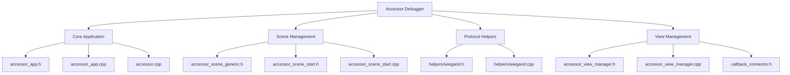
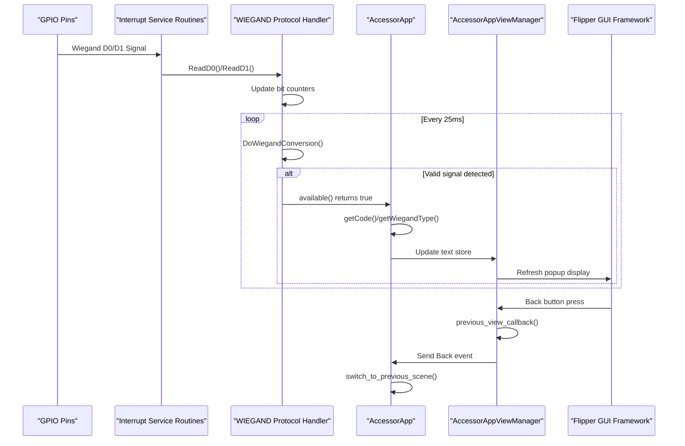
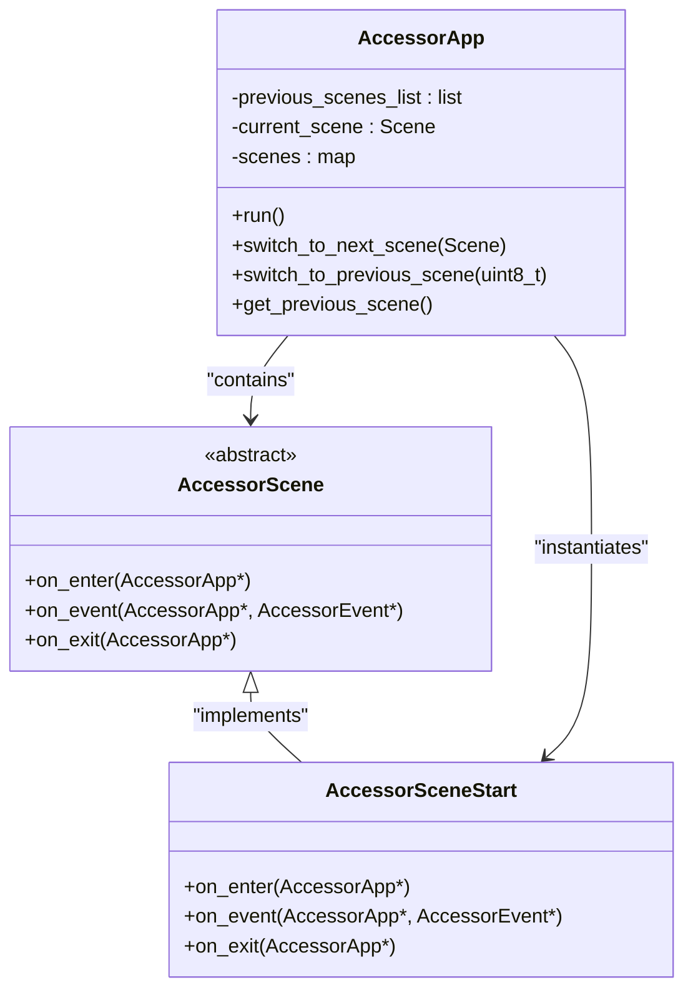
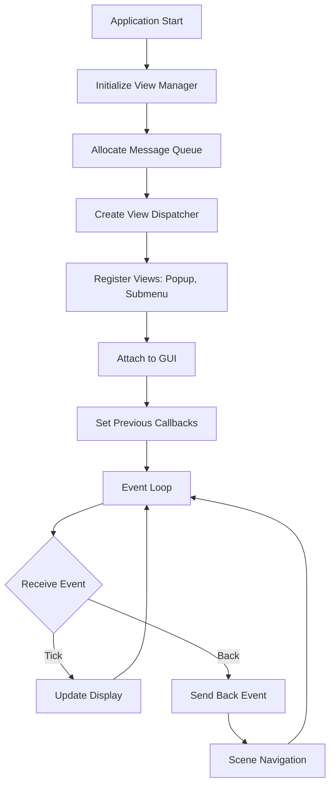
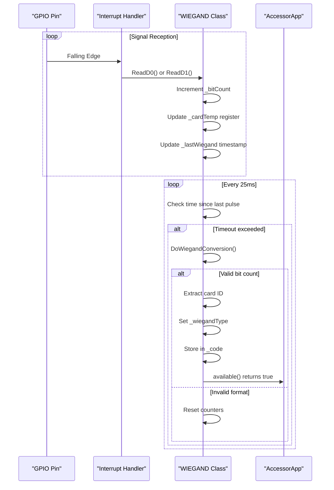
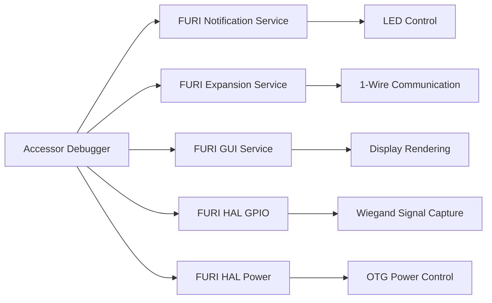

# Accessor Debugger

<cite>
**Referenced Files in This Document**   
- [accessor_app.h](file://applications/debug/accessor/accessor_app.h)
- [accessor_app.cpp](file://applications/debug/accessor/accessor_app.cpp)
- [accessor.cpp](file://applications/debug/accessor/accessor.cpp)
- [accessor_event.h](file://applications/debug/accessor/accessor_event.h)
- [accessor_scene_start.h](file://applications/debug/accessor/scene/accessor_scene_start.h)
- [accessor_scene_start.cpp](file://applications/debug/accessor/scene/accessor_scene_start.cpp)
- [accessor_view_manager.h](file://applications/debug/accessor/accessor_view_manager.h)
- [accessor_view_manager.cpp](file://applications/debug/accessor/accessor_view_manager.cpp)
- [helpers/wiegand.h](file://applications/debug/accessor/helpers/wiegand.h)
- [helpers/wiegand.cpp](file://applications/debug/accessor/helpers/wiegand.cpp)
- [callback_connector.h](file://applications/debug/accessor/callback_connector.h)
- [scene/accessor_scene_generic.h](file://applications/debug/accessor/scene/accessor_scene_generic.h)
</cite>

## Table of Contents
1. [Introduction](#introduction)
2. [Project Structure](#project-structure)
3. [Core Components](#core-components)
4. [Architecture Overview](#architecture-overview)
5. [Detailed Component Analysis](#detailed-component-analysis)
6. [Dependency Analysis](#dependency-analysis)
7. [Performance Considerations](#performance-considerations)
8. [Troubleshooting Guide](#troubleshooting-guide)
9. [Conclusion](#conclusion)

## Introduction
The Accessor Debugger is a diagnostic interface designed for analyzing and testing access control systems on the Flipper Zero platform. This tool provides real-time monitoring and debugging capabilities for various access control signal types, with primary focus on the Wiegand protocol and 1-Wire communication. The implementation follows a scene-based navigation model with event-driven architecture, allowing users to capture, decode, and analyze access control signals through an intuitive interface. The debugger integrates with the Flipper Zero's hardware peripherals to monitor GPIO pins for Wiegand data0 and data1 signals, while also supporting 1-Wire protocol analysis for iButton-style access tokens.

## Project Structure
The Accessor Debugger application is organized within the debug module of the Flipper Zero firmware, following a structured component-based architecture. The implementation separates concerns into distinct directories for scenes, helpers, and core application logic, with clear interfaces between UI components and hardware interaction layers.

**Diagram sources**
- [accessor_app.h](file://applications/debug/accessor/accessor_app.h#L1-L57)
- [accessor_scene_generic.h](file://applications/debug/accessor/scene/accessor_scene_generic.h#L1-L14)
- [accessor_view_manager.h](file://applications/debug/accessor/accessor_view_manager.h#L1-L40)

**Section sources**
- [accessor_app.h](file://applications/debug/accessor/accessor_app.h#L1-L57)
- [accessor_view_manager.h](file://applications/debug/accessor/accessor_view_manager.h#L1-L40)
- [scene/accessor_scene_generic.h](file://applications/debug/accessor/scene/accessor_scene_generic.h#L1-L14)

## Core Components
The Accessor Debugger consists of several core components that work together to provide access control system diagnostics. The main application class (AccessorApp) manages the overall state and coordinates between scene navigation, view rendering, and hardware interaction. The scene management system implements a stack-based navigation model, allowing users to move between different diagnostic views. The view manager component handles UI rendering through the Flipper Zero's GUI framework, while the protocol helpers provide specialized decoding for Wiegand and 1-Wire signals. The event system enables communication between these components through a message queue, ensuring responsive user interaction while maintaining real-time signal monitoring capabilities.

**Section sources**
- [accessor_app.h](file://applications/debug/accessor/accessor_app.h#L11-L57)
- [accessor_view_manager.h](file://applications/debug/accessor/accessor_view_manager.h#L8-L40)
- [accessor_event.h](file://applications/debug/accessor/accessor_event.h#L4-L20)

## Architecture Overview
The Accessor Debugger follows a Model-View-Controller (MVC) architectural pattern, adapted to the embedded constraints of the Flipper Zero platform. The application maintains a central state model that includes signal data, user interface state, and protocol configuration. The view layer renders this state through popup and submenu interfaces, while the controller logic handles user input and hardware events. A key architectural feature is the separation of time-critical signal processing from UI rendering, achieved through interrupt service routines for signal capture and a message queue for event dispatching.

**Diagram sources**
- [helpers/wiegand.cpp](file://applications/debug/accessor/helpers/wiegand.cpp#L40-L99)
- [accessor_app.cpp](file://applications/debug/accessor/accessor_app.cpp#L6-L32)
- [accessor_view_manager.cpp](file://applications/debug/accessor/accessor_view_manager.cpp#L68-L76)

## Detailed Component Analysis

### Scene Management Flow
The scene management system in the Accessor Debugger implements a navigation stack that tracks the user's path through different diagnostic views. The AccessorApp class maintains a list of previous scenes, allowing for intuitive back navigation. Each scene is responsible for its own entry and exit behavior, implementing the on_enter, on_event, and on_exit virtual methods defined in the AccessorScene base class. The start scene (AccessorSceneStart) serves as the primary interface, displaying captured access control data in real-time. Scene transitions are triggered by user events or programmatically through the switch_to_next_scene and switch_to_previous_scene methods, with proper cleanup performed when leaving a scene.

**Diagram sources**
- [accessor_app.h](file://applications/debug/accessor/accessor_app.h#L11-L57)
- [accessor_scene_generic.h](file://applications/debug/accessor/scene/accessor_scene_generic.h#L6-L11)
- [accessor_scene_start.h](file://applications/debug/accessor/scene/accessor_scene_start.h#L4-L10)

**Section sources**
- [accessor_app.cpp](file://applications/debug/accessor/accessor_app.cpp#L55-L106)
- [accessor_scene_start.cpp](file://applications/debug/accessor/scene/accessor_scene_start.cpp#L6-L88)

### View Rendering Logic
The view rendering system is managed by the AccessorAppViewManager class, which acts as an intermediary between the application logic and the Flipper Zero's GUI framework. The view manager maintains references to different UI components (popup, submenu) and handles the switching between them based on the current application state. It uses a message queue to decouple event production from consumption, ensuring that UI updates do not interfere with time-critical signal processing. The callback connector pattern is employed to bridge C++ member functions with the C-based GUI framework callbacks, allowing the view manager to notify the application of user input events such as the back button press.

**Diagram sources**
- [accessor_view_manager.cpp](file://applications/debug/accessor/accessor_view_manager.cpp#L5-L81)
- [callback_connector.h](file://applications/debug/accessor/callback_connector.h#L1-L107)

**Section sources**
- [accessor_view_manager.h](file://applications/debug/accessor/accessor_view_manager.h#L8-L40)
- [accessor_view_manager.cpp](file://applications/debug/accessor/accessor_view_manager.cpp#L5-L81)

### Event Handling Mechanisms
The event handling system in the Accessor Debugger follows a producer-consumer pattern, with hardware interrupts and user input serving as event producers, and the main application loop as the consumer. Events are defined in the AccessorEvent class, which includes a type field (Tick, Back) and a payload union for additional data. The view manager receives events from the GUI framework and places them in a message queue, where they are consumed by the main application loop. The Wiegand signal processing also generates implicit events through the available() method, which triggers data display updates on each tick. This architecture ensures that time-critical operations (signal capture) are not blocked by UI rendering or user interaction.

**Section sources**
- [accessor_event.h](file://applications/debug/accessor/accessor_event.h#L4-L20)
- [accessor_app.cpp](file://applications/debug/accessor/accessor_app.cpp#L7-L26)
- [accessor_view_manager.cpp](file://applications/debug/accessor/accessor_view_manager.cpp#L57-L66)

### Signal Capture and Decoding
The Accessor Debugger provides comprehensive support for capturing and decoding Wiegand protocol signals, which are commonly used in access control systems. The WIEGAND class implements interrupt-driven signal capture on GPIO pins PA4 (D0) and PA7 (PA1), counting bit transitions and reconstructing card data. The implementation supports multiple Wiegand formats including 24-bit, 26-bit, 32-bit, and 34-bit variants, automatically detecting the format based on bit count. Signal integrity is verified through timing analysis, with a 25ms timeout used to determine the end of transmission. For 8-bit keyboard Wiegand formats, data integrity is checked by verifying that the high nibble is the logical inverse of the low nibble.

**Diagram sources**
- [helpers/wiegand.cpp](file://applications/debug/accessor/helpers/wiegand.cpp#L50-L219)
- [accessor_scene_start.cpp](file://applications/debug/accessor/scene/accessor_scene_start.cpp#L20-L77)

**Section sources**
- [helpers/wiegand.h](file://applications/debug/accessor/helpers/wiegand.h#L3-L29)
- [helpers/wiegand.cpp](file://applications/debug/accessor/helpers/wiegand.cpp#L1-L219)

### Integration with GUI Framework
The Accessor Debugger integrates with the Flipper Zero's GUI framework through the ViewDispatcher and Gui services, which are accessed via FURI records. The view manager establishes a connection to the GUI system during initialization and attaches its view dispatcher to the fullscreen display. It manages multiple view types (popup, submenu) that can be switched dynamically based on the application state. The integration uses the callback connector pattern to bridge the C++ object-oriented design with the C-based GUI callbacks, allowing member functions to be registered as event handlers. Notification events are also integrated, allowing the application to provide visual feedback through LED blinks when successful signal captures occur.

**Section sources**
- [accessor_view_manager.cpp](file://applications/debug/accessor/accessor_view_manager.cpp#L18-L24)
- [accessor_app.cpp](file://applications/debug/accessor/accessor_app.cpp#L36-L37)
- [accessor_app.cpp](file://applications/debug/accessor/accessor_app.cpp#L110-L116)

## Dependency Analysis
The Accessor Debugger has well-defined dependencies on both hardware peripherals and software services within the Flipper Zero ecosystem. The application depends on GPIO services for Wiegand signal capture, the notification system for user feedback, and the expansion bus interface for 1-Wire communication. It also relies on the core GUI framework for display rendering and user input handling. The dependency management follows the FURI record pattern, where services are opened and closed through the furi_record_open and furi_record_close functions. This approach ensures proper resource management and prevents conflicts with other applications that might use the same hardware peripherals.

**Diagram sources**
- [accessor_app.cpp](file://applications/debug/accessor/accessor_app.cpp#L36-L48)
- [accessor_view_manager.cpp](file://applications/debug/accessor/accessor_view_manager.cpp#L18-L20)

**Section sources**
- [accessor_app.cpp](file://applications/debug/accessor/accessor_app.cpp#L34-L49)
- [accessor_view_manager.cpp](file://applications/debug/accessor/accessor_view_manager.cpp#L18-L20)

## Performance Considerations
The Accessor Debugger is designed with performance-critical signal processing in mind, particularly for the Wiegand protocol implementation. The signal capture uses interrupt service routines to ensure timely response to GPIO transitions, with critical sections protected by FURI_CRITICAL_ENTER/EXIT macros to prevent race conditions. The 25ms timeout for signal completion is implemented using the DWT cycle counter for high-resolution timing without relying on less precise system tick interrupts. Memory usage is optimized by using static variables in the WIEGAND class rather than dynamic allocation, reducing heap fragmentation. The separation of signal processing from UI rendering ensures that display updates do not interfere with the real-time requirements of signal capture, maintaining reliable operation even under heavy system load.

**Section sources**
- [helpers/wiegand.cpp](file://applications/debug/accessor/helpers/wiegand.cpp#L34-L36)
- [helpers/wiegand.cpp](file://applications/debug/accessor/helpers/wiegand.cpp#L137-L140)
- [accessor_app.h](file://applications/debug/accessor/accessor_app.h#L48-L49)

## Troubleshooting Guide
When debugging access control systems with the Accessor Debugger, several common scenarios may arise. For signal timing issues, verify that the Wiegand signal meets the standard timing requirements (typically 50-100 microseconds between bits and 25ms between transmissions). If data corruption is detected, check for electromagnetic interference on the signal lines and ensure proper grounding. For 8-bit keyboard Wiegand formats, validate that the high nibble is the logical inverse of the low nibble, as this is used for data integrity checking. When working with 1-Wire devices, ensure the pull-up resistor is properly configured and verify the reset pulse timing. If the debugger fails to detect signals, confirm that the GPIO pins are correctly connected and that no other application is using the same hardware resources.

**Section sources**
- [helpers/wiegand.cpp](file://applications/debug/accessor/helpers/wiegand.cpp#L164-L172)
- [helpers/wiegand.cpp](file://applications/debug/accessor/helpers/wiegand.cpp#L208-L215)
- [accessor_scene_start.cpp](file://applications/debug/accessor/scene/accessor_scene_start.cpp#L40-L51)

## Conclusion
The Accessor Debugger provides a comprehensive diagnostic interface for analyzing and testing access control systems on the Flipper Zero platform. Its architecture effectively separates concerns between signal processing, user interface, and application logic, enabling reliable real-time monitoring of Wiegand and 1-Wire protocols. The scene-based navigation system offers an intuitive user experience, while the event-driven design ensures responsive operation. The implementation demonstrates effective use of embedded systems programming patterns, including interrupt handling, critical section protection, and resource management through the FURI record system. This tool serves as a valuable asset for security researchers and access control system administrators, providing detailed insights into the operation of various access control technologies.