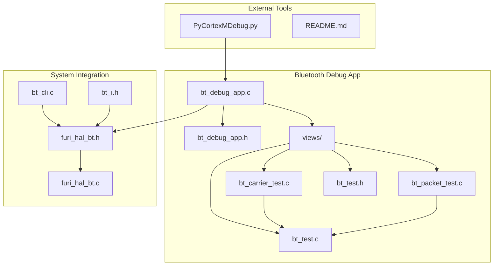
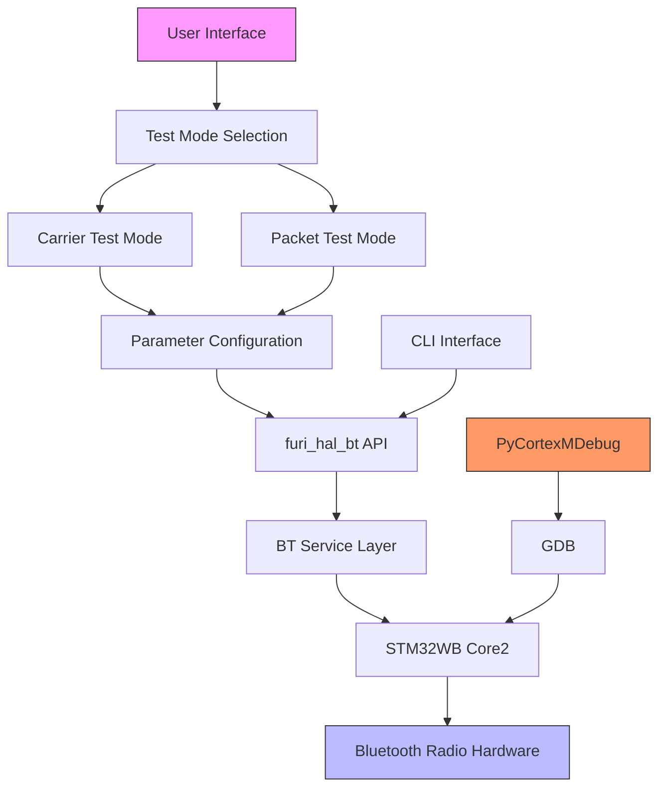
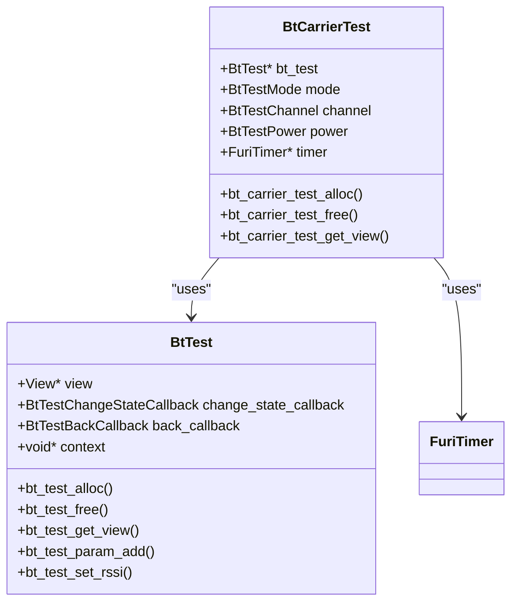
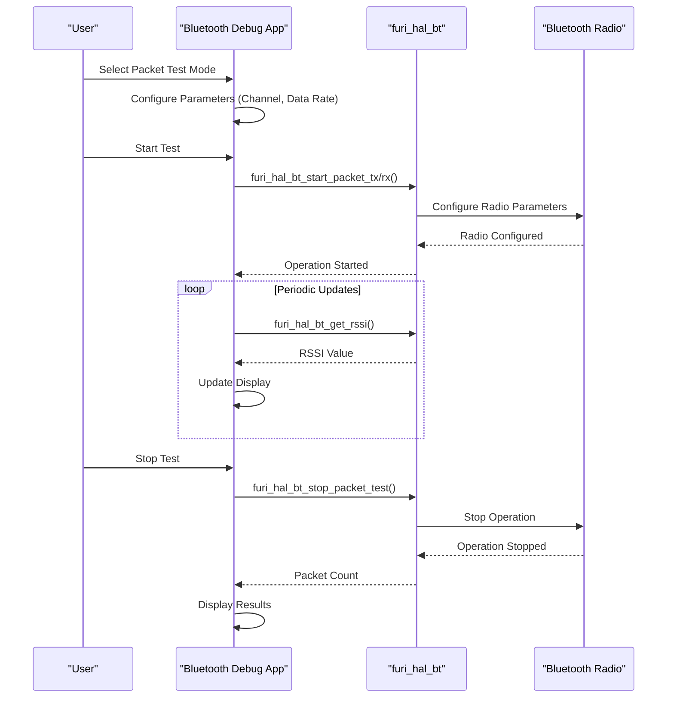
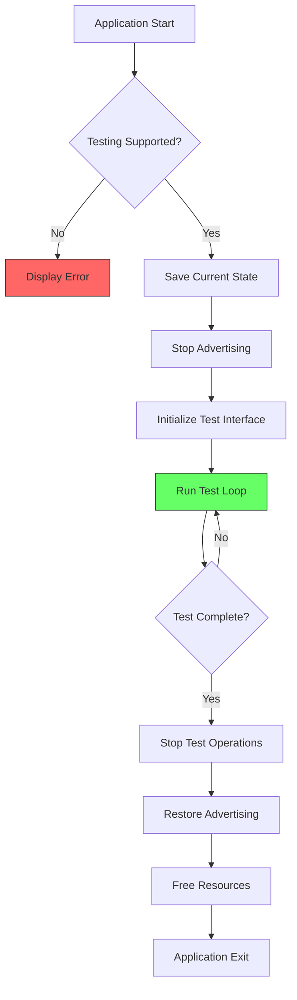
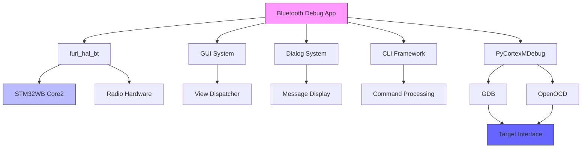

# Bluetooth Debug App

<cite>
**Referenced Files in This Document**   
- [bt_debug_app.c](file://applications/debug/bt_debug_app/bt_debug_app.c)
- [bt_debug_app.h](file://applications/debug/bt_debug_app/bt_debug_app.h)
- [bt_carrier_test.c](file://applications/debug/bt_debug_app/views/bt_carrier_test.c)
- [bt_packet_test.c](file://applications/debug/bt_debug_app/views/bt_packet_test.c)
- [bt_test.c](file://applications/debug/bt_debug_app/views/bt_test.c)
- [bt_test.h](file://applications/debug/bt_debug_app/views/bt_test.h)
- [furi_hal_bt.h](file://targets/furi_hal_include/furi_hal_bt.h)
- [furi_hal_bt.c](file://targets/f7/furi_hal/furi_hal_bt.c)
- [bt_cli.c](file://applications/services/bt/bt_cli.c)
- [bt_i.h](file://applications/services/bt/bt_service/bt_i.h)
- [PyCortexMDebug.py](file://scripts/debug/PyCortexMDebug/PyCortexMDebug.py)
- [README.md](file://scripts/debug/PyCortexMDebug/README.md)
</cite>

## Table of Contents
1. [Introduction](#introduction)
2. [Project Structure](#project-structure)
3. [Core Components](#core-components)
4. [Architecture Overview](#architecture-overview)
5. [Detailed Component Analysis](#detailed-component-analysis)
6. [Dependency Analysis](#dependency-analysis)
7. [Performance Considerations](#performance-considerations)
8. [Troubleshooting Guide](#troubleshooting-guide)
9. [Conclusion](#conclusion)

## Introduction
The Bluetooth Debug App is a specialized diagnostic tool designed for testing and analyzing Bluetooth communication layers on the Flipper Zero device. This application provides comprehensive functionality for engineers and developers to test packet transmission, perform carrier frequency analysis, and debug connection states. The app interfaces directly with the BT service layer and hardware abstraction to provide low-level radio control, enabling detailed analysis of Bluetooth stack behavior. It supports integration with external debugging tools through the PyCortexMDebug framework, allowing for advanced debugging capabilities. The application is specifically designed to diagnose pairing issues, signal strength problems, and protocol compliance, making it an essential tool for Bluetooth development and troubleshooting on the platform.

## Project Structure
The Bluetooth Debug App is organized within the Flipper Zero firmware structure under the debug applications directory. The application follows a modular architecture with clear separation between the main application logic and view components. The core functionality is implemented in the bt_debug_app directory, which contains the main application file (bt_debug_app.c) and header (bt_debug_app.h). The view components are organized in a separate views subdirectory, containing specialized modules for carrier testing, packet testing, and shared UI components. The application integrates with the system's BT service layer through the furi_hal_bt interface, which provides hardware abstraction for Bluetooth operations. External debugging capabilities are supported through the PyCortexMDebug framework located in the scripts directory.

**Diagram sources **
- [bt_debug_app.c](file://applications/debug/bt_debug_app/bt_debug_app.c#L1-L118)
- [bt_carrier_test.c](file://applications/debug/bt_debug_app/views/bt_carrier_test.c#L1-L189)
- [bt_packet_test.c](file://applications/debug/bt_debug_app/views/bt_packet_test.c#L1-L156)
- [bt_test.c](file://applications/debug/bt_debug_app/views/bt_test.c#L1-L434)
- [furi_hal_bt.h](file://targets/furi_hal_include/furi_hal_bt.h#L1-L298)
- [bt_cli.c](file://applications/services/bt/bt_cli.c#L1-L89)
- [PyCortexMDebug.py](file://scripts/debug/PyCortexMDebug/PyCortexMDebug.py#L1-L32)

**Section sources**
- [bt_debug_app.c](file://applications/debug/bt_debug_app/bt_debug_app.c#L1-L118)
- [bt_debug_app.h](file://applications/debug/bt_debug_app/bt_debug_app.h#L1-L27)
- [application.fam](file://applications/debug/bt_debug_app/application.fam#L1-L18)

## Core Components
The Bluetooth Debug App consists of several core components that work together to provide comprehensive Bluetooth testing capabilities. The main application component (bt_debug_app.c) serves as the entry point and controller for the entire application, managing the view dispatcher and coordinating between different test modes. Two primary test modules implement specific functionality: the carrier test module for frequency and power analysis, and the packet test module for data transmission testing. These modules utilize a shared UI framework (bt_test.c) that provides a consistent interface for parameter selection and status display. The application interfaces with the hardware through the furi_hal_bt abstraction layer, which provides low-level access to Bluetooth radio functions. The CLI interface (bt_cli.c) extends the application's capabilities by providing command-line access to testing functions, enabling automation and integration with external tools.

**Section sources**
- [bt_debug_app.c](file://applications/debug/bt_debug_app/bt_debug_app.c#L1-L118)
- [bt_carrier_test.c](file://applications/debug/bt_debug_app/views/bt_carrier_test.c#L1-L189)
- [bt_packet_test.c](file://applications/debug/bt_debug_app/views/bt_packet_test.c#L1-L156)
- [bt_test.c](file://applications/debug/bt_debug_app/views/bt_test.c#L1-L434)
- [furi_hal_bt.h](file://targets/furi_hal_include/furi_hal_bt.h#L1-L298)

## Architecture Overview
The Bluetooth Debug App follows a layered architecture that separates the user interface from the underlying hardware control. At the highest level, the application presents a menu-driven interface that allows users to select between carrier testing and packet testing modes. Each test mode is implemented as a separate view module that manages its specific parameters and display logic. These view modules interact with a shared UI framework that handles input processing, parameter selection, and status display. Below the UI layer, the application interfaces with the BT service layer through the furi_hal_bt API, which provides hardware abstraction for Bluetooth operations. This abstraction layer communicates with the actual Bluetooth radio hardware through the STM32WB's dual-core architecture, where the second core runs the Bluetooth protocol stack. The application also integrates with external debugging tools through the PyCortexMDebug framework, which provides GDB integration for low-level debugging.

**Diagram sources **
- [bt_debug_app.c](file://applications/debug/bt_debug_app/bt_debug_app.c#L1-L118)
- [bt_carrier_test.c](file://applications/debug/bt_debug_app/views/bt_carrier_test.c#L1-L189)
- [bt_packet_test.c](file://applications/debug/bt_debug_app/views/bt_packet_test.c#L1-L156)
- [furi_hal_bt.h](file://targets/furi_hal_include/furi_hal_bt.h#L1-L298)
- [furi_hal_bt.c](file://targets/f7/furi_hal/furi_hal_bt.c#L1-L439)
- [bt_cli.c](file://applications/services/bt/bt_cli.c#L1-L89)
- [PyCortexMDebug.py](file://scripts/debug/PyCortexMDebug/PyCortexMDebug.py#L1-L32)

## Detailed Component Analysis

### Carrier Frequency Testing
The carrier frequency testing component allows users to analyze Bluetooth radio performance at specific frequencies and power levels. This module provides three test modes: receive (Rx), transmit (Tx), and hopping transmit (Hopping Tx). In receive mode, the application measures signal strength (RSSI) on a selected channel, providing real-time feedback on signal quality. In transmit mode, the application generates a continuous carrier signal at a specified frequency and power level, allowing for transmitter performance analysis. The hopping transmit mode cycles through multiple channels, simulating frequency hopping behavior. Users can select from three standard Bluetooth frequencies (2402 MHz, 2440 MHz, and 2480 MHz) and adjust transmission power from 0 to 6 dB. The test results are displayed in real-time, with RSSI values shown during reception and transmission statistics provided after test completion.

#### Carrier Test Implementation

**Diagram sources **
- [bt_carrier_test.c](file://applications/debug/bt_debug_app/views/bt_carrier_test.c#L1-L189)
- [bt_test.c](file://applications/debug/bt_debug_app/views/bt_test.c#L1-L434)
- [furi_hal_bt.h](file://targets/furi_hal_include/furi_hal_bt.h#L1-L298)

**Section sources**
- [bt_carrier_test.c](file://applications/debug/bt_debug_app/views/bt_carrier_test.c#L1-L189)
- [bt_test.c](file://applications/debug/bt_debug_app/views/bt_test.c#L1-L434)
- [furi_hal_bt.h](file://targets/furi_hal_include/furi_hal_bt.h#L180-L190)

### Packet Transmission Testing
The packet transmission testing component enables comprehensive analysis of Bluetooth data communication. This module supports both transmission and reception testing modes, allowing users to evaluate the complete communication cycle. In transmission mode, the application sends test packets on a selected channel using configurable data rates (1 Mbps or 2 Mbps). The transmitted packet count is tracked and displayed upon test completion. In reception mode, the application listens for incoming packets on a specified channel and data rate, measuring signal strength and counting received packets. The test interface provides real-time feedback during operation, with RSSI values updated periodically during reception. After test completion, detailed statistics are displayed, including packet counts and signal quality metrics. This functionality is essential for diagnosing communication issues, verifying protocol compliance, and optimizing transmission parameters.

#### Packet Test Implementation

**Diagram sources **
- [bt_packet_test.c](file://applications/debug/bt_debug_app/views/bt_packet_test.c#L1-L156)
- [bt_test.c](file://applications/debug/bt_debug_app/views/bt_test.c#L1-L434)
- [furi_hal_bt.h](file://targets/furi_hal_include/furi_hal_bt.h#L191-L203)

**Section sources**
- [bt_packet_test.c](file://applications/debug/bt_debug_app/views/bt_packet_test.c#L1-L156)
- [bt_test.c](file://applications/debug/bt_debug_app/views/bt_test.c#L1-L434)
- [furi_hal_bt.h](file://targets/furi_hal_include/furi_hal_bt.h#L191-L203)

### Connection State Debugging
The connection state debugging functionality provides tools for analyzing and troubleshooting Bluetooth pairing and connection issues. The application integrates with the system's BT service layer to monitor connection status and provide diagnostic information. When the application starts, it checks the current Bluetooth stack version and verifies that testing features are supported. If the radio stack does not support testing (indicated by a non-Full stack type), the application displays an error message and exits. During operation, the application temporarily stops Bluetooth advertising to prevent interference with testing, restoring the previous state when the application closes. The CLI interface provides additional debugging commands, including hci_info which displays detailed Bluetooth controller state information. This comprehensive approach allows developers to diagnose connection problems, verify stack configuration, and ensure proper operation of Bluetooth services.

#### Connection State Flow

**Diagram sources **
- [bt_debug_app.c](file://applications/debug/bt_debug_app/bt_debug_app.c#L97-L117)
- [furi_hal_bt.h](file://targets/furi_hal_include/furi_hal_bt.h#L63-L64)
- [bt_cli.c](file://applications/services/bt/bt_cli.c#L11-L19)

**Section sources**
- [bt_debug_app.c](file://applications/debug/bt_debug_app/bt_debug_app.c#L97-L117)
- [furi_hal_bt.h](file://targets/furi_hal_include/furi_hal_bt.h#L63-L64)
- [bt_cli.c](file://applications/services/bt/bt_cli.c#L11-L19)

## Dependency Analysis
The Bluetooth Debug App has several critical dependencies that enable its functionality. The primary dependency is the furi_hal_bt hardware abstraction layer, which provides access to Bluetooth radio functions. This layer depends on the STM32WB's dual-core architecture, where the second core runs the Bluetooth protocol stack firmware. The application also depends on the GUI system for user interface rendering and input handling, using the view dispatcher to manage different test modes. Additional dependencies include the dialog system for error messages and the CLI framework for command-line interface functionality. The PyCortexMDebug integration depends on GDB and OpenOCD for low-level debugging capabilities. These dependencies form a hierarchical structure where the application relies on higher-level system services, which in turn depend on lower-level hardware abstraction and driver components.

**Diagram sources **
- [bt_debug_app.c](file://applications/debug/bt_debug_app/bt_debug_app.c#L2-L118)
- [furi_hal_bt.h](file://targets/furi_hal_include/furi_hal_bt.h#L1-L298)
- [bt_cli.c](file://applications/services/bt/bt_cli.c#L1-L89)
- [PyCortexMDebug.py](file://scripts/debug/PyCortexMDebug/PyCortexMDebug.py#L1-L32)

**Section sources**
- [bt_debug_app.c](file://applications/debug/bt_debug_app/bt_debug_app.c#L2-L118)
- [furi_hal_bt.h](file://targets/furi_hal_include/furi_hal_bt.h#L1-L298)
- [bt_cli.c](file://applications/services/bt/bt_cli.c#L1-L89)
- [PyCortexMDebug.py](file://scripts/debug/PyCortexMDebug/PyCortexMDebug.py#L1-L32)

## Performance Considerations
The Bluetooth Debug App is designed with performance optimization in mind, particularly for low-level radio operations. The application uses efficient timer callbacks to update display information without consuming excessive CPU resources. For carrier testing, the application implements a periodic timer that updates RSSI values every 250 milliseconds during reception, balancing responsiveness with power consumption. In packet testing mode, the application minimizes overhead by directly interfacing with the hardware abstraction layer, reducing latency in packet transmission and reception. The UI framework is optimized for the Flipper Zero's display capabilities, using efficient drawing routines to update only changed portions of the screen. When performing extended tests, the application allows users to stop operations via interrupt, ensuring responsiveness even during long-running operations. For production use, developers should consider the impact of continuous transmission on battery life and thermal performance, as prolonged radio activity can significantly increase power consumption.

## Troubleshooting Guide
When encountering issues with the Bluetooth Debug App, several common problems and solutions should be considered. If the application displays "Incorrect RadioStack" error, this indicates that the device is running a light Bluetooth stack that does not support testing features. To resolve this, ensure the device has the full Bluetooth stack firmware installed. For pairing issues, verify that the target device supports the selected Bluetooth mode and data rate. Signal strength problems may be caused by physical obstructions, distance, or interference from other wireless devices; try moving closer to the target or changing the test channel. If packet transmission tests show low success rates, check for environmental interference or verify that the receiver is properly configured. For CLI command issues, ensure that the CLI interface is properly initialized and that commands are entered with correct syntax. When using external debugging tools, verify GDB and OpenOCD connections and ensure the PyCortexMDebug script is properly loaded. For persistent issues, reset the Bluetooth stack by restarting the device and ensure no other applications are using the Bluetooth radio.

**Section sources**
- [bt_debug_app.c](file://applications/debug/bt_debug_app/bt_debug_app.c#L97-L101)
- [bt_cli.c](file://applications/services/bt/bt_cli.c#L22-L89)
- [furi_hal_bt.h](file://targets/furi_hal_include/furi_hal_bt.h#L144-L149)
- [README.md](file://scripts/debug/PyCortexMDebug/README.md#L1-L36)

## Conclusion
The Bluetooth Debug App provides a comprehensive suite of tools for testing and analyzing Bluetooth communication on the Flipper Zero platform. Through its carrier frequency testing, packet transmission analysis, and connection state debugging capabilities, the application enables developers to thoroughly evaluate Bluetooth performance and diagnose issues. The modular architecture separates UI components from hardware control, providing a clean and maintainable codebase. Integration with the furi_hal_bt abstraction layer ensures compatibility with the underlying hardware while providing a consistent interface for radio operations. The application's support for external debugging tools through the PyCortexMDebug framework extends its capabilities for advanced troubleshooting. By following the provided troubleshooting guidance and considering performance implications, developers can effectively use this tool to ensure reliable Bluetooth operation in their applications.