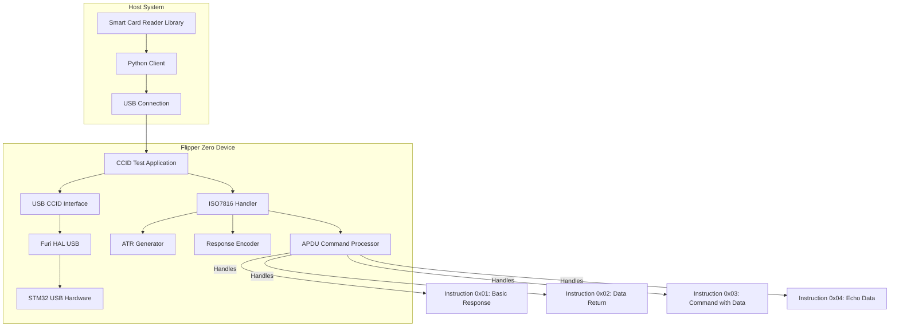
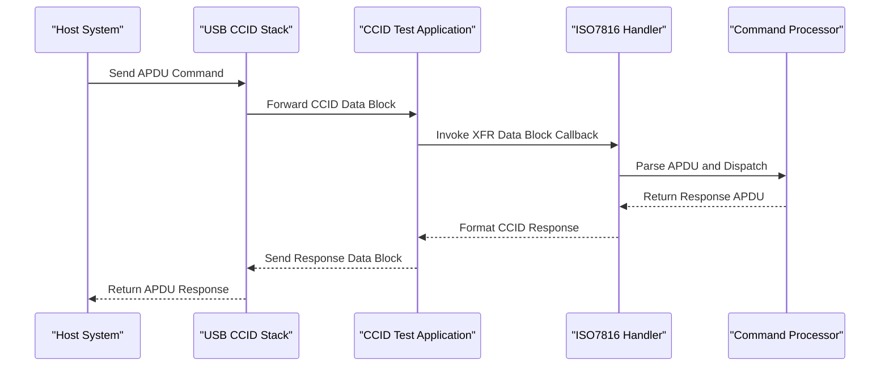
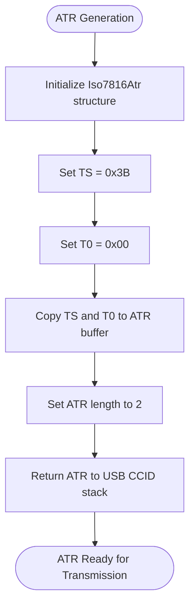
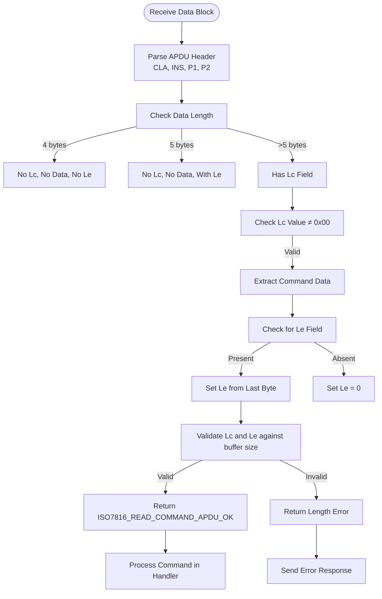
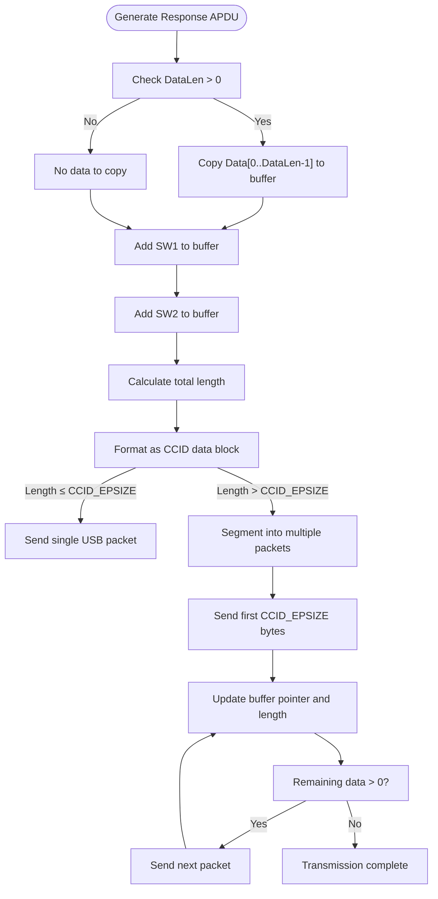
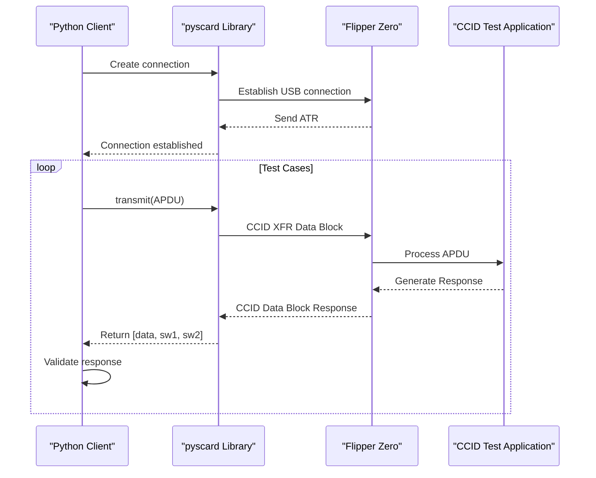
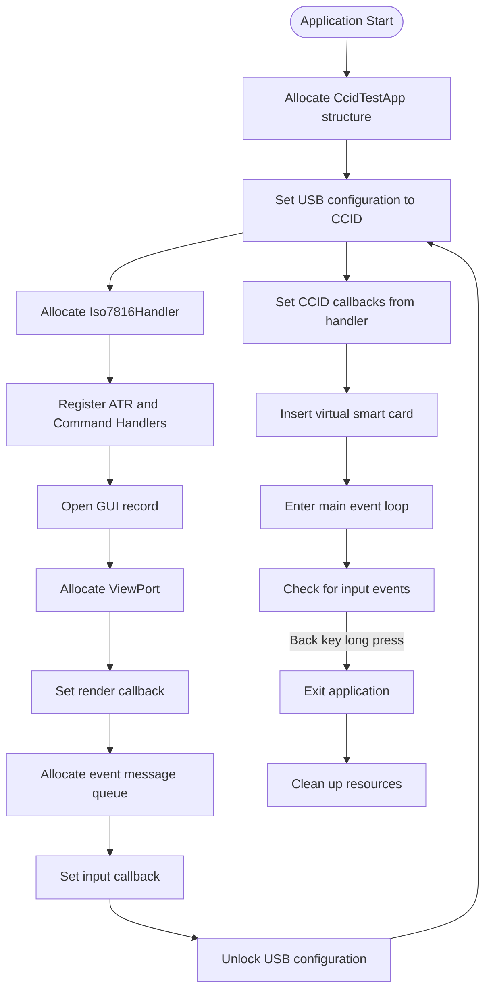

# CCID Test Application

<cite>
**Referenced Files in This Document**   
- [ccid_test_app.c](file://applications/debug/ccid_test/ccid_test_app.c)
- [ccid_test_app_commands.c](file://applications/debug/ccid_test/ccid_test_app_commands.c)
- [ccid_test_app_commands.h](file://applications/debug/ccid_test/ccid_test_app_commands.h)
- [iso7816_handler.c](file://applications/debug/ccid_test/iso7816/iso7816_handler.c)
- [iso7816_handler.h](file://applications/debug/ccid_test/iso7816/iso7816_handler.h)
- [iso7816_t0_apdu.c](file://applications/debug/ccid_test/iso7816/iso7816_t0_apdu.c)
- [iso7816_t0_apdu.h](file://applications/debug/ccid_test/iso7816/iso7816_t0_apdu.h)
- [iso7816_response.c](file://applications/debug/ccid_test/iso7816/iso7816_response.c)
- [iso7816_response.h](file://applications/debug/ccid_test/iso7816/iso7816_response.h)
- [iso7816_atr.h](file://applications/debug/ccid_test/iso7816/iso7816_atr.h)
- [ccid_client.py](file://applications/debug/ccid_test/client/ccid_client.py)
- [furi_hal_usb_ccid.h](file://targets/furi_hal_include/furi_hal_usb_ccid.h)
- [furi_hal_usb_ccid.c](file://targets/f7/furi_hal/furi_hal_usb_ccid.c)
</cite>

## Table of Contents
1. [Introduction](#introduction)
2. [Architecture Overview](#architecture-overview)
3. [Command-Response Architecture](#command-response-architecture)
4. [ISO7816 ATR Generation](#iso7816-atr-generation)
5. [T=0 APDU Handling](#t0-apdu-handling)
6. [Response Encoding Logic](#response-encoding-logic)
7. [Python Client Integration](#python-client-integration)
8. [USB CCID Stack Integration](#usb-ccid-stack-integration)
9. [Secure Channel Establishment](#secure-channel-establishment)
10. [Interoperability Issues](#interoperability-issues)
11. [Troubleshooting Guide](#troubleshooting-guide)

## Introduction
The CCID Test Application is a specialized debugging tool designed for testing smart card and secure element functionality on the Flipper Zero platform. This application implements a complete CCID (Chip/Smart Card Interface Descriptors) protocol stack that allows the Flipper Zero to emulate a smart card reader and communicate with external CCID-compatible devices. The application provides a comprehensive testing framework for validating smart card protocols, APDU command handling, and secure element interactions. It serves both as a device-side testing tool and a host-side validation platform through its integrated Python client.

## Architecture Overview
The CCID Test Application follows a layered architecture that separates USB CCID protocol handling from ISO7816 smart card protocol implementation. The application integrates with the Flipper Zero's USB subsystem to expose a CCID-compliant interface while implementing the ISO/IEC 7816-3 T=0 protocol for smart card communication.

**Diagram sources**
- [ccid_test_app.c](file://applications/debug/ccid_test/ccid_test_app.c#L17-L152)
- [iso7816_handler.h](file://applications/debug/ccid_test/iso7816/iso7816_handler.h#L7-L18)

**Section sources**
- [ccid_test_app.c](file://applications/debug/ccid_test/ccid_test_app.c#L1-L152)
- [furi_hal_usb_ccid.c](file://targets/f7/furi_hal/furi_hal_usb_ccid.c#L179-L192)

## Command-Response Architecture
The CCID Test Application implements a command-response architecture that follows the ISO/IEC 7816-4 standard for smart card communication. The application processes APDU (Application Protocol Data Unit) commands received from a host system and generates appropriate responses based on the instruction set defined in the implementation.

The command-response flow begins when the host system sends an APDU command through the USB CCID interface. The Flipper Zero's USB stack receives the command and forwards it to the CCID Test Application, which parses the APDU structure and dispatches it to the appropriate handler function based on the instruction code (INS field). The application supports four primary instruction types, each demonstrating different aspects of smart card protocol behavior.

**Diagram sources**
- [ccid_test_app_commands.c](file://applications/debug/ccid_test/ccid_test_app_commands.c#L84-L123)
- [iso7816_handler.c](file://applications/debug/ccid_test/iso7816/iso7816_handler.c#L33-L61)

**Section sources**
- [ccid_test_app_commands.c](file://applications/debug/ccid_test/ccid_test_app_commands.c#L4-L123)
- [iso7816_t0_apdu.c](file://applications/debug/ccid_test/iso7816/iso7816_t0_apdu.c#L10-L58)

## ISO7816 ATR Generation
The Answer To Reset (ATR) is the first message sent by a smart card to a reader upon initialization. The CCID Test Application implements ATR generation to properly emulate a smart card device when connected to a host system. The ATR provides essential information about the card's communication parameters and capabilities.

The application generates a minimal valid ATR sequence as defined by the ISO/IEC 7816-3 standard. The implementation creates an ATR structure with the TS (format byte) set to 0x3B and the T0 (format byte) set to 0x00, representing the shortest valid ATR sequence. This minimal ATR allows the application to establish basic communication with host systems while focusing on APDU command testing rather than full smart card emulation.

**Diagram sources**
- [ccid_test_app_commands.c](file://applications/debug/ccid_test/ccid_test_app_commands.c#L78-L82)
- [iso7816_handler.c](file://applications/debug/ccid_test/iso7816/iso7816_handler.c#L14-L29)

**Section sources**
- [ccid_test_app_commands.c](file://applications/debug/ccid_test/ccid_test_app_commands.c#L78-L82)
- [iso7816_atr.h](file://applications/debug/ccid_test/iso7816/iso7816_atr.h#L3-L6)

## T=0 APDU Handling
The CCID Test Application implements the T=0 protocol as defined in ISO/IEC 7816-3 for command and response transmission. T=0 is a byte-oriented protocol that uses a simple command-response mechanism where each command is followed by a response. The application's APDU handling logic parses incoming command APDUs and generates appropriate response APDUs based on the instruction set.

The APDU parsing functionality is implemented in the `iso7816_read_command_apdu` function, which processes the raw data buffer received from the USB CCID interface and extracts the command header fields (CLA, INS, P1, P2) along with the Lc (command data length) and Le (expected response length) parameters. The function handles various APDU formats including commands without data, commands with data but no expected response length, and commands with both data and expected response length.

**Diagram sources**
- [iso7816_t0_apdu.c](file://applications/debug/ccid_test/iso7816/iso7816_t0_apdu.c#L10-L58)
- [ccid_test_app_commands.c](file://applications/debug/ccid_test/ccid_test_app_commands.c#L84-L123)

**Section sources**
- [iso7816_t0_apdu.c](file://applications/debug/ccid_test/iso7816/iso7816_t0_apdu.c#L10-L58)
- [iso7816_t0_apdu.h](file://applications/debug/ccid_test/iso7816/iso7816_t0_apdu.h#L11-L25)

## Response Encoding Logic
The response encoding logic in the CCID Test Application converts ISO7816 response APDUs into the appropriate CCID data block format for transmission back to the host system. This process involves serializing the response data, status words (SW1 and SW2), and length information into a byte array that conforms to the CCID protocol specifications.

The `iso7816_write_response_apdu` function handles the response encoding process by first copying any response data from the Data array into the output buffer, followed by the two status bytes (SW1 and SW2). The function calculates the total length of the response data block and updates the length parameter accordingly. For responses that exceed the maximum packet size, the `ccid_send_response` function in the USB CCID stack handles segmentation into multiple USB packets.

**Diagram sources**
- [iso7816_t0_apdu.c](file://applications/debug/ccid_test/iso7816/iso7816_t0_apdu.c#L62-L85)
- [furi_hal_usb_ccid.c](file://targets/f7/furi_hal/furi_hal_usb_ccid.c#L459-L481)

**Section sources**
- [iso7816_t0_apdu.c](file://applications/debug/ccid_test/iso7816/iso7816_t0_apdu.c#L62-L85)
- [iso7816_response.c](file://applications/debug/ccid_test/iso7816/iso7816_response.c#L5-L8)

## Python Client Integration
The CCID Test Application includes a Python client that enables host-side validation and automated testing of the implemented smart card protocols. The client uses the pyscard library to communicate with the Flipper Zero when it is operating in CCID test mode, allowing for comprehensive testing of APDU command handling and response generation.

The Python client implements a test framework with multiple test cases that validate different aspects of the CCID protocol implementation. Each test case sends a specific APDU command to the Flipper Zero and verifies the response against expected values for the data payload, SW1, and SW2 status bytes. The client supports testing of all four instruction types implemented in the application, including basic responses, data return commands, commands with data input, and echo functionality.

**Diagram sources**
- [ccid_client.py](file://applications/debug/ccid_test/client/ccid_client.py#L6-L38)
- [ccid_test_app.c](file://applications/debug/ccid_test/ccid_test_app.c#L120-L126)

**Section sources**
- [ccid_client.py](file://applications/debug/ccid_test/client/ccid_client.py#L1-L120)
- [requirements.txt](file://applications/debug/ccid_test/client/requirements.txt#L1-L2)

## USB CCID Stack Integration
The CCID Test Application integrates with the Flipper Zero's USB subsystem through the Furi HAL (Hardware Abstraction Layer) to expose a CCID-compliant USB interface. This integration allows the device to appear as a standard smart card reader to host systems, enabling communication using the CCID protocol over USB.

The application configures the USB interface with specific vendor and product IDs (VID: 0x076B, PID: 0x3A21) and registers callback functions for handling CCID-specific events such as ICC (Integrated Circuit Card) power on and data block transfer. When the application starts, it locks the USB configuration, sets up the CCID interface, and inserts a virtual smart card to signal readiness to the host system.

**Diagram sources**
- [ccid_test_app.c](file://applications/debug/ccid_test/ccid_test_app.c#L67-L151)
- [furi_hal_usb_ccid.c](file://targets/f7/furi_hal/furi_hal_usb_ccid.c#L446-L457)

**Section sources**
- [ccid_test_app.c](file://applications/debug/ccid_test/ccid_test_app.c#L67-L151)
- [furi_hal_usb_ccid.h](file://targets/furi_hal_include/furi_hal_usb_ccid.h)

## Secure Channel Establishment
The CCID Test Application implements a secure channel framework that allows for testing of secure element communication protocols. While the current implementation focuses on basic command-response testing, the architecture supports secure channel establishment through the ISO7816 command processing framework.

The application's command handler structure allows for the implementation of secure messaging instructions that would typically be used in secure channel establishment, such as mutual authentication, key exchange, and encrypted command transmission. The instruction dispatch mechanism in `iso7816_process_command` could be extended to handle secure messaging commands by implementing additional instruction handlers that process encrypted APDUs and generate encrypted responses.

Although the current implementation does not include full secure channel functionality, the foundation is in place to support such features. The response encoding logic properly handles status words that would be used in secure channel negotiation, and the APDU parsing mechanism can process commands with data payloads that would contain encrypted data or cryptographic parameters.

**Section sources**
- [ccid_test_app_commands.c](file://applications/debug/ccid_test/ccid_test_app_commands.c#L84-L123)
- [iso7816_response.h](file://applications/debug/ccid_test/iso7816/iso7816_response.h#L3-L12)

## Interoperability Issues
The CCID Test Application may encounter interoperability issues when used with different smart card readers and host systems. These issues typically stem from variations in CCID driver implementations, USB communication parameters, and APDU parsing strictness across different platforms.

One common issue is related to the minimal ATR implementation, which contains only the TS and T0 bytes. Some strict CCID drivers may expect additional historical bytes or specific timing parameters that are not provided by the minimal ATR. Another potential issue is related to the handling of extended length fields in APDUs, as the current implementation focuses on short length formats.

Timing-related issues may also occur, particularly with command timeout handling. Some host systems may have aggressive timeout settings that do not account for the processing time required by the Flipper Zero's microcontroller. Additionally, USB packet segmentation for large responses may cause issues with drivers that expect complete responses in a single packet.

**Section sources**
- [ccid_test_app_commands.c](file://applications/debug/ccid_test/ccid_test_app_commands.c#L78-L82)
- [iso7816_t0_apdu.c](file://applications/debug/ccid_test/iso7816/iso7816_t0_apdu.c#L10-L58)
- [furi_hal_usb_ccid.c](file://targets/f7/furi_hal/furi_hal_usb_ccid.c#L470-L481)

## Troubleshooting Guide
When encountering issues with the CCID Test Application, follow this systematic troubleshooting approach to identify and resolve common problems:

For command timeout issues:
1. Verify that the Flipper Zero is properly connected via USB and recognized by the host system
2. Check that the CCID Test Application is running and displaying "CCID Test App" on the screen
3. Ensure that no other USB devices are conflicting with the CCID interface
4. Try using a different USB cable or port, as communication issues may stem from poor connections
5. Reduce the complexity of APDU commands being tested, starting with simple commands like INS 0x01

For protocol error scenarios:
1. Verify that the APDU command structure follows the expected format for the target instruction
2. Check that Lc (command data length) matches the actual number of data bytes provided
3. Ensure that Le (expected response length) is properly set when a response is expected
4. Validate that P1 and P2 parameter values are within the expected range (typically 0x00 for test commands)
5. Confirm that the total command length matches the sum of header bytes, Lc, data bytes, and Le when present

For host system recognition issues:
1. Install or update the CCID driver on the host system
2. Check the USB device enumeration using system tools (lsusb on Linux, Device Manager on Windows)
3. Verify that the vendor and product IDs (0x076B:0x3A21) are properly configured in the host's CCID driver
4. Restart the smart card service on the host system
5. Try the application on a different host system to isolate the issue

**Section sources**
- [ccid_test_app.c](file://applications/debug/ccid_test/ccid_test_app.c#L120-L126)
- [ccid_client.py](file://applications/debug/ccid_test/client/ccid_client.py#L41-L119)
- [furi_hal_usb_ccid.c](file://targets/f7/furi_hal/furi_hal_usb_ccid.c#L446-L457)