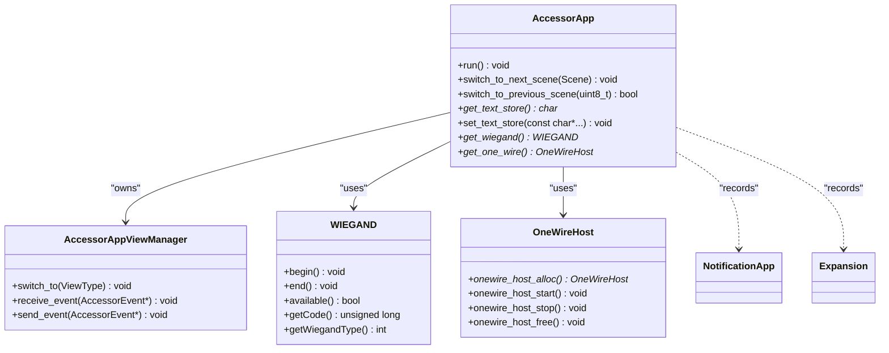
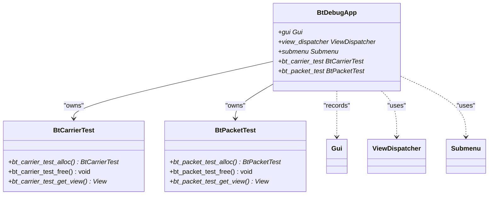
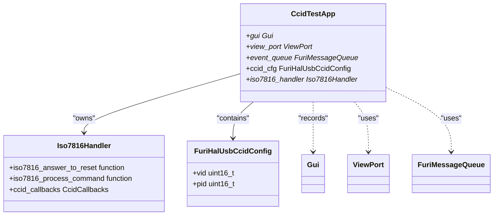
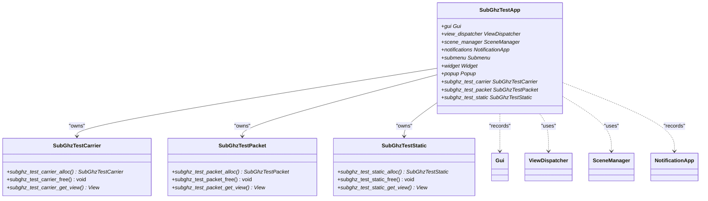
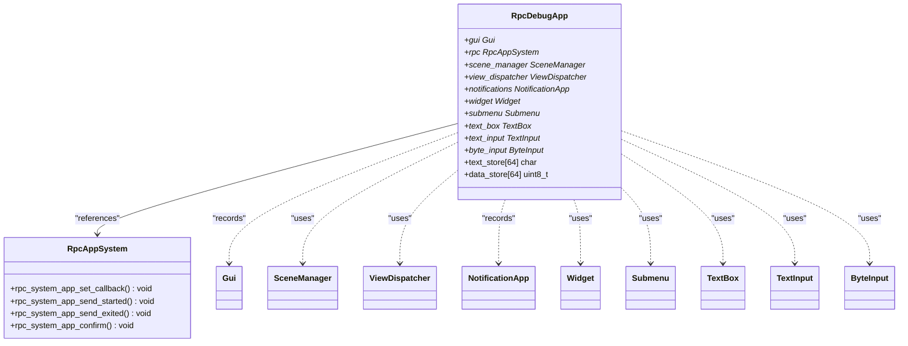
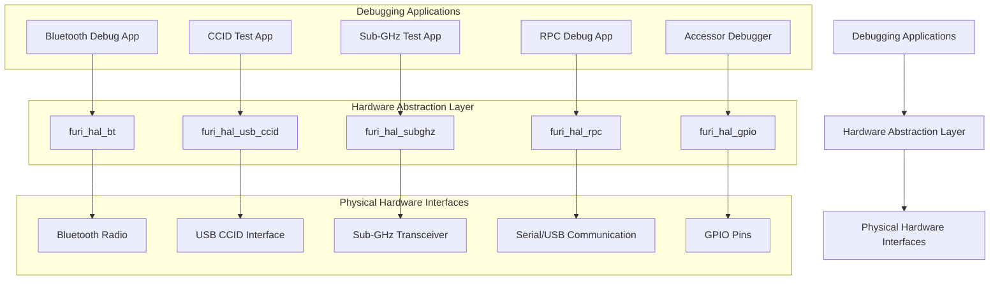

# Debugging Tools

<cite>
**Referenced Files in This Document**   
- [accessor_app.h](file://applications/debug/accessor/accessor_app.h)
- [accessor_app.cpp](file://applications/debug/accessor/accessor_app.cpp)
- [accessor_view_manager.h](file://applications/debug/accessor/accessor_view_manager.h)
- [wiegand.h](file://applications/debug/accessor/helpers/wiegand.h)
- [bt_debug_app.h](file://applications/debug/bt_debug_app/bt_debug_app.h)
- [bt_debug_app.c](file://applications/debug/bt_debug_app/bt_debug_app.c)
- [ccid_test_app.c](file://applications/debug/ccid_test/ccid_test_app.c)
- [subghz_test_app.c](file://applications/debug/subghz_test/subghz_test_app.c)
- [subghz_test_app_i.h](file://applications/debug/subghz_test/subghz_test_app_i.h)
- [rpc_debug_app.h](file://applications/debug/rpc_debug_app/rpc_debug_app.h)
- [rpc_debug_app.c](file://applications/debug/rpc_debug_app/rpc_debug_app.c)
</cite>

## Table of Contents
1. [Introduction](#introduction)
2. [Accessor Debugger](#accessor-debugger)
3. [Bluetooth Debug App](#bluetooth-debug-app)
4. [CCID Test App](#ccid-test-app)
5. [Sub-GHz Test App](#subghz-test-app)
6. [RPC Debug App](#rpc-debug-app)
7. [Hardware Abstraction Layer Integration](#hardware-abstraction-layer-integration)
8. [Common Debugging Issues and Solutions](#common-debugging-issues-and-solutions)

## Introduction
The Flipper Zero firmware includes a comprehensive suite of debugging tools designed for protocol analysis, hardware testing, and system introspection. These applications provide developers with low-level access to various hardware interfaces and communication protocols, enabling detailed analysis and troubleshooting of both Flipper Zero's internal systems and external devices. The debugging tools are implemented as standalone applications within the firmware, each focusing on specific hardware interfaces or communication protocols. They leverage the Flipper Zero's modular architecture and hardware abstraction layer to provide consistent interfaces for testing and analysis.

## Accessor Debugger

The Accessor Debugger is a specialized tool for testing access control systems, particularly those using Wiegand protocol and 1-Wire interfaces. It provides a framework for reading and analyzing signals from access control devices.

**Diagram sources**
- [accessor_app.h](file://applications/debug/accessor/accessor_app.h#L11-L56)
- [accessor_view_manager.h](file://applications/debug/accessor/accessor_view_manager.h#L8-L39)
- [wiegand.h](file://applications/debug/accessor/helpers/wiegand.h#L3-L28)

**Section sources**
- [accessor_app.h](file://applications/debug/accessor/accessor_app.h#L1-L57)
- [accessor_app.cpp](file://applications/debug/accessor/accessor_app.cpp#L1-L146)

## Bluetooth Debug App

The Bluetooth Debug App provides tools for testing Bluetooth functionality, including carrier signal testing and packet transmission analysis. It interfaces directly with the Bluetooth hardware abstraction layer to control radio operations.

**Diagram sources**
- [bt_debug_app.h](file://applications/debug/bt_debug_app/bt_debug_app.h#L14-L26)
- [bt_debug_app.c](file://applications/debug/bt_debug_app/bt_debug_app.c#L31-L93)

**Section sources**
- [bt_debug_app.h](file://applications/debug/bt_debug_app/bt_debug_app.h#L1-L27)
- [bt_debug_app.c](file://applications/debug/bt_debug_app/bt_debug_app.c#L1-L119)

## CCID Test App

The CCID Test App enables testing of smart card interfaces using the CCID (Chip/Smart Card Interface Descriptions) protocol. It simulates a smart card reader and can analyze communication between the Flipper Zero and smart cards.

**Diagram sources**
- [ccid_test_app.c](file://applications/debug/ccid_test/ccid_test_app.c#L21-L27)

**Section sources**
- [ccid_test_app.c](file://applications/debug/ccid_test/ccid_test_app.c#L1-L152)

## Sub-GHz Test App

The Sub-GHz Test App provides comprehensive testing capabilities for sub-GHz wireless protocols. It includes modules for carrier testing, packet analysis, and static signal transmission, enabling detailed analysis of RF communications.

**Diagram sources**
- [subghz_test_app_i.h](file://applications/debug/subghz_test/subghz_test_app_i.h#L21-L32)

**Section sources**
- [subghz_test_app_i.h](file://applications/debug/subghz_test/subghz_test_app_i.h#L1-L33)
- [subghz_test_app.c](file://applications/debug/subghz_test/subghz_test_app.c#L1-L140)

## RPC Debug App

The RPC Debug App facilitates remote procedure call debugging, allowing external systems to interact with the Flipper Zero through a structured communication protocol. It provides interfaces for data exchange and command execution.

**Diagram sources**
- [rpc_debug_app.h](file://applications/debug/rpc_debug_app/rpc_debug_app.h#L23-L38)

**Section sources**
- [rpc_debug_app.h](file://applications/debug/rpc_debug_app/rpc_debug_app.h#L1-L55)
- [rpc_debug_app.c](file://applications/debug/rpc_debug_app/rpc_debug_app.c#L1-L168)

## Hardware Abstraction Layer Integration

The debugging tools integrate with the Flipper Zero's hardware abstraction layer (HAL) to provide consistent access to physical interfaces. This architecture enables the tools to interact with hardware components while maintaining portability across different hardware revisions.

**Diagram sources**
- [bt_debug_app.c](file://applications/debug/bt_debug_app/bt_debug_app.c#L97-L115)
- [ccid_test_app.c](file://applications/debug/ccid_test/ccid_test_app.c#L120-L126)
- [subghz_test_app.c](file://applications/debug/subghz_test/subghz_test_app.c#L28-L43)
- [rpc_debug_app.c](file://applications/debug/rpc_debug_app/rpc_debug_app.c#L89-L91)

## Common Debugging Issues and Solutions

When using the Flipper Zero debugging tools, several common issues may arise. Understanding these issues and their solutions is crucial for effective debugging sessions.

### Bluetooth Debugging Issues
- **Radio stack incompatibility**: The Bluetooth debug app checks for testing support via `furi_hal_bt_is_testing_supported()`. If this returns false, the app displays an error message indicating an incorrect radio stack.
- **Advertising interference**: The debug app temporarily stops Bluetooth advertising during testing to prevent interference, then restores the previous state upon exit.

### CCID Interface Issues
- **USB configuration conflicts**: The CCID test app must unlock USB configuration with `furi_hal_usb_unlock()` before setting up the CCID interface to avoid conflicts with other USB functions.
- **Smart card detection**: The app uses `furi_hal_usb_ccid_insert_smartcard()` to simulate smart card presence, which may need to be adjusted based on the specific smart card being tested.

### Sub-GHz Communication Issues
- **Frequency regulation**: Sub-GHz testing must comply with regional frequency regulations, which may limit available test frequencies and transmission power.
- **Signal interference**: External RF sources can interfere with Sub-GHz testing, requiring careful selection of test frequencies and environments.

### General Debugging Best Practices
- Always restore hardware states after debugging sessions
- Use appropriate signal levels to avoid damaging connected devices
- Document test configurations for reproducibility
- Verify signal integrity with external measurement equipment when possible

**Section sources**
- [bt_debug_app.c](file://applications/debug/bt_debug_app/bt_debug_app.c#L97-L115)
- [ccid_test_app.c](file://applications/debug/ccid_test/ccid_test_app.c#L120-L147)
- [subghz_test_app.c](file://applications/debug/subghz_test/subghz_test_app.c#L130-L137)