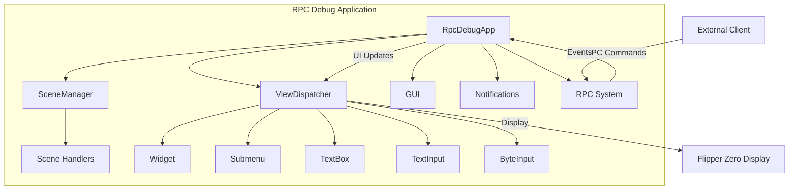
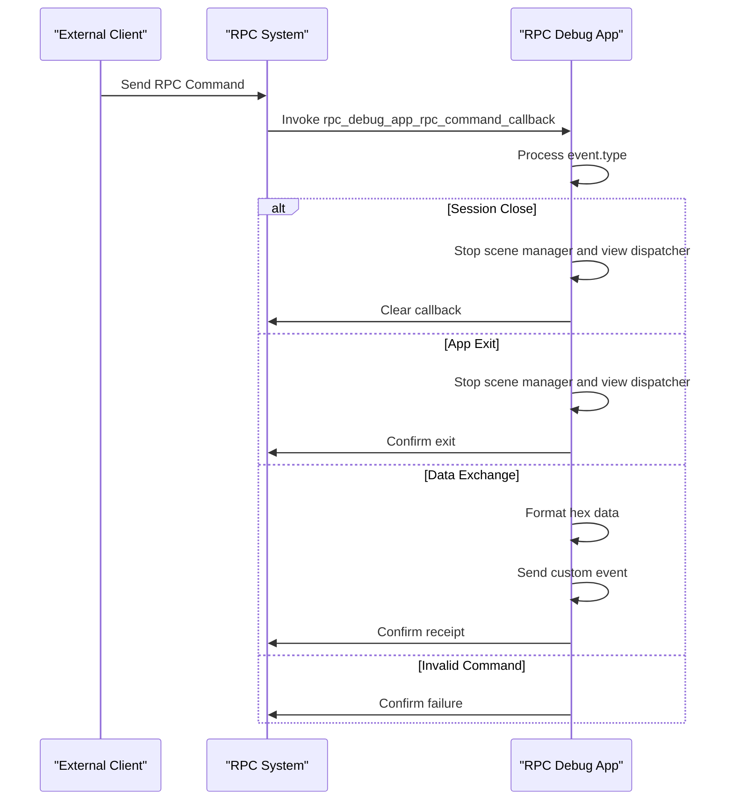
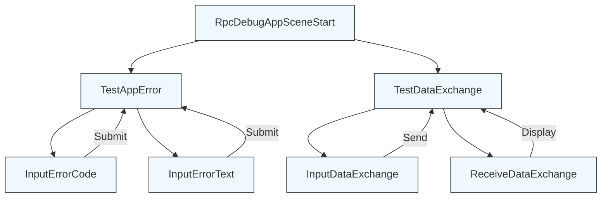
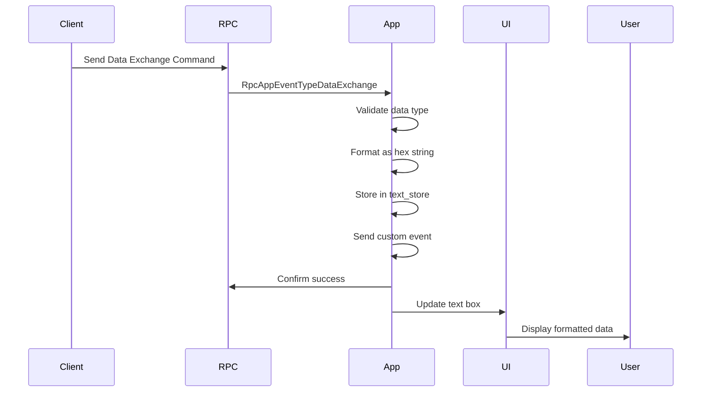
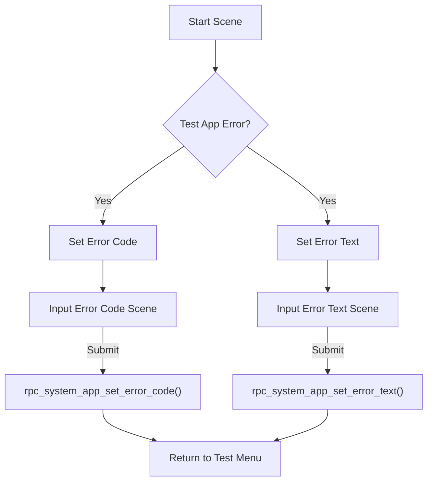
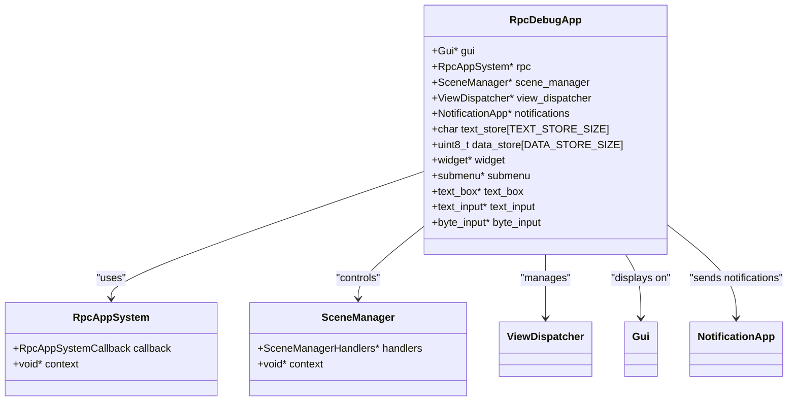
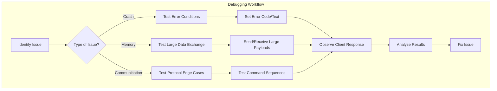
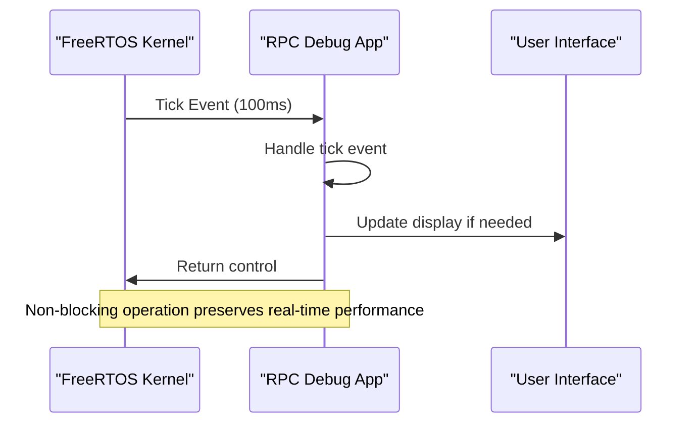

# RPC Debug Application

<cite>
**Referenced Files in This Document**   
- [rpc_debug_app.c](file://applications/debug/rpc_debug_app/rpc_debug_app.c)
- [rpc_debug_app.h](file://applications/debug/rpc_debug_app/rpc_debug_app.h)
- [rpc_debug_app_scene.c](file://applications/debug/rpc_debug_app/scenes/rpc_debug_app_scene.c)
- [rpc_debug_app_scene.h](file://applications/debug/rpc_debug_app/scenes/rpc_debug_app_scene.h)
- [rpc_debug_app_scene_config.h](file://applications/debug/rpc_debug_app/scenes/rpc_debug_app_scene_config.h)
- [rpc_debug_app_scene_start.c](file://applications/debug/rpc_debug_app/scenes/rpc_debug_app_scene_start.c)
- [rpc_debug_app_scene_start_dummy.c](file://applications/debug/rpc_debug_app/scenes/rpc_debug_app_scene_start_dummy.c)
- [rpc_debug_app_scene_test_app_error.c](file://applications/debug/rpc_debug_app/scenes/rpc_debug_app_scene_test_app_error.c)
- [rpc_debug_app_scene_test_data_exchange.c](file://applications/debug/rpc_debug_app/scenes/rpc_debug_app_scene_test_data_exchange.c)
- [rpc_debug_app_scene_input_data_exchange.c](file://applications/debug/rpc_debug_app/scenes/rpc_debug_app_scene_input_data_exchange.c)
- [rpc_debug_app_scene_receive_data_exchange.c](file://applications/debug/rpc_debug_app/scenes/rpc_debug_app_scene_receive_data_exchange.c)
- [rpc_debug_app_scene_input_error_code.c](file://applications/debug/rpc_debug_app/scenes/rpc_debug_app_scene_input_error_code.c)
- [rpc_debug_app_scene_input_error_text.c](file://applications/debug/rpc_debug_app/scenes/rpc_debug_app_scene_input_error_text.c)
- [rpc_app.h](file://applications/services/rpc/rpc_app.h)
</cite>

## Table of Contents
1. [Introduction](#introduction)
2. [Architecture Overview](#architecture-overview)
3. [RPC Command Routing](#rpc-command-routing)
4. [Scene Management System](#scene-management-system)
5. [Response Handling and Data Exchange](#response-handling-and-data-exchange)
6. [Debug Operations and Testing](#debug-operations-and-testing)
7. [Integration with Core RPC Service](#integration-with-core-rpc-service)
8. [Usage Patterns for Debugging](#usage-patterns-for-debugging)
9. [FreeRTOS Debugging Integration](#freertos-debugging-integration)
10. [Troubleshooting Guide](#troubleshooting-guide)

## Introduction
The RPC Debug Application is a specialized diagnostic tool designed for remote procedure call (RPC) system introspection and debugging on the Flipper Zero platform. This application enables developers to test and validate RPC communication, diagnose application crashes, detect memory issues, and analyze inter-process communication patterns. The application operates exclusively in RPC mode, providing a comprehensive interface for system control, memory inspection, and application lifecycle management through a structured scene-based navigation system.

## Architecture Overview



**Diagram sources**
- [rpc_debug_app.c](file://applications/debug/rpc_debug_app/rpc_debug_app.c#L23-L38)
- [rpc_debug_app.h](file://applications/debug/rpc_debug_app/rpc_debug_app.h#L23-L38)

**Section sources**
- [rpc_debug_app.c](file://applications/debug/rpc_debug_app/rpc_debug_app.c#L1-L168)
- [rpc_debug_app.h](file://applications/debug/rpc_debug_app/rpc_debug_app.h#L1-L55)

## RPC Command Routing

The RPC Debug Application implements a robust command routing system that processes incoming RPC events through a dedicated callback mechanism. The application initializes RPC communication by extracting the RPC context from command arguments and registering the `rpc_debug_app_rpc_command_callback` function to handle all incoming events. This callback processes different event types including session management, application exit requests, and data exchange operations.



**Diagram sources**
- [rpc_debug_app.c](file://applications/debug/rpc_debug_app/rpc_debug_app.c#L45-L70)
- [rpc_app.h](file://applications/services/rpc/rpc_app.h#L53-L107)

**Section sources**
- [rpc_debug_app.c](file://applications/debug/rpc_debug_app/rpc_debug_app.c#L45-L84)
- [rpc_app.h](file://applications/services/rpc/rpc_app.h#L53-L107)

## Scene Management System

The application employs a hierarchical scene management system that organizes debug operations into logical workflows. The scene manager routes navigation between different debug contexts, including testing application errors and data exchange operations. Each scene handles specific aspects of RPC debugging, with transitions managed through custom events sent via the view dispatcher.



**Diagram sources**
- [rpc_debug_app_scene_config.h](file://applications/debug/rpc_debug_app/scenes/rpc_debug_app_scene_config.h#L1-L8)
- [rpc_debug_app_scene.c](file://applications/debug/rpc_debug_app/scenes/rpc_debug_app_scene.c#L1-L30)
- [rpc_debug_app_scene_start.c](file://applications/debug/rpc_debug_app/scenes/rpc_debug_app_scene_start.c#L1-L57)

**Section sources**
- [rpc_debug_app_scene_config.h](file://applications/debug/rpc_debug_app/scenes/rpc_debug_app_scene_config.h#L1-L8)
- [rpc_debug_app_scene.c](file://applications/debug/rpc_debug_app/scenes/rpc_debug_app_scene.c#L1-L30)
- [rpc_debug_app_scene_start.c](file://applications/debug/rpc_debug_app/scenes/rpc_debug_app_scene_start.c#L1-L57)

## Response Handling and Data Exchange

The application implements comprehensive response handling for RPC commands, ensuring proper confirmation of received events and structured data exchange. When data is received via RPC, it is formatted as hexadecimal and displayed in the appropriate UI component. The system confirms successful processing of data exchange events and provides visual feedback through notifications.



**Diagram sources**
- [rpc_debug_app.c](file://applications/debug/rpc_debug_app/rpc_debug_app.c#L59-L67)
- [rpc_debug_app_scene_receive_data_exchange.c](file://applications/debug/rpc_debug_app/scenes/rpc_debug_app_scene_receive_data_exchange.c#L1-L34)

**Section sources**
- [rpc_debug_app.c](file://applications/debug/rpc_debug_app/rpc_debug_app.c#L59-L67)
- [rpc_debug_app_scene_receive_data_exchange.c](file://applications/debug/rpc_debug_app/scenes/rpc_debug_app_scene_receive_data_exchange.c#L1-L34)

## Debug Operations and Testing

The RPC Debug Application provides specialized scenes for testing various debugging scenarios, including error condition simulation and bidirectional data exchange. These operations allow developers to verify RPC communication integrity, test error handling mechanisms, and validate data transmission protocols.

### Application Error Testing
The application includes functionality to test error handling by allowing users to set custom error codes and error text through the RPC interface. This enables verification of error reporting mechanisms and client-side error handling.



**Diagram sources**
- [rpc_debug_app_scene_test_app_error.c](file://applications/debug/rpc_debug_app/scenes/rpc_debug_app_scene_test_app_error.c#L1-L58)
- [rpc_debug_app_scene_input_error_code.c](file://applications/debug/rpc_debug_app/scenes/rpc_debug_app_scene_input_error_code.c#L1-L39)
- [rpc_debug_app_scene_input_error_text.c](file://applications/debug/rpc_debug_app/scenes/rpc_debug_app_scene_input_error_text.c#L1-L41)

**Section sources**
- [rpc_debug_app_scene_test_app_error.c](file://applications/debug/rpc_debug_app/scenes/rpc_debug_app_scene_test_app_error.c#L1-L58)
- [rpc_debug_app_scene_input_error_code.c](file://applications/debug/rpc_debug_app/scenes/rpc_debug_app_scene_input_error_code.c#L1-L39)
- [rpc_debug_app_scene_input_error_text.c](file://applications/debug/rpc_debug_app/scenes/rpc_debug_app_scene_input_error_text.c#L1-L41)

### Data Exchange Testing
The application supports bidirectional data exchange testing, allowing both sending and receiving arbitrary byte arrays. This functionality is essential for validating data transmission protocols and testing binary data handling.

```mermaid
flowchart LR
SendData["Send Data Operation"] --> |rpc_system_app_exchange_data()| Client[External Client]
ReceiveData["Receive Data Operation"] --> |RpcAppEventTypeDataExchange| App[RPC Debug App]
App --> |Format and Display| UI[User Interface]
Client --> |Confirm Receipt| App
```

**Diagram sources**
- [rpc_debug_app_scene_test_data_exchange.c](file://applications/debug/rpc_debug_app/scenes/rpc_debug_app_scene_test_data_exchange.c#L1-L59)
- [rpc_debug_app_scene_input_data_exchange.c](file://applications/debug/rpc_debug_app/scenes/rpc_debug_app_scene_input_data_exchange.c#L1-L41)
- [rpc_app.h](file://applications/services/rpc/rpc_app.h#L220-L221)

**Section sources**
- [rpc_debug_app_scene_test_data_exchange.c](file://applications/debug/rpc_debug_app/scenes/rpc_debug_app_scene_test_data_exchange.c#L1-L59)
- [rpc_debug_app_scene_input_data_exchange.c](file://applications/debug/rpc_debug_app/scenes/rpc_debug_app_scene_input_data_exchange.c#L1-L41)
- [rpc_app.h](file://applications/services/rpc/rpc_app.h#L220-L221)

## Integration with Core RPC Service

The RPC Debug Application integrates tightly with the core RPC service to enable system control, memory inspection, and application lifecycle management. The integration is established during application initialization by setting up the RPC callback and sending a "started" notification. The application maintains a reference to the RPC context throughout its lifecycle, enabling continuous communication with the client.



**Diagram sources**
- [rpc_debug_app.c](file://applications/debug/rpc_debug_app/rpc_debug_app.c#L86-L151)
- [rpc_debug_app.h](file://applications/debug/rpc_debug_app/rpc_debug_app.h#L23-L38)
- [rpc_app.h](file://applications/services/rpc/rpc_app.h#L132-L133)

**Section sources**
- [rpc_debug_app.c](file://applications/debug/rpc_debug_app/rpc_debug_app.c#L72-L84)
- [rpc_debug_app.h](file://applications/debug/rpc_debug_app/rpc_debug_app.h#L23-L38)

## Usage Patterns for Debugging

The RPC Debug Application supports several key usage patterns for diagnosing common issues in embedded systems development:

### Debugging Application Crashes
The application can simulate error conditions by setting custom error codes and messages, allowing developers to test crash recovery mechanisms and error reporting in client applications.

### Memory Leak Detection
By exchanging large data payloads and monitoring system behavior, developers can identify potential memory leaks in both the client and server implementations of RPC communication.

### Inter-Process Communication Issues
The bidirectional data exchange functionality enables testing of communication protocols, validation of data integrity, and diagnosis of timing issues in inter-process communication.



**Section sources**
- [rpc_debug_app.c](file://applications/debug/rpc_debug_app/rpc_debug_app.c#L153-L167)
- [rpc_debug_app_scene_test_app_error.c](file://applications/debug/rpc_debug_app/scenes/rpc_debug_app_scene_test_app_error.c#L1-L58)
- [rpc_debug_app_scene_test_data_exchange.c](file://applications/debug/rpc_debug_app/scenes/rpc_debug_app_scene_test_data_exchange.c#L1-L59)

## FreeRTOS Debugging Integration

The RPC Debug Application leverages FreeRTOS features for task management and system monitoring. The application uses FreeRTOS queues through the view dispatcher's event queue system, enabling non-blocking communication between the RPC interface and the user interface. Task state analysis is facilitated through the use of FreeRTOS primitives such as message queues and event flags.

The tick event callback, configured with a 100ms interval, demonstrates integration with FreeRTOS timing mechanisms. This periodic callback allows the application to perform regular maintenance tasks and update UI elements without blocking the main execution thread.



**Section sources**
- [rpc_debug_app.c](file://applications/debug/rpc_debug_app/rpc_debug_app.c#L18-L22)
- [rpc_debug_app.c](file://applications/debug/rpc_debug_app/rpc_debug_app.c#L99-L100)

## Troubleshooting Guide

### Connection Failures
Connection failures typically occur when the application is not launched in RPC mode. The application checks for valid RPC context during initialization and displays a message indicating that it must be run in RPC mode if no context is provided.

**Symptom**: Application displays "This application is meant to be run in #RPC# mode."
**Solution**: Launch the application through the RPC interface with proper context parameters.

### Command Timeouts
Command timeouts occur when the application fails to confirm receipt of certain RPC events. The following events require explicit confirmation:
- RpcAppEventTypeAppExit
- RpcAppEventTypeLoadFile
- RpcAppEventTypeButtonPress
- RpcAppEventTypeButtonRelease
- RpcAppEventTypeButtonPressRelease
- RpcAppEventTypeDataExchange

**Symptom**: Client reports timeout for command execution
**Solution**: Ensure rpc_system_app_confirm() is called with appropriate result parameter after processing the event.

### Security Considerations
When exposing RPC endpoints, consider the following security measures:
- Validate all incoming data before processing
- Implement proper error handling to prevent information leakage
- Limit the scope of operations available through RPC
- Use authentication mechanisms when available
- Monitor for unusual command patterns that may indicate malicious activity

**Section sources**
- [rpc_debug_app.c](file://applications/debug/rpc_debug_app/rpc_debug_app.c#L50-L69)
- [rpc_debug_app.c](file://applications/debug/rpc_debug_app/rpc_debug_app.c#L159-L161)
- [rpc_app.h](file://applications/services/rpc/rpc_app.h#L174-L179)