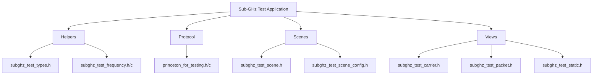
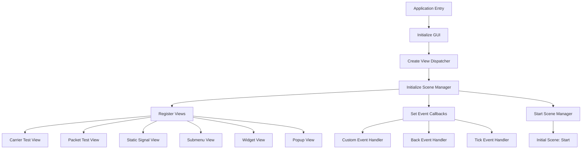
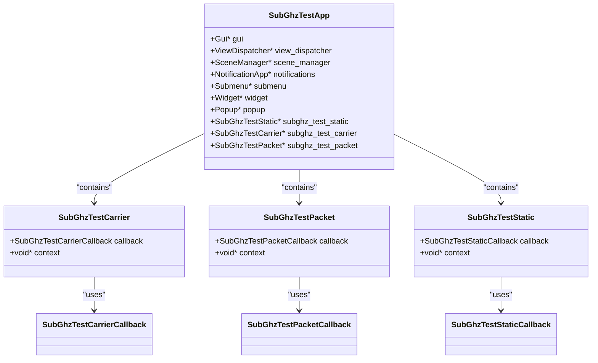
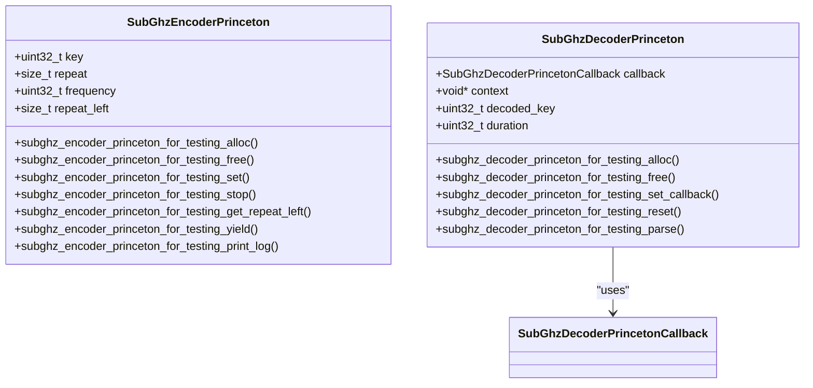
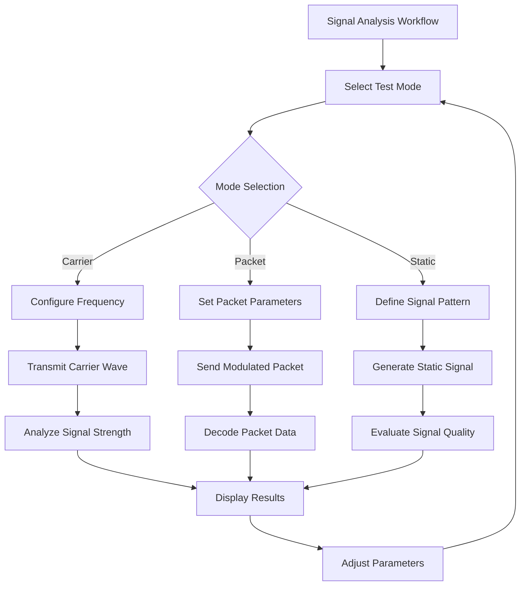
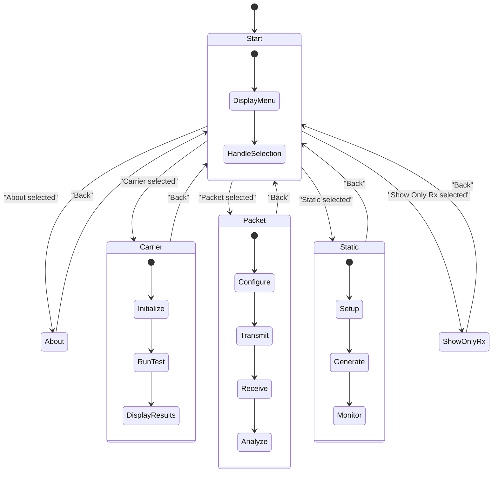
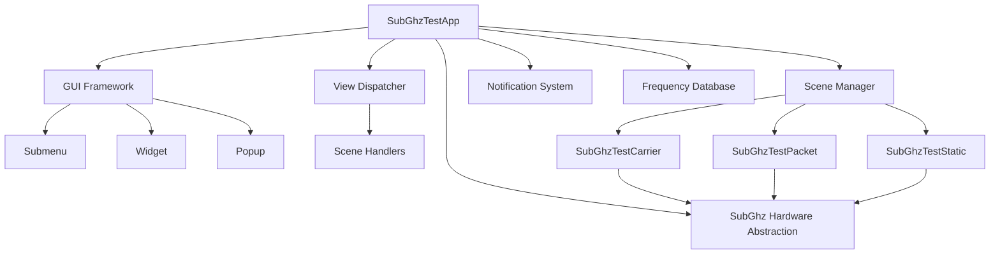

# Sub-GHz Test Application

<cite>
**Referenced Files in This Document**   
- [subghz_test_app.c](file://applications/debug/subghz_test/subghz_test_app.c)
- [subghz_test_app_i.h](file://applications/debug/subghz_test/subghz_test_app_i.h)
- [subghz_test_app_i.c](file://applications/debug/subghz_test/subghz_test_app_i.c)
- [subghz_test_types.h](file://applications/debug/subghz_test/helpers/subghz_test_types.h)
- [subghz_test_frequency.h](file://applications/debug/subghz_test/helpers/subghz_test_frequency.h)
- [subghz_test_frequency.c](file://applications/debug/subghz_test/helpers/subghz_test_frequency.c)
- [subghz_test_scene.h](file://applications/debug/subghz_test/scenes/subghz_test_scene.h)
- [subghz_test_scene_config.h](file://applications/debug/subghz_test/scenes/subghz_test_scene_config.h)
- [subghz_test_scene_start.c](file://applications/debug/subghz_test/scenes/subghz_test_scene_start.c)
- [subghz_test_carrier.h](file://applications/debug/subghz_test/views/subghz_test_carrier.h)
- [subghz_test_packet.h](file://applications/debug/subghz_test/views/subghz_test_packet.h)
- [subghz_test_static.h](file://applications/debug/subghz_test/views/subghz_test_static.h)
- [princeton_for_testing.h](file://applications/debug/subghz_test/protocol/princeton_for_testing.h)
- [princeton_for_testing.c](file://applications/debug/subghz_test/protocol/princeton_for_testing.c)
</cite>

## Table of Contents
1. [Introduction](#introduction)
2. [Project Structure](#project-structure)
3. [Core Components](#core-components)
4. [Architecture Overview](#architecture-overview)
5. [Detailed Component Analysis](#detailed-component-analysis)
6. [Dependency Analysis](#dependency-analysis)
7. [Performance Considerations](#performance-considerations)
8. [Troubleshooting Guide](#troubleshooting-guide)
9. [Conclusion](#conclusion)

## Introduction
The Sub-GHz Test Application is a comprehensive suite designed for testing sub-gigahertz wireless protocols on the Flipper Zero platform. This application provides specialized tools for signal analysis, frequency testing, and protocol validation, with a focus on transmitter and receiver functionality. The application supports various testing modes including carrier wave analysis, packet transmission/reception, and static signal generation. It features a scene-based workflow that guides users through signal capture, demodulation, and replay processes. The system integrates with the Sub-GHz hardware abstraction layer and provides frequency tuning mechanisms for testing across multiple bands. This documentation details the implementation of worker threads, protocol registration, and signal analysis capabilities that enable thorough testing of common protocols like Nice Flor-S and custom signal formats.

## Project Structure
The Sub-GHz Test Application follows a modular structure with clearly separated components for different testing functionalities. The application is organized into several key directories: helpers for utility functions, protocol for protocol-specific implementations, scenes for the application's state management, and views for user interface components. This structure enables maintainable code with clear separation of concerns between the application's logic, user interface, and hardware interaction layers.

**Diagram sources**
- [subghz_test_types.h](file://applications/debug/subghz_test/helpers/subghz_test_types.h)
- [subghz_test_frequency.h](file://applications/debug/subghz_test/helpers/subghz_test_frequency.h)
- [princeton_for_testing.h](file://applications/debug/subghz_test/protocol/princeton_for_testing.h)
- [subghz_test_scene.h](file://applications/debug/subghz_test/scenes/subghz_test_scene.h)
- [subghz_test_carrier.h](file://applications/debug/subghz_test/views/subghz_test_carrier.h)

**Section sources**
- [subghz_test_app.c](file://applications/debug/subghz_test/subghz_test_app.c)
- [subghz_test_app_i.h](file://applications/debug/subghz_test/subghz_test_app_i.h)

## Core Components
The Sub-GHz Test Application consists of several core components that work together to provide comprehensive testing capabilities. The application framework manages the overall state and user interface navigation through a scene manager, while specialized view modules handle specific testing functions. The transmitter and receiver workers are implemented as separate components that interface with the Sub-GHz hardware abstraction layer, allowing for precise control of signal generation and reception. The protocol registration system enables the application to support multiple wireless protocols, including both standard implementations and custom formats. Signal analysis capabilities are provided through dedicated modules that can capture, demodulate, and analyze received signals, with functionality for both real-time monitoring and post-processing analysis.

**Section sources**
- [subghz_test_app.c](file://applications/debug/subghz_test/subghz_test_app.c)
- [subghz_test_app_i.h](file://applications/debug/subghz_test/subghz_test_app_i.h)
- [subghz_test_types.h](file://applications/debug/subghz_test/helpers/subghz_test_types.h)

## Architecture Overview
The Sub-GHz Test Application follows a scene-based architecture that manages the application's workflow through discrete states. The architecture is built on the Flipper Zero's GUI framework, utilizing a view dispatcher to manage different user interface components and a scene manager to control the application flow. The application initializes various UI modules including submenu, widget, popup, and specialized test views for carrier, packet, and static signal testing. Event callbacks are registered to handle user input, navigation, and periodic updates, ensuring responsive interaction. The scene manager orchestrates transitions between different testing modes, maintaining state information as the user navigates through the application.

**Diagram sources**
- [subghz_test_app.c](file://applications/debug/subghz_test/subghz_test_app.c)
- [subghz_test_scene.h](file://applications/debug/subghz_test/scenes/subghz_test_scene.h)

## Detailed Component Analysis

### Transmitter and Receiver Worker Implementation
The transmitter and receiver functionality in the Sub-GHz Test Application is implemented through specialized worker components that interface with the underlying hardware. These workers are managed by the application's scene system and provide the core functionality for signal generation and reception. The workers follow a callback-based architecture that allows for asynchronous operation while maintaining responsiveness in the user interface. Each worker type (carrier, packet, static) implements a consistent interface with callback functions for event notification, enabling uniform handling of user interactions across different testing modes.

**Diagram sources**
- [subghz_test_app_i.h](file://applications/debug/subghz_test/subghz_test_app_i.h)
- [subghz_test_carrier.h](file://applications/debug/subghz_test/views/subghz_test_carrier.h)
- [subghz_test_packet.h](file://applications/debug/subghz_test/views/subghz_test_packet.h)
- [subghz_test_static.h](file://applications/debug/subghz_test/views/subghz_test_static.h)

**Section sources**
- [subghz_test_app.c](file://applications/debug/subghz_test/subghz_test_app.c)
- [subghz_test_app_i.h](file://applications/debug/subghz_test/subghz_test_app_i.h)

### Protocol Registration System
The Sub-GHz Test Application implements a protocol registration system that allows for flexible support of various wireless protocols. The system is exemplified by the Princeton protocol implementation provided for testing purposes. This system follows an object-oriented approach with separate encoder and decoder components that handle the transmission and reception of protocol-specific signals. The registration mechanism enables the application to dynamically load and utilize different protocol handlers based on user selection or automatic detection. The system provides a standardized interface for protocol operations including initialization, parameter setting, transmission control, and signal parsing.

**Diagram sources**
- [princeton_for_testing.h](file://applications/debug/subghz_test/protocol/princeton_for_testing.h)

**Section sources**
- [princeton_for_testing.h](file://applications/debug/subghz_test/protocol/princeton_for_testing.h)
- [princeton_for_testing.c](file://applications/debug/subghz_test/protocol/princeton_for_testing.c)

### Signal Analysis Capabilities
The Sub-GHz Test Application provides comprehensive signal analysis capabilities through its specialized testing modes. The application supports three primary analysis methods: carrier testing for evaluating signal strength and stability, packet testing for analyzing modulated data transmissions, and static signal generation for testing receiver sensitivity. Each mode provides specific metrics and visual feedback to assist in signal evaluation. The application can capture signals across multiple frequency bands and provides tools for demodulation and protocol analysis. The signal analysis workflow is designed to guide users through the process of signal capture, parameter adjustment, and result interpretation.

**Diagram sources**
- [subghz_test_scene_start.c](file://applications/debug/subghz_test/scenes/subghz_test_scene_start.c)
- [subghz_test_carrier.h](file://applications/debug/subghz_test/views/subghz_test_carrier.h)
- [subghz_test_packet.h](file://applications/debug/subghz_test/views/subghz_test_packet.h)
- [subghz_test_static.h](file://applications/debug/subghz_test/views/subghz_test_static.h)

**Section sources**
- [subghz_test_scene_start.c](file://applications/debug/subghz_test/scenes/subghz_test_scene_start.c)
- [subghz_test_carrier.h](file://applications/debug/subghz_test/views/subghz_test_carrier.h)

### Scene-Based Workflow
The Sub-GHz Test Application implements a scene-based workflow that guides users through the signal testing process. The application uses a scene manager to control navigation between different functional states, with each scene representing a specific testing mode or configuration screen. The workflow begins with a start scene that presents a menu of available test options, including carrier testing, packet testing, static signal generation, and application information. When a user selects an option, the scene manager transitions to the corresponding scene, initializing the appropriate view and worker components. This architectural pattern ensures a consistent user experience while allowing for specialized functionality in each testing mode.

**Diagram sources**
- [subghz_test_scene.h](file://applications/debug/subghz_test/scenes/subghz_test_scene.h)
- [subghz_test_scene_config.h](file://applications/debug/subghz_test/scenes/subghz_test_scene_config.h)
- [subghz_test_scene_start.c](file://applications/debug/subghz_test/scenes/subghz_test_scene_start.c)

**Section sources**
- [subghz_test_scene.h](file://applications/debug/subghz_test/scenes/subghz_test_scene.h)
- [subghz_test_scene_config.h](file://applications/debug/subghz_test/scenes/subghz_test_scene_config.h)
- [subghz_test_scene_start.c](file://applications/debug/subghz_test/scenes/subghz_test_scene_start.c)

## Dependency Analysis
The Sub-GHz Test Application has a well-defined dependency structure that follows the Flipper Zero platform's architectural patterns. The application depends on the core GUI framework for user interface management, utilizing components such as view dispatcher, scene manager, and various UI modules. It interfaces with the Sub-GHz hardware abstraction layer through the application's worker components, which handle the low-level communication with the radio hardware. The application also depends on system services for notifications and record management. The modular design minimizes coupling between components, with dependencies flowing primarily from the main application to the specialized testing modules.

**Diagram sources**
- [subghz_test_app.c](file://applications/debug/subghz_test/subghz_test_app.c)
- [subghz_test_app_i.h](file://applications/debug/subghz_test/subghz_test_app_i.h)
- [subghz_test_frequency.c](file://applications/debug/subghz_test/helpers/subghz_test_frequency.c)

**Section sources**
- [subghz_test_app.c](file://applications/debug/subghz_test/subghz_test_app.c)
- [subghz_test_app_i.h](file://applications/debug/subghz_test/subghz_test_app_i.h)
- [subghz_test_frequency.c](file://applications/debug/subghz_test/helpers/subghz_test_frequency.c)

## Performance Considerations
The Sub-GHz Test Application is designed with performance considerations for real-time signal processing and user interface responsiveness. The application uses a tick event callback with a 100ms interval to update the user interface without consuming excessive CPU resources. Worker components are designed to operate efficiently with minimal memory overhead, allowing for sustained signal transmission and reception operations. The frequency database is implemented as a static array for fast access during band scanning operations. The application manages memory allocation carefully, with all major components being allocated at startup and freed during cleanup to prevent memory fragmentation. The scene-based architecture allows for efficient resource management by only initializing components when needed and releasing them when transitioning between modes.

**Section sources**
- [subghz_test_app.c](file://applications/debug/subghz_test/subghz_test_app.c)
- [subghz_test_frequency.c](file://applications/debug/subghz_test/helpers/subghz_test_frequency.c)

## Troubleshooting Guide
When encountering issues with the Sub-GHz Test Application, consider the following common problems and solutions:

1. **Signal Interference**: Ensure the testing environment is free from strong RF sources that could interfere with signal reception. Move away from Wi-Fi routers, Bluetooth devices, and other wireless equipment.

2. **Synchronization Loss**: If experiencing synchronization issues during packet transmission, verify that the frequency settings match between transmitter and receiver. Small frequency offsets can cause demodulation failures.

3. **Range Testing Issues**: For accurate range testing, ensure both devices have fresh batteries and are using appropriate antennas for the frequency band being tested. Environmental factors such as walls and metal objects can significantly affect range.

4. **Antenna Calibration**: When calibrating antennas, use known good devices as references and test across multiple distances and orientations to establish baseline performance.

5. **Frequency Accuracy**: Verify that the selected frequency is supported by the hardware and within legal transmission limits for your region.

6. **Protocol Compatibility**: When testing with specific protocols like Nice Flor-S, ensure that the encoder and decoder settings match exactly, including bit length, modulation type, and timing parameters.

**Section sources**
- [subghz_test_app.c](file://applications/debug/subghz_test/subghz_test_app.c)
- [subghz_test_frequency.c](file://applications/debug/subghz_test/helpers/subghz_test_frequency.c)
- [princeton_for_testing.h](file://applications/debug/subghz_test/protocol/princeton_for_testing.h)

## Conclusion
The Sub-GHz Test Application provides a comprehensive suite of tools for testing sub-gigahertz wireless protocols on the Flipper Zero platform. Its modular architecture with specialized worker components enables thorough testing of transmitter and receiver functionality across various protocols and frequency bands. The scene-based workflow offers an intuitive user experience while maintaining the flexibility needed for advanced signal analysis. The application's integration with the Sub-GHz hardware abstraction layer ensures reliable performance and compatibility with the platform's radio hardware. With its support for protocol registration, frequency tuning, and multiple testing modes, the application serves as a valuable tool for both development and field testing of sub-gigahertz wireless systems. The well-structured codebase and clear separation of concerns make it extensible for additional protocols and testing capabilities.