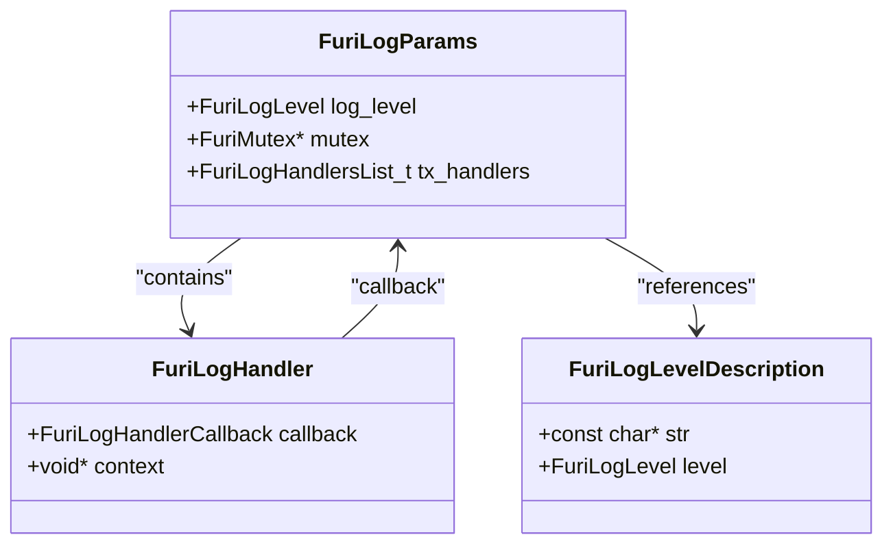
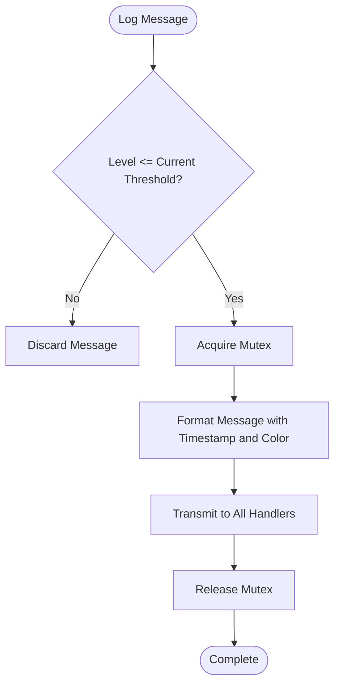
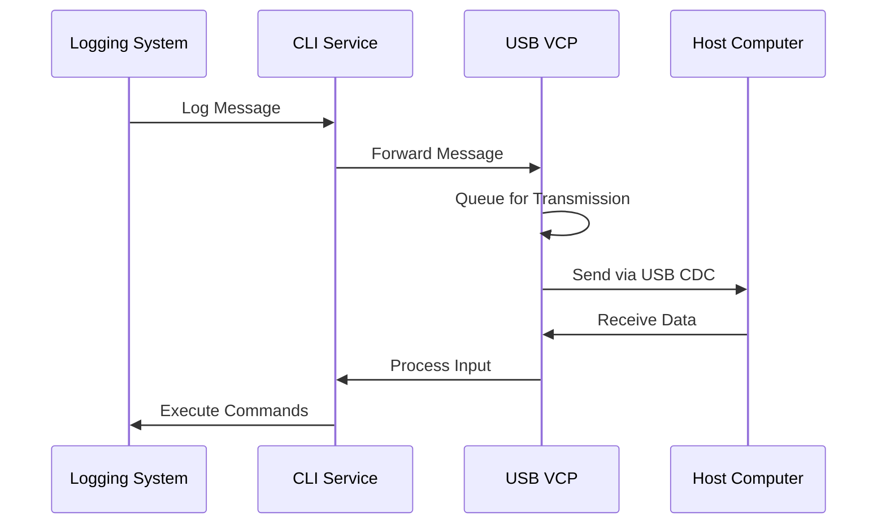

# Logging System

<cite>
**Referenced Files in This Document**   
- [log.h](file://furi/core/log.h)
- [log.c](file://furi/core/log.c)
- [cli.c](file://applications/services/cli/cli.c)
- [cli_vcp.c](file://applications/services/cli/cli_vcp.c)
- [cli_vcp.h](file://applications/services/cli/cli_vcp.h)
- [cli.h](file://applications/services/cli/cli.h)
- [furi_hal_usb_cdc.h](file://targets/furi_hal_include/furi_hal_usb_cdc.h)
</cite>

## Table of Contents
1. [Introduction](#introduction)
2. [Logging Architecture](#logging-architecture)
3. [Log Levels and Formatting](#log-levels-and-formatting)
4. [Output Destinations](#output-destinations)
5. [Integration with CLI and USB VCP](#integration-with-cli-and-usb-vcp)
6. [Configuration and Management](#configuration-and-management)
7. [Practical Usage Examples](#practical-usage-examples)
8. [Performance Considerations](#performance-considerations)
9. [Common Issues and Solutions](#common-issues-and-solutions)
10. [Best Practices](#best-practices)

## Introduction
The Flipper Zero firmware features a comprehensive logging system designed to provide diagnostic information, trace application execution, and assist in debugging hardware communication issues. This logging infrastructure is a critical component for both development and troubleshooting, offering multiple log levels, flexible output destinations, and integration with the Command Line Interface (CLI) and USB Virtual COM Port (VCP) interface. The system is designed to be non-intrusive while providing detailed insights into the device's operation, making it an essential tool for developers and advanced users.

**Section sources**
- [log.h](file://furi/core/log.h#L1-L166)

## Logging Architecture
The logging system in Flipper Zero firmware is built around a modular architecture that separates log generation from log output. At its core, the system uses a handler-based approach where log messages are processed by registered callback functions. The architecture consists of several key components:

- **Log Level Management**: The system supports multiple log levels from error to trace, allowing for granular control over verbosity
- **Thread Safety**: Implemented with recursive mutex protection to ensure safe operation in multi-threaded environments
- **Handler Registration**: Supports multiple output handlers that can be dynamically added or removed
- **Asynchronous Processing**: Designed to minimize impact on system performance by using efficient data structures

The logging system is initialized during firmware startup and maintains a global state that includes the current log level, a mutex for thread safety, and a list of registered handlers. This architecture allows for flexible configuration and ensures that logging operations do not block critical system functions.



**Diagram sources**
- [log.h](file://furi/core/log.h#L42-L47)
- [log.c](file://furi/core/log.c#L11-L15)

**Section sources**
- [log.c](file://furi/core/log.c#L1-L212)

## Log Levels and Formatting
The Flipper Zero logging system implements a hierarchical log level system that allows developers to control the verbosity of output. The available log levels, in order of increasing detail, are:

- **Error (FuriLogLevelError)**: Critical issues that prevent normal operation
- **Warn (FuriLogLevelWarn)**: Potential problems that don't immediately impact functionality
- **Info (FuriLogLevelInfo)**: General operational information and status updates
- **Debug (FuriLogLevelDebug)**: Detailed information for debugging purposes
- **Trace (FuriLogLevelTrace)**: Comprehensive execution tracing for in-depth analysis

Each log message includes a standardized format with timestamp, log level indicator, application tag, and the message content. The system uses ANSI color codes to visually distinguish log levels when displayed in compatible terminals. Log messages are formatted with the following structure:

```
[timestamp] [level][tag] message
```

The logging system provides both formatted and raw output functions, allowing for flexibility in how information is presented. The formatted functions include automatic timestamping and level indicators, while raw functions provide direct output without additional formatting.



**Diagram sources**
- [log.h](file://furi/core/log.h#L16-L24)
- [log.c](file://furi/core/log.c#L110-L160)

**Section sources**
- [log.h](file://furi/core/log.h#L16-L41)
- [log.c](file://furi/core/log.c#L110-L160)

## Output Destinations
The logging system supports multiple output destinations through its handler-based architecture. Each handler is a callback function that processes log data and directs it to a specific output medium. The primary output destination in the Flipper Zero firmware is the USB VCP interface, which allows for real-time log monitoring from a connected computer.

The handler system is designed to be extensible, allowing for the addition of new output destinations such as file logging, network transmission, or specialized debugging interfaces. Each handler includes a callback function and context pointer, enabling stateful operations and configuration. The system maintains a list of active handlers and broadcasts each log message to all registered handlers.

Handlers can be dynamically added or removed at runtime, providing flexibility in logging configuration. This allows for temporary diagnostic logging to be enabled without permanently altering the system configuration. The handler registration system includes duplicate detection to prevent multiple registrations of the same handler.

**Section sources**
- [log.h](file://furi/core/log.h#L42-L47)
- [log.c](file://furi/core/log.c#L41-L65)

## Integration with CLI and USB VCP
The logging system is tightly integrated with the Command Line Interface (CLI) and USB Virtual COM Port (VCP) interface, creating a seamless diagnostic experience. The CLI service acts as a bridge between the logging system and the USB VCP interface, routing log messages to connected terminals.

The USB VCP implementation uses a dedicated worker thread to handle USB communication, ensuring that logging operations do not block other system functions. This worker thread manages USB connection state, data transmission, and reception using stream buffers for efficient data handling. The VCP interface supports standard terminal control sequences and flow control mechanisms.

When a USB connection is established, the VCP interface automatically registers itself as a log handler, enabling real-time log streaming. The system detects connection and disconnection events through USB control line callbacks, allowing for proper resource management and connection state tracking. This integration enables developers to monitor system behavior in real-time while interacting with the device through the CLI.



**Diagram sources**
- [cli.c](file://applications/services/cli/cli.c#L458-L508)
- [cli_vcp.c](file://applications/services/cli/cli_vcp.c#L68-L317)

**Section sources**
- [cli.c](file://applications/services/cli/cli.c#L458-L508)
- [cli_vcp.c](file://applications/services/cli/cli_vcp.c#L68-L317)
- [cli_vcp.h](file://applications/services/cli/cli_vcp.h#L1-L19)

## Configuration and Management
The logging system provides several mechanisms for configuration and runtime management. The default log level is set to INFO during initialization, providing a balance between diagnostic information and system performance. Developers can dynamically adjust the log level using the `furi_log_set_level()` function, allowing for on-demand verbosity changes.

The system includes utility functions for converting between log level enumerations and their string representations, facilitating configuration through text-based interfaces. This enables log level changes via CLI commands or configuration files. The current log level can be queried using `furi_log_get_level()`, allowing applications to conditionally generate log messages based on the active verbosity setting.

Handler management functions allow for dynamic registration and removal of output destinations. This enables temporary diagnostic logging setups without permanent configuration changes. The system validates handler callbacks during registration to prevent null pointer dereferences and maintains thread safety during handler list modifications.

**Section sources**
- [log.h](file://furi/core/log.h#L100-L129)
- [log.c](file://furi/core/log.c#L180-L211)

## Practical Usage Examples
The logging system is used throughout the Flipper Zero firmware for various diagnostic and monitoring purposes. Common use cases include:

- **Application Execution Tracing**: Using TRACE level logs to follow the flow of complex operations
- **Hardware Communication Diagnostics**: Logging data exchange with external devices to identify communication issues
- **Error Detection and Recovery**: Recording error conditions and recovery attempts for post-mortem analysis
- **Performance Monitoring**: Tracking timing information for critical operations

For example, when debugging infrared signal processing, developers might enable DEBUG or TRACE level logging to monitor signal capture and decoding in real-time. Similarly, when developing new hardware interfaces, INFO and WARN level logs can provide insights into initialization sequences and potential configuration issues.

The system's integration with the CLI allows for interactive debugging, where developers can adjust log levels and execute diagnostic commands while monitoring the resulting output. This real-time feedback loop significantly accelerates the development and troubleshooting process.

**Section sources**
- [log.h](file://furi/core/log.h#L136-L161)

## Performance Considerations
The logging system is designed with performance in mind, minimizing its impact on the overall system responsiveness. Several optimization strategies are employed:

- **Conditional Logging**: Messages are only processed if their level meets or exceeds the current threshold
- **Efficient Data Structures**: Stream buffers and optimized string operations reduce memory allocation overhead
- **Asynchronous Output**: Log transmission occurs in dedicated threads or interrupt contexts
- **Minimal Locking**: Mutex usage is optimized to reduce contention

Despite these optimizations, excessive logging can still impact system performance, particularly at higher verbosity levels. TRACE level logging, in particular, can generate large volumes of data that may affect real-time operations. Developers should carefully consider the performance implications when enabling detailed logging in production environments.

The system includes safeguards against buffer overflows and handles interrupt service routine (ISR) contexts appropriately, ensuring reliable operation even under heavy load conditions.

**Section sources**
- [log.c](file://furi/core/log.c#L88-L103)

## Common Issues and Solutions
Several common issues can arise when using the logging system, along with their respective solutions:

- **Log Buffer Overflows**: Occur when log generation exceeds transmission capacity. Solved by implementing proper flow control and increasing buffer sizes when necessary.
- **Connection State Confusion**: Can happen during USB connect/disconnect cycles. Addressed through proper state management in the VCP worker thread.
- **Timing Issues**: May occur when logging from time-critical sections. Mitigated by using appropriate log levels and asynchronous transmission.
- **Resource Leaks**: Possible when handlers are not properly unregistered. Prevented through careful lifecycle management.

The system includes diagnostic messages within its own implementation, such as the "Init OK" message in the VCP initialization, which helps verify proper operation. Developers should monitor these internal logs when troubleshooting logging-related issues.

**Section sources**
- [cli_vcp.c](file://applications/services/cli/cli_vcp.c#L81-L82)

## Best Practices
To use the logging system effectively while maintaining system performance and code quality, consider the following best practices:

- **Use Appropriate Log Levels**: Reserve ERROR for critical failures, WARN for potential issues, INFO for operational status, DEBUG for detailed diagnostics, and TRACE for comprehensive execution flow.
- **Include Meaningful Tags**: Use descriptive application or module names as tags to facilitate log filtering and analysis.
- **Avoid Excessive Logging**: Balance diagnostic needs with performance considerations, especially in time-critical code paths.
- **Use Conditional Compilation**: Consider using preprocessor directives to exclude verbose logging in production builds.
- **Structure Log Messages**: Use consistent formatting and include relevant context information to make logs more useful.

By following these practices, developers can leverage the logging system to enhance debugging efficiency while minimizing its impact on system performance and user experience.

**Section sources**
- [log.h](file://furi/core/log.h#L136-L161)
- [cli_vcp.c](file://applications/services/cli/cli_vcp.c#L14-L18)