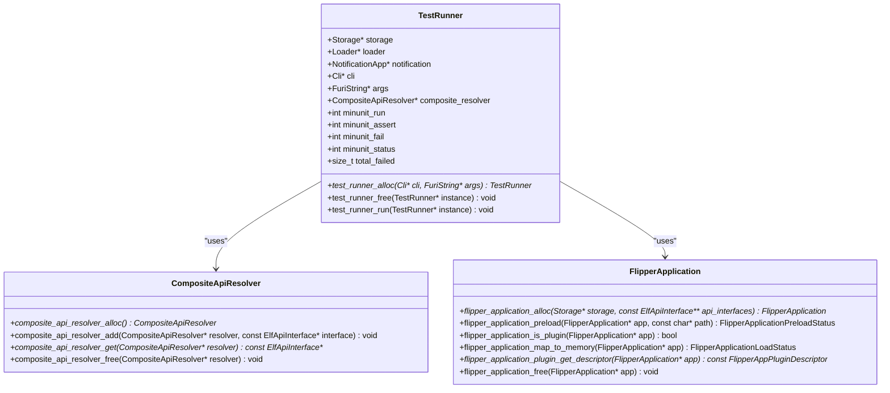
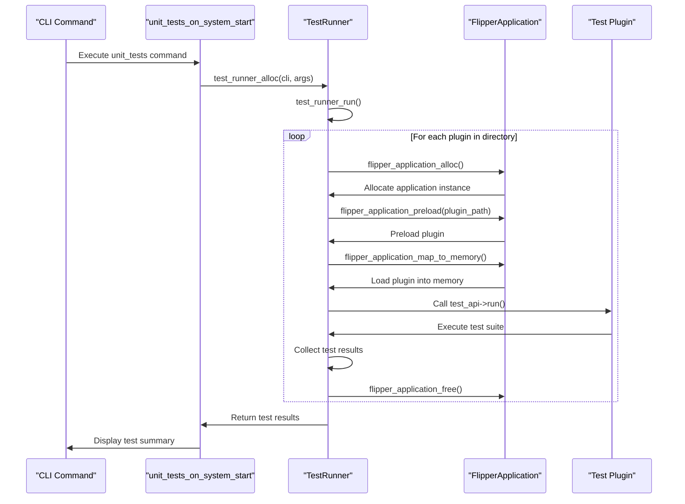
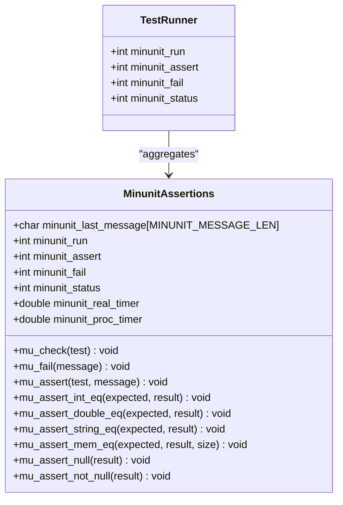
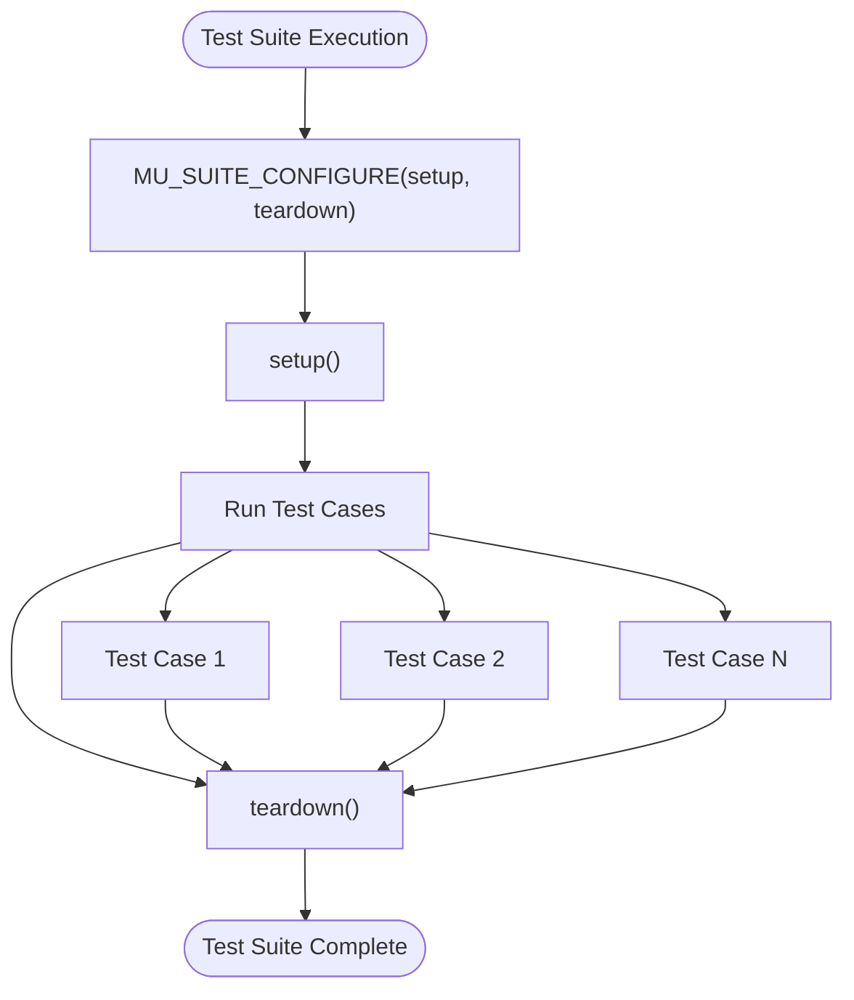
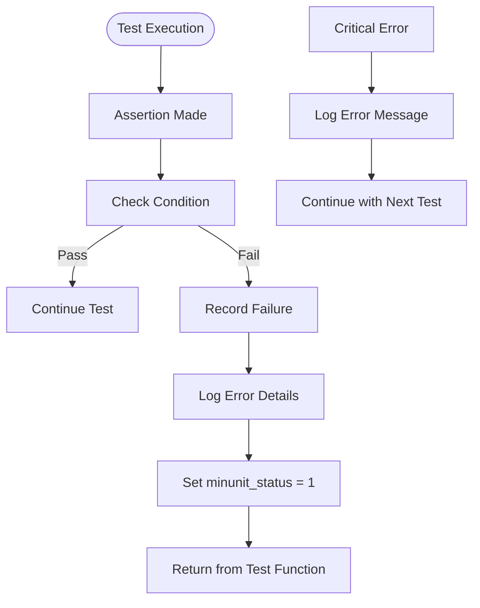

# Unit Testing

<cite>
**Referenced Files in This Document**   
- [test_runner.h](file://applications/debug/unit_tests/test_runner.h)
- [test_runner.c](file://applications/debug/unit_tests/test_runner.c)
- [unit_tests.c](file://applications/debug/unit_tests/unit_tests.c)
- [test_api.h](file://applications/debug/unit_tests/tests/test_api.h)
- [test.h](file://applications/debug/unit_tests/tests/test.h)
- [minunit.h](file://applications/debug/unit_tests/tests/minunit.h)
- [minunit_vars.h](file://applications/debug/unit_tests/tests/minunit_vars.h)
- [application.fam](file://applications/debug/unit_tests/application.fam)
- [UnitTests.md](file://documentation/UnitTests.md)
</cite>

## Table of Contents
1. [Introduction](#introduction)
2. [Test Runner Architecture](#test-runner-architecture)
3. [Test Registration Mechanism](#test-registration-mechanism)
4. [Assertion System](#assertion-system)
5. [Writing and Organizing Test Cases](#writing-and-organizing-test-cases)
6. [Setup and Teardown Patterns](#setup-and-teardown-patterns)
7. [Protocol-Specific Testing Examples](#protocol-specific-testing-examples)
8. [Error Handling Strategies](#error-handling-strategies)
9. [Test Result Reporting](#test-result-reporting)
10. [Build System Integration](#build-system-integration)
11. [Common Issues and Solutions](#common-issues-and-solutions)
12. [Migration and Compatibility](#migration-and-compatibility)
13. [Performance Optimization](#performance-optimization)

## Introduction

The Flipper Zero firmware includes a comprehensive unit testing framework designed to ensure code quality and prevent regressions. The framework runs directly on Flipper devices to leverage their hardware features and eliminate platform-related differences. This documentation provides a detailed guide to the unit testing infrastructure, covering the test runner architecture, test registration mechanism, assertion system, and best practices for writing and organizing test cases.

The unit testing framework is crucial for developing robust, bug-free code and is highly recommended when contributing to the Flipper Zero firmware. Existing unit tests should be run to ensure that new code does not introduce regressions.

**Section sources**
- [UnitTests.md](file://documentation/UnitTests.md#L1-L65)

## Test Runner Architecture

The test runner architecture is designed to dynamically load and execute test plugins, providing a flexible and extensible testing framework. The core component is the `TestRunner` structure, which manages the execution environment and coordinates the testing process.

The test runner operates by scanning the `/ext/apps_data/unit_tests/plugins` directory for plugin files with the `.fal` extension. Each plugin is loaded as a separate ELF application and executed in isolation. The test runner maintains state information including the number of tests run, assertions made, and failures encountered.

The architecture leverages the Flipper Application framework to load plugins, using a composite API resolver that provides access to both firmware APIs and unit test-specific APIs. This allows test plugins to interact with the device's hardware and services while maintaining isolation between tests.



**Diagram sources**
- [test_runner.h](file://applications/debug/unit_tests/test_runner.h#L5-L12)
- [test_runner.c](file://applications/debug/unit_tests/test_runner.c#L23-L43)

**Section sources**
- [test_runner.h](file://applications/debug/unit_tests/test_runner.h#L1-L13)
- [test_runner.c](file://applications/debug/unit_tests/test_runner.c#L1-L278)

## Test Registration Mechanism

The test registration mechanism in the Flipper Zero firmware uses a plugin-based architecture where each test suite is implemented as a separate plugin application. Tests are registered through the `application.fam` manifest file, which defines the available test plugins and their entry points.

Each test plugin must implement the `TestApi` interface, which provides function pointers for running the test and retrieving test statistics. The `TEST_API_DEFINE` macro simplifies the registration process by automatically creating the necessary plugin descriptor and entry point function.

The test runner discovers available tests by scanning the plugins directory and loading each `.fal` file as a separate application. When a test is executed, the test runner calls the `run` function from the `TestApi` interface, which contains the actual test logic.



**Diagram sources**
- [test_api.h](file://applications/debug/unit_tests/tests/test_api.h#L8-L30)
- [application.fam](file://applications/debug/unit_tests/application.fam#L1-L231)
- [test_runner.c](file://applications/debug/unit_tests/test_runner.c#L82-L129)

**Section sources**
- [test_api.h](file://applications/debug/unit_tests/tests/test_api.h#L1-L30)
- [application.fam](file://applications/debug/unit_tests/application.fam#L1-L231)
- [test_runner.c](file://applications/debug/unit_tests/test_runner.c#L82-L129)

## Assertion System

The assertion system in the Flipper Zero unit testing framework is based on the minunit library, a lightweight unit testing framework for C. The system provides a comprehensive set of assertion macros for testing various data types and conditions.

The assertion system tracks several metrics during test execution:
- `minunit_run`: Number of test functions executed
- `minunit_assert`: Number of assertions made
- `minunit_fail`: Number of failed assertions
- `minunit_status`: Status flag indicating if the current test has failed

When an assertion fails, the system captures detailed diagnostic information including the failed condition, file name, line number, and function name. This information is formatted into a human-readable error message that helps developers quickly identify and fix issues.

The framework provides assertion macros for various data types:
- Integer comparisons (`mu_assert_int_eq`, `mu_assert_int_not_eq`)
- Floating-point comparisons (`mu_assert_double_eq`, with epsilon tolerance)
- String comparisons (`mu_assert_string_eq`)
- Memory comparisons (`mu_assert_mem_eq`)
- Null pointer checks (`mu_assert_null`, `mu_assert_not_null`)
- Pointer equality (`mu_assert_pointers_eq`)



**Diagram sources**
- [minunit.h](file://applications/debug/unit_tests/tests/minunit.h#L75-L500)
- [minunit_vars.h](file://applications/debug/unit_tests/tests/minunit_vars.h#L5-L15)

**Section sources**
- [minunit.h](file://applications/debug/unit_tests/tests/minunit.h#L1-L662)
- [minunit_vars.h](file://applications/debug/unit_tests/tests/minunit_vars.h#L1-L16)

## Writing and Organizing Test Cases

Writing test cases in the Flipper Zero firmware follows a structured approach using the minunit framework. Test cases are organized into test suites, with each suite focusing on a specific component or functionality.

To create a new test suite, developers should:
1. Create a new plugin application in the `tests` directory
2. Implement test functions using the `MU_TEST` macro
3. Define a test suite function using the `MU_TEST_SUITE` macro
4. Register the test suite using the `MU_RUN_SUITE` macro
5. Add the test to the `application.fam` manifest file

Test cases should be designed to be independent and idempotent, ensuring that the outcome of one test does not affect others. Each test should focus on a single aspect of functionality and provide clear, descriptive names that indicate what is being tested.

The framework supports parameterized tests through the `MU_TEST_1` macro, allowing the same test logic to be executed with different input values. This helps reduce code duplication while maintaining comprehensive test coverage.

**Section sources**
- [UnitTests.md](file://documentation/UnitTests.md#L27-L37)
- [test.h](file://applications/debug/unit_tests/tests/test.h#L1-L13)

## Setup and Teardown Patterns

The unit testing framework provides setup and teardown functionality through the `MU_SUITE_CONFIGURE` macro, which allows developers to specify functions that are executed before and after each test suite.

Setup functions are used to initialize resources, configure test environments, and prepare any necessary data. Teardown functions are responsible for cleaning up resources, restoring system state, and preventing memory leaks. This pattern ensures that each test runs in a clean environment and does not leave behind artifacts that could affect subsequent tests.

The setup and teardown functions are particularly important when testing hardware components or system services that maintain state between operations. By properly managing the test lifecycle, developers can ensure reliable and repeatable test results.



**Diagram sources**
- [minunit.h](file://applications/debug/unit_tests/tests/minunit.h#L101-L102)
- [minunit.h](file://applications/debug/unit_tests/tests/minunit.h#L110-L120)

**Section sources**
- [minunit.h](file://applications/debug/unit_tests/tests/minunit.h#L79-L80)

## Protocol-Specific Testing Examples

The Flipper Zero unit testing framework includes specialized testing capabilities for various protocols, particularly for hardware abstraction layers and communication protocols.

For infrared protocol testing, the framework supports test assets with the `.irtest` extension. These files contain test data for encoder and decoder functions, organized into three sections:
1. `decoder`: Tests raw signal decoding
2. `encoder`: Tests message encoding to raw signals
3. `encoder_decoder`: Tests round-trip encoding and decoding

Each test case includes input data and expected output, allowing comprehensive validation of protocol implementations. The test framework automatically loads these assets and executes the corresponding test functions.

For NFC and RFID testing, the framework uses specialized test assets that contain captured signal data. These assets are used to verify the correctness of protocol implementations and ensure compatibility with various tag types.

The framework also supports testing of application logic and service components through mock objects and dependency injection patterns, allowing isolated testing of business logic without requiring physical hardware.

**Section sources**
- [UnitTests.md](file://documentation/UnitTests.md#L39-L65)
- [application.fam](file://applications/debug/unit_tests/application.fam#L128-L134)

## Error Handling Strategies

The unit testing framework implements comprehensive error handling strategies to ensure reliable test execution and meaningful failure reporting. When a test fails, the framework captures detailed diagnostic information and continues execution of remaining tests when possible.

The error handling system uses a status flag pattern, where each assertion sets a status flag when it fails. This allows the framework to report the first failure in a test function while continuing to execute subsequent assertions to identify multiple issues.

For critical errors that prevent test execution (such as plugin loading failures), the framework logs detailed error messages and continues with the next test. This ensures that a single failing test does not prevent the execution of the entire test suite.

The framework also includes memory leak detection by measuring heap usage before and after test execution. This helps identify resource management issues that might not cause immediate failures but could lead to stability problems over time.



**Diagram sources**
- [minunit.h](file://applications/debug/unit_tests/tests/minunit.h#L159-L172)
- [test_runner.c](file://applications/debug/unit_tests/test_runner.c#L90-L124)

**Section sources**
- [test_runner.c](file://applications/debug/unit_tests/test_runner.c#L90-L124)

## Test Result Reporting

The test result reporting system provides comprehensive feedback on test execution, including success/failure status, performance metrics, and resource usage. After executing all tests, the framework generates a detailed summary that includes:

- Total number of tests run
- Total number of assertions made
- Number of failed tests
- Execution time (real and CPU time)
- Memory usage (potential leaks)

The results are displayed both in the CLI output and through the device's notification system. Successful test runs are indicated by a blue LED, while failures trigger a red LED blink pattern. This dual reporting mechanism ensures that test results are visible regardless of the connection method.

For interactive testing, the framework displays results in a dialog window on the device's screen, showing the overall status and detailed information about failed tests. This allows developers to quickly identify and address issues without requiring external tools.

The reporting system also includes timing information, which helps identify performance regressions and optimize test execution speed.

**Section sources**
- [test_runner.c](file://applications/debug/unit_tests/test_runner.c#L224-L277)

## Build System Integration

The unit testing framework is tightly integrated with the Flipper Zero build system, allowing tests to be compiled and executed as part of the standard development workflow.

To build and run tests, developers use the following command:
```
./fbt FIRMWARE_APP_SET=unit_tests updater_package
```

This compiles the firmware with the unit test applications and creates a package that can be flashed to the device. The build system automatically includes all test plugins defined in the `application.fam` file.

Tests can be run through the CLI using the `unit_tests` command. Individual tests can be executed by specifying the test name as a command argument, which is useful for debugging specific issues.

The build system also supports running tests on the host machine for faster development cycles, although device-specific tests require actual hardware execution.

**Section sources**
- [UnitTests.md](file://documentation/UnitTests.md#L18-L23)

## Common Issues and Solutions

Several common issues can occur when working with the unit testing framework, along with established solutions:

**Flaky Tests**: Tests that sometimes pass and sometimes fail are often caused by timing dependencies or shared state. Solutions include:
- Using proper setup/teardown functions to reset state
- Adding appropriate delays for hardware operations
- Mocking time-dependent functions

**Memory Leaks**: Detected through the heap usage reporting. Solutions include:
- Ensuring all allocated memory is properly freed
- Using the setup/teardown pattern to clean up resources
- Checking for circular references in data structures

**Plugin Loading Failures**: Occur when test plugins cannot be loaded. Solutions include:
- Verifying the plugin path and file permissions
- Checking for missing dependencies in the `application.fam` file
- Ensuring the plugin is properly formatted as a valid ELF application

**Hardware Interference**: Tests may fail due to interference from other running applications. The framework attempts to lock the device during test execution to prevent this issue.

**Section sources**
- [test_runner.c](file://applications/debug/unit_tests/test_runner.c#L218-L221)

## Migration and Compatibility

The unit testing framework maintains backward compatibility through versioned APIs and careful deprecation practices. When APIs are deprecated, they remain available for a transition period with appropriate warnings.

Migration guides are provided for major changes to the testing infrastructure, including:
- Changes to the assertion API
- Modifications to the test registration mechanism
- Updates to the build system integration

The framework uses semantic versioning for its APIs, with major version changes indicating breaking changes. Developers are encouraged to pin their test dependencies to specific versions to ensure stability during development.

Backward compatibility is maintained through adapter layers that translate between old and new APIs, allowing gradual migration of test suites.

**Section sources**
- [test_api.h](file://applications/debug/unit_tests/tests/test_api.h#L6)

## Performance Optimization

Several strategies can be employed to optimize test execution time and resource usage:

**Parallel Execution**: Where possible, tests should be designed to run independently and can be executed in parallel. The framework supports running individual tests by name, enabling selective execution.

**Test Categorization**: Tests are categorized by execution time and resource requirements, allowing developers to run fast tests frequently and slower, resource-intensive tests less often.

**Resource Management**: Proper use of setup and teardown functions minimizes memory usage and prevents resource leaks that could slow down test execution over time.

**Selective Execution**: Developers can run specific tests by name, avoiding the overhead of executing the entire test suite during development.

**Caching**: Test assets are cached in memory when possible to reduce file I/O overhead.

These optimization techniques help maintain a fast feedback loop, which is essential for effective test-driven development.

**Section sources**
- [test_runner.c](file://applications/debug/unit_tests/test_runner.c#L236-L239)