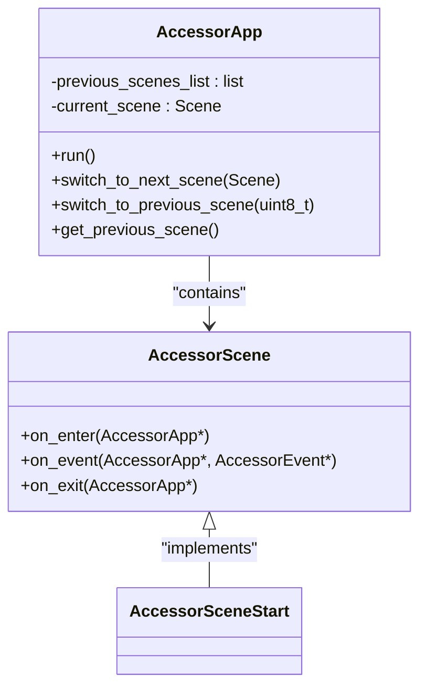
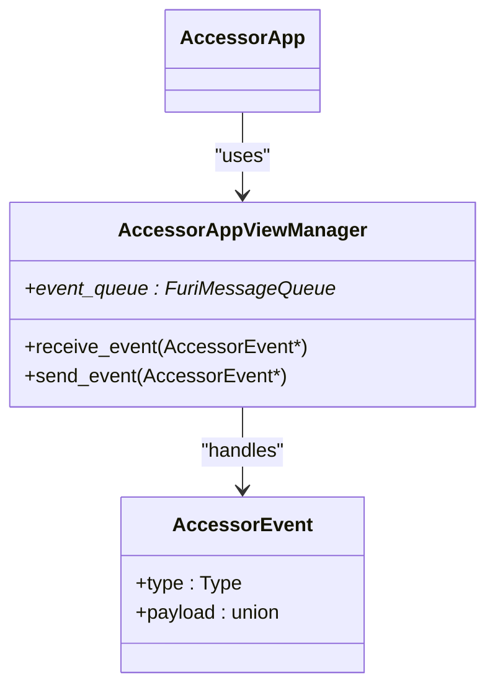
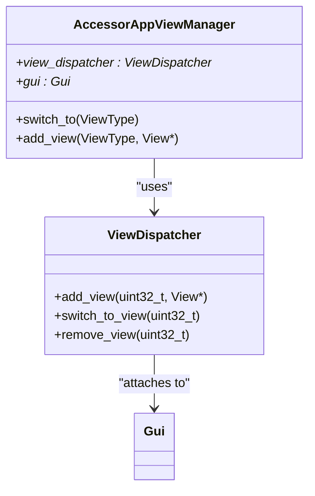
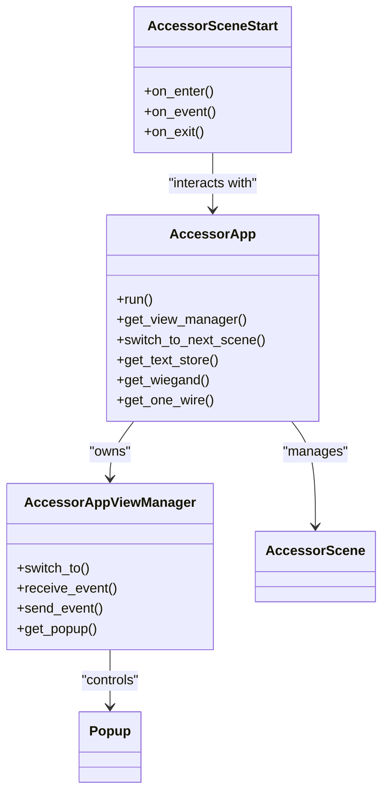
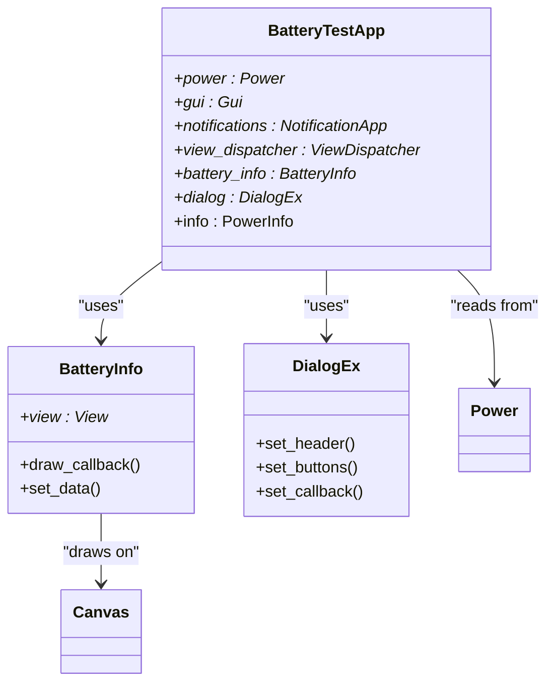
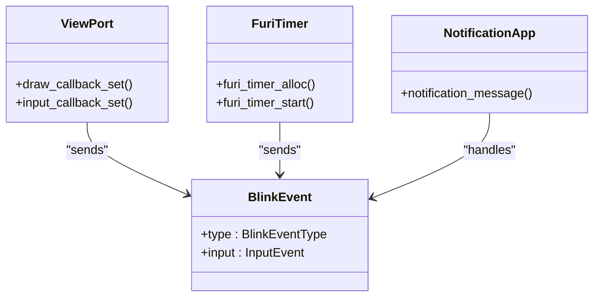
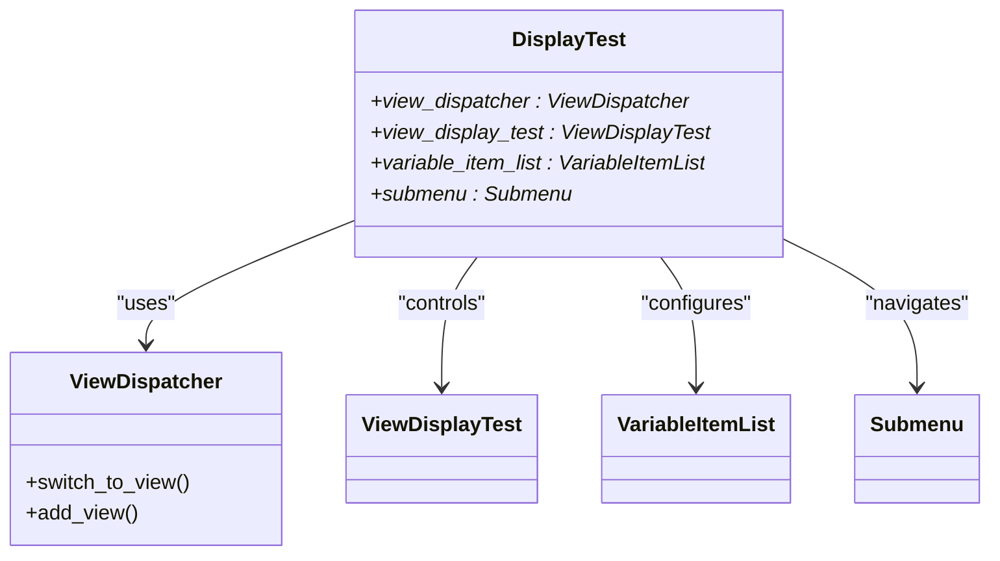

# Debug Applications

<cite>
**Referenced Files in This Document**   
- [accessor_app.h](file://applications/debug/accessor/accessor_app.h)
- [accessor_app.cpp](file://applications/debug/accessor/accessor_app.cpp)
- [accessor_scene_start.cpp](file://applications/debug/accessor/scene/accessor_scene_start.cpp)
- [accessor_view_manager.h](file://applications/debug/accessor/accessor_view_manager.h)
- [accessor_view_manager.cpp](file://applications/debug/accessor/accessor_view_manager.cpp)
- [accessor_event.h](file://applications/debug/accessor/accessor_event.h)
- [battery_test_app.h](file://applications/debug/battery_test_app/battery_test_app.h)
- [battery_test_app.c](file://applications/debug/battery_test_app/battery_test_app.c)
- [battery_info.h](file://applications/debug/battery_test_app/views/battery_info.h)
- [battery_info.c](file://applications/debug/battery_test_app/views/battery_info.c)
- [blink_test.c](file://applications/debug/blink_test/blink_test.c)
- [display_test.c](file://applications/debug/display_test/display_test.c)
- [view_display_test.c](file://applications/debug/display_test/view_display_test.c)
</cite>

## Table of Contents
1. [Introduction](#introduction)
2. [Debug Application Framework Architecture](#debug-application-framework-architecture)
3. [Accessor Debug Application](#accessor-debug-application)
4. [Battery Test Application](#battery-test-application)
5. [Blink Test Application](#blink-test-application)
6. [Display Test Application](#display-test-application)
7. [Other Diagnostic Tools Overview](#other-diagnostic-tools-overview)
8. [Common Debugging Scenarios](#common-debugging-scenarios)
9. [Conclusion](#conclusion)

## Introduction

The Flipper Zero firmware includes a comprehensive suite of diagnostic and testing applications designed to assist developers and advanced users in verifying hardware functionality, troubleshooting issues, and validating system performance. These debug applications provide direct access to various hardware peripherals and system components, enabling thorough testing and analysis. This document details the architecture of the debug application framework and provides in-depth analysis of key diagnostic tools including accessor, battery, blink, display, infrared, keypad, speaker, sub-GHz, UART echo, USB, and vibration testing utilities.

**Section sources**
- [accessor_app.h](file://applications/debug/accessor/accessor_app.h#L1-L56)
- [battery_test_app.h](file://applications/debug/battery_test_app/battery_test_app.h#L1-L25)

## Debug Application Framework Architecture

The debug applications in Flipper Zero are built on a consistent architectural pattern that follows the Model-View-Controller (MVC) design pattern with scene-based navigation. The framework provides a standardized approach to application development, ensuring consistency across different diagnostic tools.

### Scene Management System

The scene management system is central to the debug application framework, enabling state-based navigation and context preservation. Each application maintains a stack of previous scenes and manages transitions between different states. The `AccessorApp` class demonstrates this pattern with its scene management implementation:



**Diagram sources**
- [accessor_app.h](file://applications/debug/accessor/accessor_app.h#L15-L56)
- [accessor_app.cpp](file://applications/debug/accessor/accessor_app.cpp#L100-L130)

The scene management system works by:
1. Maintaining a list of previous scenes in a stack-like structure
2. Providing methods to navigate forward to a specific scene
3. Allowing navigation back through the scene history
4. Managing the lifecycle of scenes through on_enter, on_event, and on_exit methods

### Event Handling Mechanism

The event handling system uses a message queue-based approach to decouple event generation from processing. Events are defined as simple structures with a type and optional payload, allowing for extensible event handling:



**Diagram sources**
- [accessor_event.h](file://applications/debug/accessor/accessor_event.h#L1-L19)
- [accessor_view_manager.h](file://applications/debug/accessor/accessor_view_manager.h#L1-L39)

The event system supports:
- **Tick events**: Periodic updates for continuous monitoring
- **Back events**: Navigation requests from the user interface
- **Custom events**: Application-specific event types

### View Dispatcher Architecture

The view dispatcher system manages the presentation layer, handling the switching between different visual components. It uses the Flipper OS view dispatcher to manage multiple views within a single application:



**Diagram sources**
- [accessor_view_manager.h](file://applications/debug/accessor/accessor_view_manager.h#L1-L39)
- [accessor_view_manager.cpp](file://applications/debug/accessor/accessor_view_manager.cpp#L1-L80)

Key components of the view system:
- **ViewDispatcher**: Manages multiple views and handles switching
- **Gui**: Provides access to the graphical user interface system
- **View modules**: Pre-built UI components like Popup, Submenu, and custom views

**Section sources**
- [accessor_app.h](file://applications/debug/accessor/accessor_app.h#L1-L56)
- [accessor_app.cpp](file://applications/debug/accessor/accessor_app.cpp#L1-L145)
- [accessor_view_manager.h](file://applications/debug/accessor/accessor_view_manager.h#L1-L39)
- [accessor_view_manager.cpp](file://applications/debug/accessor/accessor_view_manager.cpp#L1-L80)

## Accessor Debug Application

The Accessor debug application is designed to test and diagnose access control hardware interfaces, specifically Wiegand protocol readers and 1-Wire devices. It provides real-time feedback on detected card data and supports both Wiegand and iButton technologies.

### Implementation Architecture

The Accessor application follows a modular architecture with clear separation of concerns between the application logic, scene management, and view presentation:



**Diagram sources**
- [accessor_app.h](file://applications/debug/accessor/accessor_app.h#L1-L56)
- [accessor_app.cpp](file://applications/debug/accessor/accessor_app.cpp#L1-L145)
- [accessor_scene_start.cpp](file://applications/debug/accessor/scene/accessor_scene_start.cpp#L1-L87)

### Core Functionality

The Accessor application's main functionality is implemented in the `on_event` method of the start scene, which handles the Tick event to read data from connected devices:

```c
bool AccessorSceneStart::on_event(AccessorApp* app, AccessorEvent* event) {
    if(event->type == AccessorEvent::Type::Tick) {
        WIEGAND* wiegand = app->get_wiegand();
        Popup* popup = app->get_view_manager()->get_popup();
        OneWireHost* onewire_host = app->get_one_wire();

        uint8_t data[8] = {0};
        uint8_t type = 0;

        if(wiegand->available()) {
            // Read Wiegand data
            type = wiegand->getWiegandType();
            // Extract code bytes
            for(uint8_t i = 0; i < 4; i++) {
                data[i] = wiegand->getCode() >> (i * 8);
            }
            for(uint8_t i = 4; i < 8; i++) {
                data[i] = wiegand->getCodeHigh() >> ((i - 4) * 8);
            }
        } else {
            // Read 1-Wire data
            FURI_CRITICAL_ENTER();
            if(onewire_host_reset(onewire_host)) {
                type = 255;
                onewire_host_write(onewire_host, 0x33);
                for(uint8_t i = 0; i < 8; i++) {
                    data[i] = onewire_host_read(onewire_host);
                }
                // Reorder data bytes
                for(uint8_t i = 0; i < 7; i++) {
                    data[i] = data[i + 1];
                }
            }
            FURI_CRITICAL_EXIT();
        }

        if(type > 0) {
            // Format and display data
            if(type == 255) {
                app->set_text_store(
                    "[%02X %02X %02X %02X %02X %02X DS]",
                    data[5], data[4], data[3], data[2], data[1], data[0]);
            } else {
                app->set_text_store(
                    "[%02X %02X %02X %02X %02X %02X W%u]",
                    data[5], data[4], data[3], data[2], data[1], data[0], type);
            }
            popup_set_text(popup, app->get_text_store(), 64, 22, AlignCenter, AlignTop);
            app->notify_success();
        }
    }
    return false;
}
```

**Section sources**
- [accessor_scene_start.cpp](file://applications/debug/accessor/scene/accessor_scene_start.cpp#L1-L87)
- [accessor_app.cpp](file://applications/debug/accessor/accessor_app.cpp#L1-L145)

### Hardware Integration

The Accessor application integrates with two key hardware interfaces:

1. **Wiegand Protocol**: Used for reading access control cards and key fobs
2. **1-Wire Interface**: Used for reading iButton devices and other 1-Wire compatible sensors

The application initializes these interfaces in the constructor:
```c
AccessorApp::AccessorApp()
    : text_store{0} {
    notification = static_cast<NotificationApp*>(furi_record_open(RECORD_NOTIFICATION));
    expansion = static_cast<Expansion*>(furi_record_open(RECORD_EXPANSION));
    onewire_host = onewire_host_alloc(&gpio_ibutton);
    expansion_disable(expansion);
    furi_hal_power_enable_otg();
}
```

And cleans up resources in the destructor:
```c
AccessorApp::~AccessorApp() {
    furi_hal_power_disable_otg();
    expansion_enable(expansion);
    furi_record_close(RECORD_EXPANSION);
    furi_record_close(RECORD_NOTIFICATION);
    onewire_host_free(onewire_host);
}
```

## Battery Test Application

The Battery Test application provides comprehensive diagnostics for the Flipper Zero's power system, displaying detailed information about battery voltage, current, temperature, charge level, and health.

### Application Structure

The Battery Test application follows a modular structure with separate components for data acquisition, user interface, and application control:



**Diagram sources**
- [battery_test_app.h](file://applications/debug/battery_test_app/battery_test_app.h#L1-L25)
- [battery_test_app.c](file://applications/debug/battery_test_app/battery_test_app.c#L1-L102)
- [battery_info.h](file://applications/debug/battery_test_app/views/battery_info.h#L1-L23)

### Data Acquisition and Display

The application uses a periodic tick event to update battery information every 500 milliseconds:

```c
static void battery_test_battery_info_update_model(void* context) {
    BatteryTestApp* app = context;
    power_get_info(app->power, &app->info);
    BatteryInfoModel battery_info_data = {
        .vbus_voltage = app->info.voltage_vbus,
        .gauge_voltage = app->info.voltage_gauge,
        .gauge_current = app->info.current_gauge,
        .gauge_temperature = app->info.temperature_gauge,
        .charge = app->info.charge,
        .health = app->info.health,
    };
    battery_info_set_data(app->battery_info, &battery_info_data);
    notification_message(app->notifications, &sequence_display_backlight_on);
}
```

The main application initialization sets up the view dispatcher with tick event callback:
```c
app->view_dispatcher = view_dispatcher_alloc();
view_dispatcher_enable_queue(app->view_dispatcher);
view_dispatcher_set_event_callback_context(app->view_dispatcher, app);
view_dispatcher_set_tick_event_callback(
    app->view_dispatcher, battery_test_battery_info_update_model, 500);
```

### Visual Representation

The battery information is displayed using a custom drawing function that renders battery status with appropriate icons and text:

```c
static void draw_battery(Canvas* canvas, BatteryInfoModel* data, int x, int y) {
    char emote[20] = {};
    char header[20] = {};
    char value[20] = {};

    int32_t drain_current = data->gauge_current * (-1000);
    uint32_t charge_current = data->gauge_current * 1000;

    // Draw battery body and face icon based on state
    canvas_draw_icon(canvas, x, y, &I_BatteryBody_52x28);
    if(charge_current > 0) {
        canvas_draw_icon(canvas, x + 16, y + 7, &I_FaceCharging_29x14);
    } else if(drain_current > HIGH_DRAIN_CURRENT_THRESHOLD) {
        canvas_draw_icon(canvas, x + 16, y + 7, &I_FaceConfused_29x14);
    } else if(data->charge < LOW_CHARGE_THRESHOLD) {
        canvas_draw_icon(canvas, x + 16, y + 7, &I_FaceNopower_29x14);
    } else {
        canvas_draw_icon(canvas, x + 16, y + 7, &I_FaceNormal_29x14);
    }

    // Add contextual text based on charging/discharging state
    if(charge_current > 0) {
        snprintf(emote, sizeof(emote), "%s", "Yummy!");
        snprintf(header, sizeof(header), "%s", "Charging at");
        snprintf(value, sizeof(value), "%lu.%luV   %lumA",
            (uint32_t)(data->vbus_voltage),
            (uint32_t)(data->vbus_voltage * 10) % 10,
            charge_current);
    } else if(drain_current > 0) {
        snprintf(emote, sizeof(emote), "%s",
            drain_current > HIGH_DRAIN_CURRENT_THRESHOLD ? "Oh no!" : "Om-nom-nom!");
        snprintf(header, sizeof(header), "%s", "Consumption is");
        snprintf(value, sizeof(value), "%ld %s",
            drain_current,
            drain_current > HIGH_DRAIN_CURRENT_THRESHOLD ? "mA!" : "mA");
    }
    // ... additional conditions
}
```

**Section sources**
- [battery_test_app.c](file://applications/debug/battery_test_app/battery_test_app.c#L1-L102)
- [battery_info.c](file://applications/debug/battery_test_app/views/battery_info.c#L1-L148)

## Blink Test Application

The Blink Test application is designed to test the RGB LED notification system by cycling through various color sequences and hardware blink patterns.

### Implementation Details

The application uses a message queue to handle both input events and periodic tick events:



**Diagram sources**
- [blink_test.c](file://applications/debug/blink_test/blink_test.c#L1-L125)

The application defines a sequence of notification patterns to test different LED behaviors:

```c
static const NotificationSequence* blink_test_colors[] = {
    &sequence_blink_red_100,
    &sequence_blink_green_100,
    &sequence_blink_blue_100,
    &sequence_blink_yellow_100,
    &sequence_blink_cyan_100,
    &sequence_blink_magenta_100,
    &sequence_blink_white_100,
    &blink_test_sequence_hw_blink_start_red,
    &blink_test_sequence_hw_blink_green,
    &blink_test_sequence_hw_blink_blue,
    &blink_test_sequence_hw_blink_stop,
};
```

Each sequence tests different aspects of the LED system:
- Solid color blinks (red, green, blue, etc.)
- Hardware-level color control
- Sequence stopping and cleanup

### Event Processing Loop

The main application loop processes events from the message queue, handling both user input and periodic updates:

```c
int32_t blink_test_app(void* p) {
    FuriMessageQueue* event_queue = furi_message_queue_alloc(8, sizeof(BlinkEvent));

    // Setup view port and timer
    ViewPort* view_port = view_port_alloc();
    view_port_draw_callback_set(view_port, blink_test_draw_callback, NULL);
    view_port_input_callback_set(view_port, blink_test_input_callback, event_queue);
    FuriTimer* timer = furi_timer_alloc(blink_test_update, FuriTimerTypePeriodic, event_queue);
    furi_timer_start(timer, furi_kernel_get_tick_frequency());

    // Register with GUI
    Gui* gui = furi_record_open(RECORD_GUI);
    gui_add_view_port(gui, view_port, GuiLayerFullscreen);

    NotificationApp* notifications = furi_record_open(RECORD_NOTIFICATION);

    uint8_t state = 0;
    BlinkEvent event;

    while(1) {
        furi_check(furi_message_queue_get(event_queue, &event, FuriWaitForever) == FuriStatusOk);
        if(event.type == BlinkEventTypeInput) {
            if((event.input.type == InputTypeShort) && (event.input.key == InputKeyBack)) {
                break;
            }
        } else {
            notification_message(notifications, blink_test_colors[state]);
            state++;
            if(state >= COUNT_OF(blink_test_colors)) {
                state = 0;
            }
        }
    }

    // Cleanup
    notification_message(notifications, &blink_test_sequence_hw_blink_stop);
    // ... resource cleanup
    return 0;
}
```

The tick event triggers color changes every timer interval, cycling through the predefined sequences.

**Section sources**
- [blink_test.c](file://applications/debug/blink_test/blink_test.c#L1-L125)

## Display Test Application

The Display Test application provides tools for testing and configuring the Flipper Zero's OLED display, including contrast adjustment, bias settings, and visual pattern testing.

### Configuration System

The application implements a comprehensive configuration interface that allows users to adjust display parameters:

```c
typedef struct {
    Gui* gui;
    ViewDispatcher* view_dispatcher;
    ViewDisplayTest* view_display_test;
    VariableItemList* variable_item_list;
    Submenu* submenu;

    bool config_bias;
    uint8_t config_contrast;
    uint8_t config_regulation_ratio;
} DisplayTest;
```

Configuration options include:
- **Bias**: Sets the display bias ratio (1/7 or 1/9)
- **Contrast**: Adjusts display contrast (0-63)
- **Regulation Ratio**: Sets the voltage regulation ratio (3.0-6.5)

### Dynamic Configuration Updates

When configuration values change, the application immediately applies them to the display hardware:

```c
static void display_test_reload_config(DisplayTest* instance) {
    u8x8_d_st756x_init(
        &instance->gui->canvas->fb.u8x8,
        instance->config_contrast,
        instance->config_regulation_ratio,
        instance->config_bias);
}
```

The configuration callbacks update both the displayed text and the internal state:

```c
static void display_config_set_contrast(VariableItem* item) {
    DisplayTest* instance = variable_item_get_context(item);
    uint8_t index = variable_item_get_current_value_index(item);
    FuriString* temp = furi_string_alloc();
    furi_string_cat_printf(temp, "%d", index);
    variable_item_set_current_value_text(item, furi_string_get_cstr(temp));
    furi_string_free(temp);
    instance->config_contrast = index;
    display_test_reload_config(instance);
}
```

### Visual Testing

The application includes a dedicated view for display testing, which can render various patterns to verify display functionality. The main application structure manages navigation between different views:



**Diagram sources**
- [display_test.c](file://applications/debug/display_test/display_test.c#L1-L229)
- [view_display_test.c](file://applications/debug/display_test/view_display_test.c#L1-L100)

The application flow:
1. Presents a submenu with "Test" and "Configure" options
2. Allows navigation between views using the previous callback system
3. Applies configuration changes immediately to the display hardware
4. Provides visual feedback through the display test patterns

**Section sources**
- [display_test.c](file://applications/debug/display_test/display_test.c#L1-L229)

## Other Diagnostic Tools Overview

In addition to the detailed applications above, the Flipper Zero firmware includes several other diagnostic tools that serve specific testing purposes:

### Infrared Test Application

The infrared_test.c application tests the infrared transmitter and receiver functionality, allowing users to verify IR signal transmission and reception capabilities.

### Keypad Test Application

The keypad_test.c application provides a simple interface to test all physical buttons on the device, displaying which buttons are pressed and their input events.

### Speaker Debug Application

The speaker_debug.c application tests the audio output system by generating various tones and sounds to verify speaker functionality.

### Sub-GHz Test Application

The subghz_test directory contains comprehensive tools for testing the sub-GHz radio module, including frequency testing, protocol simulation, and signal analysis.

### UART Echo Application

The uart_echo.c application tests serial communication by echoing received data back to the sender, useful for verifying UART connectivity and data integrity.

### USB Test Application

The usb_test.c application verifies USB connectivity and communication, testing both data transfer and device enumeration.

### Vibration Test Application

The vibro_test.c application tests the vibration motor, allowing users to verify haptic feedback functionality.

These applications follow the same architectural patterns as the detailed examples, using the scene management system, event handling, and view dispatchers to provide consistent user experiences across different diagnostic tools.

## Common Debugging Scenarios

The debug applications are designed to assist with various common troubleshooting scenarios:

### Hardware Verification

When receiving a new Flipper Zero device, users can run the diagnostic suite to verify all hardware components are functioning correctly:
- Run **Blink Test** to verify RGB LED functionality
- Use **Battery Test** to check power system readings
- Execute **Display Test** to validate screen contrast and visibility
- Test **Keypad** to ensure all buttons register input

### Connectivity Issues

For problems with wireless communication:
- Use **Sub-GHz Test** to verify radio transmission and reception
- Run **BT Debug App** to test Bluetooth connectivity
- Execute **Infrared Test** to confirm IR signal transmission

### Power Management Problems

When experiencing battery or charging issues:
- Monitor real-time data with **Battery Test**
- Check voltage and current readings for anomalies
- Verify charging status and current draw
- Assess battery health percentage

### Peripheral Integration

When connecting external devices:
- Use **Accessor** to test Wiegand and 1-Wire interfaces
- Run **Expansion Test** to verify expansion module connectivity
- Test **USB** functionality with various host devices

The debug applications provide immediate visual and haptic feedback, making it easy to identify and diagnose issues quickly.

## Conclusion

The Flipper Zero debug applications provide a comprehensive suite of diagnostic tools that leverage a consistent architectural framework based on scene management, event handling, and view dispatching. These tools enable thorough testing of hardware components and system functionality, serving both development and troubleshooting purposes.

Key architectural patterns include:
- **Scene-based navigation** for state management
- **Message queue event system** for decoupled communication
- **View dispatcher integration** for consistent UI presentation
- **Resource management** through proper initialization and cleanup

The applications demonstrate effective integration with hardware peripherals, providing real-time feedback and diagnostic information. By following these patterns, developers can create additional diagnostic tools that maintain consistency with the existing ecosystem.

These debug applications are essential for verifying hardware functionality, troubleshooting issues, and ensuring system reliability, making them valuable tools for both developers and advanced users.