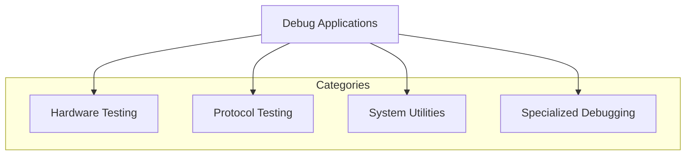
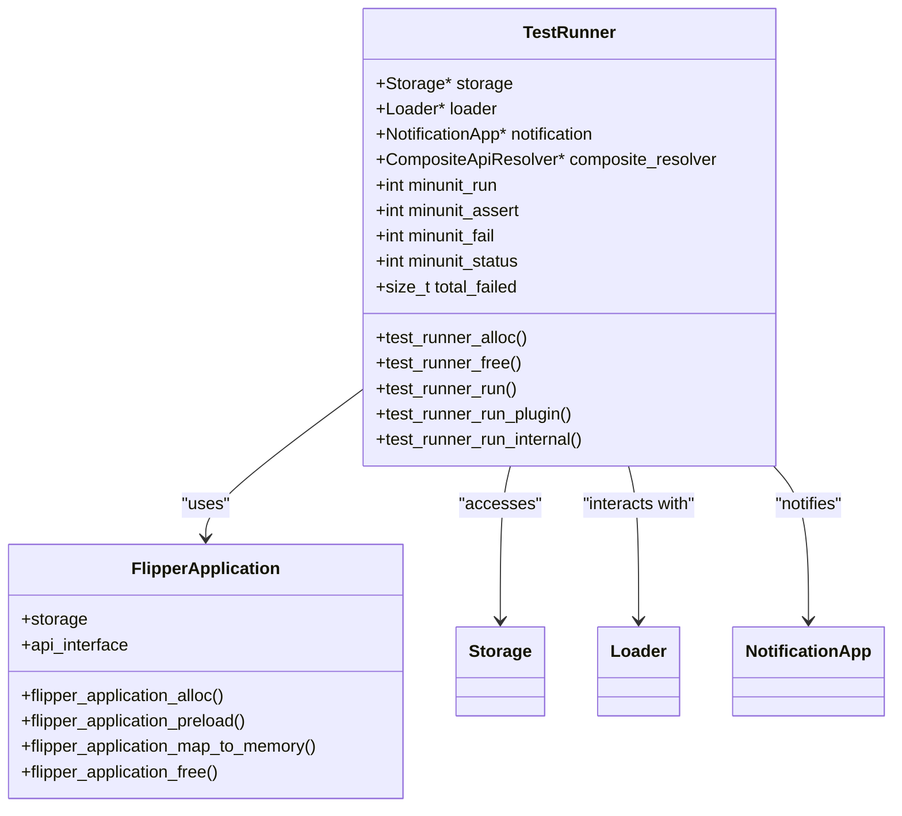
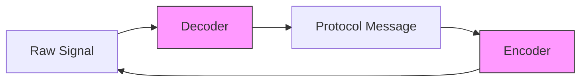
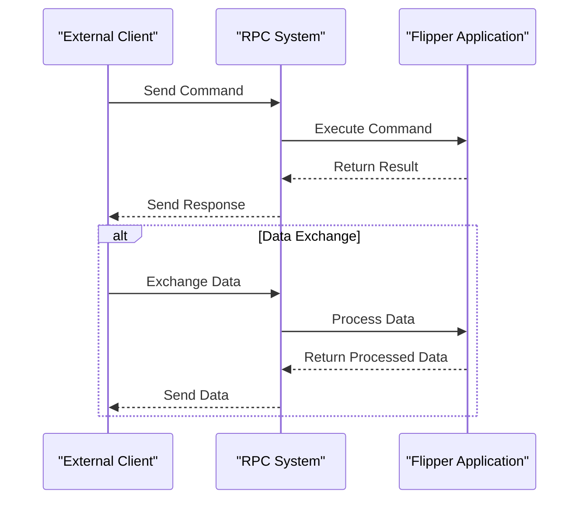
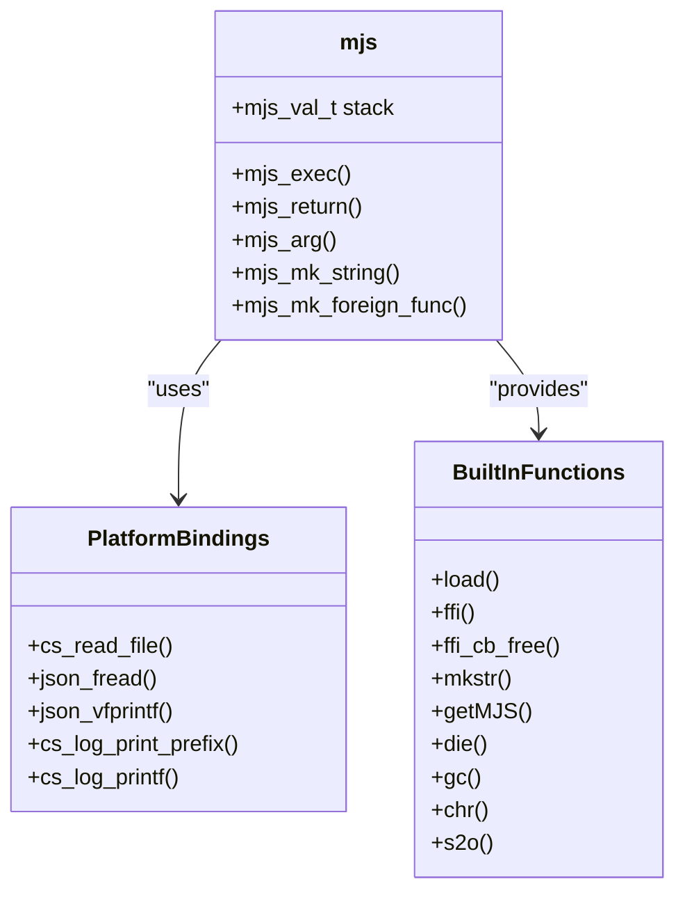

# Development Tools

<cite>
**Referenced Files in This Document**   
- [unit_tests.c](file://applications/debug/unit_tests/unit_tests.c)
- [test_runner.c](file://applications/debug/unit_tests/test_runner.c)
- [rpc_debug_app.c](file://applications/debug/rpc_debug_app/rpc_debug_app.c)
- [rpc_debug_app_scene_start.c](file://applications/debug/rpc_debug_app/scenes/rpc_debug_app_scene_start.c)
- [rpc_debug_app_scene_input_data_exchange.c](file://applications/debug/rpc_debug_app/scenes/rpc_debug_app_scene_input_data_exchange.c)
- [platform_flipper.c](file://lib/mjs/common/platforms/platform_flipper.c)
- [mjs_builtin.c](file://lib/mjs/mjs_builtin.c)
- [js_builtin.md](file://documentation/js/js_builtin.md)
- [UnitTests.md](file://documentation/UnitTests.md)
- [test_nec.irtest](file://applications/debug/unit_tests/resources/unit_tests/infrared/test_nec.irtest)
</cite>

## Table of Contents
1. [Introduction](#introduction)
2. [Debug Applications](#debug-applications)
3. [Unit Testing Framework](#unit-testing-framework)
4. [Remote Procedure Call (RPC) System](#remote-procedure-call-rpc-system)
5. [JavaScript Scripting Capabilities](#javascript-scripting-capabilities)
6. [Integration with External Development Environments](#integration-with-external-development-environments)
7. [Conclusion](#conclusion)

## Introduction
The Flipper Zero platform provides a comprehensive suite of development tools designed to facilitate debugging, testing, and application development. These tools enable developers to create robust applications, automate testing processes, and extend functionality through scripting. This document explores the key development utilities available in the Flipper Zero firmware, including debug applications, unit testing framework, RPC interface, and JavaScript scripting capabilities.

**Section sources**
- [unit_tests.c](file://applications/debug/unit_tests/unit_tests.c)
- [rpc_debug_app.c](file://applications/debug/rpc_debug_app/rpc_debug_app.c)
- [mjs_builtin.c](file://lib/mjs/mjs_builtin.c)

## Debug Applications
The Flipper Zero firmware includes a dedicated `debug` directory containing various test applications designed for hardware and software validation. These applications serve as both diagnostic tools and examples for developers.

The debug applications are organized into several categories:
- Hardware testing (battery_test_app, display_test, speaker_debug)
- Protocol testing (bt_debug_app, ccid_test, subghz_test)
- System utilities (file_browser_test, uart_echo, usb_test)
- Specialized debugging (rpc_debug_app, unit_tests)

These applications follow a consistent structure with scene-based navigation and view management, allowing for interactive testing through the device's user interface.



**Diagram sources**
- [applications/debug](file://applications/debug)

## Unit Testing Framework

### Framework Architecture
The unit testing framework in Flipper Zero is implemented as a dedicated application that discovers and executes test plugins. The framework follows a modular architecture where individual tests are packaged as plugins and loaded dynamically at runtime.

The core components of the unit testing framework include:
- **TestRunner**: Manages the execution of test plugins
- **Plugin System**: Loads and executes individual test modules
- **Reporting System**: Collects and displays test results
- **CLI Integration**: Allows test execution from command line



**Diagram sources**
- [test_runner.c](file://applications/debug/unit_tests/test_runner.c)
- [unit_tests.c](file://applications/debug/unit_tests/unit_tests.c)

**Section sources**
- [test_runner.c](file://applications/debug/unit_tests/test_runner.c)
- [unit_tests.c](file://applications/debug/unit_tests/unit_tests.c)

### Writing and Running Unit Tests
Unit tests in Flipper Zero are implemented as plugin applications that follow a specific interface. The test framework discovers these plugins in the `/ext/apps_data/unit_tests/plugins` directory and executes them sequentially.

To create a new unit test:
1. Create a plugin application with the appropriate manifest
2. Implement the test functions according to the TestApi interface
3. Place the compiled plugin in the designated directory
4. Run the unit_tests application

The framework supports selective test execution by specifying the test name as a command-line argument. This allows developers to focus on specific tests during development.

```c
// Example test structure
struct TestApi {
    int (*run)(void);
    int (*get_minunit_run)(void);
    int (*get_minunit_assert)(void);
    int (*get_minunit_status)(void);
};
```

The test runner provides comprehensive reporting, including:
- Number of failed tests
- Execution time
- Memory usage (heap allocation)
- Pass/fail status with visual and auditory feedback

**Section sources**
- [test_runner.c](file://applications/debug/unit_tests/test_runner.c)
- [UnitTests.md](file://documentation/UnitTests.md)

### Infrared Protocol Testing
The unit testing framework includes specialized support for infrared protocol testing. Infrared tests use a custom `.irtest` file format that contains test data for encoder, decoder, and round-trip validation.

The test data format includes three sections:
- **decoder**: Tests the decoding of raw signals into protocol messages
- **encoder**: Tests the encoding of protocol messages into raw signals
- **encoder_decoder**: Tests the complete round-trip process



**Diagram sources**
- [test_nec.irtest](file://applications/debug/unit_tests/resources/unit_tests/infrared/test_nec.irtest)

**Section sources**
- [UnitTests.md](file://documentation/UnitTests.md)
- [test_nec.irtest](file://applications/debug/unit_tests/resources/unit_tests/infrared/test_nec.irtest)

## Remote Procedure Call (RPC) System

### RPC Architecture
The Remote Procedure Call (RPC) system in Flipper Zero enables external applications to control the device programmatically. The RPC interface follows a client-server model where external tools can send commands and receive responses.

The RPC system architecture consists of:
- **RPC Server**: Runs on the Flipper Zero device
- **Command Processor**: Handles incoming RPC commands
- **Application Interface**: Provides access to device functionality
- **Data Exchange Mechanism**: Transfers data between client and server



**Diagram sources**
- [rpc_debug_app.c](file://applications/debug/rpc_debug_app/rpc_debug_app.c)

**Section sources**
- [rpc_debug_app.c](file://applications/debug/rpc_debug_app/rpc_debug_app.c)

### Command Structure and Error Handling
The RPC system uses a structured command format with different event types:
- **SessionClose**: Indicates the end of an RPC session
- **AppExit**: Requests application exit
- **DataExchange**: Transfers data between client and server

Error handling in the RPC system follows a confirmation pattern where the server responds to each command with a success or failure indication. This ensures reliable communication and allows clients to handle errors appropriately.

```c
// RPC command callback
static void rpc_debug_app_rpc_command_callback(
    const RpcAppSystemEvent* event, 
    void* context
) {
    RpcDebugApp* app = context;
    
    if(event->type == RpcAppEventTypeSessionClose) {
        // Handle session close
        rpc_system_app_set_callback(app->rpc, NULL, NULL);
        app->rpc = NULL;
    } else if(event->type == RpcAppEventTypeAppExit) {
        // Handle app exit
        rpc_system_app_confirm(app->rpc, true);
    } else if(event->type == RpcAppEventTypeDataExchange) {
        // Handle data exchange
        view_dispatcher_send_custom_event(
            app->view_dispatcher, 
            RpcDebugAppCustomEventRpcDataExchange
        );
    } else {
        // Confirm command received
        rpc_system_app_confirm(app->rpc, false);
    }
}
```

**Section sources**
- [rpc_debug_app.c](file://applications/debug/rpc_debug_app/rpc_debug_app.c)

### Security Considerations
The RPC system implements several security measures:
- **Session Management**: Proper initialization and cleanup of RPC sessions
- **Memory Safety**: Careful handling of data buffers to prevent overflow
- **Access Control**: Limited access to critical system functions
- **Error Recovery**: Graceful handling of malformed commands

The system requires explicit initialization with a valid RPC context and properly cleans up resources when the session ends. This prevents resource leaks and ensures system stability.

**Section sources**
- [rpc_debug_app.c](file://applications/debug/rpc_debug_app/rpc_debug_app.c)

### Using RPC for Automation
The RPC interface can be used for various automation tasks:
- **Device Testing**: Automated execution of test sequences
- **Data Collection**: Retrieval of sensor data or system information
- **Application Control**: Remote control of Flipper Zero applications
- **Firmware Development**: Integration with continuous integration workflows

Developers can create scripts that connect to the RPC interface and send commands to perform complex operations programmatically.

**Section sources**
- [rpc_debug_app.c](file://applications/debug/rpc_debug_app/rpc_debug_app.c)

## JavaScript Scripting Capabilities

### mJS Engine Integration
The Flipper Zero platform includes the mJS JavaScript engine, which provides a lightweight scripting environment for extending device functionality. The mJS engine is integrated into the firmware and exposes a subset of JavaScript features optimized for embedded systems.

The JavaScript environment is implemented in the `lib/mjs` directory and includes:
- Core JavaScript engine
- Platform-specific bindings
- Built-in functions for device interaction
- Memory management for constrained environments



**Diagram sources**
- [mjs_builtin.c](file://lib/mjs/mjs_builtin.c)
- [platform_flipper.c](file://lib/mjs/common/platforms/platform_flipper.c)

**Section sources**
- [mjs_builtin.c](file://lib/mjs/mjs_builtin.c)
- [platform_flipper.c](file://lib/mjs/common/platforms/platform_flipper.c)

### JavaScript API
The JavaScript environment on Flipper Zero provides a set of built-in functions that allow scripts to interact with the device hardware and system services.

Key JavaScript functions include:
- **require**: Load module plugins
- **delay**: Introduce delays in milliseconds
- **print**: Output messages to the console
- **console.log/warn/error/debug**: Output messages with different log levels
- **to_string**: Convert numbers to strings
- **to_hex_string**: Convert numbers to hexadecimal strings

```javascript
// Example JavaScript script
let serial = require("serial"); // Load serial module
print("Starting script"); // Output message
delay(500); // Wait 500ms
print("Delay complete");
print("Number as string:", to_string(123));
print("Number as hex:", to_hex_string(0xFF));
```

The `require` function enables modular programming by allowing scripts to load additional functionality as needed. This creates a flexible ecosystem where developers can create and share reusable modules.

**Section sources**
- [js_builtin.md](file://documentation/js/js_builtin.md)
- [mjs_builtin.c](file://lib/mjs/mjs_builtin.c)

### Developing JavaScript Scripts
To develop JavaScript scripts for Flipper Zero:
1. Create a `.js` file with the desired functionality
2. Use the built-in functions to interact with the device
3. Test the script on the device
4. Deploy the script to the appropriate directory

Scripts can be used for various purposes:
- Automating repetitive tasks
- Creating custom applications
- Prototyping new features
- Extending existing functionality

The JavaScript environment provides a rapid development cycle, allowing developers to quickly test and iterate on their ideas without the need for full firmware compilation.

**Section sources**
- [js_builtin.md](file://documentation/js/js_builtin.md)

## Integration with External Development Environments

### Continuous Integration Workflows
The development tools in Flipper Zero can be integrated into continuous integration (CI) workflows. The unit testing framework and RPC interface enable automated testing and validation of firmware changes.

A typical CI workflow includes:
1. Compile the firmware with unit tests enabled
2. Flash the firmware to a test device
3. Execute unit tests via CLI or RPC
4. Collect and report test results
5. Deploy firmware if tests pass

This approach ensures code quality and prevents regressions in the firmware.

**Section sources**
- [UnitTests.md](file://documentation/UnitTests.md)
- [rpc_debug_app.c](file://applications/debug/rpc_debug_app/rpc_debug_app.c)

### External Tool Integration
The RPC interface allows external development tools to integrate with Flipper Zero. This enables:
- IDE plugins for direct device interaction
- Automated testing frameworks
- Data analysis tools
- Custom development utilities

Developers can create tools that leverage the RPC interface to extend the functionality of the development environment and streamline the development process.

**Section sources**
- [rpc_debug_app.c](file://applications/debug/rpc_debug_app/rpc_debug_app.c)

## Conclusion
The Flipper Zero platform provides a comprehensive set of development tools that enable efficient debugging, testing, and application development. The unit testing framework ensures code quality through automated testing, while the RPC interface enables programmatic control and automation. The JavaScript scripting capabilities allow for rapid prototyping and extension of device functionality.

These tools work together to create a robust development environment that supports both low-level firmware development and high-level application creation. By leveraging these tools, developers can create reliable, well-tested applications for the Flipper Zero platform.

The integration of these development tools with external environments and continuous integration workflows further enhances the development process, enabling teams to maintain high code quality and accelerate development cycles.