# RPC Interface

<cite>
**Referenced Files in This Document**   
- [rpc.h](file://applications/services/rpc/rpc.h#L0-L148)
- [rpc.c](file://applications/services/rpc/rpc.c#L0-L509)
- [rpc_system.c](file://applications/services/rpc/rpc_system.c#L0-L344)
- [rpc_storage.c](file://applications/services/rpc/rpc_storage.c#L0-L287)
- [rpc_app.c](file://applications/services/rpc/rpc_app.c#L0-L195)
- [rpc_gui.c](file://applications/services/rpc/rpc_gui.c#L0-L148)
- [rpc_gpio.c](file://applications/services/rpc/rpc_gpio.c#L0-L152)
- [rpc_property.c](file://applications/services/rpc/rpc_property.c#L0-L78)
- [rpc_desktop.c](file://applications/services/rpc/rpc_desktop.c#L0-L108)
- [flipper.proto](file://assets/protobuf/flipper.proto#L0-L152)
- [system.proto](file://assets/protobuf/system.proto#L0-L96)
- [storage.proto](file://assets/protobuf/storage.proto#L0-L100)
- [application.proto](file://assets/protobuf/application.proto#L0-L59)
- [gui.proto](file://assets/protobuf/gui.proto#L0-L52)
- [gpio.proto](file://assets/protobuf/gpio.proto#L0-L74)
- [property.proto](file://assets/protobuf/property.proto#L0-L14)
- [desktop.proto](file://assets/protobuf/desktop.proto#L0-L21)
- [rpc_debug_app.c](file://applications/debug/rpc_debug_app/rpc_debug_app.c#L0-L234)
</cite>

## Table of Contents
1. [Introduction](#introduction)
2. [Architecture Overview](#architecture-overview)
3. [Core Components](#core-components)
4. [Protocol Buffers Message Structure](#protocol-buffers-message-structure)
5. [RPC Session Management](#rpc-session-management)
6. [Service Interfaces](#service-interfaces)
7. [Error Handling](#error-handling)
8. [Connection Establishment](#connection-establishment)
9. [Use Cases](#use-cases)
10. [Available RPC Commands](#available-rpc-commands)

## Introduction

The RPC (Remote Procedure Call) interface in the Flipper Zero firmware enables external control and automation of the device through a structured communication protocol. This system allows external applications to send commands to the Flipper Zero and receive responses, enabling integration with desktop applications, mobile apps, automated testing frameworks, and remote debugging tools. The RPC system is designed to be transport-agnostic, supporting communication over various interfaces including Bluetooth, USB, and UART.

The implementation uses Protocol Buffers for message serialization, ensuring efficient and reliable data exchange between the Flipper Zero and external clients. The system follows a request-response pattern with support for continuous commands through the `has_next` flag in the message structure. Each RPC session is managed independently, allowing multiple concurrent connections from different transport layers.

**Section sources**
- [rpc.h](file://applications/services/rpc/rpc.h#L0-L148)
- [flipper.proto](file://assets/protobuf/flipper.proto#L0-L152)

## Architecture Overview

The RPC architecture in Flipper Zero consists of several key components working together to provide a robust remote control interface. At the core is the RPC service that manages sessions and routes commands to appropriate handlers. Each service (system, storage, application, etc.) implements its own command handlers that process specific RPC requests. Protocol Buffers are used for message definition and serialization, ensuring type safety and efficient binary encoding.

```mermaid
graph TB
subgraph "External Client"
Client[Client Application]
end
subgraph "Flipper Zero"
Transport[Transport Layer<br/>(BLE/USB/UART)]
RPC[RPC Service]
System[System Commands]
Storage[Storage Commands]
App[Application Commands]
GUI[GUI Commands]
GPIO[GPIO Commands]
Property[Property Commands]
Desktop[Desktop Commands]
end
Client --> |Serialized Protobuf| Transport
Transport --> |Raw Bytes| RPC
RPC --> |Command Dispatch| System
RPC --> |Command Dispatch| Storage
RPC --> |Command Dispatch| App
RPC --> |Command Dispatch| GUI
RPC --> |Command Dispatch| GPIO
RPC --> |Command Dispatch| Property
RPC --> |Command Dispatch| Desktop
System --> |Response| RPC
Storage --> |Response| RPC
App --> |Response| RPC
GUI --> |Response| RPC
GPIO --> |Response| RPC
Property --> |Response| RPC
Desktop --> |Response| RPC
RPC --> |Serialized Response| Transport
Transport --> |Raw Bytes| Client
style RPC fill:#4CAF50,stroke:#388E3C
style System fill:#2196F3,stroke:#1976D2
style Storage fill:#2196F3,stroke:#1976D2
style App fill:#2196F3,stroke:#1976D2
style GUI fill:#2196F3,stroke:#1976D2
style GPIO fill:#2196F3,stroke:#1976D2
style Property fill:#2196F3,stroke:#1976D2
style Desktop fill:#2196F3,stroke:#1976D2
```

**Diagram sources**
- [rpc.c](file://applications/services/rpc/rpc.c#L0-L509)
- [flipper.proto](file://assets/protobuf/flipper.proto#L0-L152)

## Core Components

The RPC system is built around several core components that work together to provide remote procedure call functionality. The main components include the RPC session manager, message processor, transport interface, and service handlers. The system uses Protocol Buffers for message definition and serialization, ensuring efficient and reliable data exchange.

The RPC session is represented by the `RpcSession` structure, which maintains state for each active connection. Each session has its own stream buffer for incoming data, a decoding context for Protocol Buffers, and callback functions for sending data back to the client. The session runs in its own thread, processing incoming messages and dispatching them to appropriate handlers.

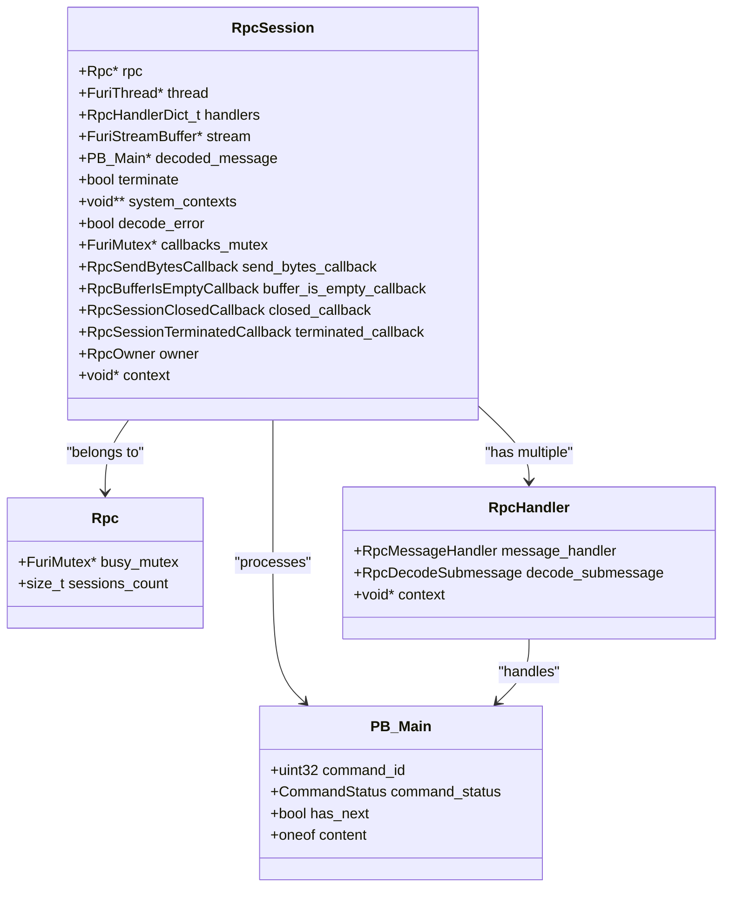

**Diagram sources**
- [rpc.h](file://applications/services/rpc/rpc.h#L0-L148)
- [rpc.c](file://applications/services/rpc/rpc.c#L0-L509)

**Section sources**
- [rpc.h](file://applications/services/rpc/rpc.h#L0-L148)
- [rpc.c](file://applications/services/rpc/rpc.c#L0-L509)

## Protocol Buffers Message Structure

The RPC system uses Protocol Buffers (protobuf) for message definition and serialization. The main message structure is defined in `flipper.proto`, which includes all possible command types through a `oneof` content field. This design allows the system to handle multiple command types within a single message envelope.

The `Main` message serves as the container for all RPC commands and includes metadata such as `command_id` for request-response correlation, `command_status` for operation results, and `has_next` for multi-part responses. The `oneof content` field contains the actual command payload, with each service having its own set of request and response messages.

```mermaid
erDiagram
MAIN {
uint32 command_id
CommandStatus command_status
bool has_next
oneof content
}
SYSTEM ||--o{ PING : "system_ping"
SYSTEM ||--o{ REBOOT : "system_reboot"
SYSTEM ||--o{ DEVICE_INFO : "system_device_info"
SYSTEM ||--o{ FACTORY_RESET : "system_factory_reset"
SYSTEM ||--o{ GET_DATETIME : "system_get_datetime"
SYSTEM ||--o{ SET_DATETIME : "system_set_datetime"
SYSTEM ||--o{ PLAY_ALERT : "system_play_alert"
SYSTEM ||--o{ PROTOBUF_VERSION : "system_protobuf_version"
SYSTEM ||--o{ UPDATE : "system_update"
SYSTEM ||--o{ POWER_INFO : "system_power_info"
STORAGE ||--o{ INFO : "storage_info"
STORAGE ||--o{ TIMESTAMP : "storage_timestamp"
STORAGE ||--o{ STAT : "storage_stat"
STORAGE ||--o{ LIST : "storage_list"
STORAGE ||--o{ READ : "storage_read"
STORAGE ||--o{ WRITE : "storage_write"
STORAGE ||--o{ DELETE : "storage_delete"
STORAGE ||--o{ MKDIR : "storage_mkdir"
STORAGE ||--o{ MD5SUM : "storage_md5sum"
STORAGE ||--o{ RENAME : "storage_rename"
STORAGE ||--o{ BACKUP_CREATE : "storage_backup_create"
STORAGE ||--o{ BACKUP_RESTORE : "storage_backup_restore"
STORAGE ||--o{ TAR_EXTRACT : "storage_tar_extract"
APP ||--o{ START : "app_start"
APP ||--o{ LOCK_STATUS : "app_lock_status"
APP ||--o{ APP_EXIT : "app_exit"
APP ||--o{ APP_LOAD_FILE : "app_load_file"
APP ||--o{ APP_BUTTON_PRESS : "app_button_press"
APP ||--o{ APP_BUTTON_RELEASE : "app_button_release"
APP ||--o{ APP_BUTTON_PRESS_RELEASE : "app_button_press_release"
APP ||--o{ GET_ERROR : "app_get_error"
APP ||--o{ DATA_EXCHANGE : "app_data_exchange"
APP ||--o{ APP_STATE : "app_state"
GUI ||--o{ START_SCREEN_STREAM : "gui_start_screen_stream"
GUI ||--o{ STOP_SCREEN_STREAM : "gui_stop_screen_stream"
GUI ||--o{ SCREEN_FRAME : "gui_screen_frame"
GUI ||--o{ SEND_INPUT_EVENT : "gui_send_input_event"
GUI ||--o{ START_VIRTUAL_DISPLAY : "gui_start_virtual_display"
GUI ||--o{ STOP_VIRTUAL_DISPLAY : "gui_stop_virtual_display"
GPIO ||--o{ SET_PIN_MODE : "gpio_set_pin_mode"
GPIO ||--o{ SET_INPUT_PULL : "gpio_set_input_pull"
GPIO ||--o{ GET_PIN_MODE : "gpio_get_pin_mode"
GPIO ||--o{ READ_PIN : "gpio_read_pin"
GPIO ||--o{ WRITE_PIN : "gpio_write_pin"
GPIO ||--o{ GET_OTG_MODE : "gpio_get_otg_mode"
GPIO ||--o{ SET_OTG_MODE : "gpio_set_otg_mode"
PROPERTY ||--o{ GET : "property_get"
DESKTOP ||--o{ IS_LOCKED : "desktop_is_locked"
DESKTOP ||--o{ UNLOCK : "desktop_unlock"
DESKTOP ||--o{ STATUS_SUBSCRIBE : "desktop_status_subscribe"
DESKTOP ||--o{ STATUS_UNSUBSCRIBE : "desktop_status_unsubscribe"
DESKTOP ||--o{ STATUS : "desktop_status"
```

**Diagram sources**
- [flipper.proto](file://assets/protobuf/flipper.proto#L0-L152)
- [system.proto](file://assets/protobuf/system.proto#L0-L96)
- [storage.proto](file://assets/protobuf/storage.proto#L0-L100)

**Section sources**
- [flipper.proto](file://assets/protobuf/flipper.proto#L0-L152)

## RPC Session Management

The RPC session management system handles the lifecycle of RPC connections from establishment to termination. Each session is represented by a `RpcSession` structure that maintains the state for a single client connection. The system supports multiple concurrent sessions from different transport owners (BLE, USB, UART).

Session creation begins with `rpc_session_open()`, which allocates resources and starts a dedicated worker thread for message processing. The worker thread continuously reads from the input stream buffer, decodes Protocol Buffer messages, and dispatches them to registered handlers. Sessions are thread-safe through the use of mutexes for callback management.

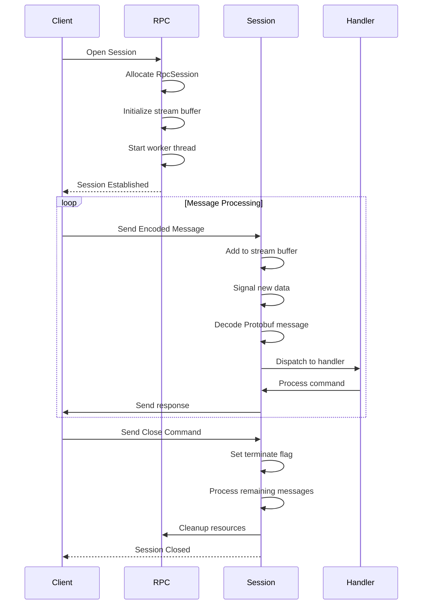

**Diagram sources**
- [rpc.c](file://applications/services/rpc/rpc.c#L0-L509)

**Section sources**
- [rpc.c](file://applications/services/rpc/rpc.c#L0-L509)

## Service Interfaces

The RPC system provides several service interfaces that expose different aspects of the Flipper Zero's functionality to external clients. Each service handles a specific domain such as system operations, storage management, application control, GUI interaction, GPIO manipulation, property access, and desktop status.

### System Interface

The system interface provides commands for device-level operations including reboot, factory reset, time management, and system information retrieval. These commands are implemented in `rpc_system.c` and handle requests defined in `system.proto`.

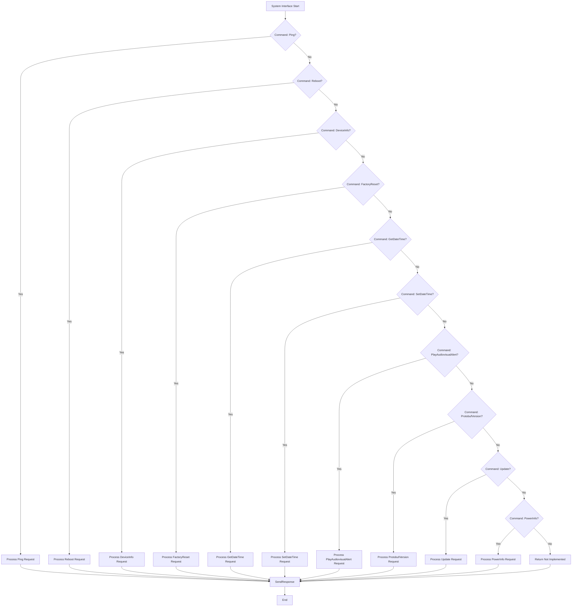

**Diagram sources**
- [rpc_system.c](file://applications/services/rpc/rpc_system.c#L0-L344)
- [system.proto](file://assets/protobuf/system.proto#L0-L96)

### Storage Interface

The storage interface provides file system operations including directory listing, file reading and writing, file information retrieval, and file management operations. These commands are implemented in `rpc_storage.c` and handle requests defined in `storage.proto`.

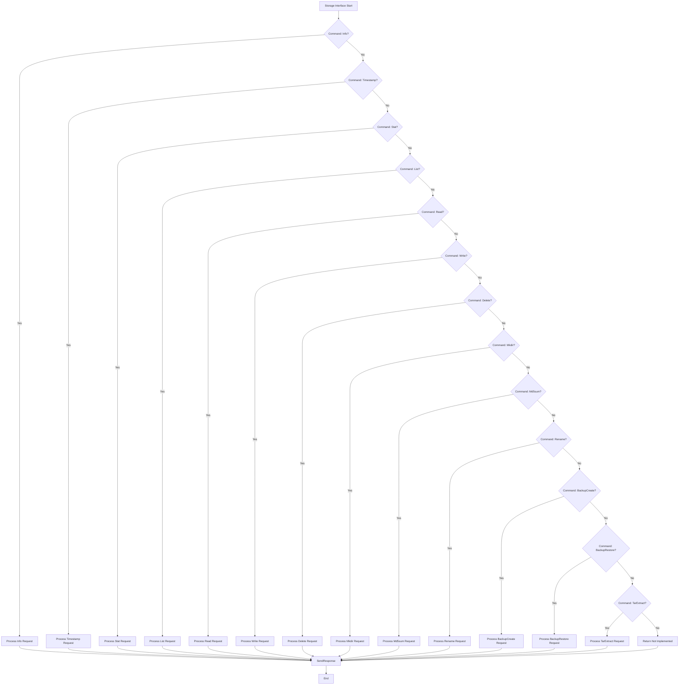

**Diagram sources**
- [rpc_storage.c](file://applications/services/rpc/rpc_storage.c#L0-L287)
- [storage.proto](file://assets/protobuf/storage.proto#L0-L100)

### Application Interface

The application interface allows external clients to start and control applications on the Flipper Zero. This includes starting applications with arguments, checking application lock status, exiting applications, and exchanging data with running applications.

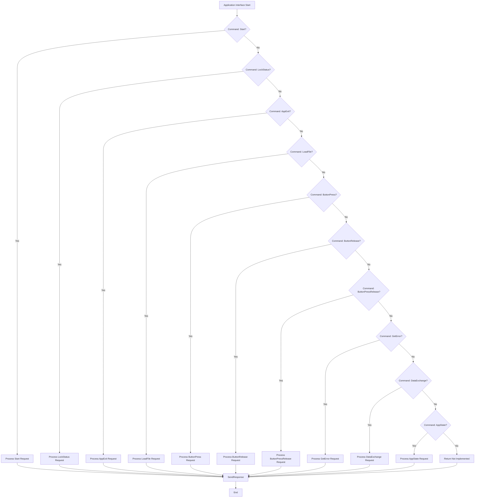

**Diagram sources**
- [rpc_app.c](file://applications/services/rpc/rpc_app.c#L0-L195)
- [application.proto](file://assets/protobuf/application.proto#L0-L59)

### GUI Interface

The GUI interface enables remote control of the Flipper Zero's display and input system. This includes screen streaming, virtual display functionality, and input event simulation.

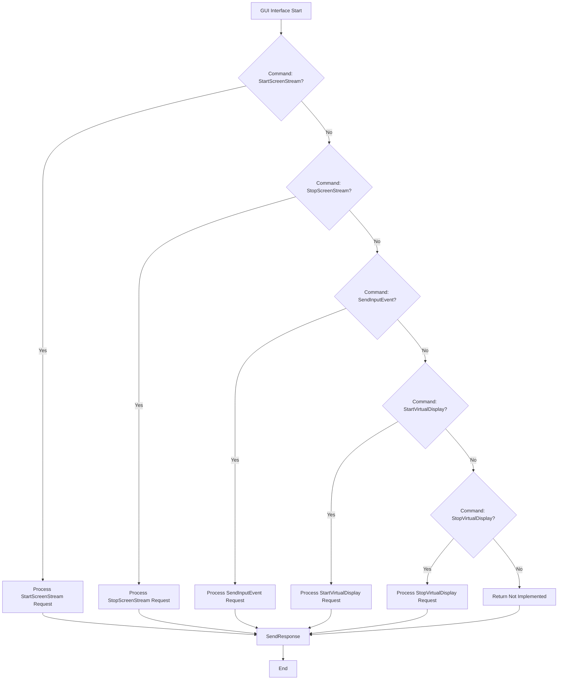

**Diagram sources**
- [rpc_gui.c](file://applications/services/rpc/rpc_gui.c#L0-L148)
- [gui.proto](file://assets/protobuf/gui.proto#L0-L52)

### GPIO Interface

The GPIO interface provides control over the Flipper Zero's general-purpose input/output pins, allowing external clients to configure pin modes, read pin states, and write pin values.

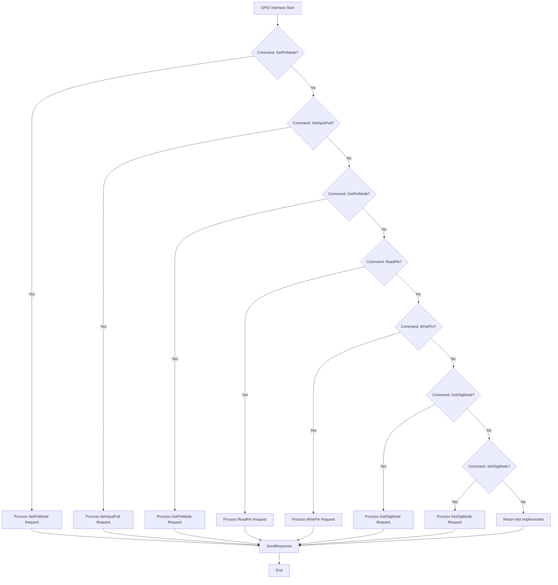

**Diagram sources**
- [rpc_gpio.c](file://applications/services/rpc/rpc_gpio.c#L0-L152)
- [gpio.proto](file://assets/protobuf/gpio.proto#L0-L74)

### Property Interface

The property interface allows external clients to retrieve system properties by key, providing a simple key-value access mechanism for configuration and status information.

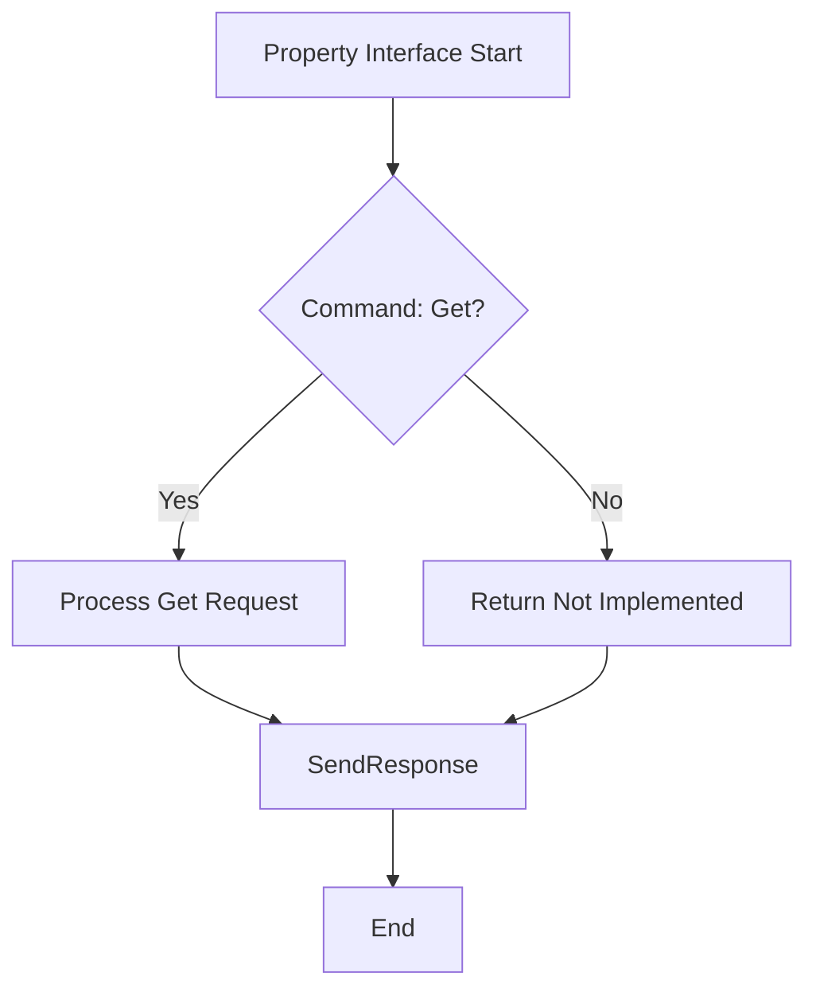

**Diagram sources**
- [rpc_property.c](file://applications/services/rpc/rpc_property.c#L0-L78)
- [property.proto](file://assets/protobuf/property.proto#L0-L14)

### Desktop Interface

The desktop interface provides access to the Flipper Zero's desktop status, including lock state and status subscription functionality.

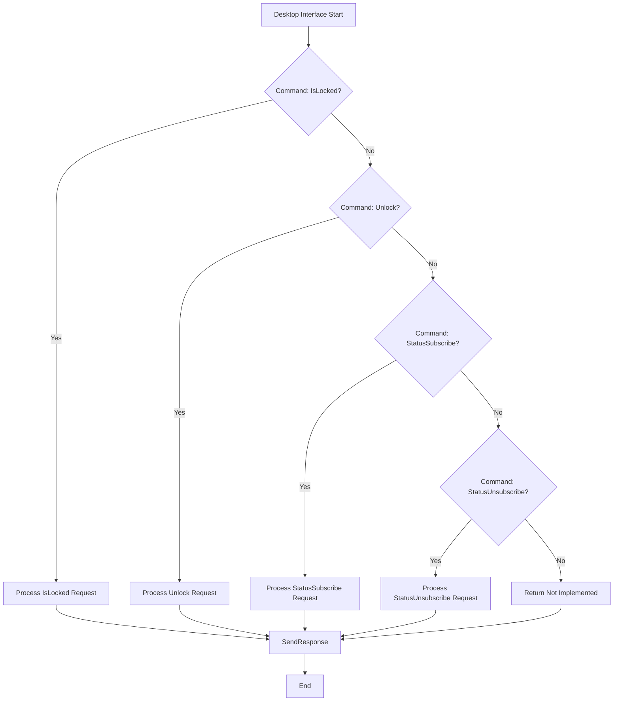

**Diagram sources**
- [rpc_desktop.c](file://applications/services/rpc/rpc_desktop.c#L0-L108)
- [desktop.proto](file://assets/protobuf/desktop.proto#L0-L21)

## Error Handling

The RPC system implements comprehensive error handling through a structured `CommandStatus` enumeration that provides detailed information about the outcome of each command. Errors are categorized into common errors, storage errors, application errors, virtual display errors, and GPIO errors.

```mermaid
stateDiagram-v2
[*] --> Success
[*] --> Error
Success --> OK : "Command executed successfully"
Error --> CommonErrors
Error --> StorageErrors
Error --> ApplicationErrors
Error --> VirtualDisplayErrors
Error --> GPIOErrors
CommonErrors --> ERROR : "Unknown error"
CommonErrors --> ERROR_DECODE : "Command can't be decoded"
CommonErrors --> ERROR_NOT_IMPLEMENTED : "Command not implemented"
CommonErrors --> ERROR_BUSY : "System busy"
CommonErrors --> ERROR_CONTINUOUS_COMMAND_INTERRUPTED : "Continuous command interrupted"
CommonErrors --> ERROR_INVALID_PARAMETERS : "Invalid parameters"
StorageErrors --> ERROR_STORAGE_NOT_READY : "File system not ready"
StorageErrors --> ERROR_STORAGE_EXIST : "File/Dir already exists"
StorageErrors --> ERROR_STORAGE_NOT_EXIST : "File/Dir does not exist"
StorageErrors --> ERROR_STORAGE_INVALID_PARAMETER : "Invalid API parameter"
StorageErrors --> ERROR_STORAGE_DENIED : "Access denied"
StorageErrors --> ERROR_STORAGE_INVALID_NAME : "Invalid name/path"
StorageErrors --> ERROR_STORAGE_INTERNAL : "Internal error"
StorageErrors --> ERROR_STORAGE_NOT_IMPLEMENTED : "Function not implemented"
StorageErrors --> ERROR_STORAGE_ALREADY_OPEN : "File/Dir already opened"
StorageErrors --> ERROR_STORAGE_DIR_NOT_EMPTY : "Directory not empty"
ApplicationErrors --> ERROR_APP_CANT_START : "Can't start app"
ApplicationErrors --> ERROR_APP_SYSTEM_LOCKED : "Another app is running"
ApplicationErrors --> ERROR_APP_NOT_RUNNING : "App not running"
ApplicationErrors --> ERROR_APP_CMD_ERROR : "Command execution error"
VirtualDisplayErrors --> ERROR_VIRTUAL_DISPLAY_ALREADY_STARTED : "Virtual display already started"
VirtualDisplayErrors --> ERROR_VIRTUAL_DISPLAY_NOT_STARTED : "Virtual display not started"
GPIOErrors --> ERROR_GPIO_MODE_INCORRECT : "GPIO mode incorrect"
GPIOErrors --> ERROR_GPIO_UNKNOWN_PIN_MODE : "Unknown pin mode"
OK --> [*]
ERROR --> [*]
ERROR_DECODE --> [*]
ERROR_NOT_IMPLEMENTED --> [*]
ERROR_BUSY --> [*]
ERROR_CONTINUOUS_COMMAND_INTERRUPTED --> [*]
ERROR_INVALID_PARAMETERS --> [*]
ERROR_STORAGE_NOT_READY --> [*]
ERROR_STORAGE_EXIST --> [*]
ERROR_STORAGE_NOT_EXIST --> [*]
ERROR_STORAGE_INVALID_PARAMETER --> [*]
ERROR_STORAGE_DENIED --> [*]
ERROR_STORAGE_INVALID_NAME --> [*]
ERROR_STORAGE_INTERNAL --> [*]
ERROR_STORAGE_NOT_IMPLEMENTED --> [*]
ERROR_STORAGE_ALREADY_OPEN --> [*]
ERROR_STORAGE_DIR_NOT_EMPTY --> [*]
ERROR_APP_CANT_START --> [*]
ERROR_APP_SYSTEM_LOCKED --> [*]
ERROR_APP_NOT_RUNNING --> [*]
ERROR_APP_CMD_ERROR --> [*]
ERROR_VIRTUAL_DISPLAY_ALREADY_STARTED --> [*]
ERROR_VIRTUAL_DISPLAY_NOT_STARTED --> [*]
ERROR_GPIO_MODE_INCORRECT --> [*]
ERROR_GPIO_UNKNOWN_PIN_MODE --> [*]
```

**Diagram sources**
- [flipper.proto](file://assets/protobuf/flipper.proto#L0-L152)

**Section sources**
- [flipper.proto](file://assets/protobuf/flipper.proto#L0-L152)

## Connection Establishment

The connection establishment process for the RPC system involves several steps to create a functional session between the client and the Flipper Zero. The process begins with the client initiating a connection through one of the supported transport layers (BLE, USB, or UART).

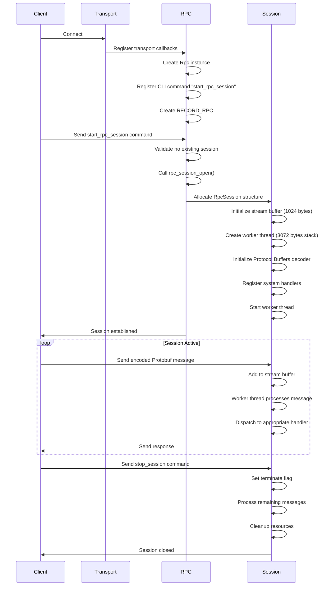

**Diagram sources**
- [rpc.c](file://applications/services/rpc/rpc.c#L0-L509)
- [rpc.h](file://applications/services/rpc/rpc.h#L0-L148)

**Section sources**
- [rpc.c](file://applications/services/rpc/rpc.c#L0-L509)

## Use Cases

The RPC interface enables several important use cases for the Flipper Zero, including automated testing, integration with external tools, and remote debugging. These use cases leverage the comprehensive command set to control the device programmatically.

### Automated Testing

The RPC interface is ideal for automated testing of Flipper Zero applications and system functionality. Test scripts can start applications, simulate user input, verify screen output, and validate application behavior without manual intervention.

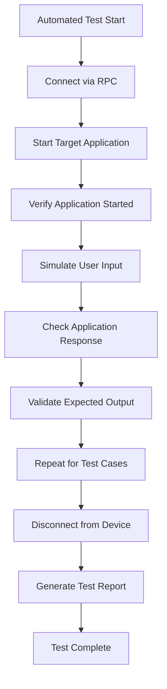

**Diagram sources**
- [rpc_app.c](file://applications/services/rpc/rpc_app.c#L0-L195)
- [rpc_gui.c](file://applications/services/rpc/rpc_gui.c#L0-L148)

### Integration with External Tools

The RPC interface allows seamless integration with desktop applications, mobile apps, and web services. This enables features like file synchronization, remote control, and data analysis.

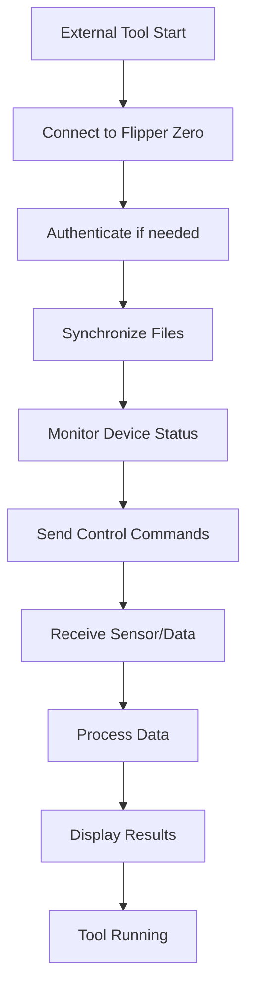

**Diagram sources**
- [rpc_storage.c](file://applications/services/rpc/rpc_storage.c#L0-L287)
- [rpc_system.c](file://applications/services/rpc/rpc_system.c#L0-L344)

### Remote Debugging

The RPC interface provides powerful remote debugging capabilities, allowing developers to inspect device state, control execution, and analyze application behavior from a remote workstation.

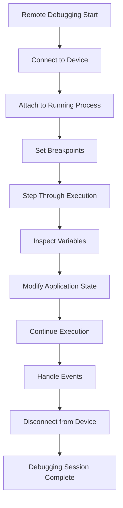

**Diagram sources**
- [rpc_debug_app.c](file://applications/debug/rpc_debug_app/rpc_debug_app.c#L0-L234)
- [rpc.c](file://applications/services/rpc/rpc.c#L0-L509)

## Available RPC Commands

The RPC system provides a comprehensive set of commands across multiple service domains. Each command is identified by a unique tag in the Protocol Buffers definition and follows the request-response pattern.

### System Commands

| Command | Request Message | Response Message | Description |
|--------|----------------|------------------|-------------|
| Ping | PB_System.PingRequest | PB_System.PingResponse | Echo test to verify connection |
| Reboot | PB_System.RebootRequest | Empty | Reboot the device in specified mode |
| DeviceInfo | PB_System.DeviceInfoRequest | PB_System.DeviceInfoResponse | Get device information |
| FactoryReset | PB_System.FactoryResetRequest | Empty | Perform factory reset |
| GetDateTime | PB_System.GetDateTimeRequest | PB_System.GetDateTimeResponse | Get current date and time |
| SetDateTime | PB_System.SetDateTimeRequest | Empty | Set date and time |
| PlayAudiovisualAlert | PB_System.PlayAudiovisualAlertRequest | Empty | Play audiovisual alert |
| ProtobufVersion | PB_System.ProtobufVersionRequest | PB_System.ProtobufVersionResponse | Get protobuf version |
| Update | PB_System.UpdateRequest | PB_System.UpdateResponse | Prepare system update |
| PowerInfo | PB_System.PowerInfoRequest | PB_System.PowerInfoResponse | Get power information |

### Storage Commands

| Command | Request Message | Response Message | Description |
|--------|----------------|------------------|-------------|
| Info | PB_Storage.InfoRequest | PB_Storage.InfoResponse | Get storage information |
| Timestamp | PB_Storage.TimestampRequest | PB_Storage.TimestampResponse | Get file timestamp |
| Stat | PB_Storage.StatRequest | PB_Storage.StatResponse | Get file/directory information |
| List | PB_Storage.ListRequest | PB_Storage.ListResponse | List directory contents |
| Read | PB_Storage.ReadRequest | PB_Storage.ReadResponse | Read file |
| Write | PB_Storage.WriteRequest | Empty | Write file |
| Delete | PB_Storage.DeleteRequest | Empty | Delete file/directory |
| Mkdir | PB_Storage.MkdirRequest | Empty | Create directory |
| Md5sum | PB_Storage.Md5sumRequest | PB_Storage.Md5sumResponse | Calculate MD5 sum |
| Rename | PB_Storage.RenameRequest | Empty | Rename file/directory |
| BackupCreate | PB_Storage.BackupCreateRequest | Empty | Create backup archive |
| BackupRestore | PB_Storage.BackupRestoreRequest | Empty | Restore from backup |
| TarExtract | PB_Storage.TarExtractRequest | Empty | Extract tar archive |

### Application Commands

| Command | Request Message | Response Message | Description |
|--------|----------------|------------------|-------------|
| Start | PB_App.StartRequest | Empty | Start application |
| LockStatus | PB_App.LockStatusRequest | PB_App.LockStatusResponse | Get application lock status |
| AppExit | PB_App.AppExitRequest | Empty | Exit current application |
| AppLoadFile | PB_App.AppLoadFileRequest | Empty | Load file in application |
| AppButtonPress | PB_App.AppButtonPressRequest | Empty | Simulate button press |
| AppButtonRelease | PB_App.AppButtonReleaseRequest | Empty | Simulate button release |
| AppButtonPressRelease | PB_App.AppButtonPressReleaseRequest | Empty | Simulate button press and release |
| GetError | PB_App.GetErrorRequest | PB_App.GetErrorResponse | Get application error |
| DataExchange | PB_App.DataExchangeRequest | Empty | Exchange data with application |
| AppState | PB_App.AppStateResponse | Empty | Get application state |

### GUI Commands

| Command | Request Message | Response Message | Description |
|--------|----------------|------------------|-------------|
| StartScreenStream | PB_Gui.StartScreenStreamRequest | Empty | Start screen streaming |
| StopScreenStream | PB_Gui.StopScreenStreamRequest | Empty | Stop screen streaming |
| SendInputEvent | PB_Gui.SendInputEventRequest | Empty | Send input event |
| StartVirtualDisplay | PB_Gui.StartVirtualDisplayRequest | Empty | Start virtual display |
| StopVirtualDisplay | PB_Gui.StopVirtualDisplayRequest | Empty | Stop virtual display |

### GPIO Commands

| Command | Request Message | Response Message | Description |
|--------|----------------|------------------|-------------|
| SetPinMode | PB_Gpio.SetPinMode | Empty | Set GPIO pin mode |
| SetInputPull | PB_Gpio.SetInputPull | Empty | Set GPIO input pull |
| GetPinMode | PB_Gpio.GetPinMode | PB_Gpio.GetPinModeResponse | Get GPIO pin mode |
| ReadPin | PB_Gpio.ReadPin | PB_Gpio.ReadPinResponse | Read GPIO pin |
| WritePin | PB_Gpio.WritePin | Empty | Write GPIO pin |
| GetOtgMode | PB_Gpio.GetOtgMode | PB_Gpio.GetOtgModeResponse | Get OTG mode |
| SetOtgMode | PB_Gpio.SetOtgMode | Empty | Set OTG mode |

### Property Commands

| Command | Request Message | Response Message | Description |
|--------|----------------|------------------|-------------|
| Get | PB_Property.GetRequest | PB_Property.GetResponse | Get property by key |

### Desktop Commands

| Command | Request Message | Response Message | Description |
|--------|----------------|------------------|-------------|
| IsLocked | PB_Desktop.IsLockedRequest | Empty | Check if desktop is locked |
| Unlock | PB_Desktop.UnlockRequest | Empty | Unlock desktop |
| StatusSubscribe | PB_Desktop.StatusSubscribeRequest | Empty | Subscribe to desktop status |
| StatusUnsubscribe | PB_Desktop.StatusUnsubscribeRequest | Empty | Unsubscribe from desktop status |
| Status | Empty | PB_Desktop.Status | Desktop status update |

**Section sources**
- [flipper.proto](file://assets/protobuf/flipper.proto#L0-L152)
- [system.proto](file://assets/protobuf/system.proto#L0-L96)
- [storage.proto](file://assets/protobuf/storage.proto#L0-L100)
- [application.proto](file://assets/protobuf/application.proto#L0-L59)
- [gui.proto](file://assets/protobuf/gui.proto#L0-L52)
- [gpio.proto](file://assets/protobuf/gpio.proto#L0-L74)
- [property.proto](file://assets/protobuf/property.proto#L0-L14)
- [desktop.proto](file://assets/protobuf/desktop.proto#L0-L21)