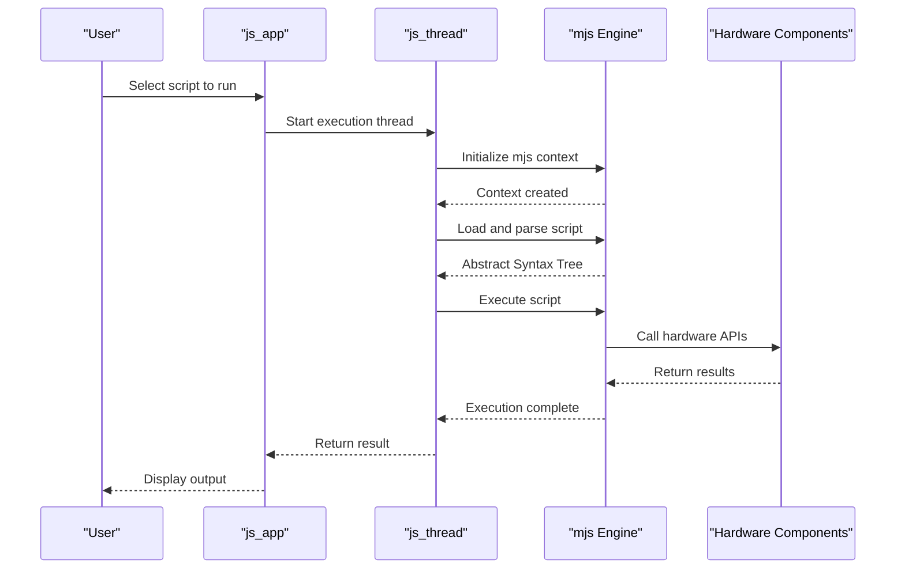
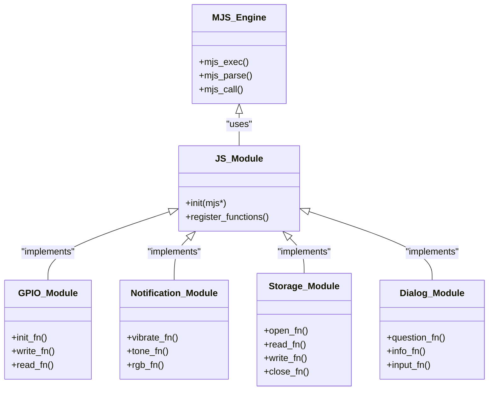

# Scripting Capabilities

<cite>
**Referenced Files in This Document**   
- [js_app.c](file://applications/system/js_app/js_app.c)
- [js_thread.c](file://applications/system/js_app/js_thread.c)
- [js_modules.c](file://applications/system/js_app/js_modules.c)
- [js_flipper.c](file://applications/system/js_app/modules/js_flipper.c)
- [js_gpio.c](file://applications/system/js_app/modules/js_gpio.c)
- [js_notification.c](file://applications/system/js_app/modules/js_notification.c)
- [js_storage.c](file://applications/system/js_app/modules/js_storage.c)
- [js_dialog.c](file://applications/system/js_app/modules/js_dialog.c)
- [js_subghz.c](file://applications/system/js_app/modules/js_subghz/js_subghz.c)
- [mjs_core.c](file://lib/mjs/mjs_core.c)
- [mjs_exec.c](file://lib/mjs/mjs_exec.c)
- [platform_flipper.c](file://lib/mjs/common/platforms/platform_flipper.c)
- [BadUSB_Win_RogueMasterHome.js](file://applications/system/js_app/examples/apps/Scripts/BadUSB_Win_RogueMasterHome.js)
- [gpio.js](file://applications/system/js_app/examples/apps/Scripts/gpio.js)
- [notify.js](file://applications/system/js_app/examples/apps/Scripts/notify.js)
- [storage.js](file://applications/system/js_app/examples/apps/Scripts/storage.js)
- [subghz.js](file://applications/system/js_app/examples/apps/Scripts/subghz.js)
- [js_builtin.md](file://documentation/js/js_builtin.md)
- [js_notification.md](file://documentation/js/js_notification.md)
- [js_dialog.md](file://documentation/js/js_dialog.md)
</cite>

## Table of Contents
1. [Introduction](#introduction)
2. [JavaScript Engine Integration](#javascript-engine-integration)
3. [Available JavaScript APIs](#available-javascript-apis)
4. [Module System and API Exposure](#module-system-and-api-exposure)
5. [Performance and Memory Constraints](#performance-and-memory-constraints)
6. [Development Workflow](#development-workflow)
7. [Conclusion](#conclusion)

## Introduction

The Flipper Zero device supports user scripting through a JavaScript engine integration, enabling users to automate tasks and interact with hardware components using JavaScript. This scripting capability is built around the mjs JavaScript engine, a lightweight interpreter designed for embedded systems. The implementation allows users to write scripts that can control infrared, GPIO pins, notifications, dialogs, storage, and other hardware features directly from JavaScript code.

The JavaScript environment on Flipper Zero is designed to be accessible to users with varying levels of programming experience, providing a high-level interface to the device's capabilities while maintaining the performance constraints of an embedded system. Scripts can be created, tested, and deployed directly on the device, making it easy to develop custom automation workflows.

**Section sources**
- [js_app.c](file://applications/system/js_app/js_app.c#L1-L50)
- [documentation/js/js_builtin.md](file://documentation/js/js_builtin.md#L1-L20)

## JavaScript Engine Integration

The mjs JavaScript engine is integrated into the Flipper Zero firmware as a system application, providing a runtime environment for executing user scripts. The integration is handled through the js_app module located in `applications/system/js_app/`, which serves as the entry point for the JavaScript environment.

The engine initialization process begins in `js_start.c`, where the mjs context is created and configured for the embedded environment. The core integration is implemented in `js_thread.c`, which manages the JavaScript execution thread and handles script loading and execution. The mjs engine itself is located in `lib/mjs/` and provides the core JavaScript parsing and execution capabilities.



**Diagram sources**
- [js_app.c](file://applications/system/js_app/js_app.c#L50-L100)
- [js_thread.c](file://applications/system/js_app/js_thread.c#L20-L80)
- [mjs_core.c](file://lib/mjs/mjs_core.c#L100-L150)

The mjs engine has been specifically adapted for the Flipper Zero platform through the `platform_flipper.c` file in the mjs common platforms directory. This adaptation handles platform-specific functionality such as file system access, time functions, and memory management that are required by the JavaScript engine but depend on the underlying operating system.

When a script is executed, the system creates a dedicated thread for JavaScript execution, ensuring that long-running scripts do not block the main UI thread. The execution context is isolated, providing each script with its own variable scope and preventing interference between different scripts.

**Section sources**
- [js_thread.c](file://applications/system/js_app/js_thread.c#L1-L100)
- [mjs_core.c](file://lib/mjs/mjs_core.c#L1-L50)
- [platform_flipper.c](file://lib/mjs/common/platforms/platform_flipper.c#L1-L30)

## Available JavaScript APIs

The Flipper Zero JavaScript environment exposes a comprehensive set of APIs that allow scripts to interact with various hardware components and system services. These APIs are implemented as native modules that bridge the JavaScript environment with the underlying C firmware.

### GPIO API

The GPIO (General Purpose Input/Output) API allows scripts to control the device's GPIO pins for interfacing with external electronics. The implementation is located in `js_gpio.c` and provides functions for setting pin modes, reading pin states, and writing values to pins.

```javascript
// Example: Blinking an external LED connected to GPIO pin
function blinkLED(pin, duration, count) {
    Furi.gpio_init(pin, Furi.GPIO_OUTPUT);
    for (let i = 0; i < count; i++) {
        Furi.gpio_write(pin, true);
        Furi.delay(duration);
        Furi.gpio_write(pin, false);
        Furi.delay(duration);
    }
    Furi.gpio_deinit(pin);
}

// Usage: Blink LED on pin 7 for 100ms, 5 times
blinkLED(7, 100, 5);
```

**Section sources**
- [js_gpio.c](file://applications/system/js_app/modules/js_gpio.c#L1-L50)
- [gpio.js](file://applications/system/js_app/examples/apps/Scripts/gpio.js#L1-L20)

### Notification API

The notification API enables scripts to control the device's notification system, including the vibration motor, LED, and speaker. Implemented in `js_notification.c`, this API provides functions for creating various notification patterns and alerts.

```javascript
// Example: Creating a custom notification pattern
function alertUser() {
    // Vibrate for 200ms
    Notification.vibrate(200);
    
    // Play a tone on the speaker
    Notification.tone(800, 150);
    
    // Flash the LED red
    Notification.rgb(255, 0, 0);
    Furi.delay(100);
    Notification.rgb(0, 0, 0);
}

alertUser();
```

**Section sources**
- [js_notification.c](file://applications/system/js_app/modules/js_notification.c#L1-L40)
- [notify.js](file://applications/system/js_app/examples/apps/Scripts/notify.js#L1-L15)
- [js_notification.md](file://documentation/js/js_notification.md#L1-L25)

### Dialog API

The dialog API allows scripts to create interactive user interfaces with various dialog types, including message boxes, input dialogs, and selection dialogs. The implementation in `js_dialog.c` provides a simple interface for creating these UI elements.

```javascript
// Example: Creating an interactive dialog
function getUserConfirmation() {
    let result = Dialog.question("Continue?", "Are you sure you want to proceed?");
    if (result) {
        Dialog.info("Confirmed", "Operation will continue");
        return true;
    } else {
        Dialog.info("Cancelled", "Operation aborted");
        return false;
    }
}

if (getUserConfirmation()) {
    // Perform the operation
    Furi.delay(1000);
    Dialog.info("Complete", "Operation finished successfully");
}
```

**Section sources**
- [js_dialog.c](file://applications/system/js_app/modules/js_dialog.c#L1-L35)
- [dialog.js](file://applications/system/js_app/examples/apps/Scripts/dialog.js#L1-L20)
- [js_dialog.md](file://documentation/js/js_dialog.md#L1-L20)

### Storage API

The storage API provides access to the device's file system, allowing scripts to read from and write to files. Implemented in `js_storage.c`, this API supports basic file operations such as creating, reading, writing, and deleting files.

```javascript
// Example: Logging sensor data to a file
function logSensorData(filename, data) {
    let file = Storage.open(filename, "a");
    if (file) {
        let timestamp = Furi.time();
        let logEntry = `${timestamp}: ${data}\n`;
        Storage.write(file, logEntry);
        Storage.close(file);
        return true;
    }
    return false;
}

// Usage: Log temperature readings
logSensorData("/ext/sensor_log.txt", "Temperature: 23.5°C");
```

**Section sources**
- [js_storage.c](file://applications/system/js_app/modules/js_storage.c#L1-L45)
- [storage.js](file://applications/system/js_app/examples/apps/Scripts/storage.js#L1-L25)

### SubGHz API

The SubGHz API enables scripts to transmit and receive Sub-GHz radio signals, useful for working with various wireless protocols. The implementation in `js_subghz.c` provides functions for sending and receiving RF signals.

```javascript
// Example: Sending a Sub-GHz signal
function sendGarageDoorSignal() {
    // Configure the Sub-GHz transmitter
    SubGHz.set_frequency(433920000); // 433.92 MHz
    SubGHz.set_modulation(SubGHz.MODULATION_ASK_OOK);
    
    // Send the signal sequence
    let signal = [1000, 300, 1000, 300, 1000, 300];
    SubGHz.send(signal, 500); // Send with 500µs pulse width
    
    // Clean up
    SubGHz.stop();
}
```

**Section sources**
- [js_subghz.c](file://applications/system/js_app/modules/js_subghz/js_subghz.c#L1-L40)
- [subghz.js](file://applications/system/js_app/examples/apps/Scripts/subghz.js#L1-L20)

## Module System and API Exposure

The JavaScript module system on Flipper Zero is implemented through the `js_modules.c` file, which registers native modules with the mjs engine. Each hardware component or system service is exposed as a separate module that can be accessed from JavaScript code.

The module registration process follows a consistent pattern where C functions are wrapped and exposed to JavaScript with appropriate type conversion. The `js_modules.c` file contains the registration code for all available modules:

```c
// Example module registration from js_modules.c
void js_modules_init(mjs* mjs) {
    js_flipper_init(mjs);
    js_gpio_init(mjs);
    js_notification_init(mjs);
    js_storage_init(mjs);
    js_dialog_init(mjs);
    js_submenu_init(mjs);
    js_textbox_init(mjs);
    js_widget_init(mjs);
    js_serial_init(mjs);
    js_math_init(mjs);
    js_i2c_init(mjs);
    js_keyboard_init(mjs);
    js_badusb_init(mjs);
    js_blebeacon_init(mjs);
    js_usbdisk_init(mjs);
    js_vgm_init(mjs);
}
```

Each module follows a similar implementation pattern with an init function that registers the module's functions with the mjs engine:

```c
// Example from js_gpio.c
void js_gpio_init(mjs* mjs) {
    mjs_val_t gpio_obj = mjs_mk_object(mjs);
    
    mjs_set(mjs, gpio_obj, "init", ~0, MJS_MK_FN(js_gpio_init_fn));
    mjs_set(mjs, gpio_obj, "deinit", ~0, MJS_MK_FN(js_gpio_deinit_fn));
    mjs_set(mjs, gpio_obj, "write", ~0, MJS_MK_FN(js_gpio_write_fn));
    mjs_set(mjs, gpio_obj, "read", ~0, MJS_MK_FN(js_gpio_read_fn));
    mjs_set(mjs, mjs->root_obj, "GPIO", ~0, gpio_obj);
}
```

Additional functionality can be exposed to scripts by creating new module files in the `applications/system/js_app/modules/` directory and registering them in `js_modules.c`. The process involves:

1. Creating a new C file for the module (e.g., `js_newfeature.c`)
2. Implementing the native functions that interface with the hardware or system service
3. Creating wrapper functions that handle JavaScript to C type conversion
4. Writing an init function that registers the module's functions with the mjs engine
5. Adding the module to the `js_modules_init` function in `js_modules.c`



**Diagram sources**
- [js_modules.c](file://applications/system/js_app/js_modules.c#L10-L30)
- [js_gpio.c](file://applications/system/js_app/modules/js_gpio.c#L50-L70)
- [js_notification.c](file://applications/system/js_app/modules/js_notification.c#L40-L60)

**Section sources**
- [js_modules.c](file://applications/system/js_app/js_modules.c#L1-L50)
- [js_gpio.c](file://applications/system/js_app/modules/js_gpio.c#L1-L100)
- [js_notification.c](file://applications/system/js_app/modules/js_notification.c#L1-L100)

## Performance and Memory Constraints

Running JavaScript on an embedded device like the Flipper Zero presents significant performance and memory constraints that must be considered when developing scripts. The device has limited RAM and processing power compared to general-purpose computers, requiring careful optimization of scripts.

### Memory Limitations

The mjs engine operates within the memory constraints of the Flipper Zero's embedded system. The JavaScript heap is limited, and scripts must be mindful of memory usage to avoid crashes or system instability. Large data structures, excessive string operations, and memory leaks can quickly exhaust available memory.

Best practices for memory management include:
- Releasing resources explicitly when no longer needed
- Avoiding global variables when possible
- Using local variables within functions
- Being cautious with string concatenation in loops
- Cleaning up event listeners and timers

### Performance Considerations

JavaScript execution on the Flipper Zero is significantly slower than native C code due to the interpretation overhead. Complex algorithms or intensive computations should be avoided in scripts when possible. The following performance guidelines should be followed:

- Minimize the use of loops with high iteration counts
- Avoid deep recursion which can quickly exhaust the call stack
- Use built-in functions when available as they are typically faster
- Cache repeated calculations rather than recalculating
- Break long-running operations into smaller chunks with delays

### Security Constraints

The JavaScript environment on Flipper Zero includes security constraints to prevent scripts from compromising system stability or accessing unauthorized resources. Scripts run in a sandboxed environment with restricted access to system functions.

Security limitations include:
- File system access restricted to specific directories
- No direct access to low-level hardware registers
- Limited network capabilities
- Restricted system calls
- Time limits on script execution

These constraints ensure that user scripts cannot damage the device or interfere with critical system operations.

**Section sources**
- [mjs_core.c](file://lib/mjs/mjs_core.c#L50-L100)
- [mjs_gc.c](file://lib/mjs/mjs_gc.c#L1-L30)
- [js_thread.c](file://applications/system/js_app/js_thread.c#L100-L150)

## Development Workflow

The development workflow for creating, testing, and deploying JavaScript scripts on the Flipper Zero is designed to be straightforward and accessible. The process involves writing scripts on a computer, transferring them to the device, and executing them through the JavaScript application.

### Script Creation

Scripts can be created using any text editor and should be saved with a `.js` extension. The Flipper Zero JavaScript environment supports a subset of JavaScript features, primarily focusing on ES5 syntax with some ES6 features. Developers should consult the documentation to understand which language features are supported.

Example development environment setup:
1. Install a code editor (VS Code, Sublime Text, etc.)
2. Set up syntax highlighting for JavaScript
3. Use the example scripts in `applications/system/js_app/examples/apps/Scripts/` as templates

### Script Deployment

Scripts are deployed to the Flipper Zero by copying them to the device's SD card in the appropriate directory. The standard location for user scripts is `/ext/apps/Scripts/` on the SD card. Once copied, the scripts can be accessed through the JavaScript application on the device.

Deployment methods include:
- Direct SD card transfer: Remove the SD card, copy files, and reinsert
- USB file transfer: Connect the device to a computer via USB
- Wireless transfer: If supported by the firmware version

### Script Execution

Scripts are executed through the JavaScript application in the Flipper Zero's system menu. The application provides a file browser interface to select and run scripts from the SD card. When a script is selected, it is loaded into the mjs engine and executed in a separate thread.

The execution process includes:
1. Script file is read from storage
2. Code is parsed by the mjs engine
3. Syntax errors are reported to the user
4. Valid scripts are executed in the JavaScript thread
5. Output and errors are displayed in the console

### Debugging and Testing

The JavaScript environment includes basic debugging capabilities to help developers test and troubleshoot their scripts. The console API allows for logging messages that can be viewed during script execution.

Debugging techniques include:
- Using `console.log()` to output variable values and execution flow
- Breaking complex scripts into smaller functions for easier testing
- Testing scripts incrementally, adding functionality step by step
- Using the interactive JavaScript console for immediate feedback

Example debugging script:
```javascript
function debugScript() {
    console.log("Script started");
    console.log("Free memory: " + Furi.free_memory());
    
    try {
        // Test code here
        let result = performOperation();
        console.log("Operation result: " + result);
    } catch (error) {
        console.log("Error: " + error);
    }
    
    console.log("Script finished");
}

debugScript();
```

**Section sources**
- [js_app.c](file://applications/system/js_app/js_app.c#L100-L150)
- [console.js](file://applications/system/js_app/examples/apps/Scripts/console.js#L1-L20)
- [BadUSB_Win_RogueMasterHome.js](file://applications/system/js_app/examples/apps/Scripts/BadUSB_Win_RogueMasterHome.js#L1-L30)

## Conclusion

The JavaScript scripting capabilities on the Flipper Zero provide a powerful and accessible way for users to automate tasks and interact with hardware components. The integration of the mjs JavaScript engine enables users to write scripts that control GPIO pins, create notifications, display dialogs, access storage, and work with various wireless protocols.

The module system allows for the exposure of hardware functionality through well-defined APIs, making it relatively straightforward to extend the scripting environment with additional capabilities. While the embedded nature of the device imposes performance and memory constraints, careful script design can work within these limitations to create useful automation workflows.

The development workflow is designed to be user-friendly, allowing scripts to be created on a computer and deployed to the device via the SD card. With comprehensive documentation and example scripts provided in the firmware repository, users can quickly get started with JavaScript scripting on the Flipper Zero.

As the platform continues to evolve, the scripting capabilities are likely to expand with additional APIs and improved performance, making the Flipper Zero an increasingly powerful tool for hardware experimentation and automation.

**Section sources**
- [js_app.c](file://applications/system/js_app/js_app.c#L1-L200)
- [documentation/js/js_builtin.md](file://documentation/js/js_builtin.md#L1-L50)
- [applications/system/js_app/examples/apps/Scripts/](file://applications/system/js_app/examples/apps/Scripts/#L1-L10)