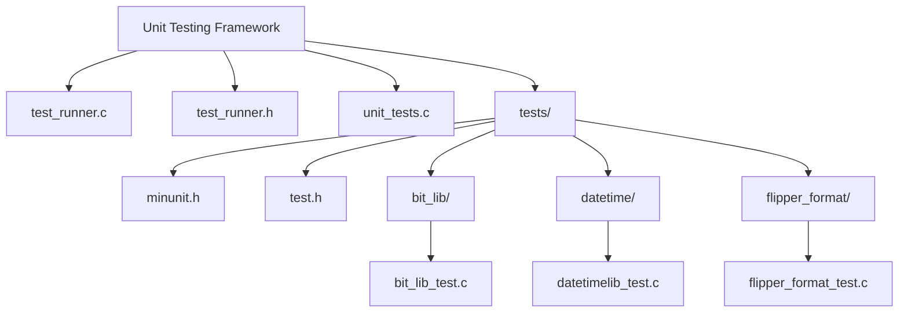
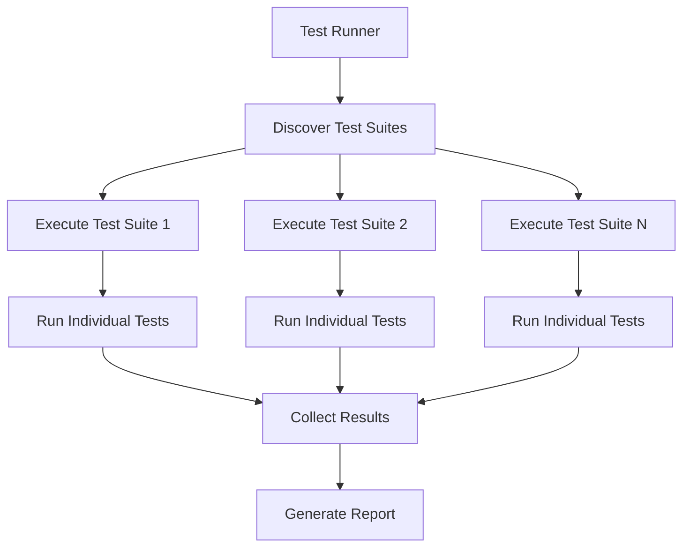
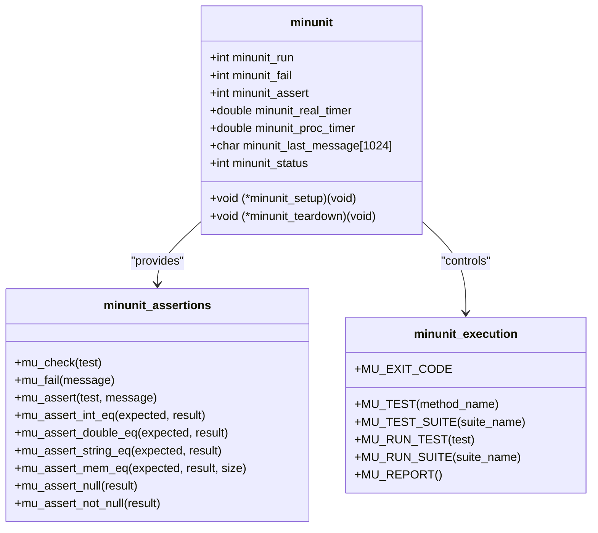
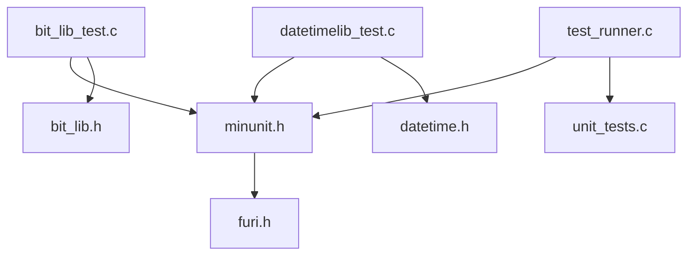

# Unit Testing Framework

<cite>
**Referenced Files in This Document**   
- [minunit.h](file://applications/debug/unit_tests/tests/minunit.h)
- [bit_lib_test.c](file://applications/debug/unit_tests/tests/bit_lib/bit_lib_test.c)
- [bit_lib.c](file://lib/bit_lib/bit_lib.c)
- [datetimelib_test.c](file://applications/debug/unit_tests/tests/datetime/datetimelib_test.c)
- [datetime.c](file://lib/datetime/datetime.c)
- [test_runner.c](file://applications/debug/unit_tests/test_runner.c)
- [test_runner.h](file://applications/debug/unit_tests/test_runner.h)
- [unit_tests.c](file://applications/debug/unit_tests/unit_tests.c)
- [test.h](file://applications/debug/unit_tests/tests/test.h)
</cite>

## Table of Contents
1. [Introduction](#introduction)
2. [Project Structure](#project-structure)
3. [Core Components](#core-components)
4. [Architecture Overview](#architecture-overview)
5. [Detailed Component Analysis](#detailed-component-analysis)
6. [Dependency Analysis](#dependency-analysis)
7. [Performance Considerations](#performance-considerations)
8. [Troubleshooting Guide](#troubleshooting-guide)
9. [Conclusion](#conclusion)

## Introduction
The Flipper Zero firmware employs a comprehensive unit testing framework based on the minunit testing library to ensure the reliability and correctness of its various components. This document provides a detailed analysis of the unit testing infrastructure, covering the test runner implementation, test organization, execution flow, and specific test cases for key components such as bit_lib, datetime, and flipper_format. The framework enables developers to validate functionality at the unit level, ensuring that individual components behave as expected before integration into the larger system.

## Project Structure
The unit testing framework is organized within the `applications/debug/unit_tests` directory, which contains the core test runner, test utilities, and individual test suites for various components. The tests are structured in a hierarchical manner, with each component having its own dedicated test directory containing specific test cases.

**Diagram sources**
- [test_runner.c](file://applications/debug/unit_tests/test_runner.c)
- [test_runner.h](file://applications/debug/unit_tests/test_runner.h)
- [unit_tests.c](file://applications/debug/unit_tests/unit_tests.c)
- [minunit.h](file://applications/debug/unit_tests/tests/minunit.h)

**Section sources**
- [test_runner.c](file://applications/debug/unit_tests/test_runner.c)
- [test_runner.h](file://applications/debug/unit_tests/test_runner.h)
- [unit_tests.c](file://applications/debug/unit_tests/unit_tests.c)

## Core Components
The unit testing framework consists of several core components that work together to provide a comprehensive testing infrastructure. The minunit library serves as the foundation, providing assertion macros and test execution primitives. The test runner orchestrates the execution of test suites, while individual test files implement specific test cases for various components.

**Section sources**
- [minunit.h](file://applications/debug/unit_tests/tests/minunit.h)
- [test_runner.c](file://applications/debug/unit_tests/test_runner.c)
- [test_runner.h](file://applications/debug/unit_tests/test_runner.h)

## Architecture Overview
The unit testing framework follows a modular architecture where each component has its own test suite that can be executed independently. The framework uses a test runner to discover and execute test suites, collecting results and reporting on test success or failure. The architecture is designed to be extensible, allowing new test suites to be added easily.

**Diagram sources**
- [test_runner.c](file://applications/debug/unit_tests/test_runner.c)
- [unit_tests.c](file://applications/debug/unit_tests/unit_tests.c)

## Detailed Component Analysis

### minunit Framework Analysis
The minunit framework provides a lightweight testing infrastructure with a comprehensive set of assertion macros. The framework is implemented in the minunit.h header file and provides both basic and specialized assertions for different data types.

#### minunit Framework Structure

**Diagram sources**
- [minunit.h](file://applications/debug/unit_tests/tests/minunit.h)

**Section sources**
- [minunit.h](file://applications/debug/unit_tests/tests/minunit.h)

### bit_lib Test Analysis
The bit_lib component provides bit manipulation utilities, and its test suite demonstrates comprehensive testing of bit operations including bit setting, getting, and manipulation.

#### bit_lib Test Cases

```mermaid
flowchart TD
A[test_bit_lib] --> B[test_bit_lib_increment_index]
A --> C[test_bit_lib_is_set]
A --> D[test_bit_lib_push]
A --> E[test_bit_lib_set_bit]
A --> F[test_bit_lib_set_bits]
A --> G[test_bit_lib_get_bit]
A --> H[test_bit_lib_get_bits]
A --> I[test_bit_lib_get_bits_16]
A --> J[test_bit_lib_get_bits_32]
A --> K[test_bit_lib_get_bits_64]
A --> L[test_bit_lib_test_parity_u32]
A --> M[test_bit_lib_test_parity]
A --> N[test_bit_lib_remove_bit_every_nth]
A --> O[test_bit_lib_reverse_bits]
A --> P[test_bit_lib_copy_bits]
A --> Q[test_bit_lib_get_bit_count]
A --> R[test_bit_lib_reverse_16_fast]
A --> S[test_bit_lib_crc16]
A --> T[test_bit_lib_num_to_bytes_be]
A --> U[test_bit_lib_num_to_bytes_le]
A --> V[test_bit_lib_bytes_to_num_be]
A --> W[test_bit_lib_bytes_to_num_le]
A --> X[test_bit_lib_bytes_to_num_bcd]
```

**Diagram sources**
- [bit_lib_test.c](file://applications/debug/unit_tests/tests/bit_lib/bit_lib_test.c)

**Section sources**
- [bit_lib_test.c](file://applications/debug/unit_tests/tests/bit_lib/bit_lib_test.c)
- [bit_lib.c](file://lib/bit_lib/bit_lib.c)

### datetime Test Analysis
The datetime component provides date and time utilities, and its test suite focuses on validation of date/time values and conversion between timestamp and datetime structures.

#### datetime Test Cases

**Diagram sources**
- [datetimelib_test.c](file://applications/debug/unit_tests/tests/datetime/datetimelib_test.c)

**Section sources**
- [datetimelib_test.c](file://applications/debug/unit_tests/tests/datetime/datetimelib_test.c)
- [datetime.c](file://lib/datetime/datetime.c)

## Dependency Analysis
The unit testing framework has dependencies on various components of the Flipper Zero firmware, including the FURI core library and specific component libraries being tested.

**Diagram sources**
- [minunit.h](file://applications/debug/unit_tests/tests/minunit.h)
- [bit_lib_test.c](file://applications/debug/unit_tests/tests/bit_lib/bit_lib_test.c)
- [datetimelib_test.c](file://applications/debug/unit_tests/tests/datetime/datetimelib_test.c)
- [test_runner.c](file://applications/debug/unit_tests/test_runner.c)
- [unit_tests.c](file://applications/debug/unit_tests/unit_tests.c)

**Section sources**
- [minunit.h](file://applications/debug/unit_tests/tests/minunit.h)
- [bit_lib_test.c](file://applications/debug/unit_tests/tests/bit_lib/bit_lib_test.c)
- [datetimelib_test.c](file://applications/debug/unit_tests/tests/datetime/datetimelib_test.c)
- [test_runner.c](file://applications/debug/unit_tests/test_runner.c)

## Performance Considerations
The unit testing framework is designed to be lightweight and efficient, with minimal overhead for test execution. The minunit library uses simple macros and inline functions to minimize performance impact, making it suitable for embedded systems with limited resources.

## Troubleshooting Guide
When troubleshooting unit tests in the Flipper Zero firmware, consider the following common issues:

1. **Test failures due to incorrect assertions**: Verify that the expected values in assertions match the actual implementation behavior.
2. **Setup/teardown issues**: Ensure that any setup or teardown functions are properly configured and do not interfere with test execution.
3. **Memory corruption**: Use memory safety checks and ensure that test data is properly initialized and cleaned up.
4. **Timing issues**: For tests involving time-based operations, ensure that the test environment provides consistent timing.

**Section sources**
- [minunit.h](file://applications/debug/unit_tests/tests/minunit.h)
- [test_runner.c](file://applications/debug/unit_tests/test_runner.c)

## Conclusion
The unit testing framework in the Flipper Zero firmware provides a robust infrastructure for validating component functionality. By leveraging the minunit library and organizing tests in a modular structure, the framework enables comprehensive testing of individual components while maintaining simplicity and efficiency. The framework supports a wide range of assertion types and test patterns, making it suitable for testing various aspects of the firmware from bit manipulation to date/time operations.