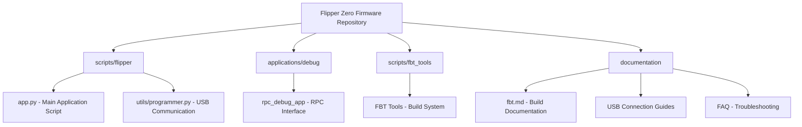
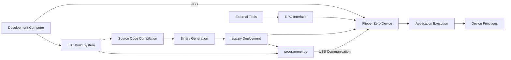
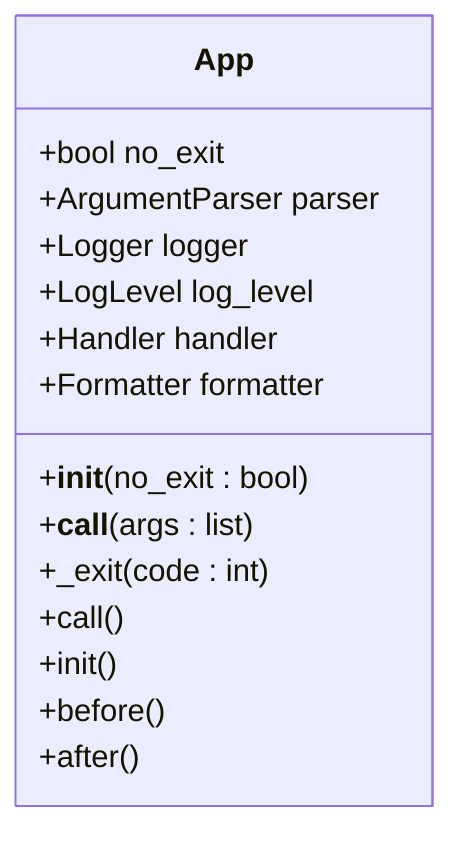
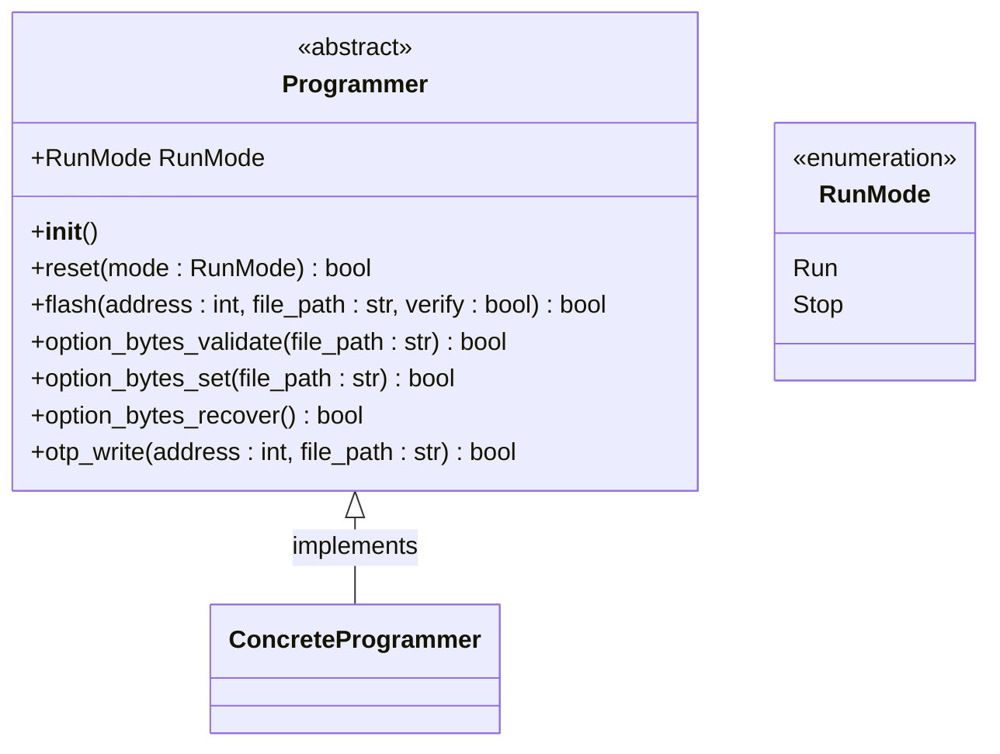
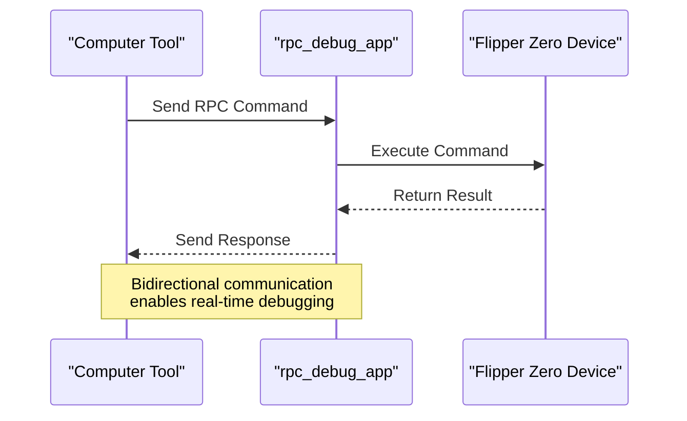
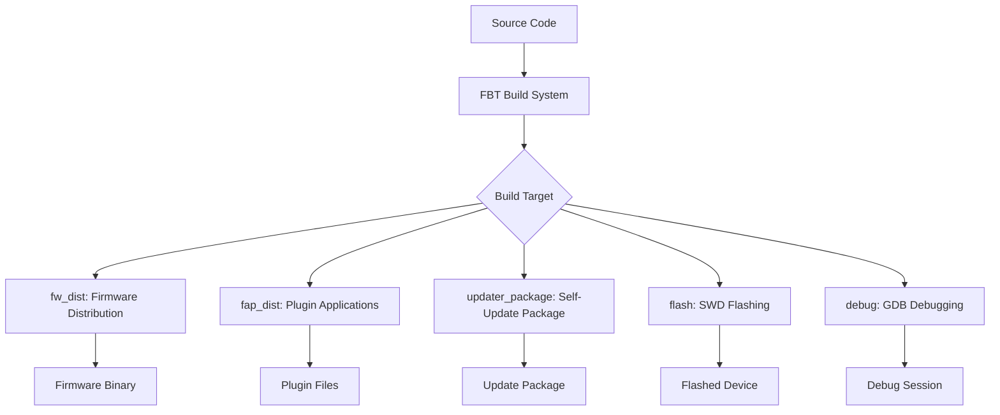
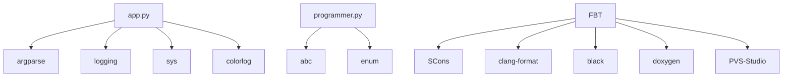

# Computer Integration

<cite>
**Referenced Files in This Document**   
- [app.py](file://scripts/flipper/app.py#L1-L66)
- [programmer.py](file://scripts/flipper/utils/programmer.py#L1-L35)
- [fbt.md](file://documentation/fbt.md#L1-L131)
- [USB connection to the Devboard.md](file://documentation/devboard/USB connection to the Devboard.md#L1-L21)
- [FAQ.md](file://documentation/FAQ.md#L1-L199)
- [HowToInstall.md](file://documentation/HowToInstall.md#L1-L127)
- [rpc_debug_app.c](file://applications/debug/rpc_debug_app/rpc_debug_app.c#L1-L200)
</cite>

## Table of Contents
1. [Introduction](#introduction)
2. [Project Structure](#project-structure)
3. [Core Components](#core-components)
4. [Architecture Overview](#architecture-overview)
5. [Detailed Component Analysis](#detailed-component-analysis)
6. [Dependency Analysis](#dependency-analysis)
7. [Performance Considerations](#performance-considerations)
8. [Troubleshooting Guide](#troubleshooting-guide)
9. [Conclusion](#conclusion)

## Introduction
This document provides a comprehensive overview of computer integration with the Flipper Zero device, focusing on how external tools and scripts interact during plugin development and deployment. The analysis covers the RPC (Remote Procedure Call) interface, application installation processes, debugging capabilities, firmware updates, and build system integration. Special attention is given to USB communication protocols, device detection mechanisms, and solutions for common connectivity issues. The content is designed to be accessible to beginners while providing sufficient technical depth for experienced developers working with the Flipper Zero ecosystem.

## Project Structure
The Flipper Zero firmware repository follows a well-organized structure that separates applications, libraries, scripts, and documentation. The core components relevant to computer integration are located in specific directories: the `scripts/flipper` directory contains the main application script (`app.py`) and USB communication utilities (`programmer.py`), while the `applications/debug` directory houses the RPC debugging application. The build system is managed through FBT (Flipper Build Tool) scripts located in the `scripts/fbt_tools` directory, with comprehensive documentation available in the `documentation` folder. This modular organization facilitates clear separation of concerns between device firmware, computer-side tools, and development utilities.

**Diagram sources**
- [app.py](file://scripts/flipper/app.py#L1-L66)
- [programmer.py](file://scripts/flipper/utils/programmer.py#L1-L35)
- [fbt.md](file://documentation/fbt.md#L1-L131)

**Section sources**
- [app.py](file://scripts/flipper/app.py#L1-L66)
- [programmer.py](file://scripts/flipper/utils/programmer.py#L1-L35)
- [fbt.md](file://documentation/fbt.md#L1-L131)

## Core Components
The computer integration system for Flipper Zero consists of several core components that enable seamless interaction between the device and computer-based tools. The `app.py` script serves as the primary interface for application installation, debugging, and firmware updates, providing a command-line interface for various operations. The `programmer.py` utility implements the USB communication protocols and device detection functionality, abstracting the low-level programming interface. The RPC (Remote Procedure Call) interface, demonstrated in the `rpc_debug_app`, enables bidirectional communication between the device and external tools. Finally, the FBT (Flipper Build Tool) system orchestrates the entire development workflow, from building applications to deploying them on the device.

**Section sources**
- [app.py](file://scripts/flipper/app.py#L1-L66)
- [programmer.py](file://scripts/flipper/utils/programmer.py#L1-L35)
- [rpc_debug_app.c](file://applications/debug/rpc_debug_app/rpc_debug_app.c#L1-L200)
- [fbt.md](file://documentation/fbt.md#L1-L131)

## Architecture Overview
The computer integration architecture for Flipper Zero follows a client-server model where computer-based tools act as clients communicating with the Flipper Zero device as a server. The communication occurs primarily through USB connections, with the `programmer.py` class providing an abstract interface for device programming operations. The FBT build system acts as the orchestrator, coordinating between the development environment and the device. Application deployment follows a pipeline from source code to compiled binary, then to installation on the device via the `app.py` script. The RPC interface enables real-time interaction, allowing external tools to invoke functions on the device and receive responses.

**Diagram sources**
- [app.py](file://scripts/flipper/app.py#L1-L66)
- [programmer.py](file://scripts/flipper/utils/programmer.py#L1-L35)
- [fbt.md](file://documentation/fbt.md#L1-L131)
- [rpc_debug_app.c](file://applications/debug/rpc_debug_app/rpc_debug_app.c#L1-L200)

## Detailed Component Analysis

### Application Script Analysis
The `app.py` script serves as the main entry point for computer-side interactions with the Flipper Zero device. It implements a command-line interface using Python's argparse module, allowing users to specify various operations such as debugging, application installation, and firmware updates. The script follows an object-oriented design with the `App` class providing initialization, argument parsing, and execution methods. Logging is implemented using the colorlog library, providing colored output for different log levels. The script's modular design allows for easy extension with new commands and functionality.

**Diagram sources**
- [app.py](file://scripts/flipper/app.py#L1-L66)

**Section sources**
- [app.py](file://scripts/flipper/app.py#L1-L66)

### USB Communication Analysis
The `programmer.py` file implements the USB communication interface for the Flipper Zero device through an abstract base class called `Programmer`. This class defines the essential operations for device programming, including reset, flash, option bytes validation and setting, and OTP (One-Time Programmable) memory writing. The use of Python's ABC (Abstract Base Class) module ensures that any concrete implementation must provide these core functionalities. The `RunMode` enum specifies different execution modes for the device reset operation, allowing for flexible control over the device state during programming.

**Diagram sources**
- [programmer.py](file://scripts/flipper/utils/programmer.py#L1-L35)

**Section sources**
- [programmer.py](file://scripts/flipper/utils/programmer.py#L1-L35)

### RPC Interface Analysis
The RPC (Remote Procedure Call) interface is implemented in the `rpc_debug_app` application, which provides a framework for remote communication between the Flipper Zero device and external tools. This application enables developers to send commands to the device and receive responses, facilitating debugging and testing of applications. The implementation includes multiple scenes for different types of interactions, such as data exchange, error code testing, and input validation. The RPC interface allows for real-time control of the device, making it invaluable for development and troubleshooting.

**Diagram sources**
- [rpc_debug_app.c](file://applications/debug/rpc_debug_app/rpc_debug_app.c#L1-L200)

**Section sources**
- [rpc_debug_app.c](file://applications/debug/rpc_debug_app/rpc_debug_app.c#L1-L200)

### Build System Analysis
The FBT (Flipper Build Tool) system serves as the primary build and deployment framework for the Flipper Zero ecosystem. Implemented as a wrapper around the SCons build system, FBT provides a comprehensive set of targets for building firmware, applications, and update packages. The system handles toolchain management, automatically downloading and configuring the necessary compilation tools. FBT supports various build configurations and targets, including firmware distribution, plugin building, updater packages, and debugging sessions. The integration with VSCode provides a seamless development experience with code completion and debugging capabilities.

**Diagram sources**
- [fbt.md](file://documentation/fbt.md#L1-L131)

**Section sources**
- [fbt.md](file://documentation/fbt.md#L1-L131)

## Dependency Analysis
The computer integration components have well-defined dependencies that ensure modularity and maintainability. The `app.py` script depends on standard Python libraries (argparse, logging, sys) and the colorlog package for enhanced logging output. The `programmer.py` utility relies on Python's ABC and enum modules for abstract class definition and enumeration support. The FBT system depends on SCons as its underlying build engine, along with various tools for code formatting, linting, and documentation generation. These dependencies are carefully managed to minimize external requirements while providing robust functionality.

**Diagram sources**
- [app.py](file://scripts/flipper/app.py#L1-L66)
- [programmer.py](file://scripts/flipper/utils/programmer.py#L1-L35)
- [fbt.md](file://documentation/fbt.md#L1-L131)

**Section sources**
- [app.py](file://scripts/flipper/app.py#L1-L66)
- [programmer.py](file://scripts/flipper/utils/programmer.py#L1-L35)
- [fbt.md](file://documentation/fbt.md#L1-L131)

## Performance Considerations
The computer integration system is designed with performance and reliability in mind. The use of USB as the primary communication interface provides sufficient bandwidth for application deployment and debugging operations. The FBT build system optimizes compilation by tracking dependencies and only rebuilding components that have changed. The RPC interface is designed to be lightweight, minimizing overhead during remote procedure calls. For large file transfers, such as firmware updates, the system implements efficient streaming protocols to maximize throughput. The modular design allows for parallel operations, such as building multiple applications simultaneously.

## Troubleshooting Guide
Common connectivity issues with the Flipper Zero device typically relate to USB communication and driver installation. When the device is not detected, users should first try different USB cables and ports, as some cables may only provide power without data transfer capabilities. On Windows systems, ensuring proper driver installation is crucial - the device should appear in Device Manager under "Ports (COM & LPT)". Conflicts with other applications accessing the serial port, such as qFlipper, can prevent connection; closing these applications often resolves the issue. For persistent problems, restarting the device while holding the Left + Back buttons can resolve software hangs that affect USB connectivity.

**Section sources**
- [USB connection to the Devboard.md](file://documentation/devboard/USB connection to the Devboard.md#L1-L21)
- [FAQ.md](file://documentation/FAQ.md#L1-L199)
- [HowToInstall.md](file://documentation/HowToInstall.md#L1-L127)

## Conclusion
The computer integration system for Flipper Zero provides a comprehensive framework for developing, deploying, and debugging applications on the device. The combination of the `app.py` script, `programmer.py` utility, RPC interface, and FBT build system creates a powerful ecosystem that supports the entire development lifecycle. The modular design and clear separation of concerns make the system accessible to beginners while providing the depth needed by experienced developers. With proper understanding of the tools and protocols described in this document, users can effectively leverage the full capabilities of the Flipper Zero platform for their projects.