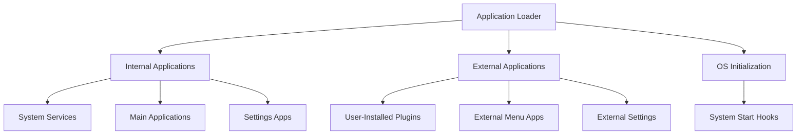
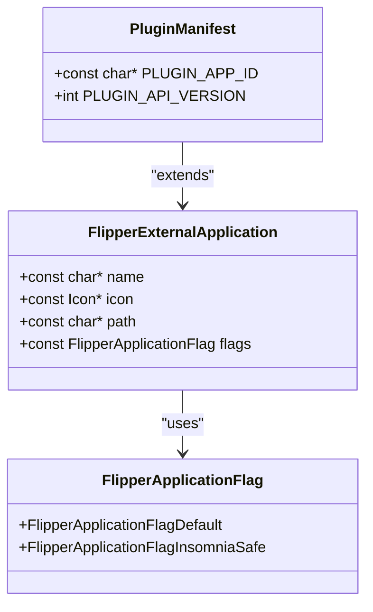
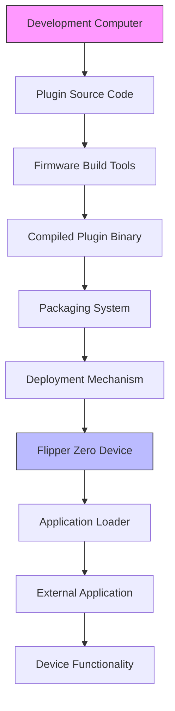

# External Integration

<cite>
**Referenced Files in This Document**   
- [applications.h](file://applications\services\applications.h)
- [plugin_interface.h](file://applications\examples\example_plugins\plugin_interface.h)
- [nfc_protocol_support_base.h](file://applications\main\nfc\helpers\protocol_support\nfc_protocol_support_base.h)
- [nfc_supported_card_plugin.h](file://applications\main\nfc\plugins\supported_cards\nfc_supported_card_plugin.h)
- [cli_i.h](file://applications\services\cli\cli_i.h)
- [js_modules.h](file://applications\system\js_app\js_modules.h)
- [types.h](file://lib\subghz\devices\types.h)
</cite>

## Table of Contents
1. [Introduction](#introduction)
2. [Plugin System Architecture](#plugin-system-architecture)
3. [External Application Structure](#external-application-structure)
4. [Plugin Manifest and Metadata](#plugin-manifest-and-metadata)
5. [Plugin Development Examples](#plugin-development-examples)
6. [Security and Compatibility](#security-and-compatibility)
7. [Integration with Computer Tools](#integration-with-computer-tools)

## Introduction
The Flipper Zero firmware supports a robust external integration system that enables third-party applications and plugin extensions. This document details the architecture and implementation of the plugin system, focusing on dynamic loading, manifest parsing, and secure execution of external applications. The system is designed to allow developers to extend device functionality while maintaining system stability and security.

**Section sources**
- [applications.h](file://applications\services\applications.h#L1-L79)

## Plugin System Architecture

The plugin system in Flipper Zero firmware is built around a modular architecture that distinguishes between internal system applications and external user applications. The core of this system is defined in the `applications.h` file, which declares the data structures and interfaces for application management.

The architecture follows a dual-application model:
- **Internal Applications**: Core system services and applications compiled into the firmware
- **External Applications**: Third-party applications loaded dynamically from storage

The loader component is responsible for initializing both internal services and external applications based on predefined arrays of application descriptors. This design enables a clear separation between trusted system components and user-installed extensions.



**Diagram sources**
- [applications.h](file://applications\services\applications.h#L1-L79)

**Section sources**
- [applications.h](file://applications\services\applications.h#L1-L79)

## External Application Structure

The external application system is defined by the `FlipperExternalApplication` structure in `applications.h`. This structure contains the essential metadata needed to load and display external applications in the user interface.

**External Application Structure:**
```c
typedef struct {
    const char* name;
    const Icon* icon;
    const char* path;
    const FlipperApplicationFlag flags;
} FlipperExternalApplication;
```

**Field Descriptions:**
- **name**: Display name of the application
- **icon**: Pointer to the application icon resource
- **path**: File system path to the application binary
- **flags**: Configuration flags (e.g., insomnia safe)

External applications are stored in the file system and can be loaded on demand by the application loader. The system maintains separate arrays for different categories of external applications:
- `FLIPPER_EXTERNAL_APPS[]`: Main external applications accessible from the menu
- `FLIPPER_EXTSETTINGS_APPS[]`: External settings applications

This structure allows for organized management of third-party applications while providing a consistent user experience.

**Section sources**
- [applications.h](file://applications\services\applications.h#L60-L65)

## Plugin Manifest and Metadata

The plugin system uses a manifest-based approach to define plugin metadata and interface specifications. Plugin manifests are implemented using C preprocessor definitions that establish standardized identifiers and versioning.

**Plugin Manifest Structure:**
```c
#define PLUGIN_APP_ID      "plugin_name"
#define PLUGIN_API_VERSION 1
```

Multiple subsystems implement similar plugin patterns with specific naming conventions:

**NFC Protocol Support Plugin:**
```c
#define NFC_PROTOCOL_SUPPORT_PLUGIN_APP_ID "NfcProtocolSupportPlugin"
#define NFC_PROTOCOL_SUPPORT_PLUGIN_API_VERSION 1
```

**NFC Supported Card Plugin:**
```c
#define NFC_SUPPORTED_CARD_PLUGIN_APP_ID "NfcSupportedCardPlugin"
#define NFC_SUPPORTED_CARD_PLUGIN_API_VERSION 1
```

**CLI Plugin System:**
```c
#define CLI_PLUGIN_APP_ID      "cli"
#define CLI_PLUGIN_API_VERSION 1
```

The API version system enables backward compatibility and prevents loading plugins that are incompatible with the current system version. The app ID serves as a unique identifier for the plugin system, allowing for proper routing and execution context.



**Diagram sources**
- [applications.h](file://applications\services\applications.h#L60-L65)
- [plugin_interface.h](file://applications\examples\example_plugins\plugin_interface.h#L8-L9)

**Section sources**
- [plugin_interface.h](file://applications\examples\example_plugins\plugin_interface.h#L8-L9)
- [nfc_protocol_support_base.h](file://applications\main\nfc\helpers\protocol_support\nfc_protocol_support_base.h#L132-L155)
- [nfc_supported_card_plugin.h](file://applications\main\nfc\plugins\supported_cards\nfc_supported_card_plugin.h#L33-L38)
- [cli_i.h](file://applications\services\cli\cli_i.h#L71-L79)

## Plugin Development Examples

The firmware includes several example plugins that demonstrate the plugin development pattern. These examples provide templates for creating new plugins and illustrate the recommended implementation approach.

**Basic Plugin Interface:**
```c
#define PLUGIN_APP_ID      "example_plugins"
#define PLUGIN_API_VERSION 1
```

**Advanced Plugin Systems:**

**JavaScript Engine Plugin:**
```c
#define PLUGIN_APP_ID      "js"
#define PLUGIN_API_VERSION 1
```

**Sub-GHz Radio Device Plugin:**
```c
#define SUBGHZ_RADIO_DEVICE_PLUGIN_APP_ID      "subghz_radio_device"
#define SUBGHZ_RADIO_DEVICE_PLUGIN_API_VERSION 1
```

**CLI Command Plugin Wrapper:**
```c
#define CLI_PLUGIN_WRAPPER(plugin_name_without_cli_suffix, cli_command_callback) \
    /* Implementation details */
```

The examples show a consistent pattern across different subsystems:
1. Define a unique application ID
2. Specify the API version for compatibility checking
3. Implement the plugin interface according to the specific subsystem requirements
4. Register the plugin with the appropriate system component

This standardized approach simplifies plugin development and ensures consistency across different types of extensions.

**Section sources**
- [plugin_interface.h](file://applications\examples\example_plugins\plugin_interface.h#L8-L9)
- [example_plugins.c](file://applications\examples\example_plugins\example_plugins.c)
- [js_modules.h](file://applications\system\js_app\js_modules.h#L6-L7)
- [types.h](file://lib\subghz\devices\types.h#L14-L15)

## Security and Compatibility

The plugin system incorporates several security and compatibility mechanisms to protect the system and ensure stable operation.

**Security Considerations:**
- **Sandboxing**: External applications run in a restricted environment with limited system access
- **Permission Model**: Applications must declare their required capabilities through flags
- **Memory Protection**: Each application has isolated memory space to prevent interference
- **Validation**: Application metadata is validated before loading

**Compatibility Features:**
- **API Versioning**: The `PLUGIN_API_VERSION` system prevents loading incompatible plugins
- **Flag System**: The `FlipperApplicationFlag` enum allows for feature negotiation
- **Insomnia Safety**: The `FlipperApplicationFlagInsomniaSafe` flag indicates whether an application can run safely when the device is in low-power mode

The system also includes specialized plugin interfaces for different subsystems, each with appropriate security boundaries:
- NFC protocol plugins operate within the NFC subsystem
- CLI plugins are restricted to command-line interface operations
- Sub-GHz radio plugins work within the wireless communication framework

This layered approach to security ensures that plugins can extend functionality without compromising system integrity.

**Section sources**
- [applications.h](file://applications\services\applications.h#L10-L15)
- [plugin_interface.h](file://applications\examples\example_plugins\plugin_interface.h#L8-L9)
- [nfc_protocol_support_base.h](file://applications\main\nfc\helpers\protocol_support\nfc_protocol_support_base.h#L132-L155)

## Integration with Computer Tools

The external integration system supports development and deployment workflows that involve computer-based tools and APIs.

**Development Workflow:**
1. Create plugin using example templates
2. Compile plugin code into appropriate binary format
3. Package plugin with manifest and resources
4. Deploy to device via file system or update mechanism

**API Integration Points:**
- **CLI System**: Plugins can extend the command-line interface with custom commands
- **NFC Subsystem**: Protocol plugins can add support for new NFC card types
- **Sub-GHz Radio**: Device plugins can enable support for additional wireless protocols
- **JavaScript Engine**: Script-based plugins can provide high-level automation

The system is designed to work with the firmware build tools and deployment scripts located in the `scripts` directory, enabling automated compilation, packaging, and installation of external applications.



**Diagram sources**
- [fbt.py](file://scripts\fbt\fbt.py)
- [applications.h](file://applications\services\applications.h#L1-L79)

**Section sources**
- [applications.h](file://applications\services\applications.h#L1-L79)
- [fbt.py](file://scripts\fbt\fbt.py)
- [plugin_interface.h](file://applications\examples\example_plugins\plugin_interface.h#L8-L9)