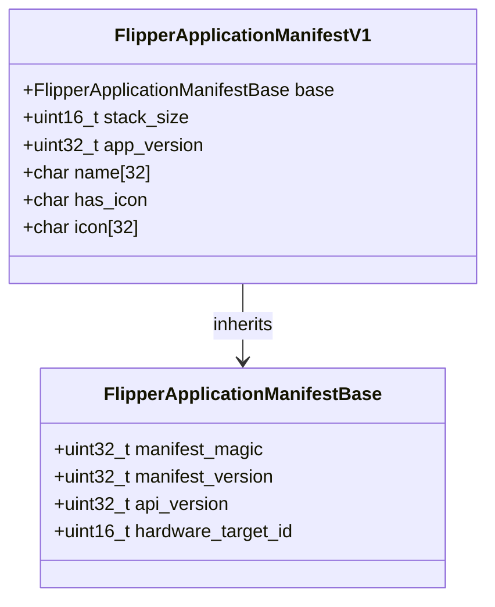
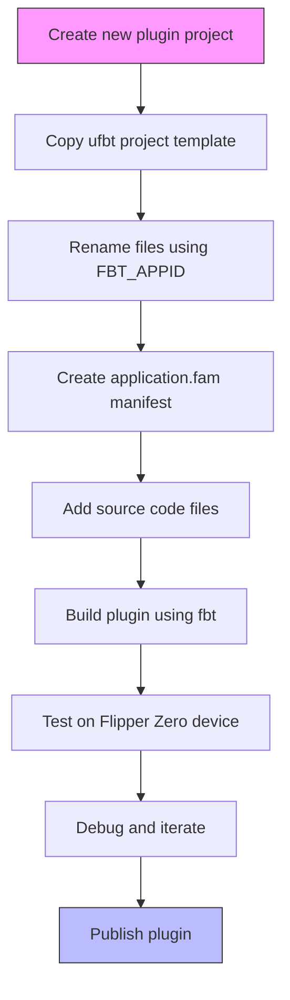
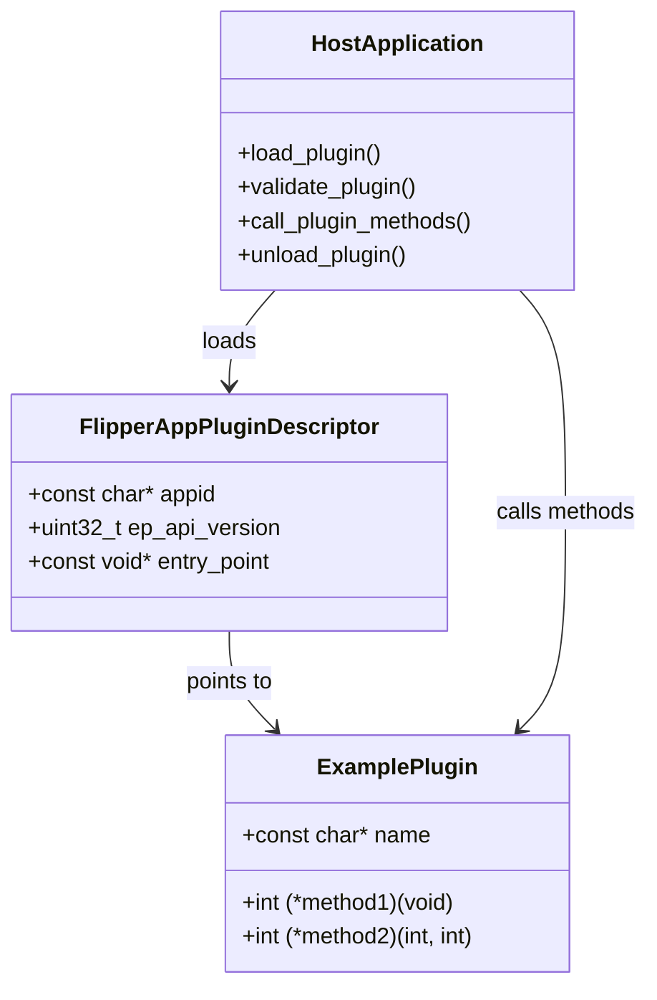
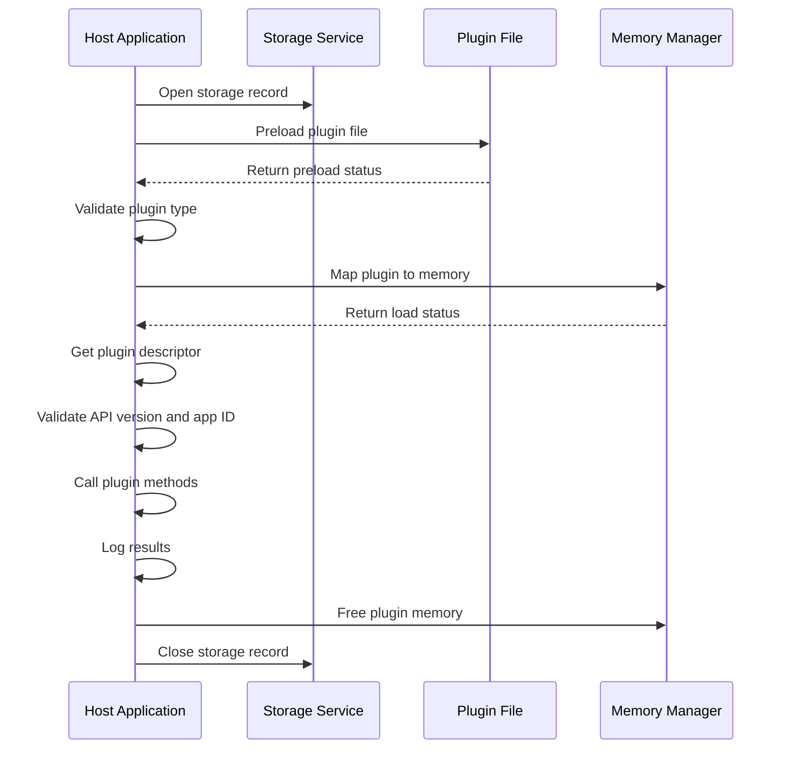

# Plugin Development

<cite>
**Referenced Files in This Document**   
- [application_manifest.h](file://lib/flipper_application/application_manifest.h)
- [AppManifests.md](file://documentation/AppManifests.md)
- [${FBT_APPID}.c](file://scripts/ufbt/project_template/app_template/${FBT_APPID}.c)
- [example_plugins.c](file://applications/examples/example_plugins/example_plugins.c)
- [plugin_interface.h](file://applications/examples/example_plugins/plugin_interface.h)
- [plugin1.c](file://applications/examples/example_plugins/plugin1.c)
- [manifest.yml](file://applications/external/subghz_bruteforcer/manifest.yml)
</cite>

## Table of Contents
1. [Introduction](#introduction)
2. [Plugin Manifest Structure](#plugin-manifest-structure)
3. [Setting Up Plugin Development Environment](#setting-up-plugin-development-environment)
4. [Implementing Plugin Interfaces](#implementing-plugin-interfaces)
5. [Example Plugin Implementation](#example-plugin-implementation)
6. [Build Configuration and Resources](#build-configuration-and-resources)
7. [Common Issues and Solutions](#common-issues-and-solutions)
8. [Conclusion](#conclusion)

## Introduction
This document provides comprehensive guidance on developing external applications (plugins) for the Flipper Zero firmware. It covers the complete development process from setting up the environment to implementing plugin interfaces and handling compatibility issues. The documentation is designed to be accessible to beginners while providing sufficient technical depth for experienced developers. The Flipper Zero firmware architecture supports external applications through the FAP (Flipper Application Package) system, allowing developers to create and distribute plugins that extend the device's functionality.

## Plugin Manifest Structure
The plugin manifest structure is defined in the application manifest system, which uses the `FlipperApplicationManifest` data structure to describe application properties. This structure ensures compatibility between plugins and the firmware, providing metadata for the build system and runtime environment.



**Diagram sources**
- [application_manifest.h](file://lib/flipper_application/application_manifest.h#L25-L85)

The manifest structure consists of two main components: the base structure and the version-specific structure. The base structure contains essential metadata such as the manifest magic number (`FAP_MANIFEST_MAGIC`), manifest version (`FAP_MANIFEST_SUPPORTED_VERSION`), API version information, and hardware target ID. The version-specific structure (V1) extends the base with additional fields including stack size, application version, name, and icon data.

Key fields in the manifest structure include:
- **manifest_magic**: A 32-bit identifier (0x52474448) that validates the manifest integrity
- **manifest_version**: Current supported version (1) ensuring backward compatibility
- **api_version**: Union containing major and minor version numbers for API compatibility checking
- **hardware_target_id**: Identifier specifying compatible hardware targets
- **stack_size**: Stack memory allocation in bytes for the application
- **app_version**: Version number of the application
- **name**: Application name with a maximum length of 32 characters
- **icon**: Embedded icon data with a maximum size of 32 bytes

The manifest system provides several validation functions to ensure plugin compatibility:
- `flipper_application_manifest_is_valid()`: Checks manifest integrity
- `flipper_application_manifest_is_too_old()`: Verifies API version compatibility with older firmware
- `flipper_application_manifest_is_too_new()`: Ensures API version compatibility with newer firmware
- `flipper_application_manifest_is_target_compatible()`: Validates hardware target compatibility

**Section sources**
- [application_manifest.h](file://lib/flipper_application/application_manifest.h#L15-L89)

## Setting Up Plugin Development Environment
Setting up a plugin development environment for Flipper Zero involves using the ufbt project template, which provides a standardized structure for creating external applications. The template simplifies the initial setup process and ensures consistency across different plugin projects.



**Diagram sources**
- [${FBT_APPID}.c](file://scripts/ufbt/project_template/app_template/${FBT_APPID}.c#L1-L13)

The ufbt project template provides a minimal starting point for plugin development. The template includes a basic C source file (`${FBT_APPID}.c`) that serves as the entry point for the application. When creating a new plugin, developers should copy this template and replace the `${FBT_APPID}` placeholder with their actual application ID.

The basic template structure is as follows:
```c
#include <furi.h>

/* generated by fbt from .png files in images folder */
#include <@FBT_APPID@_icons.h>

int32_t @FBT_APPID@_app(void* p) {
    UNUSED(p);
    FURI_LOG_I("TEST", "Hello world");
    FURI_LOG_I("TEST", "I'm @FBT_APPID@!");

    return 0;
}
```

This template demonstrates several important aspects of plugin development:
- Inclusion of the FURI framework header for core functionality
- Automatic inclusion of icon resources generated by fbt from PNG files
- Entry point function following the naming convention `appid_app()`
- Use of FURI logging macros for debugging output
- Proper return value convention (0 for successful execution)

To set up a development environment:
1. Install the Flipper Zero development tools and SDK
2. Clone or download the firmware repository
3. Copy the ufbt project template to a new directory
4. Replace `${FBT_APPID}` with the desired application ID
5. Create an `application.fam` manifest file
6. Add source code files to implement plugin functionality
7. Build the plugin using the fbt build system

**Section sources**
- [${FBT_APPID}.c](file://scripts/ufbt/project_template/app_template/${FBT_APPID}.c#L1-L13)

## Implementing Plugin Interfaces
Implementing plugin interfaces in the Flipper Zero firmware involves creating a well-defined contract between the host application and the plugin. This contract ensures compatibility and enables dynamic loading of plugin functionality at runtime. The interface system uses function pointers and descriptors to provide a flexible and type-safe mechanism for plugin integration.



**Diagram sources**
- [plugin_interface.h](file://applications/examples/example_plugins/plugin_interface.h#L10-L16)
- [example_plugins.c](file://applications/examples/example_plugins/example_plugins.c#L15-L72)

The plugin interface implementation follows a specific pattern that ensures compatibility and proper integration with the host application. The interface is defined as a structure containing function pointers that represent the methods available to the host application. For example:

```c
typedef struct {
    const char* name;
    int (*method1)(void);
    int (*method2)(int, int);
} ExamplePlugin;
```

This structure defines a contract that the plugin must fulfill. The host application can then safely call these methods without knowing the internal implementation details. The plugin implementation must provide concrete functions for each method in the interface:

```c
static int example_plugin1_method1(void) {
    return 42;
}

static int example_plugin1_method2(int arg1, int arg2) {
    return arg1 + arg2;
}
```

The actual implementation is then wrapped in a static const structure to ensure immutability and thread safety:

```c
static const ExamplePlugin example_plugin1 = {
    .name = "Demo App Plugin 1",
    .method1 = &example_plugin1_method1,
    .method2 = &example_plugin1_method2,
};
```

A plugin descriptor structure links the implementation to the plugin system:

```c
static const FlipperAppPluginDescriptor example_plugin1_descriptor = {
    .appid = PLUGIN_APP_ID,
    .ep_api_version = PLUGIN_API_VERSION,
    .entry_point = &example_plugin1,
};
```

The entry point function returns a pointer to this descriptor, allowing the host application to validate and load the plugin:

```c
const FlipperAppPluginDescriptor* example_plugin1_ep(void) {
    return &example_plugin1_descriptor;
}
```

This pattern ensures that plugins can be safely loaded, validated, and executed while maintaining compatibility across different firmware versions.

**Section sources**
- [plugin_interface.h](file://applications/examples/example_plugins/plugin_interface.h#L1-L17)
- [plugin1.c](file://applications/examples/example_plugins/plugin1.c#L1-L38)

## Example Plugin Implementation
The example plugin implementation demonstrates the complete process of creating a functional plugin for the Flipper Zero firmware. This example shows how a host application loads and interacts with a plugin, providing a practical reference for developers.



**Diagram sources**
- [example_plugins.c](file://applications/examples/example_plugins/example_plugins.c#L15-L72)

The host application implementation follows a structured approach to plugin loading and execution:

```c
int32_t example_plugins_app(void* p) {
    UNUSED(p);

    FURI_LOG_I(TAG, "Starting");

    Storage* storage = furi_record_open(RECORD_STORAGE);

    FlipperApplication* app = flipper_application_alloc(storage, firmware_api_interface);

    do {
        FlipperApplicationPreloadStatus preload_res =
            flipper_application_preload(app, APP_DATA_PATH("plugins/example_plugin1.fal"));

        if(preload_res != FlipperApplicationPreloadStatusSuccess) {
            FURI_LOG_E(TAG, "Failed to preload plugin");
            break;
        }

        if(!flipper_application_is_plugin(app)) {
            FURI_LOG_E(TAG, "Plugin file is not a library");
            break;
        }

        FlipperApplicationLoadStatus load_status = flipper_application_map_to_memory(app);
        if(load_status != FlipperApplicationLoadStatusSuccess) {
            FURI_LOG_E(TAG, "Failed to load plugin file");
            break;
        }

        const FlipperAppPluginDescriptor* app_descriptor =
            flipper_application_plugin_get_descriptor(app);

        FURI_LOG_I(
            TAG,
            "Loaded plugin for appid '%s', API %lu",
            app_descriptor->appid,
            app_descriptor->ep_api_version);

        furi_check(app_descriptor->ep_api_version == PLUGIN_API_VERSION);
        furi_check(strcmp(app_descriptor->appid, PLUGIN_APP_ID) == 0);

        const ExamplePlugin* plugin = app_descriptor->entry_point;

        FURI_LOG_I(TAG, "Plugin name: %s", plugin->name);
        FURI_LOG_I(TAG, "Plugin method1: %d", plugin->method1());
        FURI_LOG_I(TAG, "Plugin method2(7,8): %d", plugin->method2(7, 8));
        FURI_LOG_I(TAG, "Plugin method2(1337,228): %d", plugin->method2(1337, 228));
    } while(false);
    flipper_application_free(app);

    furi_record_close(RECORD_STORAGE);
    FURI_LOG_I(TAG, "Goodbye!");

    return 0;
}
```

This implementation demonstrates several key aspects of plugin development:
- Proper resource management with opening and closing of services
- Error handling using a do-while loop for clean exit paths
- Plugin preloading and validation before execution
- Memory mapping of the plugin code
- Descriptor retrieval and compatibility checking
- Safe method invocation through function pointers
- Proper cleanup and resource deallocation

The host application first opens the storage service to access the plugin file, then allocates a `FlipperApplication` structure to manage the plugin lifecycle. It preloads the plugin file from the specified path, validates that it is indeed a plugin (library), and maps it to memory. After retrieving the plugin descriptor, it validates the API version and application ID to ensure compatibility. Finally, it casts the entry point to the expected interface type and calls the plugin methods, logging the results.

**Section sources**
- [example_plugins.c](file://applications/examples/example_plugins/example_plugins.c#L1-L73)

## Build Configuration and Resources
Build configuration for Flipper Zero plugins is managed through the application manifest system, which uses Python-based `.fam` files to define build parameters and dependencies. This system provides a flexible way to configure plugin builds while maintaining compatibility with the overall firmware build process.

The application manifest system supports various parameters that control the build process:

```python
App(
    appid="example_plugin",
    apptype=FlipperAppType.EXTERNAL,
    name="Example Plugin",
    entry_point="example_plugin_app",
    fap_version="1.0",
    fap_icon="icon.png",
    fap_category="Utilities",
    fap_description="An example plugin demonstrating the plugin system",
    fap_author="Developer Name",
    fap_weburl="https://example.com/plugin",
    fap_icon_assets="images",
    sources=["*.c*", "!tests"],
    fap_libs=["storage", "gui"],
    stack_size=2048,
    requires=["desktop"],
    targets=["all"]
)
```

Key build configuration parameters include:
- **appid**: Unique identifier for the plugin within the build system
- **apptype**: Set to EXTERNAL for plugins built as .fap files
- **name**: Display name shown in the user interface
- **entry_point**: C function name used as the application entry point
- **fap_version**: Version string for the plugin
- **fap_icon**: 10x10px, 1-bit PNG file used as the plugin icon
- **fap_category**: Organizational category for the plugin
- **fap_description**: Short description of the plugin's functionality
- **fap_author**: Plugin developer name
- **fap_weburl**: Homepage or documentation URL
- **fap_icon_assets**: Directory containing icon resources
- **sources**: File patterns for source code inclusion
- **fap_libs**: Additional libraries to link against
- **stack_size**: Memory allocation for the application stack
- **requires**: Dependencies required by the plugin
- **targets**: Hardware targets the plugin is compatible with

For external plugins, the build system also supports advanced features like private libraries and external build tools:

```python
fap_private_libs=[
    Lib(
        name="mbedtls",
        fap_include_paths=["include"],
        sources=[
            "library/des.c",
            "library/sha1.c",
            "library/platform_util.c",
        ],
        cdefines=["MBEDTLS_ERROR_C"],
    ),
],
fap_extbuild=(
    ExtFile(
        path="${FAP_WORK_DIR}/target/thumbv7em-none-eabihf/release/libhello_rust.a",
        command="cargo build --release --verbose --target thumbv7em-none-eabihf --target-dir ${FAP_WORK_DIR}/target --manifest-path ${FAP_SRC_DIR}/Cargo.toml",
    ),
),
```

These features allow plugins to include third-party libraries and even be written in other programming languages like Rust, compiled with external toolchains.

The `manifest.yml` file provides additional metadata for plugin distribution:

```yaml
sourcecode:
  type: git
  location:
    origin: https://github.com/derskythe/flipperzero-subbrute
    commit_sha: 7666ee61a5c4f3a85dd0eded24c2e73b2f5bc4a9
    subdir: subbrute
description: "@README.md"
changelog: "v3.8.0 - OFW SDK support"
author: "@DerSkythe @xMasterX @gid9798"
screenshots:
  - "screenshots/screenshot_01.png"
  - "screenshots/screenshot_02.png"
  - "screenshots/screenshot_03.png"
  - "screenshots/screenshot_04.png"
  - "screenshots/screenshot_05.png"
```

This file contains information used by plugin repositories and distribution platforms, including source code location, description, changelog, author information, and screenshots.

**Section sources**
- [AppManifests.md](file://documentation/AppManifests.md#L1-L140)
- [manifest.yml](file://applications/external/subghz_bruteforcer/manifest.yml#L1-L16)

## Common Issues and Solutions
Developing plugins for the Flipper Zero firmware can present several common challenges. Understanding these issues and their solutions is crucial for creating stable and compatible plugins.

### Memory Constraints
Memory management is one of the most critical aspects of plugin development. The Flipper Zero has limited RAM, and improper memory usage can lead to system instability.

**Issue**: Stack overflow due to insufficient stack size allocation
**Solution**: Use the `stack_size` parameter in the manifest to allocate appropriate stack space. Monitor memory usage with CLI commands like `top` and `free`.

**Issue**: Memory leaks from improper resource management
**Solution**: Always pair resource allocation with proper deallocation. Use the do-while pattern for error handling to ensure cleanup code is executed.

### API Versioning
API compatibility is essential for ensuring plugins work across different firmware versions.

**Issue**: Plugin fails to load on newer firmware versions
**Solution**: Use the API version checking functions provided by the manifest system:
```c
if(flipper_application_manifest_is_too_new(manifest, api_interface)) {
    FURI_LOG_E(TAG, "Plugin requires newer firmware version");
    return false;
}
```

**Issue**: Breaking changes in firmware APIs
**Solution**: Implement version-specific code paths and use feature detection rather than version numbers when possible.

### Dependency Management
Proper dependency handling ensures plugins can access required services and libraries.

**Issue**: Missing required services
**Solution**: Declare dependencies in the manifest using the `requires` parameter:
```python
requires=["desktop", "gui", "storage"]
```

**Issue**: Conflicts with other plugins
**Solution**: Use the `conflicts` parameter to prevent incompatible plugins from being installed together:
```python
conflicts=["other_plugin_with_same_functionality"]
```

### Build Configuration Errors
Incorrect build configuration can prevent plugins from compiling or functioning properly.

**Issue**: Source files not included in build
**Solution**: Verify the `sources` parameter in the manifest includes the correct file patterns:
```python
sources=["*.c*", "!tests/*.c"]
```

**Issue**: Linking errors with external libraries
**Solution**: Ensure required libraries are listed in `fap_libs` and verify they are available in the SDK.

### Runtime Issues
Problems that occur during plugin execution require careful debugging.

**Issue**: Plugin crashes or freezes the system
**Solution**: Implement comprehensive error checking and use FURI logging to trace execution flow. Test thoroughly in a development environment before deployment.

**Issue**: Plugin fails to load from SD card
**Solution**: Verify the plugin file has the correct `.fap` extension and is placed in the appropriate directory on the SD card.

By understanding these common issues and their solutions, developers can create more robust and reliable plugins for the Flipper Zero platform.

**Section sources**
- [application_manifest.h](file://lib/flipper_application/application_manifest.h#L70-L85)
- [AppManifests.md](file://documentation/AppManifests.md#L1-L140)

## Conclusion
Plugin development for the Flipper Zero firmware provides a powerful way to extend the device's functionality through external applications. This document has covered the complete development process, from setting up the environment with the ufbt project template to implementing plugin interfaces and managing build configurations. The manifest system ensures compatibility and proper integration with the firmware, while the plugin interface pattern enables flexible and type-safe extension of application functionality.

Key takeaways for successful plugin development include:
- Understanding the manifest structure and its role in compatibility checking
- Following the established patterns for plugin interface implementation
- Properly configuring build parameters in the application manifest
- Managing memory and resources carefully within the device's constraints
- Handling API versioning to ensure compatibility across firmware updates

By following these guidelines and learning from the provided examples, developers can create high-quality plugins that enhance the Flipper Zero experience while maintaining system stability and compatibility.