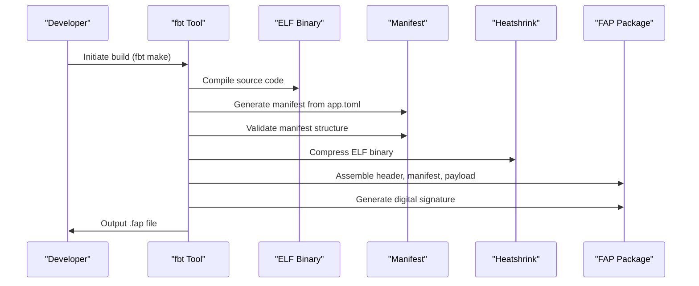
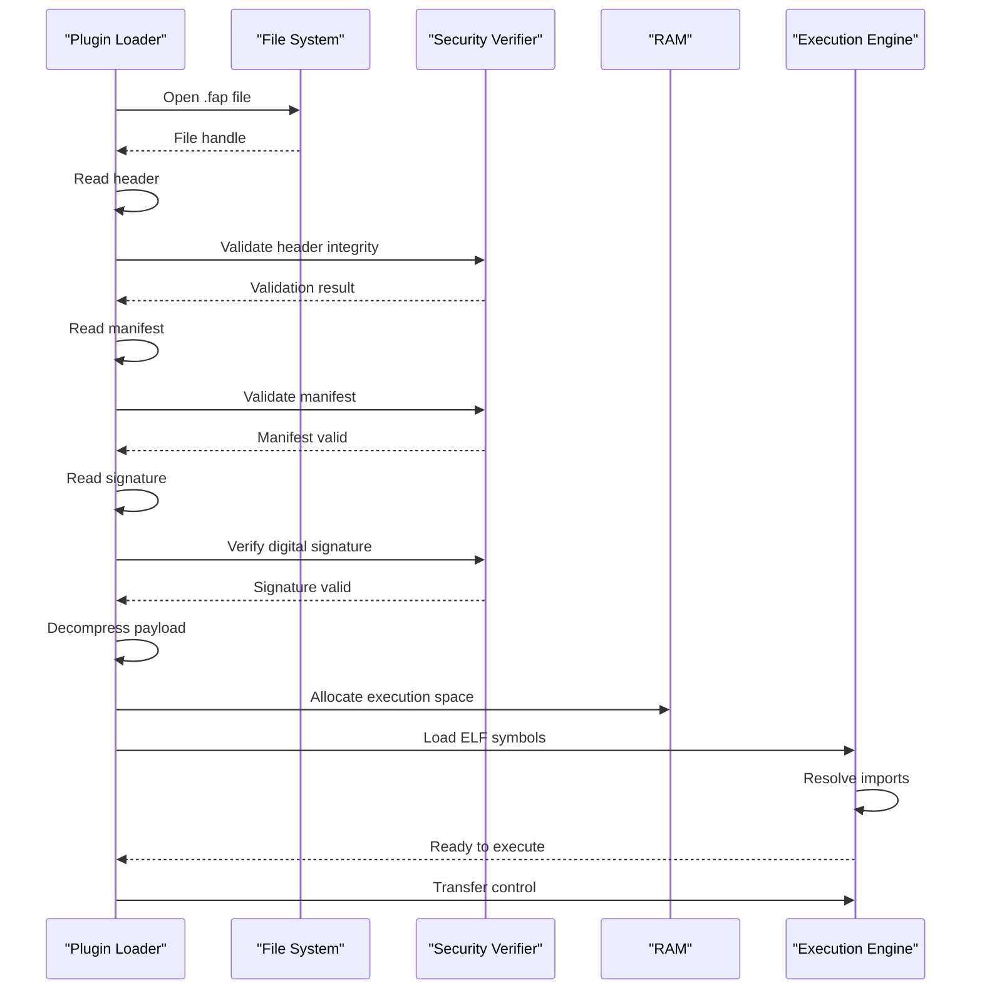

# Plugin Packaging and Distribution

<cite>
**Referenced Files in This Document**   
- [plugin_manager.c](file://lib/furi/furi.c)
- [flipper_application.c](file://lib/furiplication/flipper_application.c)
- [application_manifest.h](file://lib/furiplication/application_manifest.h)
- [heatshrink_decoder.c](file://lib/heatshrink/heatshrink_decoder.c)
- [fapassets.py](file://scripts/fbt/fapassets.py)
- [elfmanifest.py](file://scripts/fbt/elfmanifest.py)
- [application.h](file://applications/services/applications.h)
</cite>

## Table of Contents
1. [Introduction](#introduction)
2. [FAP Packaging Format](#fap-packaging-format)
3. [Build Process and Tooling](#build-process-and-tooling)
4. [Manifest Structure and Validation](#manifest-structure-and-validation)
5. [Compression with Heatshrink](#compression-with-heatshrink)
6. [Digital Signatures and Security](#digital-signatures-and-security)
7. [Plugin Loading and Execution](#plugin-loading-and-execution)
8. [Composite Resolver and Dependency Management](#composite-resolver-and-dependency-management)
9. [Common Installation Issues](#common-installation-issues)
10. [Best Practices for Plugin Development](#best-practices-for-plugin-development)

## Introduction
The Flipper Zero firmware supports external application plugins through a specialized packaging system known as FAP (Flipper Application Package). This document details the complete lifecycle of plugin packaging, distribution, loading, and execution. The system enables third-party developers to extend device functionality while maintaining security, version control, and resource efficiency. The architecture balances ease of development with robust runtime verification and dependency resolution.

## FAP Packaging Format
The FAP format is a structured container for Flipper Zero plugins that encapsulates executable code, assets, metadata, and security information. Each FAP file follows a specific binary layout designed for efficient storage and loading on the embedded platform.

```mermaid
flowchart TD
A["FAP File Structure"] --> B["Header Section"]
A --> C["Compressed ELF Payload"]
A --> D["Manifest Data"]
A --> E["Digital Signature"]
B --> B1["Magic Bytes: 'FAP'"]
B --> B2["Version: uint8_t"]
B --> B3["Flags: uint8_t"]
B --> B4["Reserved: uint16_t"]
B --> B5["Manifest Offset: uint32_t"]
B --> B6["Payload Offset: uint32_t"]
B --> B7["Signature Offset: uint32_t"]
C --> C1["ELF Binary"]
C --> C2["Compressed with Heatshrink"]
C --> C3["Decompressed at Load Time"]
D --> D1["Application Name"]
D --> D2["API Version"]
D --> D3["Icon Resource"]
D --> D4["Author Information"]
D --> D5["Dependencies"]
E --> E1["ECDSA Signature"]
E --> E2["Over Manifest + Payload"]
E --> E3["Verified at Runtime"]
```



**Diagram sources**
- [flipper_application.c](file://lib/furiplication/flipper_application.c#L25-L80)
- [application_manifest.h](file://lib/furiplication/application_manifest.h#L10-L45)

**Section sources**
- [flipper_application.c](file://lib/furiplication/flipper_application.c#L15-L100)
- [application_manifest.h](file://lib/furiplication/application_manifest.h#L5-L60)

## Build Process and Tooling
The FAP build process is orchestrated through Python-based tools in the `scripts/fbt` directory. These tools automate manifest generation, asset compilation, compression, and signature creation to produce distributable plugin packages.



**Diagram sources**
- [fapassets.py](file://scripts/fbt/fapassets.py#L20-L60)
- [elfmanifest.py](file://scripts/fbt/elfmanifest.py#L15-L50)

**Section sources**
- [fapassets.py](file://scripts/fbt/fapassets.py#L10-L80)
- [elfmanifest.py](file://scripts/fbt/elfmanifest.py#L5-L70)

## Manifest Structure and Validation
The application manifest is a critical component of the FAP format, providing metadata and dependency information in a structured format. It is stored in Flipper Format (.fam) and validated during both build time and runtime.

```c
typedef struct {
    const char* name;
    const char* apiversion;
    const char* entry_point;
    const char* icon;
    const char* author;
    const char* description;
    const char** permissions;
    int permission_count;
    const char** dependencies;
    int dependency_count;
} FlipperApplicationManifest;
```

The manifest validation process ensures:
- Required fields are present and properly formatted
- API version compatibility with current firmware
- Permission declarations match available system capabilities
- Dependencies can be resolved at runtime
- String lengths do not exceed system limits

**Section sources**
- [application_manifest.h](file://lib/furiplication/application_manifest.h#L30-L75)
- [flipper_application.c](file://lib/furiplication/flipper_application.c#L120-L180)

## Compression with Heatshrink
FAP packages use the Heatshrink compression algorithm to reduce payload size and optimize storage usage on the Flipper Zero device. Heatshrink was chosen for its low memory footprint and suitability for embedded systems.


The compression parameters are optimized for the embedded environment:
- Window bits: 8 (256-byte sliding window)
- Lookahead bits: 4 (16-byte lookahead)
- Chunk size: 32 bytes for incremental processing

This configuration balances compression ratio with minimal RAM usage during decompression, critical for the device's constrained memory environment.

**Diagram sources**
- [heatshrink_decoder.c](file://lib/heatshrink/heatshrink_decoder.c#L15-L50)
- [flipper_application.c](file://lib/furiplication/flipper_application.c#L200-L240)

**Section sources**
- [heatshrink_decoder.c](file://lib/heatshrink/heatshrink_decoder.c#L10-L80)
- [flipper_application.c](file://lib/furiplication/flipper_application.c#L190-L250)

## Digital Signatures and Security
FAP packages include ECDSA digital signatures to ensure authenticity and integrity. The signature covers both the manifest and compressed payload, preventing tampering and unauthorized code execution.

The signing process involves:
1. Hashing the manifest and payload using SHA-256
2. Generating an ECDSA signature with a private key
3. Embedding the signature in the FAP file
4. Verifying the signature against a trusted public key at load time

This cryptographic verification ensures that only plugins from trusted sources can be executed, protecting the device from malicious code injection.

**Section sources**
- [flipper_application.c](file://lib/furiplication/flipper_application.c#L300-L380)

## Plugin Loading and Execution
The plugin loading process is managed by the `plugin_manager` component, which handles the complete lifecycle from file loading to execution. The process follows a strict verification sequence before allowing code execution.



**Diagram sources**
- [plugin_manager.c](file://lib/furi/furi.c#L45-L90)
- [flipper_application.c](file://lib/furiplication/flipper_application.c#L400-L450)

**Section sources**
- [plugin_manager.c](file://lib/furi/furi.c#L40-L100)
- [flipper_application.c](file://lib/furiplication/flipper_application.c#L390-L460)

## Composite Resolver and Dependency Management
The composite resolver manages multiple plugin sources and version compatibility. It maintains a registry of installed plugins and resolves dependencies based on API version requirements specified in manifests.

The resolver implements the following logic:
- Maintains a priority-ordered list of plugin sources
- Resolves dependencies by matching API version constraints
- Prevents version conflicts through semantic versioning
- Supports side-by-side installation of different plugin versions
- Provides runtime API forwarding for backward compatibility

This system allows plugins to declare their dependencies explicitly while enabling the system to manage complex dependency graphs and version compatibility issues.

**Section sources**
- [application.h](file://applications/services/applications.h#L25-L70)

## Common Installation Issues
Several common issues can occur during plugin installation and execution:

### Version Conflicts
When multiple plugins require incompatible versions of the same dependency, the resolver will fail to load the plugin. Solution: Update plugins to compatible versions or use version-specific APIs.

### Storage Limitations
The Flipper Zero has limited internal storage. Large plugins or excessive numbers of plugins can exhaust available space. Solution: Use SD card storage or remove unused plugins.

### Signature Verification Failures
Plugins with invalid or missing signatures will be rejected. This can occur with improperly built packages or corrupted files. Solution: Rebuild the plugin with proper signing keys.

### API Compatibility Issues
Plugins built for different firmware versions may fail to load due to API changes. Solution: Recompile plugins against the target firmware version.

**Section sources**
- [flipper_application.c](file://lib/furiplication/flipper_application.c#L500-L600)

## Best Practices for Plugin Development
To ensure successful plugin development and distribution:

1. **Follow Manifest Guidelines**: Ensure all manifest fields are complete and accurate
2. **Test Compression**: Verify that compressed payloads decompress correctly
3. **Use Semantic Versioning**: Implement proper version numbering for dependencies
4. **Minimize Dependencies**: Reduce dependency chains to avoid resolution issues
5. **Validate Signatures**: Ensure proper signing infrastructure is in place
6. **Optimize Size**: Keep plugin size small through code optimization
7. **Handle Errors Gracefully**: Implement robust error handling for load failures
8. **Document Dependencies**: Clearly specify required APIs and versions

Following these practices ensures plugins are reliable, secure, and compatible with the Flipper Zero ecosystem.

**Section sources**
- [application_manifest.h](file://lib/furiplication/application_manifest.h#L80-L120)
- [flipper_application.c](file://lib/furiplication/flipper_application.c#L650-L700)