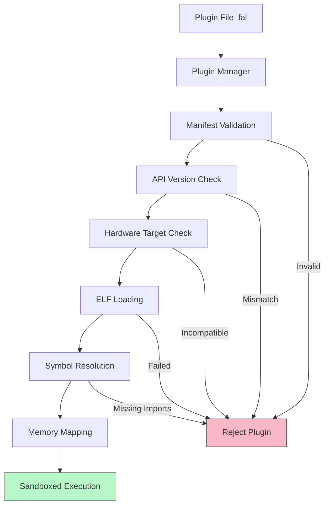
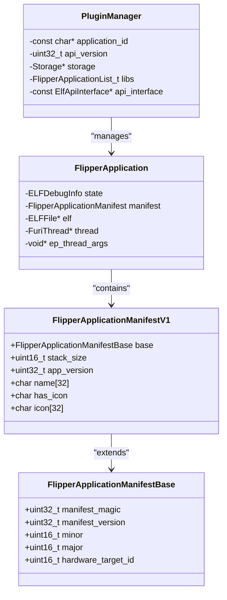
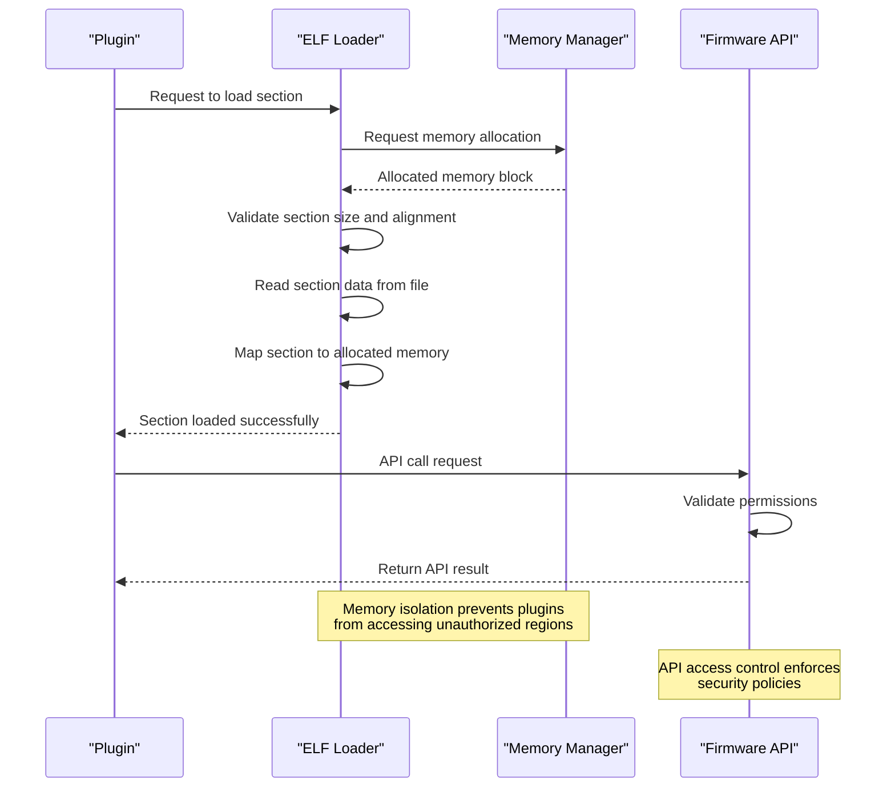
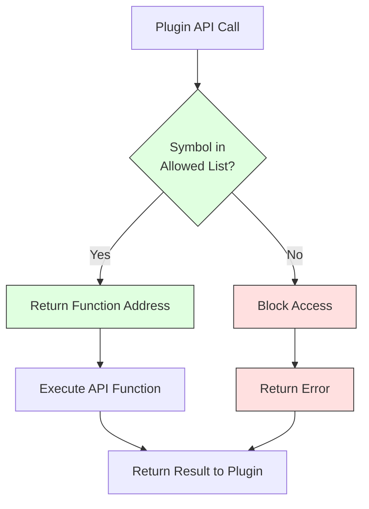
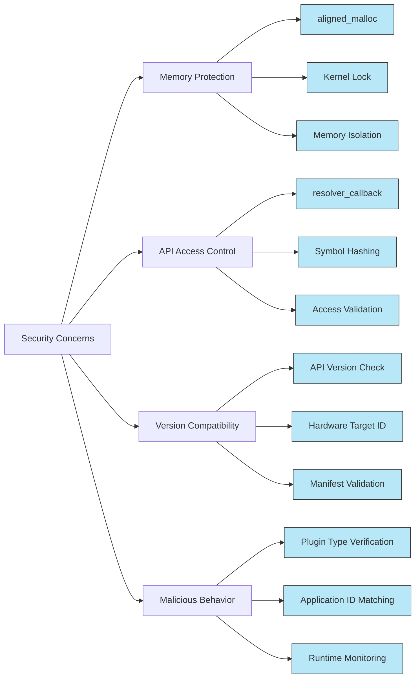

# Plugin Security Model

<cite>
**Referenced Files in This Document**   
- [plugin_manager.c](file://lib/flipper_application/plugins/plugin_manager.c#L0-L166)
- [application_manifest.h](file://lib/flipper_application/application_manifest.h#L0-L89)
- [application_manifest.c](file://lib/flipper_application/application_manifest.c#L0-L49)
- [flipper_application.c](file://lib/flipper_application/flipper_application.c#L0-L391)
- [elf_file.c](file://lib/flipper_application/elf/elf_file.c#L0-L1081)
- [elf_api_interface.h](file://lib/flipper_application/elf/elf_api_interface.h#L0-L16)
- [firmware_api.h](file://applications/services/loader/firmware_api/firmware_api.h#L0-L5)
</cite>

## Table of Contents
1. [Introduction](#introduction)
2. [Plugin Security Architecture](#plugin-security-architecture)
3. [Manifest-Based Permission System](#manifest-based-permission-system)
4. [Code Signing and Verification Process](#code-signing-and-verification-process)
5. [Plugin Loading Security Checks](#plugin-loading-security-checks)
6. [Sandboxing and Resource Isolation](#sandboxing-and-resource-isolation)
7. [API Access Control Mechanism](#api-access-control-mechanism)
8. [Common Security Concerns and Mitigations](#common-security-concerns-and-mitigations)
9. [Conclusion](#conclusion)

## Introduction
The Flipper Zero firmware implements a comprehensive security model to ensure the safety and integrity of third-party applications (plugins). This document details the multi-layered security architecture that protects the device from malicious or poorly written plugins while maintaining flexibility for developers. The security model combines manifest-based permission declarations, API version compatibility checks, hardware target validation, and runtime sandboxing to create a robust environment for third-party code execution. The system is designed to prevent unauthorized access to system resources, protect memory integrity, and ensure that plugins can only perform actions they are explicitly authorized to do.

**Section sources**
- [plugin_manager.c](file://lib/flipper_application/plugins/plugin_manager.c#L0-L166)
- [application_manifest.h](file://lib/flipper_application/application_manifest.h#L0-L89)

## Plugin Security Architecture
The Flipper Zero plugin security architecture is built on a layered approach that validates plugins at multiple stages: during loading, before execution, and throughout runtime. The core components of this architecture include the Plugin Manager, Application Manifest system, ELF loader, and API interface layer. These components work together to enforce security policies and prevent unauthorized access to system resources.



**Diagram sources**
- [plugin_manager.c](file://lib/flipper_application/plugins/plugin_manager.c#L0-L166)
- [application_manifest.c](file://lib/flipper_application/application_manifest.c#L0-L49)

**Section sources**
- [plugin_manager.c](file://lib/flipper_application/plugins/plugin_manager.c#L0-L166)
- [application_manifest.h](file://lib/flipper_application/application_manifest.h#L0-L89)

## Manifest-Based Permission System
The Flipper Zero firmware uses a manifest-based permission system to declare and validate plugin capabilities. Each plugin contains a manifest section (.fapmeta) that specifies critical security attributes including API version compatibility, hardware target, and application identity. The manifest serves as a contract between the plugin and the firmware, defining what the plugin is allowed to do and under what conditions it can execute.

The manifest structure is defined in `application_manifest.h` and includes several key security fields:
- **manifest_magic**: A magic number (0x52474448) that identifies valid Flipper application manifests
- **manifest_version**: The manifest format version (currently 1) that ensures backward compatibility
- **api_version**: The major and minor version numbers of the ELF API that the plugin was built against
- **hardware_target_id**: A hardware identifier that ensures the plugin runs only on compatible devices
- **stack_size**: For applications (not plugins), specifies the stack size; plugins have stack_size = 0



**Diagram sources**
- [application_manifest.h](file://lib/flipper_application/application_manifest.h#L0-L89)
- [flipper_application.c](file://lib/flipper_application/flipper_application.c#L0-L391)

**Section sources**
- [application_manifest.h](file://lib/flipper_application/application_manifest.h#L0-L89)
- [application_manifest.c](file://lib/flipper_application/application_manifest.c#L0-L49)

## Code Signing and Verification Process
The Flipper Zero firmware implements a robust code verification process that ensures plugin authenticity and prevents tampering. While the current implementation does not use cryptographic signatures, it employs a comprehensive validation process that serves a similar purpose by verifying the integrity and authenticity of plugins through multiple checks.

The verification process begins when a plugin is loaded through the `plugin_manager_load_single` function, which performs several critical security checks:

1. **Manifest Validation**: The system first validates that the manifest contains the correct magic number and version, ensuring it's a legitimate Flipper application manifest.

2. **Hardware Compatibility Check**: The firmware verifies that the plugin's hardware target ID matches the current device, preventing plugins from running on incompatible hardware.

3. **API Version Compatibility**: The system checks that the plugin's declared API version is compatible with the firmware's API version, ensuring stable operation.

The verification process is implemented in `application_manifest.c` with the following key functions:

```c
bool flipper_application_manifest_is_valid(const FlipperApplicationManifest* manifest) {
    furi_check(manifest);

    if((manifest->base.manifest_magic != FAP_MANIFEST_MAGIC) ||
       (manifest->base.manifest_version != FAP_MANIFEST_SUPPORTED_VERSION)) {
        return false;
    }

    return true;
}

bool flipper_application_manifest_is_target_compatible(const FlipperApplicationManifest* manifest) {
    furi_check(manifest);

    const Version* version = furi_hal_version_get_firmware_version();
    return version_get_target(version) == manifest->base.hardware_target_id;
}
```

These checks ensure that only properly formatted, hardware-compatible plugins with valid manifests can proceed to the loading stage.

**Section sources**
- [application_manifest.c](file://lib/flipper_application/application_manifest.c#L0-L49)
- [flipper_application.c](file://lib/flipper_application/flipper_application.c#L0-L391)

## Plugin Loading Security Checks
The plugin loading process in Flipper Zero firmware incorporates multiple security checks to ensure the integrity and safety of third-party applications. These checks are implemented in the `plugin_manager_load_single` function and are executed sequentially to validate each plugin before it is allowed to run.

The security checks performed during plugin loading include:

1. **Preload Validation**: The system first attempts to preload the plugin using `flipper_application_preload`, which parses the ELF headers and loads the manifest section.

2. **Plugin Type Verification**: The system verifies that the loaded file is actually a plugin by checking that `stack_size == 0` in the manifest, distinguishing plugins from full applications.

3. **Application ID Matching**: The plugin manager ensures that the plugin's application ID matches the expected ID, preventing unauthorized plugins from loading.

4. **API Version Verification**: The system confirms that the plugin's API version matches the expected version, ensuring compatibility.

```c
PluginManagerError plugin_manager_load_single(PluginManager* manager, const char* path) {
    furi_check(manager);
    FlipperApplication* lib = flipper_application_alloc(manager->storage, manager->api_interface);

    PluginManagerError error = PluginManagerErrorNone;
    do {
        FlipperApplicationPreloadStatus preload_res = flipper_application_preload(lib, path);

        if(preload_res != FlipperApplicationPreloadStatusSuccess) {
            FURI_LOG_E(TAG, "Failed to preload %s", path);
            error = PluginManagerErrorLoaderError;
            break;
        }

        if(!flipper_application_is_plugin(lib)) {
            FURI_LOG_E(TAG, "Not a plugin %s", path);
            error = PluginManagerErrorLoaderError;
            break;
        }

        FlipperApplicationLoadStatus load_status = flipper_application_map_to_memory(lib);
        if(load_status != FlipperApplicationLoadStatusSuccess) {
            FURI_LOG_E(TAG, "Failed to load %s", path);
            error = PluginManagerErrorLoaderError;
            break;
        }

        const FlipperAppPluginDescriptor* app_descriptor =
            flipper_application_plugin_get_descriptor(lib);

        if(!app_descriptor) {
            FURI_LOG_E(TAG, "Failed to get descriptor %s", path);
            error = PluginManagerErrorLoaderError;
            break;
        }

        if(strcmp(app_descriptor->appid, manager->application_id) != 0) {
            FURI_LOG_E(TAG, "Application id mismatch %s", path);
            error = PluginManagerErrorApplicationIdMismatch;
            break;
        }

        if(app_descriptor->ep_api_version != manager->api_version) {
            FURI_LOG_E(TAG, "API version mismatch %s", path);
            error = PluginManagerErrorAPIVersionMismatch;
            break;
        }

        FlipperApplicationList_push_back(manager->libs, lib);
    } while(false);

    if(error != PluginManagerErrorNone) {
        flipper_application_free(lib);
    }

    return error;
}
```

This comprehensive validation process ensures that only properly formatted, compatible, and authorized plugins can be loaded into the system.

**Section sources**
- [plugin_manager.c](file://lib/flipper_application/plugins/plugin_manager.c#L0-L166)
- [flipper_application.c](file://lib/flipper_application/flipper_application.c#L0-L391)

## Sandboxing and Resource Isolation
The Flipper Zero firmware implements sandboxing mechanisms to limit plugin access to system resources and prevent malicious behavior. This isolation is achieved through a combination of memory management, API access controls, and execution environment restrictions.

The sandboxing model is based on the following principles:

1. **Memory Isolation**: Plugins are loaded into their own memory space and are prevented from accessing memory outside their allocated regions. The ELF loader handles memory mapping and ensures that plugins cannot overwrite system memory.

2. **Resource Access Control**: Plugins can only access system resources through well-defined API calls, which are subject to permission checks.

3. **Execution Environment**: Plugins run in a restricted environment with limited direct hardware access.

The sandboxing is implemented through the ELF loading process, which maps plugin sections to memory while maintaining isolation:

```c
static ELFLoadSectionResult
    elf_load_section_data(ELFFile* elf, ELFSection* section, Elf32_Shdr* section_header) {
    if(section_header->sh_size == 0) {
        FURI_LOG_D(TAG, "No data for section");
        return ELFLoadSectionResultSuccess;
    }

    size_t safe_size = section_header->sh_size + 1024;

    furi_kernel_lock();

    if(memmgr_heap_get_max_free_block() < safe_size) {
        furi_kernel_unlock();
        FURI_LOG_E(TAG, "Not enough memory to load section data");
        return ELFLoadSectionResultNoMemory;
    }

    section->data = aligned_malloc(section_header->sh_size, section_header->sh_addralign);
    section->size = section_header->sh_size;

    furi_kernel_unlock();

    if(section_header->sh_type == SHT_NOBITS) {
        // BSS section, no data to load
        return ELFLoadSectionResultSuccess;
    }

    if((!storage_file_seek(elf->fd, section_header->sh_offset, true)) ||
       (storage_file_read(elf->fd, section->data, section_header->sh_size) !=
        section_header->sh_size)) {
        FURI_LOG_E(TAG, "    seek/read fail");
        return ELFLoadSectionResultError;
    }

    FURI_LOG_D(TAG, "0x%p", section->data);
    return ELFLoadSectionResultSuccess;
}
```

This code ensures that each section is properly allocated with appropriate alignment and size constraints, preventing buffer overflows and memory corruption.



**Diagram sources**
- [elf_file.c](file://lib/flipper_application/elf/elf_file.c#L0-L1081)
- [flipper_application.c](file://lib/flipper_application/flipper_application.c#L0-L391)

**Section sources**
- [elf_file.c](file://lib/flipper_application/elf/elf_file.c#L0-L1081)
- [flipper_application.c](file://lib/flipper_application/flipper_application.c#L0-L391)

## API Access Control Mechanism
The Flipper Zero firmware implements a sophisticated API access control mechanism that governs how plugins interact with system services and hardware resources. This mechanism is based on a symbol resolution system that allows controlled access to firmware functionality while maintaining security boundaries.

The core of the API access control is the `ElfApiInterface` structure, which defines the interface between the ELF loader and the firmware:

```c
typedef struct ElfApiInterface {
    uint16_t api_version_major;
    uint16_t api_version_minor;
    bool (*resolver_callback)(
        const struct ElfApiInterface* interface,
        uint32_t hash,
        Elf32_Addr* address);
} ElfApiInterface;
```

The `resolver_callback` function is the key security component, responsible for resolving symbol addresses when plugins make API calls. This callback mechanism allows the firmware to:

1. **Validate Access**: Check whether a plugin is authorized to access a particular API function
2. **Control Exposure**: Limit which functions are exposed to plugins
3. **Implement Permissions**: Enforce fine-grained access control based on plugin identity or capabilities

The symbol resolution process works as follows:

1. When a plugin makes an API call, the ELF loader intercepts the call and extracts the symbol hash
2. The loader invokes the `resolver_callback` with the hash
3. The firmware checks if the symbol is allowed and returns the appropriate function address
4. If the symbol is not permitted, the resolution fails and the API call is blocked

This approach provides a flexible and secure way to manage API access without requiring complex permission declarations in the plugin manifest. The actual implementation of the resolver callback is provided by the firmware and is not exposed to plugins, ensuring that the security mechanism cannot be bypassed.



**Diagram sources**
- [elf_api_interface.h](file://lib/flipper_application/elf/elf_api_interface.h#L0-L16)
- [elf_file.c](file://lib/flipper_application/elf/elf_file.c#L0-L1081)

**Section sources**
- [elf_api_interface.h](file://lib/flipper_application/elf/elf_api_interface.h#L0-L16)
- [elf_file.c](file://lib/flipper_application/elf/elf_file.c#L0-L1081)

## Common Security Concerns and Mitigations
The Flipper Zero firmware addresses several common security concerns associated with third-party applications through its comprehensive security model. These concerns and their corresponding mitigations are detailed below:

### Memory Protection
**Concern**: Plugins could corrupt system memory or access sensitive data.
**Mitigation**: The firmware uses strict memory management with the following safeguards:
- All plugin memory is allocated through `aligned_malloc` with proper bounds checking
- The kernel lock prevents race conditions during memory allocation
- Plugins cannot directly access hardware memory or system data structures
- Memory isolation ensures plugins operate in their own address space

### API Access Control
**Concern**: Plugins could gain unauthorized access to system functions.
**Mitigation**: The symbol resolution system with `resolver_callback` ensures:
- Only approved API functions are accessible to plugins
- Each API call is validated before execution
- The firmware maintains complete control over which functions are exposed

### Version Compatibility
**Concern**: Incompatible plugins could cause system instability.
**Mitigation**: Comprehensive version checking:
- Manifest validation ensures correct API version
- Hardware target verification prevents cross-device execution
- Semantic versioning allows backward compatibility while preventing breaking changes

### Malicious Behavior Prevention
**Concern**: Plugins could perform harmful actions.
**Mitigation**: Multiple layers of protection:
- Plugin type verification distinguishes plugins from full applications
- Application ID matching ensures only authorized plugins load
- Runtime monitoring through the plugin manager



**Diagram sources**
- [application_manifest.c](file://lib/flipper_application/application_manifest.c#L0-L49)
- [plugin_manager.c](file://lib/flipper_application/plugins/plugin_manager.c#L0-L166)
- [elf_file.c](file://lib/flipper_application/elf/elf_file.c#L0-L1081)

**Section sources**
- [application_manifest.c](file://lib/flipper_application/application_manifest.c#L0-L49)
- [plugin_manager.c](file://lib/flipper_application/plugins/plugin_manager.c#L0-L166)
- [elf_file.c](file://lib/flipper_application/elf/elf_file.c#L0-L1081)

## Conclusion
The Flipper Zero firmware implements a robust and multi-layered security model for third-party plugins that effectively balances flexibility with safety. Through a combination of manifest-based declarations, API version compatibility checks, hardware target validation, and runtime sandboxing, the system ensures that plugins can only perform authorized actions while being isolated from critical system resources.

The security architecture is built on several key principles:
- **Defense in Depth**: Multiple security checks at different stages of plugin loading and execution
- **Least Privilege**: Plugins only have access to the specific APIs they need
- **Fail-Safe Defaults**: Any security check failure results in the plugin being rejected
- **Transparency**: The security model is well-documented and predictable for developers

This comprehensive approach protects the device from malicious or poorly written plugins while providing developers with a clear framework for creating secure applications. The combination of manifest validation, API access control, and memory isolation creates a secure environment that maintains the integrity of the Flipper Zero system while enabling a rich ecosystem of third-party applications.