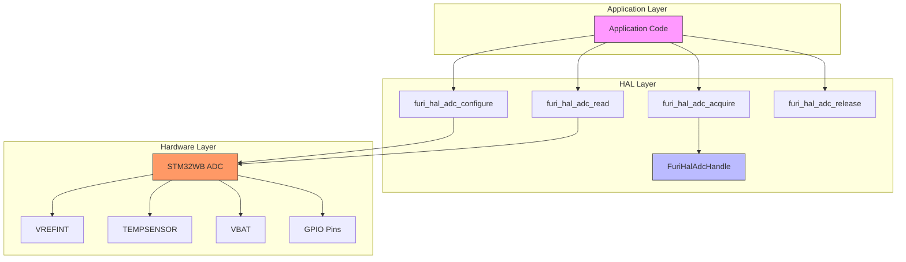
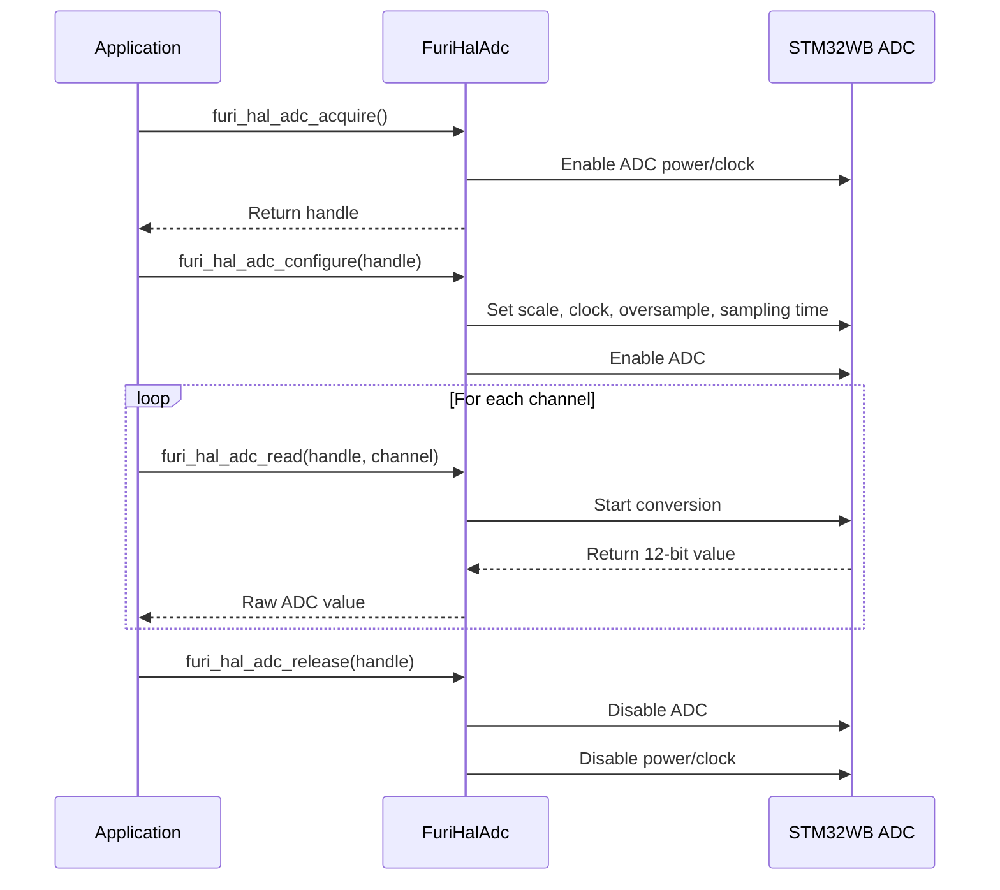

# ADC Interface

<cite>
**Referenced Files in This Document**   
- [example_adc.c](file://applications/examples/example_adc/example_adc.c)
- [furi_hal_adc.h](file://targets/furi_hal_include/furi_hal_adc.h)
- [battery_test_app.c](file://applications/debug/battery_test_app/battery_test_app.c)
</cite>

## Table of Contents
1. [Introduction](#introduction)
2. [ADC Architecture Overview](#adc-architecture-overview)
3. [ADC Channel Configuration](#adc-channel-configuration)
4. [Sampling Rate and Conversion Settings](#sampling-rate-and-conversion-settings)
5. [Data Acquisition Process](#data-acquisition-process)
6. [ADC Driver Architecture](#adc-driver-architecture)
7. [Real-World Usage Examples](#real-world-usage-examples)
8. [Power Management Integration](#power-management-integration)
9. [Noise Reduction and Accuracy Optimization](#noise-reduction-and-accuracy-optimization)
10. [Troubleshooting Common Issues](#troubleshooting-common-issues)

## Introduction

The ADC (Analog-to-Digital Converter) interface in the Flipper Zero firmware provides a hardware abstraction layer for analog signal measurement and conversion. This subsystem enables precise voltage, temperature, and battery level monitoring through a well-defined API that abstracts the complexities of the underlying STM32WB microcontroller's ADC hardware. The implementation focuses on simplicity while maintaining high accuracy for critical measurements such as battery voltage and internal temperature.

The ADC system is designed with power efficiency and measurement accuracy in mind, incorporating oversampling and specialized sampling times for different channel types. It supports both external GPIO pins and internal special channels for system monitoring. The interface follows a resource acquisition pattern where applications must acquire an ADC handle before performing conversions, ensuring proper resource management and preventing conflicts between different system components that may need ADC access.

**Section sources**
- [furi_hal_adc.h](file://targets/furi_hal_include/furi_hal_adc.h#L1-L50)
- [example_adc.c](file://applications/examples/example_adc/example_adc.c#L1-L20)

## ADC Architecture Overview



**Diagram sources**
- [furi_hal_adc.h](file://targets/furi_hal_include/furi_hal_adc.h#L30-L230)
- [example_adc.c](file://applications/examples/example_adc/example_adc.c#L50-L100)

**Section sources**
- [furi_hal_adc.h](file://targets/furi_hal_include/furi_hal_adc.h#L30-L230)

## ADC Channel Configuration

The ADC interface supports multiple channel types, categorized as fast channels (0-5), slow channels (6-18), and special internal channels. Channel configuration is handled through the `FuriHalAdcChannel` enum which defines all available channels. External GPIO pins can be configured as ADC inputs by initializing them in `GpioModeAnalog` mode using `furi_hal_gpio_init`.

Special internal channels include:
- **FuriHalAdcChannelVREFINT**: Internal voltage reference for calibration
- **FuriHalAdcChannelTEMPSENSOR**: On-die temperature sensor
- **FuriHalAdcChannelVBAT**: Battery voltage measurement (divided by 3)

The example application demonstrates channel configuration by iterating through available GPIO pins and identifying those connected to ADC channels. Each channel is associated with a converter function that transforms raw ADC values into meaningful physical units (voltage in mV or temperature in °C).

```c
furi_hal_gpio_init(gpio_pins[i].pin, GpioModeAnalog, GpioPullNo, GpioSpeedLow);
```

**Section sources**
- [furi_hal_adc.h](file://targets/furi_hal_include/furi_hal_adc.h#L80-L120)
- [example_adc.c](file://applications/examples/example_adc/example_adc.c#L70-L90)

## Sampling Rate and Conversion Settings

The ADC subsystem provides both default and extended configuration options for sampling parameters. The default configuration, set by `furi_hal_adc_configure`, uses optimized parameters for high-precision voltage measurements:

- **Scale**: FuriHalAdcScale2048 (2.048V reference)
- **Clock**: FuriHalAdcClockSync64 (64MHz synchronous)
- **Oversample**: FuriHalAdcOversample64 (64 samples averaged)
- **Sampling Time**: FuriHalAdcSamplingtime247_5 (247.5 ADC clocks)

The extended configuration function `furi_hal_adc_configure_ex` allows customization of all parameters. Oversampling settings range from 2 to 256 samples, with higher values improving noise immunity at the cost of increased conversion time. Sampling time options range from 2.5 to 640.5 ADC clocks, with longer times recommended for high-impedance circuits.

The total conversion time for the default configuration is approximately 260μs, calculated as (1/64)*(12.5+247.5)*64. The system recommends keeping circuit impedance below 10kΩ to maintain oversampling effectiveness.

**Section sources**
- [furi_hal_adc.h](file://targets/furi_hal_include/furi_hal_adc.h#L130-L180)

## Data Acquisition Process

The data acquisition process follows a structured sequence of operations:

1. Acquire ADC handle using `furi_hal_adc_acquire()`
2. Configure ADC with desired parameters using `furi_hal_adc_configure()` or `furi_hal_adc_configure_ex()`
3. Read ADC values using `furi_hal_adc_read()` for specific channels
4. Convert raw values to physical units using appropriate converter functions
5. Release ADC handle using `furi_hal_adc_release()`

The example application implements continuous monitoring by reading all configured channels in a loop and updating the display. Each read operation returns a 12-bit value (0-4095) representing the analog input level. The system uses converter functions like `furi_hal_adc_convert_to_voltage`, `furi_hal_adc_convert_temp`, and `furi_hal_adc_convert_vbat` to transform raw ADC values into meaningful measurements.



**Diagram sources**
- [furi_hal_adc.h](file://targets/furi_hal_include/furi_hal_adc.h#L180-L230)
- [example_adc.c](file://applications/examples/example_adc/example_adc.c#L120-L150)

**Section sources**
- [furi_hal_adc.h](file://targets/furi_hal_include/furi_hal_adc.h#L180-L230)
- [example_adc.c](file://applications/examples/example_adc/example_adc.c#L120-L150)

## ADC Driver Architecture

The ADC driver architecture follows a handle-based resource management pattern. The `FuriHalAdcHandle` structure (opaque to applications) manages the ADC hardware state and ensures exclusive access. The driver initializes the ADC subsystem during system startup via `furi_hal_adc_init()`.

Key architectural features include:
- **Resource acquisition/release**: Ensures proper power management and prevents conflicts
- **Default configuration**: Optimized settings for common use cases
- **Extended configuration**: Customizable parameters for specialized requirements
- **Internal voltage reference**: Uses on-chip 2.048V/2.5V references for accuracy
- **Oversampling support**: Software-averaged multiple samples to improve resolution

The driver is designed to work with the noisy SMPS (Switched-Mode Power Supply) environment by using the internal voltage reference rather than the power supply rail. This design choice significantly improves measurement stability and accuracy despite the noisy power domain.

**Section sources**
- [furi_hal_adc.h](file://targets/furi_hal_include/furi_hal_adc.h#L60-L100)

## Real-World Usage Examples

### Battery Voltage Monitoring

The battery test application demonstrates real-world ADC usage for battery monitoring, though it uses the power management record rather than direct ADC access:

```c
power_get_info(app->power, &app->info);
battery_info_data.gauge_voltage = app->info.voltage_gauge;
```

However, the ADC example shows direct VBAT measurement:

```c
data.items[item_pos].pin = &item_vbat;
data.items[item_pos].converter = furi_hal_adc_convert_vbat;
data.items[item_pos].suffix = "mV";
```

### Temperature and Reference Monitoring

The ADC example comprehensively demonstrates monitoring of internal sensors:

```c
// VREFINT for calibration
data.items[item_pos].pin = &item_vref;
data.items[item_pos].converter = furi_hal_adc_convert_vref;

// Temperature sensor
data.items[item_pos].pin = &item_temp;
data.items[item_pos].converter = furi_hal_adc_convert_temp;
```

These examples show the pattern of associating channels with appropriate converter functions to transform raw ADC values into meaningful physical measurements.

**Section sources**
- [example_adc.c](file://applications/examples/example_adc/example_adc.c#L80-L100)
- [battery_test_app.c](file://applications/debug/battery_test_app/battery_test_app.c#L50-L60)

## Power Management Integration

The ADC system is tightly integrated with the device's power management subsystem. The handle-based acquisition pattern ensures that ADC power and clock domains are only enabled when needed, reducing power consumption during idle periods.

The default configuration parameters represent a balance between accuracy and power efficiency. The 64MHz synchronous clock provides fast operation with minimal bus delay, while 64x oversampling achieves high precision without requiring extremely long sampling times. For battery-powered operation, applications could potentially use lower oversampling rates or slower clocks to further reduce power consumption when maximum precision is not required.

The system documentation notes that the analog domain is fed from the SMPS, which is inherently noisy. This design choice prioritizes power efficiency over signal purity, making the use of the internal voltage reference essential for accurate measurements.

**Section sources**
- [furi_hal_adc.h](file://targets/furi_hal_include/furi_hal_adc.h#L20-L40)
- [furi_hal_adc.h](file://targets/furi_hal_include/furi_hal_adc.h#L130-L180)

## Noise Reduction and Accuracy Optimization

The ADC implementation incorporates several techniques to maximize accuracy in a noisy environment:

1. **Internal Voltage Reference**: Using the stable 2.048V reference instead of the noisy SMPS output
2. **Oversampling**: Averaging 64 samples to effectively increase resolution and reduce noise
3. **Adequate Sampling Time**: 247.5 ADC clocks (3.87μs) for proper capacitor charging
4. **Impedance Matching**: Recommendation to keep circuit impedance below 10kΩ

The documentation emphasizes that for best results, signals should remain stable during the entire conversion period (260μs for default settings). For high-impedance sources, adding external filtering capacitors may be necessary to ensure accurate readings.

Special channels have specific requirements:
- **TEMPSENSOR**: Requires at least 5μs sampling time
- **VBAT**: Requires at least 12μs sampling time

These requirements are automatically handled by the driver when using the special channel definitions.

**Section sources**
- [furi_hal_adc.h](file://targets/furi_hal_include/furi_hal_adc.h#L130-L180)

## Troubleshooting Common Issues

### Low Measurement Accuracy

**Symptoms**: Inconsistent or inaccurate voltage readings
**Solutions**:
- Ensure circuit impedance is below 10kΩ
- Verify signal stability during the entire conversion period
- Use oscilloscope to check for signal distortion during sampling
- Consider increasing sampling time for high-impedance sources

### Noisy Measurements

**Symptoms**: High variation between consecutive readings
**Solutions**:
- Increase oversampling factor
- Add external filtering capacitor at the ADC input
- Ensure proper grounding and minimize trace lengths
- Avoid running analog traces near digital or switching power traces

### Slow Conversion Performance

**Symptoms**: Long delays when reading ADC values
**Solutions**:
- Reduce oversampling factor if high precision is not required
- Use faster clock settings
- Decrease sampling time for low-impedance sources
- Consider batch reading multiple channels in sequence

The system documentation warns that ADC configuration is "a world of magic" and recommends careful study of the STM32WB reference manual when deviating from default parameters, as incorrect settings can lead to poor results.

**Section sources**
- [furi_hal_adc.h](file://targets/furi_hal_include/furi_hal_adc.h#L20-L40)
- [furi_hal_adc.h](file://targets/furi_hal_include/furi_hal_adc.h#L130-L180)