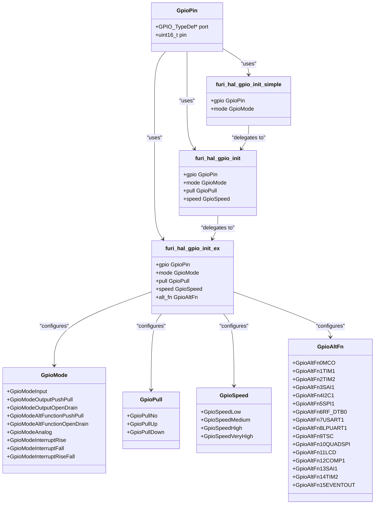
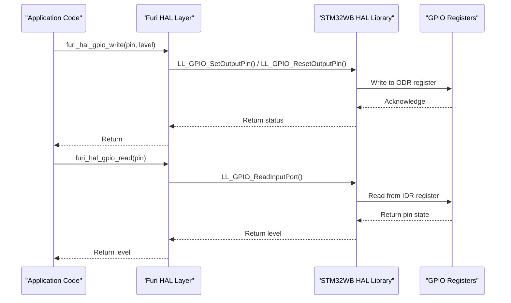
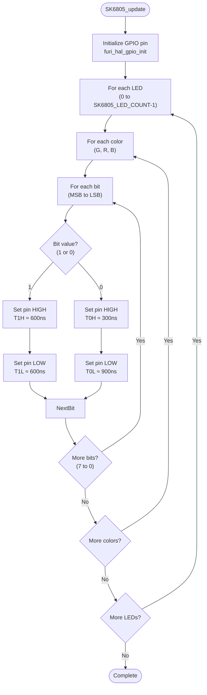

# GPIO Control

<cite>
**Referenced Files in This Document**   
- [furi_hal_gpio.h](file://targets/f7/furi_hal/furi_hal_gpio.h#L0-L287)
- [furi_hal_gpio.c](file://targets/f7/furi_hal/furi_hal_gpio.c#L0-L343)
- [SK6805.c](file://lib/drivers/SK6805.c#L0-L105)
- [SK6805.h](file://lib/drivers/SK6805.h#L0-L54)
- [blink_test.c](file://applications/debug/blink_test/blink_test.c#L0-L126)
- [keypad_test.c](file://applications/debug/keypad_test/keypad_test.c#L0-L151)
- [power.c](file://applications/services/power/power_service/power.c#L0-L673)
- [power.h](file://applications/services/power/power_service/power.h#L0-L116)
</cite>

## Table of Contents
1. [Introduction](#introduction)
2. [GPIO Initialization and Configuration](#gpio-initialization-and-configuration)
3. [Digital I/O Operations](#digital-io-operations)
4. [Pin Multiplexing and Alternate Functions](#pin-multiplexing-and-alternate-functions)
5. [GPIO in External Device Interfacing](#gpio-in-external-device-interfacing)
6. [Power Management and GPIO States](#power-management-and-gpio-states)
7. [Common Issues and Implementation Patterns](#common-issues-and-implementation-patterns)

## Introduction
This document provides a comprehensive analysis of the GPIO Control sub-feature in the Flipper Zero firmware, focusing on pin configuration, digital I/O operations, and integration with external devices. The documentation covers the implementation of GPIO initialization, mode setting, level reading/writing, and the interface between the Hardware Abstraction Layer (HAL) and physical GPIO registers. Special attention is given to practical applications such as controlling LEDs, reading button states, and interfacing with the SK6805 LED driver. The relationship between GPIO operations and power management is also examined, particularly regarding GPIO state maintenance during sleep modes.

## GPIO Initialization and Configuration

The GPIO subsystem in the Flipper Zero firmware provides a hierarchical API for pin configuration, with three levels of initialization functions that offer increasing levels of control over pin parameters. The configuration system is designed to abstract the underlying STM32WB microcontroller's GPIO registers while providing access to all essential pin characteristics including mode, pull-up/pull-down resistors, speed, and alternate functions.

**Diagram sources**
- [furi_hal_gpio.h](file://targets/f7/furi_hal/furi_hal_gpio.h#L0-L287)
- [furi_hal_gpio.c](file://targets/f7/furi_hal/furi_hal_gpio.c#L0-L343)

**Section sources**
- [furi_hal_gpio.h](file://targets/f7/furi_hal/furi_hal_gpio.h#L0-L287)
- [furi_hal_gpio.c](file://targets/f7/furi_hal/furi_hal_gpio.c#L0-L343)

The GPIO initialization system provides three function variants with increasing levels of configuration control:

1. **Simple initialization** (`furi_hal_gpio_init_simple`): Configures a pin with only mode specification, using default values for pull-up/pull-down (no pull) and speed (low).
2. **Normal initialization** (`furi_hal_gpio_init`): Allows specification of mode, pull-up/pull-down, and speed parameters.
3. **Extended initialization** (`furi_hal_gpio_init_ex`): Provides full control including alternate function selection for multiplexed pins.

The implementation uses critical sections (via `FURI_CRITICAL_ENTER()` and `FURI_CRITICAL_EXIT()`) to ensure atomic configuration of GPIO registers, preventing race conditions in multi-threaded environments. When configuring interrupt modes, the function sets up the EXTI (External Interrupt) controller and configures the appropriate trigger conditions (rising, falling, or both edges).

## Digital I/O Operations

Digital I/O operations in the Flipper Zero firmware are implemented through direct register access via the STM32WB HAL library, with wrapper functions provided in the Furi HAL layer. The system provides functions for both reading and writing GPIO pin levels, with operations designed for efficiency and real-time performance.

**Diagram sources**
- [furi_hal_gpio.c](file://targets/f7/furi_hal/furi_hal_gpio.c#L0-L343)
- [SK6805.c](file://lib/drivers/SK6805.c#L0-L105)

**Section sources**
- [furi_hal_gpio.c](file://targets/f7/furi_hal/furi_hal_gpio.c#L0-L343)
- [SK6805.c](file://lib/drivers/SK6805.c#L0-L105)

The digital I/O operations are implemented as follows:

- **Writing to GPIO pins**: The `furi_hal_gpio_write` function (not explicitly shown in the provided code but referenced in multiple files) uses the STM32WB LL (Low Layer) functions `LL_GPIO_SetOutputPin` and `LL_GPIO_ResetOutputPin` to set or clear the output data register (ODR) bit corresponding to the specified pin.
- **Reading from GPIO pins**: The `furi_hal_gpio_read` function (referenced in multiple files) uses `LL_GPIO_ReadInputPort` to read the input data register (IDR) and extract the state of the specified pin.

These operations are optimized for performance, with direct register access avoiding the overhead of higher-level abstractions. The use of the LL interface provides minimal overhead while maintaining portability across STM32 microcontrollers.

## Pin Multiplexing and Alternate Functions

Pin multiplexing in the Flipper Zero firmware is managed through the extended GPIO initialization function `furi_hal_gpio_init_ex`, which includes a parameter for specifying alternate functions. The system supports 16 alternate function mappings (GpioAltFn0 through GpioAltFn15), allowing GPIO pins to be configured for various peripheral functions beyond basic digital I/O.

The alternate function system maps specific pin configurations to hardware peripherals such as:
- **I2C interfaces** (GpioAltFn4I2C1, GpioAltFn4I2C3)
- **SPI interfaces** (GpioAltFn5SPI1, GpioAltFn5SPI2)
- **USART/LPUART** (GpioAltFn7USART1, GpioAltFn8LPUART1)
- **Timers** (GpioAltFn1TIM1, GpioAltFn2TIM2, etc.)
- **RF subsystem** (GpioAltFn6RF_DTB0 through GpioAltFn6RF_NSS)
- **USB interface** (GpioAltFn10USB)

When a pin is configured with an alternate function, the GPIO hardware routes the pin to the corresponding peripheral controller instead of the standard input/output circuitry. This allows the same physical pin to serve multiple purposes depending on the application requirements.

The implementation in `furi_hal_gpio_init_ex` handles alternate function configuration by:
1. Determining whether the pin number is in the 0-7 or 8-15 range (as the STM32WB uses separate registers for these pin groups)
2. Using the appropriate LL_GPIO_SetAFPin_0_7 or LL_GPIO_SetAFPin_8_15 function to configure the alternate function register
3. Setting the GPIO mode to `LL_GPIO_MODE_ALTERNATE` with the appropriate output type (push-pull or open-drain)

This multiplexing capability is essential for maximizing the functionality of the limited number of GPIO pins available on the microcontroller while maintaining flexibility for different hardware configurations and expansion modules.

**Section sources**
- [furi_hal_gpio.h](file://targets/f7/furi_hal/furi_hal_gpio.h#L0-L287)
- [furi_hal_gpio.c](file://targets/f7/furi_hal/furi_hal_gpio.c#L0-L343)

## GPIO in External Device Interfacing

The GPIO system is extensively used for interfacing with external devices, with the SK6805 LED driver serving as a prime example of how GPIO pins can be used for specialized communication protocols. The SK6805 driver demonstrates advanced GPIO usage patterns including precise timing control and data serialization.

**Diagram sources**
- [SK6805.c](file://lib/drivers/SK6805.c#L0-L105)

**Section sources**
- [SK6805.c](file://lib/drivers/SK6805.c#L0-L105)
- [SK6805.h](file://lib/drivers/SK6805.h#L0-L54)

The SK6805 driver implementation reveals several important patterns in GPIO-based device interfacing:

1. **Precise timing control**: The driver uses the DWT (Data Watchpoint and Trace) cycle counter to achieve nanosecond-level timing precision required by the SK6805 protocol. The timing values (30, 26, 11, 43 cycles) are carefully calibrated to meet the SK6805's T1H, T1L, T0H, and T0L specifications.

2. **Critical section protection**: The entire update sequence runs within a critical section (`FURI_CRITICAL_ENTER`/`FURI_CRITICAL_EXIT`) to prevent interruptions that could disrupt the timing-sensitive protocol.

3. **Data serialization**: The RGB color data is serialized bit by bit, with the green channel transmitted first (despite being stored second in the buffer), followed by red and blue, following the SK6805's expected data format.

4. **Memory buffering**: Color values are stored in a buffer (`led_buffer`) before transmission, allowing the application to set colors without blocking on the relatively slow transmission process.

Additional examples from the codebase show other GPIO interfacing patterns:

- **LED control**: The blink_test application uses the notification system to control LEDs, demonstrating higher-level abstractions built on top of GPIO operations.
- **Button input**: The keypad_test application shows how GPIO inputs are processed through the input event system, with state tracking for press, release, and short events.

## Power Management and GPIO States

The relationship between GPIO operations and power management is critical for maintaining system stability and ensuring proper behavior during sleep modes. While the provided code does not explicitly show GPIO state management during sleep, the power management system interacts with GPIO through several mechanisms.

The power service (`power.c` and `power.h`) manages overall system power states but does not directly control individual GPIO pins. However, the implementation reveals important considerations for GPIO in power-sensitive applications:

1. **Power-aware initialization**: The GPIO initialization functions include power-related configurations, such as enabling pull-up/pull-down resistors at the power controller level (`LL_PWR_EnableGPIOPullUp`, `LL_PWR_EnableGPIOPullDown`) to ensure proper pin states even in low-power modes.

2. **State preservation**: The critical section protection used in GPIO configuration ensures atomic updates that prevent transient states during configuration changes, which is particularly important when transitioning between power modes.

3. **Peripheral coordination**: The power management system likely coordinates with GPIO configurations when enabling or disabling peripherals, though this interaction is not explicitly visible in the provided code.

In sleep modes, the STM32WB microcontroller can maintain GPIO states while reducing power consumption through various low-power modes (Sleep, Stop, Standby). The firmware would need to ensure that:
- Critical GPIO pins (such as those used for wake-up interrupts) are properly configured before entering sleep mode
- Pull-up/pull-down resistors are enabled as needed to prevent floating inputs
- Output pins are set to appropriate states to minimize power consumption

The absence of explicit sleep mode GPIO management in the provided code suggests that the system relies on the STM32WB's hardware capabilities to maintain GPIO states across power mode transitions, with the firmware ensuring proper configuration before mode changes.

**Section sources**
- [power.c](file://applications/services/power/power_service/power.c#L0-L673)
- [power.h](file://applications/services/power/power_service/power.h#L0-L116)
- [furi_hal_gpio.c](file://targets/f7/furi_hal/furi_hal_gpio.c#L0-L343)

## Common Issues and Implementation Patterns

Several common issues and implementation patterns emerge from the analysis of the GPIO codebase, providing valuable insights for developers working with the system.

### Pin Contention and Signal Integrity
The codebase addresses potential pin contention through:
- **Exclusive initialization**: The use of critical sections during GPIO configuration prevents race conditions when multiple components attempt to configure the same pin.
- **Clear ownership patterns**: Hardware resources like the SK6805 LED driver have dedicated initialization functions that establish clear ownership of GPIO pins.
- **Proper pull-up/pull-down configuration**: The ability to configure pull resistors helps prevent floating inputs and improves signal integrity.

### Proper Initialization Sequences
The hierarchical initialization API promotes proper initialization sequences:
1. **Simple cases**: Use `furi_hal_gpio_init_simple` for basic digital I/O where default parameters are acceptable.
2. **Controlled configurations**: Use `furi_hal_gpio_init` when specific pull-up/pull-down or speed requirements exist.
3. **Peripheral integration**: Use `furi_hal_gpio_init_ex` when configuring pins for alternate functions or complex peripheral interfaces.

### Error Handling and Validation
The implementation includes robust error handling:
- **Parameter validation**: The `furi_check` macro validates input parameters, crashing with a descriptive message if invalid arguments are provided.
- **Bounds checking**: Functions like `SK6805_set_led_color` include bounds checking (`furi_check(led_index < SK6805_LED_COUNT)`) to prevent buffer overflows.
- **State consistency**: Critical sections ensure that GPIO configuration changes are atomic, preventing intermediate states that could cause system instability.

### Performance Optimization Patterns
Several performance optimization patterns are evident:
- **Direct register access**: Using the STM32WB LL interface minimizes function call overhead.
- **Cycle-count timing**: For time-critical applications like the SK6805 driver, direct cycle counting provides precise timing control.
- **Batch operations**: The SK6805 driver buffers color data and transmits it in a single operation, minimizing the number of GPIO state changes.

These implementation patterns demonstrate a mature GPIO subsystem that balances ease of use with performance and reliability, providing a solid foundation for both simple digital I/O operations and complex peripheral interfacing.

**Section sources**
- [furi_hal_gpio.c](file://targets/f7/furi_hal/furi_hal_gpio.c#L0-L343)
- [SK6805.c](file://lib/drivers/SK6805.c#L0-L105)
- [blink_test.c](file://applications/debug/blink_test/blink_test.c#L0-L126)
- [keypad_test.c](file://applications/debug/keypad_test/keypad_test.c#L0-L151)