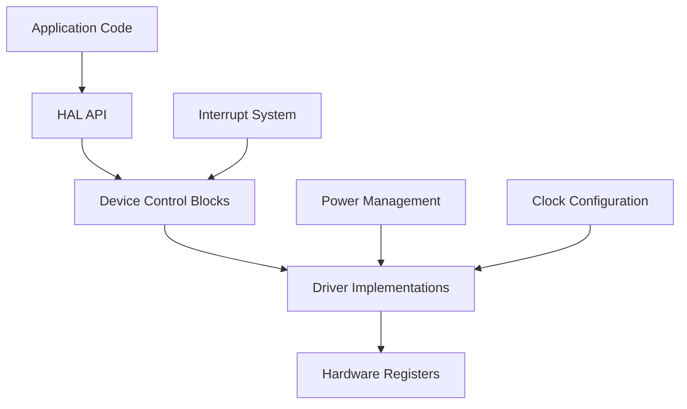
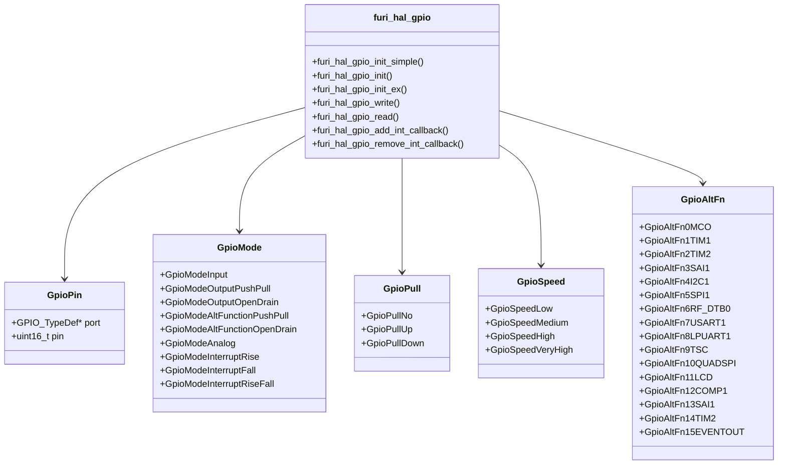
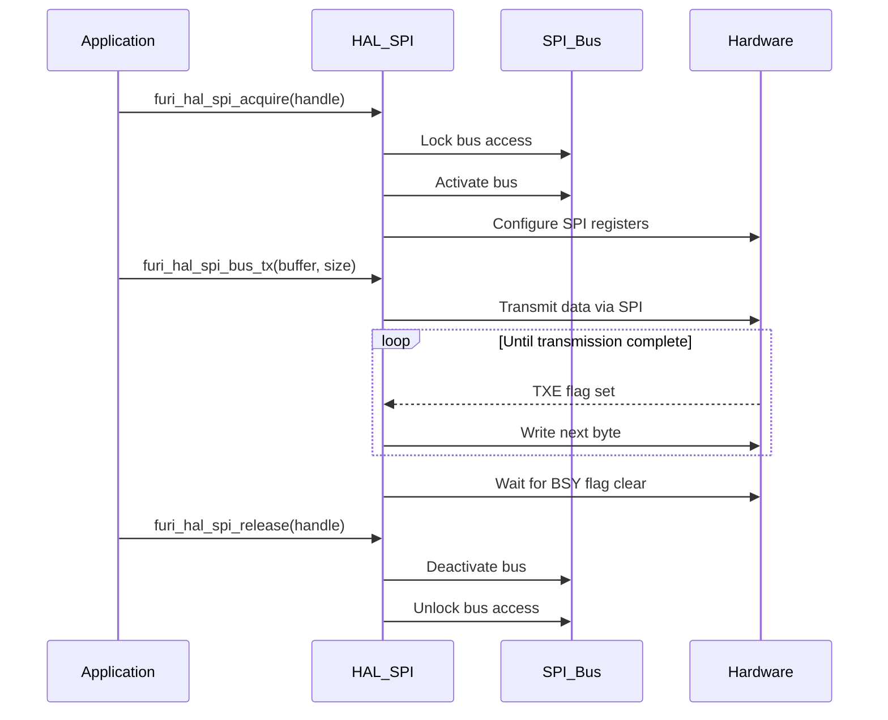
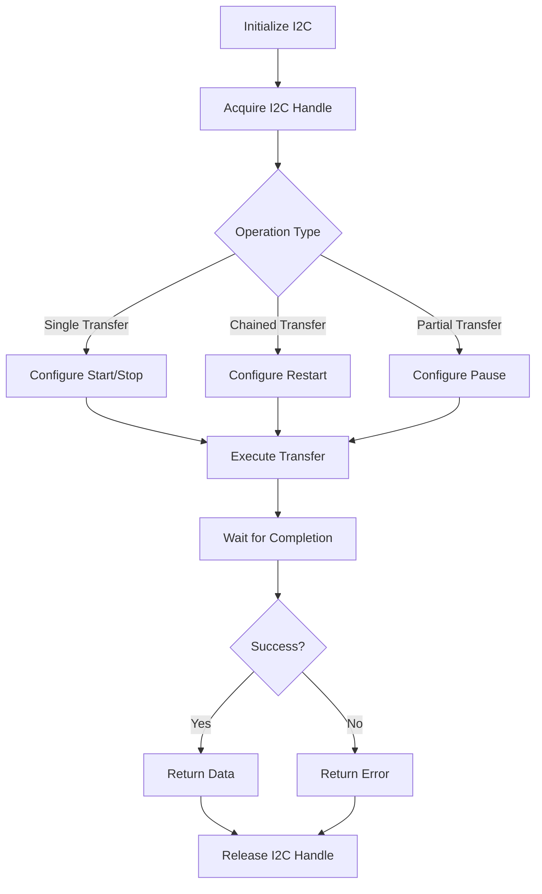
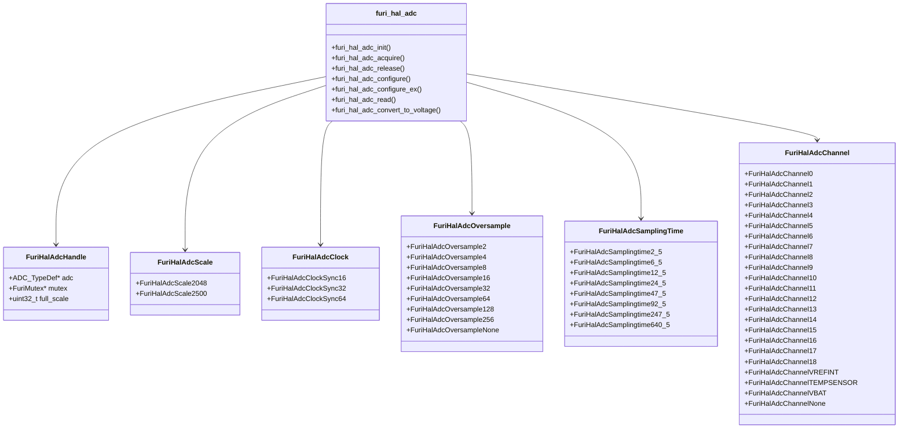
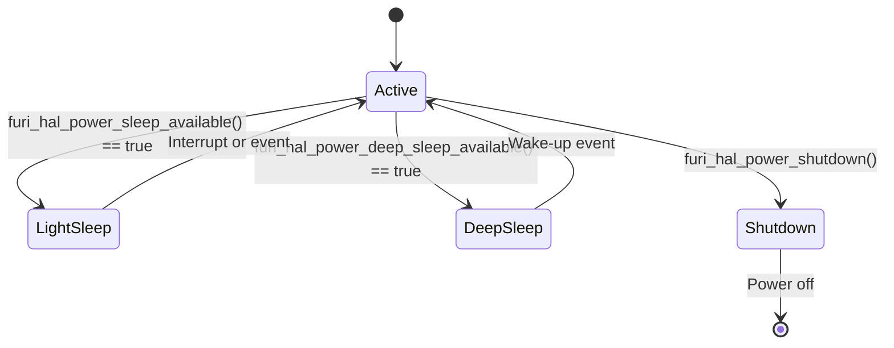

# Hardware Abstraction Layer (HAL)

<cite>
**Referenced Files in This Document**   
- [furi_hal.h](file://targets/furi_hal_include/furi_hal.h)
- [furi_hal_gpio.h](file://targets/f7/furi_hal/furi_hal_gpio.h)
- [furi_hal_gpio.c](file://targets/f7/furi_hal/furi_hal_gpio.c)
- [furi_hal_spi.h](file://targets/furi_hal_include/furi_hal_spi.h)
- [furi_hal_spi.c](file://targets/f7/furi_hal/furi_hal_spi.c)
- [furi_hal_i2c.h](file://targets/furi_hal_include/furi_hal_i2c.h)
- [furi_hal_i2c.c](file://targets/f7/furi_hal/furi_hal_i2c.c)
- [furi_hal_adc.h](file://targets/furi_hal_include/furi_hal_adc.h)
- [furi_hal_adc.c](file://targets/f7/furi_hal/furi_hal_adc.c)
- [furi_hal_power.h](file://targets/furi_hal_include/furi_hal_power.h)
- [furi_hal_power.c](file://targets/f7/furi_hal/furi_hal_power.c)
</cite>

## Table of Contents
1. [Introduction](#introduction)
2. [Hardware Abstraction Layer Architecture](#hardware-abstraction-layer-architecture)
3. [Peripheral Access and Control](#peripheral-access-and-control)
   - [GPIO Management](#gpio-management)
   - [SPI Communication](#spi-communication)
   - [I2C Communication](#i2c-communication)
   - [ADC Operations](#adc-operations)
4. [Device Control Blocks and Driver Registration](#device-control-blocks-and-driver-registration)
5. [Interrupt Handling](#interrupt-handling)
6. [Power Management](#power-management)
7. [Clock Configuration](#clock-configuration)
8. [Practical Examples](#practical-examples)
9. [Common Integration Challenges](#common-integration-challenges)

## Introduction
The Hardware Abstraction Layer (HAL) in the Flipper Zero firmware provides a unified interface for applications to interact with hardware peripherals without requiring direct knowledge of the underlying hardware specifics. This abstraction enables portability across different hardware targets and simplifies application development by providing consistent APIs for GPIO, SPI, I2C, ADC, and other peripherals. The HAL is designed with a modular architecture that separates hardware-specific implementations from application-facing interfaces, allowing for clean integration and maintenance.

**Section sources**
- [furi_hal.h](file://targets/furi_hal_include/furi_hal.h#L1-L78)

## Hardware Abstraction Layer Architecture
The HAL architecture follows a layered design pattern where high-level application code interacts with abstract interfaces, which are implemented by hardware-specific drivers. The core components include device control blocks, driver registration mechanisms, and a centralized initialization system. Each peripheral type has a dedicated header file in the `furi_hal_include` directory that defines the public API, while the actual implementations reside in target-specific directories like `f7/furi_hal`.

The architecture employs a callback-based design for bus operations, allowing for flexible configuration and extension. Device handles are used to manage access to peripherals, ensuring proper resource allocation and preventing conflicts between concurrent operations. The HAL also integrates with the system's power management and clock configuration subsystems to optimize energy consumption and performance.



**Diagram sources**
- [furi_hal.h](file://targets/furi_hal_include/furi_hal.h#L1-L78)
- [furi_hal_gpio.h](file://targets/f7/furi_hal/furi_hal_gpio.h#L1-L287)

## Peripheral Access and Control

### GPIO Management
The GPIO subsystem provides comprehensive control over general-purpose input/output pins with support for various modes including input, output (push-pull and open-drain), alternate functions, analog, and interrupt configurations. The API offers three initialization functions with increasing levels of configuration detail:

- `furi_hal_gpio_init_simple()` - Basic initialization with mode only
- `furi_hal_gpio_init()` - Standard initialization with mode, pull, and speed
- `furi_hal_gpio_init_ex()` - Extended initialization with alternate function specification

The GPIO implementation uses STM32's LL (Low Layer) libraries for direct register access, ensuring minimal overhead. Interrupt handling is managed through a global array of callback functions, with critical sections protected by disabling interrupts during configuration changes.



**Diagram sources**
- [furi_hal_gpio.h](file://targets/f7/furi_hal/furi_hal_gpio.h#L1-L287)
- [furi_hal_gpio.c](file://targets/f7/furi_hal/furi_hal_gpio.c#L1-L343)

**Section sources**
- [furi_hal_gpio.h](file://targets/f7/furi_hal/furi_hal_gpio.h#L1-L287)
- [furi_hal_gpio.c](file://targets/f7/furi_hal/furi_hal_gpio.c#L1-L343)

### SPI Communication
The SPI subsystem provides a robust interface for serial peripheral communication with support for both standard and DMA-based transfers. The architecture uses a bus and handle pattern where multiple devices can share a SPI bus through dedicated handles. The implementation includes comprehensive error checking and timeout handling to ensure reliable communication.

Key features include:
- Bus acquisition and release mechanisms to prevent conflicts
- Support for transmit, receive, and combined transmit-receive operations
- DMA support for high-throughput applications
- Configurable clock speeds and data modes
- Timeout parameters for all operations

The SPI implementation manages power states through the insomnia system, ensuring the device remains awake during active communication. The bus configuration is handled through callback functions that allow for target-specific initialization and deinitialization.



**Diagram sources**
- [furi_hal_spi.h](file://targets/furi_hal_include/furi_hal_spi.h#L1-L128)
- [furi_hal_spi.c](file://targets/f7/furi_hal/furi_hal_spi.c#L1-L379)

**Section sources**
- [furi_hal_spi.h](file://targets/furi_hal_include/furi_hal_spi.h#L1-L128)
- [furi_hal_spi.c](file://targets/f7/furi_hal/furi_hal_spi.c#L1-L379)

### I2C Communication
The I2C subsystem provides a flexible interface for inter-integrated circuit communication with support for standard, fast, and fast-plus modes. The implementation supports both 7-bit and 10-bit addressing, and includes advanced features like transaction chaining with restart conditions and partial transfers.

The API offers multiple transfer functions:
- Standard transmit and receive operations
- Extended versions with configurable start/stop conditions
- Combined transmit-receive operations
- Device presence detection
- Register-level read/write operations

The I2C implementation uses hardware-level transaction management with timeout protection to prevent bus lockups. The system handles clock stretching and bus arbitration automatically, while providing detailed error reporting for troubleshooting.



**Diagram sources**
- [furi_hal_i2c.h](file://targets/furi_hal_include/furi_hal_i2c.h#L1-L288)
- [furi_hal_i2c.c](file://targets/f7/furi_hal/furi_hal_i2c.c#L1-L417)

**Section sources**
- [furi_hal_i2c.h](file://targets/furi_hal_include/furi_hal_i2c.h#L1-L288)
- [furi_hal_i2c.c](file://targets/f7/furi_hal/furi_hal_i2c.c#L1-L417)

### ADC Operations
The ADC subsystem provides high-precision analog-to-digital conversion with configurable resolution, sampling rates, and voltage references. The implementation uses the internal voltage reference (2.048V or 2.5V) for improved accuracy and stability. The API is designed for single-channel, single-conversion operations with support for oversampling to improve effective resolution.

Key configuration parameters include:
- Voltage scale (2.048V or 2.5V)
- Clock source (16, 32, or 64 MHz)
- Oversampling ratio (2x to 256x)
- Sampling time (2.5 to 640.5 ADC cycles)

The ADC implementation includes automatic power management, enabling the ADC peripheral only when needed and disabling it afterward to conserve power. The system also provides utility functions to convert raw ADC values to voltage measurements in millivolts.



**Diagram sources**
- [furi_hal_adc.h](file://targets/furi_hal_include/furi_hal_adc.h#L1-L230)
- [furi_hal_adc.c](file://targets/f7/furi_hal/furi_hal_adc.c#L1-L282)

**Section sources**
- [furi_hal_adc.h](file://targets/furi_hal_include/furi_hal_adc.h#L1-L230)
- [furi_hal_adc.c](file://targets/f7/furi_hal/furi_hal_adc.c#L1-L282)

## Device Control Blocks and Driver Registration
The HAL uses device control blocks to manage peripheral instances and their state. Each peripheral type has a dedicated control block structure that contains pointers to hardware registers, configuration parameters, and operational state. These control blocks are initialized during system startup and registered with the HAL core.

Driver registration follows a callback-based pattern where each peripheral implementation provides function pointers for initialization, configuration, and operation. This allows the HAL to maintain a consistent interface while supporting different hardware implementations across various targets. The registration system also handles resource allocation and conflict resolution when multiple applications attempt to access the same peripheral.

The device control block pattern enables dynamic reconfiguration of peripherals at runtime, allowing applications to modify settings such as clock speeds, data formats, and power modes without requiring complete reinitialization.

## Interrupt Handling
The interrupt handling system in the HAL provides a flexible framework for managing hardware interrupts from various peripherals. The architecture uses a callback registration mechanism where applications can register functions to be called when specific interrupt conditions occur. Each GPIO pin can have an associated interrupt callback, with context data passed to the callback function for state management.

The implementation includes critical section protection to prevent race conditions during interrupt configuration changes. The system also provides mechanisms for enabling and disabling interrupts atomically, ensuring consistent behavior even in multi-threaded environments. For peripherals like SPI and I2C, interrupt handling is integrated with the DMA subsystem to enable high-performance data transfers with minimal CPU overhead.

Interrupt priorities are managed through the NVIC (Nested Vectored Interrupt Controller), with configurable priority levels to ensure timely response to critical events. The HAL also provides utilities for measuring interrupt latency and debugging interrupt-related issues.

## Power Management
The power management system in the HAL provides comprehensive control over the device's power states and energy consumption. The architecture includes multiple power modes ranging from active operation to deep sleep, with automatic transitions based on system activity.

Key features include:
- Insomnia system to prevent sleep during active operations
- Dynamic voltage and frequency scaling
- Peripheral power gating
- Battery monitoring and charging control
- OTG (On-The-Go) power management

The insomnia system uses a reference counting mechanism where each active operation increments a counter, preventing the system from entering sleep mode until all operations are complete. This ensures reliable operation of time-sensitive peripherals like SPI and I2C while maximizing battery life during idle periods.



**Diagram sources**
- [furi_hal_power.h](file://targets/furi_hal_include/furi_hal_power.h#L1-L227)
- [furi_hal_power.c](file://targets/f7/furi_hal/furi_hal_power.c#L1-L744)

**Section sources**
- [furi_hal_power.h](file://targets/furi_hal_include/furi_hal_power.h#L1-L227)
- [furi_hal_power.c](file://targets/f7/furi_hal/furi_hal_power.c#L1-L744)

## Clock Configuration
The clock configuration system manages the device's clock sources and frequencies to balance performance and power consumption. The implementation supports multiple clock sources including HSI (High Speed Internal), HSE (High Speed External), and PLL (Phase-Locked Loop). The system can dynamically switch between clock sources based on operating conditions and power requirements.

Clock configuration is integrated with the power management system, automatically adjusting clock speeds when entering different power modes. The HAL provides APIs for querying current clock frequencies and requesting specific clock configurations for time-sensitive operations. Peripheral clocks are managed individually, allowing unused peripherals to have their clocks disabled to save power.

## Practical Examples
Practical usage of the HAL follows a consistent pattern across different peripherals:

1. Initialize the GPIO pin for the desired function
2. Acquire the peripheral handle
3. Configure the peripheral parameters
4. Perform the desired operations
5. Release the peripheral handle

For example, reading from an ADC channel:
```c
FuriHalAdcHandle* adc = furi_hal_adc_acquire();
furi_hal_adc_configure(adc);
uint16_t raw_value = furi_hal_adc_read(adc, FuriHalAdcChannel1);
float voltage = furi_hal_adc_convert_to_voltage(adc, raw_value);
furi_hal_adc_release(adc);
```

Similarly, SPI communication with a sensor:
```c
furi_hal_spi_acquire(&spi_handle);
bool success = furi_hal_spi_bus_tx(&spi_handle, tx_buffer, size, 100);
furi_hal_spi_release(&spi_handle);
```

These patterns ensure proper resource management and prevent conflicts between concurrent operations.

## Common Integration Challenges
Common challenges when integrating with the HAL include:
- Proper resource management and handle lifecycle
- Timing constraints for time-sensitive operations
- Power management considerations for battery-powered devices
- Interrupt priority conflicts
- Clock configuration requirements for high-speed peripherals

Best practices to address these challenges include:
- Always pairing acquire and release calls
- Using appropriate timeout values for operations
- Managing insomnia levels correctly
- Configuring clock sources before high-speed operations
- Testing interrupt handlers thoroughly

The HAL provides comprehensive error checking and assertion mechanisms to help identify and resolve integration issues during development.