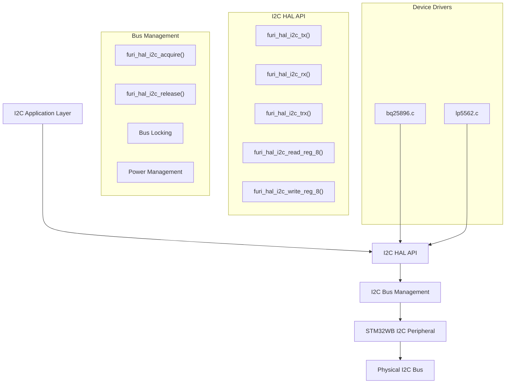
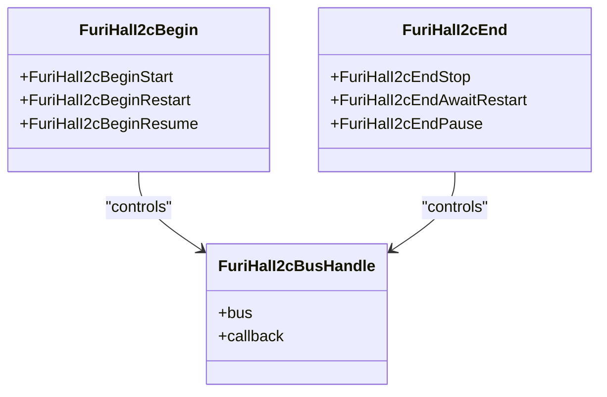
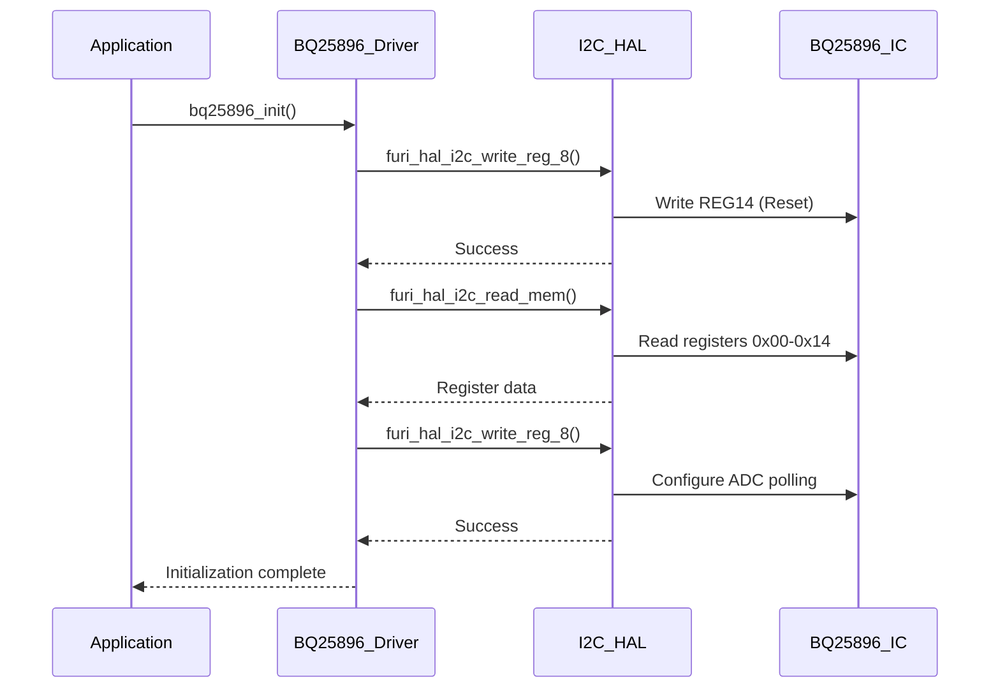
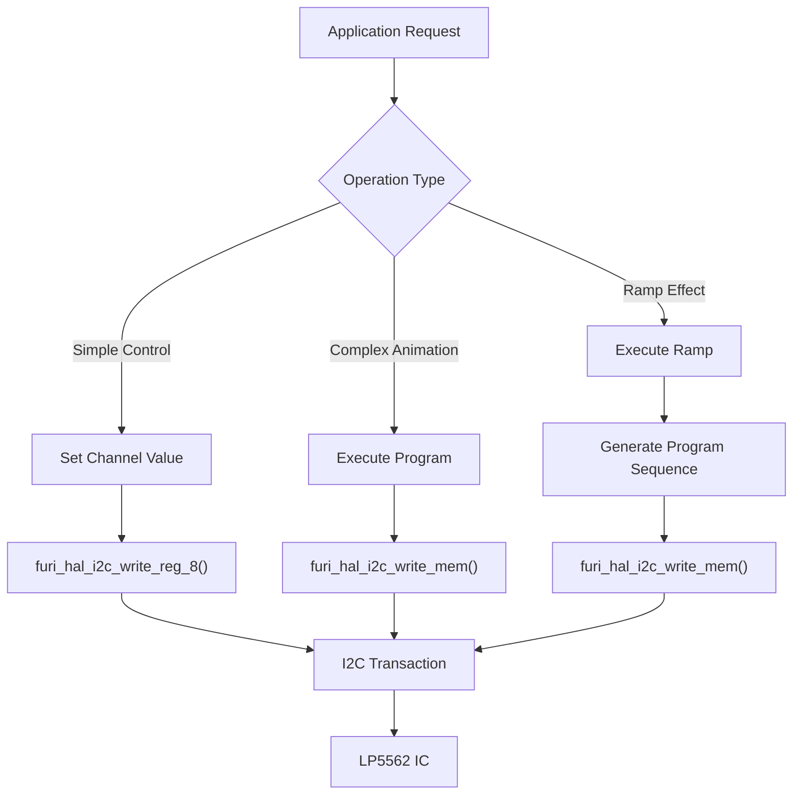
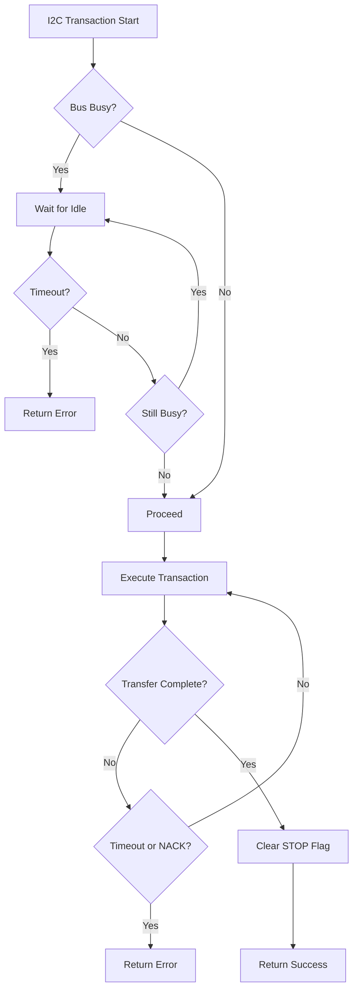
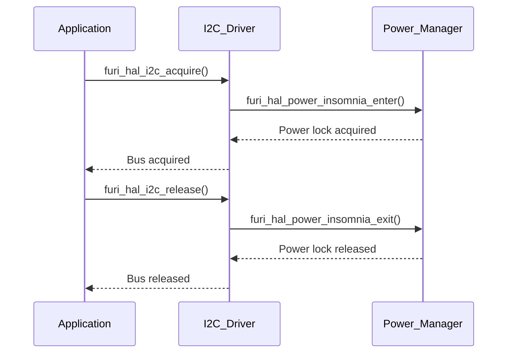

# I2C Interface

<cite>
**Referenced Files in This Document**   
- [furi_hal_i2c.h](file://targets/furi_hal_include/furi_hal_i2c.h)
- [furi_hal_i2c.c](file://targets/f7/furi_hal/furi_hal_i2c.c)
- [bq25896.c](file://lib/drivers/bq25896.c)
- [bq25896.h](file://lib/drivers/bq25896.h)
- [bq25896_reg.h](file://lib/drivers/bq25896_reg.h)
- [lp5562.c](file://lib/drivers/lp5562.c)
- [lp5562.h](file://lib/drivers/lp5562.h)
- [lp5562_reg.h](file://lib/drivers/lp5562_reg.h)
</cite>

## Table of Contents
1. [Introduction](#introduction)
2. [I2C Driver Architecture](#i2c-driver-architecture)
3. [I2C Master Functionality Implementation](#i2c-master-functionality-implementation)
4. [Device-Specific Implementations](#device-specific-implementations)
5. [Error Handling and Recovery](#error-handling-and-recovery)
6. [Power Management Integration](#power-management-integration)
7. [Common Issues and Solutions](#common-issues-and-solutions)

## Introduction
The I2C (Inter-Integrated Circuit) interface in the Flipper Zero firmware provides a robust two-wire serial communication protocol for interacting with various peripheral devices. This document details the implementation of the I2C master functionality, focusing on the hardware abstraction layer, device drivers, and integration with system power management. The I2C subsystem enables communication with critical components such as the BQ25896 power management IC and the LP5562 LED controller, facilitating essential functions like battery charging, voltage monitoring, and RGB lighting control.

**Section sources**
- [furi_hal_i2c.h](file://targets/furi_hal_include/furi_hal_i2c.h#L1-L288)

## I2C Driver Architecture



**Diagram sources**
- [furi_hal_i2c.h](file://targets/furi_hal_include/furi_hal_i2c.h#L1-L288)
- [furi_hal_i2c.c](file://targets/f7/furi_hal/furi_hal_i2c.c#L1-L417)

**Section sources**
- [furi_hal_i2c.h](file://targets/furi_hal_include/furi_hal_i2c.h#L1-L288)
- [furi_hal_i2c.c](file://targets/f7/furi_hal/furi_hal_i2c.c#L1-L417)

## I2C Master Functionality Implementation

The I2C master functionality is implemented through a comprehensive hardware abstraction layer (HAL) that provides both basic and advanced transaction capabilities. The architecture is designed to handle various I2C communication patterns, including standard transfers, combined transactions, and complex sequences with restart conditions.

### Transaction Control Mechanisms

The I2C HAL API defines precise control over transaction initiation and termination through enumeration types that specify how transactions should begin and end:



**Diagram sources**
- [furi_hal_i2c.h](file://targets/furi_hal_include/furi_hal_i2c.h#L15-L50)

The transaction control mechanisms enable sophisticated I2C communication patterns:
- **FuriHalI2cBeginStart**: Initiates a transaction with a START condition followed by the slave address
- **FuriHalI2cBeginRestart**: Sends a RESTART condition, allowing consecutive transactions without releasing the bus
- **FuriHalI2cBeginResume**: Continues a paused transaction of the same type (RX/TX)
- **FuriHalI2cEndStop**: Terminates the transaction with a STOP condition
- **FuriHalI2cEndAwaitRestart**: Ends with clock stretching, awaiting a restart from the master
- **FuriHalI2cEndPause**: Pauses the transaction with clock stretching for later resumption

### Core Transaction Functions

The I2C driver provides a layered API with both simplified and extended functions for different use cases:

```c
// Simplified transaction functions
bool furi_hal_i2c_tx(
    FuriHalI2cBusHandle* handle,
    uint8_t address,
    const uint8_t* data,
    size_t size,
    uint32_t timeout);

bool furi_hal_i2c_rx(
    FuriHalI2cBusHandle* handle,
    uint8_t address,
    uint8_t* data,
    size_t size,
    uint32_t timeout);

// Extended transaction functions with advanced control
bool furi_hal_i2c_tx_ext(
    FuriHalI2cBusHandle* handle,
    uint16_t address,
    bool ten_bit,
    const uint8_t* data,
    size_t size,
    FuriHalI2cBegin begin,
    FuriHalI2cEnd end,
    uint32_t timeout);

bool furi_hal_i2c_rx_ext(
    FuriHalI2cBusHandle* handle,
    uint16_t address,
    bool ten_bit,
    uint8_t* data,
    size_t size,
    FuriHalI2cBegin begin,
    FuriHalI2cEnd end,
    uint32_t timeout);
```

The implementation handles transactions in chunks of up to 255 bytes, automatically managing larger transfers by splitting them into multiple segments with appropriate end conditions.

**Section sources**
- [furi_hal_i2c.c](file://targets/f7/furi_hal/furi_hal_i2c.c#L200-L417)

## Device-Specific Implementations

### BQ25896 Power Management IC Integration

The BQ25896 charger IC driver demonstrates a comprehensive implementation of I2C-based power management functionality. The driver uses the I2C HAL API to configure and monitor the charging system.



**Diagram sources**
- [bq25896.c](file://lib/drivers/bq25896.c#L1-L208)
- [bq25896_reg.h](file://lib/drivers/bq25896_reg.h#L1-L276)

The BQ25896 driver implements several key features:
- **Initialization sequence**: Resets the device and configures essential parameters
- **Register-based access**: Uses 8-bit register writes and reads for configuration
- **Memory access**: Reads multiple consecutive registers efficiently
- **Voltage and current monitoring**: Provides functions to read battery, system, and bus voltages
- **Charging control**: Enables/disables charging and OTG functionality

Key implementation details:
- Device address: 0xD6 (7-bit)
- I2C timeout: 50ms
- Uses combined write-read transactions (TRX) for register access
- Implements register caching for improved performance

**Section sources**
- [bq25896.c](file://lib/drivers/bq25896.c#L1-L208)
- [bq25896.h](file://lib/drivers/bq25896.h#L1-L68)
- [bq25896_reg.h](file://lib/drivers/bq25896_reg.h#L1-L276)

### LP5562 LED Controller Integration

The LP5562 RGB LED controller driver showcases advanced I2C functionality, including program execution and timing control.



**Diagram sources**
- [lp5562.c](file://lib/drivers/lp5562.c#L1-L265)
- [lp5562_reg.h](file://lib/drivers/lp5562_reg.h#L1-L98)

The LP5562 driver implements sophisticated LED control features:
- **Program execution**: Loads and runs sequences on the LED controller's internal engines
- **Ramp effects**: Creates smooth transitions between brightness levels
- **Blink patterns**: Implements timed on/off sequences
- **Channel configuration**: Controls individual RGBW channels

Key implementation details:
- Device address: 0x60 (7-bit)
- I2C timeout: 50ms
- Requires 500μs delay after enabling the chip
- Uses big-endian byte order for program words
- Implements engine-based execution model with three independent engines

**Section sources**
- [lp5562.c](file://lib/drivers/lp5562.c#L1-L265)
- [lp5562.h](file://lib/drivers/lp5562.h#L1-L70)
- [lp5562_reg.h](file://lib/drivers/lp5562_reg.h#L1-L98)

## Error Handling and Recovery

The I2C subsystem implements comprehensive error handling mechanisms to ensure reliable communication and graceful recovery from faults.

### Timeout and Bus State Management

The driver uses hardware timers to prevent indefinite blocking during I2C operations:

```c
static bool furi_hal_i2c_wait_for_idle(
    I2C_TypeDef* i2c, 
    FuriHalI2cBegin begin, 
    FuriHalCortexTimer timer) {
    do {
        if(furi_hal_cortex_timer_is_expired(timer)) {
            return false;
        }
    } while(begin == FuriHalI2cBeginStart && LL_I2C_IsActiveFlag_BUSY(i2c));
    return true;
}
```

The timeout mechanism is integrated at multiple levels:
- Per-byte transfer timeout
- Complete transaction timeout
- Device readiness checking with timeout

### Bus Arbitration and Recovery

The I2C driver handles bus arbitration and recovery through several mechanisms:



**Diagram sources**
- [furi_hal_i2c.c](file://targets/f7/furi_hal/furi_hal_i2c.c#L100-L200)

Key recovery mechanisms include:
- Automatic NACK detection and handling
- STOP condition flag clearing
- Transaction abortion detection
- Bus idle state verification

The driver also implements device readiness checking through the `furi_hal_i2c_is_device_ready()` function, which attempts to communicate with a device without sending data to verify its responsiveness.

**Section sources**
- [furi_hal_i2c.c](file://targets/f7/furi_hal/furi_hal_i2c.c#L1-L417)

## Power Management Integration

The I2C subsystem is tightly integrated with the system's power management to ensure reliable operation during power state transitions.

### Power State Coordination



**Diagram sources**
- [furi_hal_i2c.c](file://targets/f7/furi_hal/furi_hal_i2c.c#L50-L100)

The I2C driver prevents the system from entering low-power states during active transactions by:
- Acquiring a power insomnia lock on bus acquisition
- Releasing the power lock on bus release
- Ensuring the CPU remains active during I2C operations

This integration prevents communication failures that could occur if the system entered a sleep state mid-transaction.

### Bus Handle Management

The driver implements a handle-based system to manage bus access and prevent conflicts:

```c
void furi_hal_i2c_acquire(FuriHalI2cBusHandle* handle) {
    furi_hal_power_insomnia_enter();
    handle->bus->callback(&handle->bus, FuriHalI2cBusEventLock);
    furi_check(handle->bus->current_handle == NULL);
    handle->bus->current_handle = handle;
    // Activate bus and handle
}
```

This ensures exclusive access to the I2C bus and proper coordination between different subsystems that may need to use I2C communication.

**Section sources**
- [furi_hal_i2c.c](file://targets/f7/furi_hal/furi_hal_i2c.c#L50-L100)

## Common Issues and Solutions

### Bus Locking Prevention

Bus locking can occur when a transaction is interrupted, leaving the bus in an undefined state. The Flipper Zero I2C implementation prevents this through:

1. **Timeout enforcement**: All operations have strict timeouts
2. **State verification**: Bus idle state is checked before transactions
3. **Proper error recovery**: STOP conditions are properly cleared
4. **Handle-based access**: Exclusive bus access prevents concurrent operations

### Slave Device Timeouts

The driver handles slave device timeouts through:
- Configurable timeout parameters (default 50ms)
- Hardware timer-based waiting
- Graceful error return instead of blocking
- Retry mechanisms in higher-level drivers

### Pull-Up Resistor Considerations

While not directly implemented in software, the system design accounts for proper pull-up resistor selection:
- Standard 4.7kΩ resistors are used on the Flipper Zero hardware
- Supports standard (100kHz) and fast (400kHz) I2C modes
- Ensures reliable signal integrity across the operating voltage range

### Multi-Master Scenarios

Although the current implementation is master-only, the architecture supports potential multi-master scenarios through:
- Proper START and STOP condition handling
- Arbitration support in the STM32WB hardware peripheral
- Collision detection and recovery mechanisms

The driver's transaction control mechanisms (restart, pause, resume) provide the foundation for implementing multi-master coordination if needed in future hardware revisions.

**Section sources**
- [furi_hal_i2c.c](file://targets/f7/furi_hal/furi_hal_i2c.c#L1-L417)
- [furi_hal_i2c.h](file://targets/furi_hal_include/furi_hal_i2c.h#L1-L288)