# NFC Hardware Abstraction

<cite>
**Referenced Files in This Document**   
- [st25r3916.h](file://lib/drivers/st25r3916.h)
- [st25r3916.c](file://lib/drivers/st25r3916.c)
- [st25r3916_reg.h](file://lib/drivers/st25r3916_reg.h)
- [nfc.h](file://lib/nfc/nfc.h)
- [nfc.c](file://lib/nfc/nfc.c)
- [nfc_poller.h](file://lib/nfc/nfc_poller.h)
- [nfc_poller.c](file://lib/nfc/nfc_poller.c)
- [nfc_device.h](file://lib/nfc/nfc_device.h)
- [nfc_device.c](file://lib/nfc/nfc_device.c)
- [nfc_listener.h](file://lib/nfc/nfc_listener.h)
- [nfc_listener.c](file://lib/nfc/nfc_listener.c)
</cite>

## Table of Contents
1. [Introduction](#introduction)
2. [NFC Controller Interface](#nfc-controller-interface)
3. [ST25R3916 Driver Architecture](#st25r3916-driver-architecture)
4. [Register Configuration and Management](#register-configuration-and-management)
5. [Field Detection and External Field Monitoring](#field-detection-and-external-field-monitoring)
6. [Communication Protocol Handling](#communication-protocol-handling)
7. [NFC HAL Architecture](#nfc-hal-architecture)
8. [Analog Front-End Management](#analog-front-end-management)
9. [Collision Detection and Avoidance](#collision-detection-and-avoidance)
10. [NFC Communication Modes Implementation](#nfc-communication-modes-implementation)
11. [Tag Reading Implementation](#tag-reading-implementation)
12. [Card Emulation Implementation](#card-emulation-implementation)
13. [Peer-to-Peer Communication](#peer-to-peer-communication)
14. [Power Management and Current Requirements](#power-management-and-current-requirements)
15. [Antenna Tuning and Field Optimization](#antenna-tuning-and-field-optimization)
16. [Interference Mitigation Strategies](#interference-mitigation-strategies)
17. [Troubleshooting Common Issues](#troubleshooting-common-issues)

## Introduction
The NFC Hardware Abstraction layer provides a comprehensive interface for controlling near-field communication hardware through the ST25R3916 NFC controller. This documentation details the implementation of NFC controller interfacing, register configuration, field detection, and communication protocol handling. The architecture enables various NFC communication modes including ISO14443 and ISO15693, supporting tag reading, card emulation, and peer-to-peer communication. The system manages high-current requirements during field generation and addresses common issues such as antenna tuning and interference mitigation through specific implementation patterns in the codebase.

## NFC Controller Interface
The NFC controller interface is implemented through the ST25R3916 driver, which provides direct access to the NFC controller's registers and functionality. The interface is designed to abstract the low-level SPI communication details while exposing all necessary control functions for NFC operations.

**Section sources**
- [st25r3916.h](file://lib/drivers/st25r3916.h#L0-L113)
- [st25r3916.c](file://lib/drivers/st25r3916.c#L0-L84)

## ST25R3916 Driver Architecture
The ST25R3916 driver architecture provides a structured interface for controlling the NFC controller through SPI communication. The driver implements functions for interrupt management, FIFO operations, and register access, forming the foundation of the NFC hardware abstraction layer.

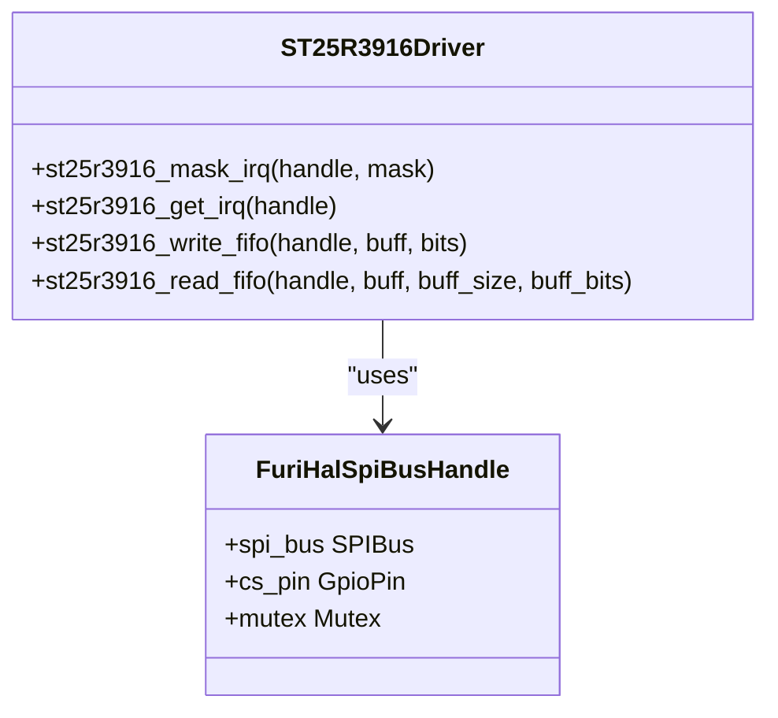

**Diagram sources**
- [st25r3916.h](file://lib/drivers/st25r3916.h#L0-L113)
- [st25r3916.c](file://lib/drivers/st25r3916.c#L0-L84)

**Section sources**
- [st25r3916.h](file://lib/drivers/st25r3916.h#L0-L113)
- [st25r3916.c](file://lib/drivers/st25r3916.c#L0-L84)

## Register Configuration and Management
The ST25R3916 register configuration system provides comprehensive control over the NFC controller's operation through a well-defined register map. The driver implements direct commands and register access functions that enable precise control of the NFC hardware.

The register map is organized into functional groups including operation control, protocol configuration, receiver configuration, timer definition, interrupt management, and analog front-end control. Each register is accessed through the SPI interface with specific bit fields controlling various aspects of the NFC controller's behavior.

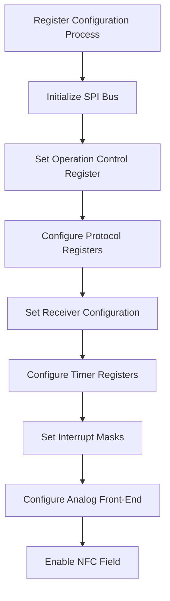

**Diagram sources**
- [st25r3916_reg.h](file://lib/drivers/st25r3916_reg.h#L0-L199)
- [st25r3916.c](file://lib/drivers/st25r3916.c#L0-L84)

**Section sources**
- [st25r3916_reg.h](file://lib/drivers/st25r3916_reg.h#L0-L199)
- [st25r3916.c](file://lib/drivers/st25r3916.c#L0-L84)

## Field Detection and External Field Monitoring
The field detection system implements comprehensive monitoring of both internal and external NFC fields through dedicated registers and interrupt mechanisms. The ST25R3916 controller provides specific functionality for detecting external field presence and measuring field characteristics.

The external field detector uses threshold registers to determine field activation and deactivation states. The controller can detect external fields from other NFC devices, enabling features like card emulation mode where the device responds to an external reader.

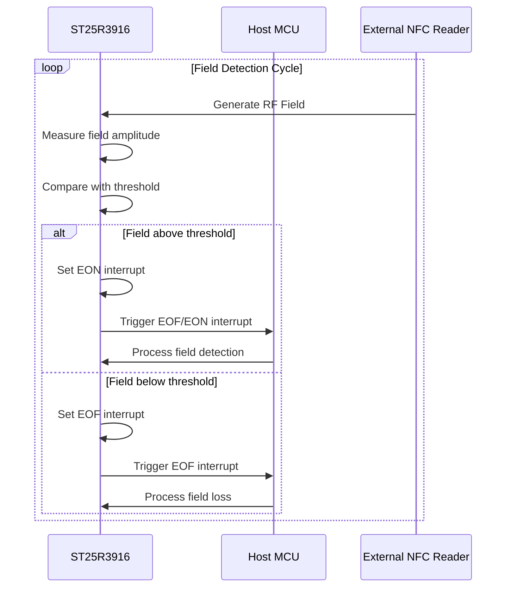

**Diagram sources**
- [st25r3916_reg.h](file://lib/drivers/st25r3916_reg.h#L0-L199)
- [st25r3916.h](file://lib/drivers/st25r3916.h#L0-L113)

**Section sources**
- [st25r3916_reg.h](file://lib/drivers/st25r3916_reg.h#L0-L199)
- [st25r3916.h](file://lib/drivers/st25r3916.h#L0-L113)

## Communication Protocol Handling
The communication protocol handling system implements support for multiple NFC protocols through configurable register settings and state management. The ST25R3916 controller supports various communication modes including ISO14443A/B, ISO15693, and NFC-IP1.

The protocol configuration registers allow setting bit rates, modulation schemes, and framing parameters for different communication modes. The controller automatically handles protocol-specific timing and encoding requirements, reducing the processing burden on the host MCU.

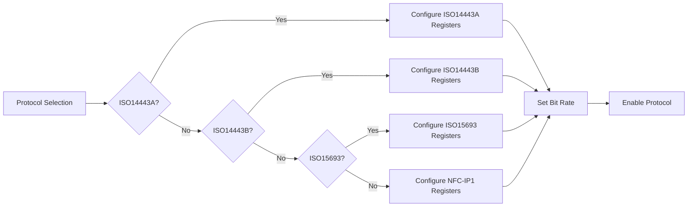

**Diagram sources**
- [st25r3916_reg.h](file://lib/drivers/st25r3916_reg.h#L0-L199)
- [nfc.c](file://lib/nfc/nfc.c#L0-L100)

**Section sources**
- [st25r3916_reg.h](file://lib/drivers/st25r3916_reg.h#L0-L199)
- [nfc.c](file://lib/nfc/nfc.c#L0-L100)

## NFC HAL Architecture
The NFC Hardware Abstraction Layer (HAL) provides a unified interface for NFC operations, abstracting the underlying ST25R3916 driver details. The HAL architecture is organized into three main components: poller, listener, and device, each serving a specific NFC role.

The poller component initiates communication with NFC tags, the listener component detects and responds to external NFC readers, and the device component manages the overall NFC hardware state. This modular design enables flexible NFC operation modes while maintaining code organization and reusability.

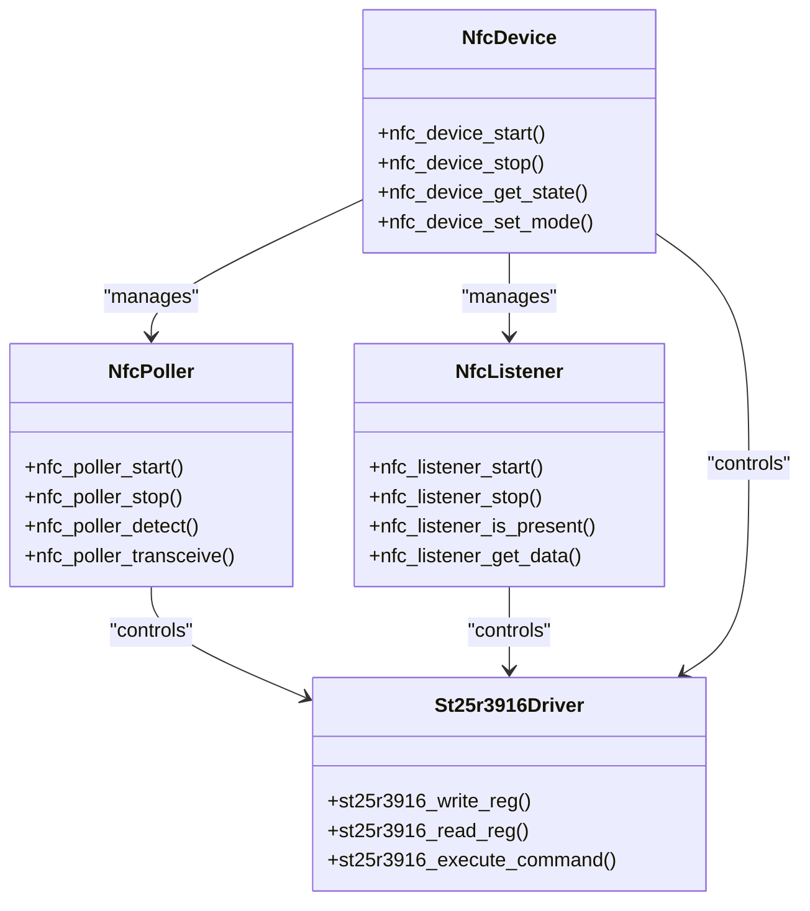

**Diagram sources**
- [nfc.h](file://lib/nfc/nfc.h#L0-L50)
- [nfc.c](file://lib/nfc/nfc.c#L0-L100)
- [nfc_poller.h](file://lib/nfc/nfc_poller.h#L0-L30)
- [nfc_listener.h](file://lib/nfc/nfc_listener.h#L0-L30)

**Section sources**
- [nfc.h](file://lib/nfc/nfc.h#L0-L50)
- [nfc.c](file://lib/nfc/nfc.c#L0-L100)
- [nfc_poller.h](file://lib/nfc/nfc_poller.h#L0-L30)
- [nfc_listener.h](file://lib/nfc/nfc_listener.h#L0-L30)

## Analog Front-End Management
The analog front-end management system controls the physical layer of NFC communication, including field generation, signal reception, and impedance matching. The ST25R3916 controller provides comprehensive control over the analog front-end through dedicated registers.

Key aspects of analog front-end management include:
- **Field Strength Control**: Regulator control registers adjust the output power level
- **Antenna Tuning**: Antenna tuning registers optimize impedance matching
- **Signal Reception**: Receiver configuration registers set gain and filtering
- **Modulation Control**: TX driver registers manage modulation depth

The system implements automatic gain control and dynamic range optimization to ensure reliable communication across various tag types and distances.

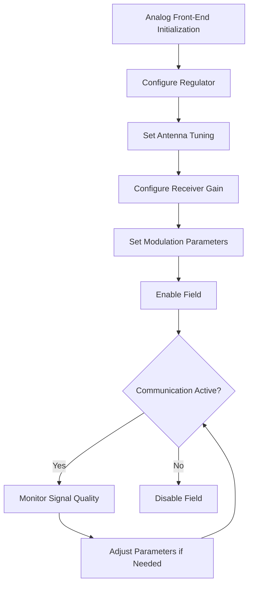

**Diagram sources**
- [st25r3916_reg.h](file://lib/drivers/st25r3916_reg.h#L0-L199)
- [st25r3916.c](file://lib/drivers/st25r3916.c#L0-L84)

**Section sources**
- [st25r3916_reg.h](file://lib/drivers/st25r3916_reg.h#L0-L199)
- [st25r3916.c](file://lib/drivers/st25r3916.c#L0-L84)

## Collision Detection and Avoidance
The collision detection and avoidance system implements robust mechanisms for handling multiple tag environments. The ST25R3916 controller provides hardware-level collision detection through dedicated registers and interrupts.

The system uses a combination of bit collision detection and protocol-level anticollision procedures to identify and communicate with individual tags in a multi-tag environment. The collision status register provides detailed information about collision events, including the bit position where collision occurred.

For ISO14443A tags, the system implements the standard anticollision loop using UID (Unique Identifier) based selection. For ISO15693 tags, the system uses inventory commands with AFI (Application Family Identifier) and DSFID (Data Storage Format Identifier) filtering.

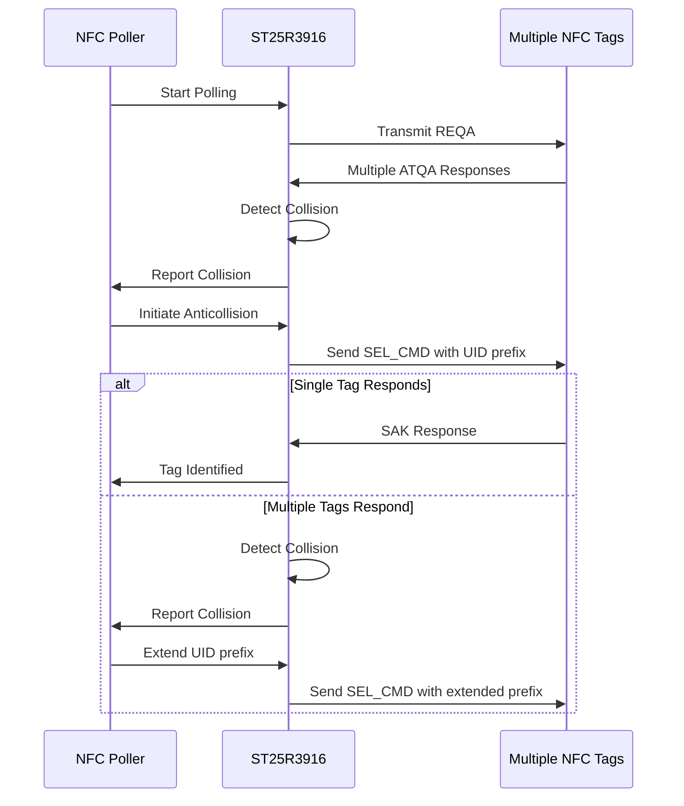

**Diagram sources**
- [st25r3916_reg.h](file://lib/drivers/st25r3916_reg.h#L0-L199)
- [nfc_poller.c](file://lib/nfc/nfc_poller.c#L0-L100)

**Section sources**
- [st25r3916_reg.h](file://lib/drivers/st25r3916_reg.h#L0-L199)
- [nfc_poller.c](file://lib/nfc/nfc_poller.c#L0-L100)

## NFC Communication Modes Implementation
The NFC communication modes implementation supports multiple standards including ISO14443A/B and ISO15693 through configurable hardware settings and protocol-specific software handlers. Each communication mode has dedicated configuration registers and state machines.

**ISO14443A Implementation:**
- Uses 106 kbps data rate with 100% ASK modulation
- Implements standard anticollision and selection procedures
- Supports both Type A and NFC-IP1 protocols

**ISO14443B Implementation:**
- Uses 106 kbps data rate with 10% ASK modulation
- Implements protocol-specific framing and error detection
- Supports high-speed variants up to 848 kbps

**ISO15693 Implementation:**
- Uses 26.48 kbps data rate with ASK modulation
- Implements inventory and anticollision procedures
- Supports both single and multiple sub-carrier modes

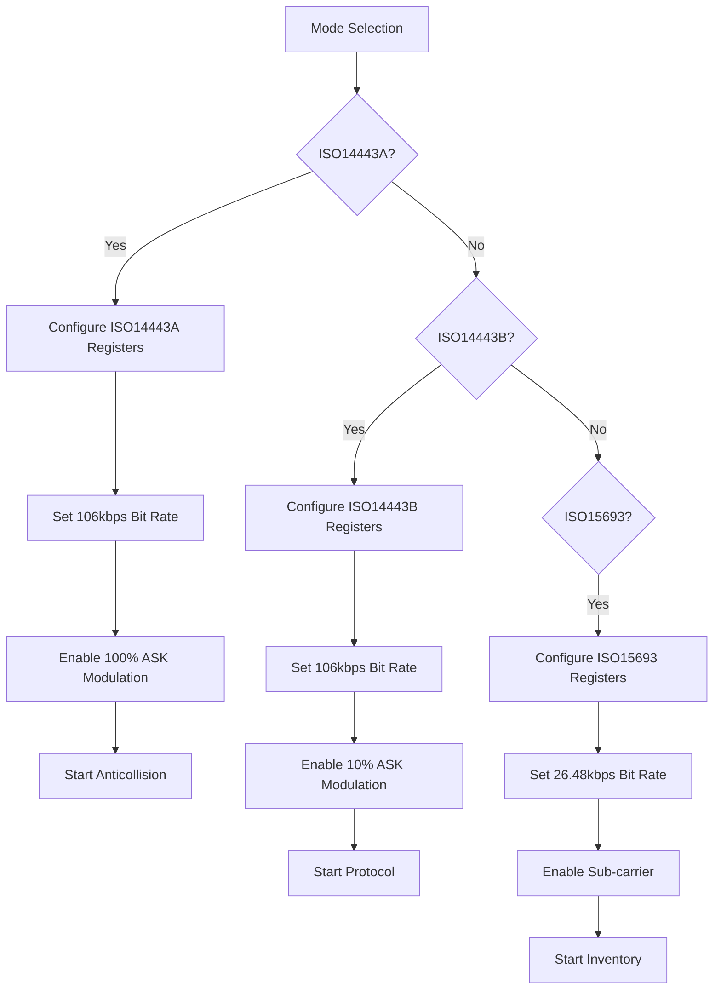

**Diagram sources**
- [st25r3916_reg.h](file://lib/drivers/st25r3916_reg.h#L0-L199)
- [nfc.c](file://lib/nfc/nfc.c#L0-L100)
- [nfc_poller.c](file://lib/nfc/nfc_poller.c#L0-L100)

**Section sources**
- [st25r3916_reg.h](file://lib/drivers/st25r3916_reg.h#L0-L199)
- [nfc.c](file://lib/nfc/nfc.c#L0-L100)
- [nfc_poller.c](file://lib/nfc/nfc_poller.c#L0-L100)

## Tag Reading Implementation
The tag reading implementation uses the NFC poller component to detect and communicate with NFC tags. The process follows a structured sequence of operations to identify, select, and read data from NFC tags.

The implementation begins with field activation and tag detection, followed by protocol-specific identification and selection procedures. Once a tag is selected, the system can perform data exchange operations to read tag contents.

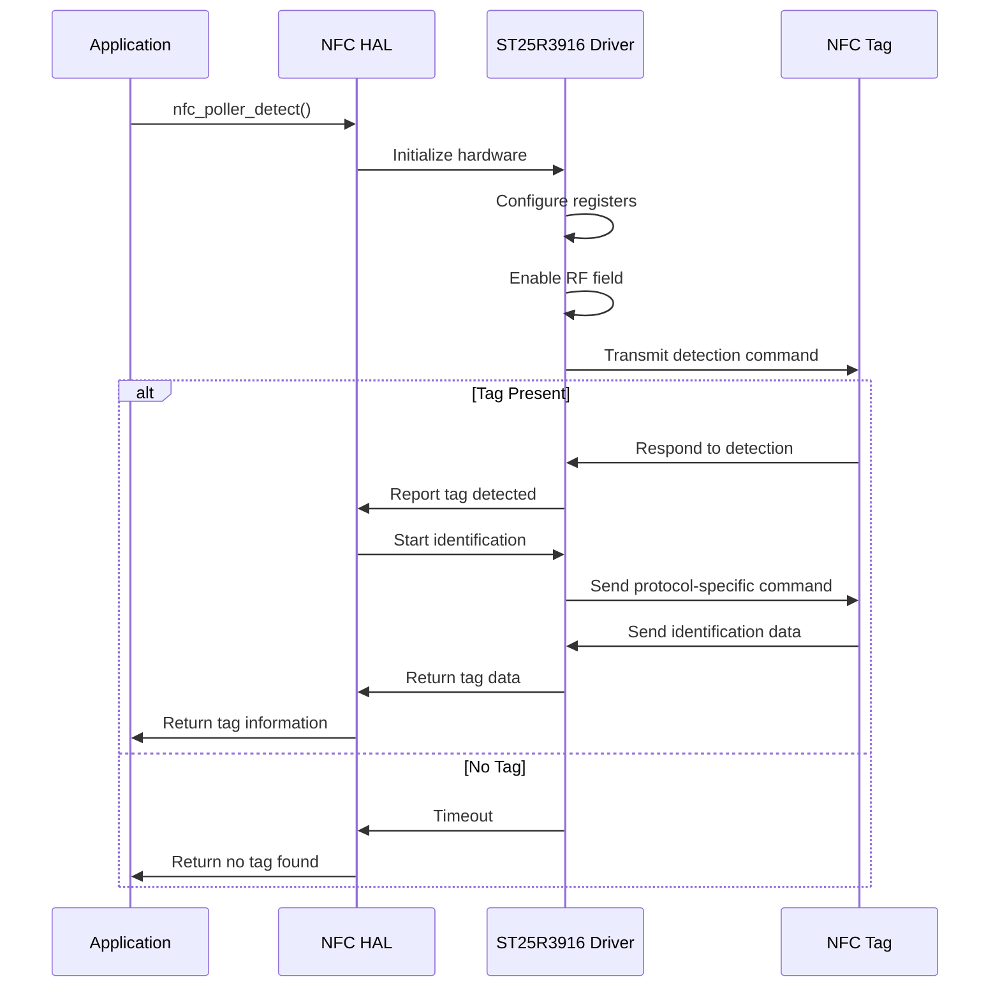

**Diagram sources**
- [nfc_poller.h](file://lib/nfc/nfc_poller.h#L0-L30)
- [nfc_poller.c](file://lib/nfc/nfc_poller.c#L0-L100)
- [st25r3916.c](file://lib/drivers/st25r3916.c#L0-L84)

**Section sources**
- [nfc_poller.h](file://lib/nfc/nfc_poller.h#L0-L30)
- [nfc_poller.c](file://lib/nfc/nfc_poller.c#L0-L100)
- [st25r3916.c](file://lib/drivers/st25r3916.c#L0-L84)

## Card Emulation Implementation
The card emulation implementation enables the device to act as an NFC tag, responding to commands from external NFC readers. This mode uses the NFC listener component to detect external fields and respond to reader commands.

The implementation involves configuring the ST25R3916 controller in passive target mode, setting up the appropriate protocol parameters, and preparing response data. The system monitors for external field detection interrupts and processes incoming commands according to the emulated tag type.

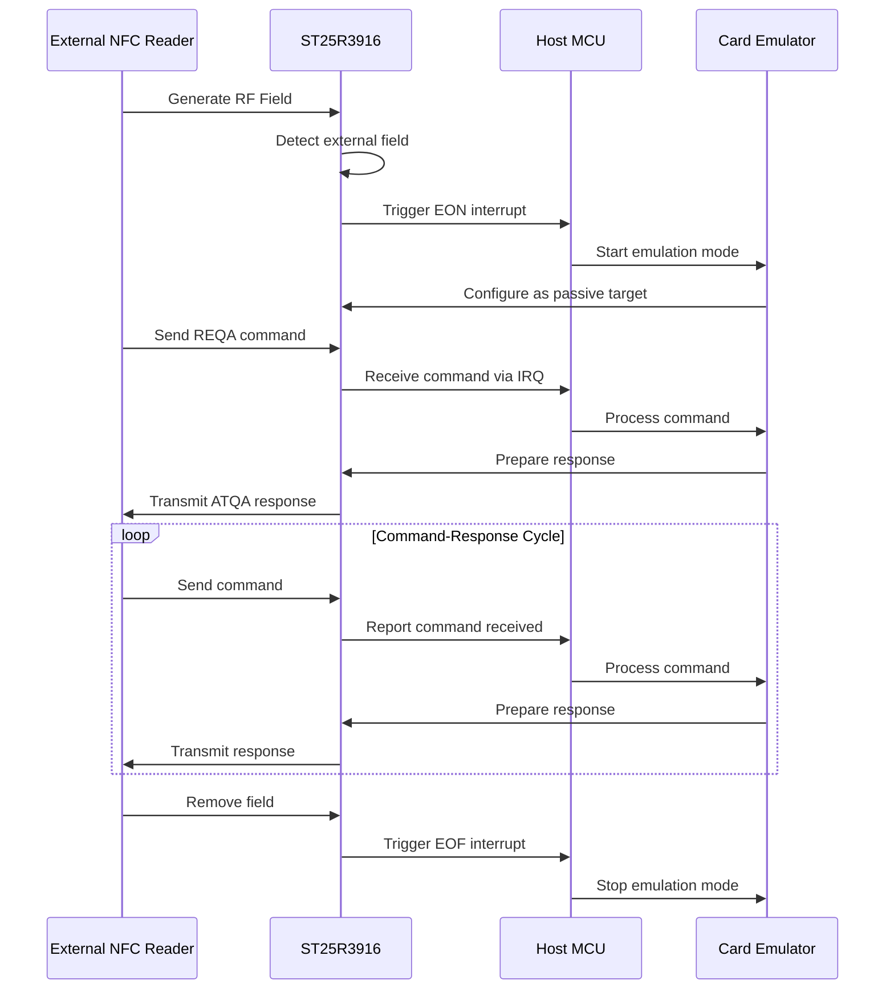

**Diagram sources**
- [nfc_listener.h](file://lib/nfc/nfc_listener.h#L0-L30)
- [nfc_listener.c](file://lib/nfc/nfc_listener.c#L0-L100)
- [st25r3916_reg.h](file://lib/drivers/st25r3916_reg.h#L0-L199)

**Section sources**
- [nfc_listener.h](file://lib/nfc/nfc_listener.h#L0-L30)
- [nfc_listener.c](file://lib/nfc/nfc_listener.c#L0-L100)
- [st25r3916_reg.h](file://lib/drivers/st25r3916_reg.h#L0-L199)

## Peer-to-Peer Communication
The peer-to-peer communication implementation supports NFC-IP1 protocol for device-to-device data exchange. This mode uses active communication where both devices generate their own RF fields and take turns transmitting and receiving data.

The implementation follows the LLCP (Logical Link Control Protocol) specification for connection establishment and data transfer. The system alternates between active communication mode and listening mode to enable bidirectional data exchange.

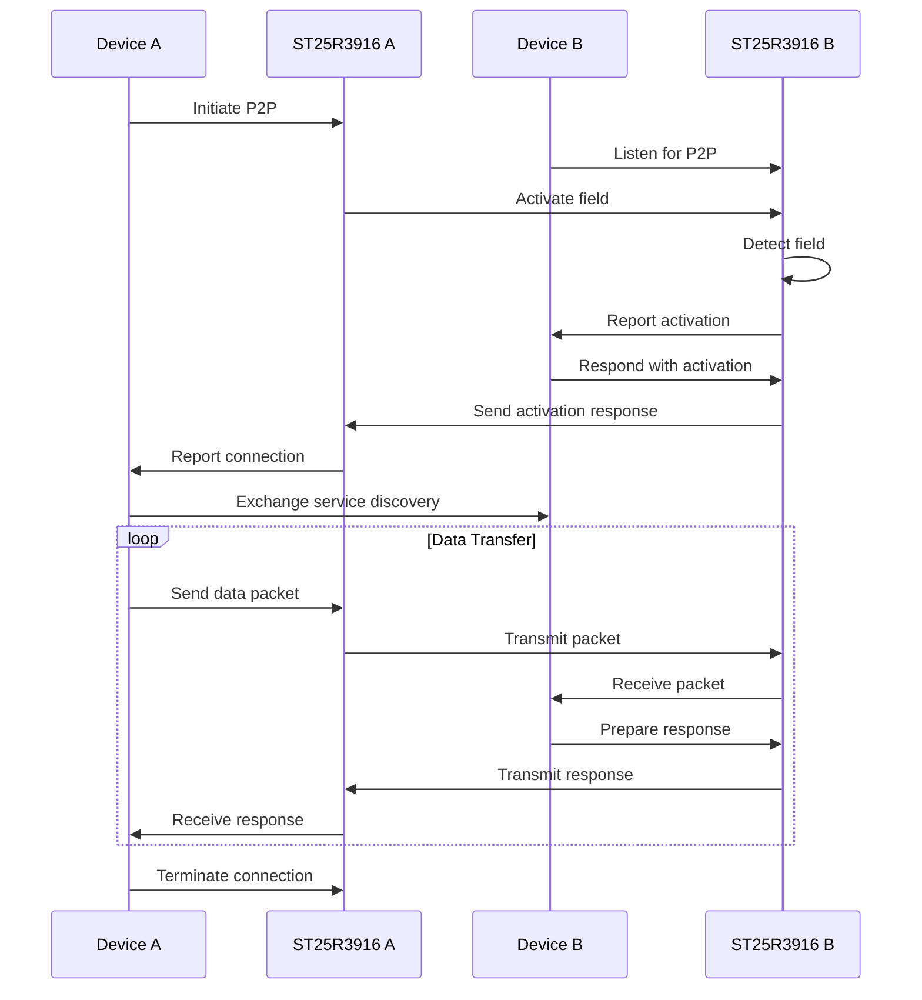

**Diagram sources**
- [nfc.c](file://lib/nfc/nfc.c#L0-L100)
- [st25r3916_reg.h](file://lib/drivers/st25r3916_reg.h#L0-L199)

**Section sources**
- [nfc.c](file://lib/nfc/nfc.c#L0-L100)
- [st25r3916_reg.h](file://lib/drivers/st25r3916_reg.h#L0-L199)

## Power Management and Current Requirements
The power management system addresses the high-current requirements of NFC field generation while maintaining overall device power efficiency. The NFC controller's power consumption varies significantly between operational modes, with field generation requiring the highest current.

The system implements power management strategies including:
- **Dynamic Power Scaling**: Adjusting field strength based on communication requirements
- **Duty Cycling**: Minimizing active time during polling operations
- **Low-Power Listening**: Using wake-up timers for field detection
- **Regulator Optimization**: Configuring voltage regulators for efficiency

The ST25R3916 controller provides specific registers for power management, including regulator control and low-power mode configuration. The system monitors power consumption and adjusts parameters to balance performance and battery life.

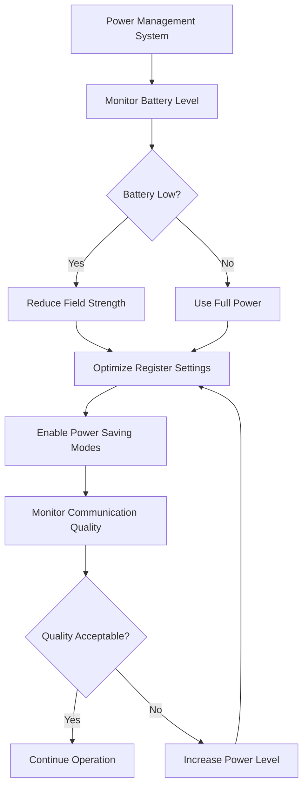

**Diagram sources**
- [st25r3916_reg.h](file://lib/drivers/st25r3916_reg.h#L0-L199)
- [nfc.c](file://lib/nfc/nfc.c#L0-L100)

**Section sources**
- [st25r3916_reg.h](file://lib/drivers/st25r3916_reg.h#L0-L199)
- [nfc.c](file://lib/nfc/nfc.c#L0-L100)

## Antenna Tuning and Field Optimization
The antenna tuning and field optimization system ensures maximum coupling efficiency between the device and NFC tags. The ST25R3916 controller provides dedicated registers for antenna tuning and field measurement.

The system implements automatic antenna tuning through capacitance measurement and adjustment of tuning registers. Field optimization is achieved by monitoring signal quality metrics such as RSSI (Received Signal Strength Indicator) and adjusting transmission parameters accordingly.

Key optimization parameters include:
- **Antenna Tuning Registers**: Adjust impedance matching
- **TX Driver Settings**: Control output power level
- **Modulation Depth**: Optimize signal clarity
- **Receiver Gain**: Maximize sensitivity

The system can perform calibration routines to determine optimal settings for specific antenna configurations and operating environments.

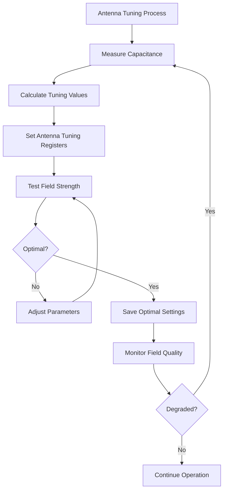

**Diagram sources**
- [st25r3916_reg.h](file://lib/drivers/st25r3916_reg.h#L0-L199)
- [st25r3916.c](file://lib/drivers/st25r3916.c#L0-L84)

**Section sources**
- [st25r3916_reg.h](file://lib/drivers/st25r3916_reg.h#L0-L199)
- [st25r3916.c](file://lib/drivers/st25r3916.c#L0-L84)

## Interference Mitigation Strategies
The interference mitigation system addresses challenges from electromagnetic interference and environmental factors that can affect NFC performance. The ST25R3916 controller provides several features for interference detection and compensation.

Key mitigation strategies include:
- **Overshoot/Undershoot Protection**: Prevents signal distortion
- **Squelch Control**: Filters weak signals
- **Adaptive Gain Control**: Maintains optimal sensitivity
- **Frequency Hopping**: Avoids interference bands

The system monitors for interference through signal quality metrics and adjusts parameters dynamically to maintain reliable communication. Error detection mechanisms identify corrupted transmissions and initiate retransmission when necessary.

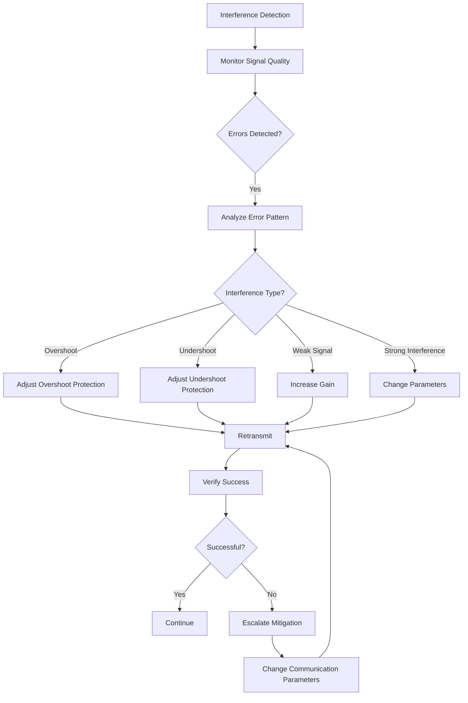

**Diagram sources**
- [st25r3916_reg.h](file://lib/drivers/st25r3916_reg.h#L0-L199)
- [nfc.c](file://lib/nfc/nfc.c#L0-L100)

**Section sources**
- [st25r3916_reg.h](file://lib/drivers/st25r3916_reg.h#L0-L199)
- [nfc.c](file://lib/nfc/nfc.c#L0-L100)

## Troubleshooting Common Issues
This section addresses common issues encountered in NFC hardware operation and provides solutions based on the implementation patterns in the codebase.

**Antenna Tuning Issues:**
- **Symptom**: Poor read range or inconsistent tag detection
- **Solution**: Use the capacitance measurement function to calibrate antenna tuning registers
- **Implementation**: Execute ST25R3916_CMD_CALIBRATE_C_SENSOR command and adjust ST25R3916_REG_ANT_TUNE_A/B registers

**Field Strength Optimization:**
- **Symptom**: Tags not detected at expected distance
- **Solution**: Adjust regulator control and TX driver settings
- **Implementation**: Modify ST25R3916_REG_REGULATOR_CONTROL and ST25R3916_REG_TX_DRIVER registers

**Interference Problems:**
- **Symptom**: Intermittent communication failures
- **Solution**: Enable overshoot/undershoot protection and adjust squelch settings
- **Implementation**: Configure ST25R3916_REG_OVERSHOOT_CONF1/2 and ST25R3916_REG_SQUELCH_TIMER registers

**Collision Handling:**
- **Symptom**: Failure to read multiple tags
- **Solution**: Ensure proper anticollision procedure implementation
- **Implementation**: Verify ISO14443A/B or ISO15693 anticollision loop execution

**Power Management:**
- **Symptom**: Excessive battery drain during NFC operation
- **Solution**: Implement duty cycling and power scaling
- **Implementation**: Use timer-based polling and adjust field strength based on needs

**Section sources**
- [st25r3916_reg.h](file://lib/drivers/st25r3916_reg.h#L0-L199)
- [st25r3916.c](file://lib/drivers/st25r3916.c#L0-L84)
- [nfc.c](file://lib/nfc/nfc.c#L0-L100)
- [nfc_poller.c](file://lib/nfc/nfc_poller.c#L0-L100)