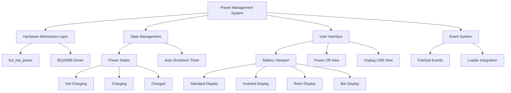
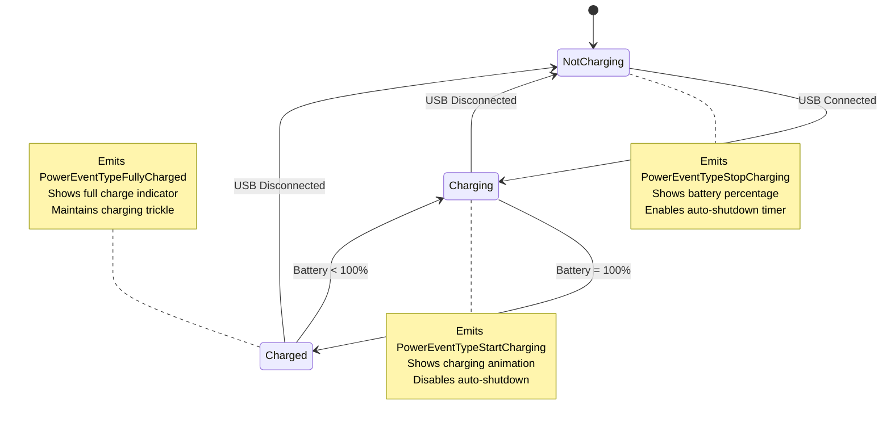
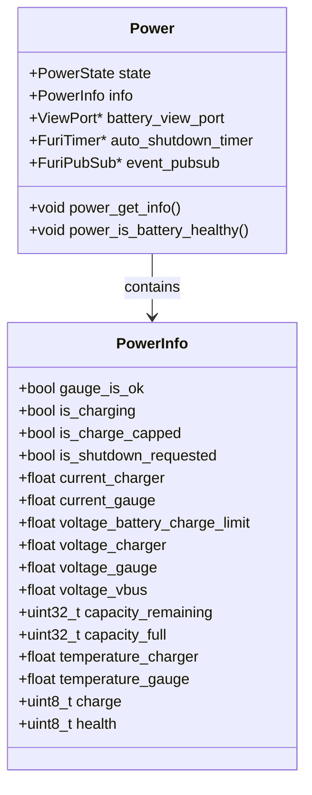
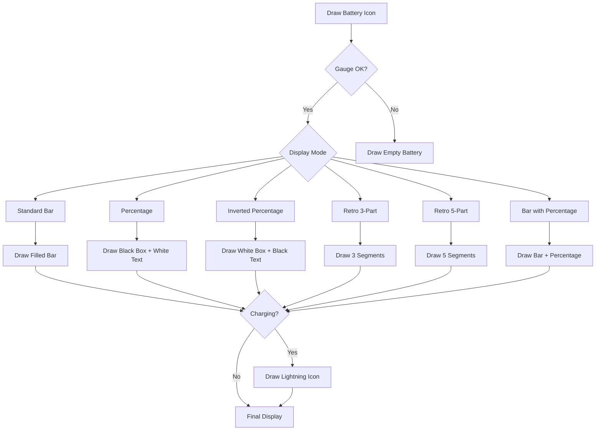
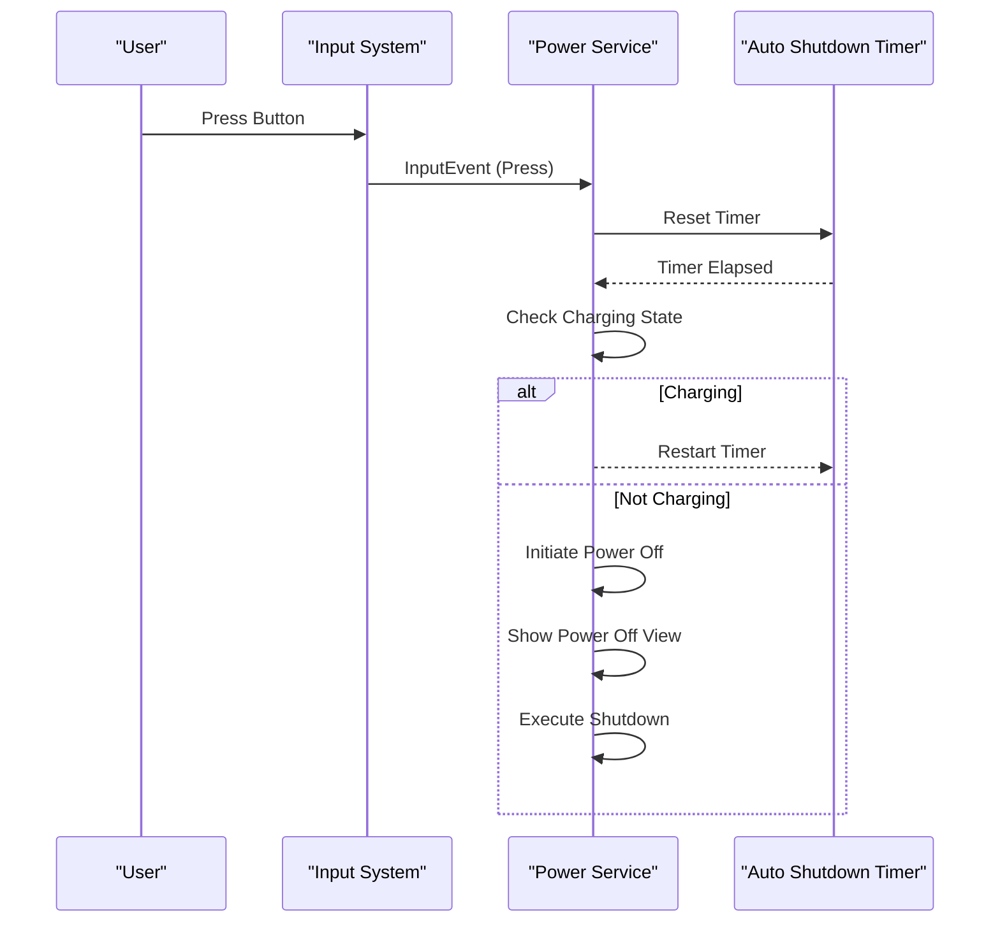
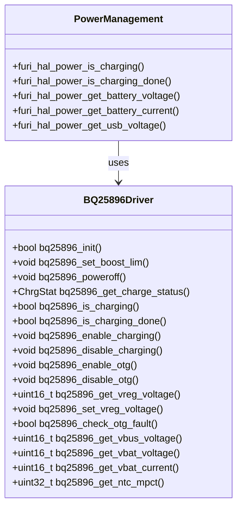
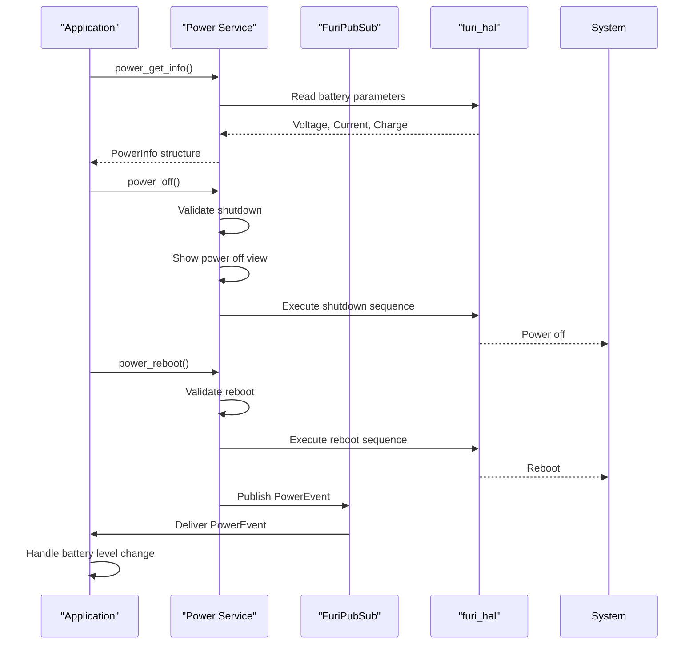

# Power Management

<cite>
**Referenced Files in This Document**   
- [power.c](file://applications/services/power/power_service/power.c)
- [power.h](file://applications/services/power/power_service/power.h)
- [bq25896.h](file://lib/drivers/bq25896.h)
- [bq25896_reg.h](file://lib/drivers/bq25896_reg.h)
- [power_off.c](file://applications/services/power/power_service/views/power_off.c)
- [power_unplug_usb.c](file://applications/services/power/power_service/views/power_unplug_usb.c)
- [power_settings.c](file://applications/services/power/power_settings.c)
</cite>

## Table of Contents
1. [Introduction](#introduction)
2. [Power Management Architecture](#power-management-architecture)
3. [Power States and Transitions](#power-states-and-transitions)
4. [Battery Monitoring and Charging Control](#battery-monitoring-and-charging-control)
5. [User Interface and Visual Feedback](#user-interface-and-visual-feedback)
6. [Auto Shutdown and Idle Management](#auto-shutdown-and-idle-management)
7. [BQ25896 Power Management IC Integration](#bq25896-power-management-ic-integration)
8. [Application Interface and Event System](#application-interface-and-event-system)
9. [Troubleshooting and Common Issues](#troubleshooting-and-common-issues)
10. [Conclusion](#conclusion)

## Introduction

The Power Management system in the Flipper Zero firmware is responsible for comprehensive energy control, battery operation, and power state management. This document details the implementation of power state management, including sleep modes, wake-up sources, voltage regulation, and integration with the BQ25896 power management IC for charging control and battery monitoring. The system provides a robust framework for applications to request specific power states and optimizes power consumption during idle periods. The architecture ensures safe charging operations, accurate battery level reporting, and seamless integration with peripheral power management.

**Section sources**
- [power.c](file://applications/services/power/power_service/power.c#L1-L50)
- [power.h](file://applications/services/power/power_service/power.h#L1-L20)

## Power Management Architecture

The power management system is implemented as a service that provides a centralized interface for power control operations. The architecture follows a modular design with clear separation between hardware abstraction, state management, and user interface components.

**Diagram sources**
- [power.c](file://applications/services/power/power_service/power.c#L1-L200)
- [power.h](file://applications/services/power/power_service/power.h#L1-L50)

**Section sources**
- [power.c](file://applications/services/power/power_service/power.c#L1-L100)
- [power.h](file://applications/services/power/power_service/power.h#L1-L100)

## Power States and Transitions

The power management system implements three primary power states that govern the device's charging behavior and user feedback:

- **PowerStateNotCharging**: Device is running on battery power without charging
- **PowerStateCharging**: Device is connected to a power source and actively charging
- **PowerStateCharged**: Battery has reached full charge capacity

State transitions are managed automatically based on charging status detected through the BQ25896 power management IC. The system uses hardware interrupts and periodic polling to monitor the charging state and trigger appropriate transitions.

**Diagram sources**
- [power.c](file://applications/services/power/power_service/power.c#L300-L350)
- [power.h](file://applications/services/power/power_service/power.h#L30-L50)

**Section sources**
- [power.c](file://applications/services/power/power_service/power.c#L300-L400)
- [power.h](file://applications/services/power/power_service/power.h#L30-L60)

## Battery Monitoring and Charging Control

The battery monitoring system provides comprehensive information about the battery status and charging parameters. The PowerInfo structure contains detailed metrics for battery health, charge level, voltage, current, and temperature.

**Diagram sources**
- [power.h](file://applications/services/power/power_service/power.h#L60-L110)
- [power.c](file://applications/services/power/power_service/power.c#L200-L250)

**Section sources**
- [power.h](file://applications/services/power/power_service/power.h#L60-L116)
- [power.c](file://applications/services/power/power_service/power.c#L200-L300)

## User Interface and Visual Feedback

The power management system provides multiple visual representations of battery status through the battery viewport. Users can customize the display format through settings, with several options available:

- **Standard Bar Display**: Traditional battery bar indicator
- **Percentage Display**: Numeric percentage with black background
- **Inverted Percentage**: Numeric percentage with white background
- **Retro 3-Part**: Segmented display with 3 sections
- **Retro 5-Part**: Segmented display with 5 sections
- **Bar with Percentage**: Combined bar and percentage display

The charging state is indicated with a lightning bolt icon overlay when the device is charging. When the battery charging voltage limit is modified below the standard 4.2V, a cross-hatch pattern indicates this special condition.

**Diagram sources**
- [power.c](file://applications/services/power/power_service/power.c#L1-L150)
- [power_off.c](file://applications/services/power/power_service/views/power_off.c#L1-L50)

**Section sources**
- [power.c](file://applications/services/power/power_service/power.c#L1-L200)

## Auto Shutdown and Idle Management

The auto shutdown system implements idle timeout functionality to conserve battery power when the device is not in use. The system arms a timer that triggers automatic shutdown after a configurable period of inactivity.

The auto shutdown timer is automatically inhibited when the device is charging to prevent interruption of the charging process. It is also disabled when applications are running to avoid premature shutdown during active use. The timer is re-armed when applications are closed or when the device returns to the desktop.

**Diagram sources**
- [power.c](file://applications/services/power/power_service/power.c#L200-L300)
- [power_settings.c](file://applications/services/power/power_settings.c#L1-L50)

**Section sources**
- [power.c](file://applications/services/power/power_service/power.c#L200-L400)

## BQ25896 Power Management IC Integration

The BQ25896 power management IC serves as the hardware foundation for charging control and battery monitoring. The driver provides a comprehensive interface for interacting with the IC's registers and monitoring its status.

The driver exposes critical functions for:
- **Charging Control**: Enable/disable charging, check charging status
- **Voltage Regulation**: Set VREG (charging limit) voltage between 3840mV and 4208mV
- **Battery Monitoring**: Read VBAT voltage and current
- **USB Power**: Read VBUS voltage, enable/disable OTG mode
- **Thermal Protection**: Monitor NTC voltage for temperature sensing
- **Shipping Mode**: Enter low-power shipping mode

**Diagram sources**
- [bq25896.h](file://lib/drivers/bq25896.h#L1-L70)
- [bq25896_reg.h](file://lib/drivers/bq25896_reg.h#L1-L200)

**Section sources**
- [bq25896.h](file://lib/drivers/bq25896.h#L1-L70)
- [bq25896_reg.h](file://lib/drivers/bq25896_reg.h#L1-L276)

## Application Interface and Event System

The power management service provides a comprehensive API for applications to interact with the power system. Applications can request power state changes, monitor battery events, and access detailed power information.

The event system uses FuriPubSub to broadcast power-related events to interested subscribers. The four event types are:
- **PowerEventTypeStopCharging**: Emitted when charging stops
- **PowerEventTypeStartCharging**: Emitted when charging begins
- **PowerEventTypeFullyCharged**: Emitted when battery reaches full charge
- **PowerEventTypeBatteryLevelChanged**: Emitted when battery level changes

Applications can subscribe to these events to update their UI or adjust behavior based on power state changes.

**Diagram sources**
- [power.h](file://applications/services/power/power_service/power.h#L50-L110)
- [power.c](file://applications/services/power/power_service/power.c#L300-L400)

**Section sources**
- [power.h](file://applications/services/power/power_service/power.h#L50-L116)
- [power.c](file://applications/services/power/power_service/power.c#L300-L500)

## Troubleshooting and Common Issues

### Battery Life Optimization
To maximize battery life, the system implements several optimization strategies:
- Auto shutdown after configurable idle period
- Inhibition of shutdown during charging to ensure full charge
- Power state awareness in applications
- Efficient polling intervals for battery monitoring

### Charging Safety
The BQ25896 IC provides multiple safety features:
- Thermal regulation with programmable thresholds
- Charging safety timer with configurable duration
- JEITA-compliant charging profiles
- Over-voltage and over-current protection
- Automatic input current optimization

### Accurate Battery Level Reporting
The system ensures accurate battery level reporting through:
- Direct voltage measurement from the battery
- Current integration for capacity tracking
- Health monitoring to detect battery degradation
- Calibration routines to maintain accuracy
- Multiple measurement points for reliable readings

### Common Issues and Solutions
- **Inaccurate Battery Percentage**: Perform a full charge/discharge cycle to recalibrate
- **Premature Shutdown**: Check battery health and consider replacement
- **Charging Interruptions**: Ensure USB cable and power source provide sufficient current
- **Overheating During Charging**: Reduce ambient temperature or use lower charging current
- **Failure to Charge**: Verify BQ25896 initialization and I2C communication

**Section sources**
- [power.c](file://applications/services/power/power_service/power.c#L300-L400)
- [bq25896.h](file://lib/drivers/bq25896.h#L1-L70)
- [power_settings.c](file://applications/services/power/power_settings.c#L1-L100)

## Conclusion

The Power Management system in the Flipper Zero firmware provides a comprehensive solution for energy control and battery operation. By integrating the BQ25896 power management IC with a sophisticated software architecture, the system delivers reliable charging control, accurate battery monitoring, and efficient power consumption. The modular design with clear interfaces enables applications to interact with the power system while maintaining system stability and safety. The combination of hardware capabilities and software intelligence ensures optimal battery performance, extended device lifespan, and a seamless user experience.