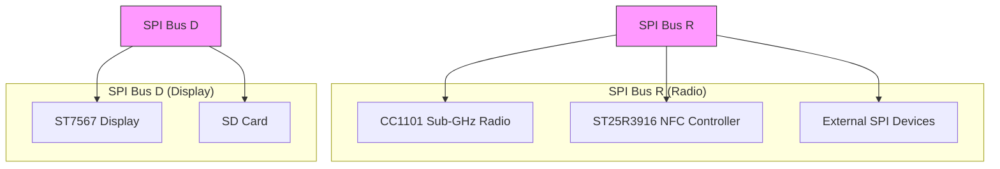
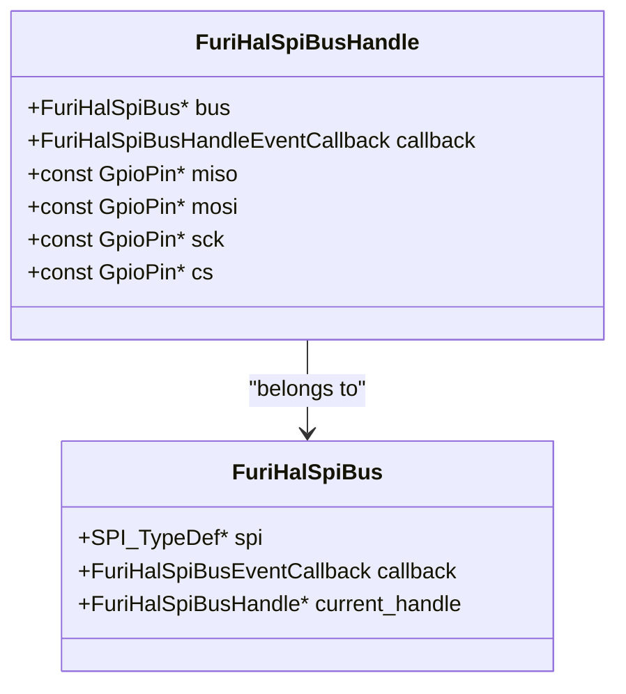
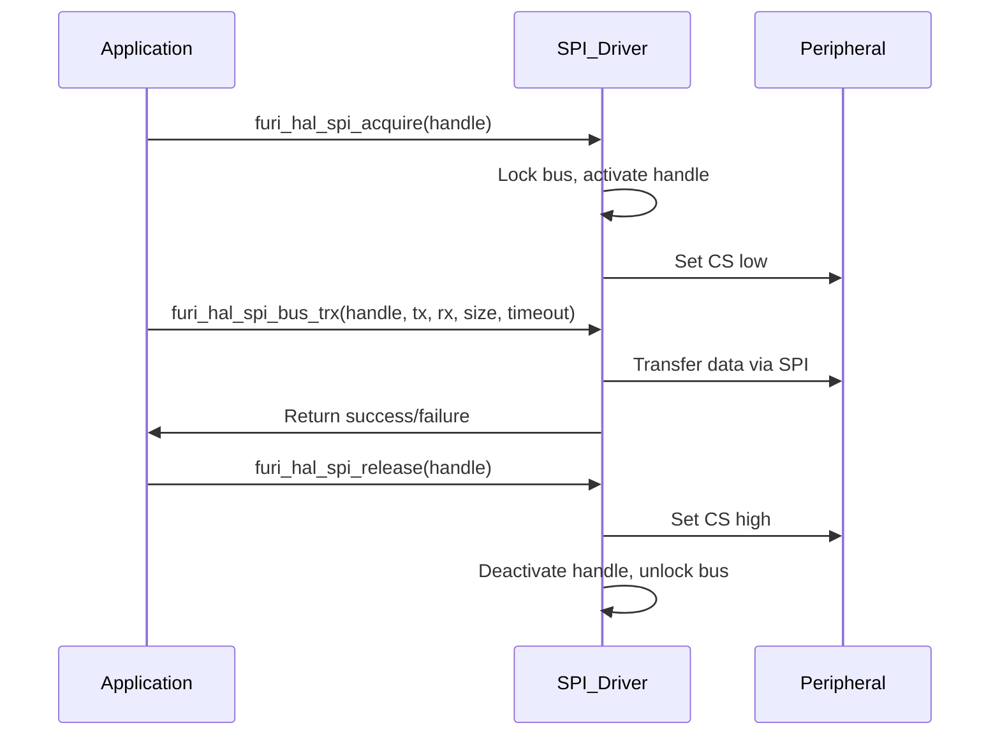
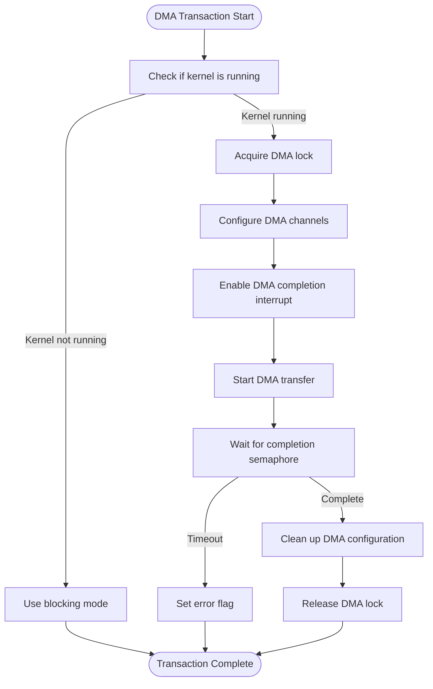

# SPI Interface

<cite>
**Referenced Files in This Document**   
- [furi_hal_spi.h](file://targets/furi_hal_include/furi_hal_spi.h#L1-L129)
- [furi_hal_spi.c](file://targets/f7/furi_hal/furi_hal_spi.c#L1-L379)
- [furi_hal_spi_types.h](file://targets/f7/furi_hal/furi_hal_spi_types.h#L1-L63)
- [furi_hal_spi_config.h](file://targets/f7/furi_hal/furi_hal_spi_config.h#L1-L76)
- [st25r3916.h](file://lib/drivers/st25r3916.h#L1-L114)
- [st25r3916_reg.h](file://lib/drivers/st25r3916_reg.h#L1-L1145)
- [cc1101.h](file://lib/drivers/cc1101.h#L1-L196)
- [cc1101_regs.h](file://lib/drivers/cc1101_regs.h#L1-L213)
</cite>

## Table of Contents
1. [Introduction](#introduction)
2. [SPI Architecture Overview](#spi-architecture-overview)
3. [SPI Bus and Handle Structure](#spi-bus-and-handle-structure)
4. [SPI Configuration and Presets](#spi-configuration-and-presets)
5. [SPI Transaction Handling](#spi-transaction-handling)
6. [DMA-Based SPI Communication](#dma-based-spi-communication)
7. [SPI with CC1101 Sub-GHz Radio](#spi-with-cc1101-sub-ghz-radio)
8. [SPI with ST25R3916 NFC Controller](#spi-with-st25r3916-nfc-controller)
9. [Chip Select and Bus Sharing](#chip-select-and-bus-sharing)
10. [Common SPI Issues and Solutions](#common-spi-issues-and-solutions)

## Introduction
The Serial Peripheral Interface (SPI) is a synchronous serial communication protocol used for high-speed, short-distance communication between microcontrollers and peripheral devices. In the Flipper Zero firmware, the SPI subsystem is designed to support multiple peripherals on shared buses with efficient data transfer mechanisms, including DMA (Direct Memory Access). This document provides a comprehensive analysis of the SPI implementation, focusing on master functionality, transaction handling, and integration with critical components such as the CC1101 Sub-GHz radio and ST25R3916 NFC controller.

**Section sources**
- [furi_hal_spi.h](file://targets/furi_hal_include/furi_hal_spi.h#L1-L129)

## SPI Architecture Overview

The SPI architecture in the Flipper Zero firmware is built around a modular design that separates the physical bus from logical device handles. This allows multiple peripherals to share the same SPI bus while maintaining independent configurations and chip select lines. The system is divided into two main buses: SPI Bus R (Radio) for RF-related peripherals and SPI Bus D (Display) for display and storage components.



**Diagram sources**
- [furi_hal_spi_config.h](file://targets/f7/furi_hal/furi_hal_spi_config.h#L1-L76)
- [furi_hal_spi_types.h](file://targets/f7/furi_hal/furi_hal_spi_types.h#L1-L63)

**Section sources**
- [furi_hal_spi_config.h](file://targets/f7/furi_hal/furi_hal_spi_config.h#L1-L76)

## SPI Bus and Handle Structure

The SPI subsystem uses a two-tiered structure consisting of buses and handles. A bus represents the physical SPI interface with its clock and data lines, while a handle represents a specific peripheral connected to that bus with its own chip select line and configuration.



The `FuriHalSpiBus` structure contains a pointer to the SPI peripheral, an event callback function, and a reference to the currently active handle. The `FuriHalSpiBusHandle` structure contains references to the bus, GPIO pins for MISO, MOSI, SCK, and CS, and an event callback for handle-specific operations.

**Diagram sources**
- [furi_hal_spi_types.h](file://targets/f7/furi_hal/furi_hal_spi_types.h#L1-L63)

**Section sources**
- [furi_hal_spi_types.h](file://targets/f7/furi_hal/furi_hal_spi_types.h#L1-L63)

## SPI Configuration and Presets

The SPI system uses predefined configuration presets for different peripherals, optimizing clock speed and timing parameters for each device. These presets are defined as `LL_SPI_InitTypeDef` structures in the configuration header.

```c
/** Preset for ST25R916 */
extern const LL_SPI_InitTypeDef furi_hal_spi_preset_2edge_low_8m;

/** Preset for CC1101 */
extern const LL_SPI_InitTypeDef furi_hal_spi_preset_1edge_low_8m;

/** Preset for ST7567 (Display) */
extern const LL_SPI_InitTypeDef furi_hal_spi_preset_1edge_low_4m;
```

These presets define key parameters such as:
- Clock polarity and phase (CPOL and CPHA)
- Clock speed (8MHz, 4MHz, etc.)
- Data frame format
- Master/slave mode

The configuration ensures optimal performance for each peripheral, with faster speeds for high-bandwidth devices like the SD card and slower speeds for more sensitive peripherals.

**Section sources**
- [furi_hal_spi_config.h](file://targets/f7/furi_hal/furi_hal_spi_config.h#L1-L76)

## SPI Transaction Handling

The SPI driver provides several functions for data transfer, supporting both blocking and non-blocking operations. The core transaction functions are:



The transaction process follows these steps:
1. Acquire the bus using `furi_hal_spi_acquire()`
2. Perform one or more data transfers using `furi_hal_spi_bus_tx()`, `furi_hal_spi_bus_rx()`, or `furi_hal_spi_bus_trx()`
3. Release the bus using `furi_hal_spi_release()`

The acquisition and release functions handle power management, ensuring the system stays awake during SPI operations.

**Diagram sources**
- [furi_hal_spi.c](file://targets/f7/furi_hal/furi_hal_spi.c#L1-L379)

**Section sources**
- [furi_hal_spi.c](file://targets/f7/furi_hal/furi_hal_spi.c#L1-L379)

## DMA-Based SPI Communication

For high-performance data transfers, the SPI driver supports DMA operations through the `furi_hal_spi_bus_trx_dma()` function. This allows large data transfers without CPU intervention, improving efficiency and reducing power consumption.

```c
bool furi_hal_spi_bus_trx_dma(
    FuriHalSpiBusHandle* handle,
    uint8_t* tx_buffer,
    uint8_t* rx_buffer,
    size_t size,
    uint32_t timeout_ms);
```

The DMA implementation uses semaphores to synchronize transfer completion:
- A `spi_dma_lock` semaphore ensures only one DMA transaction occurs at a time
- A `spi_dma_completed` semaphore signals when the transfer is complete
- DMA interrupts are configured to release the completion semaphore

The driver automatically falls back to blocking mode when the kernel is not running, ensuring compatibility across different execution contexts.



**Diagram sources**
- [furi_hal_spi.c](file://targets/f7/furi_hal/furi_hal_spi.c#L1-L379)

**Section sources**
- [furi_hal_spi.c](file://targets/f7/furi_hal/furi_hal_spi.c#L1-L379)

## SPI with CC1101 Sub-GHz Radio

The CC1101 Sub-GHz radio is connected to SPI Bus R and uses the `furi_hal_spi_bus_handle_subghz` handle. The driver provides both low-level register access and high-level configuration functions.

### Register-Level Communication
The CC1101 communicates using a register-based protocol where:
- Addresses 0x00-0x2E are configuration registers
- Address 0x3E is the PA power table
- Address 0x3F is the FIFO buffer
- Status registers 0x30-0x3D provide device state information

```c
// Write to a register
CC1101Status cc1101_write_reg(FuriHalSpiBusHandle* handle, uint8_t reg, uint8_t data);

// Read from a register
CC1101Status cc1101_read_reg(FuriHalSpiBusHandle* handle, uint8_t reg, uint8_t* data);

// Execute a strobe command
CC1101Status cc1101_strobe(FuriHalSpiBusHandle* handle, uint8_t strobe);
```

### Key Configuration Functions
The high-level API simplifies common operations:
- `cc1101_set_frequency()` - Configure operating frequency
- `cc1101_switch_to_rx()` - Enter receive mode
- `cc1101_switch_to_tx()` - Enter transmit mode
- `cc1101_write_fifo()` - Write data to transmission buffer
- `cc1101_read_fifo()` - Read received data

The CC1101 uses SPI mode 0 (CPOL=0, CPHA=0) with an 8MHz clock speed, optimized for fast register access and data transfer.

**Section sources**
- [cc1101.h](file://lib/drivers/cc1101.h#L1-L196)
- [cc1101_regs.h](file://lib/drivers/cc1101_regs.h#L1-L213)

## SPI with ST25R3916 NFC Controller

The ST25R3916 NFC controller is also connected to SPI Bus R and uses the `furi_hal_spi_bus_handle_nfc` handle. It provides comprehensive NFC functionality with extensive register configuration.

### Register Organization
The ST25R3916 has a complex register map organized into functional groups:
- **IO Configuration**: Registers 0x00-0x01
- **Operation Control**: Registers 0x02-0x04
- **Protocol Configuration**: Registers 0x05-0x0A
- **Receiver Configuration**: Registers 0x0B-0x0E
- **Timer Definition**: Registers 0x0F-0x15
- **Interrupt Configuration**: Registers 0x16-0x1D

```c
// Read FIFO data
bool st25r3916_read_fifo(
    FuriHalSpiBusHandle* handle,
    uint8_t* buff,
    size_t buff_size,
    size_t* buff_bits);

// Write to FIFO
void st25r3916_write_fifo(FuriHalSpiBusHandle* handle, const uint8_t* buff, size_t bits);

// Get interrupt status
uint32_t st25r3916_get_irq(FuriHalSpiBusHandle* handle);

// Mask interrupts
void st25r3916_mask_irq(FuriHalSpiBusHandle* handle, uint32_t mask);
```

The ST25R3916 uses SPI mode 3 (CPOL=1, CPHA=1) with an 8MHz clock speed, providing reliable communication for NFC operations that require precise timing.

**Section sources**
- [st25r3916.h](file://lib/drivers/st25r3916.h#L1-L114)
- [st25r3916_reg.h](file://lib/drivers/st25r3916_reg.h#L1-L1145)

## Chip Select and Bus Sharing

The SPI bus sharing mechanism allows multiple devices to coexist on the same physical bus through careful management of chip select lines and bus state.

### Bus Arbitration
The system uses a handle-based arbitration system:
- Only one handle can be active at a time on a given bus
- `furi_hal_spi_acquire()` checks for conflicts and claims the bus
- `furi_hal_spi_release()` relinquishes control of the bus

```c
void furi_hal_spi_acquire(FuriHalSpiBusHandle* handle) {
    furi_check(handle);
    furi_hal_power_insomnia_enter();
    handle->bus->callback(handle->bus, FuriHalSpiBusEventLock);
    handle->bus->callback(handle->bus, FuriHalSpiBusEventActivate);
    furi_check(handle->bus->current_handle == NULL);
    handle->bus->current_handle = handle;
    handle->callback(handle, FuriHalSpiBusHandleEventActivate);
}
```

### Chip Select Timing
Proper chip select timing is critical for reliable communication:
- CS is asserted (low) when a handle is activated
- CS is deasserted (high) when a handle is deactivated
- Minimum CS high time between transactions is maintained
- CS lines are software-controlled GPIOs, allowing flexible configuration

This design prevents bus contention and ensures that only one device responds to SPI commands at any given time.

**Section sources**
- [furi_hal_spi.c](file://targets/f7/furi_hal/furi_hal_spi.c#L1-L379)
- [furi_hal_spi_config.h](file://targets/f7/furi_hal/furi_hal_spi_config.h#L1-L76)

## Common SPI Issues and Solutions

### Clock Speed Mismatches
**Issue**: Peripheral fails to respond or returns incorrect data.
**Solution**: Use the appropriate preset for each device:
- CC1101: 8MHz (`furi_hal_spi_preset_1edge_low_8m`)
- ST25R3916: 8MHz (`furi_hal_spi_preset_2edge_low_8m`)
- Display: 4MHz (`furi_hal_spi_preset_1edge_low_4m`)

### Buffer Overflows
**Issue**: Data corruption during high-speed transfers.
**Solution**: Use DMA for large transfers and ensure proper FIFO management:
- For CC1101: Monitor FIFO status and flush when necessary
- For ST25R3916: Use interrupt-driven transfers with proper water level settings

### Chip Select Timing
**Issue**: Multiple devices responding to commands or communication failures.
**Solution**: Always use the acquire/release pattern:
```c
furi_hal_spi_acquire(&furi_hal_spi_bus_handle_subghz);
// Perform SPI operations
furi_hal_spi_release(&furi_hal_spi_bus_handle_subghz);
```

### Power Management
**Issue**: SPI operations failing during low-power states.
**Solution**: The SPI driver automatically manages power:
- `furi_hal_power_insomnia_enter()` during acquisition
- `furi_hal_power_insomnia_exit()` during release
- Ensures system stays awake during SPI transactions

These solutions are implemented in the driver to provide robust SPI communication across various operating conditions.

**Section sources**
- [furi_hal_spi.c](file://targets/f7/furi_hal/furi_hal_spi.c#L1-L379)
- [furi_hal_spi.h](file://targets/furi_hal_include/furi_hal_spi.h#L1-L129)