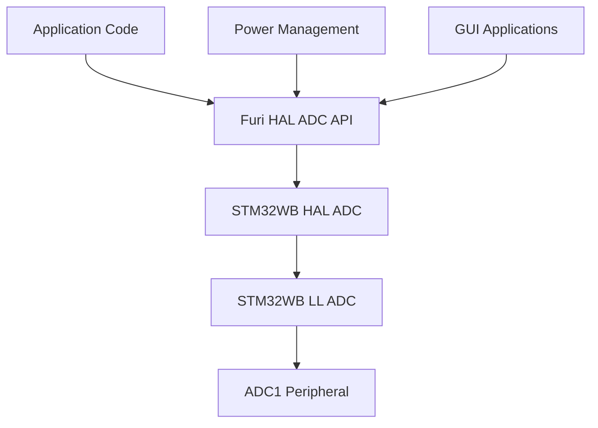
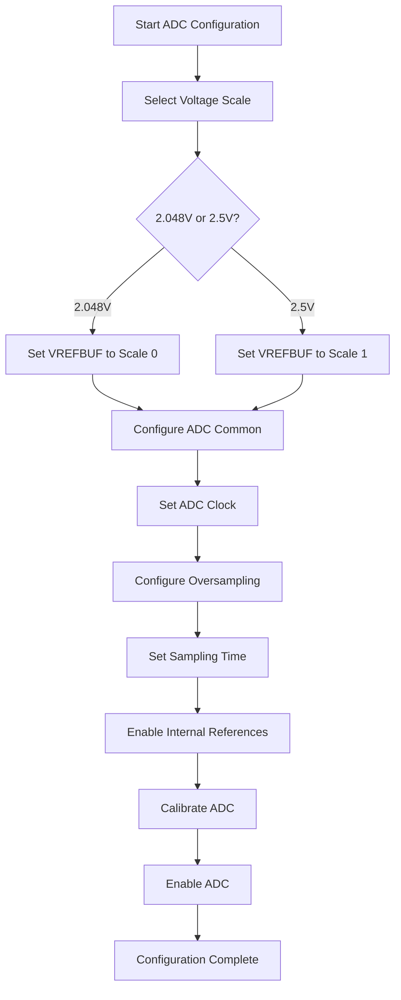
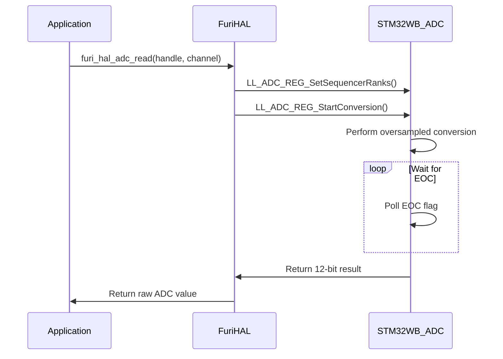
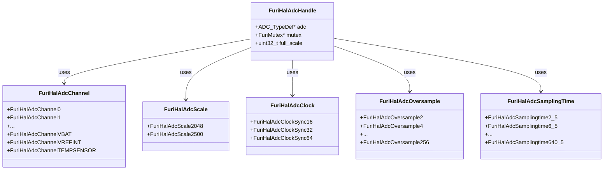
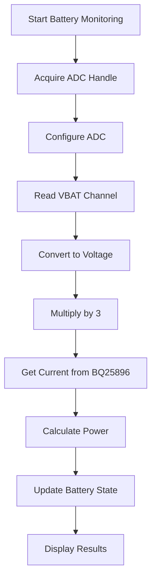
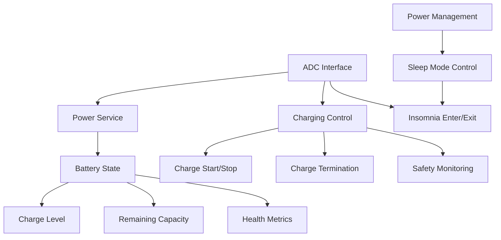
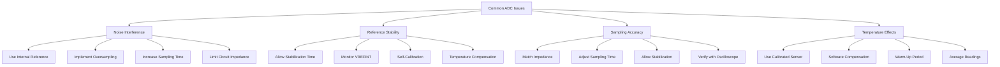
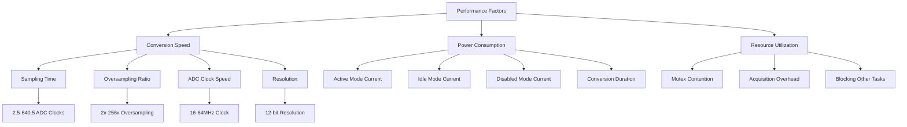

# ADC Interface

<cite>
**Referenced Files in This Document**   
- [furi_hal_adc.h](file://targets/furi_hal_include/furi_hal_adc.h)
- [furi_hal_adc.c](file://targets/f7/furi_hal/furi_hal_adc.c)
- [example_adc.c](file://applications/examples/example_adc/example_adc.c)
- [stm32wbxx_hal_adc.h](file://lib/stm32wb_hal/Inc/stm32wbxx_hal_adc.h)
- [stm32wbxx_ll_adc.h](file://lib/stm32wb_hal/Inc/stm32wbxx_ll_adc.h)
- [bq25896.c](file://lib/drivers/bq25896.c)
- [furi_hal_power.c](file://targets/f7/furi_hal/furi_hal_power.c)
- [power.h](file://applications/services/power/power_service/power.h)
</cite>

## Table of Contents
1. [Introduction](#introduction)
2. [ADC Driver Architecture](#adc-driver-architecture)
3. [Sampling Configuration](#sampling-configuration)
4. [Measurement Techniques](#measurement-techniques)
5. [API Functions for Conversions](#api-functions-for-conversions)
6. [Battery Voltage and Current Monitoring](#battery-voltage-and-current-monitoring)
7. [Relationship with Power Management](#relationship-with-power-management)
8. [Common Issues and Solutions](#common-issues-and-solutions)
9. [Performance Considerations](#performance-considerations)
10. [Conclusion](#conclusion)

## Introduction
The ADC (Analog-to-Digital Converter) interface in the Flipper Zero firmware provides a simplified API for analog signal measurement while abstracting the complexity of the underlying STM32WB hardware. This documentation details the ADC driver architecture, configuration options, measurement techniques, and integration with higher-level applications like power management. The implementation focuses on single conversion mode with oversampling for improved accuracy, while acknowledging the noisy analog domain environment created by the SMPS (Switched-Mode Power Supply).

**Section sources**
- [furi_hal_adc.h](file://targets/furi_hal_include/furi_hal_adc.h#L1-L230)

## ADC Driver Architecture
The ADC driver architecture in Flipper Zero firmware implements a simplified abstraction layer over the STM32WB HAL (Hardware Abstraction Layer) and LL (Low-Level) APIs. The architecture follows a handle-based approach where ADC resources are acquired and released through a mutex-protected handle system, ensuring thread-safe access to the shared ADC hardware.

The driver is structured in three main layers:
1. **Furi HAL Layer**: Provides the simplified public API with functions like `furi_hal_adc_acquire()`, `furi_hal_adc_configure()`, and `furi_hal_adc_read()`
2. **STM32WB HAL Layer**: Implements the standard STM32 hardware abstraction with initialization, configuration, and conversion functions
3. **STM32WB LL Layer**: Provides direct register access for performance-critical operations

The ADC handle structure (`FuriHalAdcHandle`) contains the ADC peripheral pointer, a mutex for thread safety, and the full-scale voltage value for conversion calculations. The driver initializes the ADC subsystem during boot and manages power domains through the `furi_hal_power_insomnia_enter()` and `furi_hal_power_insomnia_exit()` functions to ensure proper power sequencing.

**Diagram sources **
- [furi_hal_adc.h](file://targets/furi_hal_include/furi_hal_adc.h#L1-L230)
- [furi_hal_adc.c](file://targets/f7/furi_hal/furi_hal_adc.c#L1-L282)

**Section sources**
- [furi_hal_adc.h](file://targets/furi_hal_include/furi_hal_adc.h#L1-L230)
- [furi_hal_adc.c](file://targets/f7/furi_hal/furi_hal_adc.c#L1-L282)

## Sampling Configuration
The ADC sampling configuration in Flipper Zero firmware provides several key parameters that can be tuned for specific measurement requirements. The configuration is divided into four main aspects: voltage scale, clock configuration, oversampling, and sampling time.

### Voltage Scale
The ADC supports two internal voltage reference scales:
- **2.048V scale** (`FuriHalAdcScale2048`): Default configuration providing higher precision for lower voltage measurements
- **2.5V scale** (`FuriHalAdcScale2500`): Alternative configuration for measurements requiring a wider voltage range

### Clock Configuration
The ADC clock can be configured in synchronous mode with three options:
- **16MHz** (`FuriHalAdcClockSync16`): Divided by 4 from system clock
- **32MHz** (`FuriHalAdcClockSync32`): Divided by 2 from system clock  
- **64MHz** (`FuriHalAdcClockSync64`): Direct system clock (default)

### Oversampling
Oversampling improves measurement accuracy by averaging multiple samples:
- **2x to 256x** oversampling ratios available
- **64x** is the default configuration, providing a good balance between accuracy and conversion time
- Oversampling ratio directly affects conversion time and noise reduction

### Sampling Time
Sampling time determines how long the ADC samples the input signal:
- **2.5 to 640.5 ADC clock cycles** available
- **247.5 cycles** is the default for general-purpose measurements
- Longer sampling times are required for high-impedance sources

The default configuration (`furi_hal_adc_configure`) uses 2.048V scale, 64MHz clock, 64x oversampling, and 247.5 cycle sampling time, optimized for 0-2.048V measurements with ~0.1% precision.

**Diagram sources **
- [furi_hal_adc.h](file://targets/furi_hal_include/furi_hal_adc.h#L45-L77)
- [furi_hal_adc.c](file://targets/f7/furi_hal/furi_hal_adc.c#L118-L124)

**Section sources**
- [furi_hal_adc.h](file://targets/furi_hal_include/furi_hal_adc.h#L45-L77)
- [furi_hal_adc.c](file://targets/f7/furi_hal/furi_hal_adc.c#L118-L124)

## Measurement Techniques
The Flipper Zero ADC implementation employs several measurement techniques to ensure accurate and reliable analog readings. The primary technique is oversampled single conversion, which balances accuracy with power consumption and response time.

### Single Conversion Mode
The driver uses regular group single conversion mode with software triggering, where each measurement is initiated by calling `furi_hal_adc_read()`. This approach provides deterministic timing and prevents interference from other system activities. The conversion sequence is simple:
1. Set the channel in the sequencer rank 1
2. Start the conversion 
3. Wait for end-of-conversion flag
4. Read the 12-bit result

### Oversampling Technique
Oversampling is used to improve the effective number of bits (ENOB) beyond the native 12-bit resolution. With 64x oversampling, the effective resolution approaches 14 bits, though practical ENOB is limited to about 10 bits due to system noise. The oversampling is implemented in hardware by the ADC peripheral, which automatically accumulates and averages multiple samples.

### Internal Channel Measurements
Special handling is required for internal measurement channels:
- **VREFINT**: Used for calibration and self-test, converted to voltage using `furi_hal_adc_convert_vref()`
- **TEMPSENSOR**: On-die temperature sensor requiring at least 5μs sampling time, converted to Celsius using `furi_hal_adc_convert_temp()`
- **VBAT**: Battery voltage divided by 3, converted to actual voltage using `furi_hal_adc_convert_vbat()`

### Noise Mitigation
Due to the noisy SMPS-powered analog domain, several noise mitigation techniques are employed:
- Use of internal voltage reference instead of external reference
- Long sampling times to average out high-frequency noise
- Oversampling to reduce random noise
- Careful PCB layout with dedicated analog ground

**Diagram sources **
- [furi_hal_adc.c](file://targets/f7/furi_hal/furi_hal_adc.c#L247-L263)
- [furi_hal_adc.h](file://targets/furi_hal_include/furi_hal_adc.h#L185-L185)

**Section sources**
- [furi_hal_adc.c](file://targets/f7/furi_hal/furi_hal_adc.c#L247-L263)
- [furi_hal_adc.h](file://targets/furi_hal_include/furi_hal_adc.h#L185-L185)

## API Functions for Conversions
The ADC interface provides a comprehensive API for performing analog-to-digital conversions with both simple and extended configuration options.

### Basic Conversion Functions
The primary functions for ADC operations are:
- `furi_hal_adc_acquire()`: Acquires the ADC handle, enabling power and clock domains
- `furi_hal_adc_release()`: Releases the ADC handle, disabling power and clock domains
- `furi_hal_adc_configure()`: Configures ADC with default parameters
- `furi_hal_adc_read()`: Performs a single conversion on the specified channel

### Extended Configuration
For advanced use cases, the extended configuration function allows fine-tuning of all parameters:
- `furi_hal_adc_configure_ex()`: Configures ADC with custom scale, clock, oversampling, and sampling time

### Conversion Utilities
Several utility functions convert raw ADC values to physical units:
- `furi_hal_adc_convert_to_voltage()`: Converts raw value to millivolts
- `furi_hal_adc_convert_vref()`: Converts VREFINT reading to millivolts
- `furi_hal_adc_convert_temp()`: Converts temperature sensor reading to Celsius
- `furi_hal_adc_convert_vbat()`: Converts VBAT reading to actual battery voltage

### Example Usage
The API is designed to be simple and intuitive:
1. Initialize GPIO pin in analog mode
2. Acquire ADC handle
3. Configure ADC (default or extended)
4. Read values as needed
5. Release ADC handle when done

The example application demonstrates reading multiple channels including GPIO pins, VREFINT, temperature sensor, and VBAT, converting each to appropriate units for display.

**Diagram sources **
- [furi_hal_adc.h](file://targets/furi_hal_include/furi_hal_adc.h#L43-L107)
- [furi_hal_adc.c](file://targets/f7/furi_hal/furi_hal_adc.c#L11-L15)

**Section sources**
- [furi_hal_adc.h](file://targets/furi_hal_include/furi_hal_adc.h#L118-L186)
- [furi_hal_adc.c](file://targets/f7/furi_hal/furi_hal_adc.c#L95-L116)

## Battery Voltage and Current Monitoring
The ADC interface plays a critical role in battery monitoring on the Flipper Zero device, providing measurements for both voltage and current through different mechanisms.

### Battery Voltage Measurement
Battery voltage is measured using the dedicated VBAT channel, which samples the battery voltage divided by 3 through an internal resistor divider. The measurement process involves:
1. Reading the raw ADC value from `FuriHalAdcChannelVBAT`
2. Converting to voltage using `furi_hal_adc_convert_to_voltage()`
3. Multiplying by 3 to account for the voltage divider

This approach allows measurement of battery voltages up to approximately 6.144V (3 × 2.048V) with the default 2.048V reference scale. The measurement is typically performed periodically to monitor battery state and trigger low-battery warnings.

### Current Measurement
Current measurement is implemented differently, using the BQ25896 charger IC rather than direct ADC measurement. The BQ25896 has its own internal ADC that measures battery current, which is then accessed via I2C:
- The charger IC continuously polls its internal ADC
- Current readings are available through I2C registers
- The firmware reads these values using `bq25896_get_vbat_current()`

This dual approach allows for both direct voltage measurement through the STM32 ADC and current measurement through the dedicated power management IC, providing comprehensive battery monitoring capabilities.

### Example Implementation
The example ADC application demonstrates reading battery voltage by:
1. Acquiring the ADC handle
2. Configuring the ADC with default parameters
3. Reading the VBAT channel
4. Converting to actual voltage using `furi_hal_adc_convert_vbat()`
5. Displaying the result in millivolts

The power service also uses these measurements to calculate battery charge level, remaining capacity, and health metrics, integrating the raw ADC data into higher-level power management functions.

**Diagram sources **
- [furi_hal_adc.c](file://targets/f7/furi_hal/furi_hal_adc.c#L279-L281)
- [bq25896.c](file://lib/drivers/bq25896.c#L197-L200)
- [furi_hal_power.c](file://targets/f7/furi_hal/furi_hal_power.c#L416-L429)

**Section sources**
- [furi_hal_adc.c](file://targets/f7/furi_hal/furi_hal_adc.c#L279-L281)
- [bq25896.c](file://lib/drivers/bq25896.c#L197-L200)
- [furi_hal_power.c](file://targets/f7/furi_hal/furi_hal_power.c#L416-L429)

## Relationship with Power Management
The ADC interface is tightly integrated with the power management system in the Flipper Zero firmware, providing critical data for battery monitoring, charging control, and power optimization.

### Power Service Integration
The power service (`power_service`) uses ADC measurements as primary inputs for battery state estimation:
- **Battery voltage**: Directly measured via ADC VBAT channel
- **Battery current**: Indirectly measured via BQ25896 charger IC
- **Temperature**: Measured via ADC temperature sensor channel

These measurements are combined to calculate:
- Battery charge level (percentage)
- Remaining capacity (mAh)
- Battery health and aging
- Charging status and termination

### Power Domain Control
The ADC driver itself participates in power management through:
- **Power acquisition**: `furi_hal_adc_acquire()` calls `furi_hal_power_insomnia_enter()` to prevent sleep mode during ADC operations
- **Power release**: `furi_hal_adc_release()` calls `furi_hal_power_insomnia_exit()` to allow sleep mode when ADC is not in use
- **Clock gating**: ADC clock is disabled when not in use to reduce power consumption

### Charging System Coordination
The ADC measurements are essential for the charging system:
- **Charging control**: Voltage measurements determine when to start/stop charging
- **Charge termination**: Voltage and current measurements detect full charge condition
- **Safety monitoring**: Temperature measurements prevent overheating during charging

The power management system subscribes to ADC measurement events and updates its state accordingly, triggering events like `PowerEventTypeBatteryLevelChanged` when significant changes occur.

**Diagram sources **
- [furi_hal_adc.c](file://targets/f7/furi_hal/furi_hal_adc.c#L98-L113)
- [power.h](file://applications/services/power/power_service/power.h#L15-L35)
- [furi_hal_power.c](file://targets/f7/furi_hal/furi_hal_power.c#L409-L446)

**Section sources**
- [furi_hal_adc.c](file://targets/f7/furi_hal/furi_hal_adc.c#L98-L113)
- [power.h](file://applications/services/power/power_service/power.h#L15-L35)
- [furi_hal_power.c](file://targets/f7/furi_hal/furi_hal_power.c#L409-L446)

## Common Issues and Solutions
The ADC implementation in Flipper Zero firmware faces several common issues related to noise, accuracy, and system integration. Understanding these issues and their solutions is critical for reliable analog measurements.

### Noise Interference
The primary challenge is noise from the SMPS (Switched-Mode Power Supply) that powers the analog domain. This switching noise can significantly impact measurement accuracy, especially for low-level signals.

**Solutions:**
- Use the internal voltage reference (2.048V or 2.5V) instead of external reference
- Implement oversampling (64x default) to average out high-frequency noise
- Use longer sampling times (247.5 ADC clocks default) to integrate over noise cycles
- Keep measurement circuit impedance under 10kΩ to prevent signal distortion

### Reference Voltage Stability
The internal voltage reference stability is affected by temperature and load conditions.

**Solutions:**
- Allow 500ms stabilization time after enabling VREFBUF
- Monitor VREFINT channel periodically to detect reference drift
- Use VREFINT measurements for self-calibration of other readings
- Implement temperature compensation for critical measurements

### Sampling Accuracy
Several factors affect sampling accuracy, including input impedance, sampling time, and channel switching.

**Solutions:**
- Match circuit impedance to ADC requirements (under 10kΩ recommended)
- Use appropriate sampling time for source impedance (longer for high impedance)
- Allow stabilization time when switching between channels with large voltage differences
- Verify signals with oscilloscope (200MHz bandwidth recommended) to ensure no distortion

### Temperature Effects
Temperature variations affect both the reference voltage and the temperature sensor accuracy.

**Solutions:**
- Use the on-die temperature sensor with proper calibration
- Implement software compensation for temperature-dependent parameters
- Allow warm-up time for stable readings after power-on
- Average multiple readings to reduce thermal noise

**Diagram sources **
- [furi_hal_adc.h](file://targets/furi_hal_include/furi_hal_adc.h#L10-L22)
- [furi_hal_adc.c](file://targets/f7/furi_hal/furi_hal_adc.c#L140-L165)

**Section sources**
- [furi_hal_adc.h](file://targets/furi_hal_include/furi_hal_adc.h#L10-L22)
- [furi_hal_adc.c](file://targets/f7/furi_hal/furi_hal_adc.c#L140-L165)

## Performance Considerations
The ADC implementation in Flipper Zero firmware involves several performance trade-offs between conversion speed, power consumption, and measurement accuracy.

### Conversion Speed
Conversion time is determined by multiple factors:
- **Sampling time**: 2.5 to 640.5 ADC clock cycles
- **Resolution**: 12-bit conversion requires 12.5 ADC clock cycles
- **Oversampling ratio**: 2 to 256 samples averaged
- **ADC clock speed**: 16, 32, or 64 MHz

With default settings (64MHz clock, 64x oversampling, 247.5 cycle sampling time), the total conversion time is approximately 260μs per reading. This can be reduced to under 50μs by using lower oversampling ratios and shorter sampling times, at the cost of reduced accuracy.

### Power Consumption
ADC operations consume significant power, particularly during conversion:
- **Active mode**: High current during conversion cycles
- **Idle mode**: Lower current when ADC is enabled but not converting
- **Disabled mode**: Minimal current when ADC is powered down

The driver optimizes power consumption by:
- Disabling ADC when not in use via `furi_hal_adc_release()`
- Using `furi_hal_power_insomnia_enter/exit()` to coordinate with system sleep modes
- Minimizing conversion time through appropriate configuration

### Resource Utilization
The ADC is a shared resource that must be accessed through the mutex-protected handle system:
- Only one thread can use the ADC at a time
- Acquisition and release add overhead to ADC operations
- Long-running ADC tasks can block other system functions

### Optimization Strategies
To balance performance requirements:
- Use default configuration for general-purpose measurements
- Reduce oversampling for fast-changing signals
- Increase sampling time for high-impedance sources
- Batch multiple readings when possible to amortize acquisition overhead
- Release the ADC handle promptly after measurements are complete

**Diagram sources **
- [furi_hal_adc.c](file://targets/f7/furi_hal/furi_hal_adc.c#L133-L137)
- [furi_hal_adc.h](file://targets/furi_hal_include/furi_hal_adc.h#L134-L138)

**Section sources**
- [furi_hal_adc.c](file://targets/f7/furi_hal/furi_hal_adc.c#L133-L137)
- [furi_hal_adc.h](file://targets/furi_hal_include/furi_hal_adc.h#L134-L138)

## Conclusion
The ADC interface in the Flipper Zero firmware provides a robust and flexible solution for analog signal measurement, balancing ease of use with performance and accuracy. The driver architecture abstracts the complexity of the STM32WB ADC hardware while exposing key configuration parameters for optimization. The default configuration is carefully tuned for general-purpose measurements with ~0.1% precision, while extended configuration options allow customization for specific use cases.

Key strengths of the implementation include:
- Thread-safe handle-based access to shared ADC hardware
- Comprehensive noise mitigation through oversampling and internal reference
- Integrated conversion utilities for common measurement types
- Tight integration with power management for battery monitoring
- Clear documentation and example code

For optimal results, developers should:
- Use the default configuration unless specific requirements dictate otherwise
- Pay attention to circuit impedance and signal integrity
- Verify measurements with appropriate test equipment
- Release the ADC handle promptly to minimize power consumption
- Consider the trade-offs between speed, accuracy, and power when configuring the ADC

The ADC interface serves as a critical component in the Flipper Zero ecosystem, enabling a wide range of applications from sensor interfacing to power management and environmental monitoring.