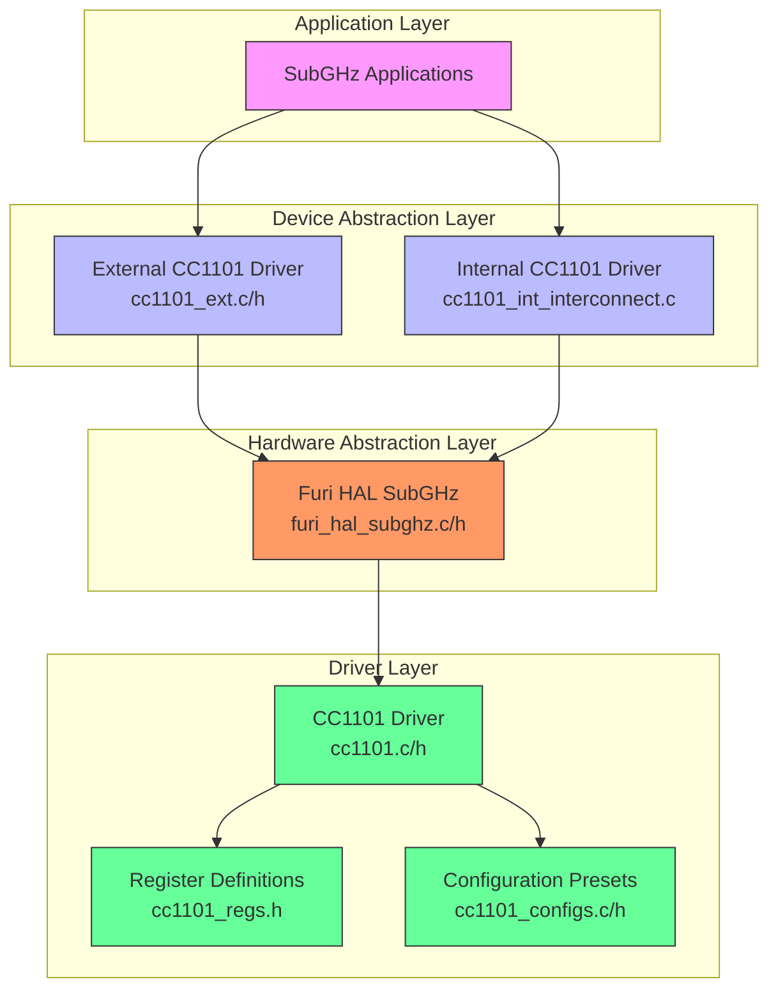
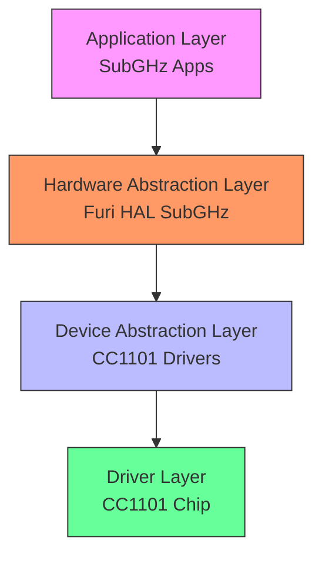
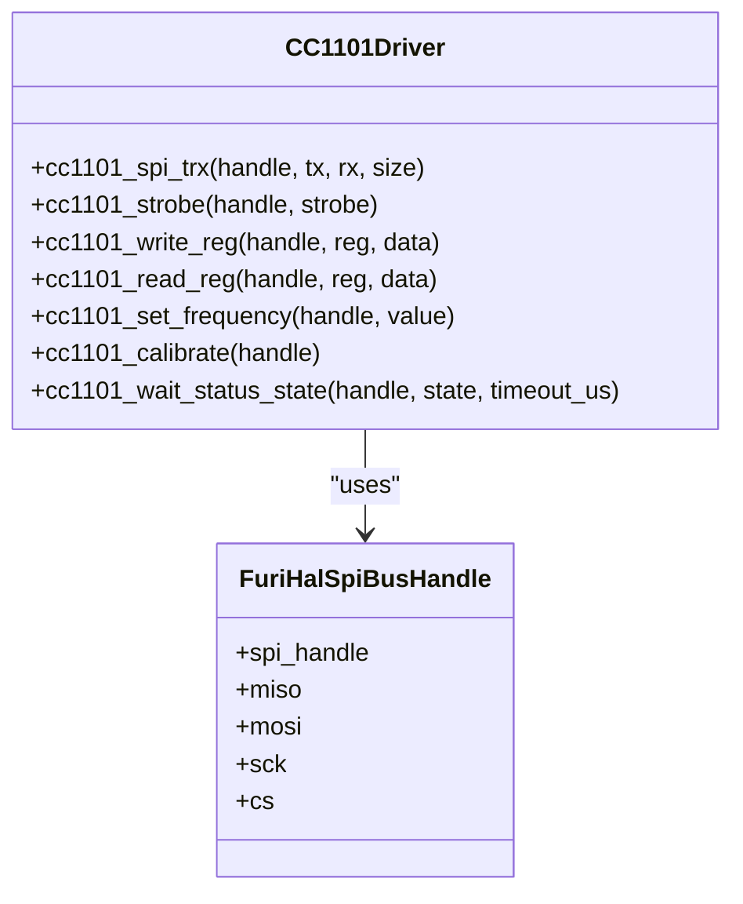
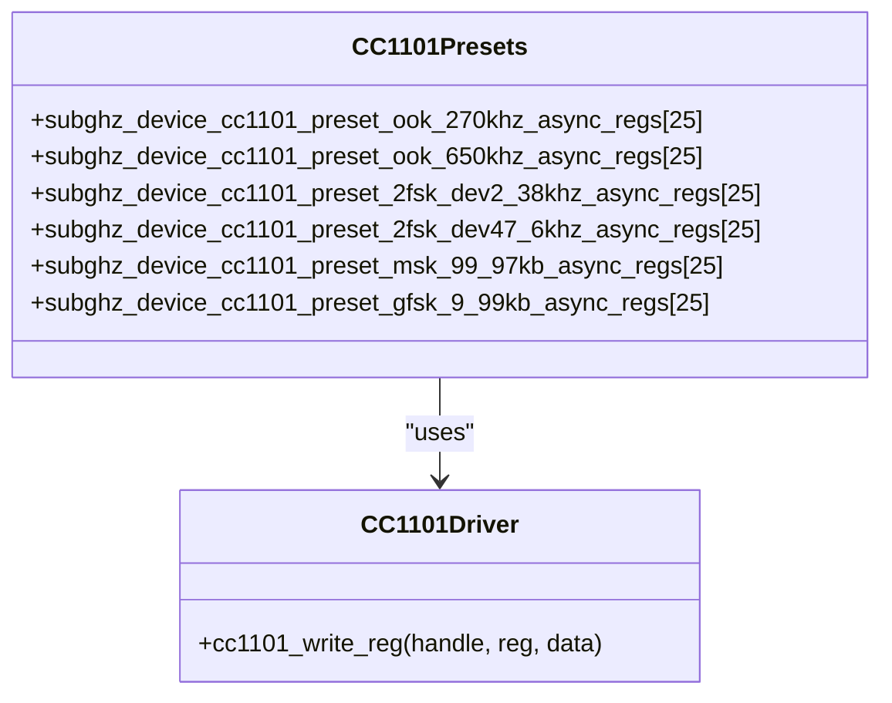
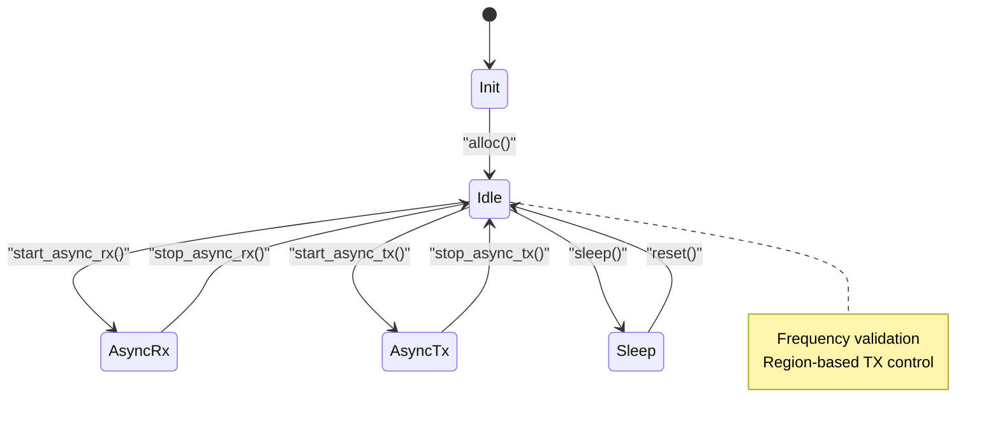
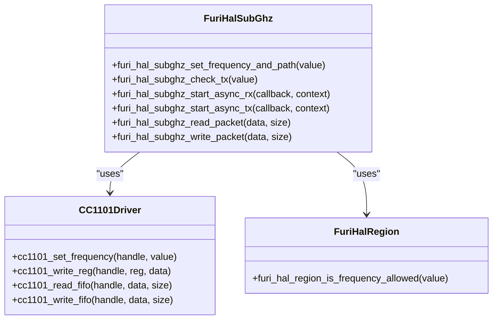
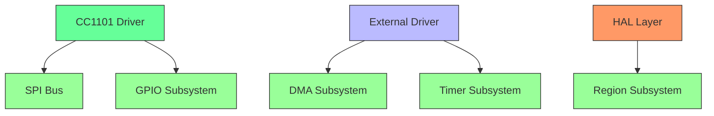

# CC1101 Radio Transceiver

<cite>
**Referenced Files in This Document**   
- [cc1101.c](file://lib/drivers/cc1101.c)
- [cc1101.h](file://lib/drivers/cc1101.h)
- [cc1101_regs.h](file://lib/drivers/cc1101_regs.h)
- [cc1101_ext.c](file://applications/drivers/subghz/cc1101_ext/cc1101_ext.c)
- [cc1101_ext.h](file://applications/drivers/subghz/cc1101_ext/cc1101_ext.h)
- [cc1101_configs.c](file://lib/subghz/devices/cc1101_configs.c)
- [cc1101_configs.h](file://lib/subghz/devices/cc1101_configs.h)
- [cc1101_int_interconnect.c](file://lib/subghz/devices/cc1101_int/cc1101_int_interconnect.c)
- [furi_hal_subghz.c](file://targets/f7/furi_hal/furi_hal_subghz.c)
- [furi_hal_subghz.h](file://targets/f7/furi_hal/furi_hal_subghz.h)
- [cc1101.md](file://documentation/SubGHz/cc1101.md)
</cite>

## Table of Contents
1. [Introduction](#introduction)
2. [Project Structure](#project-structure)
3. [Core Components](#core-components)
4. [Architecture Overview](#architecture-overview)
5. [Detailed Component Analysis](#detailed-component-analysis)
6. [Dependency Analysis](#dependency-analysis)
7. [Performance Considerations](#performance-considerations)
8. [Troubleshooting Guide](#troubleshooting-guide)
9. [Conclusion](#conclusion)

## Introduction
The CC1101 is a low-power sub-1 GHz radio transceiver integrated circuit designed for wireless applications in the 315, 433, 868, and 915 MHz ISM/SRD bands. This document provides a comprehensive analysis of the CC1101 implementation within the Flipper Zero firmware, covering its architecture, core components, and integration with the system. The CC1101 enables the Flipper Zero to perform sub-GHz wireless communication for applications such as remote controls, sensors, and security systems.

**Section sources**
- [cc1101.md](file://documentation/SubGHz/cc1101.md#L1-L800)

## Project Structure
The CC1101 radio transceiver functionality is implemented across multiple directories within the Flipper Zero firmware repository. The primary components are organized as follows:

- **lib/drivers**: Contains the low-level driver for the CC1101 chip, including `cc1101.c`, `cc1101.h`, and register definitions in `cc1101_regs.h`. This layer provides direct SPI communication and register manipulation.
- **lib/subghz/devices**: Houses device-specific configurations and presets for the CC1101, including `cc1101_configs.c` and `cc1101_configs.h`, which define various modulation schemes and register settings.
- **applications/drivers/subghz/cc1101_ext**: Contains the external CC1101 driver implementation for extended functionality, including asynchronous RX/TX operations and power amplifier control.
- **targets/f7/furi_hal**: Implements the hardware abstraction layer (HAL) for sub-GHz operations, with `furi_hal_subghz.c` and `furi_hal_subghz.h` providing a unified interface to the CC1101 driver.
- **documentation/SubGHz**: Includes detailed documentation on the CC1101, such as `cc1101.md`, which describes the chip's features and specifications.

**Diagram sources **
- [cc1101_ext.c](file://applications/drivers/subghz/cc1101_ext/cc1101_ext.c#L102-L100)
- [cc1101_int_interconnect.c](file://lib/subghz/devices/cc1101_int/cc1101_int_interconnect.c#L60-L98)
- [furi_hal_subghz.c](file://targets/f7/furi_hal/furi_hal_subghz.c#L61-L69)
- [cc1101.c](file://lib/drivers/cc1101.c#L1-L189)

**Section sources**
- [cc1101_ext.c](file://applications/drivers/subghz/cc1101_ext/cc1101_ext.c#L1-L953)
- [cc1101_int_interconnect.c](file://lib/subghz/devices/cc1101_int/cc1101_int_interconnect.c#L1-L99)
- [furi_hal_subghz.c](file://targets/f7/furi_hal/furi_hal_subghz.c#L1-L926)

## Core Components
The CC1101 implementation in the Flipper Zero firmware consists of several core components that work together to provide sub-GHz wireless communication capabilities. The low-level driver in `cc1101.c` provides functions for SPI communication, register access, and state management, such as `cc1101_strobe`, `cc1101_write_reg`, and `cc1101_read_reg`. These functions allow for direct control of the CC1101 chip's registers and status.

The configuration presets in `cc1101_configs.c` define various modulation schemes, including OOK, 2-FSK, MSK, and GFSK, with specific register settings for different data rates and bandwidths. These presets are used to configure the CC1101 for different wireless protocols. The external driver in `cc1101_ext.c` extends the functionality by providing asynchronous RX/TX operations, frequency validation, and region-based transmission control.

The hardware abstraction layer in `furi_hal_subghz.c` provides a unified interface to the CC1101 driver, abstracting the low-level details and providing higher-level functions for frequency setting, packet transmission, and signal capture. This layer also handles RF path selection for different frequency bands and integrates with the system's region and regulatory settings.

**Section sources**
- [cc1101.c](file://lib/drivers/cc1101.c#L1-L189)
- [cc1101_configs.c](file://lib/subghz/devices/cc1101_configs.c#L1-L483)
- [cc1101_ext.c](file://applications/drivers/subghz/cc1101_ext/cc1101_ext.c#L1-L953)
- [furi_hal_subghz.c](file://targets/f7/furi_hal/furi_hal_subghz.c#L1-L926)

## Architecture Overview
The architecture of the CC1101 radio transceiver implementation follows a layered design, with each layer providing a specific set of functionalities. The lowest layer is the driver layer, which directly interfaces with the CC1101 chip via SPI. This layer provides basic functions for register access, state management, and data transmission.

Above the driver layer is the device abstraction layer, which provides a unified interface to the CC1101 driver. This layer includes both internal and external drivers, allowing for different configurations and use cases. The internal driver is used for the built-in CC1101, while the external driver supports additional features such as power amplifiers and extended range.

The hardware abstraction layer (HAL) sits above the device abstraction layer and provides a high-level interface to the sub-GHz functionality. This layer handles RF path selection, frequency validation, and integration with the system's region and regulatory settings. It also provides functions for asynchronous RX/TX operations, signal capture, and packet transmission.

The application layer uses the HAL to perform sub-GHz wireless communication, such as capturing and replaying remote control signals. This layered architecture allows for modularity and flexibility, enabling the system to support different CC1101 configurations and use cases.

**Diagram sources **
- [furi_hal_subghz.c](file://targets/f7/furi_hal/furi_hal_subghz.c#L61-L69)
- [cc1101_ext.c](file://applications/drivers/subghz/cc1101_ext/cc1101_ext.c#L102-L100)
- [cc1101_int_interconnect.c](file://lib/subghz/devices/cc1101_int/cc1101_int_interconnect.c#L60-L98)
- [cc1101.c](file://lib/drivers/cc1101.c#L1-L189)

## Detailed Component Analysis

### CC1101 Driver Analysis
The CC1101 driver in `cc1101.c` provides low-level functions for SPI communication and register access. The `cc1101_spi_trx` function handles SPI transactions, ensuring proper timing and synchronization with the CC1101 chip. The `cc1101_strobe` function sends strobe commands to the chip, such as reset, sleep, and mode switches. The `cc1101_write_reg` and `cc1101_read_reg` functions allow for writing to and reading from the chip's registers, respectively.

The driver also provides higher-level functions for common operations, such as `cc1101_set_frequency`, which calculates and sets the frequency synthesizer registers based on the desired frequency, and `cc1101_calibrate`, which initiates frequency calibration. The `cc1101_wait_status_state` function waits for the chip to enter a specific state, such as idle or RX mode, ensuring proper synchronization.

**Diagram sources **
- [cc1101.c](file://lib/drivers/cc1101.c#L6-L189)

**Section sources**
- [cc1101.c](file://lib/drivers/cc1101.c#L1-L189)

### Configuration Presets Analysis
The configuration presets in `cc1101_configs.c` define various modulation schemes and register settings for the CC1101. Each preset is an array of register values that configure the chip for a specific use case, such as OOK, 2-FSK, MSK, or GFSK modulation. The presets include settings for data rate, bandwidth, deviation, and output power.

For example, the `subghz_device_cc1101_preset_ook_270khz_async_regs` preset configures the CC1101 for OOK modulation with a 270 kHz bandwidth and asynchronous data transmission. The `subghz_device_cc1101_preset_2fsk_dev2_38khz_async_regs` preset configures the chip for 2-FSK modulation with a 2.38 kHz deviation and asynchronous data transmission.

These presets are used by the device abstraction layer to configure the CC1101 for different wireless protocols. The presets are defined as constant arrays and are loaded into the chip's registers using the `cc1101_write_reg` function.

**Diagram sources **
- [cc1101_configs.c](file://lib/subghz/devices/cc1101_configs.c#L4-L483)

**Section sources**
- [cc1101_configs.c](file://lib/subghz/devices/cc1101_configs.c#L1-L483)

### External Driver Analysis
The external CC1101 driver in `cc1101_ext.c` provides extended functionality for the CC1101, such as asynchronous RX/TX operations, frequency validation, and region-based transmission control. The driver is implemented as a state machine, with states for initialization, idle, asynchronous RX, and asynchronous TX.

The `subghz_device_cc1101_ext_start_async_rx` function enables asynchronous signal capture, using a timer and DMA to capture signal timings with high precision. The `subghz_device_cc1101_ext_start_async_tx` function enables asynchronous signal transmission, using a timer and DMA to generate the signal waveform.

The driver also includes frequency validation and region-based transmission control, ensuring that transmissions are only allowed on frequencies that are supported by the hardware and permitted by the region settings. The `subghz_device_cc1101_ext_check_tx` function checks if a frequency is allowed for transmission, based on the hardware capabilities, default range, and region restrictions.

**Diagram sources **
- [cc1101_ext.c](file://applications/drivers/subghz/cc1101_ext/cc1101_ext.c#L47-L53)

**Section sources**
- [cc1101_ext.c](file://applications/drivers/subghz/cc1101_ext/cc1101_ext.c#L1-L953)

### Hardware Abstraction Layer Analysis
The hardware abstraction layer (HAL) in `furi_hal_subghz.c` provides a unified interface to the CC1101 driver, abstracting the low-level details and providing higher-level functions for frequency setting, packet transmission, and signal capture. The HAL handles RF path selection for different frequency bands, using the `furi_hal_subghz_set_path` function to configure the RF switches for 315, 433, or 868 MHz operation.

The HAL also integrates with the system's region and regulatory settings, using the `furi_hal_region_is_frequency_allowed` function to check if a frequency is permitted for transmission. The `furi_hal_subghz_check_tx` function combines hardware capabilities, default range, and region restrictions to determine if a transmission is allowed.

The HAL provides functions for asynchronous RX/TX operations, signal capture, and packet transmission, which are used by the application layer to perform sub-GHz wireless communication. The `furi_hal_subghz_start_async_rx` and `furi_hal_subghz_start_async_tx` functions enable asynchronous signal capture and transmission, respectively.

**Diagram sources **
- [furi_hal_subghz.c](file://targets/f7/furi_hal/furi_hal_subghz.c#L1-L926)

**Section sources**
- [furi_hal_subghz.c](file://targets/f7/furi_hal/furi_hal_subghz.c#L1-L926)

## Dependency Analysis
The CC1101 radio transceiver implementation has several dependencies, both internal and external. The primary internal dependency is the SPI bus, which is used to communicate with the CC1101 chip. The driver uses the `FuriHalSpiBusHandle` structure to manage the SPI bus, including the MISO, MOSI, SCK, and CS pins.

The implementation also depends on the GPIO subsystem for controlling the CC1101's GPIO pins, such as the GDO0 and GDO2 pins. The `furi_hal_gpio` functions are used to initialize and control these pins, such as setting the GDO0 pin to high-impedance mode or configuring the GDO2 pin as an output.

The external driver depends on the DMA and timer subsystems for asynchronous RX/TX operations. The `furi_hal_bus` functions are used to enable and disable the DMA and timer peripherals, while the `LL_DMA` and `LL_TIM` functions are used to configure and control them.

The hardware abstraction layer depends on the region and regulatory subsystems for frequency validation and transmission control. The `furi_hal_region` functions are used to check if a frequency is allowed for transmission, based on the region settings.

**Diagram sources **
- [cc1101.c](file://lib/drivers/cc1101.c#L6-L189)
- [cc1101_ext.c](file://applications/drivers/subghz/cc1101_ext/cc1101_ext.c#L1-L953)
- [furi_hal_subghz.c](file://targets/f7/furi_hal/furi_hal_subghz.c#L1-L926)

**Section sources**
- [cc1101.c](file://lib/drivers/cc1101.c#L1-L189)
- [cc1101_ext.c](file://applications/drivers/subghz/cc1101_ext/cc1101_ext.c#L1-L953)
- [furi_hal_subghz.c](file://targets/f7/furi_hal/furi_hal_subghz.c#L1-L926)

## Performance Considerations
The CC1101 radio transceiver implementation is designed for low-power operation, with several features to minimize power consumption. The chip supports sleep and power-down modes, which can be entered using the `cc1101_shutdown` and `cc1101_switch_to_idle` functions. In sleep mode, the chip consumes only 0.2 µA, making it suitable for battery-powered applications.

The asynchronous RX/TX operations use DMA and timers to minimize CPU usage, allowing the system to enter low-power modes while the signal is being captured or transmitted. The `furi_hal_subghz_start_async_rx` and `furi_hal_subghz_start_async_tx` functions enable these operations, reducing the CPU load and power consumption.

The frequency validation and region-based transmission control ensure that transmissions are only allowed on frequencies that are supported by the hardware and permitted by the region settings. This prevents unnecessary transmissions and reduces power consumption.

The CC1101 chip itself has several low-power features, such as a 200 nA sleep mode current consumption and a fast startup time of 240 µs from sleep to RX or TX mode. The wake-on-radio functionality allows for automatic low-power RX polling, further reducing power consumption.

**Section sources**
- [cc1101.md](file://documentation/SubGHz/cc1101.md#L79-L90)
- [cc1101.c](file://lib/drivers/cc1101.c#L95-L97)
- [cc1101_ext.c](file://applications/drivers/subghz/cc1101_ext/cc1101_ext.c#L298-L311)
- [furi_hal_subghz.c](file://targets/f7/furi_hal/furi_hal_subghz.c#L180-L193)

## Troubleshooting Guide
When troubleshooting issues with the CC1101 radio transceiver, several common problems and solutions should be considered. If the CC1101 is not responding to SPI commands, check the SPI bus connections and ensure that the CS pin is properly controlled. The `cc1101_get_partnumber` and `cc1101_get_version` functions can be used to verify that the chip is responding correctly.

If the CC1101 is not receiving or transmitting signals, check the RF path selection and ensure that the correct frequency band is selected. The `furi_hal_subghz_set_path` function should be called with the appropriate path for the desired frequency band.

If the signal quality is poor, check the antenna and RF matching network. The CC1101 requires a balun and matching network to convert the differential RF signal to a single-ended signal and match the impedance to 50 ohms. The reference designs in the CC1101 documentation provide recommended values for the matching components.

If the transmission is blocked on a specific frequency, check the region and regulatory settings. The `furi_hal_subghz_check_tx` function can be used to determine why a transmission is blocked, based on the hardware capabilities, default range, and region restrictions.

**Section sources**
- [cc1101.md](file://documentation/SubGHz/cc1101.md#L715-L787)
- [cc1101.c](file://lib/drivers/cc1101.c#L119-L121)
- [cc1101_ext.c](file://applications/drivers/subghz/cc1101_ext/cc1101_ext.c#L528-L558)
- [furi_hal_subghz.c](file://targets/f7/furi_hal/furi_hal_subghz.c#L411-L441)

## Conclusion
The CC1101 radio transceiver implementation in the Flipper Zero firmware provides a robust and flexible solution for sub-GHz wireless communication. The layered architecture, with separate driver, device abstraction, and hardware abstraction layers, allows for modularity and flexibility, enabling the system to support different CC1101 configurations and use cases.

The implementation includes a comprehensive set of features, such as low-power operation, asynchronous RX/TX, frequency validation, and region-based transmission control. The configuration presets provide support for various modulation schemes, making it suitable for a wide range of wireless protocols.

The integration with the system's region and regulatory settings ensures compliance with local regulations, while the hardware abstraction layer provides a unified interface to the CC1101 driver. The use of DMA and timers for asynchronous operations minimizes CPU usage and power consumption, making it suitable for battery-powered applications.

Overall, the CC1101 implementation in the Flipper Zero firmware is a well-designed and feature-rich solution for sub-GHz wireless communication, providing the foundation for a wide range of applications.