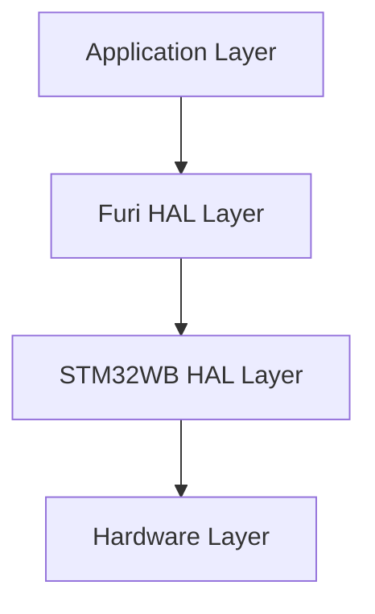
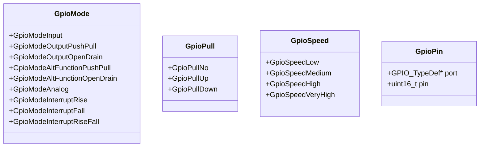
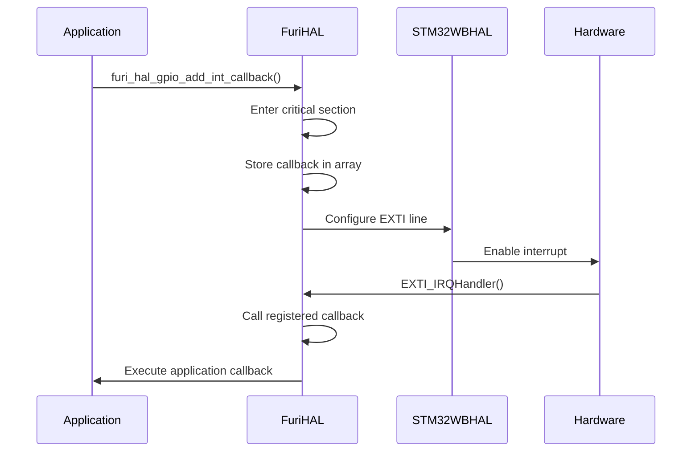
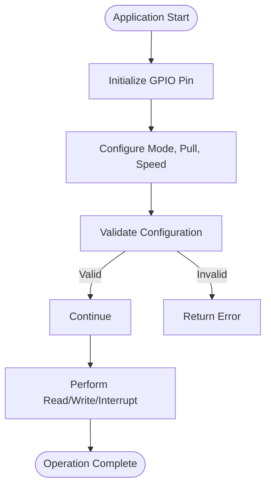
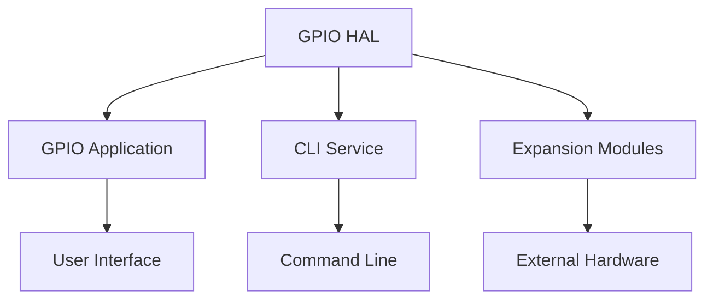

# GPIO Interface

<cite>
**Referenced Files in This Document**   
- [furi_hal_gpio.h](file://targets/f7/furi_hal/furi_hal_gpio.h)
- [furi_hal_gpio.c](file://targets/f7/furi_hal/furi_hal_gpio.c)
- [gpio_app.c](file://applications/main/gpio/gpio_app.c)
- [gpio_app_i.h](file://applications/main/gpio/gpio_app_i.h)
- [gpio_test.c](file://applications/main/gpio/views/gpio_test.c)
- [gpio_scene_start.c](file://applications/main/gpio/scenes/gpio_scene_start.c)
- [stm32wbxx_hal_gpio.h](file://lib/stm32wb_hal/Inc/stm32wbxx_hal_gpio.h)
- [stm32wbxx_hal_gpio.c](file://lib/stm32wb_hal/Src/stm32wbxx_hal_gpio.c)
- [cli_command_gpio.c](file://applications/services/cli/cli_command_gpio.c)
</cite>

## Table of Contents
1. [Introduction](#introduction)
2. [GPIO Driver Architecture](#gpio-driver-architecture)
3. [Pin Configuration Options](#pin-configuration-options)
4. [Interrupt Handling Mechanisms](#interrupt-handling-mechanisms)
5. [API Functions and Usage](#api-functions-and-usage)
6. [Relationship with Higher-Level Applications](#relationship-with-higher-level-applications)
7. [Common Issues and Best Practices](#common-issues-and-best-practices)
8. [Performance Considerations](#performance-considerations)
9. [Conclusion](#conclusion)

## Introduction
The GPIO interface in the Flipper Zero firmware provides a comprehensive system for controlling general-purpose input/output pins on the device. This documentation details the architecture, configuration options, interrupt handling, API usage, and best practices for working with GPIO pins. The implementation is built on top of the STM32WB HAL (Hardware Abstraction Layer) with a Furi HAL layer providing additional abstractions for the Flipper Zero platform.

**Section sources**
- [furi_hal_gpio.h](file://targets/f7/furi_hal/furi_hal_gpio.h#L1-L287)
- [furi_hal_gpio.c](file://targets/f7/furi_hal/furi_hal_gpio.c#L1-L343)

## GPIO Driver Architecture

The GPIO driver architecture in the Flipper Zero firmware consists of multiple layers that provide abstraction from the hardware to the application level. At the lowest level, the STM32WB HAL provides direct access to the GPIO registers and hardware features of the STM32WB microcontroller. Above this, the Furi HAL layer implements a more user-friendly interface with additional safety checks and convenience functions.

The architecture follows a layered approach:
1. **Hardware Layer**: Direct register access to GPIO peripherals
2. **STM32WB HAL Layer**: Standardized API for GPIO operations
3. **Furi HAL Layer**: Flipper-specific abstractions and safety features
4. **Application Layer**: User-facing applications and services

This layered architecture allows for hardware abstraction while maintaining efficient access to GPIO functionality. The Furi HAL layer provides additional features such as critical section protection during configuration changes and validation of input parameters to prevent invalid configurations.

**Diagram sources **
- [furi_hal_gpio.h](file://targets/f7/furi_hal/furi_hal_gpio.h#L1-L287)
- [furi_hal_gpio.c](file://targets/f7/furi_hal/furi_hal_gpio.c#L1-L343)
- [stm32wbxx_hal_gpio.h](file://lib/stm32wb_hal/Inc/stm32wbxx_hal_gpio.h#L1-L329)

**Section sources**
- [furi_hal_gpio.h](file://targets/f7/furi_hal/furi_hal_gpio.h#L1-L287)
- [furi_hal_gpio.c](file://targets/f7/furi_hal/furi_hal_gpio.c#L1-L343)

## Pin Configuration Options

The GPIO interface supports multiple pin configuration modes that can be set according to the application requirements. These modes include input, output, alternate function, and analog configurations, each with specific pull-up/pull-down and speed settings.

### Input and Output Modes
The GPIO pins can be configured in several modes:

- **Input Mode**: Configures the pin as a digital input with configurable pull resistors
- **Output Push-Pull**: Configures the pin as a digital output with push-pull driver
- **Output Open-Drain**: Configures the pin as an open-drain output
- **Alternate Function Push-Pull/Open-Drain**: Configures the pin for peripheral functions
- **Analog Mode**: Configures the pin for analog input/output
- **Interrupt Modes**: Configures the pin to generate interrupts on rising/falling edges

### Pull-Up/Down Configuration
Each GPIO pin supports configurable pull resistors:
- **No Pull**: No internal pull resistor
- **Pull-Up**: Internal pull-up resistor enabled
- **Pull-Down**: Internal pull-down resistor enabled

The pull configuration is important for ensuring stable signal levels when the pin is not actively driven.

### Speed Settings
The GPIO pins support multiple speed settings that affect the slew rate of output signals:
- **Low Speed**: Minimum slew rate
- **Medium Speed**: Medium slew rate
- **High Speed**: High slew rate
- **Very High Speed**: Maximum slew rate

Higher speed settings allow for faster signal transitions but may increase electromagnetic interference.

**Diagram sources **
- [furi_hal_gpio.h](file://targets/f7/furi_hal/furi_hal_gpio.h#L32-L64)
- [furi_hal_gpio.c](file://targets/f7/furi_hal/furi_hal_gpio.c#L86-L192)

**Section sources**
- [furi_hal_gpio.h](file://targets/f7/furi_hal/furi_hal_gpio.h#L32-L64)
- [furi_hal_gpio.c](file://targets/f7/furi_hal/furi_hal_gpio.c#L86-L192)

## Interrupt Handling Mechanisms

The GPIO interrupt system in the Flipper Zero firmware provides a flexible mechanism for responding to pin state changes. The implementation supports various interrupt types and a callback-based architecture for handling events.

### Interrupt Types
The GPIO system supports several interrupt trigger conditions:
- **Rising Edge**: Interrupt on low-to-high transition
- **Falling Edge**: Interrupt on high-to-low transition
- **Rising and Falling Edges**: Interrupt on any edge transition
- **Event Mode**: Generates events without CPU wake-up (lower power)

### Interrupt Registration
The interrupt handling system uses a callback registration mechanism that allows applications to register functions that will be called when specific pin events occur. The system maintains an array of interrupt callbacks, with one entry per pin.

The interrupt registration process involves:
1. Calling `furi_hal_gpio_add_int_callback()` to register a callback function
2. Enabling the interrupt with `furi_hal_gpio_enable_int_callback()`
3. The system dispatches interrupts through dedicated IRQ handlers
4. Registered callbacks are executed in the interrupt context

### Critical Section Protection
The interrupt configuration functions use critical sections to ensure atomic updates to the interrupt configuration. This prevents race conditions when modifying interrupt settings from different contexts.

**Diagram sources **
- [furi_hal_gpio.h](file://targets/f7/furi_hal/furi_hal_gpio.h#L19-L27)
- [furi_hal_gpio.c](file://targets/f7/furi_hal/furi_hal_gpio.c#L196-L250)
- [furi_hal_gpio.c](file://targets/f7/furi_hal/furi_hal_gpio.c#L258-L343)

**Section sources**
- [furi_hal_gpio.h](file://targets/f7/furi_hal/furi_hal_gpio.h#L19-L27)
- [furi_hal_gpio.c](file://targets/f7/furi_hal/furi_hal_gpio.c#L196-L250)

## API Functions and Usage

The GPIO API provides a comprehensive set of functions for configuring and controlling GPIO pins. These functions are designed to be intuitive and safe to use, with parameter validation to prevent invalid configurations.

### Initialization Functions
The API provides three levels of initialization functions:

- **Simple Initialization**: `furi_hal_gpio_init_simple()` - Basic mode configuration
- **Normal Initialization**: `furi_hal_gpio_init()` - Mode, pull, and speed configuration
- **Extended Initialization**: `furi_hal_gpio_init_ex()` - Full configuration including alternate functions

### Read/Write Operations
The API includes optimized functions for reading and writing pin states:

- **Reading**: `furi_hal_gpio_read()` - Read the current state of a pin
- **Writing**: `furi_hal_gpio_write()` - Set the state of a pin
- **Atomic Operations**: Uses the BSRR register for atomic bit set/reset operations

### Interrupt Management
The API provides functions for managing interrupt callbacks:

- **Add Callback**: `furi_hal_gpio_add_int_callback()` - Register an interrupt handler
- **Enable/Disable**: `furi_hal_gpio_enable_int_callback()` and `furi_hal_gpio_disable_int_callback()`
- **Remove Callback**: `furi_hal_gpio_remove_int_callback()` - Unregister a handler

### Example Usage
The CLI command implementation demonstrates typical API usage patterns, including parameter validation and error handling when attempting to read from an input pin or write to an output pin.

**Diagram sources **
- [furi_hal_gpio.h](file://targets/f7/furi_hal/furi_hal_gpio.h#L171-L282)
- [furi_hal_gpio.c](file://targets/f7/furi_hal/furi_hal_gpio.c#L58-L194)
- [cli_command_gpio.c](file://applications/services/cli/cli_command_gpio.c#L117-L156)

**Section sources**
- [furi_hal_gpio.h](file://targets/f7/furi_hal/furi_hal_gpio.h#L171-L282)
- [furi_hal_gpio.c](file://targets/f7/furi_hal/furi_hal_gpio.c#L58-L194)

## Relationship with Higher-Level Applications

The GPIO HAL layer serves as the foundation for higher-level applications that provide user interfaces and specialized functionality. The GPIO application is the primary user interface for GPIO functionality, while other services build on the same underlying API.

### GPIO Application
The main GPIO application provides a user interface for:
- Manual control of GPIO pins
- USB-UART bridge functionality
- I2C scanner and SFP control
- 5V power output control

The application uses a scene-based architecture with the View Dispatcher and Scene Manager to manage different views and user interactions.

### CLI Integration
The CLI service provides command-line access to GPIO functionality, allowing users to read pin states and set output levels from the command line interface. This demonstrates how multiple applications can share the same underlying GPIO API.

### Expansion Module Support
The GPIO system supports expansion modules through the expansion interface, allowing external hardware to be controlled via GPIO pins. The application manages expansion module state when entering and exiting GPIO mode.

**Diagram sources **
- [gpio_app.c](file://applications/main/gpio/gpio_app.c#L24-L136)
- [gpio_app_i.h](file://applications/main/gpio/gpio_app_i.h#L24-L42)
- [gpio_scene_start.c](file://applications/main/gpio/scenes/gpio_scene_start.c#L1-L129)

**Section sources**
- [gpio_app.c](file://applications/main/gpio/gpio_app.c#L24-L136)
- [gpio_app_i.h](file://applications/main/gpio/gpio_app_i.h#L24-L42)

## Common Issues and Best Practices

When working with GPIO pins on the Flipper Zero, several common issues can arise. Understanding these issues and following best practices can help prevent problems and ensure reliable operation.

### Pin Conflicts
Pin conflicts can occur when multiple applications or services attempt to use the same GPIO pin simultaneously. The system does not have a centralized pin reservation mechanism, so applications must coordinate pin usage.

**Best Practices:**
- Document pin usage in application documentation
- Use descriptive names for GPIO pins
- Check current pin configuration before changing it
- Restore original configuration when application exits

### Electrical Limitations
The GPIO pins have electrical limitations that must be respected:
- Maximum current per pin: 25mA
- Total current per port: 150mA
- Voltage levels: 3.3V logic
- No 5V tolerance on most pins

**Best Practices:**
- Use appropriate current-limiting resistors
- Avoid driving high-current loads directly
- Use external drivers for motors or high-power LEDs
- Be aware of power supply limitations

### Configuration Safety
Improper configuration can damage hardware or cause unpredictable behavior.

**Best Practices:**
- Always validate pin configurations
- Use pull resistors on unused inputs
- Initialize pins to safe states at startup
- Disable peripherals when not in use

## Performance Considerations

When using GPIO pins for high-speed applications, several performance factors should be considered to achieve optimal results.

### Rapid Pin Toggling
For applications requiring rapid pin toggling (such as bit-banging protocols), the following optimizations can improve performance:

- Use direct register access when possible
- Minimize function call overhead
- Use atomic bit set/reset operations (BSRR register)
- Consider using DMA for high-speed data transfer
- Optimize compiler settings for speed

The `furi_hal_gpio_write()` function uses the BSRR register for atomic operations, which provides optimal performance for pin state changes.

### Power Consumption Optimization
GPIO configuration can significantly impact power consumption:

- Configure unused pins as analog inputs (lowest power)
- Use sleep modes when GPIO activity is not required
- Disable pull resistors when not needed
- Use interrupt-driven designs instead of polling
- Consider duty cycle for output pins

### Timing Constraints
When implementing timing-critical protocols, be aware of:
- Function call overhead
- Interrupt latency
- System tick resolution
- Compiler optimization effects

For the most precise timing, consider using hardware peripherals (TIM, SPI, I2C) instead of software bit-banging when possible.

## Conclusion
The GPIO interface in the Flipper Zero firmware provides a robust and flexible system for controlling general-purpose input/output pins. The layered architecture offers both low-level hardware access and high-level abstractions for application development. By understanding the configuration options, interrupt mechanisms, and API functions, developers can effectively utilize GPIO functionality for a wide range of applications. Following best practices for pin management, electrical safety, and performance optimization ensures reliable and efficient operation of GPIO-based features.