# Hardware Interfaces

<cite>
**Referenced Files in This Document**   
- [furi_hal.h](file://targets/furi_hal_include/furi_hal.h)
- [furi_hal_i2c.h](file://targets/furi_hal_include/furi_hal_i2c.h)
- [furi_hal_spi.h](file://targets/furi_hal_include/furi_hal_spi.h)
- [furi_hal_adc.h](file://targets/furi_hal_include/furi_hal_adc.h)
- [furi_hal_spi_config.h](file://targets/f7/furi_hal/furi_hal_spi_config.h)
- [furi_hal_i2c_config.h](file://targets/f7/furi_hal/furi_hal_i2c_config.h)
- [furi_hal_spi_types.h](file://targets/f7/furi_hal/furi_hal_spi_types.h)
- [furi_hal_i2c_types.h](file://targets/f7/furi_hal/furi_hal_i2c_types.h)
- [example_adc.c](file://applications/examples/example_adc/example_adc.c)
- [adc.js](file://applications/system/js_app/examples/apps/Scripts/adc.js)
- [i2c.js](file://applications/system/js_app/examples/apps/Scripts/i2c.js)
</cite>

## Table of Contents
1. [Hardware Abstraction Layer Architecture](#hardware-abstraction-layer-architecture)
2. [GPIO Interface](#gpio-interface)
3. [I2C Interface](#i2c-interface)
4. [SPI Interface](#spi-interface)
5. [ADC Interface](#adc-interface)
6. [Practical Examples](#practical-examples)
7. [Electrical Characteristics and Best Practices](#electrical-characteristics-and-best-practices)
8. [Troubleshooting Common Issues](#troubleshooting-common-issues)
9. [Performance Considerations](#performance-considerations)

## Hardware Abstraction Layer Architecture

The Flipper Zero firmware implements a comprehensive Hardware Abstraction Layer (HAL) that provides consistent access to physical peripherals across different hardware targets. The HAL architecture is designed to abstract low-level hardware details while maintaining efficient access to peripheral functionality.

The HAL is organized into modular components, each responsible for a specific hardware interface. These components follow a consistent design pattern with early initialization, runtime operation, and proper deinitialization. The architecture enables multiple applications to safely share hardware resources through handle-based access control.

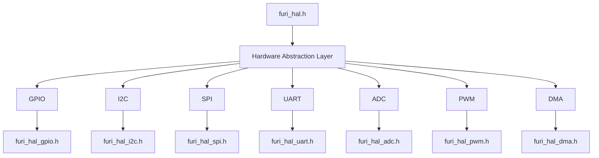

**Diagram sources**
- [furi_hal.h](file://targets/furi_hal_include/furi_hal.h)
- [furi_hal_i2c.h](file://targets/furi_hal_include/furi_hal_i2c.h)
- [furi_hal_spi.h](file://targets/furi_hal_include/furi_hal_spi.h)
- [furi_hal_adc.h](file://targets/furi_hal_include/furi_hal_adc.h)

**Section sources**
- [furi_hal.h](file://targets/furi_hal_include/furi_hal.h#L1-L79)

## GPIO Interface

The General Purpose Input/Output (GPIO) interface provides direct access to the microcontroller's digital pins. The HAL exposes GPIO functionality through a simple API that allows configuration of pin direction, pull-up/pull-down resistors, and drive strength.

GPIO pins can be configured for various modes including input, output, alternate function, and analog. The interface supports both individual pin operations and bulk operations for improved performance when manipulating multiple pins simultaneously.

The GPIO subsystem is tightly integrated with other peripherals, allowing pins to be reassigned between different functions as needed by applications. Resource management ensures that pins are properly released when no longer in use, preventing conflicts between applications.

**Section sources**
- [furi_hal.h](file://targets/furi_hal_include/furi_hal.h#L27)
- [furi_hal_gpio.h](file://targets/furi_hal_include/furi_hal_gpio.h)

## I2C Interface

The Inter-Integrated Circuit (I2C) interface implementation provides a robust and flexible API for communicating with I2C devices. The HAL supports both standard (100 kbps) and fast (400 kbps) modes, with configurable clock speeds to accommodate various device requirements.

The I2C subsystem features a handle-based architecture that allows multiple applications to safely share the I2C bus. Each application acquires a bus handle before communication and releases it afterward, ensuring proper bus arbitration and preventing conflicts.

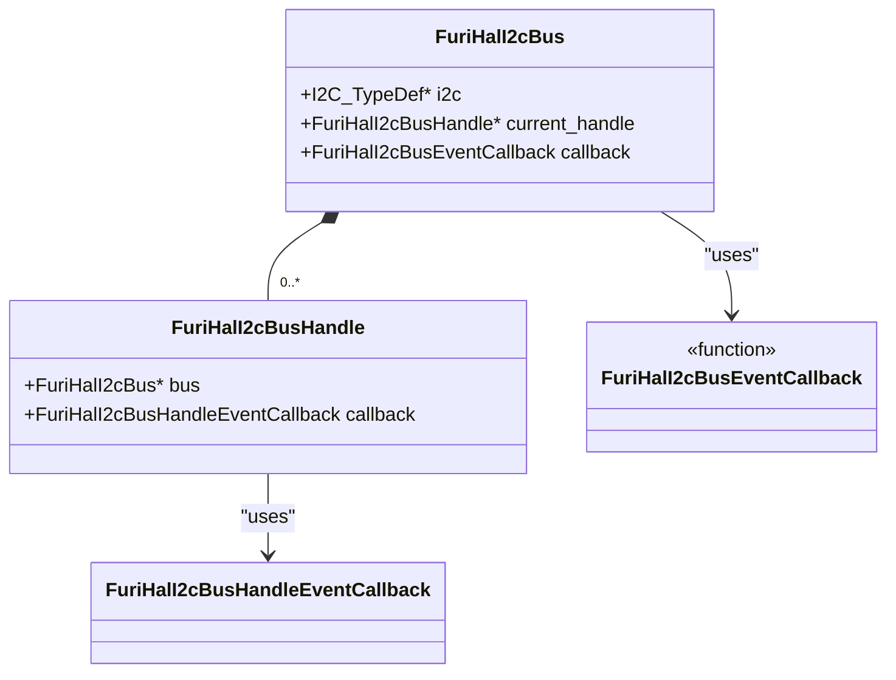

The API provides comprehensive functionality including:
- Standard TX/RX operations with timeout support
- Combined transmit-receive transactions (TRX)
- Device presence detection
- Register-level read/write operations for 8-bit and 16-bit registers
- Memory read/write operations for devices with internal address spaces

The implementation includes two separate I2C buses:
- Internal power bus (I2C1) running at 400 kHz
- External bus (I2C3) running at 100 kHz

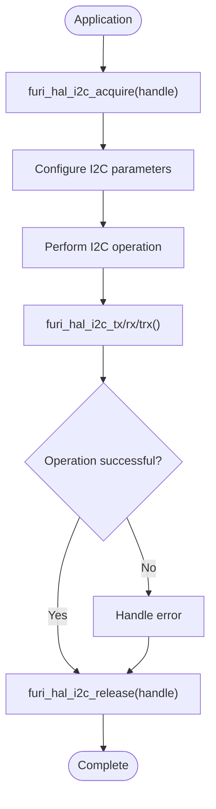

**Diagram sources**
- [furi_hal_i2c.h](file://targets/furi_hal_include/furi_hal_i2c.h#L16-L288)
- [furi_hal_i2c_types.h](file://targets/f7/furi_hal/furi_hal_i2c_types.h#L1-L52)
- [furi_hal_i2c_config.h](file://targets/f7/furi_hal/furi_hal_i2c_config.h#L1-L32)

**Section sources**
- [furi_hal_i2c.h](file://targets/furi_hal_include/furi_hal_i2c.h#L1-L288)
- [furi_hal_i2c_config.h](file://targets/f7/furi_hal/furi_hal_i2c_config.h#L1-L32)

## SPI Interface

The Serial Peripheral Interface (SPI) implementation provides high-speed synchronous communication with external devices. The HAL supports multiple SPI buses with different configurations optimized for specific peripherals.

The SPI subsystem features a dual-bus architecture:
- SPI Bus R (Radio): Shared by CC1101, NFC, and external devices
- SPI Bus D (Display): Dedicated to display and SD card operations

Each bus supports multiple device handles with predefined configurations for common peripherals:
- CC1101: 1-edge, low polarity, 8 MHz
- ST25R3916 (NFC): 2-edge, low polarity, 8 MHz  
- ST7567 (Display): 1-edge, low polarity, 4 MHz
- SD Card (fast): 1-edge, low polarity, 16 MHz
- SD Card (slow): 1-edge, low polarity, 2 MHz

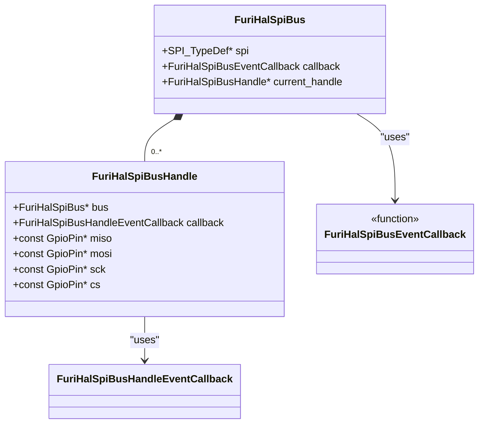

The API provides three main operation types:
- Receive (RX): Read data from peripheral
- Transmit (TX): Send data to peripheral
- Transmit-Receive (TRX): Full duplex communication

Additionally, DMA-based operations are available for high-throughput applications, reducing CPU overhead during large data transfers.

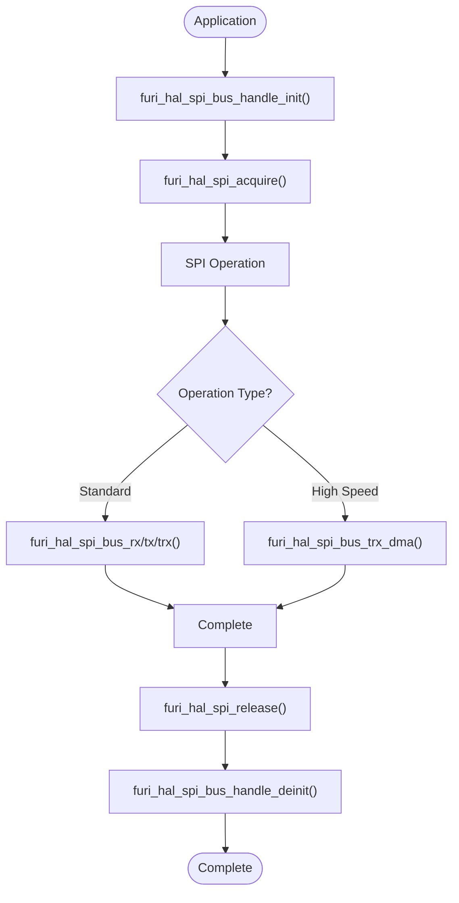

**Diagram sources**
- [furi_hal_spi.h](file://targets/furi_hal_include/furi_hal_spi.h#L1-L129)
- [furi_hal_spi_types.h](file://targets/f7/furi_hal/furi_hal_spi_types.h#L1-L63)
- [furi_hal_spi_config.h](file://targets/f7/furi_hal/furi_hal_spi_config.h#L1-L76)

**Section sources**
- [furi_hal_spi.h](file://targets/furi_hal_include/furi_hal_spi.h#L1-L129)
- [furi_hal_spi_config.h](file://targets/f7/furi_hal/furi_hal_spi_config.h#L1-L76)

## ADC Interface

The Analog-to-Digital Converter (ADC) interface provides precise measurement of analog signals with 12-bit resolution. The HAL implementation is optimized for accuracy and stability, using the internal voltage reference to minimize noise from the power supply.

The ADC subsystem supports multiple channels including:
- External analog inputs (Channels 0-16)
- Internal temperature sensor (Channel 17)
- Battery voltage monitoring (Channel 18)
- Internal reference voltage (Channel VREFINT)

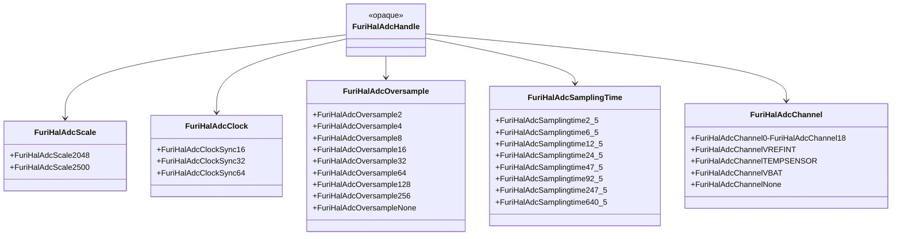

The ADC API follows a resource management pattern:
1. Initialize the ADC subsystem
2. Acquire an ADC handle
3. Configure the ADC with desired parameters
4. Perform readings
5. Release the ADC handle

Key configuration parameters include:
- Voltage scale (2.048V or 2.5V)
- Clock source and frequency
- Oversampling rate (2-256 samples)
- Sampling time (2.5-640.5 ADC clocks)

The implementation includes utility functions to convert raw ADC values to physical units:
- Voltage in millivolts
- Temperature in degrees Celsius
- Battery voltage
- Internal reference voltage

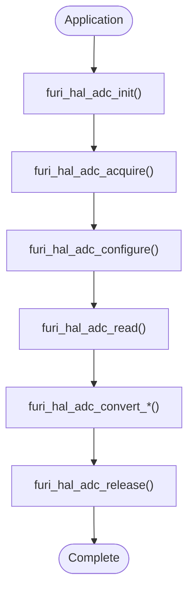

**Diagram sources**
- [furi_hal_adc.h](file://targets/furi_hal_include/furi_hal_adc.h#L1-L230)

**Section sources**
- [furi_hal_adc.h](file://targets/furi_hal_include/furi_hal_adc.h#L1-L230)

## Practical Examples

### Reading Sensor Data via I2C

The following example demonstrates reading temperature data from an I2C sensor:

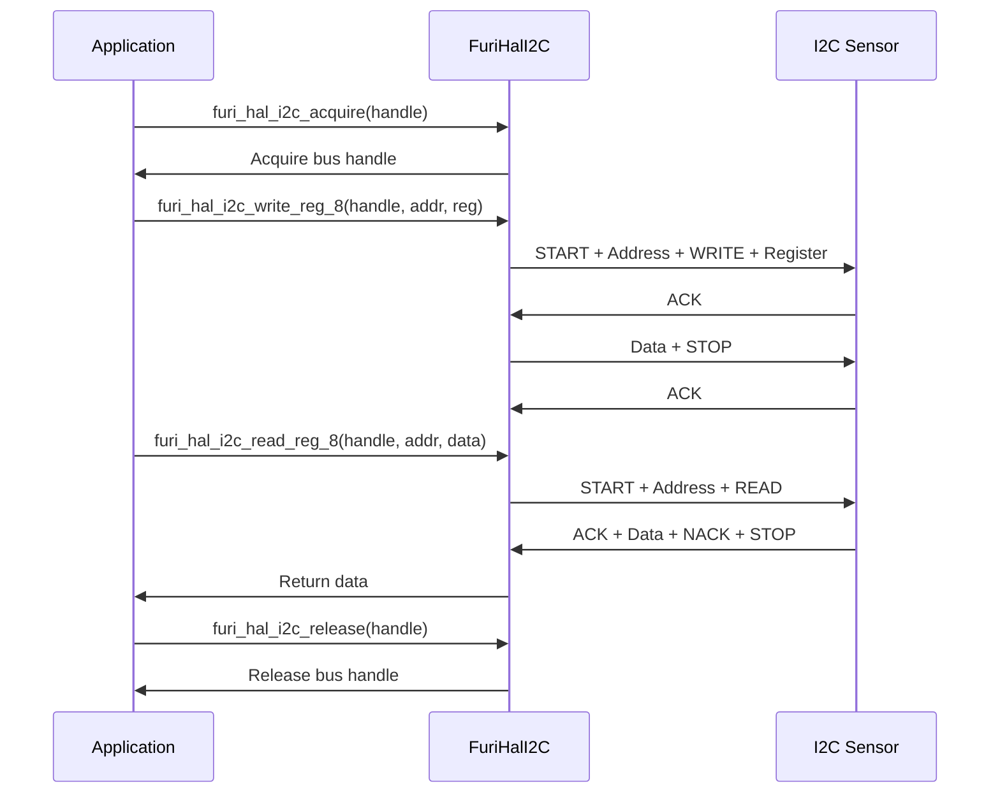

**Section sources**
- [i2c.js](file://applications/system/js_app/examples/apps/Scripts/i2c.js)

### Controlling External Devices via GPIO

The following example shows controlling an external device using GPIO:

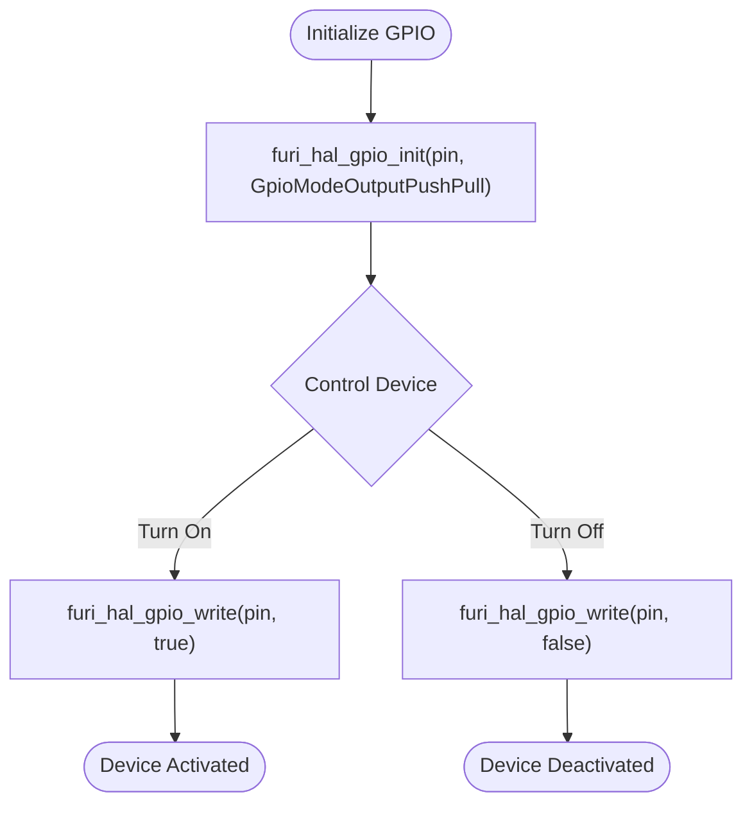

### Reading Analog Sensor Data

The following example demonstrates reading data from an analog sensor:

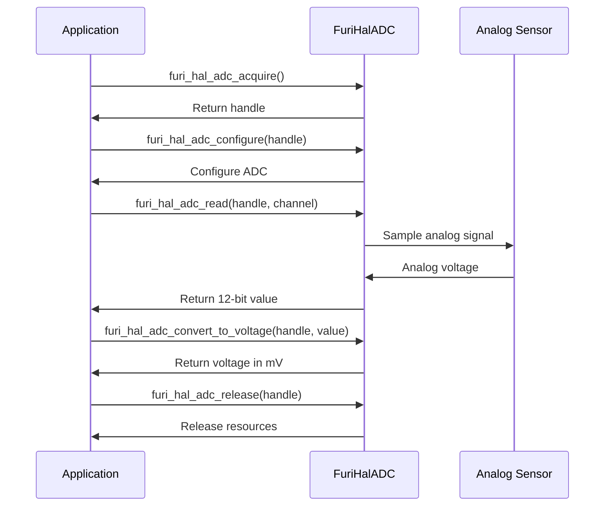

**Section sources**
- [example_adc.c](file://applications/examples/example_adc/example_adc.c)
- [adc.js](file://applications/system/js_app/examples/apps/Scripts/adc.js)

## Electrical Characteristics and Best Practices

### I2C Bus Design

The I2C interface has specific electrical requirements for reliable operation:
- Pull-up resistors required on SCL and SDA lines
- Typical pull-up values: 2.2kΩ to 10kΩ depending on bus capacitance
- Maximum bus capacitance: 400pF
- Rise time considerations for high-speed operation

Best practices for I2C communication:
- Always check device presence before communication
- Use appropriate timeouts to prevent system hangs
- Implement proper error handling for NACK conditions
- Minimize bus transactions to reduce power consumption
- Use combined transactions when reading register values

### SPI Signal Integrity

For reliable SPI communication:
- Keep trace lengths as short as possible
- Match trace lengths for high-speed interfaces
- Use appropriate termination for long traces
- Avoid sharp bends in routing
- Maintain consistent impedance

Clock speed considerations:
- 2 MHz: Suitable for most external devices
- 4 MHz: Display operations
- 8 MHz: Radio and NFC operations  
- 16 MHz: High-speed SD card operations

### ADC Measurement Accuracy

To achieve optimal ADC accuracy:
- Use the 2.048V reference for precision measurements
- Apply oversampling for noisy signals
- Select appropriate sampling time based on source impedance
- Keep analog traces away from digital noise sources
- Use bypass capacitors near the ADC inputs

Recommended circuit parameters:
- Source impedance: < 10kΩ for optimal oversampling
- Sampling time: ≥ 3.87μs for high impedance sources
- Signal bandwidth: < 1MHz to prevent aliasing

**Section sources**
- [furi_hal_adc.h](file://targets/furi_hal_include/furi_hal_adc.h#L10-L31)
- [furi_hal_i2c.h](file://targets/furi_hal_include/furi_hal_i2c.h)
- [furi_hal_spi.h](file://targets/furi_hal_include/furi_hal_spi.h)

## Troubleshooting Common Issues

### I2C Communication Problems

Common I2C issues and solutions:

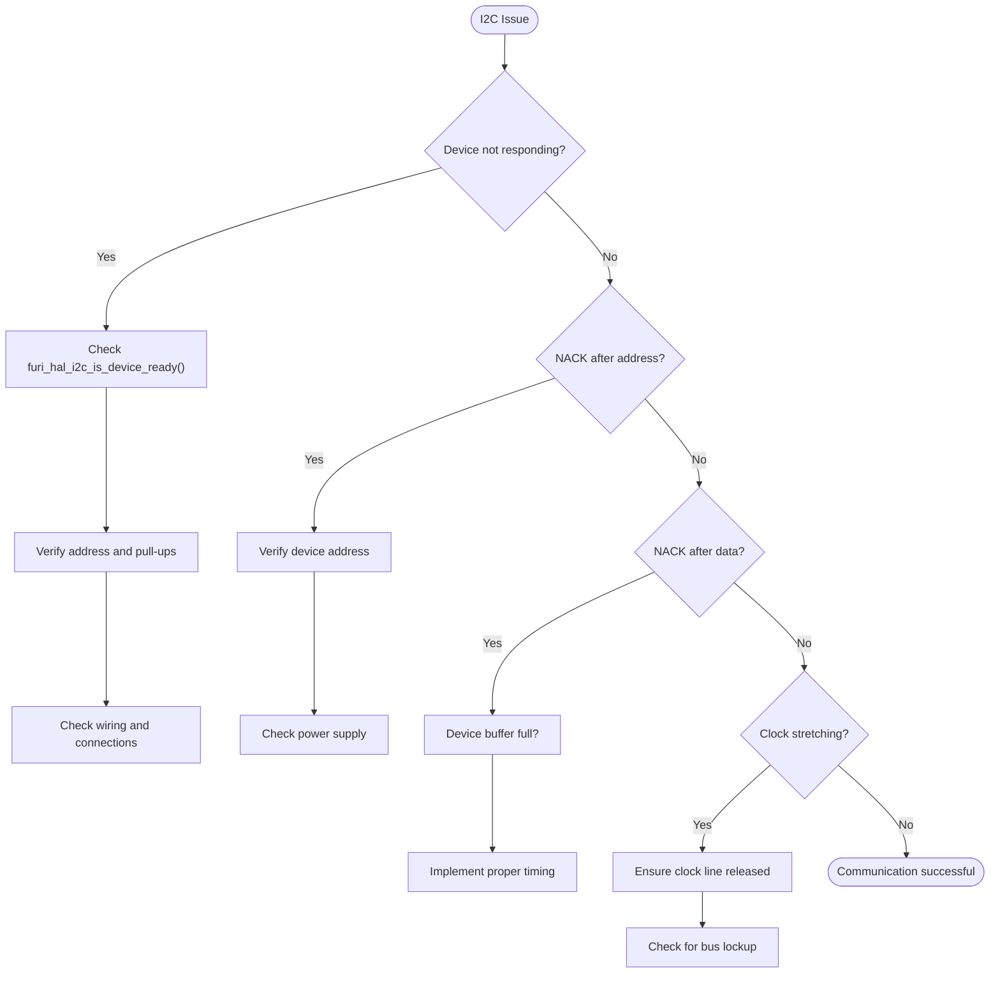

### SPI Communication Issues

Common SPI problems and resolutions:

- **CS line not transitioning**: Verify handle acquisition and release
- **Data corruption**: Check clock polarity and phase settings
- **Timing issues**: Use appropriate speed presets
- **DMA transfer failures**: Ensure proper memory alignment

### ADC Measurement Inaccuracies

Common ADC issues:
- **Noisy readings**: Increase oversampling rate
- **Inconsistent results**: Verify stable reference voltage
- **Temperature drift**: Use internal temperature compensation
- **Non-linear response**: Check input signal conditioning

**Section sources**
- [furi_hal_i2c.h](file://targets/furi_hal_include/furi_hal_i2c.h)
- [furi_hal_spi.h](file://targets/furi_hal_include/furi_hal_spi.h)
- [furi_hal_adc.h](file://targets/furi_hal_include/furi_hal_adc.h)

## Performance Considerations

### High-Speed Communication Optimization

For high-performance applications:

- Use DMA transfers for large data operations
- Minimize handle acquisition/release overhead
- Batch multiple operations when possible
- Use appropriate clock speeds for the target device
- Implement asynchronous operations where supported

### Power Optimization Techniques

To minimize power consumption:

- Release bus handles when not in use
- Use lowest acceptable clock speed
- Implement sleep modes between operations
- Disable unused peripherals
- Use interrupt-driven operations when available

The HAL automatically manages power domains, disabling clocks and power to unused peripherals. Applications should follow the acquire-use-release pattern to ensure optimal power efficiency.

**Section sources**
- [furi_hal_i2c.h](file://targets/furi_hal_include/furi_hal_i2c.h)
- [furi_hal_spi.h](file://targets/furi_hal_include/furi_hal_spi.h)
- [furi_hal_adc.h](file://targets/furi_hal_include/furi_hal_adc.h)