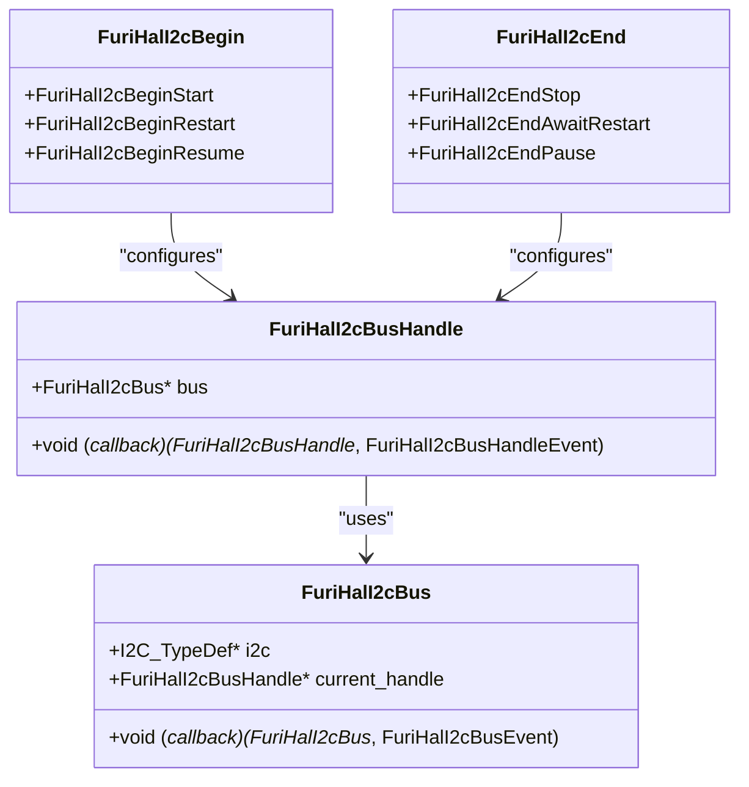
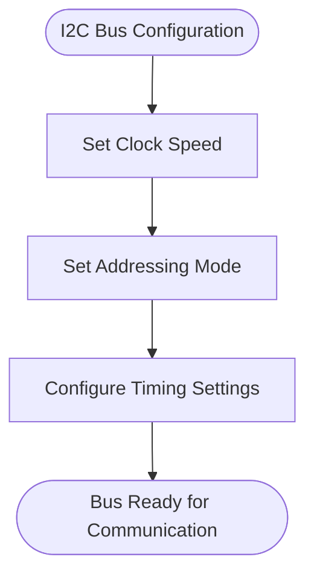
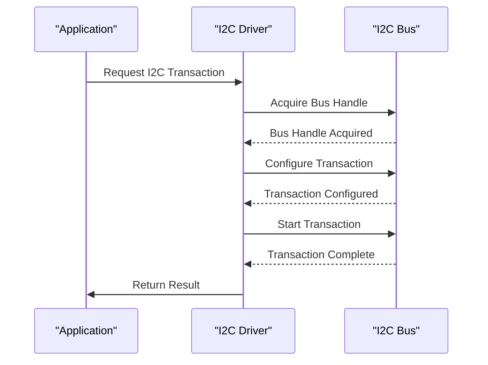
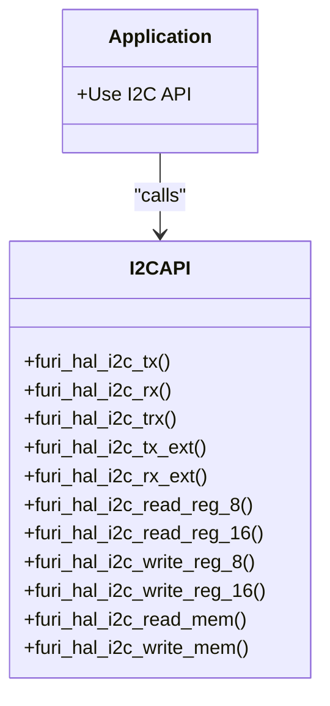
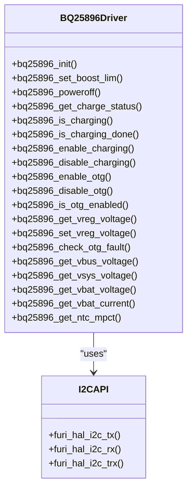
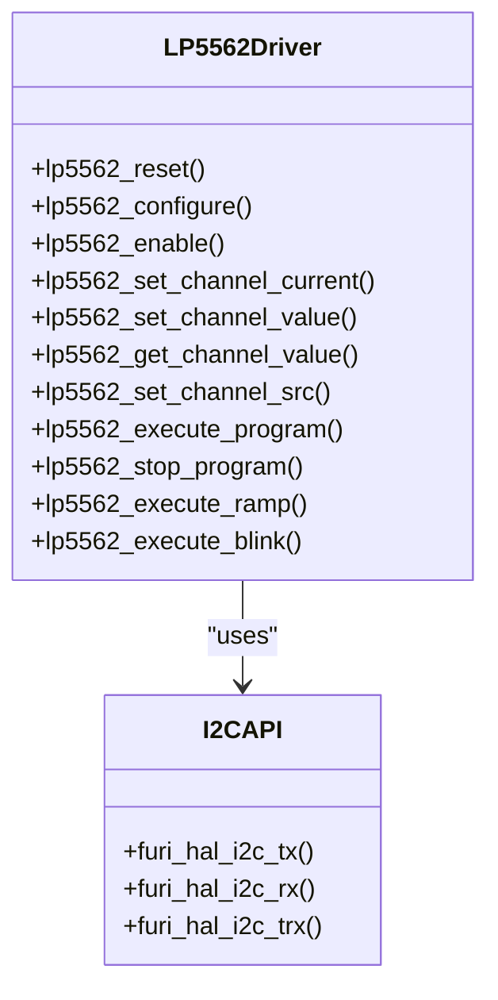

# I2C Interface

<cite>
**Referenced Files in This Document**   
- [furi_hal_i2c.h](file://targets/furi_hal_include/furi_hal_i2c.h)
- [furi_hal_i2c_config.h](file://targets/f7/furi_hal/furi_hal_i2c_config.h)
- [furi_hal_i2c_config.c](file://targets/f7/furi_hal/furi_hal_i2c_config.c)
- [bq25896.h](file://lib/drivers/bq25896.h)
- [bq25896.c](file://lib/drivers/bq25896.c)
- [bq25896_reg.h](file://lib/drivers/bq25896_reg.h)
- [lp5562.h](file://lib/drivers/lp5562.h)
- [lp5562.c](file://lib/drivers/lp5562.c)
- [lp5562_reg.h](file://lib/drivers/lp5562_reg.h)
- [stm32wbxx_hal_i2c.h](file://lib/stm32wb_hal/Inc/stm32wbxx_hal_i2c.h)
- [stm32wbxx_hal_i2c.c](file://lib/stm32wb_hal/Src/stm32wbxx_hal_i2c.c)
- [gpio_i2c_scanner_control.c](file://applications/main/gpio/gpio_i2c_scanner_control.c)
</cite>

## Table of Contents
1. [Introduction](#introduction)
2. [I2C Driver Architecture](#i2c-driver-architecture)
3. [Bus Configuration Parameters](#bus-configuration-parameters)
4. [Transaction Handling Mechanisms](#transaction-handling-mechanisms)
5. [API Functions for I2C Operations](#api-functions-for-i2c-operations)
6. [Device-Specific Implementations](#device-specific-implementations)
7. [Common Issues and Solutions](#common-issues-and-solutions)
8. [Performance Considerations](#performance-considerations)
9. [Conclusion](#conclusion)

## Introduction
The I2C (Inter-Integrated Circuit) interface in the Flipper Zero firmware provides a robust communication protocol for interacting with various peripheral devices. This document details the implementation of the I2C driver architecture, bus configuration parameters, transaction handling mechanisms, and API functions used for reading from and writing to I2C devices. Special focus is given to the BQ25896 charger and LP5562 LED controller, illustrating how higher-level applications interact with the I2C HAL (Hardware Abstraction Layer). Additionally, common issues such as bus contention, NACK errors, and clock stretching are addressed, along with solutions and best practices. Performance considerations for different clock speeds and power consumption implications are also discussed.

**Section sources**
- [furi_hal_i2c.h](file://targets/furi_hal_include/furi_hal_i2c.h#L1-L288)

## I2C Driver Architecture
The I2C driver architecture in the Flipper Zero firmware is designed to provide a flexible and efficient interface for communication with I2C devices. The architecture is built around a Hardware Abstraction Layer (HAL) that abstracts the low-level hardware details, allowing higher-level applications to interact with I2C devices without needing to manage the underlying hardware directly.

The core of the I2C driver is the `FuriHalI2cBus` structure, which represents an I2C bus and includes a callback function for handling bus events such as initialization, de-initialization, locking, unlocking, activation, and deactivation. Each bus is associated with a specific I2C peripheral (e.g., I2C1 or I2C3) and is managed through a mutex to ensure thread safety.

The `FuriHalI2cBusHandle` structure represents a handle to an I2C bus and includes a callback function for handling handle-specific events such as activation and deactivation. This allows for dynamic configuration of the I2C bus, including GPIO pin initialization and timing configuration, when the handle is acquired and released.

The I2C driver supports both polling and interrupt-driven modes of operation, providing flexibility for different use cases. The driver also includes support for DMA (Direct Memory Access) for high-speed data transfers, although this is not covered in detail in this document.

**Diagram sources **
- [furi_hal_i2c.h](file://targets/furi_hal_include/furi_hal_i2c.h#L16-L43)
- [furi_hal_i2c_config.c](file://targets/f7/furi_hal/furi_hal_i2c_config.c#L22-L74)

**Section sources**
- [furi_hal_i2c.h](file://targets/furi_hal_include/furi_hal_i2c.h#L1-L288)
- [furi_hal_i2c_config.c](file://targets/f7/furi_hal/furi_hal_i2c_config.c#L1-L167)

## Bus Configuration Parameters
The I2C bus configuration parameters in the Flipper Zero firmware include clock speed, addressing modes, and timing settings. These parameters are crucial for ensuring reliable communication with I2C devices.

### Clock Speed
The Flipper Zero firmware supports two I2C buses with different clock speeds:
- **Internal (Power) I2C Bus (I2C1)**: Operates at 400 kHz for high-speed communication with power management devices.
- **External I2C Bus (I2C3)**: Operates at 100 kHz for compatibility with a wide range of external I2C devices.

The clock speed is configured using the `Timing` parameter in the `I2C_InitTypeDef` structure, which is calculated based on the desired clock speed and the system clock frequency. The timing values are computed using the STM32CubeMX tool and are defined as constants in the firmware.

### Addressing Modes
The I2C driver supports both 7-bit and 10-bit addressing modes. The addressing mode is specified in the `AddressingMode` parameter of the `I2C_InitTypeDef` structure. The 7-bit addressing mode is the most commonly used and is supported by the majority of I2C devices.

### Timing Settings
The timing settings for the I2C bus are configured using the `I2C_TIMINGR` register, which includes parameters for data hold time (`SDADEL`), data setup time (`SCLDEL`), and timing prescaler (`PRESC`). These settings are critical for ensuring proper signal integrity and timing compliance with the I2C specification.

**Diagram sources **
- [furi_hal_i2c_config.h](file://targets/f7/furi_hal/furi_hal_i2c_config.h#L9-L27)
- [furi_hal_i2c_config.c](file://targets/f7/furi_hal/furi_hal_i2c_config.c#L6-L19)

**Section sources**
- [furi_hal_i2c_config.h](file://targets/f7/furi_hal/furi_hal_i2c_config.h#L1-L32)
- [furi_hal_i2c_config.c](file://targets/f7/furi_hal/furi_hal_i2c_config.c#L1-L167)

## Transaction Handling Mechanisms
The I2C transaction handling mechanisms in the Flipper Zero firmware are designed to provide flexible and reliable communication with I2C devices. The driver supports various transaction types, including simple read/write operations, combined transactions, and sequential operations.

### Transaction Types
The I2C driver supports the following transaction types:
- **Simple Read/Write**: Single read or write operations using the `furi_hal_i2c_rx` and `furi_hal_i2c_tx` functions.
- **Combined Read/Write**: Combined read and write operations using the `furi_hal_i2c_trx` function.
- **Extended Read/Write**: Read and write operations with additional settings such as 10-bit addressing and custom start/end conditions using the `furi_hal_i2c_rx_ext` and `furi_hal_i2c_tx_ext` functions.

### Transaction Control
The transaction control is managed through the `FuriHalI2cBegin` and `FuriHalI2cEnd` enums, which specify how the transaction should begin and end. The `FuriHalI2cBegin` enum includes options for starting a new transaction, restarting a transaction, or resuming a paused transaction. The `FuriHalI2cEnd` enum includes options for ending a transaction with a stop condition, awaiting a restart, or pausing the transaction.

### Error Handling
The I2C driver includes robust error handling mechanisms to detect and recover from common I2C errors such as NACK (Not Acknowledged) and bus timeouts. The driver uses a timeout mechanism to ensure that transactions do not hang indefinitely, and it provides status codes to indicate the success or failure of each transaction.

**Diagram sources **
- [furi_hal_i2c.h](file://targets/furi_hal_include/furi_hal_i2c.h#L16-L43)
- [furi_hal_i2c.c](file://targets/f7/furi_hal/furi_hal_i2c.c#L39-L302)

**Section sources**
- [furi_hal_i2c.h](file://targets/furi_hal_include/furi_hal_i2c.h#L1-L288)
- [furi_hal_i2c.c](file://targets/f7/furi_hal/furi_hal_i2c.c#L39-L302)

## API Functions for I2C Operations
The I2C API in the Flipper Zero firmware provides a comprehensive set of functions for performing read and write operations on I2C devices. These functions are designed to be easy to use while providing the flexibility needed for complex I2C interactions.

### Basic I2C Functions
The basic I2C functions include:
- `furi_hal_i2c_tx`: Perform a simple I2C transmit operation.
- `furi_hal_i2c_rx`: Perform a simple I2C receive operation.
- `furi_hal_i2c_trx`: Perform a combined I2C transmit and receive operation.

### Extended I2C Functions
The extended I2C functions provide additional control over the transaction:
- `furi_hal_i2c_tx_ext`: Perform an extended I2C transmit operation with custom start/end conditions and 10-bit addressing.
- `furi_hal_i2c_rx_ext`: Perform an extended I2C receive operation with custom start/end conditions and 10-bit addressing.

### Device Register Access
The I2C API also includes functions for accessing device registers:
- `furi_hal_i2c_read_reg_8`: Read an 8-bit register from an I2C device.
- `furi_hal_i2c_read_reg_16`: Read a 16-bit register from an I2C device.
- `furi_hal_i2c_write_reg_8`: Write an 8-bit value to an I2C device register.
- `furi_hal_i2c_write_reg_16`: Write a 16-bit value to an I2C device register.

### Memory Access
For devices with memory-mapped registers, the I2C API provides functions for reading and writing memory:
- `furi_hal_i2c_read_mem`: Read a block of memory from an I2C device.
- `furi_hal_i2c_write_mem`: Write a block of memory to an I2C device.

**Diagram sources **
- [furi_hal_i2c.h](file://targets/furi_hal_include/furi_hal_i2c.h#L77-L283)

**Section sources**
- [furi_hal_i2c.h](file://targets/furi_hal_include/furi_hal_i2c.h#L1-L288)

## Device-Specific Implementations
The Flipper Zero firmware includes device-specific implementations for the BQ25896 charger and LP5562 LED controller. These implementations demonstrate how the I2C API is used to interact with specific I2C devices.

### BQ25896 Charger
The BQ25896 charger is a highly integrated power management IC that provides battery charging and power path management. The firmware includes a driver for the BQ25896 that uses the I2C API to configure and monitor the charger.

Key functions in the BQ25896 driver include:
- `bq25896_init`: Initialize the BQ25896 charger.
- `bq25896_set_boost_lim`: Set the boost mode current limit.
- `bq25896_poweroff`: Send the device into shipping mode.
- `bq25896_get_charge_status`: Get the current charging status.
- `bq25896_enable_charging`: Enable charging.
- `bq25896_disable_charging`: Disable charging.
- `bq25896_enable_otg`: Enable OTG (On-The-Go) mode.
- `bq25896_disable_otg`: Disable OTG mode.
- `bq25896_get_vreg_voltage`: Get the VREG (charging limit) voltage.
- `bq25896_set_vreg_voltage`: Set the VREG (charging limit) voltage.
- `bq25896_check_otg_fault`: Check OTG BOOST Fault status.
- `bq25896_get_vbus_voltage`: Get the VBUS voltage.
- `bq25896_get_vsys_voltage`: Get the VSYS voltage.
- `bq25896_get_vbat_voltage`: Get the VBAT voltage.
- `bq25896_get_vbat_current`: Get the VBAT current.
- `bq25896_get_ntc_mpct`: Get the NTC voltage as a percentage of REGN.

**Diagram sources **
- [bq25896.h](file://lib/drivers/bq25896.h#L1-L68)
- [bq25896.c](file://lib/drivers/bq25896.c#L1-L208)

**Section sources**
- [bq25896.h](file://lib/drivers/bq25896.h#L1-L68)
- [bq25896.c](file://lib/drivers/bq25896.c#L1-L208)
- [bq25896_reg.h](file://lib/drivers/bq25896_reg.h#L1-L276)

### LP5562 LED Controller
The LP5562 is a programmable LED controller that supports RGBW (Red, Green, Blue, White) LEDs. The firmware includes a driver for the LP5562 that uses the I2C API to configure and control the LED outputs.

Key functions in the LP5562 driver include:
- `lp5562_reset`: Reset the LP5562.
- `lp5562_configure`: Configure the LP5562.
- `lp5562_enable`: Enable the LP5562.
- `lp5562_set_channel_current`: Set the current for a specific LED channel.
- `lp5562_set_channel_value`: Set the PWM value for a specific LED channel.
- `lp5562_get_channel_value`: Get the PWM value for a specific LED channel.
- `lp5562_set_channel_src`: Set the source for a specific LED channel.
- `lp5562_execute_program`: Execute a program sequence on a specific engine.
- `lp5562_stop_program`: Stop a program sequence on a specific engine.
- `lp5562_execute_ramp`: Execute a ramp program sequence.
- `lp5562_execute_blink`: Execute a blink program sequence.

**Diagram sources **
- [lp5562.h](file://lib/drivers/lp5562.h#L1-L70)
- [lp5562.c](file://lib/drivers/lp5562.c#L1-L268)

**Section sources**
- [lp5562.h](file://lib/drivers/lp5562.h#L1-L70)
- [lp5562.c](file://lib/drivers/lp5562.c#L1-L268)
- [lp5562_reg.h](file://lib/drivers/lp5562_reg.h#L1-L98)

## Common Issues and Solutions
The I2C interface in the Flipper Zero firmware is designed to handle common issues that can arise during I2C communication. This section discusses some of the most common issues and provides solutions and best practices.

### Bus Contention
Bus contention occurs when multiple devices attempt to drive the I2C bus simultaneously. This can lead to data corruption and communication failures. To prevent bus contention, the I2C driver uses a mutex to ensure that only one device can access the bus at a time. Additionally, the driver includes a timeout mechanism to detect and recover from bus contention.

### NACK Errors
NACK (Not Acknowledged) errors occur when a slave device does not acknowledge a byte sent by the master. This can happen if the slave device is not ready or if there is a communication error. The I2C driver includes error handling mechanisms to detect NACK errors and retry the transaction if necessary.

### Clock Stretching
Clock stretching is a feature of the I2C protocol that allows a slave device to hold the clock line low to delay the master. This can be used to prevent data loss when the slave device is not ready to receive or transmit data. The I2C driver supports clock stretching and includes mechanisms to handle it properly.

### Best Practices
- Always use the `furi_hal_i2c_acquire` and `furi_hal_i2c_release` functions to manage bus access.
- Use appropriate timeout values to prevent transactions from hanging indefinitely.
- Check the return values of I2C functions to detect and handle errors.
- Use the extended I2C functions when additional control over the transaction is needed.

**Section sources**
- [furi_hal_i2c.h](file://targets/furi_hal_include/furi_hal_i2c.h#L1-L288)
- [furi_hal_i2c.c](file://targets/f7/furi_hal/furi_hal_i2c.c#L39-L302)

## Performance Considerations
The performance of the I2C interface in the Flipper Zero firmware is influenced by several factors, including clock speed, power consumption, and the complexity of the transactions.

### Clock Speed
The clock speed of the I2C bus directly affects the data transfer rate. The internal I2C bus operates at 400 kHz, providing high-speed communication with power management devices. The external I2C bus operates at 100 kHz, ensuring compatibility with a wide range of external devices. Higher clock speeds can improve performance but may increase power consumption and reduce signal integrity.

### Power Consumption
The power consumption of the I2C interface is influenced by the clock speed and the activity level of the bus. The I2C driver includes power management features such as bus deactivation when not in use, which helps to reduce power consumption. Additionally, the use of clock stretching and NACK handling can help to minimize unnecessary bus activity.

### Transaction Complexity
The complexity of the transactions also affects performance. Simple read/write operations are faster and consume less power than combined or sequential operations. The use of DMA for high-speed data transfers can improve performance but may increase power consumption.

**Section sources**
- [furi_hal_i2c_config.h](file://targets/f7/furi_hal/furi_hal_i2c_config.h#L1-L32)
- [furi_hal_i2c_config.c](file://targets/f7/furi_hal/furi_hal_i2c_config.c#L1-L167)

## Conclusion
The I2C interface in the Flipper Zero firmware provides a robust and flexible communication protocol for interacting with a wide range of peripheral devices. The driver architecture, bus configuration parameters, transaction handling mechanisms, and API functions are designed to ensure reliable and efficient communication. Device-specific implementations for the BQ25896 charger and LP5562 LED controller demonstrate the practical application of the I2C API. Common issues such as bus contention, NACK errors, and clock stretching are addressed with appropriate solutions and best practices. Performance considerations for different clock speeds and power consumption implications are also discussed, providing a comprehensive understanding of the I2C interface in the Flipper Zero firmware.

[No sources needed since this section summarizes without analyzing specific files]