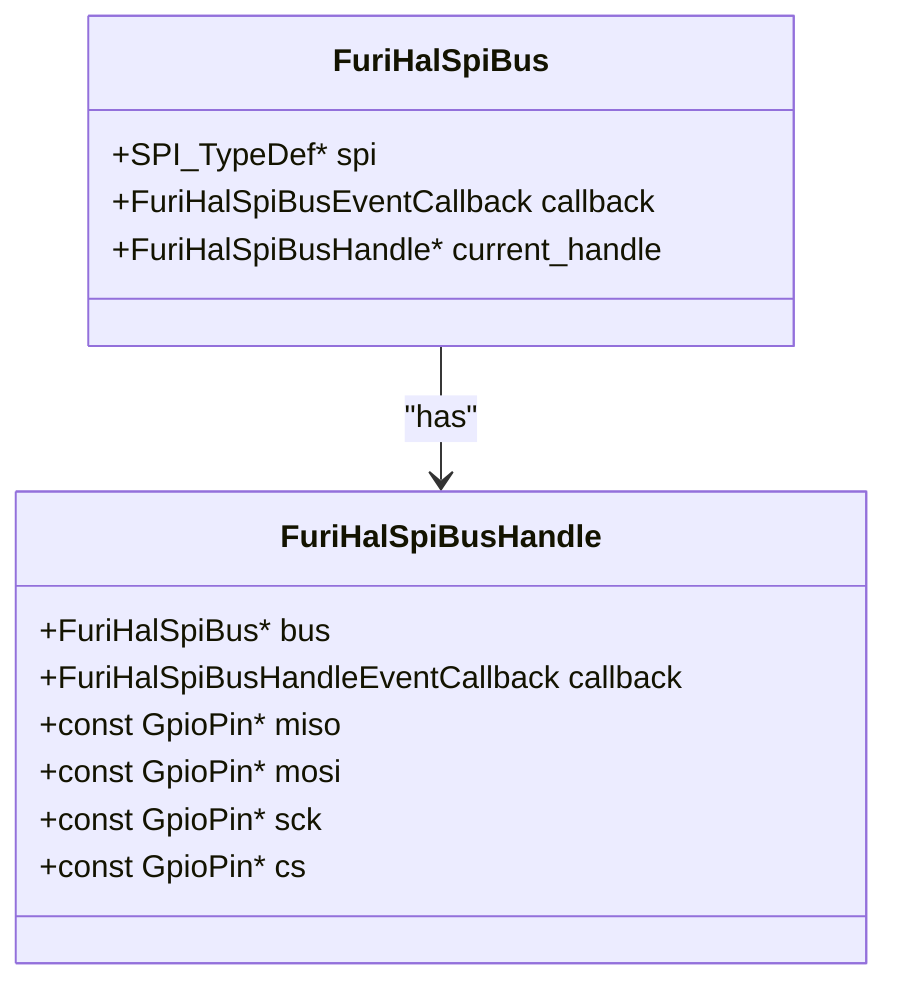
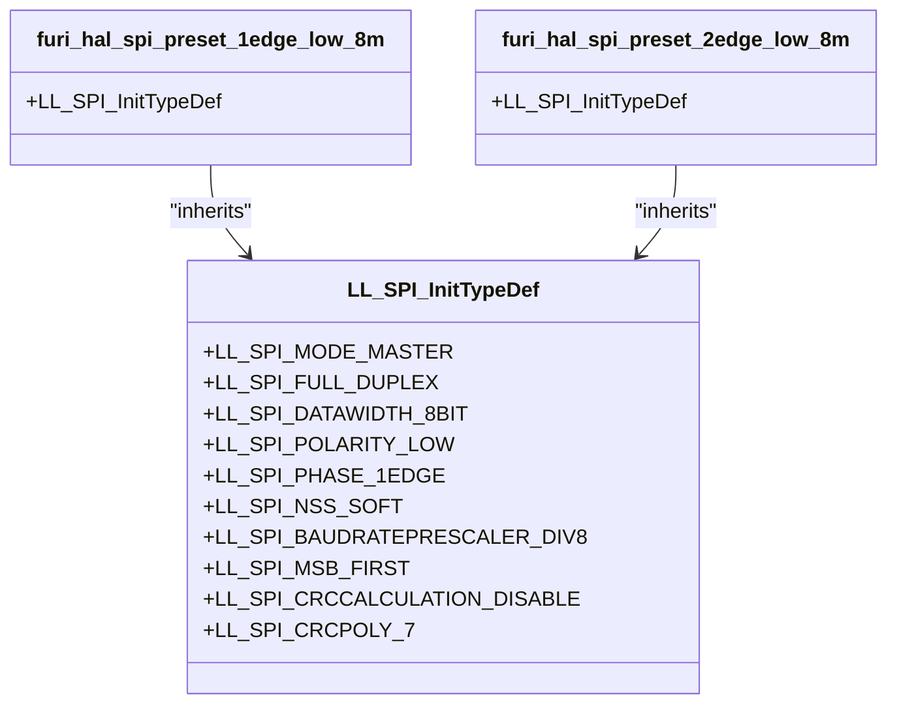
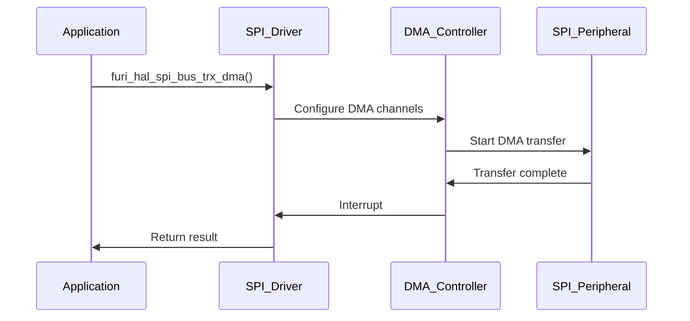
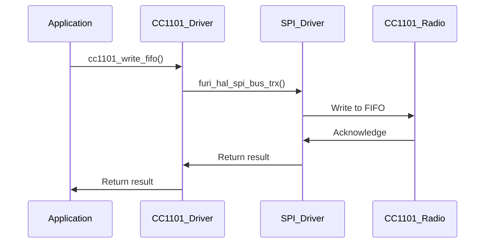
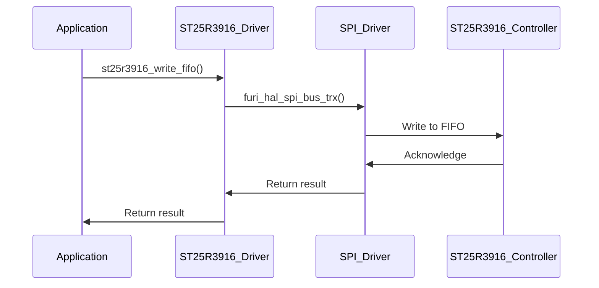
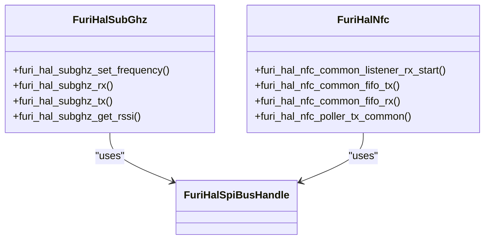

# SPI Interface

<cite>
**Referenced Files in This Document**   
- [furi_hal_spi.h](file://targets/furi_hal_include/furi_hal_spi.h)
- [furi_hal_spi.c](file://targets/f7/furi_hal/furi_hal_spi.c)
- [furi_hal_spi_config.c](file://targets/f7/furi_hal/furi_hal_spi_config.c)
- [furi_hal_spi_config.h](file://targets/f7/furi_hal/furi_hal_spi_config.h)
- [furi_hal_spi_types.h](file://targets/f7/furi_hal/furi_hal_spi_types.h)
- [cc1101.c](file://lib/drivers/cc1101.c)
- [cc1101.h](file://lib/drivers/cc1101.h)
- [st25r3916.c](file://lib/drivers/st25r3916.c)
- [st25r3916.h](file://lib/drivers/st25r3916.h)
- [st25r3916_reg.c](file://lib/drivers/st25r3916_reg.c)
- [st25r3916_reg.h](file://lib/drivers/st25r3916_reg.h)
- [furi_hal_subghz.c](file://targets/f7/furi_hal/furi_hal_subghz.c)
- [furi_hal_nfc_i.h](file://targets/f7/furi_hal/furi_hal_nfc_i.h)
- [platform.c](file://applications/external/esubghz_chat/lib/nfclegacy/ST25RFAL002/platform.c)
</cite>

## Table of Contents
1. [Introduction](#introduction)
2. [SPI Driver Architecture](#spi-driver-architecture)
3. [Configuration Options](#configuration-options)
4. [Transaction Handling Mechanisms](#transaction-handling-mechanisms)
5. [API Functions for Full-Duplex Communication](#api-functions-for-full-duplex-communication)
6. [Integration with CC1101 Radio](#integration-with-cc1101-radio)
7. [Integration with ST25R3916 NFC Controller](#integration-with-st25r3916-nfc-controller)
8. [Relationship Between SPI HAL and Higher-Level Applications](#relationship-between-spi-hal-and-higher-level-applications)
9. [Common Issues and Best Practices](#common-issues-and-best-practices)
10. [Performance Considerations](#performance-considerations)
11. [Conclusion](#conclusion)

## Introduction
The SPI (Serial Peripheral Interface) interface in the Flipper Zero firmware provides a robust and flexible communication channel for interacting with various peripheral devices. This document details the implementation of the SPI driver, focusing on its architecture, configuration options, transaction handling mechanisms, and integration with key components such as the CC1101 radio and ST25R3916 NFC controller. The documentation also covers the relationship between the SPI HAL (Hardware Abstraction Layer) and higher-level applications like Sub-GHz and NFC, addressing common issues and providing best practices for optimal performance.

**Section sources**
- [furi_hal_spi.h](file://targets/furi_hal_include/furi_hal_spi.h#L1-L129)

## SPI Driver Architecture
The SPI driver architecture in the Flipper Zero firmware is designed to provide a high level of abstraction while maintaining efficient and reliable communication with peripheral devices. The architecture is built around the concept of SPI buses and handles, which allow for modular and scalable management of multiple SPI devices.

### SPI Buses and Handles
The SPI driver defines two primary structures: `FuriHalSpiBus` and `FuriHalSpiBusHandle`. A `FuriHalSpiBus` represents a physical SPI bus on the microcontroller, while a `FuriHalSpiBusHandle` represents a specific device connected to that bus. Each handle includes pointers to the GPIO pins used for MISO, MOSI, SCK, and CS, as well as a callback function for handling bus events.

**Diagram sources**
- [furi_hal_spi_types.h](file://targets/f7/furi_hal/furi_hal_spi_types.h#L30-L58)

### Event Callbacks
The SPI driver uses event callbacks to manage the lifecycle of SPI transactions. These callbacks are triggered at various stages of the transaction, such as initialization, deinitialization, activation, and deactivation. The `FuriHalSpiBusEventCallback` and `FuriHalSpiBusHandleEventCallback` functions allow for custom behavior to be defined for each event, ensuring that the SPI bus and handles are properly configured and managed.

**Section sources**
- [furi_hal_spi_types.h](file://targets/f7/furi_hal/furi_hal_spi_types.h#L17-L63)
- [furi_hal_spi.c](file://targets/f7/furi_hal/furi_hal_spi.c#L31-L78)

## Configuration Options
The SPI driver supports a wide range of configuration options to accommodate different peripheral devices and communication requirements. These options include clock polarity, phase, speed, and bit order, which can be set using predefined presets or custom configurations.

### Clock Polarity and Phase
The clock polarity and phase determine the timing of the SPI clock signal. The Flipper Zero firmware supports both CPOL=0 (clock idle low) and CPOL=1 (clock idle high) configurations, as well as CPHA=0 (data sampled on the first edge) and CPHA=1 (data sampled on the second edge). These settings are crucial for ensuring proper communication with peripheral devices that have specific timing requirements.

### Speed and Bit Order
The SPI driver allows for flexible speed settings, ranging from low-speed modes suitable for power-constrained applications to high-speed modes for fast data transfer. The bit order can be configured as either MSB-first (most significant bit first) or LSB-first (least significant bit first), depending on the requirements of the peripheral device.

**Diagram sources**
- [furi_hal_spi_config.h](file://targets/f7/furi_hal/furi_hal_spi_config.h#L9-L23)
- [furi_hal_spi_config.c](file://targets/f7/furi_hal/furi_hal_spi_config.c#L11-L61)

## Transaction Handling Mechanisms
The SPI driver provides several mechanisms for handling transactions, including blocking and non-blocking modes, as well as support for DMA (Direct Memory Access) for high-speed data transfer.

### Blocking and Non-Blocking Modes
The SPI driver supports both blocking and non-blocking transaction modes. In blocking mode, the function call waits until the transaction is complete before returning. In non-blocking mode, the function call returns immediately, and the transaction is completed asynchronously. This allows for more efficient use of system resources, especially in real-time applications.

### DMA Support
For high-speed data transfer, the SPI driver supports DMA, which allows for data to be transferred directly between memory and the SPI peripheral without CPU intervention. This reduces the CPU load and improves overall system performance. The DMA configuration is managed through the `furi_hal_spi_bus_trx_dma` function, which sets up the DMA channels and handles the transfer completion.

**Diagram sources**
- [furi_hal_spi.c](file://targets/f7/furi_hal/furi_hal_spi.c#L194-L378)
- [furi_hal_spi_config.c](file://targets/f7/furi_hal/furi_hal_spi_config.c#L209-L371)

## API Functions for Full-Duplex Communication
The SPI driver provides a comprehensive set of API functions for full-duplex communication with peripheral devices. These functions include `furi_hal_spi_bus_rx`, `furi_hal_spi_bus_tx`, and `furi_hal_spi_bus_trx`, which allow for receiving, transmitting, and simultaneous receiving and transmitting of data.

### Receive and Transmit Functions
The `furi_hal_spi_bus_rx` and `furi_hal_spi_bus_tx` functions are used for receiving and transmitting data, respectively. These functions take a pointer to the data buffer, the size of the data, and a timeout value as parameters. The `furi_hal_spi_bus_trx` function combines both receive and transmit operations, allowing for full-duplex communication.

### Full-Duplex Communication
The `furi_hal_spi_bus_trx` function is particularly useful for full-duplex communication, where data is both sent and received simultaneously. This function takes pointers to both the transmit and receive buffers, the size of the data, and a timeout value. It ensures that the data is transmitted and received in a synchronized manner, maintaining the integrity of the communication.

**Section sources**
- [furi_hal_spi.h](file://targets/furi_hal_include/furi_hal_spi.h#L62-L124)
- [furi_hal_spi.c](file://targets/f7/furi_hal/furi_hal_spi.c#L91-L171)

## Integration with CC1101 Radio
The CC1101 radio is a popular sub-GHz transceiver used in the Flipper Zero for wireless communication. The SPI driver is integrated with the CC1101 through the `cc1101.c` and `cc1101.h` files, which provide a high-level API for controlling the radio.

### Initialization and Configuration
The CC1101 is initialized and configured using the `furi_hal_spi_acquire` and `furi_hal_spi_release` functions to manage the SPI bus. The `cc1101_reset` function is used to reset the radio, and the `cc1101_write_reg` and `cc1101_read_reg` functions are used to write to and read from the radio's registers.

### Data Transmission and Reception
Data transmission and reception are handled through the `cc1101_write_fifo` and `cc1101_read_fifo` functions, which write data to and read data from the radio's FIFO (First-In-First-Out) buffer. These functions use the `furi_hal_spi_bus_trx` function to perform the actual SPI transactions.

**Diagram sources**
- [cc1101.c](file://lib/drivers/cc1101.c#L162-L188)
- [cc1101.h](file://lib/drivers/cc1101.h#L174-L191)

## Integration with ST25R3916 NFC Controller
The ST25R3916 NFC controller is used in the Flipper Zero for near-field communication. The SPI driver is integrated with the ST25R3916 through the `st25r3916.c` and `st25r3916.h` files, which provide a high-level API for controlling the NFC controller.

### Initialization and Configuration
The ST25R3916 is initialized and configured using the `furi_hal_spi_acquire` and `furi_hal_spi_release` functions to manage the SPI bus. The `st25r3916_write_reg` and `st25r3916_read_reg` functions are used to write to and read from the controller's registers. The `st25r3916_direct_cmd` function is used to send direct commands to the controller.

### Data Transmission and Reception
Data transmission and reception are handled through the `st25r3916_write_fifo` and `st25r3916_read_fifo` functions, which write data to and read data from the controller's FIFO buffer. These functions use the `furi_hal_spi_bus_trx` function to perform the actual SPI transactions.

**Diagram sources**
- [st25r3916.c](file://lib/drivers/st25r3916.c#L94-L113)
- [st25r3916.h](file://lib/drivers/st25r3916.h#L88-L113)

## Relationship Between SPI HAL and Higher-Level Applications
The SPI HAL (Hardware Abstraction Layer) serves as a bridge between the low-level SPI driver and higher-level applications such as Sub-GHz and NFC. This abstraction allows for consistent and reliable communication with peripheral devices, regardless of the specific hardware implementation.

### Sub-GHz Application
The Sub-GHz application uses the SPI HAL to communicate with the CC1101 radio. The `furi_hal_subghz.c` file provides a high-level API for controlling the radio, including functions for setting the frequency, switching between transmit and receive modes, and reading the RSSI (Received Signal Strength Indicator) value.

### NFC Application
The NFC application uses the SPI HAL to communicate with the ST25R3916 NFC controller. The `furi_hal_nfc_i.h` file provides a high-level API for controlling the controller, including functions for starting and stopping the listener mode, transmitting and receiving data, and handling interrupts.

**Diagram sources**
- [furi_hal_subghz.c](file://targets/f7/furi_hal/furi_hal_subghz.c#L459-L462)
- [furi_hal_nfc_i.h](file://targets/f7/furi_hal/furi_hal_nfc_i.h#L140-L187)

## Common Issues and Best Practices
When working with the SPI interface in the Flipper Zero firmware, several common issues may arise, such as timing mismatches, slave select management, and signal integrity. Addressing these issues requires careful consideration of the hardware and software design.

### Timing Mismatches
Timing mismatches can occur when the clock polarity and phase settings do not match the requirements of the peripheral device. To avoid this, it is essential to consult the device datasheet and configure the SPI driver accordingly. Using predefined presets can help ensure that the correct settings are used.

### Slave Select Management
Proper management of the slave select (CS) line is crucial for reliable communication. The CS line should be asserted (low) before the start of a transaction and deasserted (high) after the transaction is complete. The `furi_hal_spi_acquire` and `furi_hal_spi_release` functions handle this automatically, but care should be taken to avoid conflicts when multiple devices share the same SPI bus.

### Signal Integrity
Signal integrity issues can arise due to poor PCB layout, long traces, or inadequate termination. To ensure reliable communication, it is recommended to use short, direct traces, proper termination resistors, and shielded cables when necessary. Additionally, using a logic analyzer to verify the signal quality can help identify and resolve issues.

**Section sources**
- [furi_hal_spi.c](file://targets/f7/furi_hal/furi_hal_spi.c#L51-L63)
- [furi_hal_spi_config.c](file://targets/f7/furi_hal/furi_hal_spi_config.c#L154-L158)

## Performance Considerations
The performance of the SPI interface in the Flipper Zero firmware can be optimized by using high-speed modes, DMA, and efficient data handling techniques.

### High-Speed Transfers
For high-speed data transfer, the SPI driver supports high-speed modes with clock speeds up to 16 MHz. This allows for fast data transfer rates, which are essential for applications such as audio streaming or high-resolution sensor data.

### DMA Usage
Using DMA for data transfer can significantly reduce the CPU load and improve overall system performance. The `furi_hal_spi_bus_trx_dma` function should be used for high-speed data transfer, especially when dealing with large amounts of data.

### Efficient Data Handling
Efficient data handling techniques, such as buffering and pipelining, can further improve performance. For example, using a circular buffer to store incoming data can reduce the overhead of memory allocation and deallocation. Additionally, pipelining multiple transactions can help maintain a steady data flow and reduce latency.

**Section sources**
- [furi_hal_spi.c](file://targets/f7/furi_hal/furi_hal_spi.c#L194-L378)
- [furi_hal_spi_config.c](file://targets/f7/furi_hal/furi_hal_spi_config.c#L418-L431)

## Conclusion
The SPI interface in the Flipper Zero firmware is a powerful and flexible communication channel that enables reliable and efficient interaction with a wide range of peripheral devices. By understanding the architecture, configuration options, transaction handling mechanisms, and integration with key components such as the CC1101 radio and ST25R3916 NFC controller, developers can leverage the full potential of the SPI interface. Addressing common issues and following best practices for timing, slave select management, and signal integrity ensures robust and reliable communication. Additionally, optimizing performance through high-speed transfers and DMA usage can significantly enhance the overall system performance.

**Section sources**
- [furi_hal_spi.h](file://targets/furi_hal_include/furi_hal_spi.h#L1-L129)
- [furi_hal_spi.c](file://targets/f7/furi_hal/furi_hal_spi.c#L1-L379)
- [furi_hal_spi_config.c](file://targets/f7/furi_hal/furi_hal_spi_config.c#L1-L447)
- [furi_hal_spi_config.h](file://targets/f7/furi_hal/furi_hal_spi_config.h#L1-L76)
- [furi_hal_spi_types.h](file://targets/f7/furi_hal/furi_hal_spi_types.h#L1-L63)
- [cc1101.c](file://lib/drivers/cc1101.c#L1-L189)
- [cc1101.h](file://lib/drivers/cc1101.h#L1-L196)
- [st25r3916.c](file://lib/drivers/st25r3916.c#L1-L189)
- [st25r3916.h](file://lib/drivers/st25r3916.h#L1-L114)
- [st25r3916_reg.c](file://lib/drivers/st25r3916_reg.c#L1-L257)
- [st25r3916_reg.h](file://lib/drivers/st25r3916_reg.h#L1-L1144)
- [furi_hal_subghz.c](file://targets/f7/furi_hal/furi_hal_subghz.c#L183-L484)
- [furi_hal_nfc_i.h](file://targets/f7/furi_hal/furi_hal_nfc_i.h#L132-L191)
- [platform.c](file://applications/external/esubghz_chat/lib/nfclegacy/ST25RFAL002/platform.c#L46-L104)