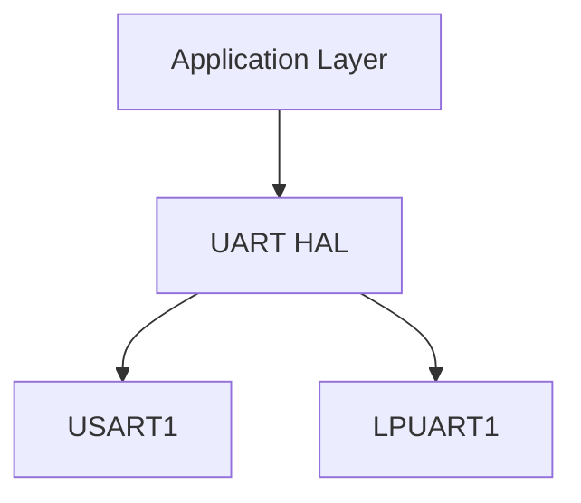
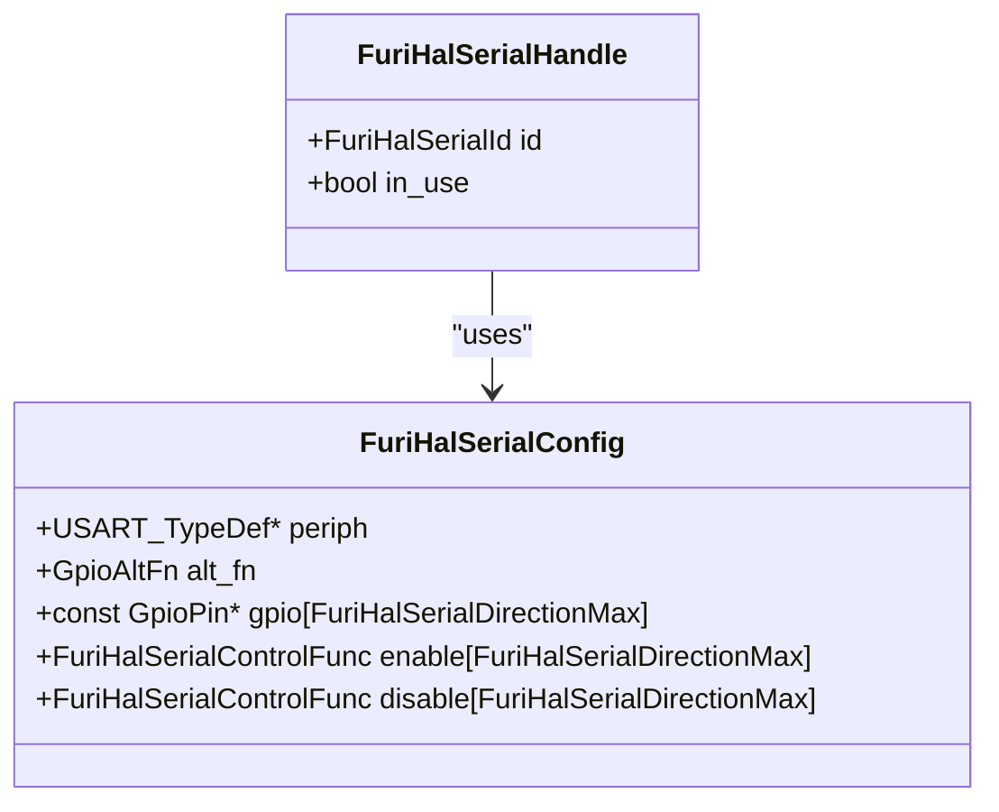
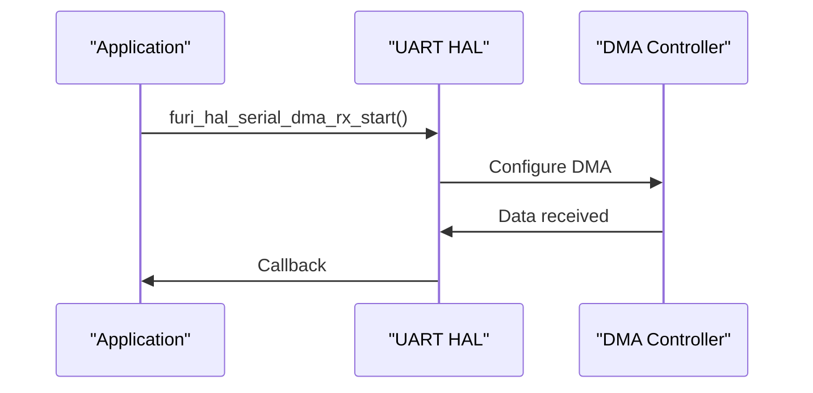
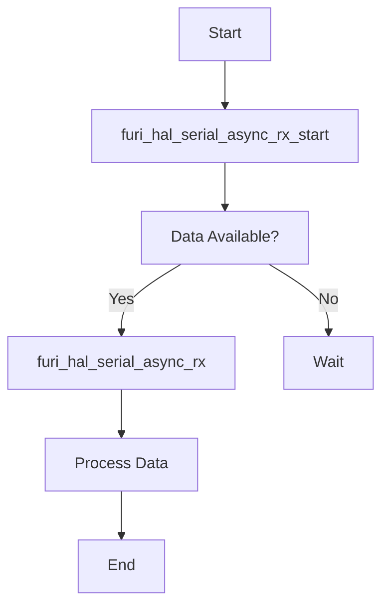
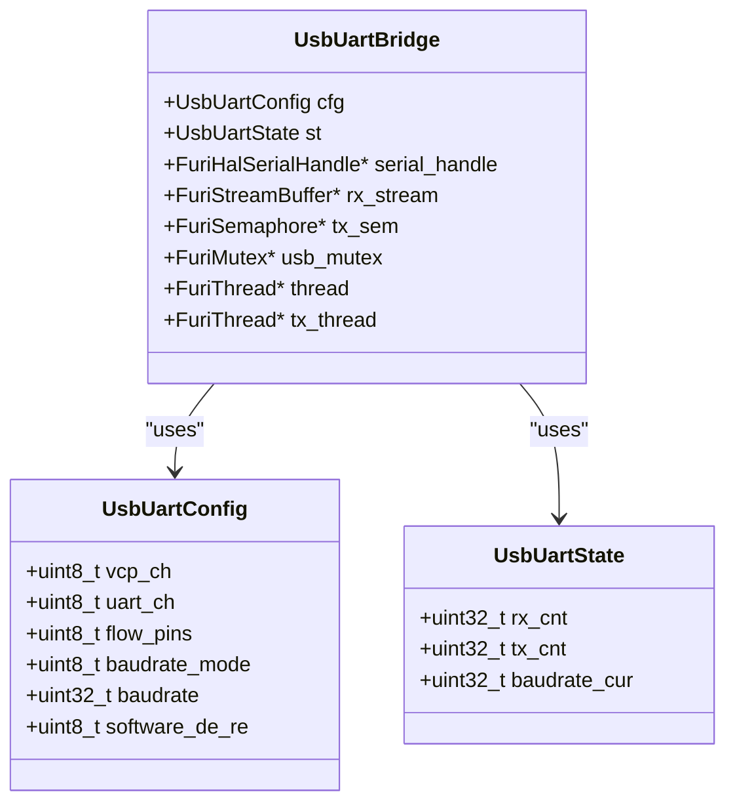
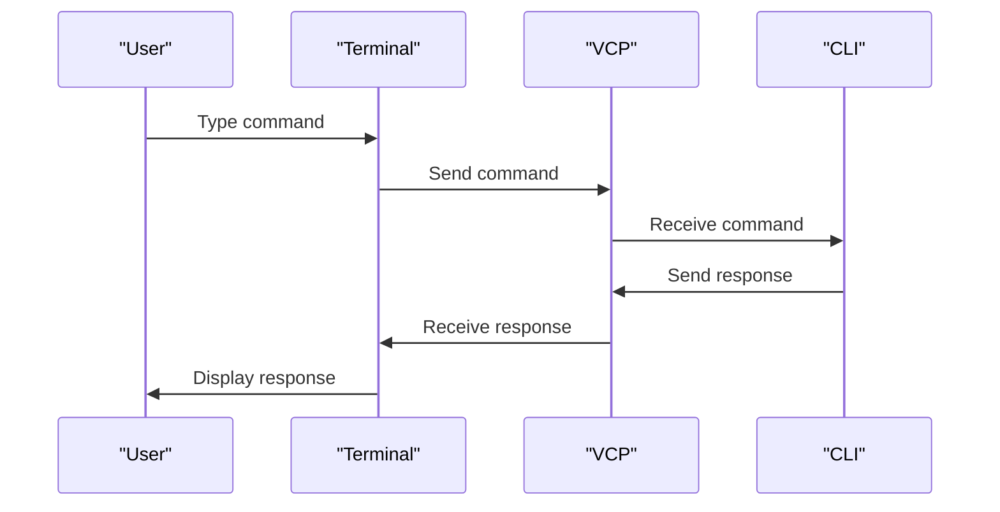
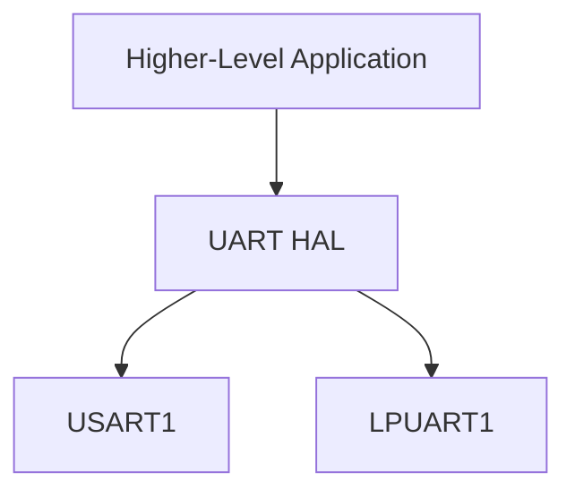
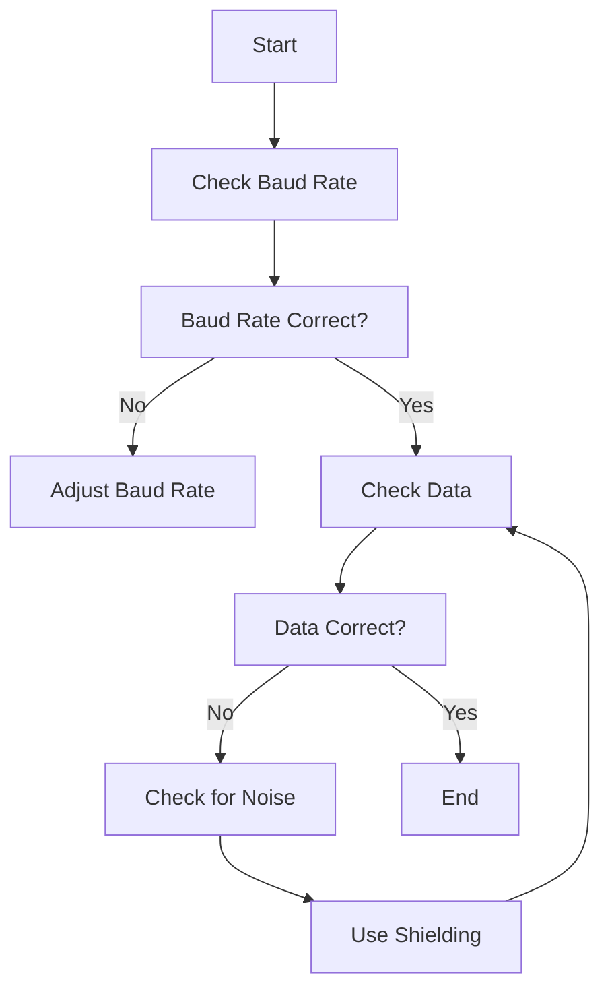
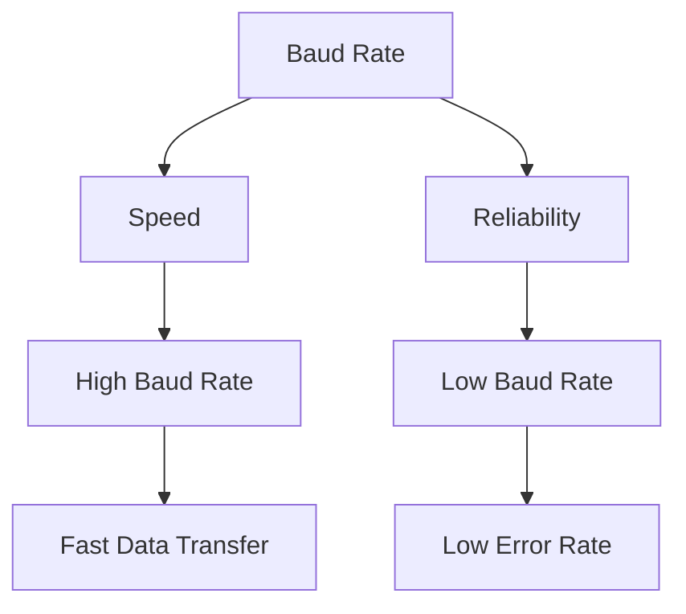
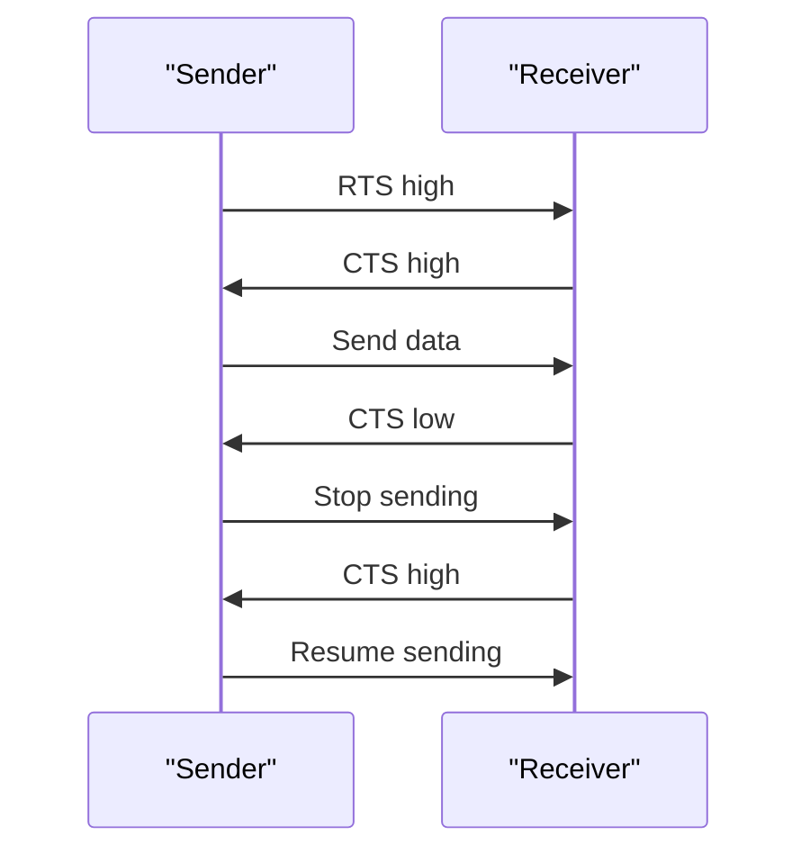

# UART Interface

<cite>
**Referenced Files in This Document**   
- [furi_hal_serial.h](file://targets/f7/furi_hal/furi_hal_serial.h)
- [furi_hal_serial.c](file://targets/f7/furi_hal/furi_hal_serial.c)
- [furi_hal_serial_control.h](file://targets/f7/furi_hal/furi_hal_serial_control.h)
- [furi_hal_serial_control.c](file://targets/f7/furi_hal/furi_hal_serial_control.c)
- [furi_hal_usb_cdc.h](file://targets/f7/furi_hal/furi_hal_usb_cdc.h)
- [usb_uart_bridge.h](file://applications/main/gpio/usb_uart_bridge.h)
- [usb_uart_bridge.c](file://applications/main/gpio/usb_uart_bridge.c)
- [cli_vcp.c](file://applications/services/cli/cli_vcp.c)
- [uart_echo.c](file://applications/debug/uart_echo/uart_echo.c)
</cite>

## Table of Contents
1. [Introduction](#introduction)
2. [UART Driver Architecture](#uart-driver-architecture)
3. [Configuration Parameters](#configuration-parameters)
4. [Data Transfer Mechanisms](#data-transfer-mechanisms)
5. [API Functions for Asynchronous Communication](#api-functions-for-asynchronous-communication)
6. [USB UART Bridge Implementation](#usb-uart-bridge-implementation)
7. [CLI over VCP](#cli-over-vcp)
8. [Relationship Between UART HAL and Higher-Level Applications](#relationship-between-uart-hal-and-higher-level-applications)
9. [Common Issues and Solutions](#common-issues-and-solutions)
10. [Performance Considerations](#performance-considerations)
11. [Flow Control Implementation](#flow-control-implementation)

## Introduction
The UART interface in the Flipper Zero firmware provides a robust communication channel for both internal and external devices. This document details the implementation of the UART driver, covering its architecture, configuration parameters, data transfer mechanisms, and API functions. It also addresses the USB UART bridge, CLI over VCP, common issues, performance considerations, and flow control implementation.

**Section sources**
- [furi_hal_serial.h](file://targets/f7/furi_hal/furi_hal_serial.h#L1-L251)
- [furi_hal_serial.c](file://targets/f7/furi_hal/furi_hal_serial.c#L1-L974)

## UART Driver Architecture
The UART driver in the Flipper Zero firmware is designed to provide a flexible and efficient communication interface. It supports two UART channels: USART1 and LPUART1. The driver is implemented in the `furi_hal_serial` module, which provides a high-level API for initializing, configuring, and managing UART communication.

The architecture is based on a layered approach, with the hardware abstraction layer (HAL) providing low-level access to the UART peripherals, and the higher-level applications using the HAL to perform communication tasks. The HAL handles the initialization of the UART hardware, configuration of baud rates, data bits, stop bits, and parity, as well as the management of data transfer.

**Diagram sources**
- [furi_hal_serial.h](file://targets/f7/furi_hal/furi_hal_serial.h#L1-L251)
- [furi_hal_serial.c](file://targets/f7/furi_hal/furi_hal_serial.c#L1-L974)

**Section sources**
- [furi_hal_serial.h](file://targets/f7/furi_hal/furi_hal_serial.h#L1-L251)
- [furi_hal_serial.c](file://targets/f7/furi_hal/furi_hal_serial.c#L1-L974)

## Configuration Parameters
The UART driver supports a wide range of configuration parameters, including baud rate, data bits, stop bits, and parity. These parameters can be configured using the `furi_hal_serial_init` and `furi_hal_serial_set_br` functions.

- **Baud Rate**: The baud rate can be set to any value between 9600 and 4000000. The default baud rate is 115200.
- **Data Bits**: The data bits are fixed at 8 bits.
- **Stop Bits**: The stop bits are fixed at 1 bit.
- **Parity**: The parity is fixed at none.

**Diagram sources**
- [furi_hal_serial.h](file://targets/f7/furi_hal/furi_hal_serial.h#L1-L251)
- [furi_hal_serial.c](file://targets/f7/furi_hal/furi_hal_serial.c#L1-L974)

**Section sources**
- [furi_hal_serial.h](file://targets/f7/furi_hal/furi_hal_serial.h#L1-L251)
- [furi_hal_serial.c](file://targets/f7/furi_hal/furi_hal_serial.c#L1-L974)

## Data Transfer Mechanisms
The UART driver supports both synchronous and asynchronous data transfer mechanisms. Synchronous transfer is performed using the `furi_hal_serial_tx` and `furi_hal_serial_rx` functions, which block until the data is transmitted or received. Asynchronous transfer is performed using the `furi_hal_serial_async_rx_start` and `furi_hal_serial_async_rx_stop` functions, which allow the application to receive data in the background.

The driver also supports DMA-based data transfer, which can significantly improve performance by offloading the data transfer to the DMA controller. The `furi_hal_serial_dma_rx_start` and `furi_hal_serial_dma_rx_stop` functions are used to start and stop DMA-based data transfer.

**Diagram sources**
- [furi_hal_serial.h](file://targets/f7/furi_hal/furi_hal_serial.h#L1-L251)
- [furi_hal_serial.c](file://targets/f7/furi_hal/furi_hal_serial.c#L1-L974)

**Section sources**
- [furi_hal_serial.h](file://targets/f7/furi_hal/furi_hal_serial.h#L1-L251)
- [furi_hal_serial.c](file://targets/f7/furi_hal/furi_hal_serial.c#L1-L974)

## API Functions for Asynchronous Communication
The UART HAL provides a set of API functions for asynchronous communication. These functions allow the application to receive data in the background and handle it when it becomes available.

- `furi_hal_serial_async_rx_start`: Starts asynchronous data reception.
- `furi_hal_serial_async_rx_stop`: Stops asynchronous data reception.
- `furi_hal_serial_async_rx_available`: Checks if data is available for reading.
- `furi_hal_serial_async_rx`: Reads data from the UART.

**Diagram sources**
- [furi_hal_serial.h](file://targets/f7/furi_hal/furi_hal_serial.h#L1-L251)
- [furi_hal_serial.c](file://targets/f7/furi_hal/furi_hal_serial.c#L1-L974)

**Section sources**
- [furi_hal_serial.h](file://targets/f7/furi_hal/furi_hal_serial.h#L1-L251)
- [furi_hal_serial.c](file://targets/f7/furi_hal/furi_hal_serial.c#L1-L974)

## USB UART Bridge Implementation
The USB UART bridge allows the Flipper Zero to communicate with a computer over USB. The bridge is implemented in the `usb_uart_bridge` module, which provides a VCP (Virtual COM Port) interface.

The bridge supports multiple configuration options, including the selection of the UART channel, baud rate, and flow control pins. It also supports software DE/RE control for RS-485 communication.

**Diagram sources**
- [usb_uart_bridge.h](file://applications/main/gpio/usb_uart_bridge.h#L1-L31)
- [usb_uart_bridge.c](file://applications/main/gpio/usb_uart_bridge.c#L1-L431)

**Section sources**
- [usb_uart_bridge.h](file://applications/main/gpio/usb_uart_bridge.h#L1-L31)
- [usb_uart_bridge.c](file://applications/main/gpio/usb_uart_bridge.c#L1-L431)

## CLI over VCP
The CLI (Command Line Interface) over VCP allows users to interact with the Flipper Zero using a terminal application. The CLI is implemented in the `cli_vcp` module, which provides a VCP interface for the CLI.

The CLI supports standard terminal commands and can be used to configure the device, run applications, and debug issues.

**Diagram sources**
- [cli_vcp.c](file://applications/services/cli/cli_vcp.c#L1-L318)

**Section sources**
- [cli_vcp.c](file://applications/services/cli/cli_vcp.c#L1-L318)

## Relationship Between UART HAL and Higher-Level Applications
The UART HAL provides a low-level interface for UART communication, which is used by higher-level applications to perform specific tasks. For example, the `uart_echo` application uses the UART HAL to echo received data back to the sender.

The relationship between the UART HAL and higher-level applications is defined by the API functions provided by the HAL. These functions allow applications to initialize the UART, configure parameters, and perform data transfer.

**Diagram sources**
- [furi_hal_serial.h](file://targets/f7/furi_hal/furi_hal_serial.h#L1-L251)
- [furi_hal_serial.c](file://targets/f7/furi_hal/furi_hal_serial.c#L1-L974)
- [uart_echo.c](file://applications/debug/uart_echo/uart_echo.c#L1-L340)

**Section sources**
- [furi_hal_serial.h](file://targets/f7/furi_hal/furi_hal_serial.h#L1-L251)
- [furi_hal_serial.c](file://targets/f7/furi_hal/furi_hal_serial.c#L1-L974)
- [uart_echo.c](file://applications/debug/uart_echo/uart_echo.c#L1-L340)

## Common Issues and Solutions
Common issues with UART communication include buffer overflows, framing errors, and baud rate mismatches. These issues can be addressed by proper configuration and error handling.

- **Buffer Overflows**: Can be prevented by using DMA-based data transfer and ensuring that the application processes data in a timely manner.
- **Framing Errors**: Can be caused by incorrect baud rate settings or noise on the line. Ensure that the baud rate is correctly configured and use shielding to reduce noise.
- **Baud Rate Mismatches**: Can be avoided by ensuring that both the sender and receiver are configured to the same baud rate.

**Diagram sources**
- [furi_hal_serial.h](file://targets/f7/furi_hal/furi_hal_serial.h#L1-L251)
- [furi_hal_serial.c](file://targets/f7/furi_hal/furi_hal_serial.c#L1-L974)

**Section sources**
- [furi_hal_serial.h](file://targets/f7/furi_hal/furi_hal_serial.h#L1-L251)
- [furi_hal_serial.c](file://targets/f7/furi_hal/furi_hal_serial.c#L1-L974)

## Performance Considerations
Performance considerations for UART communication include the choice of baud rate and the use of flow control. Higher baud rates can improve data transfer speed but may increase the risk of errors. Flow control can help prevent buffer overflows by allowing the receiver to signal when it is ready to receive more data.

- **Baud Rate**: Choose a baud rate that balances speed and reliability. Common baud rates include 9600, 115200, and 1000000.
- **Flow Control**: Use hardware flow control (RTS/CTS) when possible to prevent buffer overflows.

**Diagram sources**
- [furi_hal_serial.h](file://targets/f7/furi_hal/furi_hal_serial.h#L1-L251)
- [furi_hal_serial.c](file://targets/f7/furi_hal/furi_hal_serial.c#L1-L974)

**Section sources**
- [furi_hal_serial.h](file://targets/f7/furi_hal/furi_hal_serial.h#L1-L251)
- [furi_hal_serial.c](file://targets/f7/furi_hal/furi_hal_serial.c#L1-L974)

## Flow Control Implementation
Flow control is implemented using the RTS (Request to Send) and CTS (Clear to Send) signals. The `usb_uart_bridge` module supports hardware flow control by configuring the flow control pins.

- **RTS/CTS**: The RTS signal is used by the sender to indicate that it is ready to send data, and the CTS signal is used by the receiver to indicate that it is ready to receive data.
- **Software Flow Control**: The `usb_uart_bridge` module also supports software flow control using XON/XOFF characters.

**Diagram sources**
- [usb_uart_bridge.h](file://applications/main/gpio/usb_uart_bridge.h#L1-L31)
- [usb_uart_bridge.c](file://applications/main/gpio/usb_uart_bridge.c#L1-L431)

**Section sources**
- [usb_uart_bridge.h](file://applications/main/gpio/usb_uart_bridge.h#L1-L31)
- [usb_uart_bridge.c](file://applications/main/gpio/usb_uart_bridge.c#L1-L431)