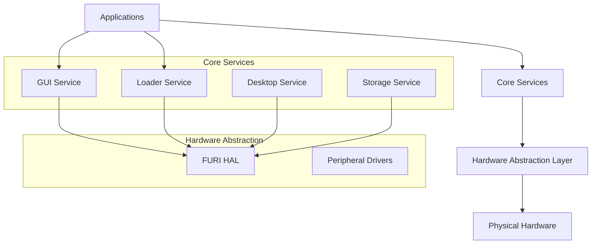
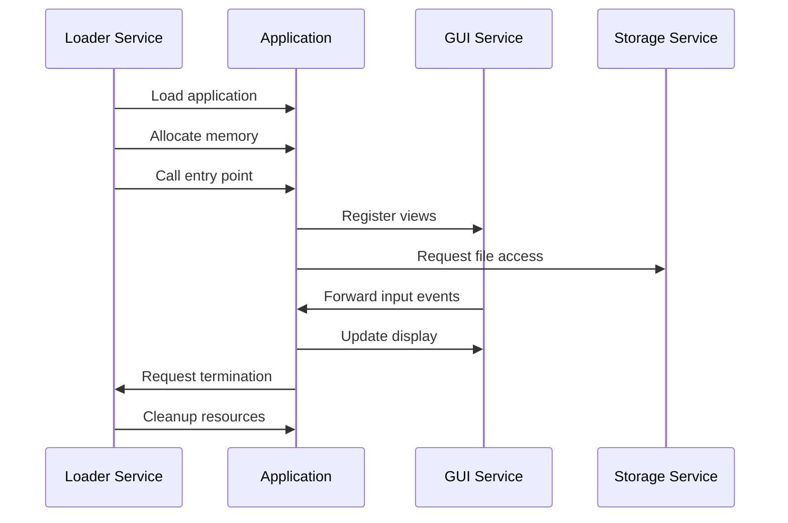
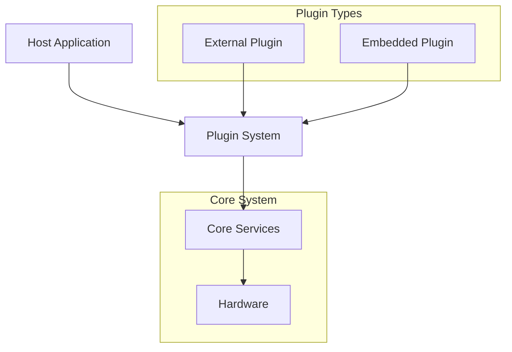
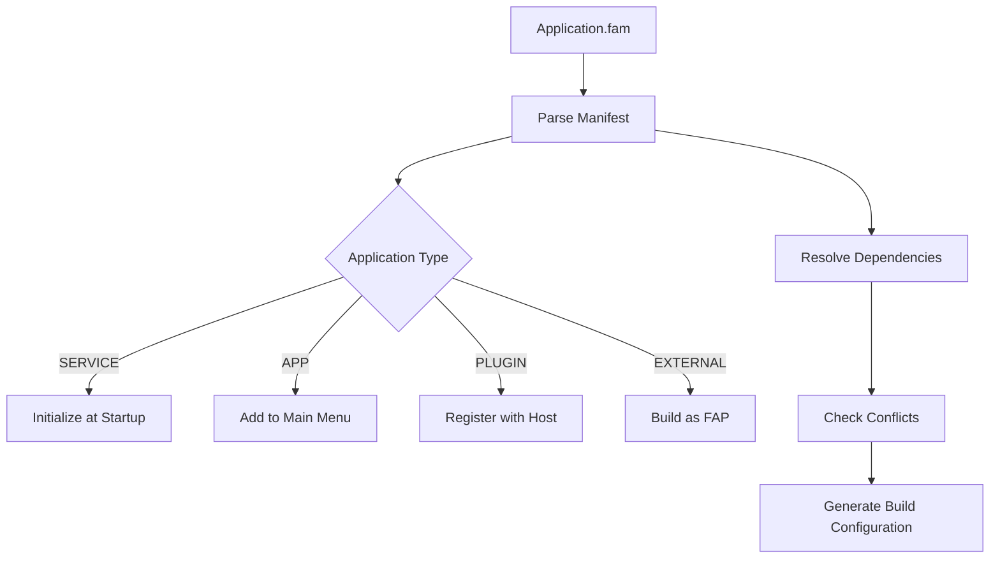

# Project Overview

<cite>
**Referenced Files in This Document**   
- [ReadMe.md](file://ReadMe.md)
- [AppManifests.md](file://documentation/AppManifests.md)
- [furi.h](file://furi/furi.h)
- [flipper_application.h](file://lib/flipper_application/flipper_application.h)
- [application_manifest.h](file://lib/flipper_application/application_manifest.h)
- [elf_api_interface.h](file://lib/flipper_application/elf/elf_api_interface.h)
- [main/application.fam](file://applications/main/application.fam)
- [services/application.fam](file://applications/services/application.fam)
- [desktop/application.fam](file://applications/services/desktop/application.fam)
- [loader/application.fam](file://applications/services/loader/application.fam)
- [gui/application.fam](file://applications/services/gui/application.fam)
- [plugins/application.fam](file://applications/plugins/application.fam)
- [example_plugins/application.fam](file://applications/examples/example_plugins/application.fam)
- [example_plugins_advanced/application.fam](file://applications/examples/example_plugins_advanced/application.fam)
</cite>

## Table of Contents
1. [Introduction](#introduction)
2. [Architecture Overview](#architecture-overview)
3. [Core Components](#core-components)
4. [Application Framework](#application-framework)
5. [Plugin System](#plugin-system)
6. [Manifest System](#manifest-system)
7. [Hardware Abstraction](#hardware-abstraction)
8. [Development Patterns](#development-patterns)
9. [Conclusion](#conclusion)

## Introduction

The Flipper Zero firmware is an open-source software platform designed for the Flipper Zero hardware device, enabling security research, hardware hacking, and wireless protocol experimentation. This firmware provides a comprehensive environment for developers to create custom applications and extend functionality through a modular architecture. The system is built with a layered design that includes hardware abstraction, core services, and applications, allowing for flexible development and integration of new features. The firmware supports a wide range of use cases, from creating custom applications to extending functionality through plugins, making it a versatile tool for both beginners and experienced developers in the field of hardware security and wireless communication.

**Section sources**
- [ReadMe.md](file://ReadMe.md)

## Architecture Overview

The Flipper Zero firmware follows a layered architecture with clear separation between hardware abstraction, core services, and applications. At the foundation is the hardware abstraction layer (HAL) that provides uniform access to the device's physical components. Above this layer are core services that manage system resources and provide common functionality. The application framework sits at the top level, hosting both built-in applications and user-developed plugins. This modular design enables independent development of components while maintaining system stability and security.

The system's architecture is defined through manifest files that specify component relationships and dependencies. Each component is developed independently with its own build system manifest, allowing for flexible configuration and selective inclusion in firmware builds. The loader service manages application lifecycle, while the GUI service handles user interface rendering and input processing. This layered approach ensures that applications can interact with hardware through well-defined interfaces without direct access to physical components.

**Diagram sources **
- [furi.h](file://furi/furi.h)
- [flipper_application.h](file://lib/flipper_application/flipper_application.h)
- [gui/application.fam](file://applications/services/gui/application.fam)
- [loader/application.fam](file://applications/services/loader/application.fam)

**Section sources**
- [furi.h](file://furi/furi.h)
- [flipper_application.h](file://lib/flipper_application/flipper_application.h)

## Core Components

The Flipper Zero firmware consists of several core components that work together to provide a complete development and runtime environment. The FURI (Flipper User Runtime Interface) layer provides essential system services including threading, memory management, and event handling. The flipper_application library manages the loading and execution of applications, handling both standalone apps and plugins. The manifest system defines application properties and relationships, enabling the build system to resolve dependencies and conflicts.

Key components include the GUI service for user interface management, the loader service for application lifecycle control, and the desktop service for system-level operations. These services are initialized at startup and provide the foundation for all user-facing functionality. The architecture supports both built-in applications and external plugins, with clear interfaces for inter-component communication. The system's modular design allows developers to extend functionality without modifying core components, promoting stability and security.

**Section sources**
- [furi.h](file://furi/furi.h)
- [flipper_application.h](file://lib/flipper_application/flipper_application.h)
- [application_manifest.h](file://lib/flipper_application/application_manifest.h)

## Application Framework

The application framework in Flipper Zero firmware provides a structured environment for developing and running applications. Applications are defined through manifest files that specify their properties, entry points, and dependencies. The framework supports different application types including regular apps, system services, plugins, and debug applications. Each application has a defined lifecycle managed by the loader service, which handles loading, execution, and cleanup.

Applications interact with the system through well-defined APIs provided by core services. The GUI service offers a comprehensive set of UI components and layout managers, while the storage service provides file system access. Applications can register for system events and respond to user input through the input service. The framework enforces memory isolation between applications, with each app allocated its own stack space as specified in the manifest. This design ensures system stability even when individual applications encounter errors.

**Diagram sources **
- [flipper_application.h](file://lib/flipper_application/flipper_application.h)
- [loader/application.fam](file://applications/services/loader/application.fam)
- [gui/application.fam](file://applications/services/gui/application.fam)

**Section sources**
- [flipper_application.h](file://lib/flipper_application/flipper_application.h)
- [loader/application.fam](file://applications/services/loader/application.fam)

## Plugin System

The Flipper Zero firmware features a robust plugin system that allows for extensibility and customization. Plugins are specialized applications that extend the functionality of host applications or provide standalone features. They are defined in manifest files with the PLUGIN apptype and can be embedded within host applications or distributed separately. The plugin system supports both built-in plugins compiled into the firmware and external plugins loaded from SD card.

Plugins interact with the system through well-defined interfaces and can access core services like GUI, storage, and hardware peripherals. The manifest system specifies plugin dependencies, ensuring that required components are available before loading. Embedded plugins are extracted to the apps_assets directory on startup, allowing for distribution as part of a host application package. This modular approach enables developers to create specialized functionality without modifying core firmware components.

**Diagram sources **
- [plugins/application.fam](file://applications/plugins/application.fam)
- [example_plugins/application.fam](file://applications/examples/example_plugins/application.fam)
- [example_plugins_advanced/application.fam](file://applications/examples/example_plugins_advanced/application.fam)

**Section sources**
- [plugins/application.fam](file://applications/plugins/application.fam)
- [example_plugins/application.fam](file://applications/examples/example_plugins/application.fam)

## Manifest System

The manifest system in Flipper Zero firmware provides a declarative way to define application properties and relationships. Each component has a build system manifest file named application.fam that specifies its basic properties and dependencies. The manifest system uses Python code snippets to define application parameters, with only appid and apptype being mandatory. Other parameters provide additional configuration for different application types.

The manifest system supports various application types including SERVICE, SYSTEM, APP, PLUGIN, and EXTERNAL. Parameters like requires and conflicts manage dependencies and prevent incompatible components from being included in the same build. The stack_size parameter specifies memory allocation for each application, while sdk_headers defines which interfaces are exposed to external applications. This system enables the build tool (fbt) to collect all manifests, resolve dependencies, and build only the components referenced in the current configuration.

**Diagram sources **
- [AppManifests.md](file://documentation/AppManifests.md)
- [main/application.fam](file://applications/main/application.fam)
- [services/application.fam](file://applications/services/application.fam)

**Section sources**
- [AppManifests.md](file://documentation/AppManifests.md)
- [application.fam](file://**/*.fam)

## Hardware Abstraction

The hardware abstraction layer in Flipper Zero firmware provides a uniform interface to the device's physical components. This layer isolates applications from direct hardware access, ensuring system stability and security. The FURI HAL (Hardware Abstraction Layer) exposes standardized APIs for interacting with peripherals such as GPIO, SPI, I2C, and various wireless protocols. This abstraction allows applications to work across different hardware revisions without modification.

The abstraction layer includes drivers for specific components like the sub-GHz radio, NFC reader, infrared transmitter, and various sensors. These drivers handle low-level communication protocols and timing requirements, presenting simplified interfaces to higher-level components. The system also provides access to system-level features like power management, real-time clock, and non-volatile storage. This layered approach enables developers to focus on application logic rather than hardware-specific details.

**Section sources**
- [furi.h](file://furi/furi.h)
- [furi_hal.h](file://targets/furi_hal_include/furi_hal.h)

## Development Patterns

Developers working with Flipper Zero firmware follow established patterns for creating applications and plugins. The example applications demonstrate common development practices, including proper manifest configuration, resource management, and UI design. Applications typically follow a scene-based architecture where different views represent various states or modes of the application. The framework provides utilities for managing application state and transitioning between scenes.

Development patterns emphasize modularity and reusability, with components designed to work independently while integrating seamlessly with the larger system. The manifest system encourages clear dependency management, while the plugin architecture promotes extensibility. Developers are encouraged to follow coding standards and use the provided APIs rather than accessing hardware directly. This approach ensures compatibility across firmware versions and maintains system stability.

**Section sources**
- [example_plugins/application.fam](file://applications/examples/example_plugins/application.fam)
- [example_plugins_advanced/application.fam](file://applications/examples/example_plugins_advanced/application.fam)

## Conclusion

The Flipper Zero firmware provides a comprehensive platform for security research, hardware hacking, and wireless protocol experimentation. Its layered architecture with clear separation between hardware abstraction, core services, and applications enables flexible development and integration of new features. The manifest system provides a powerful way to define component relationships and manage dependencies, while the plugin system allows for extensibility and customization. The framework supports both built-in applications and external plugins, with well-defined interfaces for inter-component communication. This modular design promotes stability and security while enabling developers to create innovative applications and tools for the Flipper Zero hardware device.