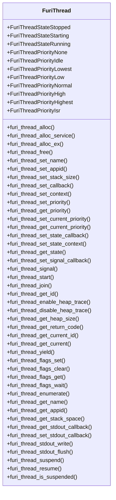
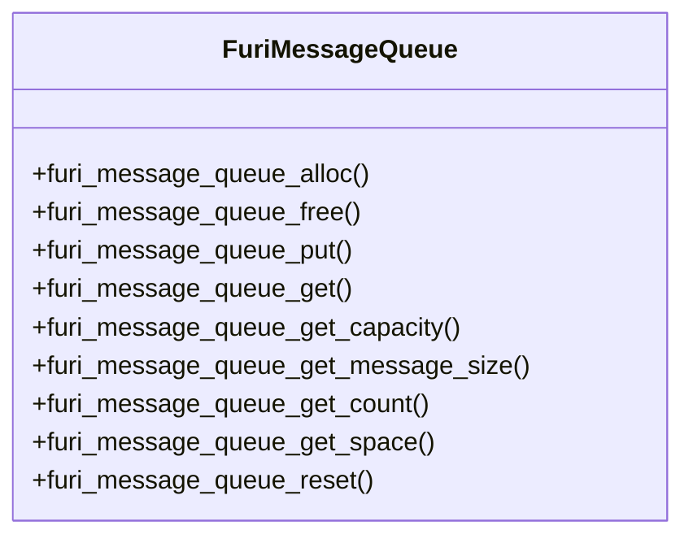
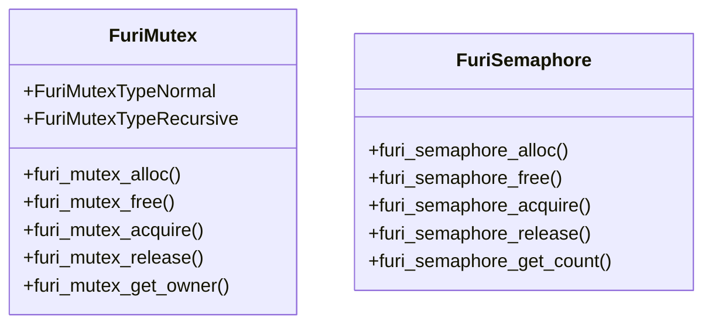
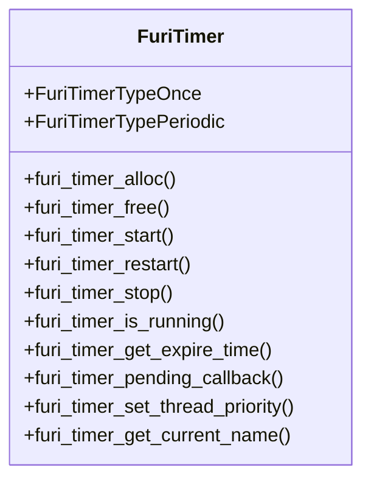
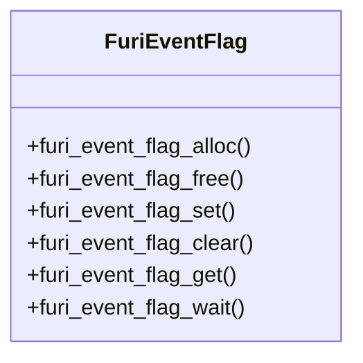
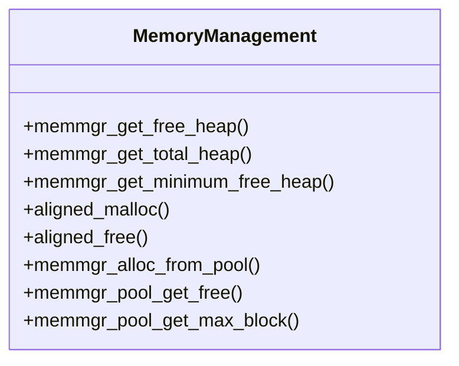
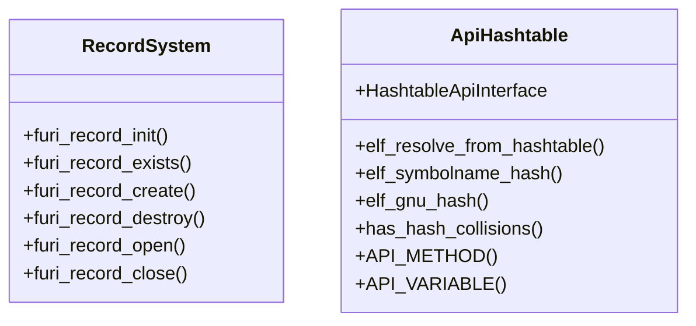

# API Documentation

<cite>
**Referenced Files in This Document**   
- [thread.h](file://furi/core/thread.h)
- [message_queue.h](file://furi/core/message_queue.h)
- [mutex.h](file://furi/core/mutex.h)
- [semaphore.h](file://furi/core/semaphore.h)
- [timer.h](file://furi/core/timer.h)
- [event_flag.h](file://furi/core/event_flag.h)
- [string.h](file://furi/core/string.h)
- [record.h](file://furi/core/record.h)
- [api_hashtable.h](file://lib/flipper_application/api_hashtable/api_hashtable.h)
- [api_hashtable.cpp](file://lib/flipper_application/api_hashtable/api_hashtable.cpp)
- [memmgr.h](file://furi/core/memmgr.h)
</cite>

## Table of Contents
1. [Introduction](#introduction)
2. [Threading and Concurrency](#threading-and-concurrency)
3. [Message Queues](#message-queues)
4. [Synchronization Primitives](#synchronization-primitives)
5. [Timers](#timers)
6. [Event Flags](#event-flags)
7. [Memory Management](#memory-management)
8. [String Utilities](#string-utilities)
9. [Service Discovery and API Binding](#service-discovery-and-api-binding)
10. [Best Practices](#best-practices)

## Introduction
This document provides comprehensive API documentation for the Flipper Zero firmware, focusing on core system services and utilities. The documentation covers Furi OS primitives including threading, event loops, message queues, mutexes, semaphores, timers, memory management functions, string utilities, and system services. The Flipper Zero firmware is built on FreeRTOS with a custom abstraction layer that provides a consistent interface for application development. This documentation details the public interfaces, function signatures, parameter descriptions, return values, and error codes for each API group, along with usage examples and best practices for embedded development.

## Threading and Concurrency

The Flipper Zero firmware provides a comprehensive threading API that abstracts the underlying FreeRTOS implementation. The FuriThread system enables developers to create and manage threads with various configurations and priorities.

**Diagram sources**
- [thread.h](file://furi/core/thread.h#L1-L507)

**Section sources**
- [thread.h](file://furi/core/thread.h#L1-L507)

### Thread Creation and Management
The FuriThread API provides multiple functions for thread creation with different configurations:

- `furi_thread_alloc()`: Creates a basic thread instance
- `furi_thread_alloc_service()`: Creates a memory-efficient service thread with limitations (cannot return from callback, cannot be joined or freed)
- `furi_thread_alloc_ex()`: Creates a thread with extended parameters

Threads must be properly configured before starting. Configuration functions like `furi_thread_set_name()`, `furi_thread_set_stack_size()`, and `furi_thread_set_priority()` can only be called when the thread is in the STOPPED state. The thread callback function must follow the signature `int32_t (*FuriThreadCallback)(void* context)` and will receive the context parameter specified during configuration.

### Thread States and Lifecycle
FuriThread has three possible states:
- `FuriThreadStateStopped`: Thread is not running
- `FuriThreadStateStarting`: Thread is in the process of starting
- `FuriThreadStateRunning`: Thread is actively executing

The thread lifecycle follows a specific pattern: allocate → configure → start → (run) → stop → join → free. The `furi_thread_join()` function waits for a thread to complete execution, but should only be called when the CPU is not busy to avoid indefinite blocking. After joining, `furi_thread_free()` should be called to release the thread resources.

### Thread Synchronization and Communication
The API provides several mechanisms for thread synchronization and communication:
- Thread flags: Lightweight flags that can be set, cleared, and waited upon using `furi_thread_flags_set()`, `furi_thread_flags_clear()`, and `furi_thread_flags_wait()`
- Signals: Custom signals can be sent between threads using `furi_thread_signal()` and handled by a registered callback
- Suspension: Threads can be suspended and resumed using `furi_thread_suspend()` and `furi_thread_resume()`

### Thread Utilities
Additional utility functions include:
- `furi_thread_yield()`: Explicitly yields control to the scheduler
- `furi_thread_get_current()`: Retrieves the current thread instance
- `furi_thread_enumerate()`: Enumerates all active threads
- `furi_thread_get_stack_space()`: Retrieves the stack watermark for monitoring stack usage

## Message Queues

Message queues provide a thread-safe mechanism for passing data between tasks. The FuriMessageQueue implementation is based on FreeRTOS queues with a simplified interface.

**Diagram sources**
- [message_queue.h](file://furi/core/message_queue.h#L1-L94)

**Section sources**
- [message_queue.h](file://furi/core/message_queue.h#L1-L94)

### Queue Creation and Destruction
Message queues are created with `furi_message_queue_alloc(uint32_t msg_count, uint32_t msg_size)`, specifying the maximum number of messages and the size of each message. The function returns a pointer to the allocated queue instance, or NULL if allocation fails. After use, queues must be freed with `furi_message_queue_free()` to prevent memory leaks.

### Sending and Receiving Messages
Messages are sent to a queue using `furi_message_queue_put(FuriMessageQueue* instance, const void* msg_ptr, uint32_t timeout)`. The function copies the message data from the provided pointer to the queue. Similarly, messages are retrieved with `furi_message_queue_get(FuriMessageQueue* instance, void* msg_ptr, uint32_t timeout)`, which copies the message data to the provided buffer.

Both functions support timeout values, with `FuriWaitForever` indicating an infinite wait. The return value is a `FuriStatus` indicating success or failure (timeout, queue full/empty, etc.).

### Queue Information and Management
The API provides several functions to query queue state:
- `furi_message_queue_get_capacity()`: Returns the maximum number of messages the queue can hold
- `furi_message_queue_get_message_size()`: Returns the size of each message in bytes
- `furi_message_queue_get_count()`: Returns the current number of messages in the queue
- `furi_message_queue_get_space()`: Returns the available space for additional messages
- `furi_message_queue_reset()`: Clears all messages from the queue

## Synchronization Primitives

The Flipper Zero firmware provides several synchronization primitives for coordinating access to shared resources between threads.

**Diagram sources**
- [mutex.h](file://furi/core/mutex.h#L1-L63)
- [semaphore.h](file://furi/core/semaphore.h#L1-L59)

**Section sources**
- [mutex.h](file://furi/core/mutex.h#L1-L63)
- [semaphore.h](file://furi/core/semaphore.h#L1-L59)

### Mutexes
Mutexes (mutual exclusion objects) are used to protect critical sections of code from concurrent access. The FuriMutex API supports two types:
- `FuriMutexTypeNormal`: Standard mutex that cannot be acquired recursively by the same thread
- `FuriMutexTypeRecursive`: Mutex that can be acquired multiple times by the same thread

Mutexes are created with `furi_mutex_alloc(FuriMutexType type)` and must be freed with `furi_mutex_free()` when no longer needed. The `furi_mutex_acquire()` function attempts to acquire the mutex, with a timeout parameter that supports `FuriWaitForever`. The `furi_mutex_release()` function releases the mutex. `furi_mutex_get_owner()` returns the thread ID of the current mutex owner, or NULL if the mutex is not owned.

### Semaphores
Semaphores are counting primitives used for resource management and signaling between threads. A semaphore is created with `furi_semaphore_alloc(uint32_t max_count, uint32_t initial_count)`, specifying the maximum count and initial count values.

The `furi_semaphore_acquire()` function decrements the semaphore count, blocking if the count is zero until it becomes available or the timeout expires. `furi_semaphore_release()` increments the count, potentially unblocking waiting threads. `furi_semaphore_get_count()` returns the current semaphore count, useful for debugging and monitoring.

## Timers

The FuriTimer API provides software timers that can be configured to execute callbacks after a specified delay or at regular intervals.

**Diagram sources**
- [timer.h](file://furi/core/timer.h#L1-L117)

**Section sources**
- [timer.h](file://furi/core/timer.h#L1-L117)

### Timer Creation and Configuration
Timers are created with `furi_timer_alloc(FuriTimerCallback func, FuriTimerType type, void* context)`, specifying the callback function, timer type (one-shot or periodic), and context parameter. The callback function must follow the signature `void (*FuriTimerCallback)(void* context)`.

### Timer Control
Once created, timers can be controlled with:
- `furi_timer_start()`: Starts the timer with a specified timeout in ticks
- `furi_timer_restart()`: Restarts a running timer with a new timeout
- `furi_timer_stop()`: Stops a running timer

All timer control functions are asynchronous, with the actual operation occurring when the timer service processes the request.

### Timer Information
The API provides functions to query timer state:
- `furi_timer_is_running()`: Returns whether the timer is currently running
- `furi_timer_get_expire_time()`: Returns the tick count when the timer will expire
- `furi_timer_get_current_name()`: Returns the name of the currently executing timer (useful in callbacks)

### Timer Thread Priority
The timer service runs in a dedicated thread with configurable priority:
- `FuriTimerThreadPriorityNormal`: Lower priority than other threads
- `FuriTimerThreadPriorityElevated`: Same priority as other threads

The priority can be set with `furi_timer_set_thread_priority()`.

## Event Flags

Event flags provide a lightweight mechanism for thread synchronization based on bit manipulation.

**Diagram sources**
- [event_flag.h](file://furi/core/event_flag.h#L1-L71)

**Section sources**
- [event_flag.h](file://furi/core/event_flag.h#L1-L71)

### Event Flag Operations
Event flags are created with `furi_event_flag_alloc()` and freed with `furi_event_flag_free()`. The API provides four main operations:
- `furi_event_flag_set()`: Sets specified flags (bitwise OR)
- `furi_event_flag_clear()`: Clears specified flags (bitwise AND with complement)
- `furi_event_flag_get()`: Reads the current flag state
- `furi_event_flag_wait()`: Waits for specified flags to be set, with configurable options and timeout

The `furi_event_flag_wait()` function supports various options for controlling the wait behavior, such as waiting for all specified flags or any of the specified flags.

## Memory Management

The memory management API provides functions for heap monitoring and specialized memory allocation.

**Diagram sources**
- [memmgr.h](file://furi/core/memmgr.h#L1-L78)

**Section sources**
- [memmgr.h](file://furi/core/memmgr.h#L1-L78)

### Heap Information
The API provides three functions for monitoring heap usage:
- `memmgr_get_free_heap()`: Returns the current free heap size in bytes
- `memmgr_get_total_heap()`: Returns the total heap size in bytes
- `memmgr_get_minimum_free_heap()`: Returns the minimum free heap size recorded (heap watermark)

### Aligned Memory Allocation
For cases requiring memory alignment, the API provides:
- `aligned_malloc(size_t size, size_t alignment)`: Allocates memory with the specified alignment
- `aligned_free(void* p)`: Frees memory allocated with aligned_malloc()

Memory allocated with `aligned_malloc()` must be freed with `aligned_free()`, not the standard `free()` function.

### Memory Pool
The firmware includes a separate memory pool for allocations that should not be freed:
- `memmgr_alloc_from_pool(size_t size)`: Allocates memory from the pool that cannot be freed
- `memmgr_pool_get_free()`: Returns the free space in the memory pool
- `memmgr_pool_get_max_block()`: Returns the size of the largest free block in the pool

This pool is useful for allocating resources that persist for the lifetime of the application.

## String Utilities

The FuriString API provides a comprehensive set of functions for string manipulation with automatic memory management.

```mermaid
classDiagram
class FuriString {
+FURI_STRING_FAILURE
+furi_string_alloc()
+furi_string_alloc_set()
+furi_string_alloc_set_str()
+furi_string_alloc_printf()
+furi_string_alloc_vprintf()
+furi_string_alloc_move()
+furi_string_free()
+furi_string_reserve()
+furi_string_reset()
+furi_string_swap()
+furi_string_move()
+furi_string_hash()
+furi_string_size()
+furi_string_empty()
+furi_string_get_char()
+furi_string_get_cstr()
+furi_string_set()
+furi_string_set_str()
+furi_string_set_str_extra()
+furi_string_cat()
+furi_string_cat_str()
+furi_string_cat_printf()
+furi_string_cmp()
+furi_string_cmp_str()
+furi_string_equal()
+furi_string_equal_str()
+furi_string_search_char()
+furi_string_search_str()
+furi_string_search_rchar()
+furi_string_replace_char()
+furi_string_left()
+furi_string_right()
+furi_string_mid()
+furi_string_trim()
+furi_string_to_uint32()
+furi_string_to_uint64()
+furi_string_to_int32()
+furi_string_to_int64()
+furi_string_to_double()
+furi_string_printf()
+furi_string_vprintf()
+furi_string_push_back()
+furi_string_pop_back()
+furi_string_back()
+furi_string_start_with()
+furi_string_end_with()
+furi_string_replace_str()
+furi_string_replace_str_all()
+furi_string_split()
+furi_string_split_at_last()
+furi_string_replace()
+furi_string_replace_all()
+furi_string_remove()
+furi_string_insert()
+furi_string_erase()
+furi_string_find()
+furi_string_rfind()
+furi_string_find_first_of()
+furi_string_find_last_of()
+furi_string_find_first_not_of()
+furi_string_find_last_not_of()
+furi_string_starts_with()
+furi_string_ends_with()
+furi_string_to_lowercase()
+furi_string_to_uppercase()
+furi_string_substr()
+furi_string_resize()
+furi_string_clear()
+furi_string_capacity()
+furi_string_shrink_to_fit()
+furi_string_reserve()
+furi_string_swap()
+furi_string_move()
+furi_string_hash()
+furi_string_size()
+furi_string_empty()
+furi_string_get_char()
+furi_string_get_cstr()
}
```

**Diagram sources**
- [string.h](file://furi/core/string.h#L1-L796)

**Section sources**
- [string.h](file://furi/core/string.h#L1-L796)

### String Creation and Destruction
FuriString instances can be created in several ways:
- `furi_string_alloc()`: Creates an empty string
- `furi_string_alloc_set()`: Creates a string with the same content as another string
- `furi_string_alloc_set_str()`: Creates a string from a C string
- `furi_string_alloc_printf()`: Creates a string using printf-style formatting
- `furi_string_alloc_vprintf()`: Creates a string using va_list formatting
- `furi_string_alloc_move()`: Creates a string by moving content from another string

Strings are destroyed with `furi_string_free()`.

### String Operations
The API provides comprehensive string manipulation functions:
- Concatenation: `furi_string_cat()`, `furi_string_cat_str()`, `furi_string_cat_printf()`
- Comparison: `furi_string_cmp()`, `furi_string_cmp_str()`, `furi_string_equal()`, `furi_string_equal_str()`
- Search: `furi_string_search_char()`, `furi_string_search_str()`, `furi_string_search_rchar()`
- Modification: `furi_string_replace_char()`, `furi_string_left()`, `furi_string_right()`, `furi_string_mid()`, `furi_string_trim()`
- Conversion: `furi_string_to_uint32()`, `furi_string_to_uint64()`, `furi_string_to_int32()`, `furi_string_to_int64()`, `furi_string_to_double()`

### String Formatting
The API includes printf-style formatting functions:
- `furi_string_printf()`: Formats a string using printf-style format string
- `furi_string_vprintf()`: Formats a string using va_list
- `furi_string_alloc_printf()`: Creates a new string with printf-style formatting

These functions support standard printf format specifiers and are useful for creating formatted output.

## Service Discovery and API Binding

The Flipper Zero firmware includes a service discovery system and dynamic API binding mechanism for plugin architecture and service access.

**Diagram sources**
- [record.h](file://furi/core/record.h#L1-L68)
- [api_hashtable.h](file://lib/flipper_application/api_hashtable/api_hashtable.h#L1-L89)
- [api_hashtable.cpp](file://lib/flipper_application/api_hashtable/api_hashtable.cpp#L1-L42)

**Section sources**
- [record.h](file://furi/core/record.h#L1-L68)
- [api_hashtable.h](file://lib/flipper_application/api_hashtable/api_hashtable.h#L1-L89)
- [api_hashtable.cpp](file://lib/flipper_application/api_hashtable/api_hashtable.cpp#L1-L42)

### Record System
The record system provides a service discovery mechanism where services can be registered and accessed by name:

- `furi_record_create(const char* name, void* data)`: Registers a service with the given name and data pointer
- `furi_record_open(const char* name)`: Retrieves a pointer to the registered service data
- `furi_record_close(const char* name)`: Releases the reference to the service
- `furi_record_destroy(const char* name)`: Unregisters and destroys the service
- `furi_record_exists(const char* name)`: Checks if a service with the given name exists

The record system is thread-safe, but create/destroy operations must be performed from the same thread, and open/close operations must be paired in the same thread.

### API Hashtable Mechanism
The API hashtable mechanism enables dynamic binding of function addresses using a pre-sorted table of symbol hashes:

- `elf_resolve_from_hashtable()`: Resolves a function address from the hash table
- `elf_symbolname_hash()`: Calculates the hash of a symbol name
- `elf_gnu_hash()`: Implements the ELF GNU hash algorithm for compile-time hashing

The `HashtableApiInterface` struct implements the `ElfApiInterface` and contains pointers to a sorted array of `sym_entry` structures. The `API_METHOD()` and `API_VARIABLE()` macros simplify the creation of symbol table entries. The `has_hash_collisions()` template function can be used at compile-time to detect hash collisions in the API table.

## Best Practices

### Error Handling
In embedded contexts, robust error handling is critical. Always check return values from API functions, especially those that can fail due to resource constraints. Use timeouts appropriately to prevent indefinite blocking, and handle timeout conditions gracefully. For critical operations, implement retry logic with appropriate backoff strategies.

### Resource Cleanup
Always follow the principle of "allocate and free in the same scope" when possible. For resources that must persist beyond a function scope, ensure there is a clear ownership model and cleanup path. Use RAII (Resource Acquisition Is Initialization) patterns where possible, even in C, by pairing allocation and deallocation in the same function or using cleanup handlers.

### Thread Safety
Be aware of thread safety requirements for each API function. Functions that modify thread state typically require the thread to be stopped. Synchronization primitives should be acquired and released in the same function when possible to avoid deadlocks. Avoid holding locks for extended periods, especially in interrupt contexts.

### Memory Management
Monitor heap usage regularly using the provided functions. Avoid frequent allocation and deallocation of small objects, as this can lead to fragmentation. Use the memory pool for long-lived allocations that don't need to be freed. For performance-critical code, consider using stack allocation when the size is known and small.

### Performance Considerations
Minimize the use of dynamic allocation in time-critical code paths. Use message queues and event flags for inter-thread communication rather than polling. Be mindful of the overhead of string operations, especially formatting, in performance-critical sections. Use the provided profiling tools to identify bottlenecks in your code.

### Plugin Development
When developing plugins, use the API hashtable mechanism for dynamic binding to ensure compatibility across firmware versions. Follow the service discovery pattern for accessing system services through the record system. Document your plugin's API clearly and provide example usage code.