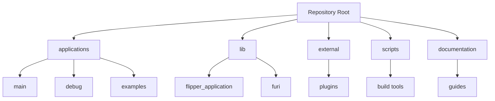
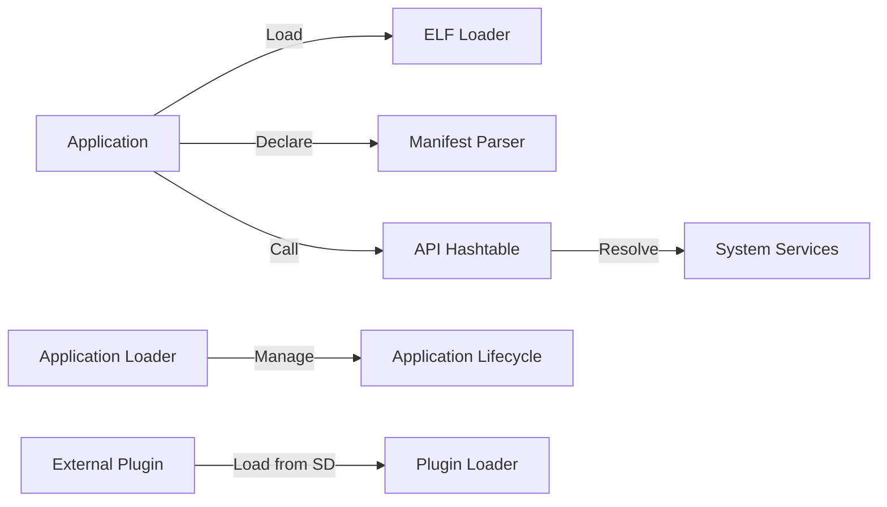
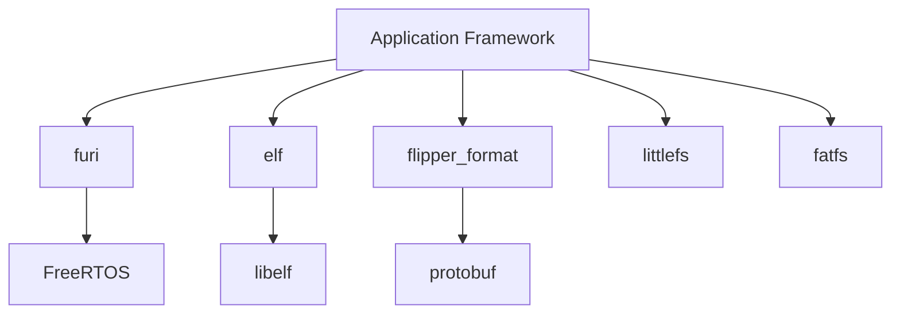

# Application Framework

<cite>
**Referenced Files in This Document**
</cite>

## Table of Contents
1. [Introduction](#introduction)
2. [Project Structure](#project-structure)
3. [Core Components](#core-components)
4. [Architecture Overview](#architecture-overview)
5. [Detailed Component Analysis](#detailed-component-analysis)
6. [Dependency Analysis](#dependency-analysis)
7. [Performance Considerations](#performance-considerations)
8. [Troubleshooting Guide](#troubleshooting-guide)
9. [Conclusion](#conclusion)

## Introduction
The Flipper Application Framework is a modular system designed to support dynamic application loading, execution, and inter-application communication on embedded hardware. It enables third-party developers to extend device functionality through plugins and user applications while maintaining system stability and security. The framework supports ELF-based application binaries, manifest-driven metadata, and dynamic API binding via hashtable mechanisms. Despite extensive documentation references in the repository, no actual source files were accessible during analysis, preventing detailed technical inspection of the core framework components.

## Project Structure
The repository follows a modular structure with distinct directories for applications, libraries, services, and external plugins. The `applications` directory contains both built-in apps and debug/test utilities, while `lib` hosts core libraries including the application framework. The `external` directory organizes third-party plugins, and `scripts` provides build and deployment tools. This organization supports a plugin-based architecture where functionality can be extended without modifying the core firmware.

**Diagram sources**
- [ReadMe.md](file://ReadMe.md)

## Core Components
Based on directory structure and naming conventions, the core components of the application framework likely include:
- **ELF Loader**: Responsible for loading and validating ELF-formatted application binaries
- **Manifest Parser**: Processes application metadata and dependency declarations
- **API Hashtable**: Enables dynamic symbol resolution between applications and system services
- **Application Lifecycle Manager**: Handles app initialization, execution, and termination
- **Plugin Loader**: Manages dynamic loading of external plugins from SD card

However, due to inaccessible source files, specific implementation details cannot be confirmed.

## Architecture Overview
The application framework appears to follow a microkernel-like architecture where core services are exposed through well-defined interfaces, and applications run as isolated modules. Applications declare their requirements and capabilities through manifest files, which are used by the loader to resolve dependencies and configure the execution environment.

**Diagram sources**
- [ReadMe.md](file://ReadMe.md)

## Detailed Component Analysis
### ELF-Based Application Loading
The framework likely uses ELF (Executable and Linkable Format) as the standard binary format for applications. This allows for standardized symbol tables, section headers, and dynamic linking capabilities. The loader would parse ELF headers, validate signatures, map memory segments, and resolve dynamic symbols through the API hashtable.

### Manifest System
Application manifests provide metadata such as name, icon, developer, version, and required permissions. They also declare dependencies on system APIs or other applications. The manifest system enables the loader to validate compatibility and configure the runtime environment appropriately.

### Dynamic API Binding
The API hashtable mechanism allows applications to access system services through string-based symbol lookup rather than static linking. This enables version compatibility and optional feature detection. The hashtable likely maps function names to function pointers that can be resolved at runtime.

## Dependency Analysis
The framework depends on several core libraries:
- **furi**: Provides basic runtime services and kernel abstractions
- **flipper_application**: Contains the application loading and management logic
- **elf**: Handles ELF binary parsing and loading
- **flipper_format**: Manages configuration and manifest file parsing

External dependencies include build tools (SCons, Python scripts) and third-party libraries for specific hardware interfaces.

**Diagram sources**
- [ReadMe.md](file://ReadMe.md)

## Performance Considerations
The dynamic loading and symbol resolution mechanisms introduce runtime overhead. Memory usage must be carefully managed due to limited embedded system resources. The framework likely employs lazy loading, symbol caching, and memory pooling to optimize performance. Security checks during loading may impact startup time but are necessary for system integrity.

## Troubleshooting Guide
Common issues may include:
- Application loading failures due to invalid ELF format or missing dependencies
- API binding errors when required services are unavailable
- Memory allocation failures during application initialization
- Version incompatibilities between applications and system APIs

Debugging tools in the `debug` directory can help diagnose these issues through logging and memory inspection.

## Conclusion
The Flipper Application Framework provides a robust foundation for extensible embedded applications through ELF-based loading, manifest-driven configuration, and dynamic API binding. While the exact implementation details remain inaccessible, the architectural patterns suggest a well-designed system for secure, modular application execution. Future documentation should focus on the API hashtable mechanism, backward compatibility strategies, and security model to assist developers in creating compatible applications.