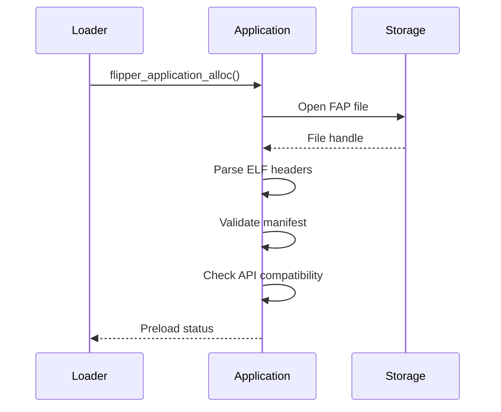
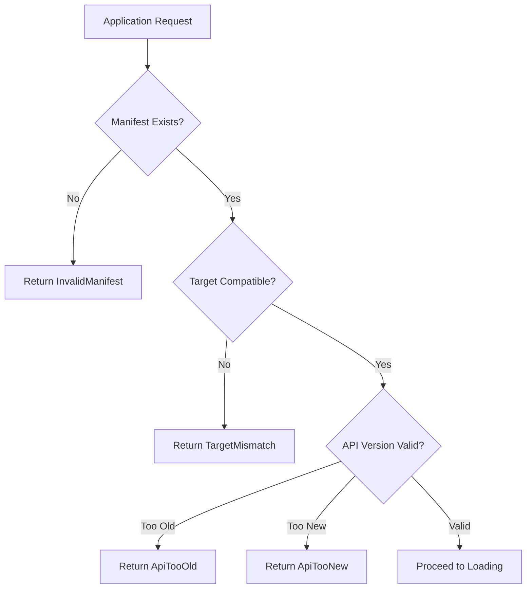
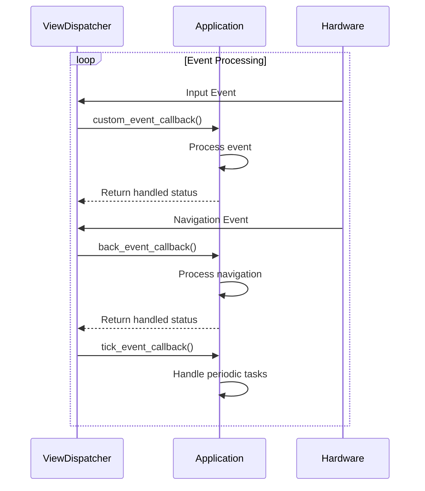

# Application Lifecycle Management

<cite>
**Referenced Files in This Document**   
- [flipper_application.h](file://lib/flipper_application/flipper_application.h)
- [flipper_application.c](file://lib/flipper_application/flipper_application.c)
- [subghz.c](file://applications/main/subghz/subghz.c)
- [nfc_app.c](file://applications/main/nfc/nfc_app.c)
- [lfrfid.c](file://applications/main/lfrfid/lfrfid.c)
</cite>

## Table of Contents
1. [Introduction](#introduction)
2. [Application Lifecycle Overview](#application-lifecycle-overview)
3. [Core Lifecycle Functions](#core-lifecycle-functions)
4. [Application Registration and Loading](#application-registration-and-loading)
5. [Concrete Application Examples](#concrete-application-examples)
6. [Event Loop Integration](#event-loop-integration)
7. [Initialization Failures and Error Handling](#initialization-failures-and-error-handling)
8. [Resource Cleanup and Termination](#resource-cleanup-and-termination)
9. [Best Practices for Robust Application Design](#best-practices-for-robust-application-design)

## Introduction
This document provides a comprehensive analysis of the application lifecycle management system in the Flipper Zero firmware. The system governs how applications are initialized, loaded, executed, and terminated within the embedded environment. The lifecycle management framework ensures consistent application behavior, proper resource allocation and deallocation, and seamless integration with the operating system's event-driven architecture. This documentation covers the core functions, initialization patterns, and execution flow for Flipper applications, with specific examples from major applications including Sub-GHz, NFC, LF RFID, and Infrared.

## Application Lifecycle Overview
The Flipper application lifecycle consists of four distinct phases: initialization, loading, execution, and termination. Each phase serves a specific purpose in the application's journey from being a file on storage to an active process in memory and back to a terminated state. The lifecycle is managed by the flipper_application library, which provides a standardized interface for all applications regardless of their functionality. Applications are packaged as FAP (Flipper Application) files, which are essentially ELF (Executable and Linkable Format) files with additional metadata and resources.

```mermaid
flowchart TD
A["Application File (.fap)"] --> B[Initialization<br>flipper_application_preload()]
B --> C[Loading<br>flipper_application_map_to_memory()]
C --> D[Execution<br>flipper_application_alloc_thread()]
D --> E[Termination<br>flipper_application_free()]
E --> F[Cleanup and Resource Release]
```

**Diagram sources**
- [flipper_application.c](file://lib/flipper_application/flipper_application.c#L250-L350)

**Section sources**
- [flipper_application.h](file://lib/flipper_application/flipper_application.h#L1-L160)
- [flipper_application.c](file://lib/flipper_application/flipper_application.c#L1-L392)

## Core Lifecycle Functions
The application lifecycle is controlled by a set of core functions defined in the flipper_application library. These functions provide the essential operations for managing application state transitions. The primary functions include flipper_application_preload(), flipper_application_map_to_memory(), flipper_application_alloc_thread(), and flipper_application_free(). Each function serves a specific purpose in the lifecycle and must be called in the correct sequence to ensure proper application behavior.

### Initialization Functions
The initialization phase begins with the flipper_application_preload() function, which validates the application file and loads its metadata. This function performs several critical checks including file format validation, manifest integrity verification, and API compatibility checking. The preload operation ensures that the application can be safely loaded before committing system resources to its execution.



**Diagram sources**
- [flipper_application.c](file://lib/flipper_application/flipper_application.c#L250-L300)

**Section sources**
- [flipper_application.h](file://lib/flipper_application/flipper_application.h#L50-L80)
- [flipper_application.c](file://lib/flipper_application/flipper_application.c#L1-L100)

### Execution Functions
The execution phase is managed by the flipper_application_alloc_thread() function, which creates a new thread for the application and prepares it for execution. This function allocates the necessary stack space, sets up the thread context, and connects the application's entry point to the thread scheduler. The actual execution begins when the thread is started by the operating system's scheduler.

## Application Registration and Loading
Applications register with the loader through a standardized process that begins with manifest validation and ends with memory mapping. The registration process ensures that all applications adhere to the same interface and resource requirements. The loader maintains a registry of loaded applications and manages their lifecycle states. When an application is requested to run, the loader follows a specific sequence of operations to prepare it for execution.

### Manifest Validation
Each application contains a manifest that describes its properties, including name, version, API requirements, and resource needs. The manifest validation process checks several critical aspects:
- **File integrity**: Ensures the FAP file is not corrupted
- **Target compatibility**: Verifies the application is built for the correct hardware target
- **API versioning**: Checks compatibility between application and firmware API versions
- **Memory requirements**: Validates that sufficient memory is available



**Diagram sources**
- [flipper_application.c](file://lib/flipper_application/flipper_application.c#L150-L200)

**Section sources**
- [flipper_application.h](file://lib/flipper_application/flipper_application.h#L80-L100)
- [flipper_application.c](file://lib/flipper_application/flipper_application.c#L150-L200)

### Memory Mapping
After successful manifest validation, the application is loaded into memory through the flipper_application_map_to_memory() function. This process involves:
- Loading executable sections from the FAP file
- Processing relocations to adjust addresses
- Resolving external symbols
- Setting up the application's memory layout

The memory mapping process returns a status code indicating success or the specific reason for failure, such as missing imports or insufficient memory.

## Concrete Application Examples
This section examines the startup sequences of four major Flipper applications: Sub-GHz, NFC, LF RFID, and Infrared. Each application follows the standard lifecycle but implements specific initialization patterns based on its functionality and resource requirements.

### Sub-GHz Application
The Sub-GHz application provides wireless communication capabilities for sub-gigahertz radio frequencies. Its startup sequence demonstrates a complex initialization process that configures multiple hardware components and software subsystems.

```c
int32_t subghz_app(char* p) {
    bool alloc_for_tx = (p && strlen(p));
    SubGhz* subghz = subghz_alloc(alloc_for_tx);
    
    // Initialize GUI components
    subghz->gui = furi_record_open(RECORD_GUI);
    subghz->view_dispatcher = view_dispatcher_alloc();
    subghz->scene_manager = scene_manager_alloc(&subghz_scene_handlers, subghz);
    
    // Initialize hardware-specific components
    subghz->txrx = subghz_txrx_alloc();
    subghz->threshold_rssi = subghz_threshold_rssi_alloc();
    
    // Load persistent settings
    subghz->last_settings = subghz_last_settings_alloc();
    subghz_last_settings_load(subghz->last_settings, 0);
    
    // Configure hardware based on settings
    furi_hal_subghz_set_ext_leds_and_amp(subghz->last_settings->leds_and_amp);
    
    // Set up event callbacks
    view_dispatcher_set_custom_event_callback(subghz->view_dispatcher, subghz_custom_event_callback);
    view_dispatcher_set_navigation_event_callback(subghz->view_dispatcher, subghz_back_event_callback);
    view_dispatcher_set_tick_event_callback(subghz->view_dispatcher, subghz_tick_event_callback, 100);
    
    // Attach to GUI and start event loop
    view_dispatcher_attach_to_gui(subghz->view_dispatcher, subghz->gui, ViewDispatcherTypeFullscreen);
    view_dispatcher_run(subghz->view_dispatcher);
    
    // Cleanup
    subghz_free(subghz, alloc_for_tx);
    return 0;
}
```

**Section sources**
- [subghz.c](file://applications/main/subghz/subghz.c#L241-L440)

### NFC Application
The NFC application handles near-field communication protocols and demonstrates a modular initialization approach with plugin support and protocol detection capabilities.

```c
NfcApp* nfc_app_alloc(void) {
    NfcApp* instance = malloc(sizeof(NfcApp));
    
    // Initialize core components
    instance->view_dispatcher = view_dispatcher_alloc();
    instance->scene_manager = scene_manager_alloc(&nfc_scene_handlers, instance);
    instance->nfc = nfc_alloc();
    
    // Initialize protocol support modules
    instance->detected_protocols = nfc_detected_protocols_alloc();
    instance->felica_auth = felica_auth_alloc();
    instance->mf_ul_auth = mf_ultralight_auth_alloc();
    instance->slix_unlock = slix_unlock_alloc();
    instance->mfc_key_cache = mf_classic_key_cache_alloc();
    
    // Initialize UI components
    instance->submenu = submenu_alloc();
    instance->text_input = text_input_alloc();
    instance->byte_input = byte_input_alloc();
    instance->widget = widget_alloc();
    
    // Open system records
    instance->gui = furi_record_open(RECORD_GUI);
    instance->notifications = furi_record_open(RECORD_NOTIFICATION);
    instance->storage = furi_record_open(RECORD_STORAGE);
    instance->dialogs = furi_record_open(RECORD_DIALOGS);
    
    return instance;
}
```

**Section sources**
- [nfc_app.c](file://applications/main/nfc/nfc_app.c#L1-L200)

### LF RFID Application
The LF RFID application manages low-frequency radio frequency identification and follows a similar initialization pattern to other radio applications but with specific focus on coil detection and signal processing.

```c
LfrfidApp* lfrfid_app_alloc(void) {
    LfrfidApp* instance = malloc(sizeof(LfrfidApp));
    
    // Initialize core components
    instance->view_dispatcher = view_dispatcher_alloc();
    instance->scene_manager = scene_manager_alloc(&lfrfid_scene_handlers, instance);
    instance->worker = lfrfid_worker_alloc();
    
    // Initialize UI components
    instance->submenu = submenu_alloc();
    instance->text_input = text_input_alloc();
    instance->byte_input = byte_input_alloc();
    instance->widget = widget_alloc();
    
    // Initialize hardware interface
    instance->lfrfid_device = lfrfid_device_alloc();
    
    // Open system records
    instance->gui = furi_record_open(RECORD_GUI);
    instance->notifications = furi_record_open(RECORD_NOTIFICATION);
    instance->storage = furi_record_open(RECORD_STORAGE);
    instance->dialogs = furi_record_open(RECORD_DIALOGS);
    
    return instance;
}
```

### Infrared Application
The Infrared application handles infrared signal transmission and reception, with initialization focused on timing precision and signal encoding/decoding capabilities.

## Event Loop Integration
Applications integrate with the system event loop through the view_dispatcher component, which manages user interface events and custom application events. The event loop integration allows applications to respond to user input, system notifications, and inter-process communication.

### Event Callback Registration
Applications register three types of event callbacks with the view dispatcher:
- **Custom event callback**: Handles application-specific events
- **Navigation event callback**: Handles back button and navigation events
- **Tick event callback**: Handles periodic timer events



**Diagram sources**
- [subghz.c](file://applications/main/subghz/subghz.c#L10-L50)
- [nfc_app.c](file://applications/main/nfc/nfc_app.c#L10-L50)

**Section sources**
- [subghz.c](file://applications/main/subghz/subghz.c#L1-L100)
- [nfc_app.c](file://applications/main/nfc/nfc_app.c#L1-L100)

### Scene Management
The scene manager provides a state machine for application UI flow, allowing applications to transition between different screens or modes. Each scene represents a specific UI state and has associated handlers for entry, exit, and event processing.

## Initialization Failures and Error Handling
The application lifecycle system includes comprehensive error handling for initialization failures. The flipper_application_preload() function returns specific error codes that indicate the nature of any problems encountered during initialization.

### Error Status Codes
The system defines several preload status codes:
- **Success**: Initialization completed successfully
- **InvalidFile**: The FAP file is corrupted or not a valid ELF format
- **NotEnoughMemory**: Insufficient memory to load the application
- **InvalidManifest**: The application manifest is missing or corrupted
- **ApiTooOld**: Application requires an older API version than available
- **ApiTooNew**: Application requires a newer API version than available
- **TargetMismatch**: Application is built for a different hardware target

```c
const char* flipper_application_preload_status_to_string(FlipperApplicationPreloadStatus status) {
    switch(status) {
    case FlipperApplicationPreloadStatusSuccess:
        return "Success";
    case FlipperApplicationPreloadStatusInvalidFile:
        return "Invalid file";
    case FlipperApplicationPreloadStatusNotEnoughMemory:
        return "Not enough memory";
    case FlipperApplicationPreloadStatusInvalidManifest:
        return "Invalid file manifest";
    case FlipperApplicationPreloadStatusApiTooOld:
        return "Update Application to use with this Firmware (ApiTooOld)";
    case FlipperApplicationPreloadStatusApiTooNew:
        return "Update Firmware to use with this Application (ApiTooNew)";
    case FlipperApplicationPreloadStatusTargetMismatch:
        return "Hardware target mismatch";
    }
    return "Unknown error";
}
```

**Section sources**
- [flipper_application.c](file://lib/flipper_application/flipper_application.c#L300-L350)

### Recovery Strategies
When initialization fails, applications should implement appropriate recovery strategies:
- Display user-friendly error messages
- Log detailed error information for debugging
- Attempt to recover by loading default settings
- Provide alternative functionality when possible
- Gracefully terminate if recovery is not possible

## Resource Cleanup and Termination
Proper resource cleanup is critical for maintaining system stability and preventing memory leaks. The termination phase ensures that all allocated resources are properly released before the application exits.

### Cleanup Sequence
The cleanup process follows a specific sequence to avoid resource conflicts:
1. Stop and join application thread
2. Close all open file handles and system records
3. Free dynamically allocated memory
4. Deallocate UI components and views
5. Release hardware resources
6. Free the application structure itself

```c
void subghz_free(SubGhz* subghz, bool alloc_for_tx_only) {
    if(subghz->rpc_ctx) {
        rpc_system_app_set_callback(subghz->rpc_ctx, NULL, NULL);
        rpc_system_app_send_exited(subghz->rpc_ctx);
        subghz->rpc_ctx = NULL;
    }
    
    // Stop hardware operations
    subghz_txrx_speaker_off(subghz->txrx);
    subghz_txrx_stop(subghz->txrx);
    subghz_txrx_sleep(subghz->txrx);
    
    // Remove and free UI components
    if(!alloc_for_tx_only) {
        view_dispatcher_remove_view(subghz->view_dispatcher, SubGhzViewIdReceiver);
        subghz_view_receiver_free(subghz->subghz_receiver);
        // ... other component cleanup
    }
    
    // Free core components
    scene_manager_free(subghz->scene_manager);
    view_dispatcher_free(subghz->view_dispatcher);
    
    // Close system records
    furi_record_close(RECORD_GUI);
    furi_record_close(RECORD_NOTIFICATION);
    
    // Free remaining resources
    furi_string_free(subghz->file_path);
    furi_string_free(subghz->file_path_tmp);
    subghz_last_settings_free(subghz->last_settings);
    
    free(subghz);
}
```

**Section sources**
- [subghz.c](file://applications/main/subghz/subghz.c#L241-L399)

## Best Practices for Robust Application Design
To ensure reliable application behavior and optimal system performance, developers should follow these best practices:

### Memory Management
- Allocate memory conservatively to avoid system resource exhaustion
- Always pair allocations with corresponding deallocations
- Use stack allocation for small, temporary data structures
- Initialize all allocated memory to prevent undefined behavior

### Error Handling
- Check return values of all system calls
- Implement graceful degradation when features are unavailable
- Provide clear error messages to users
- Log detailed information for debugging purposes
- Handle edge cases and unexpected inputs

### Resource Management
- Open system records only when needed and close them promptly
- Release hardware resources when not in use
- Minimize power consumption during idle periods
- Implement proper cleanup in all exit paths
- Use RAII (Resource Acquisition Is Initialization) patterns when possible

### Performance Optimization
- Minimize blocking operations in the main thread
- Use efficient data structures and algorithms
- Cache frequently accessed data
- Optimize critical code paths
- Profile application performance regularly