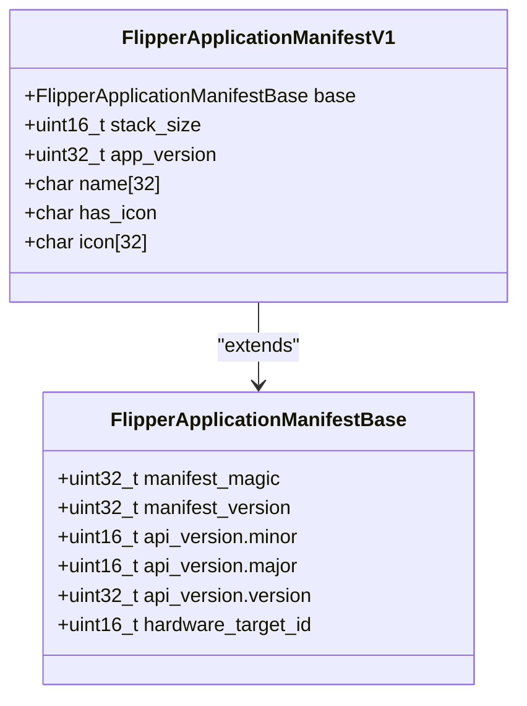
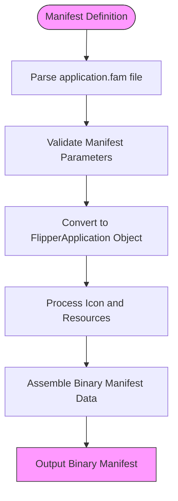
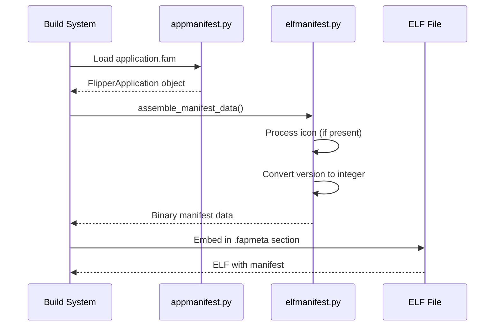
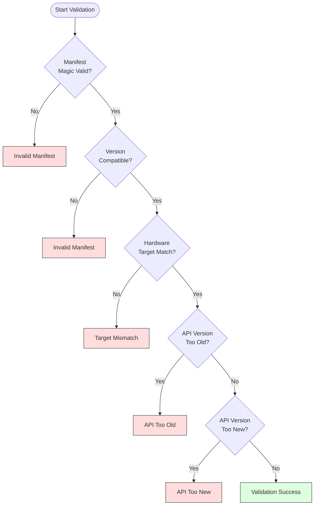

# Application Manifest System

<cite>
**Referenced Files in This Document**   
- [application_manifest.h](file://lib/flipper_application/application_manifest.h#L0-L89)
- [application_manifest.c](file://lib/flipper_application/application_manifest.c#L0-L49)
- [flipper_application.c](file://lib/flipper_application/flipper_application.c#L0-L199)
- [elfmanifest.py](file://scripts/fbt/elfmanifest.py#L0-L82)
- [appmanifest.py](file://scripts/fbt/appmanifest.py#L0-L199)
- [application.fam](file://applications/debug/accessor/application.fam#L0-L11)
</cite>

## Table of Contents
1. [Introduction](#introduction)
2. [Manifest Structure](#manifest-structure)
3. [Manifest Generation Process](#manifest-generation-process)
4. [Manifest Embedding in ELF](#manifest-embedding-in-elf)
5. [Manifest Validation During Loading](#manifest-validation-during-loading)
6. [Compatibility Checking](#compatibility-checking)
7. [Example Manifest Usage](#example-manifest-usage)
8. [Common Configuration Errors](#common-configuration-errors)
9. [Conclusion](#conclusion)

## Introduction
The Application Manifest System is a critical component of the Flipper Zero firmware architecture that ensures application compatibility, proper loading, and system integrity. This system defines metadata for applications through manifests that are generated during the build process, embedded in executable files, and validated during runtime. The manifest contains essential information such as application version, API requirements, hardware targets, and resource specifications. This documentation provides a comprehensive analysis of the manifest system, covering its structure, generation process, validation mechanisms, and practical usage examples.

**Section sources**
- [application_manifest.h](file://lib/flipper_application/application_manifest.h#L0-L89)
- [application_manifest.c](file://lib/flipper_application/application_manifest.c#L0-L49)

## Manifest Structure
The application manifest structure is defined in `application_manifest.h` and consists of a base structure with versioning and hardware targeting information, extended by version-specific fields. The manifest uses packed structures to ensure consistent binary layout across different platforms.



**Diagram sources**
- [application_manifest.h](file://lib/flipper_application/application_manifest.h#L25-L65)

**Section sources**
- [application_manifest.h](file://lib/flipper_application/application_manifest.h#L25-L65)

The manifest structure includes several key components:

### Base Manifest Structure
The base structure `FlipperApplicationManifestBase` contains fundamental metadata:
- **manifest_magic**: A magic number (0x52474448) used to identify valid manifests
- **manifest_version**: Version of the manifest format (currently 1)
- **api_version**: Union containing major and minor version numbers for API compatibility
- **hardware_target_id**: Identifier for the target hardware platform

### Version 1 Extension
The `FlipperApplicationManifestV1` structure extends the base with application-specific data:
- **stack_size**: Stack allocation size in bytes
- **app_version**: Application version as a 32-bit integer
- **name**: Application name (up to 32 characters)
- **has_icon**: Flag indicating if an icon is present
- **icon**: Icon data (up to 32 bytes)

The constants defined in the header file establish limits:
- `FAP_MANIFEST_MAX_APP_NAME_LENGTH`: Maximum application name length (32 characters)
- `FAP_MANIFEST_MAX_ICON_SIZE`: Maximum icon size (32 bytes)

## Manifest Generation Process
The manifest generation process begins with Python scripts in the build system that parse application manifest files and convert them into binary format. The `appmanifest.py` script defines the `FlipperApplication` class that represents the manifest data structure in Python.



**Diagram sources**
- [appmanifest.py](file://scripts/fbt/appmanifest.py#L0-L199)
- [elfmanifest.py](file://scripts/fbt/elfmanifest.py#L0-L82)

**Section sources**
- [appmanifest.py](file://scripts/fbt/appmanifest.py#L0-L199)

The `AppManager` class in `appmanifest.py` handles manifest loading and validation:
- Loads manifest files using the `load_manifest` method
- Validates parameters through `_validate_app_params`
- Creates `FlipperApplication` objects with proper configuration

Key validation rules include:
- App IDs must match the regex `^[a-z0-9_]+$`
- Plugin applications cannot have stack size specified
- Plugins must declare dependencies in the `requires` field
- Version strings must be in the format "major.minor"

## Manifest Embedding in ELF
During the build process, manifests are converted to binary format and embedded in the ELF file headers. The `elfmanifest.py` script handles this conversion, creating a binary representation that matches the C structure layout.



**Diagram sources**
- [elfmanifest.py](file://scripts/fbt/elfmanifest.py#L0-L82)
- [appmanifest.py](file://scripts/fbt/appmanifest.py#L0-L199)

**Section sources**
- [elfmanifest.py](file://scripts/fbt/elfmanifest.py#L0-L82)

The `assemble_manifest_data` function performs several critical operations:
1. Processes the application icon if specified, ensuring it meets size requirements (10x10 pixels, ≤32 bytes)
2. Converts the version tuple to a 32-bit integer format
3. Creates binary headers using `struct.pack` with little-endian format
4. Combines base and version-specific headers into a complete manifest

The binary manifest is embedded in the ELF file in the `.fapmeta` section, which is processed during application loading.

## Manifest Validation During Loading
When an application is loaded, the system validates the manifest to ensure integrity and compatibility. The validation process occurs in `flipper_application.c` and involves multiple checks performed sequentially.



**Diagram sources**
- [flipper_application.c](file://lib/flipper_application/flipper_application.c#L0-L199)
- [application_manifest.c](file://lib/flipper_application/application_manifest.c#L0-L49)

**Section sources**
- [flipper_application.c](file://lib/flipper_application/flipper_application.c#L0-L199)

The validation process is implemented in `flipper_application_validate_manifest` and consists of the following steps:

### Integrity Check
The `flipper_application_manifest_is_valid` function verifies the manifest's basic integrity:
- Checks for the correct magic number (0x52474448)
- Validates the manifest version against supported versions

### Hardware Compatibility
The `flipper_application_manifest_is_target_compatible` function ensures the application is compatible with the current hardware:
- Retrieves the current firmware version using `furi_hal_version_get_firmware_version()`
- Compares the hardware target ID in the manifest with the current system's target

### API Version Compatibility
Two functions handle API version compatibility checking:
- `flipper_application_manifest_is_too_old`: Returns true if the manifest's API version is older than the system's API
- `flipper_application_manifest_is_too_new`: Returns true if the manifest's API version is newer than the system's API

These checks use major version comparison only, allowing backward compatibility within the same major version.

## Compatibility Checking
The system implements a comprehensive compatibility checking mechanism that evaluates multiple dimensions of application compatibility. This ensures that only applications that can safely run on the current system are loaded.

### Hardware Target Compatibility
Hardware compatibility is determined by comparing the `hardware_target_id` in the manifest with the current system's target ID. This prevents applications compiled for different hardware variants from being loaded, which could cause system instability or hardware damage.

### API Version Compatibility
The API version compatibility system uses a forward-compatible approach:
- Applications requiring an older API version can run on newer systems
- Applications requiring a newer API version cannot run on older systems
- Minor version differences are ignored in compatibility checks

This allows for backward compatibility while preventing applications from accessing APIs that don't exist in the current system.

### Dependency Resolution
The manifest system supports dependency declarations through the `requires` field. During the build process, the system ensures that all required components are available. This prevents applications from being built or loaded when their dependencies are not met.

## Example Manifest Usage
Actual application manifests are defined in `application.fam` files throughout the applications directory. These files use a Python-like syntax to define manifest properties.

```python
App(
    appid="accessor",
    name="Accessor",
    apptype=FlipperAppType.DEBUG,
    targets=["f7"],
    entry_point="accessor_app",
    requires=["gui"],
    stack_size=4 * 1024,
    order=40,
    fap_category="Debug",
)
```

**Section sources**
- [application.fam](file://applications/debug/accessor/application.fam#L0-L11)

This example demonstrates key manifest properties:
- **appid**: Unique identifier for the application ("accessor")
- **name**: Display name ("Accessor")
- **apptype**: Application type (DEBUG)
- **targets**: Hardware targets (f7)
- **entry_point**: Function name for application entry
- **requires**: Dependencies (gui)
- **stack_size**: Stack allocation (4KB)
- **order**: Loading order priority
- **fap_category**: Category for organization

The build system processes this file through the `App` function defined in `appmanifest.py`, creating a `FlipperApplication` object that is then converted to the binary manifest format.

## Common Configuration Errors
Several common configuration errors can occur when defining application manifests. Understanding these errors and their solutions is crucial for successful application development.

### Version Mismatch Errors
**Error**: Application fails to load with "API Too New" or "API Too Old" error
**Cause**: The application's API version requirement doesn't match the system's API version
**Solution**: 
- For "API Too New": Recompile the application with an older SDK version
- For "API Too Old": Update the application to use current APIs and recompile

### Missing Dependencies
**Error**: Application fails to build with dependency error
**Cause**: Required components are not declared in the `requires` field
**Solution**: Add all required dependencies to the `requires` list in the manifest

### Invalid App ID
**Error**: Build fails with "Invalid appid" message
**Cause**: App ID contains invalid characters or doesn't match the required pattern
**Solution**: Ensure the appid contains only lowercase letters, numbers, and underscores

### Icon Size Issues
**Error**: Build fails with icon size validation error
**Cause**: Icon is larger than 10x10 pixels or exceeds 32 bytes in size
**Solution**: Resize the icon to exactly 10x10 pixels and ensure the encoded data is ≤32 bytes

### Hardware Target Mismatch
**Error**: Application fails to load with "Target Mismatch" error
**Cause**: Application was compiled for a different hardware target
**Solution**: Ensure the `targets` field includes the current hardware or use "all" for universal compatibility

## Conclusion
The Application Manifest System provides a robust framework for ensuring application compatibility and system integrity in the Flipper Zero ecosystem. By defining metadata in manifests that are validated at load time, the system prevents incompatible applications from running and protects the device from potential instability. The manifest structure, generation process, and validation mechanisms work together to create a secure and reliable application loading system. Understanding the manifest system is essential for developers creating applications for the platform, as it governs compatibility, dependencies, and proper integration with the firmware environment.