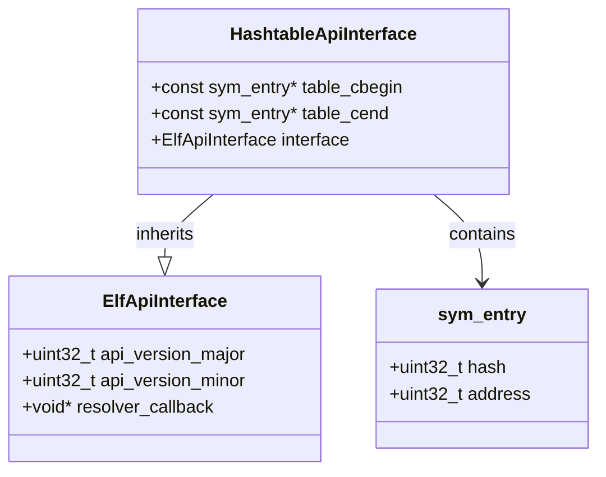
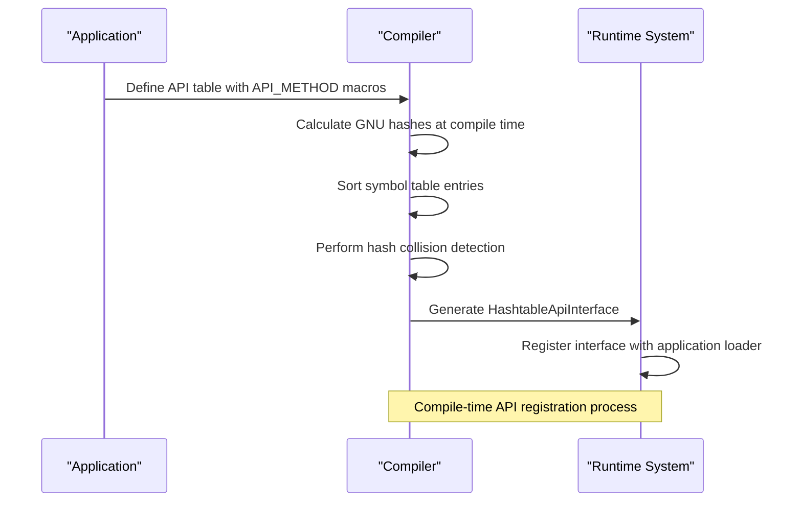
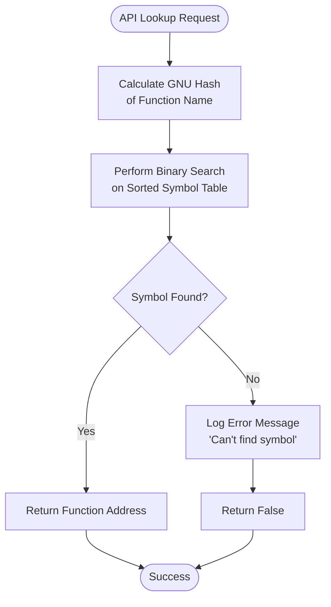
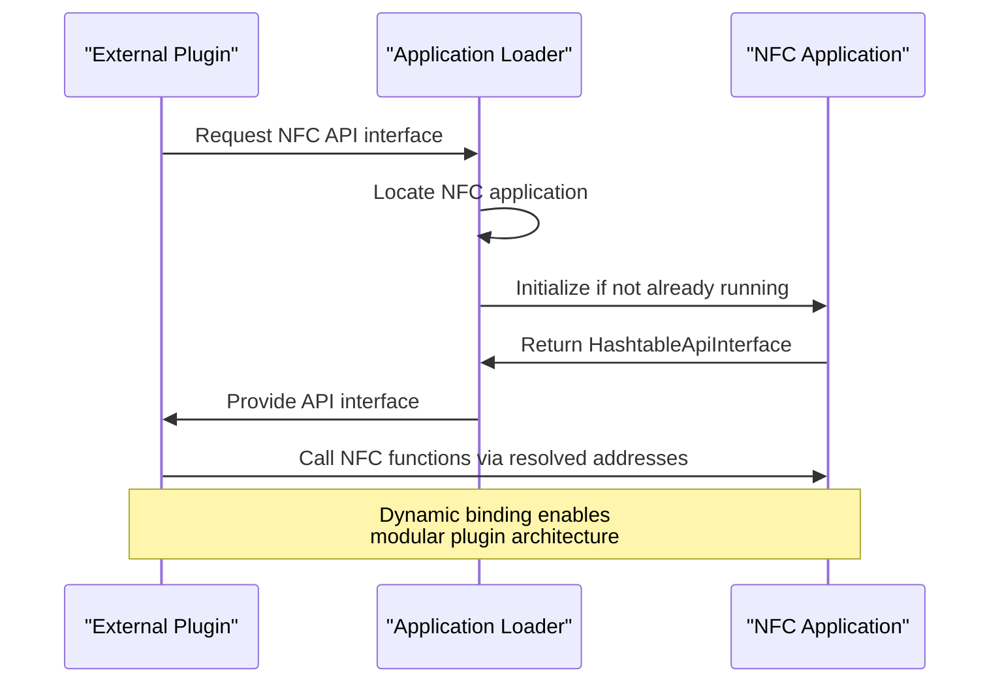
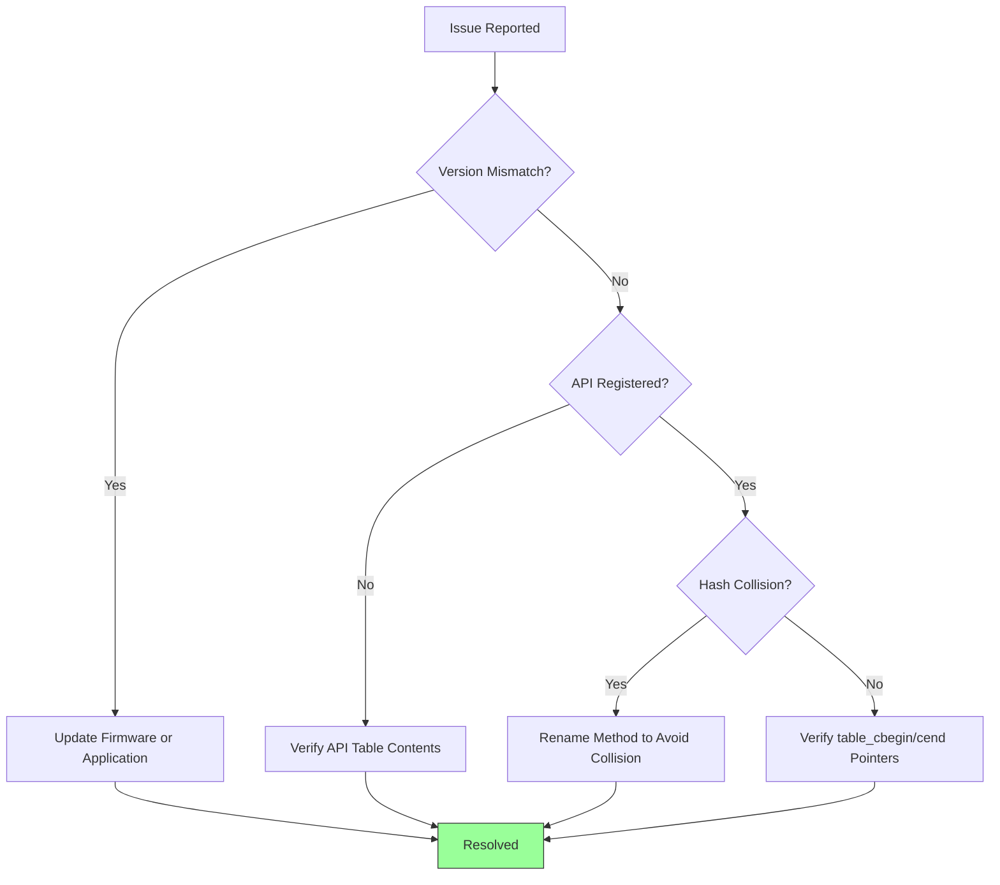

# Dynamic API Binding

<cite>
**Referenced Files in This Document**   
- [api_hashtable.cpp](file://lib/flipper_application/api_hashtable/api_hashtable.cpp)
- [api_hashtable.h](file://lib/flipper_application/api_hashtable/api_hashtable.h)
- [flipper_application.c](file://lib/flipper_application/flipper_application.c)
- [flipper_application.h](file://lib/flipper_application/flipper_application.h)
- [nfc_app_api_table.cpp](file://applications/main/nfc/api/nfc_app_api_table.cpp)
- [nfc_app_api_table_i.h](file://applications/main/nfc/api/nfc_app_api_table_i.h)
</cite>

## Table of Contents
1. [Introduction](#introduction)
2. [Core Mechanism: API Hashtable](#core-mechanism-api-hashtable)
3. [API Registration Process](#api-registration-process)
4. [API Lookup and Resolution](#api-lookup-and-resolution)
5. [Hash Table Implementation Details](#hash-table-implementation-details)
6. [Example: NFC Application API Usage](#example-nfc-application-api-usage)
7. [Common Issues and Debugging](#common-issues-and-debugging)
8. [Best Practices for API Design](#best-practices-for-api-design)

## Introduction
The Dynamic API Binding system in the Flipper Zero firmware enables runtime binding between applications and system services through a hashtable-based mechanism. This architecture allows applications to dynamically register their APIs and other components to discover and consume these services. The system is designed for efficiency, reliability, and type safety, using compile-time checks to prevent common errors like hash collisions. This document provides a comprehensive analysis of the API binding mechanism, covering its implementation, usage patterns, and troubleshooting strategies.

## Core Mechanism: API Hashtable
The API hashtable mechanism serves as the foundation for dynamic service binding in the Flipper Zero ecosystem. It enables applications to expose their functionality to other components through a standardized interface while maintaining type safety and performance. The system uses a sorted array of symbol entries that are resolved at runtime using binary search, providing O(log n) lookup performance.

The core data structure is the `sym_entry` which contains a 32-bit hash of the function name and its corresponding address. These entries are stored in a pre-sorted array, allowing for efficient binary search operations during symbol resolution. The sorting is performed at compile time, eliminating runtime initialization overhead.



**Diagram sources**
- [api_hashtable.h](file://lib/flipper_application/api_hashtable/api_hashtable.h#L15-L25)
- [api_hashtable.h](file://lib/flipper_application/api_hashtable/api_hashtable.h#L68-L75)

**Section sources**
- [api_hashtable.h](file://lib/flipper_application/api_hashtable/api_hashtable.h#L15-L89)
- [api_hashtable.cpp](file://lib/flipper_application/api_hashtable/api_hashtable.cpp#L0-L41)

## API Registration Process
API registration in the Flipper Zero firmware is accomplished through a compile-time process that generates a sorted hashtable of function pointers. Applications define their API surface using the `API_METHOD` and `API_VARIABLE` macros, which create `sym_entry` structures containing the GNU hash of the function name and its memory address.

The registration process begins with the definition of an API table in a header file (e.g., `nfc_app_api_table_i.h`). This table is an `std::array` of `sym_entry` objects, each representing a function or variable that should be exposed through the API. The `API_METHOD` macro simplifies this process by automatically calculating the hash and capturing the function address:

```cpp
#define API_METHOD(x, ret_type, args_type)                                                     \
    sym_entry {                                                                                \
        .hash = elf_gnu_hash(#x), .address = (uint32_t)(static_cast<ret_type(*) args_type>(x)) \
    }
```

During compilation, the `has_hash_collisions` template function performs a compile-time check to ensure that no two API methods have the same hash value. This is enforced with a `static_assert` directive, preventing the build from succeeding if a collision is detected.

The final step in registration is the creation of a `HashtableApiInterface` object that wraps the API table and provides the resolver callback. This object is exported as a C-compatible symbol (`nfc_application_api_interface`) that can be used by the application loader to resolve symbols at runtime.



**Diagram sources**
- [api_hashtable.h](file://lib/flipper_application/api_hashtable/api_hashtable.h#L80-L95)
- [nfc_app_api_table.cpp](file://applications/main/nfc/api/nfc_app_api_table.cpp#L0-L27)

**Section sources**
- [api_hashtable.h](file://lib/flipper_application/api_hashtable/api_hashtable.h#L80-L95)
- [nfc_app_api_table.cpp](file://applications/main/nfc/api/nfc_app_api_table.cpp#L0-L27)

## API Lookup and Resolution
API lookup is performed through the `elf_resolve_from_hashtable` function, which implements the core symbol resolution logic. This function takes a hash value and returns the corresponding function address by performing a binary search on the sorted symbol table.

The lookup process begins when an application requests access to a system service through the `flipper_application_plugin_get_descriptor` function or similar mechanisms. The system uses the `HashtableApiInterface` associated with the target application to locate the requested symbol.

```cpp
bool elf_resolve_from_hashtable(
    const ElfApiInterface* interface,
    uint32_t hash,
    Elf32_Addr* address) {

    furi_check(interface);
    furi_check(address);

    bool result = false;
    const HashtableApiInterface* hashtable_interface =
        static_cast<const HashtableApiInterface*>(interface);

    sym_entry key = {
        .hash = hash,
        .address = 0,
    };

    auto find_res =
        std::lower_bound(hashtable_interface->table_cbegin, hashtable_interface->table_cend, key);
    if((find_res == hashtable_interface->table_cend || (find_res->hash != hash))) {
        FURI_LOG_T(
            TAG, "Can't find symbol with hash %lx @ %p!", hash, hashtable_interface->table_cbegin);
        result = false;
    } else {
        result = true;
        *address = find_res->address;
    }

    return result;
}
```

The function uses `std::lower_bound` to perform a binary search on the sorted array, which provides O(log n) lookup performance. If the symbol is found, its address is returned; otherwise, the function returns false and logs a debug message.

This resolution mechanism is integrated into the application loading process through the `flipper_application` module, which manages the lifecycle of applications and their API interfaces. When an application is loaded, its API interface is registered with the system, making its services available to other components.



**Diagram sources**
- [api_hashtable.cpp](file://lib/flipper_application/api_hashtable/api_hashtable.cpp#L5-L41)
- [flipper_application.c](file://lib/flipper_application/flipper_application.c#L350-L370)

**Section sources**
- [api_hashtable.cpp](file://lib/flipper_application/api_hashtable/api_hashtable.cpp#L5-L41)
- [flipper_application.c](file://lib/flipper_application/flipper_application.c#L350-L370)

## Hash Table Implementation Details
The hash table implementation in the Flipper Zero firmware is optimized for embedded systems with limited resources. It uses a sorted array rather than a traditional hash table with buckets, eliminating the need for dynamic memory allocation and reducing memory overhead.

The system employs the ELF GNU hash algorithm to convert function names into 32-bit hash values. This algorithm is implemented as a constexpr function, allowing hash calculations to be performed at compile time:

```cpp
constexpr uint32_t elf_gnu_hash(const char* s) {
    uint32_t h = 0x1505;
    for(unsigned char c = *s; c != '\0'; c = *++s) {
        h = (h << 5) + h + c;
    }
    return h;
}
```

Collision resolution is handled through compile-time validation rather than runtime mechanisms. The `has_hash_collisions` template function checks for duplicate hash values in the API table:

```cpp
template <std::size_t N>
constexpr bool has_hash_collisions(const std::array<sym_entry, N>& api_methods) {
    for(std::size_t i = 0; i < (N - 1); ++i) {
        if(api_methods[i].hash == api_methods[i + 1].hash) {
            return true;
        }
    }
    return false;
}
```

This approach eliminates the need for runtime collision handling, reducing code size and improving performance. The trade-off is that developers must ensure API method names are sufficiently distinct to avoid hash collisions.

The sorted nature of the symbol table enables efficient binary search operations through `std::lower_bound`, which has O(log n) complexity. For typical API tables with fewer than 100 entries, this results in at most 7 comparisons per lookup, making it highly efficient for embedded systems.

```mermaid
graph TD
A[Function Name] --> B[GNU Hash Algorithm]
B --> C{Compile-Time<br/>Hash Calculation}
C --> D[Sorted Symbol Table]
D --> E[Binary Search<br/>std::lower_bound]
E --> F{Symbol Found?}
F --> |Yes| G[Return Address]
F --> |No| H[Return Error]
style D fill:#f9f,stroke:#333
style E fill:#bbf,stroke:#333
Note over C,E: Compile-time processing<br/>eliminates runtime overhead
```

**Diagram sources**
- [api_hashtable.h](file://lib/flipper_application/api_hashtable/api_hashtable.h#L80-L95)
- [api_hashtable.cpp](file://lib/flipper_application/api_hashtable/api_hashtable.cpp#L35-L41)

**Section sources**
- [api_hashtable.h](file://lib/flipper_application/api_hashtable/api_hashtable.h#L80-L95)
- [api_hashtable.cpp](file://lib/flipper_application/api_hashtable/api_hashtable.cpp#L35-L41)

## Example: NFC Application API Usage
The NFC application provides a concrete example of how the dynamic API binding system is used in practice. The application exposes its functionality through an API table defined in `nfc_app_api_table_i.h` and implemented in `nfc_app_api_table.cpp`.

The NFC application's API interface is defined as a `HashtableApiInterface` object that wraps the API table and provides the resolver callback:

```cpp
constexpr HashtableApiInterface nfc_application_hashtable_api_interface{
    {
        .api_version_major = 0,
        .api_version_minor = 0,
        .resolver_callback = &elf_resolve_from_hashtable,
    },
    nfc_app_api_table.cbegin(),
    nfc_app_api_table.cend(),
};
```

This interface is exported as a C-compatible symbol that can be used by other components to access NFC functionality:

```cpp
extern "C" const ElfApiInterface* const nfc_application_api_interface =
    &nfc_application_hashtable_api_interface;
```

Other applications or plugins can consume the NFC API by using the application loading system to obtain a reference to the NFC application and its API interface. The `flipper_application_plugin_get_descriptor` function can be used to retrieve the plugin descriptor, which contains the entry point to the API.

This pattern allows for modular design where the NFC application can be updated independently of other components, as long as the API interface remains compatible. Plugins can be developed to extend NFC functionality without modifying the core application code.



**Diagram sources**
- [nfc_app_api_table.cpp](file://applications/main/nfc/api/nfc_app_api_table.cpp#L15-L27)
- [flipper_application.c](file://lib/flipper_application/flipper_application.c#L350-L370)

**Section sources**
- [nfc_app_api_table.cpp](file://applications/main/nfc/api/nfc_app_api_table.cpp#L15-L27)
- [flipper_application.c](file://lib/flipper_application/flipper_application.c#L350-L370)

## Common Issues and Debugging
Several common issues can arise when working with the dynamic API binding system, along with corresponding debugging strategies.

**API Version Mismatches**: When an application is compiled against a different API version than the running firmware, version compatibility checks in `flipper_application_validate_manifest` will fail. The system provides descriptive error messages through `flipper_application_preload_status_to_string`:

```c
const char* flipper_application_preload_status_to_string(FlipperApplicationPreloadStatus status) {
    switch(status) {
    case FlipperApplicationPreloadStatusApiTooOld:
        return "Update Application to use with this Firmware (ApiTooOld)";
    case FlipperApplicationPreloadStatusApiTooNew:
        return "Update Firmware to use with this Application (ApiTooNew)";
    // ...
    }
}
```

**Missing API Registrations**: If an API method is not properly registered in the symbol table, lookups will fail silently. Debugging involves checking:
1. The method is included in the API table (e.g., `nfc_app_api_table`)
2. The `static_assert` for hash collisions passes compilation
3. The `HashtableApiInterface` is properly initialized with correct begin/end pointers

**Hash Collisions**: Although compile-time checks prevent most collisions, they can still occur if the API table is manually manipulated. The `has_hash_collisions` template will catch these during compilation, failing with "Detected API method hash collision!".

Debugging strategies include:
- Using `FURI_LOG_T` to trace symbol resolution attempts
- Verifying the symbol table contents in the debugger
- Checking that all API methods are properly declared with `API_METHOD` macros
- Ensuring the `table_cbegin` and `table_cend` pointers are correctly set



**Section sources**
- [flipper_application.c](file://lib/flipper_application/flipper_application.c#L100-L150)
- [api_hashtable.h](file://lib/flipper_application/api_hashtable/api_hashtable.h#L80-L95)

## Best Practices for API Design
When designing APIs for the Flipper Zero dynamic binding system, several best practices should be followed:

**Use Descriptive Method Names**: Since the system uses name-based hashing, use clear, descriptive method names that are unlikely to conflict with other APIs. Avoid generic names like "process" or "handle" in favor of specific names like "nfc_emv_parse_transaction".

**Maintain API Stability**: Once an API is published, maintain backward compatibility. Use version numbers in the `HashtableApiInterface` to indicate breaking changes, and avoid removing methods from the API table.

**Organize APIs Hierarchically**: Group related functionality under consistent naming prefixes (e.g., "nfc_", "subghz_", "ibutton_") to reduce the likelihood of hash collisions and improve code organization.

**Validate at Compile Time**: Leverage the `static_assert` mechanism to catch errors early. Ensure all API tables include the collision detection assertion:

```cpp
static_assert(!has_hash_collisions(api_table), "Detected API method hash collision!");
```

**Document API Contracts**: Clearly document the expected behavior, parameters, and return values for each API method, as the type system alone cannot convey this information.

**Limit API Surface**: Expose only the minimum necessary functionality through the API to reduce complexity and potential security issues. Keep internal implementation details private to the application.

These practices ensure that APIs are robust, maintainable, and compatible across different versions of the firmware and applications.

**Section sources**
- [api_hashtable.h](file://lib/flipper_application/api_hashtable/api_hashtable.h#L80-L95)
- [nfc_app_api_table.cpp](file://applications/main/nfc/api/nfc_app_api_table.cpp#L5-L10)