# ELF Application Loading

<cite>
**Referenced Files in This Document**   
- [elf_file.h](file://lib/flipper_application/elf/elf_file.h)
- [elf_file.c](file://lib/flipper_application/elf/elf_file.c)
- [elf_file_i.h](file://lib/flipper_application/elf/elf_file_i.h)
- [elf_api_interface.h](file://lib/flipper_application/elf/elf_api_interface.h)
</cite>

## Table of Contents
1. [Introduction](#introduction)
2. [Core Components](#core-components)
3. [ELF Loading Process](#elf-loading-process)
4. [Memory Layout and Position-Independent Code](#memory-layout-and-position-independent-code)
5. [Error Handling and Validation](#error-handling-and-validation)
6. [Debug Information and Symbol Resolution](#debug-information-and-symbol-resolution)
7. [Troubleshooting Guide](#troubleshooting-guide)

## Introduction
The ELF Application Loading mechanism in the Flipper Zero firmware provides a robust system for loading and executing ELF-formatted application binaries. This document details the complete loading process, from parsing ELF headers to executing application entry points. The system is designed to handle position-independent code, perform symbol resolution, and manage memory allocation for application sections. The implementation follows a multi-stage loading process that ensures applications are properly validated and relocated before execution.

**Section sources**
- [elf_file.h](file://lib/flipper_application/elf/elf_file.h#L1-L50)

## Core Components

The ELF loading system consists of several key components that work together to load and execute application binaries:

### ELFFile Structure
The `ELFFile` structure serves as the central data container for the loaded ELF binary. It maintains references to all loaded sections, symbol tables, and relocation information.

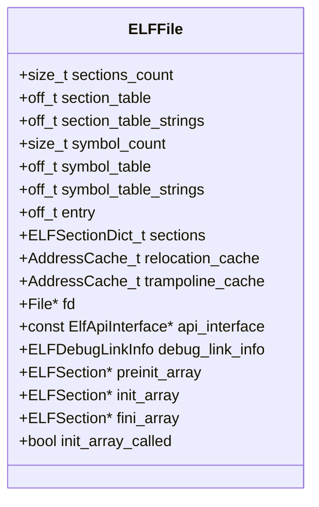

**Diagram sources**
- [elf_file_i.h](file://lib/flipper_application/elf/elf_file_i.h#L25-L57)

### ELFSection Structure
The `ELFSection` structure represents individual sections within the ELF binary, storing their data, size, and relocation information.

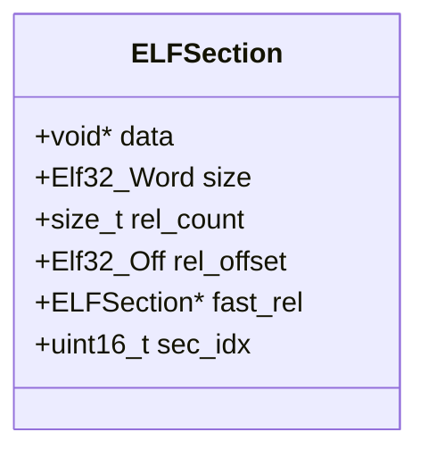

**Diagram sources**
- [elf_file_i.h](file://lib/flipper_application/elf/elf_file_i.h#L15-L23)

### API Interface
The `ElfApiInterface` provides a callback mechanism for symbol resolution, allowing the loader to resolve external symbols required by the application.

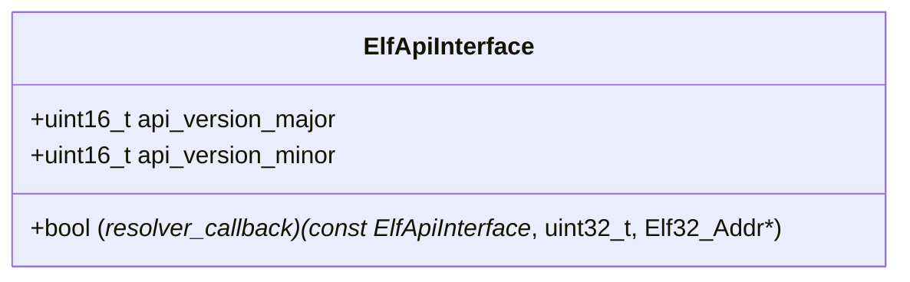

**Diagram sources**
- [elf_api_interface.h](file://lib/flipper_application/elf/elf_api_interface.h#L1-L16)

**Section sources**
- [elf_file_i.h](file://lib/flipper_application/elf/elf_file_i.h#L1-L57)
- [elf_api_interface.h](file://lib/flipper_application/elf/elf_api_interface.h#L1-L16)

## ELF Loading Process

The ELF loading process follows a structured multi-stage approach to ensure proper loading and validation of application binaries.

### Loading Stages
The loading process is divided into three main stages:

1. **Section Table Loading**: Parse ELF headers and identify all sections
2. **Section Loading and Relocation**: Load section data and perform relocations
3. **Initialization**: Execute static constructors and prepare for execution

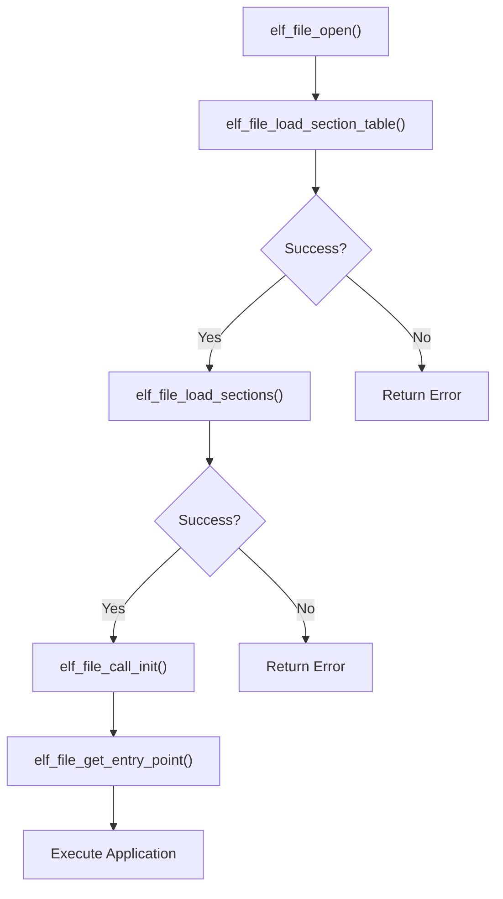

**Diagram sources**
- [elf_file.c](file://lib/flipper_application/elf/elf_file.c#L800-L1080)
- [elf_file.h](file://lib/flipper_application/elf/elf_file.h#L70-L150)

### elf_file_parse Function Analysis
The `elf_file_parse` functionality is implemented through a series of functions that collectively parse and load the ELF file. The process begins with `elf_file_open()`, which validates the ELF header and extracts basic file information.

```c
bool elf_file_open(ELFFile* elf, const char* path) {
    Elf32_Ehdr h;
    Elf32_Shdr sH;

    if(!storage_file_open(elf->fd, path, FSAM_READ, FSOM_OPEN_EXISTING) ||
       !storage_file_seek(elf->fd, 0, true) ||
       storage_file_read(elf->fd, &h, sizeof(h)) != sizeof(h) ||
       !storage_file_seek(elf->fd, h.e_shoff + h.e_shstrndx * sizeof(sH), true) ||
       storage_file_read(elf->fd, &sH, sizeof(Elf32_Shdr)) != sizeof(Elf32_Shdr)) {
        return false;
    }

    elf->entry = h.e_entry;
    elf->sections_count = h.e_shnum;
    elf->section_table = h.e_shoff;
    elf->section_table_strings = sH.sh_offset;
    return true;
}
```

This function performs the following steps:
1. Opens the ELF file for reading
2. Reads the ELF header to validate the file format
3. Extracts the entry point address from the header
4. Stores the section table offset and count
5. Locates the section name string table

**Section sources**
- [elf_file.c](file://lib/flipper_application/elf/elf_file.c#L881-L900)

### elf_file_get_entry_point Function Analysis
The `elf_file_get_entry_point()` function returns the executable entry point for the loaded ELF file after all relocations have been applied.

```c
void* elf_file_get_entry_point(ELFFile* elf) {
    furi_check(elf->init_array_called);
    return (void*)elf->entry;
}
```

This function:
1. Verifies that the initialization phase has been completed (via `furi_check`)
2. Returns the entry point as a void pointer for execution
3. The entry point has already been adjusted during the section loading phase to account for the actual memory location of the .text section

The entry point is calculated during `elf_file_load_sections()` by adding the base address of the .text section to the original entry point from the ELF header:

```c
/* Fixing up entry point */
if(status == ELFFileLoadStatusSuccess) {
    ELFSection* text_section = elf_file_get_section(elf, ".text");
    if(text_section == NULL) {
        FURI_LOG_E(TAG, "No .text section found");
        status = ELFFileLoadStatusUnspecifiedError;
    } else {
        elf->entry += (uint32_t)text_section->data;
    }
}
```

**Section sources**
- [elf_file.c](file://lib/flipper_application/elf/elf_file.c#L1061-L1064)

## Memory Layout and Position-Independent Code

The ELF loader handles position-independent code through a comprehensive relocation system that resolves symbols and adjusts addresses at load time.

### Memory Mapping
The loader creates a memory map of all loaded sections, which can be accessed through the debug information interface:

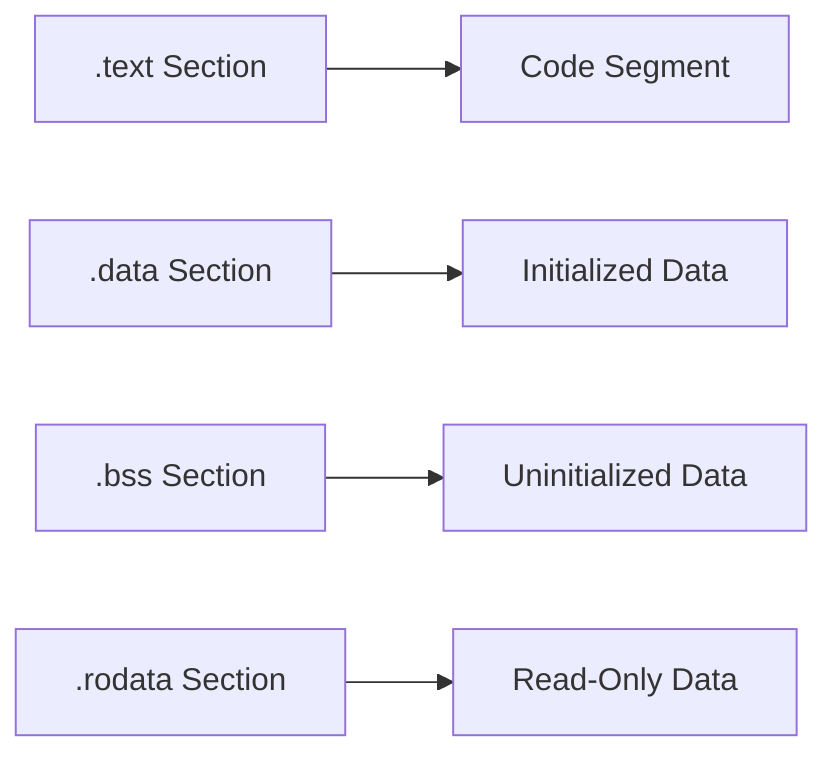

### Relocation Process
The relocation system supports both standard and fast relocation formats:

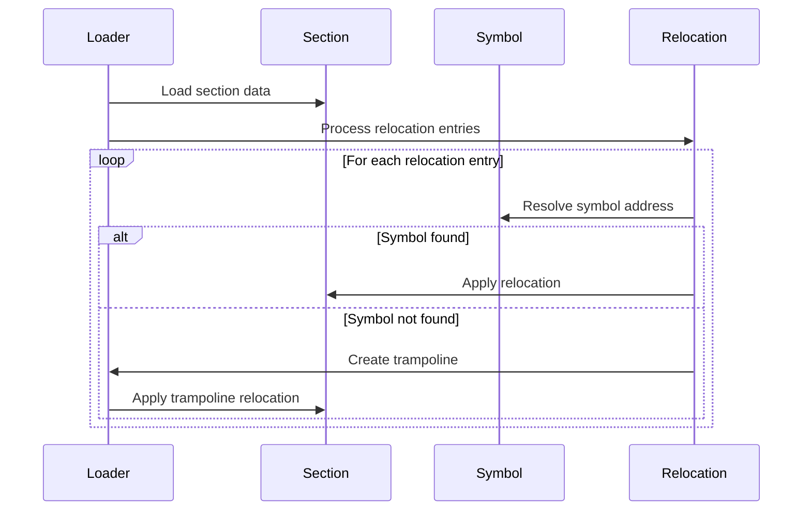

**Diagram sources**
- [elf_file.c](file://lib/flipper_application/elf/elf_file.c#L200-L599)

The system supports multiple relocation types:
- **R_ARM_ABS32**: Absolute 32-bit relocation
- **R_ARM_REL32**: PC-relative 32-bit relocation
- **R_ARM_THM_PC22**: Thumb branch with 22-bit offset
- **R_ARM_THM_JUMP24**: Thumb branch with 24-bit offset
- **R_ARM_THM_MOVW_ABS_NC**: Thumb MOVW with 16-bit immediate
- **R_ARM_THM_MOVT_ABS**: Thumb MOVT with 16-bit immediate

For cases where direct relocation is not possible (e.g., ARM to Thumb interworking), the loader creates trampolines:

```c
static JMPTrampoline* elf_create_trampoline(Elf32_Addr addr) {
    JMPTrampoline* trampoline = malloc(sizeof(JMPTrampoline));
    memcpy(trampoline->code, trampoline_code_little_endian, TRAMPOLINE_CODE_SIZE);
    trampoline->addr = addr;
    return trampoline;
}
```

**Section sources**
- [elf_file.c](file://lib/flipper_application/elf/elf_file.c#L200-L399)

## Error Handling and Validation

The ELF loading system implements comprehensive error handling to ensure application integrity and system stability.

### Status Codes
The system uses the `ELFFileLoadStatus` enum to report loading outcomes:

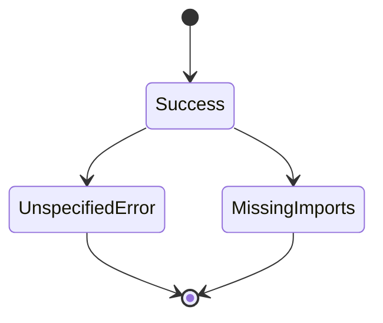

**Diagram sources**
- [elf_file.h](file://lib/flipper_application/elf/elf_file.h#L35-L40)

### Validation Process
The loader performs multiple validation checks:

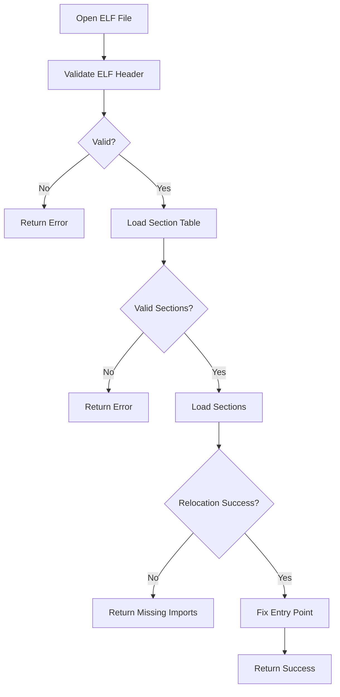

**Diagram sources**
- [elf_file.c](file://lib/flipper_application/elf/elf_file.c#L800-L1080)

### Memory Management
The loader includes safeguards for memory allocation:

```c
static ELFLoadSectionResult
    elf_load_section_data(ELFFile* elf, ELFSection* section, Elf32_Shdr* section_header) {
    if(section_header->sh_size == 0) {
        return ELFLoadSectionResultSuccess;
    }

    size_t safe_size = section_header->sh_size + 1024;

    furi_kernel_lock();

    if(memmgr_heap_get_max_free_block() < safe_size) {
        furi_kernel_unlock();
        return ELFLoadSectionResultNoMemory;
    }

    section->data = aligned_malloc(section_header->sh_size, section_header->sh_addralign);
    section->size = section_header->sh_size;

    furi_kernel_unlock();
    
    // ... rest of function
}
```

The system checks available memory before allocating section data and uses kernel locks to prevent race conditions during allocation.

**Section sources**
- [elf_file.c](file://lib/flipper_application/elf/elf_file.c#L500-L550)

## Debug Information and Symbol Resolution

The loader provides debug information and symbol resolution capabilities to support development and troubleshooting.

### Debug Information Structure
The `ELFDebugInfo` structure provides memory mapping and debug link information:

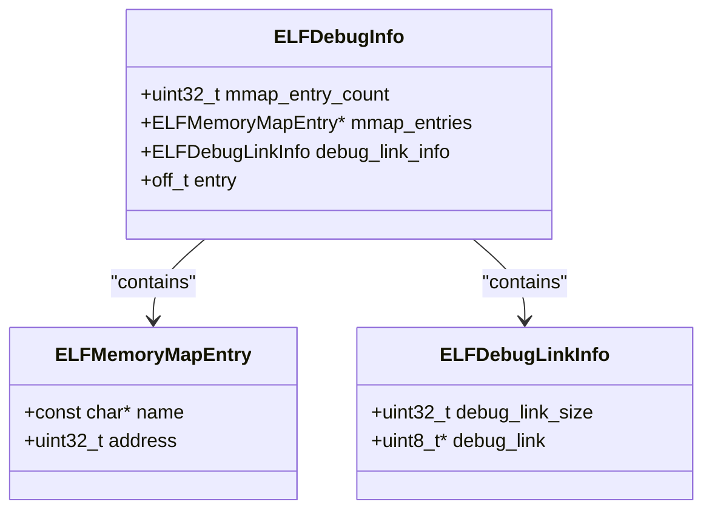

**Diagram sources**
- [elf_file.h](file://lib/flipper_application/elf/elf_file.h#L15-L30)

### Symbol Resolution
The system uses a hash-based symbol resolution mechanism:

```c
static bool elf_file_find_string_by_hash(ELFFile* elf, uint32_t hash, FuriString* out) {
    bool result = false;

    FuriString* symbol_name = furi_string_alloc();
    Elf32_Sym sym;
    for(size_t i = 0; i < elf->symbol_count; i++) {
        furi_string_reset(symbol_name);
        if(elf_read_symbol(elf, i, &sym, symbol_name)) {
            if(elf_symbolname_hash(furi_string_get_cstr(symbol_name)) == hash) {
                furi_string_set(out, symbol_name);
                result = true;
                break;
            }
        }
    }
    furi_string_free(symbol_name);

    return result;
}
```

This function iterates through all symbols in the symbol table, calculating their hash and comparing it with the requested hash.

**Section sources**
- [elf_file.c](file://lib/flipper_application/elf/elf_file.c#L700-L750)

## Troubleshooting Guide

### Common Loading Scenarios

#### Successful Loading Sequence
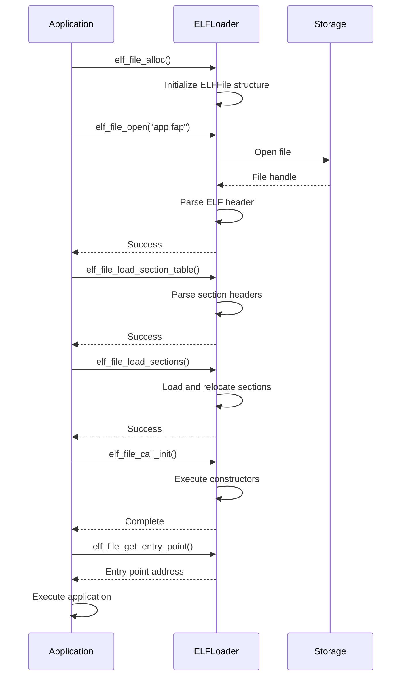

**Diagram sources**
- [elf_file.c](file://lib/flipper_application/elf/elf_file.c#L800-L1080)

#### Failed Loading Due to Missing Imports
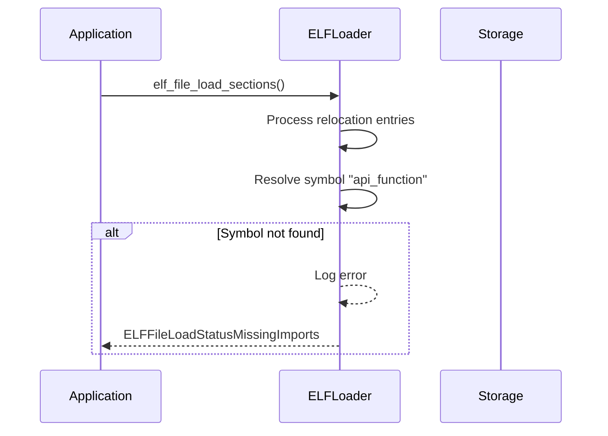

**Diagram sources**
- [elf_file.c](file://lib/flipper_application/elf/elf_file.c#L950-L980)

### Common Issues and Solutions

#### Issue 1: Malformed ELF File
**Symptoms**: `elf_file_open()` returns false
**Causes**: 
- Invalid ELF header
- Corrupted file
- Incorrect file format

**Solutions**:
1. Verify the file is a valid ELF binary
2. Check file integrity
3. Ensure the file was compiled for the correct target

#### Issue 2: Memory Allocation Failure
**Symptoms**: `elf_file_load_section_table()` returns `ElfLoadSectionTableResultNoMemory`
**Causes**:
- Insufficient heap memory
- Large section sizes
- Memory fragmentation

**Solutions**:
1. Reduce application size
2. Optimize memory usage in other applications
3. Restart the device to clear memory fragmentation

#### Issue 3: Missing Imports
**Symptoms**: `elf_file_load_sections()` returns `ELFFileLoadStatusMissingImports`
**Causes**:
- Undefined external symbols
- API version mismatch
- Missing library dependencies

**Solutions**:
1. Verify all external symbols are available
2. Check API version compatibility
3. Ensure all required libraries are loaded

#### Issue 4: No .text Section
**Symptoms**: `elf_file_load_sections()` returns `ELFFileLoadStatusUnspecifiedError`
**Causes**:
- Corrupted ELF file
- Incorrect linking
- Missing code sections

**Solutions**:
1. Rebuild the application
2. Verify the linking process
3. Check for compiler errors

**Section sources**
- [elf_file.c](file://lib/flipper_application/elf/elf_file.c#L950-L1080)
- [elf_file.h](file://lib/flipper_application/elf/elf_file.h#L35-L40)