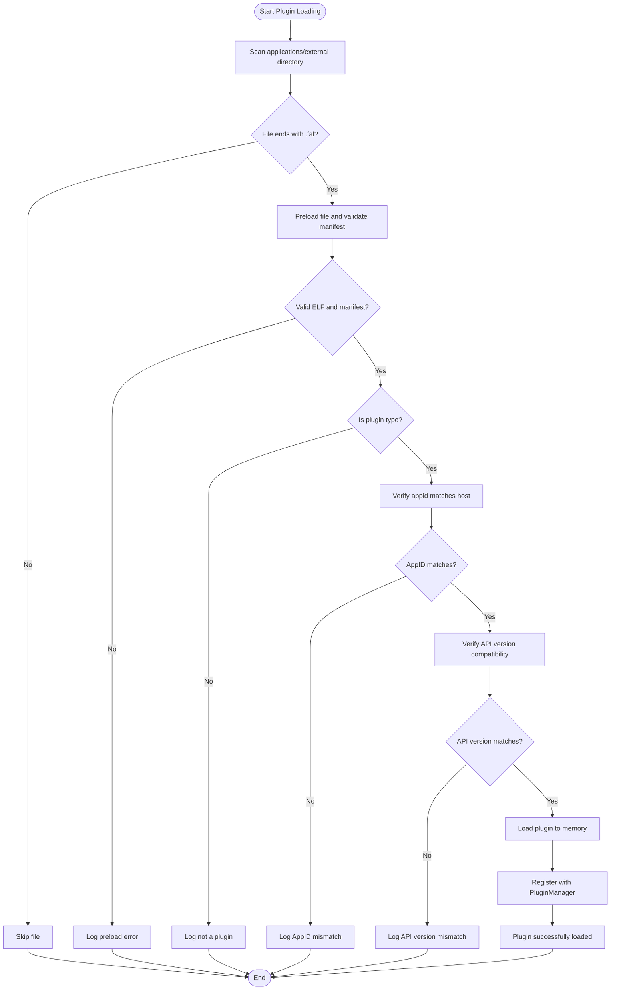
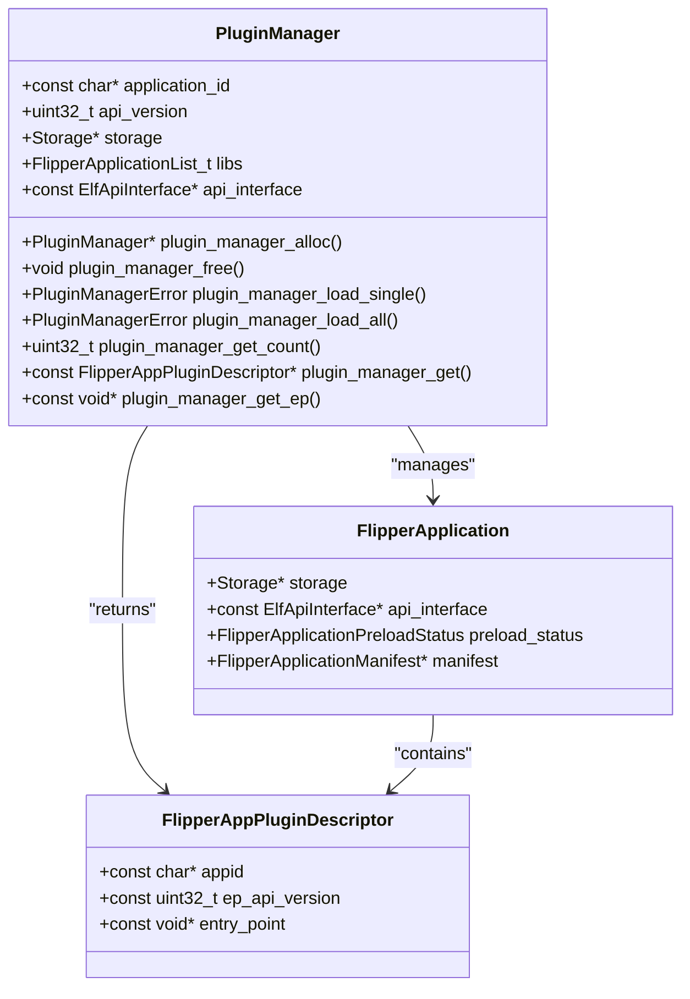
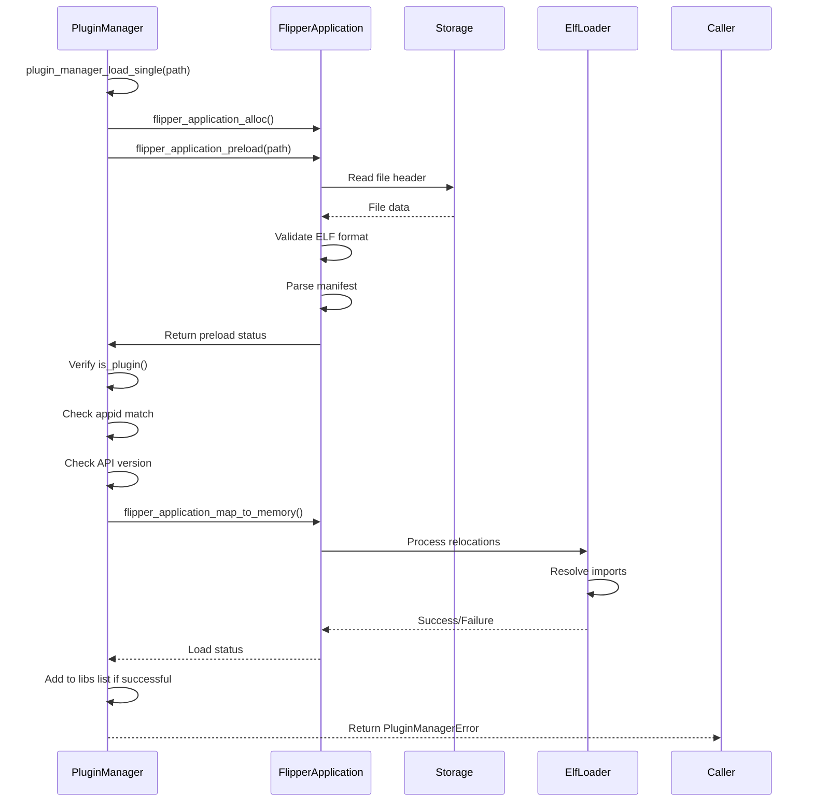
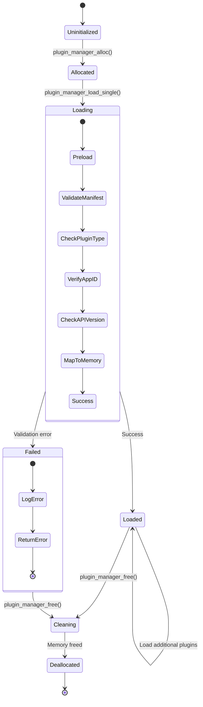
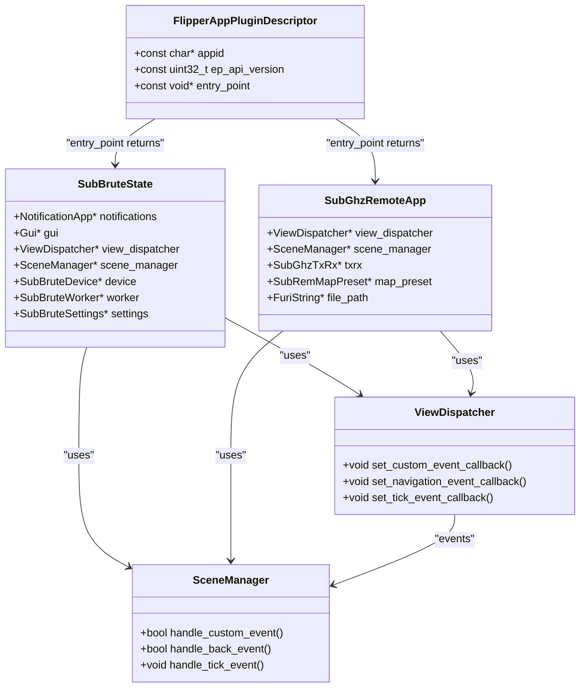
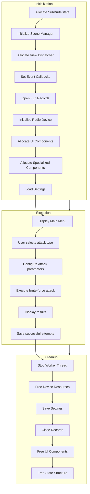
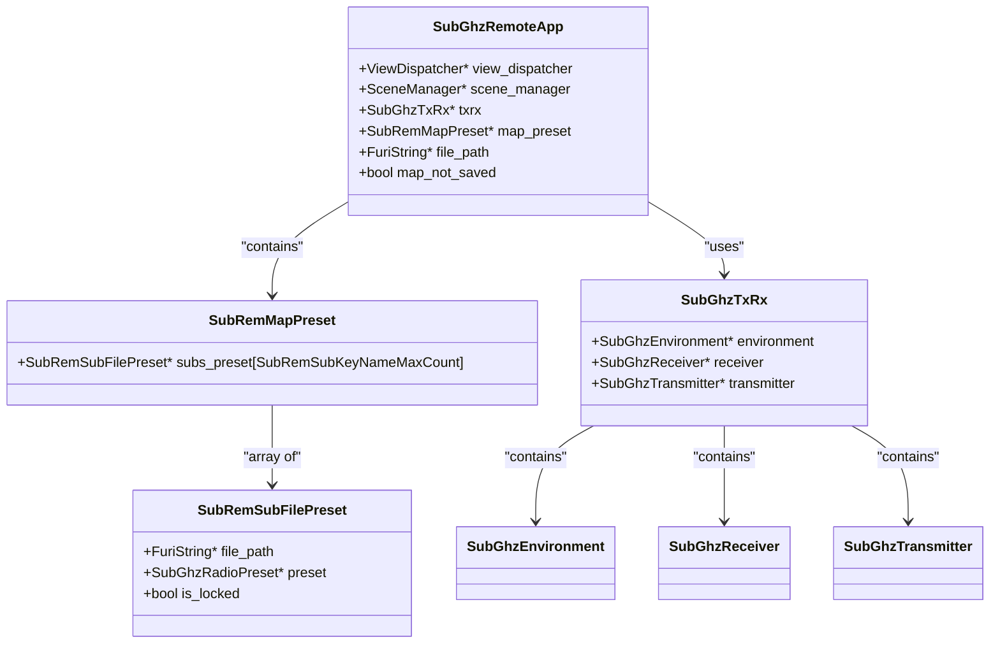

# Plugin System Architecture

<cite>
**Referenced Files in This Document**   
- [plugin_manager.h](file://lib/flipper_application/plugins/plugin_manager.h)
- [plugin_manager.c](file://lib/flipper_application/plugins/plugin_manager.c)
- [flipper_application.h](file://lib/flipper_application/flipper_application.h)
- [subbrute.c](file://applications/external/subghz_bruteforcer/subbrute.c)
- [subbrute_i.h](file://applications/external/subghz_bruteforcer/subbrute_i.h)
- [subghz_remote_app.c](file://applications/external/subghz_remote/subghz_remote_app.c)
- [manifest.yml](file://applications/external/subghz_bruteforcer/manifest.yml)
</cite>

## Table of Contents
1. [Introduction](#introduction)
2. [Plugin Discovery and Loading Process](#plugin-discovery-and-loading-process)
3. [PluginManager Core Architecture](#pluginmanager-core-architecture)
4. [Dependency Resolution and API Management](#dependency-resolution-and-api-management)
5. [Plugin Lifecycle Management](#plugin-lifecycle-management)
6. [Core-Plugin Interface and Data Exchange](#core-plugin-interface-and-data-exchange)
7. [Case Study: Sub-GHz Bruteforcer Plugin](#case-study-sub-ghz-bruteforcer-plugin)
8. [Case Study: Sub-GHz Remote Plugin](#case-study-sub-ghz-remote-plugin)
9. [Common Issues and Troubleshooting](#common-issues-and-troubleshooting)
10. [Development Best Practices](#development-best-practices)

## Introduction
The Plugin System Architecture in the Flipper Zero firmware enables extensible functionality through dynamically loaded external applications. This system allows third-party developers to create specialized tools that integrate seamlessly with the core firmware while maintaining strict compatibility and security controls. The architecture is designed around a robust plugin management system that handles discovery, loading, dependency resolution, and lifecycle management of external plugins located in the `applications/external` directory. This document provides a comprehensive analysis of the plugin system, detailing its components, workflows, and integration patterns.

**Section sources**
- [plugin_manager.h](file://lib/flipper_application/plugins/plugin_manager.h#L1-L82)
- [plugin_manager.c](file://lib/flipper_application/plugins/plugin_manager.c#L1-L166)

## Plugin Discovery and Loading Process
The plugin discovery and loading process begins with the PluginManager scanning designated directories for valid plugin files. The system specifically looks for files with the `.fal` extension, which are Flipper Application Library files containing compiled plugin code. The discovery process is implemented in the `plugin_manager_load_all` function, which recursively scans a specified directory path and filters files by their extension.

When a `.fal` file is identified, the system performs a series of validation checks before loading. First, the file is preloaded to verify its integrity and validate the embedded manifest. The `flipper_application_preload` function ensures the file is a valid ELF binary and contains proper Flipper application metadata. Only files that pass this initial validation proceed to the next stage.

The loading process then verifies that the plugin is specifically designed for the target application by checking the `appid` field in the plugin descriptor against the expected application identifier. This ensures that plugins are only loaded into compatible host applications. Additionally, the system validates API version compatibility by comparing the plugin's `ep_api_version` with the host application's API version, preventing version mismatches that could lead to runtime errors.



**Diagram sources**
- [plugin_manager.c](file://lib/flipper_application/plugins/plugin_manager.c#L100-L140)

**Section sources**
- [plugin_manager.c](file://lib/flipper_application/plugins/plugin_manager.c#L100-L140)
- [flipper_application.h](file://lib/flipper_application/flipper_application.h#L127-L127)

## PluginManager Core Architecture
The PluginManager is the central component responsible for managing the lifecycle of external plugins. Implemented as a C structure, it maintains state information and provides a comprehensive API for plugin operations. The PluginManager structure contains essential fields including the target `application_id`, required `api_version`, a reference to storage services, and a list of currently loaded plugins.

The PluginManager is instantiated through the `plugin_manager_alloc` function, which initializes the structure with the specified application ID, API version, and API interface. If no custom API interface is provided, the system defaults to the firmware's global API interface. This design allows plugins to access both public and private APIs through the `ElfApiInterface` parameter, enabling flexible integration patterns.

```c
struct PluginManager {
    const char* application_id;
    uint32_t api_version;
    Storage* storage;
    FlipperApplicationList_t libs;
    const ElfApiInterface* api_interface;
};
```

The PluginManager provides several key functions for plugin management:
- `plugin_manager_load_single`: Loads an individual plugin from a specified path
- `plugin_manager_load_all`: Loads all valid plugins from a directory
- `plugin_manager_get_count`: Returns the number of successfully loaded plugins
- `plugin_manager_get`: Retrieves a plugin descriptor by index
- `plugin_manager_get_ep`: Retrieves a plugin's entry point by index

These functions implement a robust error handling system that returns specific error codes for different failure scenarios, including loader errors, application ID mismatches, and API version incompatibilities. This allows the host application to respond appropriately to different types of loading failures.



**Diagram sources**
- [plugin_manager.h](file://lib/flipper_application/plugins/plugin_manager.h#L12-L82)
- [plugin_manager.c](file://lib/flipper_application/plugins/plugin_manager.c#L20-L35)

**Section sources**
- [plugin_manager.h](file://lib/flipper_application/plugins/plugin_manager.h#L12-L82)
- [plugin_manager.c](file://lib/flipper_application/plugins/plugin_manager.c#L20-L35)

## Dependency Resolution and API Management
The plugin system implements a sophisticated dependency resolution mechanism through the `ElfApiInterface` structure, which serves as a bridge between plugins and the host application's APIs. When a plugin is loaded, the PluginManager uses the provided API interface to resolve any external symbols that the plugin depends on, ensuring that all required functions and data structures are available before execution.

The dependency resolution process occurs during the `flipper_application_map_to_memory` phase, where the system processes relocations and verifies that all imported symbols can be resolved. If any required imports are missing, the loading process fails with a `FlipperApplicationLoadStatusMissingImports` error, preventing the plugin from being loaded in an incomplete state.

The API versioning system plays a critical role in dependency management. Each plugin specifies its required API version in the `ep_api_version` field of its descriptor, and the PluginManager compares this against the host application's API version. This version check ensures binary compatibility and prevents plugins from accessing APIs that may have changed between firmware versions.

For plugins that require access to private or internal APIs, the system supports the use of a `CompoundApiInterface`, which can combine multiple API interfaces into a single resolution context. This allows plugins to access both public APIs and specific private interfaces while maintaining proper encapsulation boundaries.

The `manifest.yml` file in each plugin directory provides additional metadata that supports dependency management. While the current implementation focuses on source code location and documentation, this structure could be extended to declare explicit dependencies on other plugins or system components.



**Diagram sources**
- [plugin_manager.c](file://lib/flipper_application/plugins/plugin_manager.c#L50-L95)
- [flipper_application.h](file://lib/flipper_application/flipper_application.h#L127-L127)

**Section sources**
- [plugin_manager.c](file://lib/flipper_application/plugins/plugin_manager.c#L50-L95)
- [flipper_application.h](file://lib/flipper_application/flipper_application.h#L127-L127)

## Plugin Lifecycle Management
The plugin lifecycle is carefully managed by the PluginManager to ensure proper resource allocation and cleanup. The lifecycle begins with allocation of the PluginManager instance and ends with its complete deallocation, including all loaded plugins.

When a plugin is successfully loaded, it is added to the PluginManager's internal list (`libs`) and its resources are managed by the system. The PluginManager maintains references to all loaded plugins, ensuring they remain in memory for the duration of their lifecycle. Each plugin's memory is allocated from the system heap, and the PluginManager tracks these allocations to prevent memory leaks.

The `plugin_manager_free` function implements comprehensive cleanup by iterating through all loaded plugins and calling `flipper_application_free` on each one. This ensures that all plugin-specific resources are properly released before the PluginManager itself is deallocated. The function also closes the storage record and frees the PluginManager structure.

Plugins themselves implement their own internal lifecycle management through initialization and cleanup functions. For example, the Sub-GHz Bruteforcer plugin allocates various GUI components, worker threads, and device handlers during initialization in its `subbrute_alloc` function, and systematically releases these resources in the `subbrute_free` function.

The system also manages the execution lifecycle of plugin entry points. When a plugin is accessed, its entry point function is called to return the plugin descriptor, but the actual application logic is typically managed through scene managers and view dispatchers that control the plugin's runtime behavior.



**Diagram sources**
- [plugin_manager.c](file://lib/flipper_application/plugins/plugin_manager.c#L145-L166)
- [subbrute.c](file://applications/external/subghz_bruteforcer/subbrute.c#L20-L200)

**Section sources**
- [plugin_manager.c](file://lib/flipper_application/plugins/plugin_manager.c#L145-L166)
- [subbrute.c](file://applications/external/subghz_bruteforcer/subbrute.c#L20-L200)

## Core-Plugin Interface and Data Exchange
The interface between core applications and plugins is defined by the `FlipperAppPluginDescriptor` structure, which serves as the contract between the host application and the plugin. This descriptor contains three essential elements: the `appid` that identifies the target application, the `ep_api_version` that ensures API compatibility, and the `entry_point` function pointer that provides access to the plugin's functionality.

Data exchange between core applications and plugins occurs through several mechanisms. The most common pattern involves the plugin allocating and managing its own state structure, which contains references to shared resources such as GUI components, storage services, and hardware interfaces. For example, both the Sub-GHz Bruteforcer and Sub-GHz Remote plugins allocate a state structure that holds references to the view dispatcher, scene manager, and various UI components.

```c
typedef struct {
    const char* appid;
    const uint32_t ep_api_version;
    const void* entry_point;
} FlipperAppPluginDescriptor;
```

Plugins access system services through Furi records, which provide a publish-subscribe mechanism for shared resources. Commonly accessed records include:
- `RECORD_GUI`: For graphical user interface components
- `RECORD_STORAGE`: For file system access
- `RECORD_NOTIFICATION`: For notification system integration
- `RECORD_DIALOGS`: For dialog and message display

Event handling is implemented through callback functions registered with the view dispatcher. Plugins typically set up custom event, navigation (back), and tick event callbacks to handle user interactions and periodic processing. The scene manager pattern is widely used to organize plugin functionality into discrete screens or states, with transitions managed through custom event codes.

Data persistence is handled through direct file operations or structured configuration files. The Sub-GHz Remote plugin, for example, creates a dedicated application folder and manages remote configuration files, while the Sub-GHz Bruteforcer stores attack settings and protocol configurations.



**Diagram sources**
- [flipper_application.h](file://lib/flipper_application/flipper_application.h#L127-L127)
- [subbrute_i.h](file://applications/external/subghz_bruteforcer/subbrute_i.h#L30-L128)
- [subghz_remote_app.c](file://applications/external/subghz_remote/subghz_remote_app.c#L20-L200)

**Section sources**
- [flipper_application.h](file://lib/flipper_application/flipper_application.h#L127-L127)
- [subbrute_i.h](file://applications/external/subghz_bruteforcer/subbrute_i.h#L30-L128)
- [subghz_remote_app.c](file://applications/external/subghz_remote/subghz_remote_app.c#L20-L200)

## Case Study: Sub-GHz Bruteforcer Plugin
The Sub-GHz Bruteforcer plugin serves as an excellent example of a complex external application that leverages the plugin system's capabilities. Located in the `applications/external/subghz_bruteforcer` directory, this plugin provides advanced functionality for brute-forcing Sub-GHz remote controls.

The plugin's entry point is implemented in `subbrute.c`, where the `subbrute_alloc` function initializes the plugin's state by allocating memory for the `SubBruteState` structure and setting up various components. The initialization process follows a systematic pattern of resource allocation:

1. Memory allocation for the state structure
2. Initialization of the scene manager with predefined scene handlers
3. Allocation and configuration of the view dispatcher with event callbacks
4. Opening of Furi records for GUI, dialogs, and notifications
5. Initialization of radio hardware through the subghz_devices system
6. Allocation of UI components (text input, widget, variable item list, popup, view stack)
7. Allocation of specialized components (main view, attack view, device, worker, settings)

The plugin implements a comprehensive scene management system with multiple scenes defined in the `scenes/` directory, including configuration setup, file loading, attack execution, and result saving. Each scene handles specific aspects of the brute-forcing workflow, with transitions managed through custom events.

Resource cleanup is handled in the `subbrute_free` function, which systematically releases all allocated components in reverse order of allocation, ensuring proper cleanup and preventing resource leaks. The function stops the worker thread, frees device resources, saves settings, closes records, and finally frees the state structure.

The plugin's `manifest.yml` file provides metadata about the plugin, including its source repository, author information, and screenshots. This metadata supports plugin management and user interface presentation.



**Diagram sources**
- [subbrute.c](file://applications/external/subghz_bruteforcer/subbrute.c#L20-L200)
- [manifest.yml](file://applications/external/subghz_bruteforcer/manifest.yml#L1-L15)

**Section sources**
- [subbrute.c](file://applications/external/subghz_bruteforcer/subbrute.c#L20-L200)
- [subbrute_i.h](file://applications/external/subghz_bruteforcer/subbrute_i.h#L30-L128)
- [manifest.yml](file://applications/external/subghz_bruteforcer/manifest.yml#L1-L15)

## Case Study: Sub-GHz Remote Plugin
The Sub-GHz Remote plugin demonstrates a different approach to plugin design, focusing on remote control management and configuration. Located in the `applications/external/subghz_remote` directory, this plugin provides a user-friendly interface for managing Sub-GHz remote configurations.

The plugin's entry point in `subghz_remote_app.c` follows a similar initialization pattern to the Bruteforcer plugin but with distinct differences in component usage. Key aspects of its implementation include:

1. Creation of a dedicated application folder using `storage_simply_mkdir`
2. Migration support for users upgrading from previous versions
3. Integration with the subghz_txrx system for transmission and reception
4. Implementation of a map-based system for storing remote configurations
5. Support for loading specific configurations via command-line arguments

The plugin allocates a `SubGhzRemoteApp` structure that contains references to various UI components, including submenu, variable item list, text input, widget, popup, and specialized views for remote control and edit menu. It also manages a `map_preset` structure that holds up to `SubRemSubKeyNameMaxCount` remote configurations.

A notable feature is the implementation of a save callback through `subghz_txrx_set_need_save_callback`, which ensures that active sub-remotes are saved when changes occur. This demonstrates the plugin's integration with the core subghz system's event handling mechanisms.

The plugin also implements power management features by suppressing charge entry during operation with `furi_hal_power_suppress_charge_enter`, which prevents the device from charging during active use—a consideration for battery-powered operation.



**Diagram sources**
- [subghz_remote_app.c](file://applications/external/subghz_remote/subghz_remote_app.c#L20-L200)

**Section sources**
- [subghz_remote_app.c](file://applications/external/subghz_remote/subghz_remote_app.c#L20-L200)

## Common Issues and Troubleshooting
Several common issues can occur during plugin loading and execution, each with specific diagnostic approaches and solutions:

**Plugin Loading Failures**
- **File Extension Issues**: Plugins must have the `.fal` extension. Files with incorrect extensions are silently skipped during directory scanning.
- **Manifest Validation Errors**: Corrupted or malformed manifests cause `FlipperApplicationPreloadStatusInvalidManifest` errors. Verify the plugin's manifest structure.
- **API Version Mismatches**: The `PluginManagerErrorAPIVersionMismatch` error occurs when the plugin's required API version doesn't match the host application. Ensure compatibility between plugin and firmware versions.
- **Application ID Mismatches**: The `PluginManagerErrorApplicationIdMismatch` error indicates the plugin was built for a different host application. Verify the `appid` in the plugin descriptor.

**Runtime Issues**
- **Missing Dependencies**: The `FlipperApplicationLoadStatusMissingImports` error occurs when the plugin references symbols that cannot be resolved. Ensure all required APIs are available.
- **Memory Allocation Failures**: Limited heap space can prevent plugin loading. Monitor system memory usage and optimize plugin resource consumption.
- **Hardware Access Conflicts**: Multiple plugins attempting to access the same hardware resource (e.g., Sub-GHz radio) can cause conflicts. Implement proper resource locking mechanisms.

**Troubleshooting Steps**
1. Check system logs for error messages from the PluginManager (tagged with "PluginManager")
2. Verify the plugin file exists in the correct directory with the proper `.fal` extension
3. Confirm the plugin was compiled against the correct SDK version
4. Check for sufficient storage space and memory availability
5. Review the plugin's manifest and descriptor for correct configuration
6. Test with a known working plugin to isolate system vs. plugin-specific issues

**Section sources**
- [plugin_manager.c](file://lib/flipper_application/plugins/plugin_manager.c#L50-L95)
- [plugin_manager.h](file://lib/flipper_application/plugins/plugin_manager.h#L12-L82)

## Development Best Practices
When developing plugins for the Flipper Zero firmware, adhere to the following best practices to ensure compatibility, reliability, and maintainability:

**Plugin Structure and Organization**
- Organize code into logical components (views, scenes, helpers, models)
- Use consistent naming conventions for files and functions
- Separate public interfaces from internal implementation
- Include comprehensive documentation in README files

**Resource Management**
- Always implement proper cleanup in free functions
- Release all allocated resources in reverse order of allocation
- Use Furi records for shared services instead of direct access
- Implement error handling for resource allocation failures

**Compatibility and Versioning**
- Specify the correct `appid` for the target application
- Set appropriate API version requirements
- Test plugins against multiple firmware versions
- Use feature detection rather than version checking when possible

**User Experience**
- Follow the platform's UI/UX guidelines
- Provide clear error messages and feedback
- Implement proper loading states for long operations
- Support both left-handed and right-handed navigation

**Security Considerations**
- Validate all user inputs and file data
- Implement proper bounds checking for buffers
- Avoid hardcoded credentials or sensitive data
- Use secure coding practices to prevent common vulnerabilities

**Testing and Debugging**
- Implement comprehensive logging for debugging
- Test edge cases and error conditions
- Verify memory usage and performance characteristics
- Use static analysis tools to identify potential issues

**Section sources**
- [subbrute.c](file://applications/external/subghz_bruteforcer/subbrute.c#L20-L200)
- [subbrute_i.h](file://applications/external/subghz_bruteforcer/subbrute_i.h#L30-L128)
- [subghz_remote_app.c](file://applications/external/subghz_remote/subghz_remote_app.c#L20-L200)
- [plugin_manager.h](file://lib/flipper_application/plugins/plugin_manager.h#L12-L82)